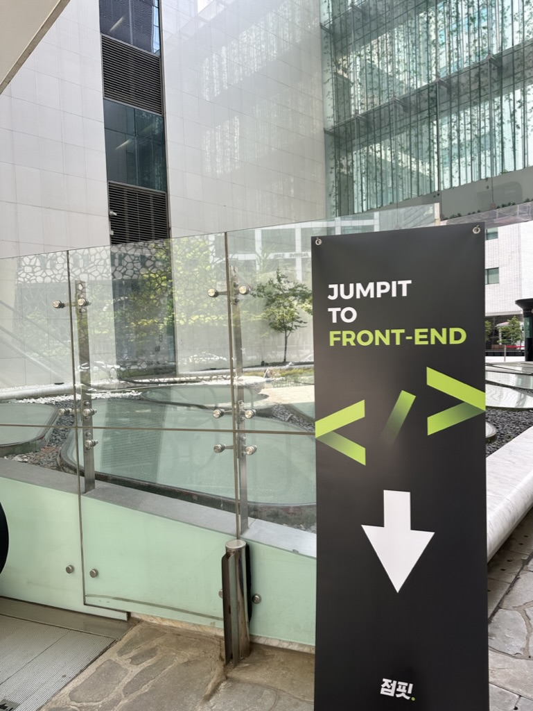
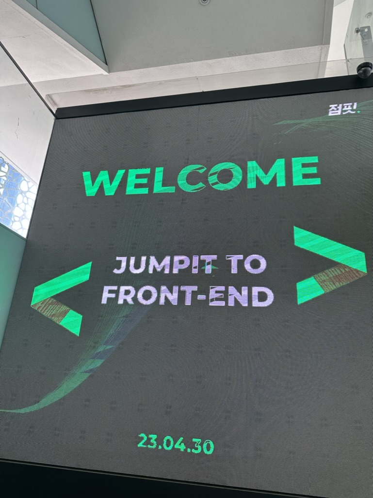
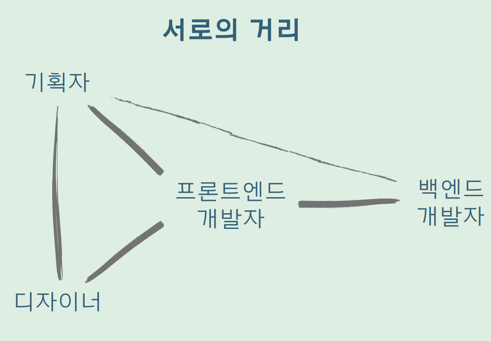
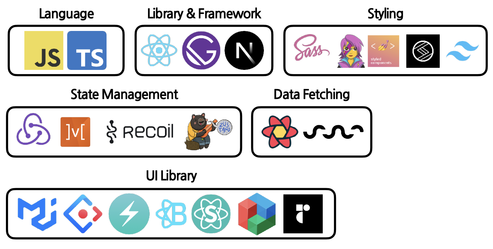

점핏에서 진행하는 FE 북콘테스트가 강남역 모나코스페이스에서 개최되었습니다.

4월 30일에 13:00~17:00 까지 200명의 오프라인 참여자와 2000여명의 온라인 참가자가 참가해 최신 FE 에 대해서 훑어보고, 방향성에 대해서 이야기 Q/A 하는 의미있는 시간이었습니다.

오프라인 참가자에게는 도서와 문구류를 선물로 점핏에서 제공하셧습니다!

## 강연 목록

1. 13:30 ~ 15:00 #1. 센스있게 일하는 FE 개발자 되기
   1. FE 개발자의 소프트 스킬과 하드 스킬 - 김태곤
   2. 협업?! 이렇게 한번해봐(FE 개발자가 타 직군과 대화를 해야하는 이유) - 유동균
2. 15:30 ~ 17:00 #2 Fit한 정보로 성장 부스트업
   1. FE 개발 트렌드(리엑트 개발 생태계와 Next.js까지) - 이인제[소플]
   2. 타입스크립트로 FE 개발 레벨업 - 장기효[캡틴판교]

## 강연 요약

1. FE 개발자의 소프트 스킬과 하드 스킬 - 김태곤
   1. 코드는늙는다 ⇒ 좋은코드를 만든다? 유지보수를 잘한다? 기준이 어떻게 될까
      1. 테스트가 용이해야한다
         - 어떻게 테스트를 용이하게 할까? ⇒ 기능별, 동작방법으로 코드를 구분화
      2. 읽기 쉬울 것
         - 함수, 변수의 이름을 명확하게 하는 것이 중요하다
         - 회사에서 프로젝트 내부에서 필요로 한다면 한국어로 하는것도 괜찮다. 어짜피 코드를 빌드하고 배포하는 과정에서는 변경되기 때문
      3. 일관성
   2. 테스트 코드는 가능한 부분부터 작성하다.

      [마틴파울러 리팩토링 - Google Search](https://www.google.com/search?q=마틴파울러+리팩토링&rlz=1C5CHFA_enKR1055KR1055&oq=마틴파울러+리팩토링&aqs=chrome.0.0i355i512j46i512j0i512l2j0i30j0i30i625.3373j0j4&sourceid=chrome&ie=UTF-8#imgrc=J5-kGgONxIZFjM%3A)

   3. 한 커밋에는 한 가지 문제만.
      1. 추적 가능하게 유지해야함!
      2. revert 할 때 돌아가야되기때문에
   4. 실험은 한 번에 하나씩만.
      1. 고생= (학습+프로젝트) x 2
      2. 배우면서 진행하는 것은 목표를 뚜렷하게 하고 실험은 한번에 하나씩만 하는게 의미있다.
   5. 나만의 학습 루틴을 만들어두자. (공부는 단기적 방향성이 아닌 장기적 방향성이기때문)
   6. 가장 좋은 방법은 교육 ( 누군가에게 배운것, 알게된것을 전달하는 것이 필요하다)
   7. 대체로, 옳은 기술은 없다. 상황에 따른 선택이 있을 뿐.
      1. 명확한 원칙이라는 것은 없다.
      2. 대체적으로 그 선택에 대한 있을뿐이라는 것을 생각해야함.
   8. FE 개발자는 절반쯤은 UX 전문가가 되어야 한다.
      1. 사용자의 불만, 요구사항에 대해서 알고 있어야됨.
      2. 미리 알기위해서는 사용자의 마음에서 UX/UI 적으로 생각을 해야된다.
      3. 그렇게 해야 추후에 작업에 대해서 2차, 3차적 반복적 행위가 생기지 않을 수 있다.
   9. 풀스택 엔지니어링 지식은 익히되 풀스택 엔지니어를 지향하지는 말자.
      1. 모든것을 포용적으로 잘할수없다.
      2. 그렇기때문에 해당직무에 전문성을 키우자.
      3. FE 개발에도 전문성이 점점 필요해져 가고있기때문에.
   10. ‘안 된다’ 는 말은 그만
   11. 거절의 3단계
       1. 숙고하고 대안을 제시하고 이득을 보자
   12. 이직은 늘 준비하는 것
       1. 결과보다는 과정에서 배우는 것, 얻는 것이 있기때문에 항상 준비하고 대처하자
   13. 이직할 때 볼 것 : 커리어, 연봉, 워라벨
       1. 아직 신입의 단계에서는 워라벨 보다는 진취적인 미래를 생각해보자.
   14. 커리어 = 시간 + 스토리
       1. 연차보다는 내가 그 회사에서 어떤 일을 했고, 배웠는지 가 더중요하다
       2. 의미없는 연차보다는 배울려고하고, 나만의 이야기를 기록하고 쌓아가자
   15. 성과급/복지보다는 연봉
   16. 가능하다면, 자신의 기술이 메인으로 사용되는 회사로 가는 게 좋다.
   17. 뱀의 머리보다는 용의 꼬리가 낫다.
       1. 배움이 될 수 있는 곳으로 가야한다.
       2. 현실에 안도하지말고 계속 배울려고 하자.
   18. 호인과 호구는 다르다.
   19. 실무능력 = 프로그래밍 스킬(구현) + 도메인 지식(문제 정의) + 커뮤니케이션(협업)
   20. 독서하듯 코드를 읽자.
       1. 코드에 관한 지식이 많을 수록 더 많이 더 오래 기억할 수 있다.
       2. 입력과 인출은 사용할수록 강화된다.
   21. 문제는 시스템으로 예방하자.
       1. Linter, Formatter, Typescript, SCM 등 쓰면서 시스템으로 문제를 쉽고 빠르게 파악하자.
   22. 가능한 작게 시작하다.
       1. **_YAGNI_**(You aren't gonna need it)는 프로그래머가 필요하다고 간주할 때까지 기능을 추가하지 않는 것이 좋다는 익스트림 프로그래밍(XP)의 원칙
       2. **_Kiss_**(Keep It Simple Stupid!)는 SW 설계는 되도록 간단, 단순하게 만드는게 좋다는 원칙
   23. Repeat Yourself (좋은 반복도 있다)
   24. Divide and Conquer(작게 나누어 정복)
   25. 질문에도 기술이 있다.
   26. 시간은 금이다
   27. 너무 열심히 안 살아도 된다
       1. 너무빠르게 발전하기를 원하면 번아웃이 오기쉽다
       2. 어제보다 하나라도 발전한 사람이 되어보자
   28. 전문가 얘기 너무 많이 듣지 말자.
       1. 시간이 지나면 전문가의 말을 자연스럽게 파악할 수 있다.
       2. 내문제는 내가 제일 잘 알기 때문에 나에게 집중하고 고쳐보자.

1. 협업?! 이렇게 한번해봐(FE 개발자가 타 직군과 대화를 해야하는 이유) - 유동균
   1. 소통의 중요성
      1. 프론트엔드의 역할은 중간다리 역할을 하고있다

         

   2. 소통을 잘 할려면??
      1. 맥락(소통의 중점 주제) 과 의도(소통을 통해 얻고싶은 부분)를 알아야한다
      2. 맥락+의도 = 불필요한 커뮤니케이션 비용이 절감됨
   3. 맥락과 의도를 챙기는 방법은?
      1. 목적지향적인 태도로 대화해보자(대화에서 이루고자하는 목적에 집중하자)
      2. 광범위한 이해도, 지식을 가지자

1. FE 개발 트렌드(리엑트 개발 생태계와 Next.js까지) - 이인제[소플]

   
   1. Next js
      1. Vercel 에서 만든 SSR(Server Side Rendering) FrameWork
      2. react 로 작업을 할때의 복잡한 설정을 쉽고 간편하게 사용할 수 있다.
      3. FE 와 BE 에서 하나의 프로젝트로 개발 할 수 있다.
   2. Q/A
      1. 개발자로써 능력을 키우는 좋은 방법은 어떤걸까요?
         - 나만의 프로젝트를 만들어서, 새로운 스킬을 연습해보자.
      2. 다양한기술 vs 한가지 기술 중 어떤 방법으로 공부를 하는게 좋을까?
         - 깊이있게 배워보는 것이 좋다는 것은 상태관리, 언어 등이 될 것 같다.
         - 라이브러리는 종류도 많고 발전속도가 빠르니 필요 상황에 따라서 배워보는 것을 추천
         - 결론적으로는 상황에 맞춰서 효율적으로 배우는게 좋아보임
      3. Next js 를 공부할려고 하는데 어떤 방향으로 공부하면 될까요?
         - Nextjs 를 공부해도 되는데 react 와 언어의 개념을 잘 구축한 다음에 넘어오는 것이 이해하고, 습득, 응용하는데 도움이 될것같다.
      4. Nextjs 의 13 버전이 나왔는데 바로 사용해봐야되는지?
         - 새로운 버전도 중요하지만 유행을 따라만 가다보면 혼동이 올수있으니, 프로젝트랑 회사의 상황을 보고 공부해야될 것같다.
   3. 마지막 말
      1. 지금은 어떤 도움이 있을까 생각을 하고 공부를 하겠지만, 그런 공부들이 누적이 되면 큰 값어치가 되어 돌아오니 꾸준히 오랫동안 해보는게 좋을거같다.

1. 타입스크립트로 FE 개발 레벨업 - 장기효[캡틴판교]
   1. 타입스크립트의 장점
      1. 사용자를 보호해준다, 사용자의 경험을 향상시켜준다.
   2. 타입스크립트 쉽게 접근하는 방법
      1. JSDoc 을 사용
         - 일정한 형식으로 코드에 설명을 추가하는 주석
         - // @ts-check (JS 의 code level 에서 타입지정가능)
      2. TS 를 당장 사용하기 어려우면 JSDoc 으로 시작해보는 걸 추천
   3. TS 관련 핸드북

      [Introduction | 타입스크립트 핸드북](https://joshua1988.github.io/ts/intro.html)

   4. Q/A
      1. 업무에서 방대한 기술스택을 요구하고 하면 어떻게 해야될까?
         - 모든것을 한번에 할려고하면 혼동이 오니 필요순위에 따져서 배우는것을 추천
      2. FE 개발자로서 ChatGPT 와 Compiler 를 사용하는 걸 어떻게 생각하나? 주니어 개발자로서
         - 검증하는 작업이 필요하다.
         - documents, mdn 등의 사이트로 옳바른 내용인지 확인해봐야함
      3. FE 개발자의 학습 방향성?
         - 재미있게 알려주는 학습, 나에게 적합하게 하는 방법에 대해서 생각해 스토리를 만들어라
      4. ChatGPT 에게 옳바른 질문을 하는법
         - 우리는 개발자이니 구체적으로 어떤 기술스택과 어떤 내용인지 등등을 명확히해서 요구해야함.
      5. TS 의 새로운 버전을 공부해야 될까?
         - 현재 내가 사용하는것과의 차이점을 파악
         - 파악한 후에 적용해야되는 범위부터 시작해서 후에 공부하는 방법으로 해야할듯함

## 결론

FE 개발자로서 옳바른 방향성에 대해서 항상 궁금하고 물음표였는데 이번 행사를 참가하면서 다른 사람의 이야기를 들어볼 수 있어서 의미있는 시간이었습니다.

앞으로 FE 개발자뿐 아닌 개발 컨퍼런스가 자주 열려서 의견을 공유하는 시간을 가지면 좋겠습니다

```toc

```
