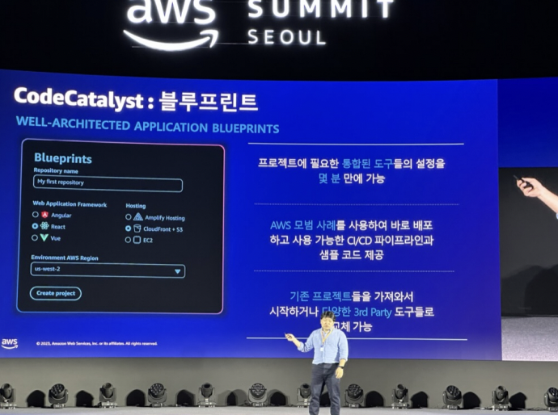

> AWS Summit 2023 2일차입니다.
> 1일차 행사에서는 AWS 의 기술들을 각 기업들이 어떻게 사용되고 발전되었는지가 주제였다면
> 이번 2일차에서는 난이도 별로 AWS에 대해서 설명해주고, 발전된 기술을 보여주는 시간을 가졋습니다.
> 저는 2일차에 참석해서 전문가들의 강연을 듣고 많은 것을 배우며 본 내용을 공유하고자 합니다.

---

<aside>
🔖 AWS Summit 2023 Day2 - TimeLine

</aside>

---

## 기조연설

> 윤석찬 AWS 수석 테크 에반젤리스트, 강동한 Flitto CTO,
> 송주영 LG U+ 연구위원, Holly Mescrobian AWS 서버리스 컴퓨팅 부사장


기조연설에서 윤석찬님과 송주영님, 강동한님의 인터뷰 형식 그리고 AWS Holly Mescrobian 님과 깜짝 출현하신 Werner Vogels AWS CTO 님의 사전 녹화영상으로 이루어졌습니다.

많은 흥미로운 주제중 저는 **입문자들이 AWS 를 어떻게 이용해보고 구성해볼지 에 대해서 생각해보자**라는 주제가 가장 흥미로웠습니다.

그것에 대해서 말씀하신 강연은 **AWS Application Composer**를 사용해 시각적으로 구성해보기와 **AWS Well-Architected** 활용해보기 입니다.

위 주제는 하단에 상세하게 기록해두었으니 한번 확인해보시면 될 것 같습니다.

### 보안과 데브옵스

**a. 보안**

- 보안이라는 것은 접근통제, 암호화, 마스킹, 감시, 추적, 적합한 인증과 권한 관리를 포함한 내용입니다.
- 되도록 접근 통제로 모든 것을 해결하려 하지 않고 다른 것도 잘 활용 해야한다.
- 보안그룹 ID, DB 패스워드를 평문으로 박지 않도록 주의 → AWS Secrets Manager, Parameter 등 활용 가능
- 보안과 암호화에 평소 관심이 많이 있어서 오후에 있는 Cisco 기업의 강연이 있는것을 알게되고 자세한 내용은 후반에 다시 다루겠습니다!

**b. 데브옵스**

- 송주영님께서 데브옵스의 5단게의 중요성에 대해서 말씀해주셧습니다
- Security > Reliability > > Automation > Organization. Standard. Governance
- 만약 거꾸로 정책부터 적용하려하다면 한계점이 생기게 된다 → **엔지니어를 묶어두게 되는 것**

---

## 가격은 절반, 성능은 두 배 확 달라진 Amazon EC2 알아보기

> 박연경 AWS 솔루션즈 아케텍트, 김현철 삼성전자 DevOps Engineer


### 1. 두번째 강연은 EC2 가 무엇인지, EC2 가 어떻게 바뀌었는지에 대한 박연경님의 강연이었습니다.

1. EC2 는 클라우드에서 가상 컴퓨팅 리소스를 제공하는 서비스로서 사용자들은 EC2 를 사용하여 AWS 클라우드에서 가상 서버를 설정하고 구성하여 필요에 따라 늘이고 축소할 수있습니다.
2. AWS 는 EC2 의 가용성과 성능을 더욱 향상해 가장 광범위하고 심층적인 인스턴스로 선택받을 수 있도록 발전하고 있다고 합니다
3. 다음은 AWS Nitro 시스템 아키텍처에 대해서 설명했는데 Nitro 는 고성능, 저비용, 보안 최적화의 가장 좋은 EC2의 독점 가상화 인프라인으로 소개했습니다.
   - 주요기능에는 Nitro Cards, Nitro 보안 칩으로 보안기능을 통해 가장 안전한 클라우드 플랫폼을 지원하고, Nitro 하이퍼바이저로 메모리 및 CPU 할당을 관리하고 베어 메탈 수준의 성능을 제공하는 경량 하이퍼바이저 입니다.
4. AWS 의 Graviton 을 사용해 최고성능, 전력 소비 절감, 비용절감, 가성비 향상을 할수 있다
   고합니다.

### 2. 요약하면 성능 개선된 EC2 는 아래와 같은 기능이 발전되었습니다.

a. 네트워크 특화(200Gbps) 6세대 인스턴스

- M, R, C 타입, 인텔 아이스레이크 기반, 최대 200Glops 네트워크 대역폭
- EBS 속도의 획기적 개선(대역폭 최대 80Gbps), PPS 2배 개선

b. Nitro v5 신규 런치

- 전 세대 대비, 60% 높은 PPS, 30% 낮아진 딜레이
- 와트당 성능 40% 향상 , c7 gn(미리보기)

c. AWs Graviton 3세대 출시

- 부동소수점 및 벡터 연산에 특화된 Graviton 3 아키텍처
- c7g, c7gn(미리보기)

d. HPC 고성능 컴퓨팅을 위한 신규 인스턴스 출시

- Hpc7g(Graviton 기반의 최초의 HPC 전용 인스턴스)
- Hocsid(인델 Xeon Scalable 기반)

e. 기계학습/추론을 위한 인스턴스 출시

- TRN1/TRNIn
- INF2

### 3. 박연경님 다음에는 삼성전자 김현철님께서 삼성개발팀에서 AWS EC2 를 사용한 이유에 대해서 설명해주셧습니다.


1. 삼성에서는 비용절감, ARM 기반 프로세서 약진, 저전력 탄소배출, 성능향상등의 이유로 AWS의 최신EC2 사용을 권장하고있습니다. 그럼으로서 3세대 Graviton 인스턴트를 사용 하는 것에 대해 강연해주셧습니다.
2. 그럼으로써 삼성은 API 서버의 응답속도를 개선하고, 인스턴스 비용을 15% 절감하는 효과
   를 얻었습니다

---

## AWS의 개발자를 위한 신규 서비스 소개

(CodeCatalyst, CodeWhisperer)

> 한정호 AWS 솔루션즈 아키텍트

### 1. CodeWhisperer

[ML 기반 코딩 도우미 - Amazon CodeWhisperer - Amazon Web Services](https://aws.amazon.com/ko/codewhisperer/)

두번째 강연은 AWS 의 강연에서 가장 흥미로운 부분이었다. 팀장님께서 일하다가 링크로 보여주셧을때부터 살펴보앗던 CodeWhisperer 이었다. 요즘 ChatGPT 부터 AI가 만들어주는 코드에 대해서 많은 이야기들이 많은데, 그런 것들을 경험해 보면서 AWS 에서는 어떻게 처리할까에 대해, CodeWhisperer 은 개발자에 AI 기술이 집중되어 있다는 생각이 들었다.
데모와 강연을 보는동안에 구체적인 아이디어에 감탄하고, 더 나아가 개발자의 습성, 습관을 파악하는 기술력에 놀람을 감추지못하엿다. 데모영상을 보고 다른 사람들도 CodeWhisperer 을 사용해보면 좋겠다.

### 2. CodeCatalyst

[통합형 개발 서비스 – Amazon CodeCatalyst – Amazon Web Services](https://aws.amazon.com/ko/codecatalyst/)

그 다음 보여준 기술은 AWS CodeCatalyst 입니다. CodeCatalyst 의 주요 기능에는 4가지가 있습니다.

1. 프로젝트 블루프린트 : 다양한 애플리케이션 워크로드를 빠르게 시작




b. 관리형 CI/CD pipeline : Flexsible 한 관리형 인프라에서 실행되는 자동화된 workflow


c. 개발/배포 환경 : 손쉬운 개발 및 배포환경 구성 및 자동화


d. 원활한 협업 : 쉽게 동료들 프로젝트에 초대하고 협업 도구와 프로젝트 리소스에 즉시 엑세스


간단히 말하면 개발을 위한 작업을 할때 FrontEnd, BackEnd, Build, Deplooy, CI/CD 등 개발에 필요한 모든 기능을 AWS CodeCatalyst 를 통해 한번에 설정, 운영, 관리할수 있다. 어쩌면 개발을 할 때 가장 많이 사용하는 시간이 설정과 개발환경에 대한 개발자들의 조정이라고 생각한다.

이런 부분을 AWS 가 간략화했다는 부분과 발상으로만 했던 것이 행위로 이루어진것에 대해서 감탄하게 되었다.이 글을 보는 분들도 바로 사용은 해보지 않아도 경험해 보았으면 좋겠다!

---

## 기업 소개 - Cisco

> Cisco


AWS 기술관련 강연을 들을까 아니면 기업에 대한 설명강연을 들을까 계획을 짜던 도중, 암호화에 대해서 평소 관심이 많아 보안관련 회사이자 우리회사 모기업인 인성정보가 후원사로 있는 Cisco 강연을 듣게되었습니다.

Cisco 에 대한 기업은 전날 EXPO 부스에서 살짝 본적은 있지만, 그때는 정확히 알지못했는데 회사기획서와 보안관련으로 찾아보고 나서 관심을 가져 기업에 대해 찾아보게 되었습니다. 제가 아는 Cisco 는 유무선 프로토콜 및 통신장비를 개발하는 HW 업체라고 알고있었습니다. 하지만 추후 Duo 를 통해 보안관련 플랫폼을 개발하게 되었다고 알게되었습니다.

강연에서는 제로 트러스트 보안 플랫폼인 Cisco 에 대해서 설명하고, 어떠한 인증방법으로 사용자의 존재 유무를 파악하고, 어떤 경우에 악의적 사용자임을 판별해서 결과를 반환하는지에 대해 알게되었습니다.

### Zero-Trust

- 애플리케이션이 클라우드로 이동함에 따라, 더 쉽게 접근이 가능
- 취약한 비밀번호, 비밀번호의 재사용, 계정 탈취 공격에 따른 공격자의 애플리케이션 접근 가능성 증가
- MFA 우회, 디바이스 보안상, 사용자 권한 및 비정상적인 행위 탐지 부재로 인한 보안 정책 우회


개인정보에 대한 보호와 함께 기업들의 IT 보안도 화두로 올라온 만큼, Cisco 의 Duo 그리고, AWS를 통한 행보가 엄청나다고 느껴지는 강연이었습니다. 이날 마지막 강연이 끝나고 Cisco 부스에 방문해 더 설명을 듣게 되었고 6월 27일 Cisco Connect Korea 2023 에 대해서 전달받게 되었습니다!

현재에는 알고있는 지식이 부족하지만 많은 정보들을 들으며 IT 인으로서 발전해야겠다는 생각을 하
게되었습니다.

[[시스코] Cisco Connect Korea 2022](https://www.cisco.com/c/m/ko_kr/ciscoconnect.html)

---

## 비즈니스 전쟁에서 승리하기위한 신무기 AWS AI/ML 서비스

> 구제훈 AWS 이그제큐티브 테크놀로지 파트너


요즘 ChatGPT, LaMDA, 바드, New Bing 과 같이 AI/ML 서비스들이 넘쳐나고 있다. 이럴때 우리와 기업들은 어떻게 선점하고, 적용할 수 있을까라는 생각을 하고있을거같다. 나도 비슷한 생각이 들어서 이번 강연을 선택해서 듣게되었다.

구제훈님께서 강연을 하며 말씀하신 6가지 AWS 서비스에 대해서 정리해서 전달해보겠다.

### 1. 개인화 서비스 - 고객 경험 맞춤화

a. 고객참여유도
b. 검색가능성
c. 효율성 및 수익

### 2. AICC(AI-Enabled Contact Center) - 지능형 콜센터

a. 셀프 서비스 가상 상담원
b. 실시간 통화 분석 및 상담원 지원
c. 통화 후 분석
⇒ 구제훈님께서는 AI/ML 부분에서 가장 강점을 보일 분야가 콜센터라고 하셧는데, 저도 이야기를 들어보니 AI/ML 이 추구하는 방향성에 제일 적합하다는 생각이 들었습니다.

### 3. 시계열 예측

### 4. 사기 탐지

a. 신규 계정 가입
b. 실시간 결제
c. 온라인 체크아웃
d. 로열티 및 프로모션
e. 그래프 신경망(GNN : Graph Neural Networks) 기반 사기탐지

- GNN 은 그래프 구조의 정보를 사용자 및 트랜잭션의 속성과 결합하여 악성 사용자와 이벤트를 정상 사용자의 이벤트와 구별하는 학습 활용

### 5. 지능형 검색 - AWS Korea

a. 자연어 및 키워드 쿼리
b. 비정형 문서 내장검색 결과

### 6. 산업 장비 모니터링- 스마트 팩토리

a. 설비 예지 보전
b. 시각적 품질 검사 자동화
c. 엣지 운영 효율성 향상
d. 수요 예측 및 재고 관리

아직 AI/ML 부분에 대해서 많이 낯설다. 아무래도 나는 기술을 발전시키는 역할보다는 아직 사용하는 역할이여서 그런 것 같다. 내가 사용을 하면서 느낀부분에서 틀린 부분이 있겠지만, 점차 AI/ML 이 삶에 필수적인 생각이 들지
만 아직 대체적인 것은 아닌것 같다. (상호보완적?)

앞으로 수많은 기업에서 AI/ML 을 어떻게 발전시킬지에 대해서 더 관심을 가지게 되는 시간이었다!

---

## MongoDB Atlas와 함께하는 Developer Data Platform

> 김준 MongoDB 솔루션 아케텍트 매니저


AWS Summit 에 참가해서, 아마 내가 그나마 제일많이 써본 DB 인 것 같다. 그래서 제일먼저 강연을 들어봐야겠다는 생각을 하게되었다.

Mongo DB 의 김준님께서는 2019년에 참가하고 그 이후 2023 년에 행사에 참여했다고 했다. 아무래도 많은 시간동안 Mongo DB 도 많은 기술적 발전을 했다고 생각한다. 개발자 입장에서 생산성을 증가시키고, 광범위하게 사용하기 위한 쿼리 기능과 트랜잭션 보장, 대규모 성능 및 고 가용성 제공을 위한 사당과 복제, 암호화와 풍부한 보안 기능으로 강력한 데이터 보완등 2023년의 Mongo DB 를 보면서 2022년 사이드프로젝트를 진행하면서 내가 MongoDB 를 사용해본 이유지 않을까? 라는 생각이 들었다.

Mongo DB 에서는 총 6가지의 키워드를 가지고 강연을 진행했다.

### 1. Atlas Search

a. 간단하고 단순한 사용
b. 통합된 관리형 서비스
c. 풍부함 Search 쿼리

### 2. Online Arching : Automated Data Tiering

a. 자동화 된 데이터 Tiering
b. 쉬운 쿼리 기능
c. 완전 관리형

### 3. Atlas Data Federation

a. Simplify Data Workflows

- 복잡한 데이터 파이프라인 없이 원활하게 데이터를 집계하고 선호하는 스토리지 위치에 결과를 저장합니다.

b. Power Real-Time Apps

- 데이터 이동 또는 변환 없이 AtLas 및 AWS S3상에서 Federation 쿼리 지원

c. Get Faster Insights

- MongoDB 데이터를 열(Columnar) 형식 파일 형식으로 변환 후, 다운스트림 팀에서 사용할 수 있도록 S3에 저장

### 4. Atlas Charts : Powerful & Effective Visualization

### 5. Atlas App Service

### 6. Future-Proof 기능 제공


MongoDB 의 2019 년과 2023 의 차이는 정확히 인지하지 못했다. 아무래도 2019년에 나는 뭘했을
까… 그렇기에 2023년 이후의 MongoDB 에 어떠한 발전이 있을지 지켜보면서 DB 에 관심을 가져
봐야겠다는 생각이 들었다!

---

## 2023 AWS Summit 행사 참여 후기

짧다면 짧을 길다면 길을 행사가 마무리가 되었다. 먼저 2일동안 행사에 참여할 기회를 주신 회사 선임분들께 감사합니다! 이번행사를 통해 AWS 에 대한 공부를 해야겠다는 필요성과 많은 사람들의 의견, 그리고 후원사들에 대해서 알게되었다. 경험을 해보면서 좋은 점도 있지만 아쉬운점은 내가 AWS 에 대한 지식이 더 많았으면 이해가 잘 되었을텐데 아쉬움이 있다.

올해 2023년의 행사는 끝났지만 내년에는 직접 AWS 기술들을 사용해보고 다뤄보면서 2024 행사에는 중급,고급, 더 나아가 EXPO 부스에서 많은 체험을 더 적극적으로 해봐야겠다는 생각이 들었다.

---

```toc

```
