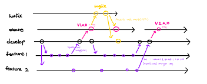

## Branch 구조와 전략을 세워보자!

코드를 작성하다보면 엄청나게 많은 Branch를 만들어야한다. 어떻게 구조를 잡아야할지 알아보자!



<br>

### Branch Structure(Gitflow 전략)

- **`master`**
  - 제품의 안정된 버전을 유지하는 브랜치, 배포 가능한 코드만을 허용하며, 직접적인 작업은 X
- **`develop`**
  - 개발의 중심이 되는 브랜치, 다른 개발자들과의 협업 및 새로운 기능 개발을 위해 사용
- **`feature`**
  - 새로운 기능 개발을 위한 branch, 개별 기능 또는 작업 단위로 생성 되며 develop 에서 분기됨
  - 개발이 완료되어 pr 이 merge 되면 해당 feature branch 는 삭제(줄기관리)
  - feature 은 작은 단위의 issue 가 된다.
  - 올바른 branch 관리를 하기위해 각 feature 은 해당하는 이슈의 문제만 해결한다!
- **`release`**
  - 배포를 준비하기 위한 branch, 배포 전 마지막 테스트와 버그 수정 진행
  - develop 에서 분기되며, 완료되면 develop과 master 로 병합.
  - 해당 작업을 진행할때는 문서화(Docs) 정리를 해서 이전 버전에대한 관리를 해야함
- **`hotfix`**
  - 긴급한 버그 수정을 위한 브랜치. master 에서 분기되어 수정 작업을 진행하고, 완료되면 develop과 master 로 병합.

<br>

### Work Flow

- 새로운 기능 개발 시: **`develop`** 에서 **`feature`** 를 생성하여 개발, 기능이 완료되면 **`develop`** 으로 병합
- 버그 수정 시: **`develop`** 에서 **`bugfix`,`fix`** 를 생성하여 수정 작업을 진행. 완료되면 **`develop`** 로 병합합니다.
- 배포 시: **`develop`** 의 안정된 상태에서 **`master`** 로 병합. 버전 태그를 추가하여 배포 버전을 명시

<br>

### Branch Naming Rule

- master, develop 고정
- feature/{issue-number}-{feature-name}
  - 칸반으로 이슈에 따른 작업을 진행하기로 했던 것같아서 위 방법을 사용하는게 어떨까
  - ex) feature/12-love-deajeon / feature/1-init-project 등과 같이
  - `-` 를 이용해서 연결, 대문자 사용 x
- release 는 release/1.3 과 같이 / 다음 버전 정보 등록

<br>

## 커밋 메세지를 명확하게 작성하는 방법은!?


커밋 메세지는 다른 개발자에게도 보여진다!

너무 자세하게 적어도 문제이고, 대충 적어도 문제인 커밋 메세지를 어떻게 명확하게 작성할까!? 찾아보자!!

<br>

### Commit Message Convention

- Commit Message 작성은 다음 한칸만 띄우고 작성하자 ⇒ **Ex) Feat: 하이루**

<br>

| 단어             | 사용법                                                                                        |
| ---------------- | --------------------------------------------------------------------------------------------- |
| Feat             | 새로운 기능을 추가                                                                            |
| Fix              | 버그 수정                                                                                     |
| Design           | CSS 등 사용자 UI 디자인 변경                                                                  |
| !BREAKING CHANGE | 커다란 API 변경의 경우                                                                        |
| !HOTFIX          | 급하게 치명적인 버그를 고쳐야하는 경우                                                        |
| Style            | 코드 포맷 변경, 세미 콜론 누락, 코드 수정이 없는 경우                                         |
| Refactor         | 프로덕션 코드 리팩토링                                                                        |
| Comment          | 필요한 주석 추가 및 변경                                                                      |
| Docs             | 문서 수정                                                                                     |
| Test             | 테스트 코드, 리펙토링 테스트 코드 추가, Production Code(실제로 사용하는 코드) 변경 없음       |
| Chore            | 빌드 업무 수정, 패키지 매니저 수정, 패키지 관리자 구성 등 업데이트, Production Code 변경 없음 |
| Rename           | 파일 혹은 폴더명을 수정하거나 옮기는 작업만인 경우                                            |
| Remove           | 파일을 삭제하는 작업만 수행한 경우                                                            |

<br>

### Commit Message 자세하게 알아보자

1. Commit message 는 영문으로, 한글로 작성 가능(단, 영문으로 작성시에는 동사를 사용)
2. 특수문자는 사용하지않는다.
3. 첫글자는 대문자로 작성한다.
4. 최대한 자세하고 직관적인 Commit message 를 작성하자
5. 이슈 번호는 # 으로 구분짓는다.
   - Ex) 내가 develop branch 에서 이슈번호 13번의 button 의 props 를 함수화하도록 리팩토링 요청을 받으면 ⇒ **feature/13—implement-button-props-function** 이라는 branch 를 만들어서 commit message 는 **Feat: #13 Implement button props as a function**
6. 귀여움을 위해 이모지를 써보는것도..!? (사용하는 회사도 있다고합니다!?)

   | 이모지 | 설명                                                              |
   | ------ | ----------------------------------------------------------------- |
   | 🎨     | 코드의 형식 / 구조를 개선 할 때                                   |
   | 📰     | 새 파일을 만들 때                                                 |
   | 📝     | 사소한 코드 또는 언어를 변경할 때                                 |
   | 🐎     | 성능을 향상시킬 때                                                |
   | 📚     | 문서를 쓸 때                                                      |
   | 🐛     | 버그 reporting할 때, @FIXME 주석 태그 삽입                        |
   | 🚑     | 버그를 고칠 때                                                    |
   | 🐧     | 리눅스에서 무언가를 고칠 때                                       |
   | 🍎     | Mac OS에서 무언가를 고칠 때                                       |
   | 🏁     | Windows에서 무언가를 고칠 때                                      |
   | 🔥     | 코드 또는 파일 제거할 때 , @CHANGED주석 태그와 함께               |
   | 🚜     | 파일 구조를 변경할 때 . 🎨과 함께 사용                            |
   | 🔨     | 코드를 리팩토링 할 때                                             |
   | ☔️    | 테스트를 추가 할 때                                               |
   | 🔬     | 코드 범위를 추가 할 때                                            |
   | 💚     | CI 빌드를 고칠 때                                                 |
   | 🔒     | 보안을 다룰 때                                                    |
   | ⬆️     | 종속성을 업그레이드 할 때                                         |
   | ⬇️     | 종속성을 다운 그레이드 할 때                                      |
   | ⏩     | 이전 버전 / 지점에서 기능을 전달할 때                             |
   | ⏪     | 최신 버전 / 지점에서 기능을 백 포트 할 때                         |
   | 👕     | linter / strict / deprecation 경고를 제거 할 때                   |
   | 💄     | UI / style 개선시                                                 |
   | ♿️    | 접근성을 향상시킬 때                                              |
   | 🚧     | WIP (진행중인 작업)에 커밋, @REVIEW주석 태그와 함께 사용          |
   | 💎     | New Release                                                       |
   | 🔖     | 버전 태그                                                         |
   | 🎉     | Initial Commit                                                    |
   | 🔈     | 로깅을 추가 할 때                                                 |
   | 🔇     | 로깅을 줄일 때                                                    |
   | ✨     | 새로운 기능을 소개 할 때                                          |
   | ⚡️    | 도입 할 때 이전 버전과 호환되지 않는 특징, @CHANGED주석 태그 사용 |
   | 💡     | 새로운 아이디어, @IDEA주석 태그                                   |
   | 🚀     | 배포 / 개발 작업 과 관련된 모든 것                                |
   | 🐘     | PostgreSQL 데이터베이스 별 (마이그레이션, 스크립트, 확장 등)      |
   | 🐬     | MySQL 데이터베이스 특정 (마이그레이션, 스크립트, 확장 등)         |
   | 🍃     | MongoDB 데이터베이스 특정 (마이그레이션, 스크립트, 확장 등)       |
   | 🏦     | 일반 데이터베이스 별 (마이그레이션, 스크립트, 확장명 등)          |
   | 🐳     | 도커 구성                                                         |
   | 🤝     | 파일을 병합 할 때                                                 |

<br>

## 코드를 규칙을 가지고 이쁘게 작성하는 방법!

이쁜 코드를 작성하기 위해서 사람들과 양식을 정해야한다!! 그래야 여러사람이 쓸모없는 시간을 코드 수정하는데 사용하지 않기 때문에!!

~~똑바로 안하면, 이렇게 비둘기가 돌아버린다!!~~


<br>

### Code Convention

1. Naming conventions

   - Components 는 Pascal Case(첫 단어 대문자)

     ```tsx
     Component.tsx Footer.tsx Mainbox.tsx
     ```

   - Non-components 는 Camel Case(띄어쓰기대신 대문자로 구분)

     ```tsx
     loveDeajeon.ts iWentGoingJeju.ts hungryReact.ts
     ```

   - Unit Test(단위테스트) 는 파일명과 동일하게 동작

     ```tsx
     MainItem.ts => MainItem.test.ts
     ```

2. Bug Avoidance(버그피하기)
   - null, undefined 일 조건은 optional chaning(?.) 연산자 사용
   - console.log 남기지 말기
   - side-effects 방지를 위해 외부데이터 props 로 받아서 사용
   - props 는 읽기전용으로 직접수정 x
   - 불필요한 주석은 남기지 않기
   - React 의 return 내부에 직접적인 함수처리 자제하기
   - 각 function , import 사이에 1줄 공백으로 구분하기
3. ES6

   - spread 연산자 사용
   - 구조분해할당 사용
   - let, const 사용 (var 은 사용금지)
   - 화살표함수 적극사용
   - 직접적인 null 을 체크해주는 코드 만들지말고 optional chaining 사용

4. TypeScript
   - 클래스, 타입, 인터페이스, 변수, 함수, 메서드에 Camel Case 사용(띄어쓰기 대신 대문자)
   - 상수는 Snake Case 사용(언더바), 그리고 상수이름 명확하게 할 것
   - 공백 2개또는 4개 설정하기
   - 변수, 함수, 매개변수, 함수 반환에 명시적 타입선언
   - 줄바꿈과 공백을 함수사이에 적극 사용해 구분, 연관된 코드끼리 붙어있도록 신경쓰기

<br>

### Prettier, ESlint, airbnb Js style

- prettier , eslint , airbnb js style 설치

  ```tsx
  yarn add prettier --save-dev --save-exact
  yarn add eslint --save-dev
  yarn add -peerdeps --dev eslint-config-airbnb
  ```

- eslint, prettier 충돌방지 설정

  ```tsx
  yarn add eslint-plugin-prettier eslint-config-prettier --save-dev
  ```

- eslint 설정파일 생성
  .eslintrc.json 파일 생성 시 아래와 같은 내용을 추가한다.

  ```json
  {
    "env": {
      "browser": true,
      "es6": true,
      "node": true
    },
    "extends": ["airbnb", "plugin:prettier/recommended"],
    "rules": {
      "react/jsx-filename-extension": [1, { "extensions": [".js", ".jsx"] }]
    }
  }
  ```

  - env 부분 ( document나 setTimeout과 같은 변수는 browser에서 사용되는 변수인데 설정하지 않는다면 ESLint에러로 인식하기 때문, 마찬가지로 node, es6에서 쓰이는 것들도 에러나지 않게하기 위해서 설정 )
  - extends 부분
    - 위에서 설치한 airbnb JS style 적용하기 위해 `airbnb` 추가한다.
    - `plugin:prettier/recommended`를 추가함으로써 prettier 규칙을 eslint 규칙에 추가하고 prettier와 충돌하는 eslint 규칙을 끄는 역할을 한다.
      결국 `eslint-config-prettier`와 `eslint-plugin-prettier`를 적용하기 위해서 작성한 것
  - rules 부분
    - `"react/jsx-filename-extension": [1, { "extensions": [".js", ".jsx"] }]`
      (Component.js와 같은 js파일에서 jsx문법을 사용했을 때 오류가 발생하는 문제를 해결할 수 있다.)
    - 아래의 내용을 참고하여 추가하고 싶은 rule이 있다면 추가적으로 작성하면 된다.

- prettier 생성파일 생성

  ```jsx
  // .prettierrc.js
  // 일부 규칙을 추가했다.
  // 그리고 주석을 적기 위해 json이 아닌 js파일로 생성하였음.

  module.exports = {
    singleQuote: true,
    // 문자열은 singleQuote로 ("" -> '')
    semi: true,
    //코드 마지막에 세미콜론이 있게 formatting
    tabWidth: 4,
    // 들여쓰기 너비는 4칸
    trailingComma: 'all',
    // 배열 키:값 뒤에 항상 콤마를 붙히도록 formatting
    printWidth: 80,
    // 코드 한줄이 maximum 80칸
    arrowParens: 'avoid',
    // 화살표 함수가 하나의 매개변수를 받을 때 괄호를 생략하게 formatting
    endOfLine: 'auto',
    // windows에 뜨는 'Delete cr' 에러 해결
  };
  ```

  - prettier는 기본적으로 프로젝트의 root에 있는 .prettierrc 파일에 적힌 규칙에 의해서 동작.
  - 프로젝트에 이 파일이 없으면 기본값으로 세팅된다.

- setting.json (ctrl + , 또는 cmd +,)

  ```json
  {
    // Set the default
    "editor.formatOnSave": true,
    // Enable per-language
    "[javascript]": {
      "editor.formatOnSave": false
    },
    "editor.codeActionsOnSave": {
      // For ESLint
      "source.fixAll.eslint": true
    },
    "eslint.alwaysShowStatus": true,
    "prettier.disableLanguages": ["js"],
    "files.autoSave": "onFocusChange"
  }
  ```

  - `"[javascript]": { "editor.formatOnSave": false },`
  - VSCode에 내장되어 있는 자바스크립트 포맷팅 기능을 사용하지 않고 Prettier 익스텐션을 사용하기 위해서 설정.
  - `"editor.codeActionsOnSave": { // For ESLint "source.fixAll.eslint": true },`ESLint에 의한 자동 수정 기능을 활성화하기 위해서 설정
  - `"eslint.alwaysShowStatus": true,`Vscode 하단 바에 ESLint도 표시되기 위해서 설정
  - `"prettier.disableLanguages": ["js"],`ESLint와 연동된 prettier를 사용하기 위해서 사용한다고 한다.
  - `"files.autoSave": "onFocusChange",`에디터 바깥으로 포커스가 이동 시 파일을 자동으로 저장하기 위해서 설정

<br>

## Folder Structure

프론트엔드 스택은 React(vite), Typescript, Jotai , Styled-components, React Query, Axios, react-router-dom 를 예시로 했습니다!

```javascript
src/
├── components/
│   ├── common/
│   │   ├── Button.tsx
│   │   └── Input.tsx
│   ├── layout/
│   │   ├── Header.tsx
│   │   └── Footer.tsx
│   └── features/
│       ├── Feature1/
│       │   ├── Feature1.tsx
│       │   ├── Feature1.styles.ts
│       │   └── Feature1.test.tsx
│       └── Feature2/
│           ├── Feature2.tsx
│           ├── Feature2.styles.ts
│           └── Feature2.test.tsx
├── hooks/
│   ├── useAuth.ts
│   ├── useData.ts
│   └── ...
├── pages/
│   ├── Home.tsx
│   ├── About.tsx
│   ├── Contact.tsx
│   └── ...
├── services/
│   ├── api.ts
│   └── ...
├── store/
│   ├── store.ts
│   └── ...
├── styles/
│   ├── globalStyles.ts
│   └── theme.ts
└── utils/
    ├── helpers.ts
    └── ...
```

- **`components/`** 폴더는 애플리케이션의 컴포넌트들을 저장하는 곳
  - **`common/`** 폴더는 여러 곳에서 사용되는 공통 컴포넌트를 저장
  - **`layout/`** 폴더는 애플리케이션의 레이아웃을 구성하는 컴포넌트들을 저장
  - **`features/`** 폴더는 각각의 기능에 대한 컴포넌트들을 저장
  - **`features/Feature1/`** 폴더에는 **`Feature1.tsx`** 컴포넌트와 해당 컴포넌트에 대한 스타일 및 테스트 파일을 저장
- **`hooks/`** 폴더는 사용자 정의 훅을 저장
  - **`useAuth.ts`** 파일은 인증과 관련된 커스텀 훅을 포함
  - 코드의 재사용성을 높이고 로직을 분리하는 데 도움
- **`pages/`** 폴더는 각각의 페이지 컴포넌트를 저장
  - **`Home.tsx`**, **`About.tsx`**, **`Sign.tsx`** 등의 파일을 의미
- **`services/`** 폴더는 데이터 통신과 관련된 파일 저장
  - **`api.ts`** 파일은 API 호출을 추상화하는 함수들을 포함
- **`store/`** 폴더는 전역 상태 관리를 위한 파일들을 저장 (jotai)
  - **`store.ts`** 파일은 상태 관리를 설정하고 초기화하는 데 사용
- **`styles/`** 폴더는 글로벌 스타일과 테마 설정과 관련된 파일 저장
  - **`globalStyles.ts`** 파일은 글로벌 CSS 스타일을 설정
  - **`theme.ts`** 파일은 애플리케이션의 테마 관련 상수나 스타일을 정의
  - styled-components 는 여기서 관리 x
- **`utils/`** 폴더는 유틸리티 함수나 도우미 함수를 저장
  - 이러한 함수들은 애플리케이션 전반에서 사용

```toc

```
