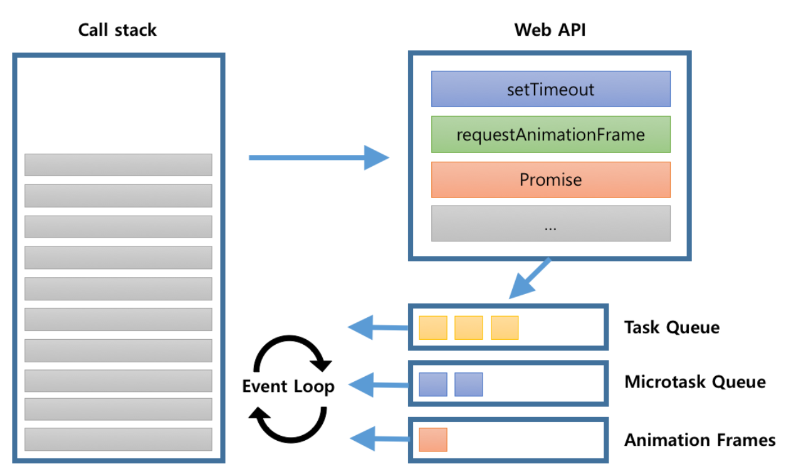
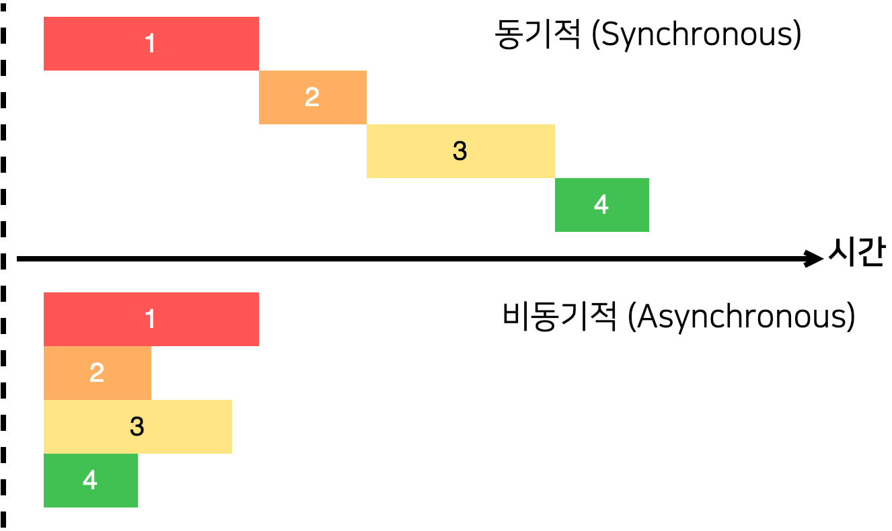
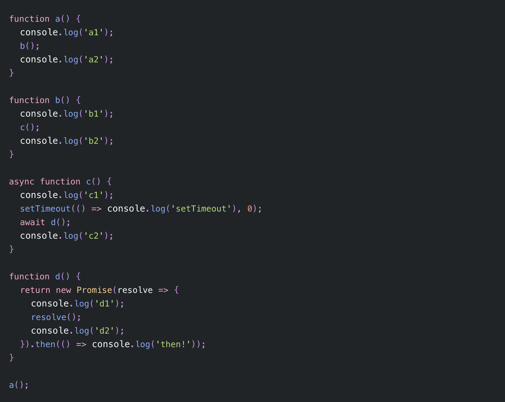

## What is Single Thread?

javascript 는 Single Thread 기반 언어 ⇒ 한 번에 하나의 작업만 수행 가능

하지만! 동시에 병렬처리 해야 될 때가 있다

그럴 때 javascript는 비동기 함수(setTimeout, ajax, Promise 객체 등)를 이용

<br/>

<aside>
💡 자바스크립트 엔진 자체는 Single Thread 지만 특정 API 들은 브라우저/런타임을 통해 Multi Thread 로 작업 가능
</aside>

<br/>

## 동기와 비동기

동기(Synchronous) : 먼저 시작된 작업이 끝날 때까지 기다리다가 새로 시작(한번에 여러작업이 아닌 하나씩)

비동기(Asynchronous): 작업이 끝날때까지 기다리지 않고 다음 작업 수행(한번에 여러작업을 처리함)



## 자바스크립트의 비동기 내장함수

자바스크립트는 비동기 내장함수를 제공함 ⇒ setTimeout, XMLHttpRequest, fetch()

### XMLHttpRequest

- 현재는 잘 사용하지 않음
- 관련 링크 : [https://7942yongdae.tistory.com/67](https://7942yongdae.tistory.com/67)

### **setTimeout / clearTimeout**

- setTimeout() 함수는 특정 코드를 바로 실행하지 않고 일정 시간동안 지연시킨 후 실행

```jsx
// 사용벙 : setTimeout(function() { 코드 or 콜백함수 }, 지연시간);

setTimeout(() => console.log('2초 후에 실행됨'), 2000);

// 지연 시간은 밀리초 단위로 기입. 1초 -> 1000
// 2초 후에 콘솔에 "2초 후에 실행됨" 출력
```

- clearTimeout() 함수는 setTimeout()을 취소, 중지시킨다.
- 디바운싱(debouncing) : 연이어 호출되는 함수들 중 마지막 함수(또는 제일 처음)만 호출하도록 하는 것

```jsx
// 사용법 : clearTimeout( [식별자] );

var timer;
document.querySelector('#input').addEventListener('input', function (e) {
  if (timer) {
    // input 될 때 마다 이벤트가 발생하지 않도록 n-1 번째 이벤트 취소
    clearTimeout(timer);
  }
  // n번째 이벤트만 남겨서 마지막 이벤트만 실행되게
  timer = setTimeout(function () {
    console.log('여기에 ajax 요청', e.target.value);
  }, 200);
});
```

## Promise

### What is Promise?

- Promise의 상태는 프로세스가 기능을 수행하고 있는 중인지, 기능 수행이 완료되어 성공했는지 실패했는지에 대한 상태를 의미
- promise의 객체는 new Promise()로 생성
- 콜백 함수를 선언할 수 있고, 콜백 함수의 인자는 resolve, reject

| 대기(pending)   | 진행 상태, Promise 객체가 생성되어 사용될 준비가 된 상태                                                        |
| --------------- | --------------------------------------------------------------------------------------------------------------- |
| 이행(Fulfilled) | 성공 상태, 비동기 처리에 의해 원하는 올바른 결과를 얻어와 그 결과를 정상적으로 처리하고자 resolve가 호출된 상태 |
| 거부(Rejected)  | 실패 상태, 무언가 잘못되어 예외로 처리하고자 reject가 호출된 상태                                               |

### promise 메서드 체인 (then/catch/finally)

- 체이닝(chaining) : 동일한 객체에 메서드를 연결할 수 있는 것
- then() - 성공(resolve) 시에는 then 메서드에 실행할 콜백 함수를 인자로 넘긴다.
- catch() - 실패(reject) 시에는 catch 메서드에 실행할 콜백 함수를 인자로 넘긴다.
- finally() - 성공/실패 여부와 상관없이 모두 실행 시에는 finally 메서드에 실행할 콜백 함수를 인자로 넘긴다.

```jsx
promise
  .then(data => console.log(data))
  .catch(err => console.error(err))
  .finally(() => console.log("always run")

// 위와 같이 메서드를 체이닝하면 함수를 호출한 주체가 실행을 완료한 뒤 자기 자신을 리턴한다.
```

### promise 처리 흐름 보기


new Promise() 메서드를 호출하면 대기(Pending) 상태가 된다.

이 때, 콜백 함수를 선언할 수 있고 인자는 resolve, reject이다.

```jsx
new Promise(); // new Promise() 메서드 호출, 대기 상태

new Promise(function (resolve, reject) {
  // 콜백 함수 선언
  // ...
});
```

콜백 함수의 인자 resolve를 실행하면 이행(Fulfilled) 상태가 된다.

```jsx
new Promise(function (resolve, reject) {
  resolve(); // 이행 상태
});
```

또한, 이행 상태가 되면 then()을 이용하여 처리 결과 값을 받을 수 있다.

```jsx
function getData() {
  return new Promise(function (resolve, reject) {
    var data = 'resolve';
    resolve(data);
  });
}

getData().then(function (resolvedData) {
  console.log(resolvedData); // "resolve"
});
```

콜백 함수의 인자 reject를 실행하면 거부(Rejected) 상태가 된다.

```jsx
new Promise(function (resolve, reject) {
  reject();
});
```

실패 상태가 되면 실패한 이유(실패 처리의 결과 값)를 catch()로 받을 수 있다.

```jsx
function getData() {
  return new Promise(function (resolve, reject) {
    reject(new Error('Request is failed'));
  });
}

getData()
  .then()
  .catch(function (err) {
    console.log(err); // Error: Request is failed
  });
```

### Promise.all / Promise.race

- `Promise.all`은 여러 작업을 동시에 처리하고, 작업이 모두 다 실행 완료되면 모두 다 반환한다.

```jsx
Promise.all([timer(1000), timer(2000), timer(3000)]).then((value) => {
  console.log(value);
});
// [1000, 2000, 3000] → 3000까지 모두 다 실행이 끝난 후에 다 반환
```

- `Promise.race`은 실행이 가장 빠른 결과를 반환한다.

```jsx
Promise.race([timer(1000), timer(2000), timer(3000)]).then((value) => {
  console.log(value);
});
// 1000 → 가장 빨리 실행된 1000 반환
```

## Fetch API

Fetch 함수는 자바스크립트에서 서버로 네트워크 요청을 보내고 응답을 받을 수 있도록 도와줌

Promise 기반으로 구성되어 있어 비동기 처리에 편리

Promise의 후속 처리 메서드인 then이나 catch와 같은 체이닝으로 작성 가능

```jsx
// fetch 기본 구조
fetch(url, options) // url, options
  .then((response) => response.json())
  // 첫 번째 then에서는 데이터 타입을 결정한다.
  .then((data) => {
    console.log(data);
  })
  // 두 번째 then에서는 데이터를 전달 받는다.
  .catch((error) => {
    console.log('error');
  });
// catch에서 에러 요청이 발생했을 때, 에러를 받는다.
```

## HTTP 요청 (Method)

- Create -> `POST` (해당 URI를 요청하면 리소스를 생성)
- Read -> `GET` (해당 리소스를 조회)
- Update -> `PUT` (해당 리소스를 수정)
- Delete -> `DELETE` (리소스를 삭제)

### GET - 존재하는 자원을 요청, 데이터 가져올 때 사용

default 동작이기 때문에 option을 작성 안해도 된다.

```jsx
fetch("https://jsonplaceholder.typicode.com/posts/1")
  .then((response) => response.json())
  .then((data) => console.log(data))

// json 형태로 파싱했기 때문에 json 형태의 데이터가 반환

{
  "userId": 1,
  "id": 1,
  "title": "sunt aut facere repellat provident occaecati excepturi optio reprehenderit",
  "body": "quia et suscipit↵suscipit recusandae consequuntur …strum rerum est autem sunt rem eveniet architecto"
}
```

### POST - 새로운 자원 생성 요청, 데이터 전달할 때 사용

method 옵션을 POST로 지정해주고, headers 옵션으로 JSON 포맷 사용한다고 알려줘야 하며, body 옵션에는 요청 데이터를 JSON 포맷으로 넣어준다.

```jsx
fetch("https://jsonplaceholder.typicode.com/posts", {
  method: "POST",
  headers: {
    "Content-Type": "application/json",
  },
  body: JSON.stringify({
    title: "Test",
    body: "I am testing!",
    userId: 1,
  }),
})
  .then((response) => response.json())
  .then((data) => console.log(data))

// JSON.stringify() 메서드는 JavaScript 값이나 객체를 JSON 문자열로 변환한다.

{title: "Test", body: "I am testing!", userId: 1, id: 101}
```

### PUT - 존재하는 자원 변경 요청, 데이터 수정할 때 사용

method 옵션만 PUT으로 설정한다는 점 외에는 POST 방식과 비슷

```jsx
fetch('https://jsonplaceholder.typicode.com/posts', {
  method: 'PUT',
  headers: {
    'Content-Type': 'application/json',
  },
  body: JSON.stringify({
    title: 'Test',
    body: 'I am testing!',
    userId: 1,
  }),
})
  .then((response) => response.json())
  .then((data) => console.log(data));
```

### DELETE - 존재하는 자원 삭제 요청

보내는 데이터가 없기 때문에 headers, body 옵션이 필요 없음

```jsx
fetch('https://jsonplaceholder.typicode.com/posts/1', {
  method: 'DELETE',
})
  .then((response) => response.json())
  .then((data) => console.log(data));
```

## async/await

then()을 연쇄적으로 체이닝하다보면 콜백지옥마냥 혼란에 빠짐 ⇒ async/await 으로 해결

async/await는 비동기 코드를 동기적인 코드인 것처럼 직관적으로 바꿔주는 역할을 함 → 비동기 코드에 순서를 부여

await는 반드시 async 함수 안에서 실행되며, async는 항상 Promise 객체를 반환

await 키워드는, then을 대신해 then을 체이닝한 것처럼 순서대로 동작한다.

```jsx
async function asyncFunc() {
  let response = await fetch('#');
  let data = await response.json();
  return data;
}
```

try-catch 구문을 사용하여 에러 처리를 할 수 있다는 것도 장점이다.

```jsx
async function asyncFunc() {
  try {  // try 안에 실행될 코드를 넣어주면 됨
	 	let response = await fetch('#');
		let data = await response.json();
	    return data;
  } catch (e) {  // catch에는 에러시 실행될 코드
    console.log("error : ", e)
  }
```

## AJAX

**A**synchronous **J**avaScript **A**nd **X**ML의 약자

서버와 비동기적으로 통신할 때 사용하는 API

AJAX를 사용하면 백그라운드 영역에서 비동기적으로 서버와 통신하여, 그 결과를 웹 페이지의 일부분에만 표시

AJAX를 사용함으로써 웹 페이지 전체를 다시 로딩하지 않고도, 웹 페이지의 일부분만을 갱신할 수 있음

## JSON

JavaScript Object Notation의 약자

데이터를 저장하거나 전송할 때 많이 사용되는 경량의 DATA 교환 형식

JSON은 사람과 기계 모두 이해하기 쉬우며 용량이 작아서, 최근에는 JSON이 XML을 대체해서 데이터 전송 등에 많이 사용

JSON 문서 형식은 자바스크립트 객체의 형식을 기반으로 만들어져서 자바스크립트 객체 표기법과 유사

특정 언어에 종속되지 않기 때문에 다른 프로그래밍 언어를 이용해서도 쉽게 만들 수 있음

## 자바스크립트 엔진(V8)


### Call Stack

함수 호출을 스택방식으로 기록하는 자료 구조

들어온 요청이 가장 밑에 쌓이고, 그 위에 스택이 쌓이는 구조

⇒ LIFO(Last In First Out) : 가장 나중에 들어온 작업 먼저 처리

javascript 는 Single Thread 기반 언어라서 하나의 Call Stack만을 가지고 한번에 하나의 Task만 처리

<br/>

### Memory Heap

객체가 저장되는 메모리 공간

콜 스택의 요소인 실행 컨텍스트는 힙에 저장된 객체를 참조

<br/>

## 실행 컨텍스트

식별자를 등록하고 관리하는 스코프

코드 실행 순서를 관리

모든 코드는 실행 컨텍스트를 통해 실행/관리

### 실행 컨택스트 동작순서

1. 전역 코드 평가 : 변수/함수 선언문을 실행 ⇒ 전역변수/함수를 전역 스코프에 등록시킴

2. 전역 코드 실행 : 런타임 시작되어 코드 순차실행 ⇒ 전역 변수에 값 할당, 함수 호출 ⇒ 함수 호출되어 함수 내부로 들어감

3. 함수 코드 평가: 함수 내부 매개변수와 지역 변수 선언문 실행 ⇒ 매개변수, 지역변수가 실행 컨텍스트가 관리하는 지역 스코프에 등록 ⇒ arguments 객체 생성 및 지역 스코프에 등록, this 바인딩 결정

4. 함수 코드 실행 : 런타임 시작되어 함수 코드 순차 실행 ⇒ 매개변수, 지역변수에 값 할당, 내부 매서드 실행

## 브라우저 환경

### Task Queue(Macrotask Queue, Event Queue)

비동기 함수의 콜백 함수, 이벤트 핸들러가 일시적으로 보관

setTimeout(), setInterval(), setImmediate() 와 같은 task 를 넘겨받음

### Microtask Queue, Job Queue

Promise, async/await, process.nextTick, Object.observe, MutationObserver 과 같은 비동기 호출을 넘겨받음

우선순위가 Task Queue 보다 높다

FIFO(First In First Out) 형태로 실행된다

await 을 만나면 작업을 중지하고 Microtask Queue 에 적재

### Animation Frames

requestAnimationFrame 와 같이 브라우저 렌더링과 관련된 task 를 넘겨받는 Queue

Microtask 보다 우선순위가 낮고, Macrotask 보다는 높다.

### Event Loop

콜 스택에 현재 실행 중인 실행 컨텍스트가 있는지, task Queue 에 대기중인 함수가 있는지 반복해서 확인

콜 스택이 비어있고 task Queue에 대기중인 함수가 있다면 이벤트 루프는 순차적으로 테스크 큐에 대기 중인 함수를 call stack 으로 이동

call stack 으로 이동한 함수는 실행됨

```jsx
console.log('Start!');

setTimeout(() => {
  console.log('Timeout!');
}, 0);

Promise.resolve('Promise!').then((res) => console.log(res));

console.log('End!');
```


## 응용문제 풀어보기 (자바스크립트 엔진 V8 - Chrome)



### 실행 순서

1. a() 함수 호출
2. a() 함수 ⇒ call stack 에 추가
3. **a1 출력**
4. b() 함수 호출
5. b() 함수 ⇒ call stack 에 추가
6. **b1 출력**
7. c() 함수 호출
8. c() 함수 ⇒ call stack에 추가
9. **c1 출력**
10. setTimeout 이 실행되어 task queue 로 이동
11. await d() 실행 ⇒ d () 함수로 이동
12. d() 함수 호출
13. d() 함수 ⇒ call stack 에 추가
14. **d1 출력**
15. Promise 생성 ⇒ then() 핸들러가 micro task queue 로 이동
16. **d2() 출력**
17. d() 함수가 call stack 에서 제거
18. then() 핸들러가 micro task queue 에서 call stack 으로 이동
19. **then! 출력**
20. c() 함수 종료
21. **c2 출력**
22. c() 함수 call stack 에서 제거
23. b() 함수 종료
24. **b2 출력**
25. b() 함수 call stack 에서 제거
26. a() 함수 종료
27. **a2 출력**
28. a() 함수 call stack 에서 제거
29. 타이머 만료되어 task queue 에서 call stack 으로 이동
30. **setTimeout 출력**

## 정리

- 이벤트 루프가 비동기 작업을 처리하는 우선순위는 **Microtask Queue -> Animation Frames -> Task Queue** 순이다.
- 이벤트 루프는 Microtask Queue나 Animation Frames를 방문할 때는, 큐 안에 있는 **모든 작업들을 수행**
- Task Queue를 방문할 때는 **한 번에 하나의 작업**만 call stack으로 전달하고 다른 Queue를 순회

```toc

```
