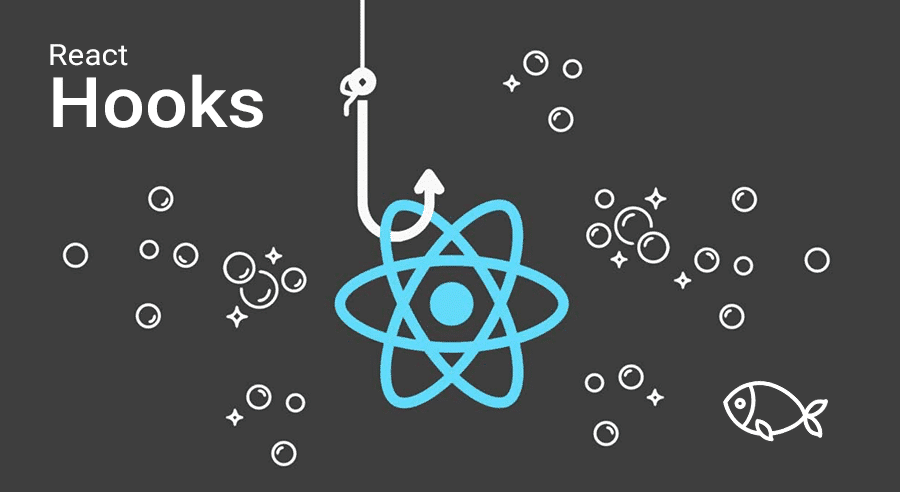

&nbsp;

# React 19에 도입될 Hooks

&nbsp;

- [use(Promise) & use(Context)](#usepromise--usecontext)
- [Form actions](#form-actions)
- [useFormState](#useformstate)
- [useFormStatus](#useformstatus)
- [useOptimistic](#useoptimistic)
- [Bonus: Async transitions](#bonus-async-transitions)
- [마무리](#마무리)

> ✨ 잠깐!!! <span> 모든 코드는 [테스트 환경](https://react.dev/community/versioning-policy#canary-channel)</span> 에서 테스트 가능합니다. (단, React 19에 포함될 예정이지만 최종 release 전에 API가 변경될 수 있음)

&nbsp;

## use(Promise) & use(Context)

&nbsp;

### Reference

- 컴포터는의 호출을 사용하여 Promise 또는 Context 와 같은 리소스의 값을 읽음
- use는 if문과 같은 조건문 루프 안에서 호출 가능
- use를 호출하는 함수는 컴포넌트 또는 Hook 이어야 함

```typescript
import { use } from 'react';

function MessageComponent({ messagePromise }) {
  const message = use(messagePromise);
  const theme = use(ThemeContext);
  // ...
```

Promise와 함께 호출될 때, use는 Suspense 및 Error Boundaries와 통합된다.

use가 pending 상태일 때 Promise가 전달완료 될 때까지 일시중단되고, use를 호출하는 컴포넌트가 Suspense 경계로 래핑된 경우 대체 내용이 표시된다.

Promise가 해결되면 Suspense 대체 내용이 use에서 반환한 데이터를 사용하여 렌더링된 컴포넌트로 대체되고 거부되면 가장 가까운 Error Boundaries의 대체 내용이 표시된다.

&nbsp;

> <h3>✋ 그럼 client에서 데이터를 가져올 때 third-party library가 필요 없을까?</h3>

> TanStack Query 는 단순히 Promise 를 해결하는 것 이상의 기능을 수행하므로 아직은 지켜봐야 된다고 생각함!
>
> 하지만 올바른 방향으로 나아가는 훌륭한 단계라고 생각하며, REST 또는 GraphQL API를 기반으로 단일 페이지 앱을 더 쉽게 구축할 수 있게 해줄 거라고 생각함

&nbsp;

### use 문법

```typescript
const value = use(resource);
```

<h4>1. 매개변수</h4>

resource : Promise, Context 형태의 데이터의 소스가 들어감

<h4>2. 함수 호출 출력 값</h4>

use Hook 을 사용하면 Promise 의 return 값이나 Context 의 return 값을 반환

&nbsp;

### use 사용해보기

<span style="color: gray">[context로 use를 사용하는 예시코드](https://codesandbox.io/p/sandbox/silly-dijkstra-68ryxj?file=/src/App.js)</span>

context가 use로 전달되면 useContext와 유사하게 작동된다. 단, useContext는 컴포넌트의 최상위 수준에서 호출해야 하지만, use는 if와 같은 조건문과 for와 같은 루프 내부에서 호출할 수 있고 사용이 더 유연하기 때문에 useContext보다 선호됨

```typescript

import { use } from 'react';

function Button() {
  const theme = use(ThemeContext);
// ...
```

Context value를 결정하기 위해 React는 Component tree를 검색하고 특정 Context의 위에서부터 가장 가까운 Context Provider를 찾음

버튼에 Context 전달하려면 버튼 또는 그 부모 컴포넌트 중 하나를 해당 Context Provider 로 래핑해야됨

```typescript
function MyPage() {
  return (
    <ThemeContext.Provider value='dark'>
      <Form />
    </ThemeContext.Provider>
  );
}

function Form() {
  // ... renders buttons inside ...
}
```

Provider 와 버튼 사이에 얼마나 많은 컴포넌트 레이어가 있는지는 중요하지 않다. Form 내부의 버튼이 use(ThemeContext)를 호출하면 **dark**를 값으로 받음

```typescript
function HorizontalRule({ show }) {
  if (show) {
    const theme = use(ThemeContext);
    return <hr className={theme} />;
  }
  return false;
}
```

&nbsp;

### use 사용시 주의점

- use Hook 은 Component 또는 Hook 안에서 호출해야 됨

- Server Component 에서 데이터를 가져올 때는 use 보다 async 와 await 사용해야 됨

- React 팀에서는 Client Component에서 Promise를 생성하는 것보다 Server Component에서 Promise를 생성하고 이를 Client Component로 전달하는 것을 선호함

- Client Component에서 생성된 Promise는 렌더링할 때마다 재생성됨

- Server Component에서 Client Component로 전달된 Promise는 다시 렌더링할 때 안정적임

- useContext와 마찬가지로 use(context)는 항상 이를 호출하는 컴포넌트 위에서 가장 가까운 Context Provider 을 찾음 => 위쪽으로 검색하며 use를 호출하는 컴포넌트 내의 Context Provider는 고려하지 않음

&nbsp;

### Server => Client로 데이터 스트리밍

<span style="color: gray">[Server => Client로 데이터 스트리밍하는 예시코드](https://codesandbox.io/p/sandbox/happy-shadow-8dg646)</span>

Server Component에서 Client Component로 Promise를 props로 전달하여 Server에서 Client로 데이터를 스트리밍할 수 있음

```typescript
import { fetchMessage } from './lib.js';
import { Message } from './message.js';

export default function App() {
  const messagePromise = fetchMessage();
  return (
    <Suspense fallback={<p>waiting for message...</p>}>
      <Message messagePromise={messagePromise} />
    </Suspense>
  );
}
```

그런 다음 Client Component는 받은 Promise를 props로 가져와서 use에 전달, 이렇게 하면 Client Component는 Server Component가 처음에 생성한 Promise에서 값을 읽을 수 있음

```typescript
// message.js
'use client';

import { use } from 'react';

export function Message({ messagePromise }) {
  const messageContent = use(messagePromise);
  return <p>Here is the message: {messageContent}</p>;
}
```

Message는 Suspense로 래핑되어 있으므로, Promise가 해결될 때까지 대체내용이 표시되고 Promise가 해결되면 Hook을 사용하여 값을 읽고 메시지 컴포넌트가 Suspense를 대체함.

&nbsp;

> <h3>📝 Note</h3>
>
> Server Component에서 Client Component로 Promise를 전달할 때, Server와 Client 간에 전달하려면 값이 [직렬화](https://developer.mozilla.org/ko/docs/Glossary/Serializable_object)가 가능해야 함
>
> 함수와 같은 데이터 유형은 직렬화할 수 없으며 이러한 것은 Promise의 값이 될 수 없다.

&nbsp;

> <h3>🤔 Server 또는 Client Component 에서 Promise를 해결해야 하나요? </h3>
>
> Promise는 Server Component에서 Client Component로 전달할 수 있고, Client Component에서 Hook을 사용하여 확인할 수 있고, Server Component에서 await을 사용하여 Promise를 확인하고 필요한 데이터를 Client Component에 프로퍼티로 전달할 수도 있다.
>
> 하지만 Server Component에서 await을 사용하면 await 문이 완료될 때까지 렌더링이 차단된다. 하지만 Server Component에서 Client Component로 Promise를 전달하면 Promise가 Server Component의 렌더링을 차단하지 못하게 됨

&nbsp;

### 거부된 Promise 처리하기

<h4 style="color:red">🚨 주의할 점 🚨</h4>
<div style="opacity:0.5; margin-bottom:30px">

use Hook 은 try-catch 로 호출할 수 없어서 아래 2가지 방법을 사용해야 됨.

사용하게 되면 **“Suspense Exception: This is not a real error!”** 에러가 발생함

</div>

<div style="margin-bottom:40px">
<h4>1. Error Boundary 가 있는 사용자에게 오류를 표시</h4>

<span style="color: gray">[예시코드](https://codesandbox.io/p/sandbox/funny-cherry-dzl7jd?file=/src/message.js)</span>

Promise가 거부될 때 사용자에게 오류 표시를 Error Boundary 를 사용하면 되고, 사용하려면 use을 호출하는 컴포넌트를 Error Boundary로 감싸면 된다.

그러면 사용하도록 전달된 Promise가 거부될 때 Error Boundary에 대한 대체내용이 표시된다.

</div>

<h4>2. Promise.catch 를 사용하여 대체 값 제공</h4>

Promise의 catch 메서드를 사용하려면 Promise 객체에서 catch를 호출 한 후, catch를 통해 오류 메시지를 인자로 받는 함수인 단일 인수를 받음.

catch에 전달된 함수가 반환하는 값은 무엇이든 Promise의 확인된 값으로 사용

```typescript
import { Message } from './message.js';

export default function App() {
  const messagePromise = new Promise((resolve, reject) => {
    reject();
  }).catch(() => {
    return 'no new message found.';
  });

  return (
    <Suspense fallback={<p>waiting for message...</p>}>
      <Message messagePromise={messagePromise} />
    </Suspense>
  );
}
```

&nbsp;

## Form actions

Form actions을 사용하면 `<form>`요소의 `action` 속성에 함수를 전달할 수 있고, 폼이 제출될 때 React가 이 함수를 호출함.

```typescript
<form action={handleSubmit} />
```

React 18에서 `<form action>` 프로퍼티를 추가하면 아래 경고가 표시됨

> Warning: Invalid value for prop `action` on `<form>` tag. Either remove it from the element or pass a string or number value to keep it in the DOM.

&nbsp;

### Form actions 사용해보기

<span style="color:gray">[Form action 예시코드](https://stackblitz-starters-j6yogy.stackblitz.io)</span>

addToCart 함수는 Server action이 아니고, 클라이언트 측에서 호출되는 비동기 함수다.
이렇게 하면 검색 양식과 같이 React에서 AJAX 양식 처리를 크게 간소화할 수 있지만, 이것만으로는 Form 제출(유효성 검사, 부작용 등)을 처리하는 것 이상의 기능을 하는 <span style="color:gray">[React Hook Form](https://react-hook-form.com)</span>과 같은 서드파티 라이브러리를 제거하기에 충분하지 않다.

> 위 예시에서 Form 제출 중 Form 제출 버튼이 비활성화되지 않는 것, Confirm 메시지 누락, Cart 업데이트 지연 등 오류를 발견할 수 있지만, react 19 와 추후 업데이트에서 hook이 추가될 예정이라고 함.

&nbsp;

### Reference

```typescript
<form action={search}>
  <input name='query' />
  <button type='submit'>Search</button>
</form>
```

<h4>1. Props</h4>

`<form>` 은 모든 <span>[common element props](https://react.dev/reference/react-dom/components/common#props)</span>을 지원함

`action`: URL 또는 함수이다. URL이 `action`으로 전달되면 폼은 HTML 폼 구성 요소처럼 동작. 함수가 `action`으로 전달되면 해당 함수가 폼 제출을 처리한다. `action`으로 전달된 함수는 async일 수 있으며 제출된 폼의 폼 데이터가 포함된 단일 인수로 호출된다. `<button>` , `<input type="submit">` 또는 `<input type="image">` 컴포넌트의 `formAction` 속성으로 `action` prop을 재정의할 수 있습니다.

<h4>2. 주의사항 </h4>

함수가 `action` 또는 `formAction`으로 전달되면 메서드 속성의 값과 관계없이 HTTP 메서드는 POST로 설정됩니다.

&nbsp;

## useFormState

<span style="color: gray">[예시코드](https://codesandbox.io/p/sandbox/damp-tree-yv2vzy?file=/src/App.js)</span>

useFormState Hook은 비동기 동작 기능을 지원하기 위해 만들어졌고, useFormState를 호출하여 마지막으로 제출된 `<form>`의 동작 결과에 접근할 수 있다.

컴포넌트의 최상위 수준에서 useFormState를 호출하여 `<form>` 동작이 호출될 때 업데이트되는 컴포넌트 상태를 생성해 useFormState에 기존의 `<form>` 동작 함수와 초기 상태를 전달하고, 이는 새로운 동작을 반환
이 동작은 `<form>` 내에서 사용되며, 최신 `<form>` 상태도 함께 전달됩니다. 전달한 함수에도 최신 `<form>` 상태가 전달됩니다.

<h4 style="color:red">🚨 주의할 점 🚨</h4>
<div style="opacity:0.5; margin-bottom:30px">

useFormState는 반드시 react가 아닌 react-dom에서 import를 해야된다.

</div>

&nbsp;

### useFormState 문법

```typescript
const [state, formAction] = useFormState(fn, initialState, permalink?);
```

<h4>매개변수</h4>

**fn** : `form`이 제출되거나 버튼이 눌렸을 때 호출할 함수이고 호출될 때 초기 인수로 `form` 이전 상태(처음에는 전달한 initialState, 이후에는 이전 반환 값)를 받은 후 `form` 동작이 받는 인수를 받음

**initialState** : 초기 상태로 설정하려는 값이고 어떤 직렬화 가능한 값이든 될 수 있다. 인수는 동작이 처음 호출된 후에는 무시됨.

**optional permalink** : `form` 수정하는 고유한 페이지 URL을 포함하는 문자열. 동적 콘텐츠가 있는 페이지에서 사용되며, 점진적 개선과 함께 사용된다. fn이 서버 동작이고 JavaScript 번들이 로드되기 전에 양식이 제출된 경우, 브라우저는 현재 페이지 URL 대신 지정된 permalink URL로 이동함. 상태를 전달하는 방법을 React가 알 수 있도록 동일한 Form Component가 대상 페이지에서 렌더링되도록 해야됨. Form 이 hydrated 된 후에는 이 매개변수가 영향을 미치지 않음.

<h4>함수 호출 출력 값</h4>

두 개의 값을 포함하는 배열을 반환

- 첫 번째 렌더링에서는 전달한 initialState이 되고 호출된 후에는 동작이 반환한 값이 된다.
- `form` 컴포넌트의 action prop으로 전달하거나 `form` 내의 버튼 컴포넌트의 formAction prop으로 전달할 수 있는 새로운 동작이 반환됨

&nbsp;

### useFormState 사용시 주의점

React 서버 컴포넌트를 지원하는 프레임워크와 함께 사용할 때, useFormState를 사용하면 JavaScript가 클라이언트에서 실행되기 전에도 양식을 인터랙티브하게 만들 수 있고, 서버 컴포넌트 없이 사용할 때는 컴포넌트의 로컬 상태와 동등함.

> ✋ 자세한 hook 사용을 확인할려면 [useFormState()](https://react.dev/reference/react-dom/hooks/useFormState)을 참조해주세요!

&nbsp;

## useFormStatus

<span style="color: gray">[예시코드](https://codesandbox.io/p/sandbox/serene-satoshi-2qyqy4?file=/src/App.js)</span>

Form submit 중에 pending 상태를 표시할 때 렌더링된 컴포넌트에서 useFormStatus Hook을 호출하고 반환된 pending 속성을 읽을 수 있음

&nbsp;

### useFormStatus 문법

```typescript
const { pending, data, method, action } = useFormStatus();
```

**pending** : boolean 값. true이면 부모 `<form>`이 submit을 pending 중 인것으로 나타냄.

**data** : FormData 인터페이스를 구현하는 객체로, 부모 `<form>`이 제출하는 데이터를 포함합니다. submit 할 data가 없거나 부모 `<form>` 이 없는 경우 null

**method** : `get` 또는 `post` 중 하나의 문자열 값. 부모 `<form>`이 GET 또는 POST HTTP 메서드로 제출되는지 여부를 나타냄. 기본적으로 GET 메서드를 사용하며 method 속성으로 지정할 수 있다.

**action** : 부모 `<form>`의 action prop에 전달된 함수에 대한 참조. 부모 `<form>`이 없는 경우 속성은 null. action prop에 URI 값이 제공되거나 action prop이 지정되지 않은 경우, status.action은 null

&nbsp;

### useFormStatus 사용시 주의점

useFormStatus hook은 `<form>` 요소 내에서 렌더링된 컴포넌트에서 호출되어야 한다. 이 훅은 부모 `<form>`에 대한 상태 정보만 반환하며, 동일한 컴포넌트나 하위 컴포넌트 내에서 렌더링된 <form>에 대한 상태 정보는 반환하지 않음!

> ✋ 자세한 hook 사용을 확인할려면 [useFormStatus()](https://react.dev/reference/react-dom/hooks/useFormStatus)을 참조해주세요!

&nbsp;

## useOptimistic

<span style="color: gray">[예시코드](https://codesandbox.io/p/sandbox/blue-wave-g9tj8k?file=/src/App.js)</span>

서버의 응답을 기다리는 대신, 인터페이스는 예상된 결과와 함께 즉시 업데이트한다. 사용자가 폼에 메시지를 입력하고 "보내기" 버튼을 클릭할 때, useOptimistic Hook을 사용하면 메시지가 실제로 서버로 전송되기 전에 "전송 중..." label과 함께 화면에 즉시 나타남. 이런 Optimistic 접근 방식은 속도와 반응성으로부터 사용자에게 긍정적 영향을 주기때문에 사용하는 것이 좋아보임!

&nbsp;

### useOptimistic 문법

```typescript
const [optimisticState, addOptimistic] = useOptimistic(state, updateFn);
```

<h4>매개변수</h4>

- **state** : 초기에 반환되는 값이며 action이 pending 중이지 않을 때마다 반환됨.
- **updateFn(currentState, optimisticValue)** : 현재 상태 및 addOptimistic에 전달된 Optimistic 값을 사용하여 결과적인 Optimistic 상태를 반환하는 함수이며 순수함수여야 함. updateFn은 currentState와 optimisticValue 두 개의 매개변수를 받습니다. 반환 값은 currentState와 optimisticValue의 병합된 값이 됨.

<h4>함수 호출 출력 값</h4>

- **optimisticState** : 결과적인 Optimistic 상태. action이 pending일 때 state 와 동일하고 아닐 때에는 updateFn에서 반환된 값과 같음.
- **addOptimistic** : Optimistic 업데이트가 있는 경우 호출할 dispatching function. optimisticValue라는 하나의 인수를 받으며, 이는 모든 유형의 값이며 updateFn을 state와 optimisticValue와 함께 호출

> ✋ 자세한 hook 사용을 확인할려면 [useOptimistic()](<https://react.dev/reference/react/useOptimistic#noun-labs-1201738-(2)>)을 참조해주세요!

&nbsp;

## Bonus: Async Transitions

[예시코드](https://stackblitz-starters-qrc5hb.stackblitz.io)

> 😂 이 기능은 아직 React 문서에 문서화되지 않았지만, 관련 [풀 리퀘스트](https://github.com/facebook/react/pull/26621)에서 더 많은 정보를 확인할 수 있다.

React의 Transition API는 UI를 차단하지 않고 상태를 업데이트할 수 있다. 예를 들어, startTransition 호출로 상태 변경을 감싸 사용자의 마음이 변해서 이전 상태 변경을 취소할 수 있도록 할 수 있다.

다음 예제는 이 Transitions API를 사용한 탭 내비게이션을 만드는 것이다. Posts를 클릭한 다음 즉시 Contact를 클릭하게 되면 Posts의 느린 렌더링이 중단된 것을 확인해 볼 수 있다. 그러게 되면 Contact 탭이 즉시 표시된다.

상태 업데이트가 transition이 되었기 때문에 느린 재렌더링이 사용자 인터페이스를 멈추지 않는 결과가 나오게 된다.

```typescript
function TabContainer() {
  const [isPending, startTransition] = useTransition();
  const [tab, setTab] = useState('about');

  function selectTab(nextTab) {
    // instead of setTab(nextTab), put the state change in a transition
    startTransition(() => {
      setTab(nextTab);
    });
  }
  // ...
}
```

React 18.2에서는 이미 useTransition hook이 사용 가능하다. React 19에서 startTransition에 async 함수를 전달할 후 React가 transition 시작하기 위해 기다릴 수 있는 기능이 새로 추가될 예정이라고 함.

이 기능은 AJAX 호출을 통해 데이터를 제출하고 transition에서 결과를 렌더링하는 데 유용해보임. transition pending 상태에서는 데이터를 submit 하는 것으로 시작된다.

React가 startTransition으로 래핑된 `<form action>` 핸들러를 호출하여 현재 페이지를 차단하지 않도록 해준다.

&nbsp;

## 마무리


이러한 기능들은 클라이언트 전용 React 앱(Vite로 번들링된 앱 등등)에서도 사용할 수 있습니다. 이러한 기능을 사용하기 위해 Next나 Remix와 같은 SSR 프레임워크가 필요하지는 않지만, 서버 통합형 React 앱에서도 작동함

이러한 기능들을 사용하면 React에서 데이터 가져오기와 양식 처리가 상당히 쉬워질 것 처럼 보이지만 hooks을 통합하여 훌륭한 사용자 경험을 만들려면 아주 복잡해보임.

> 반면에 [react-admin](https://marmelab.com/react-admin/)과 같은 프레임워크를 사용하면 낙관적 업데이트가 내장된 사용자 친화적인 양식을 사용할 수 있을 것 같음!

좋은 기능이고 특히! Form 관련해서는 원하는 요구사항이 많은 것으로 보이는데 너무 늦게 나오지 않았는지.. 생각하게 된다! ~~뭐 그만큼 오류가 많고 많이 싸웟나보지?~~

위 기능들은 현재도 업데이트 되었지만 아직은 테스트 단계이므로 React 19를 조용히 기다려보자!

> 17.0.0이 20년 10월 20일 이고 18.0.0이 22년 3월 29일이니깐... 뭐 곧 나오지 않을까????

&nbsp;

> <h4>출처</h4>
>
> https://marmelab.com/blog/2024/01/23/react-19-new-hooks.html
>
> https://react.dev/
>
> https://github.com/facebook/react/issues

#

```toc

```
