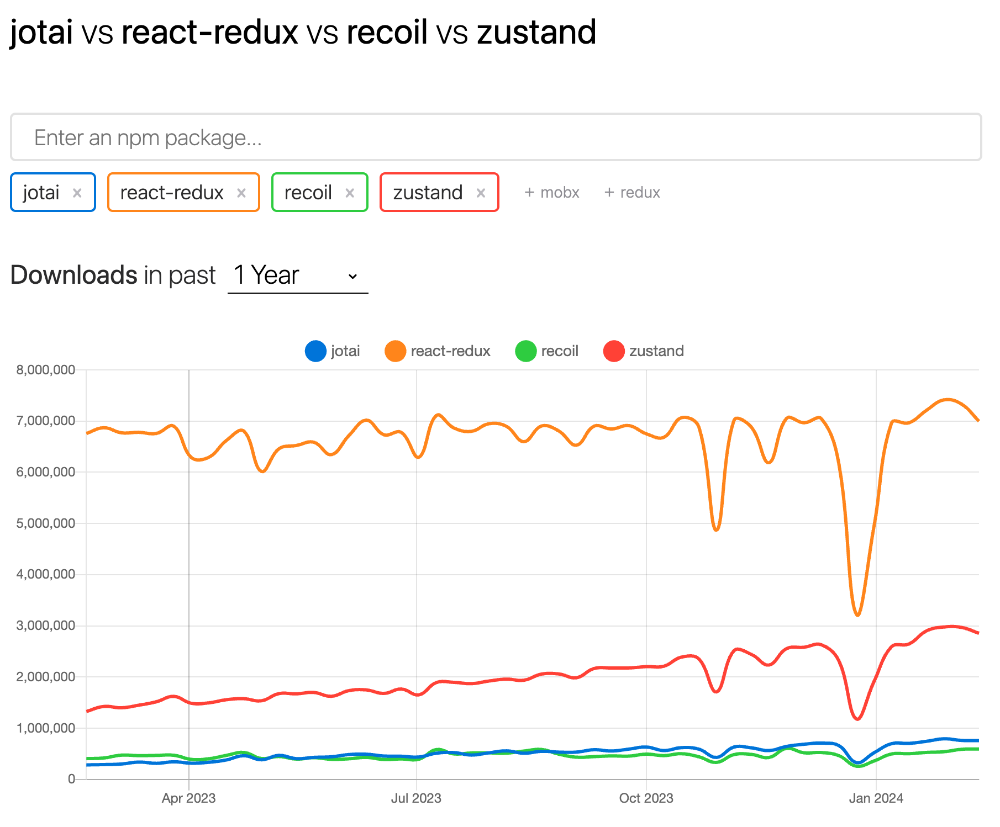
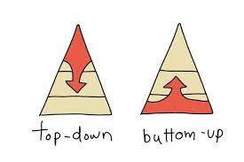
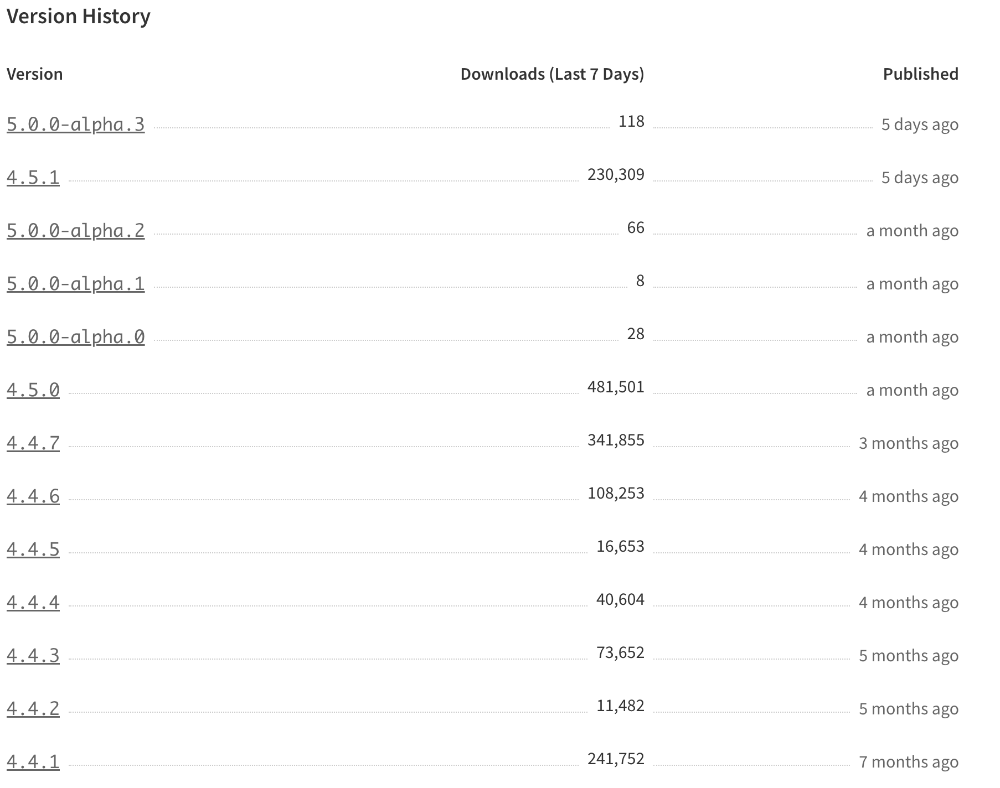

&nbsp;

## 난 왜 zustand 공부를 시작했을까?

&nbsp;

### 회사에서

```typescript
const tabOneRef = React.useRef<ITabOneRef>(null);
const rmTimerRef = React.useRef<ITimerRef>(null);
const cmTimerRef = React.useRef<ITimerRef>(null);
const printRef = React.useRef<HTMLDivElement>(null);
const sessionOutAlertRef = useRef<IAlertRef>(null);
const isRMLogAdded = useRef<boolean>(false);
const timeLogId = useRef<string>(uuidv4());
const [memoList, setMemoList] = useState([] as any);
const [handleSave, setHandleSave] = useState<boolean>(false);
const [claim, setClaim] = useState([] as any);
const [pageStatus, setPageStatus] = useState(false);
const [rmTimeLogs, setRmTimeLogs] = useState<any>();
const [cmTimeLogs, setCmTimeLogs] = useState<any>();
const [totalRMTime, setTotalRMTime] = useState(0);
const [totalCMTime, setTotalCMTime] = useState(0);
const [nextURL, setNextURL] = useState([] as any);
const [measureList, setMeasureList] = useState([] as any);
const [rmInfo, setRmInfo] = useState<RpmInformation>();
```

위처럼 회사에서 useState, useEffect, useRef 등 Hook을 하나의 컴포넌트에서 남발해서 사용하고 있다는 것을 알게 되었다. **(위 사진은 극히 일부의 코드를 수정해서 보여준란걸..😂)**

그렇게 되니 컴포넌트 내부의 요소를 변경하거나, 렌더링이 일어날 때 state, ref의 동적인 값들이 초기화되거나 생각하지 못한 데로 작동하게 되어버리게 되었다.

거기에 새로운 기능 개발을 하게 되었을 때 많은 요소 영향력을 생각해야 되게 되고, useEffect의 의존성 배열이 무한히 추가되는 현실까지 직면하게 되었다. ㅠㅠ

이런 상황까지 되어버리니 회사 내부에서는 프로젝트에 상태관리를 도입해서 렌더링이 발생하는 시점, 변수의 선언, 전역 변수의 props 전달 등 많은 것들을 효율적으로 관리 할 수 있다고 판단해 상태를 중앙에서 변수를 관리하자는 이야기가 나왔다.

이런 회의를 거쳐서 여러 가지 상태관리 라이브러리가 후보군에 올라오게 되었다.



> recoil, redux, zustand, jotai 등등..

&nbsp;

### Top-Bottom vs Bottom-Top



> Top-bottom 방식 : 단일 중앙 스토어를 사용하여 모든 컴포넌트의 상태를 관리
>
> Bottom-top 방식 : 각 컴포넌트가 자체 상태를 관리하고 컴포넌트는 자식 컴포넌트에 상태를 전달하고 필요에 따라 상태를 업데이트

회사에서 추구하는 상태관리 방식은 **top-bottom** 이였다. 선택한 이유는 아래와 같다 👇

- 중앙 스토어를 통해 데이터 흐름을 추적을 용이
- 모든 컴포넌트는 중앙 스토어에 동일한 데이터에 접근하기 때문에 데이터 불일치 문제 해결 가능
- 여러 컴포넌트에서 재사용하기 쉬움
- 코드의 모듈화와 유지 관리를 용이
- 중앙 스토어를 이용해 확장, 병렬이 가능
- Redux 와 같은 라이브러리는 강력한 개발자 도구가 있어서 상태 변경 추적, 디버깅에 효율적

top-bottom을 선택하는데 반대의 의견도 있었다. 러닝 커브가 높고 구조가 상당히 복잡할 수도 있다. 또한 많은 양의 보일러 플레이트 코드를 작성해야 되고 유연성이 부족할 수 있다.

**하지만 이미 구조화된 프로젝트에 중앙 스토어적인 라이브를 선택하는 것이 더 효율적이라고 판단해 top-bottom 구조를 선택하게 되었다**

~~대부분 사람이 상태관리 라이브러리를 사용해봐서 러닝 커브는 문제가 되지않는다는 판단을..~~

그러므로 Bottom-Top 구조인 recoil 이랑 jotai는 탈락

&nbsp;

### redux 와 zustand 중 선택 과정

redux 와 zustand 를 가지고 아래와 같이 토론하게 되었다. Top-Bottom 라이브러리에서는 어떤 것을 고르면 좋을까?

먼저 기준표를 작성하고 그것에 대해 점수를 부여하게 되었는데 대략 아래와 같다 👇

- 러닝 커브가 있어도 되지만 도입이 시급하다 => redux의 러닝 커브는 높은 편이라서 **zustand 선택**
- 보일러 플레이트 성향이 낮아야 된다. => redux에서 보일러 플레이트 성향이 높은 편이라서 유연성 떨어진다고 판단해서 **zustand 선택**
- 구조적으로 컴포넌트에서 상태를 관리하는 성향의 라이브러리 찾아야 된다. => **zustand 선택**
- 사용자가 많고 github release가 잘 이루어져야 된다. => 사용자의 수와 Npm trends에서 높은 점수를 받는 Redux 이지만 선점효과라 판단해서 **zustand 선택**
- 렌더링을 관리하고 줄일 수 있어야 한다. => 판단 기준에 미흡, 별 차이 없음

> 🙋‍♂️ 잠깐! 공식 홈페이지에서도 zustand와 redux는 개념적으로 상당히 유사하며, 변경 불가능한 상태 모델(immutable state model)을 기반으로 하고있지만 redux는 래핑 방법이 context providers로 된다는 점에서 차이가 보인다고 기록되어있다

이런 이유들 때문에 내가 맡고 있는 회사 프로젝트에서는 **zustand** 을 선택하기로 결정되었다!


&nbsp;

## zustand 그래서 넌 누군데??

[공식 홈페이지](https://zustand-demo.pmnd.rs/) / [Github](https://github.com/pmndrs/zustand?tab=readme-ov-file) / [Npm](https://www.npmjs.com/package/zustand)

- 간결한 플럭스(Flux) 원칙을 바탕으로 작고 빠르게 확장 가능한 상태 관리 라이브러리
- 특정 라이브러리에 종속되어 만들어진 도구가 아니여서 Vanilla Javascript 에서도 사용 가능
- zustand는 발행/구독 모델을 기반으로 만들어졌다. 스토어의 상태 변경이 일어날 때 실행할 리스너 함수를 모아 두었다가, 상태가 변경되었을 때 등록된 리스너에게 상태가 변경되었다고 알려준다.
- 스토어를 생성하는 함수 호출 시 클로저를 사용해서 상태를 변경, 구독, 조회하는 인터페이스를 통해서만 상태를 다루고, 실제 상태는 생명 주기에 따라 처음부터 끝까지 의도하지 않는 변경에 대해 막을 수 있다.
- 보일러 플레이트가 최소화된 상태관리 solution. 스토어 형태임에도 굉장히 간단하게 상태관리 구성이 가능하다.
- 익히기가 굉장히 쉽고 그만큼 공식문서 정리도 잘 되어 있다.

<hr/>

> <h2>💡 더 알아보자!</h2>
> &nbsp;
> <h4>Provider로 감쌀 필요가 없는 이유</h4 >
>
> 각 컴포넌트가 자체 상태를 캡슐화하도록 설계되어있음.
>
> 트리 구조를 기반으로 상태를 관리하기 때문
>
> useSelector hook을 제공하여 컴포넌트가 필요한 상태만 선택적으로 구독할 수 있도록 하기 때문
>
> <h4 >zustand가 context 보다 리렌더링이 줄어드는 이유</h4 >
>
> zustand는 컴포넌트가 구독한 상태가 변경되었는지 자동으로 감지
>
> memoization을 사용해 컴포넌트가 리렌더링될 때마다 컴포넌트 재실행을 방지
>
> shallowEqual 비교를 사용해 상태 변경이 실제로 발생했는지 여부를 확인
>
> 결과적으로 50%이상의 리렌더링을 줄이게 되었고, 페이지 로딩 속도 20% 향상, 사용자 인터페이스 반응 속도 향상에 10%를 기여하게 될 수 있다.

&nbsp;

## 어떻게 쓰는지 알아보자!!

zustand의 사용법은 간단하다. 스토어를 만들고 원시 타입. 객체, 함수를 넣으면 된다. 공식문서에서도 zustand를 사용하는데 41줄의 예제코드만 다루고 있다. 한번 시작해보자!!

### 기본 문법

```typescript
const useDataFilterState = create<DataFilterProps>((set, get) => ({
  dataId: 'all',
  setDataId: (dataId: string) => set({ dataId }),
  dataList: [],
  loadDataList: async (dataParameter) => {
    const responseData = await fakeDataAPI.getData(dataParameter);
    if (responseData.res === 200) {
      set({ dataList: [] });
      return [];
    } else {
      set({ dataList: responseData.data });
      return responseData.data;
    }
  },
}));

export { useDataFilterState };
```

위 코드는 zustand 공식 문서에서 기록된 사용법을 보고 작성한 코드다.

`useDataFilterState` 라는 객체 안에 state로 사용할 키와 값을 담아주고, create 함수로 묶어준다. parameter로 넘겨주는 set을 이용해서 state 내부에 있는 값을 변경해줄 수 있고, get 을 이용해서 state 내부에 직접 접근해서 값을 조회하고 변경할 수 있다. 그리고 액션도 store의 키 값 형태로 담기며, sync action도 포함 가능하다.

&nbsp;

```typescript
const { dataId } = useDataFilterState((state) => ({
  dataId: state.dataId,
}));

const { dataId } = useDataFilterState(({ dataId }) => ({
  dataId,
}));

const { dataId } = useDataFilterState.getState().dataId;
```

위 코드로 사용할 컴포넌트에 `useDataFilterState`을 import 한 후에 dataId 를 가져와서 사용할 수 있다.

상태 값을 가져와서 사용하는 방법에는 다양한 방법이 있는데 위에 보여주는 3가지 문법 모두 사용 가능 하지만, `setState`와 `getState`를 분리하는 3번째 방법으로 통일하거나, 2번째 방법을 사용하는 것이 좋지 않을까 싶다!!

&nbsp;

### Immer & Persist

사실 사용법은 저게 전부다 ㅋㅋ


하지만 깊게 들어가면 무진장~~~ 많다 자체에서 지원가능한 미들웨어부터.. 시작해서 라이브러리까지!

일단 Immer 이랑 Persist에 대해서 먼저 알아보자

```typescript
const useDataFilterState = create<DataFilterProps>(
  persist(
    (set, get) => ({
      dataId: 'all',
      setDataId: (dataId: string) =>
        set(
          produce((state) => {
            state.dataId = dataId;
          }),
        ),
      dataList: [],
      loadDataList: async (dataParameter) => {
        const responseData = await fakeDataAPI.getData(dataParameter);
        if (responseData.res === 200) {
          set(
            produce((state) => {
              state.dataList = [];
            }),
          );
          return [];
        } else {
          set(
            produce((state) => {
              state.dataList = responseData.data;
            }),
          );
          return responseData.data;
        }
      },
    }),
    {
      name: '여기에 로컬스토리지 key name이 들어갑니다',
      storage: createJSONStorage(() => sessionStorage),
    },
  ),
);
```

<h4>1. Immer</h4>

> zustand middleware Immer 와 npm에서 Immer 라이브러리 둘다 사용 가능

- 불변성을 유지하는 데 사용함.
- Immer는 변경하려는 상태를 수정하는 대신 수정하려는 상태의 "draft"를 작성할 수 있고 이 draft는 불변성이 보장된 상태이며, Immer가 이 변경 사항을 처리하여 최종적으로 새로운 불변 상태를 생성한다.
- produce 함수를 사용하여 immer 미들웨어를 추가하여 함수 안에서 상태를 직접 수정할 수 있도록 만들 수 있다.

<h4>2. Persist</h4>

- 상태를 로컬 스토리지에 저장하고 복원하는 데 사용
- persist 함수는 두 번째 매개변수로 name, storage을 받는데 name을 사용해 로컬 스토리지에 저장할 때 사용할 키로 지정, 랜더링 되면 상태값이 복원된다. 그리고 storage는 기본값으로 localStorage이고 원하는 storage에 저장할 수 있다.
- 사용자가 페이지를 새로 고칠 때도 상태가 유지된다 ~~(일반적으로 브라우저의 스토리지를 사용하여 상태를 저장하고 복원)~~

&nbsp;

### subscribeWithSelector

```typescript
export const useStore = create<TodoState>()(
	subscribeWithSelector(
    todo: {
      todoItems: [],
      loading: true,
      error: false,
    },
	)
	);


useEffect(() => {
  useStore.subscribe(
    (state) => state.todo.todoItems,
    (todoItems) => console.log(todoItems.length)
  );

  return () => {
    useStore.destroy();
  };
}, []);
```

todoItems가 변경될 경우 subscribe 2번째 인자의 callback 함수 호출하게 된다. 상태관리를 구독하게 되어 상태값이 변경될 경우 호출될 수 있도록 처리가 가능하다. (modx의 autorun/computed와 동일한 기능)

&nbsp;

### reset state

```typescript
const initialState = {
  salmon: 0,
  tuna: 0,
};

const useSlice = create()((set, get) => ({
  ...initialState,
  addSalmon: (qty) => {
    set({ salmon: get().salmon + qty });
  },
  addTuna: (qty) => {
    set({ tuna: get().tuna + qty });
  },
  reset: () => {
    set(initialState);
  },
}));
```

위 코드를 살펴보면 초기값으로 `initialState`를 넣는 것이 아닌 `...initialState`을 넣어준다. 그냥 `initialState`를 넣어주게 되면 업데이트 할 때 해당 속성들의 값을 덮어쓸 수도 있기때문에 스프레드 연산자를 사용한다.

> 사용하면서 느낀 부분인데 set 함수를 직접적으로 사용해서 `useSlice.setState().initialState` 방식을 사용하게 되면 코드 값에 직접적으로 접근해 동작이 원하는대로 되지 않아서 자체적으로 getState 또는 state를 처음 많들어줄 때 얕은복사를 통해 값을 복사해서 사용하고 있다.

&nbsp;

### useShallow를 이용해 reRender 방지하기

```typescript
import { create } from 'zustand';

const useMeals = create(() => ({
  papaBear: 'large porridge-pot',
  mamaBear: 'middle-size porridge pot',
  littleBear: 'A little, small, wee pot',
}));

export const BearNames = () => {
  const names = useMeals((state) => Object.keys(state));

  return <div>{names.join(', ')}</div>;
};

useMeals.setState({
  papaBear: 'a large pizza',
});
```

위 코드를 실행하게 되었을 때 selector는 출력이 변경되면 rerender을 발생시킨다.
실제로 names의 출력이 shallow equality에 따라 변경되지 않았더라도 BearNames가 다시 렌더링되게 된다. 이것을 `useShallow`을 사용하게 되면

> 🙋‍♂️ 잠깐! shallow equality 이란 두 객체가 같은 메모리 위치를 참조하는지 비교하는 것을 의미한다!

```typescript
import { create } from 'zustand';
import { useShallow } from 'zustand/react/shallow';

const useMeals = create(() => ({
  papaBear: 'large porridge-pot',
  mamaBear: 'middle-size porridge pot',
  littleBear: 'A little, small, wee pot',
}));

export const BearNames = () => {
  const names = useMeals(useShallow((state) => Object.keys(state)));

  return <div>{names.join(', ')}</div>;
};
```

이렇게 바꾸게 되면 불필요한 rerender을 방지할 수 있다.

&nbsp;

## 그래서 6개월 정도 써본 소감은??

일단 나는 recoil, jotai 그리고 이번에 zustand 까지 3가지 라이브러리를 사용해 보았다.

사실 Top-Bottom 방식이 낯설었지만, 러닝 커브도 짧은 편이고, ~새로운 FE가 회사에 왔는데 예시 코드를 통해 배우는 속도가 빠르다. 뭐 사람마다 다르겠지만, 러닝 커브 짧다고 생각~

몇 가지 좋은점을 생각해보았을 때 상태 내부에 접근하는 방식도 쉽고, 라이브러리 지원, 가독성 그리고 중앙 집중 방식이어서 이미 진행되고 있는 프로젝트에 투입하는데 부담이 적었다는 점에서 좋은 점수를 주고 싶다!

~한글 버전도 만들어주면 좋겠다.~

사용을 처음 해본 이후 docs를 많이 찾아보지 못했는데, 그사이에 버전 5의 알파버전이 나와버렸다.. 계속해서 발전하고, 수정되는 것은 큰 장점이지 않을까 싶다!



공식문서에서 [Third-party Libraries](https://docs.pmnd.rs/zustand/integrations/third-party-libraries)에 대한 정보가 있는데, 확장적인 부분에서 사용하기 좋다고 생각한다. 그리고 [여기 링크도 참고해보면 좋을 것 같다](https://docs.pmnd.rs/zustand/integrations/persisting-store-data)

그리고 블로그를 작성하고, zustand를 공부하면서 내부동작에 대해서 심오깊게 들어가보지 못했는데, [nextree-zustand](https://www.nextree.io/zustand/)을 보면서 많이 배웠다. 다른분들도 많이 보면 좋을 것 같다!!

&nbsp;


> <h4>출처 및 도움되는 링크들</h4>
>
> https://github.com/pmndrs/zustand
>
> https://zustand-demo.pmnd.rs/
>
> https://www.nextree.io/zustand/

```toc

```
