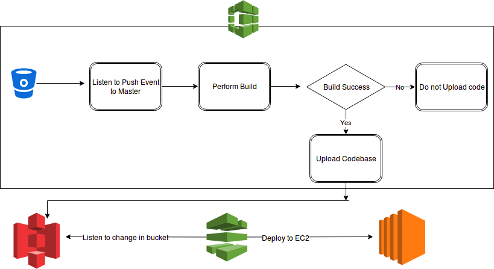
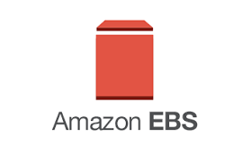
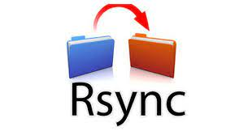

첫 회사에서는 Azure 환경으로 배포했고, 개인 프로젝트에서는 클라우드와 인프라에 대한 개념이 부족해 heroku, github, netlify, vercel 등 간단하게 배포해서 프로젝트를 완성했다.

지금 회사에서는 pipeline을 사용하지 않고 pem,ppk로 인증을 한 후에 PuTTY와 winSCP를 이용해서 배포했다. 사용해보니 불편한 점도 너무너무 많아서 점진적으로 바꿔야겠다는 생각이 들게 되어 바꾸었고, FE 개발자의 아등바등 DevOps 경험을 기록으로 남겨볼려고 한다. 사내의 요구사항으로 인해 자동화로 CI/CD를 하지는 않았지만, 반자동화로서 성능과 효율성을 위해 변하는 배포과정을 살펴보자!!

> 참고로 저는 DevOps, 백앤드에 대한 지식이 부족합니다. 큰 프로젝트는 아니었지만, 필요성을 느껴서 사내 스터디처럼 공부처럼 이루어낸 것이므로 잘못된 정보가 있을 수 있으니, 모든 충고와 조언 감사히 받아들이겠습니다!!

&nbsp;

## 처음에는요..


FE에서 develop에 개발 서버, master에 실 서버를 연결해 각각의 AWS ec2 주소에 build 파일을 올렸다. PuTTY에 pem,ppk를 이용해서 인증 한 후에 ec2로 접근하고 winSCP를 이용해 각각의 파일을 전송해주었다.

회사에서는 기획과 개발이 동시에 일어나기 때문에 적은 인원으로 많은 일을 해야 했다. 그렇기에 배포를 할 때에는 cache, 효율적 배포에 대해 신경 쓰지 않고 기능개발에 목표를 두었다. 이런 시간 동안 배포하는 것에 많은 시간을 소비하게 되었다.

build를 통해 node_modules, img, font 등 변경 사항이 존재하면 모든 것을 새로 ec2로 전송했고, 평균 배포 시간 15분 정도 가지게 되었다.

&nbsp;

### Pem,Ppk,PuTTY

pem,ppk와 같이 암호화된 파일을 이용해 PuTTY로 가상 서버로 접근하게 되면 안정성이 올라가기 때문에 사용한다.

- PEM(Privacy Enhanced Mail) : 암호화된 데이터를 저장하는 파일 형식으로 SSH 키 쌍을 생성할 때 개인 키가 pem 방식으로 저장된다.

- PPK(PuTTY Private Key) : PuTTY에서 사용하는 개인 키 파일 형식

- PuTTY : SSH, Telnet, rlogin, SCP 및 기타 네트워크 프로토콜을 사용하는 클라이언트 애플리케이션으로 Window, macOS 및 Linux 등 다양한 운영체제에서 사용 가능

&nbsp;

### WinSCP, SSH

WinSCP와 SSH는 모두 원격 서버에 연결하고 서버의 파일과 폴더를 탐색해 편집 할 수 있는 것이다.

- WinSCP : Windows용 무료 오픈 소스 SFTP(SSH File Transfer Protocol) 클라이언트로, 원격서버의 파일과 폴더를 탐색,편집에 사용

  > SCP(Secure Copy Protocol)이란?
  >
  > > - ssh 원격 접속 프로토콜을 기반으로 한 파일 전송 프로토콜로 원격으로 파일과 디렉토리 등을 보내고, 가져오는데 사용
  > >
  > > - 네트워크가 연결되어 있는 환경에서 ssh와 동일한 22번 포트와 identity file을 사용하여 파일을 송수신하기 때문에 보안적으로도 안정적

- SSH(Secure Shell) : 네트워크를 통해 안전하게 로그인하고 명령을 실행할 수 있는 프로토콜로 암호화를 사용하여 데이터를 보호한다.

&nbsp;

## 압축을 해볼까?


평균적으로 개발 서버는 10~15분의 시간이, 실 서버는 20분 정도의 시간이 걸려서 배포되었다. 상당히 많은 시간이 불 필요한 곳에 들어가고 있다는 것을 알게되어서, 배포 방법을 변경하기로 했다.

그중에 내가 선택한 방법은 build 파일을 압축해서 ec2에 접근해서 배포하는 것이었다. 검색을 해보니 zip, gzip, zstd 등 많은 압축 방법이 있었지만 나는 gzip+tar 의 tar.gz 을 사용하게 되었다. 내가 왜 tar.gz 방식을 선택했는지 알기 전에 먼저 각 압축법에 대해서 알아보자

- zip: 가장 일반적인 압축 형식이며, 대부분의 운영 체제에서 지원된다. 압축률은 상대적으로 낮지만, 압축 및 압축 해제 속도가 빠름
- gzip: zip 형식보다 높은 압축률을 제공하며, 압축 및 압축 해제 속도도 비교적 빠르다.
- zstd: 최근에 등장한 압축 형식으로, gzip보다 더 높은 압축률을 제공하며, 압축 속도도 빠르다. 운영 체제 지원 여부를 확인해봐야 함
- tar.gz: tar 형식으로 파일을 묶고 gzip으로 압축하는 방식으로 압축률은 높지만, 압축 및 압축 해제 속도가 느리다.

회사에서 프로젝트의 build 파일은 보통 3.5GB 정도로 용량이 크기 때문에, 압축률이 높은 형식을 선택해야 했다. 또한, 운영체제에 대한 제약이 없어야 했기 때문에 MacOS나 Windows에서 모두 지원되는 형식이어야 했다. 그리고 프로젝트를 EC2 인스턴스에서 압축 해제할 계획이었으므로, 가상 서버에서의 압축 해제 속도에 대한 우려는 크지 않았다. 이에 따라 리눅스에서 기본적으로 지원되는 tar 압축 형식을 선택하게 되었다.

> 🤘 ec2 에서 tar.gz 압축 해제하는 명령어 tar -zxvf build.tar.gz을 사용했다!

결과적으로 압축방식으로 build 폴더를 build.tar.gz으로 만들어서 terminus를 가지고 명령어로 SFTP로 인증 한 후에 SSH로 폴더에 접근해 가상 서버에 파일을 넣는 형식으로 배포 방법을 바꾸었다. 해당 작업으로 개발 서버 평균 10 ~ 15분, 실 서버 평균 15 ~ 20분 걸리던 시간을 **3분 이내로 400% 넘는 효율성**을 얻게 되었다.

&nbsp;

## 흠.. pipeline을 사용해보는게 좋을 것 같은데?


압축시간을 많이 줄였다. 하지만 휴먼에러가 많이 발생해 해결법이 필요했다. 여기서 휴먼에러라고 했을 때 SFTP 인증을 할 때 잘못된 접근을 하거나, SSH를 통해 파일을 전달하는 과정에서 경로가 잘못된 것들을 의미한다. 이런 오류들 때문에 효율적이지 못한 시간을 소비하게 되었다. 또한 pem,ppk를 모든 개발자들이 가지고 있으면 노출 위험도도 커질 수 있다고 판단했다. ~~편하기도 하니깐~~

그래서 어떻게 이것을 해결할 수 있을까? 생각해보고 낸 결론은 **우리는 Jira&Atlassian을 이용하기에 bitbucket의 pipeline을 가지고 CI/CD 환경을 구축하자** 를 계획하고 인프라를 구축하기로 했다.

(사실 bitbucket의 pipeline을 사용한 가장 큰 이유는 Jenkins, circleCI와 같은 보조서버가 없기 때문이였다.)

> 여기서 프로젝트의 자동화 CI/CD가 아닌 반자동화 CI/CD 환경을 구축했다. 미국과 한국의 개발자들이 시차때문에 잘못된 배포를 했을 경우에 대응이 어려워, commit&push를 이용해 배포하는 것이 아닌 pipeline을 직접 실행해 배포하는 형식으로 구현하기로 했다.

&nbsp;


&nbsp;

### 배포 환경 만들기

&nbsp;



- AWS S3 Bucket을 이용해서 정적인 파일들(이미지,CSS파일,Font 등)을 호스팅
- AWS EC2를 이용해 웹을 호스팅할 때 사용
- AWS CodeDeploy을 이용해 웹을 EC2인스턴스 또는 온프레미스 서버로 자동으로 배포하는데 사용
- Jira & Bitbucket Pipeline을 이용해 프로젝트 관리 협업에 사용하고 변경 사항을 테스트 한 후에 CI/CD 파이프라인 설정해서 배포

&nbsp;

### 인프라 구성하면서 주의한 점

1. AWS 리소스 관리

사용하지 않는 리소스를 찾아서 정리를 해 비용 절감을 하고 IAM 역할 및 권한을 확인해 네트워크 보안을 고려해야 된다. ~~AWS 과금문제가 무서워서 제일 많이 찾아보고 신경쓴 부분이기도 하다.. 무섭😱😱~~

2. CI/CD 파이프라인 설정

코드 변경 사항을 버전 관리 시스템에 체계적으로 관리하고, 실 버전과 개발 버전 환경을 구분해서 배포할려고 script를 각각 만들었다. 혹시 모를 상황에 배포 중 문제가 생기면 롤백하고 Deploy pause 할 수 있도록 해당 script도 만들어 적용했다.

3. Jira 및 Bitbucket Pipeline 연동

제일 어려운 부분이었다. Jira에서 변경사항을 확인하자마자 자동으로 파이프라인이 실행되는 것이 아닌 사용자가 파이프라인을 직접 실행해 실,개발 서버를 배포할 수 있도록 설정했다. 해당 설정은 Bitbucket Pipelines YAML 파일을 작성하여 CI/CD 작업을 정의했다.

4. 추가적으로

현재 캐싱은 CloudFront를 사용하여 웹사이트 콘텐츠 캐싱을 통해 성능을 향상할 수 있도록 했다. 캐싱에 대한 내용은 [여기서 확인해보자](#효율적인-캐시관리를-위해-ooooo을-사용해볼-예정입니다)

&nbsp;

### 끝이자 새로운 시작..


결과적으로!! 반자동화 CI/CD 를 구현했다!!! 작업하는 동안에 모르는 것이 많아서 사내 직원들에게 도움을 받고 많은 검색을 해보았다. 작은 프로젝트지만 스스로 CI/CD 인프라를 구축해보면서 왜 이런 작업들이 필요한지 알게되었다. **압축을 통해서 400%의 속도를 향상**시키고, **반자동화 CI/CD를 통해서 휴먼에러를 줄여서 배포 환경에 많은 시간을 소비하지 않는 것**에 기여했다는 것이 가장 뿌듯하다!

&nbsp;

## 캐시!!! cache..!!!


CI/CD 프로세스가 완료되었다!! 특별한 문제 없이 진행되었으나, EC2 EBS에 캐시가 과도하게 누적되어 있음을 확인하게 되었다. 캐시 보존 필요성을 인지하고 초기 설정에 따라 10일 이상 경과된 캐시는 자동 삭제되도록 설정했지만, 보다 효율적인 캐시 관리 방안을 찾게 되었다.

~~하지만 현생이 너무 바빠서.. 추후 작업을 위해 공부한 것들을 기록해보자!~~

&nbsp;

### 그래서 EBS가 뭐고 왜 사용할까?



EBS(Elastic Block Storage)는 EC2의 연산처리를 한 후에 해당 데이터를 저장하는 역할을 하는 것이다. 쉽게 표현하면 EC2는 가상 서버라면 EBS는 가상 하드디스크라고 할 수 있다. 저렴한 비용으로 사용량을 확장할 수 있고 영구 블록 스토리지 볼륨을 제공한다.

> 영구 블록 스토리지 볼륨은 실제 하드 드라이브와 유사하게 작동하는 클라우드 기반 스토리지, EC2 인스턴스에서 사용할 수 있는 영구적 (데이터가 삭제되지 않음) 저장 공간을 제공하며, 다양한 용량, 성능, 가격 옵션으로 제공

EBS는 디스크 하나하나 저장 단위인 EBS 볼륨으로 구성되어있다. EBS 타입도 5가지 제공되는데, ~~너무 어렵다..~~ 구글링 해보니 용량과 MAX IOPS 수치를 확인해서 상황에 따라 적합한 타입을 사용하면 된다고 한다! ~~하지만 나는 요금을 아끼기 위해서 마그네틱 타입을 사용하고 있다.~~

EBS를 사용하는 이유는 아주 많을 것 같다. 다양한 옵션을 사용할 수 있고 적은 비용으로 확장하기도 쉽다. 데이터 손실을 방지하는 것도 훌륭한 기능이다. 그 중에 EC2가 종료되어도 별개의 네트워크로 연결되어 데이터가 유지되는 EBS의 영구성이 큰 장점이라고 생각한다. 그리고 EC2가 변경되어도 재연결하기도 쉽고 하나의 EBS를 여러개의 EC2에 장착도 가능하다.


&nbsp;

### 효율적인 캐시관리를 위해 OOOOO을 사용해볼 예정입니다~!

EBS에 캐시가 누적될 때마다 든 생각이 있다. `그냥.. 차이가 생긴 파일, 폴더만 옮겨주면 되잖아. 그럼 캐시도 줄고 속도도 향상되지 않을까??` 라는 생각을 가지고 불타는 구글링을 해보다가 찾은 방법이 있다.


&nbsp;

&nbsp;

<h1>그건 바로!!!!!</h1>

&nbsp;

<h2>그건 바로!!!</h2>

&nbsp;

<h3>그건 바로!</h3>

&nbsp;



**Rsync(Remoe Sync)** 는 원격에 있는 파일과 디렉토리를 복사하고 동기화 하기 위해서 사용하는 툴이며 동시에 네트워크 프로토콜로서 커맨드 라인의 옵션들을 이용해서 배치 프로그램을 개발하기 쉬다는 장점이 있다. 이 스크립트를 cron 등에 올리는 걸로 간단하게 백업 혹은 미러(mirror) 시스템을 구축할 수 있다고 한다!

그리고 내가 rsync를 선택한 가장 이유는 scp보다 빠르고, remote-update 프로토콜을 이용해서 차이가 있는 파일만 복사해서 처음에는 모든 파일과 디렉토리를 복사하겠지만, 다음부터는 차이가 있는 파일만 복사하기 때문에 더 빠르고 효율적으로 작동한다는 점이다. 아직 사용해보지는 않았지만, 추후 작업을 하게 되면 업데이트 할 예정이니..


rsync를 찾아보면서 도움이 된 자료들을 올려둘테니 [개발괘발개발새발님의 rsync](https://velog.io/@inhwa1025/Linux-rsync%EB%9E%80-rsync-%EC%82%AC%EC%9A%A9%EB%B2%95-rsync%EB%A1%9C-%EB%8D%B0%EC%9D%B4%ED%84%B0-%EB%B0%B1%EC%97%85%ED%95%98%EA%B8%B0) 이랑 [Feccle님의 rsync](https://feccle.tistory.com/96) 을 읽어봐도 좋을 것 같다.

&nbsp;

> <h4>출처 및 도움되는 링크들</h4>

```toc

```
