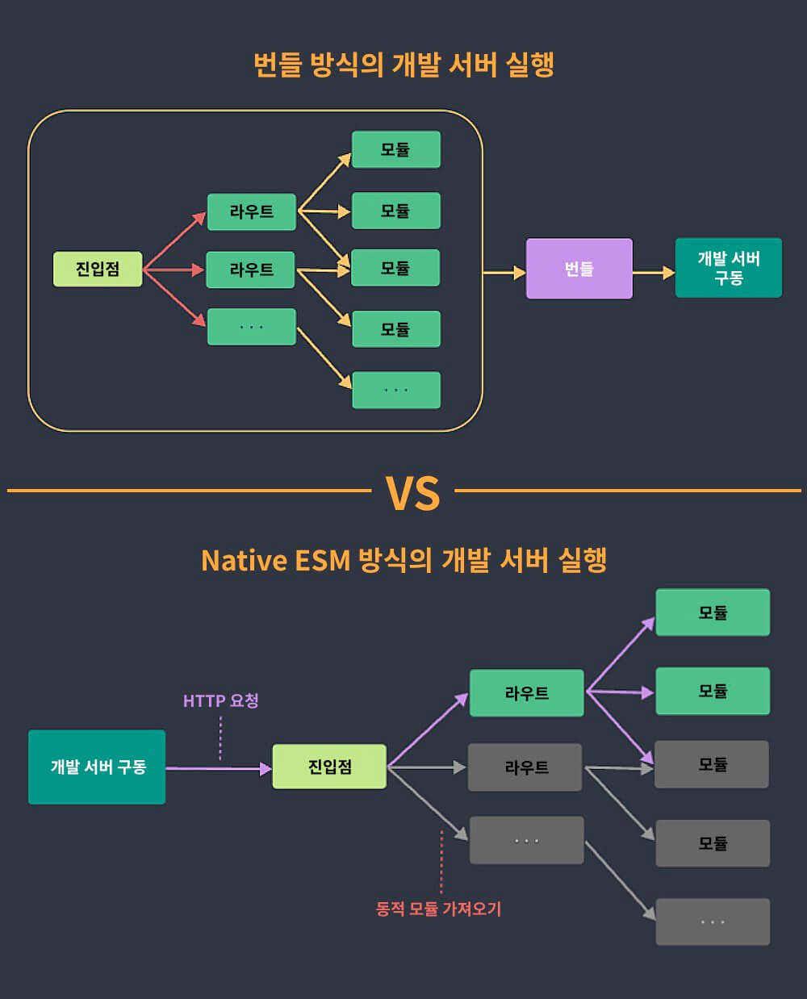
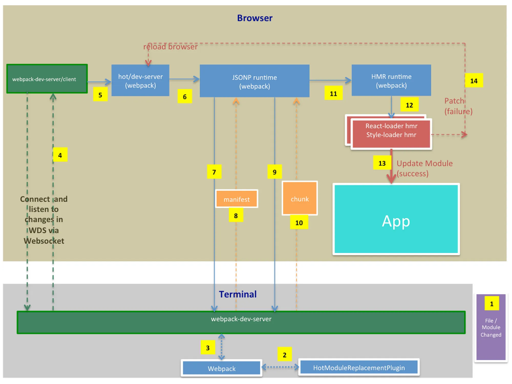

## CRA(Create React App)

<br>


2016년 이전에는 Create React App(CRA)가 등장하기 전에 프론트엔드 개발 환경이 통합되어 있지 않아서, 기존 앱에 리액트를 추가하기 위해 npm에서 import한 후 기존 빌드 구성을 수정하는 번거로움이 있었다고 한다!

여러 도구를 설치하고 JSX를 사용하기 위한 사전 설정을 진행하며, 개발과 프로덕션 환경을 다르게 구성해야 했다. 또한, 린트 설정 등 다양한 작업이 필요했는데, 이는 일반 사용자들에게는 쉽지 않은 작업이었을 것 같다. 시간이 지나 똑똑한 개발자들이 보일러플레이트 저장소를 만들어 공유하고 복제함으로써 시간을 단축할 수 있었지만, 업데이트가 어려워 빠르게 변화하는 생태계에 대응하는 것도 쉽지 않았을 것 같다.

이러한 어려움을 해결하기 위해, **CRA(Create React App)** 가 등장하게 되었다. CRA를 사용하면 리액트 애플리케이션을 쉽게 생성하고 필요한 설정 작업을 자동화할 수 있다. 이를 통해 개발자들은 더욱 빠르고 효율적으로 프로젝트를 시작하고 관리할 수 있게 되었다. 사내에서도 React 프로젝트를 시작할 때 위와 같은 환경 세팅에 시간 소비를 방지하기 위해서 CRA를 통해 작업을 해왔고 2~3년이 지난 시기에 여러 가지 문제점이 발견되어 마이그레이션에 대한 생각을 조금씩 하게 되었다!

<br>

## 마이그레이션을 하기로 결심한 이유

<br>


마이그레이션을 결정한 이유를 고려해보면, React 16 버전을 사용하는 사내 플랫폼이 사용에는 문제가 없지만 성능과 속도 측면에서는 효율성이 많이 떨어져 개선할 부분이 필요하다는 것을 느끼게 되었다!

성능과 속도를 개선하는 방법은 다양하다. 우선, 빌드 도구를 변경하여 더 효율적인 빌드를 수행할 수 있고, 프로젝트의 의존성을 최적화하여 번들 크기를 줄이고 불필요한 모듈을 삭제할 수도 있다. 더 나아가, 코드 스플릿팅을 통해 로딩 시간을 최소화하거나 프로젝트의 구조를 변경하여 성능을 향상시킬 수도 있다.

이러한 다양한 방법들 중에서 마이그레이션을 통해 Vite로 전환하는 것이 선택된 이유는 무엇일까? 아마도 Vite가 제공하는 빠른 개발 서버와 빌드 속도, ES 모듈 사용 등의 장점이 React 애플리케이션의 성능 및 속도 개선에 큰 도움이 될 것이라고 생각했기 때문이다! 또한, Vite의 확장성과 다양한 프레임워크 지원은 향후 프로젝트 유지보수 및 확장성에도 긍정적인 영향을 줄 것으로 예상된다.

지금부터 마이그레이션을 진행하기 위해 여러 가지 고민에 대해서 같이한 번 살펴보자!

<br>

## 🙋🏻‍♂️ 잠깐! 번들러가 뭐야!?

<br>


브라우저 모듈 시스템(Module system)이 아직 표준화되지 않았던 시기에는, 여러 자바스크립트 파일을 단순하게 HTML `<script>` 태그로 연결하는 방식을 사용했는데, 이러한 방식은 전역 오염이나 의존성 관리가 어려워지는
등의 여러 문제가 있었다. 그래서 CommonJS, AMD, UMD 등의 모듈 시스템이 등장했고, 이러한 모듈 시스템을 효율적으로 브라우저에서 사용하기 위해 번들러가 등장했다.

**번들러(Bundler)** 는 웹 애플리케이션을 개발하기 위해 필요한 HTML, CSS, JS 등의 파편화된(모듈화된) 자원들을 모아서, 하나 혹은 최적의 소수 파일로 결합(번들링)하는 도구다. 그리고 결합을 위해 프로젝트를 해석하는 과정에서, 불필요한 주석이나 공백 제거, 난독화, 파일 압축 등의 기본적인 작업뿐만 아니라, 최신 문법이나 기타 개발에 편리한 특수 기능 등을 브라우저가 지원하는 형태로 변환하는 작업도 수행할 수 있도록 확장되어 개발자의 작업 효율성을 높이고 브라우저의 호환성이나 성능 등을 개선하는데 크게 도움을 주고있다!

<br>

## 여러가지 빌드도구를 비교해보자

빌드 도구가 속도 개선에 직접적 영향을 준다고 생각해 여러가지 빌드 도구를 속도, 번들 최적화 ,확장성, 커뮤니티와 같은 요소들을 생각해 비교해보자!

<br>

### ESBuild


ESBuild는 피그마의 CTO인 Evan Wallace가 개발한 빌드 도구로, 기존의 노드 기반 번들러보다 10~100배 더 빠른 빌드 속도를 제공한다. Go 언어를 이용하여 동시성을 지원하므로 멀티 코어 처리를 효율적으로 수행도 가능하다. 또한, 번들링, 경량화, 코드 변환 등 다양한 빌드 작업을 하나의 단계에서 처리하여 프로세스를 간소화했다.

그러나 ESBuild는 CRA에서 제공되는 편의성이 부족하다. 따라서 esbuild 관련 스타터들이 많이 나오고 있는데, 이는 사용자들이 esbuild의 빠른 속도와 효율성을 살리면서도 CRA의 편의성을 일부 보충하기 위한 것이라 생각한다!

또한, ESBuild는 용량이 상대적으로 작고 번들러에 대한 학습 곡선이 높은 것 같다. ~~(문서를 읽어보아도 너무 어렵다..)~~ 또한, 아직은 정식 버전이 출시되지 않아 안정성 면에서 위험성을 가지고 있다고 생각한다. 또한 PostCSS와 같은 후처리기와 es5 이하의 문법에 대한 완벽한 지원이 되지 않는 등의 문제도 짚고 넘어가야할 문제라고 생각한다!

따라서 ESBuild를 사용할 때에는 번들러 설정에 대한 이해와 경험이 필요하며, 현재의 한계와 위험 요소를 고려하여 적절한 상황에서 사용하는 것이 중요하다고 보인다. 이러한 요소때문에 서비스가 진행중인 플랫폼에 ESBuild를 적용시키는 것은 적합하지 않다고 판단했다!

<br>

### Webpack


webpack은 SPA(Single Page Application)가 급부상함에 따라 번들을 통합해서 관리해야 한다는 고민으로 출발하게 되었다. 이를 통해 webpack은 SPA 프로젝트의 구축과 관리를 간편하게 만들어주었다.

- 하나의 설정 파일 내에서 원하는 번들을 생성할 수 있도록 컨트롤할 수 있고, entry와 output을 명시하고 필요한 **plugin과 loader**를 설정함으로써 간편하게 프로젝트를 구성할 수 있다
- 다양한 plugin과 loader를 지원하며, 이를 통해 강력한 **개발 커뮤니티의가 활성화**되어있다. 이를 활용하여 다양한 파일 형식(css, image, font 등)을 변환하고 번들링할 수 있다.
- 소스코드의 변화를 감지하여 브라우저를 자동으로 새로고침해주는 **Hot Module Replacement(HMR)를 제공**해서, 실시간으로 변화를 확인할 수 있으며, 다양한 파일의 변화도 감지할 수 있다.
- 코드 분할을 통해 여러 번들 파일로 분리하여 병렬로 스크립트를 로드하여 **페이지 로딩 속도를 개선**할 수 있다. 또한, 초기에 구동될 필요가 없는 코드를 분리하여 lazy loading을 통해 페이지 초기 로딩 속도를 개선할 수도 있다.

팀에서도 webpack을 사용하는 의견에 호의적이였다. 하지만 webpack을 사용하다보면 빌드 시간이 증가하고 복잡한 설정에 대한 학습 곡선이 존재한다는 문제점이 있다는 부분이랑 특히 프로젝트 규모가 커지고 loader와 plugin의 사용이 증가할수록 이러한 문제점이 더욱 부각될 수 있다는 점에서 고민을 하게 되었다.

<br>

### Rollup


<br>

Rollup은 2017년부터 개발이 시작된 모듈 번들러로, webpack의 인기에 가려져 있었지만 확장성이 높아 차세대 번들러로 주목받았다.

> "compiles small pieces of code into something larger and more complex, such as a library or application"

Rollup은 작은 코드 조각들을 거대하고 복잡한 어플리케이션 혹은 라이브러리로 만들어 주는데, 이는 같은 소스 코드를 환경에 따라 다르게 빌드하는 것을 의미한다. Rollup을 사용할 때 "어플리케이션을 만들 땐 webpack으로, 라이브러리를 만들 땐 rollup으로!" 라는 문구를 자주 보이는데 라이브러리 빌드 쪽에서는 강한 자신감이..보인다 ㅋㅋㅋㅋ

Rollup의 사용 및 구성 방식은 webpack과 유사하지만 내부적으로 사용하는 도구들이 많이 다르다. 특히 라이브러리 개발 시에는 ES6 모듈 형태로 빌드하는 것이 중요한데, Rollup은 ES6 모듈 형태로 빌드할 수 있어 매우 유용하다. 이를 통해 라이브러리 사용자는 최적화된 애플리케이션을 더욱 쉽게 만들 수 있다. 또한, Rollup은 모듈을 호이스팅하여 한 번에 평가하기에 webpack보다 더 빠르며, AST 트리에 사용되는 모듈만 포함시켜 불필요한 코드를 제거하는 방식을 사용하여 더 가벼운 번들을 생성하는데, 이러한 특징들은 Rollup을 라이브러리 개발에 적합한 도구로 만들어 준다.

Rollup에 대한 이야기를 해보았는데 Vite 내부에서 Rollup 번들러를 사용하고 있다! 자세한 것은 Vite에서 다시 확인해보자~!

<br>

### Parcel


Parcel은 Webpack과 달리 별도의 구성 파일 없이 간단하게 사용할 수 있는 번들러로, 최소한의 구성(Zero config)을 지향한다. 주로 사용하는 기능이나 필요한 기능을 자동으로 설치하고 처리하기 때문에 쉽고 빠르게 프로젝트를 구성할 수 있다. Parcel 번들러를 통해, 작은 규모의 프로젝트를 빠르게 시작하기 좋은 것 같다.

하지만, 사내의 프로젝트의 규모가 커서 파이프라인과 다른 요구사항에 유연하게 대응하지 못할 수 있고, 성능적으로 번들링 속도가 메모리에 영향을 줄 수 있다고 생각이 들어서 직접적으로 도입하지 않기로 결정했다!

<br>

## 최종적으로 Vite를 선택한 이유


Vite는 ESBuild의 단점을 보완한 라이브러리로, 개발 서버 구동 시간이 거의 0에 가깝고, 모든 CommonJS 및 UMD 파일을 ESM으로 불러올 수 있도록 변환하고, 다양한 리소스를 별도의 설정 없이 import할 수 있으며, CSS 빌드 최적화를 하고, Direct Import 구문에 대해 Preload 하도록 함으로써 네트워크 비용을 줄일 수 있다. Vite의 장점에 대해서 살펴보도록 하자!

<br>

### 서버 구동

Vite의 가장 큰 특징이라고 한다면 Dev Server에서 Native ESM을 사용하여 소스를 제공한다는 점이다. ESM (EcmaScript Modules)이란 ES6에서 도입되었으며, import/export를 사용하여 모듈을 동적으로 로드할 수 있는 모듈 시스템이다.

Webpack과 같은 기존의 번들 기반 방식에서는 모든 소스코드가 빌드되어서 한번에 번들링된 형태로 서비스를 제공했다면, Native ESM 기반 방식의 Vite에서는 그럴 필요가 없다. 번들링이 필요가 없고 브라우저에서 필요한 모듈의 소소코드를 import할때 이것을 전달만 하면 되는 방식이다.

<br>



<br>

이것은 결국 현대 대부분의 브라우저에서 ESM일 지원하기에 가능한 것이다. ESM이 나오기 전에는 자바스크립트 언어레벨에서 지원하는 모듈시스템이 없었기 때문에 번들링이 필요했던 것이고, 지금은 자바스크립트 언어레벨에서 모듈시스템이 들어가 있고 거의 모든 브라우저에서 이것을 지원을 하기 때문에 Vite에서는 ESM을 기반으로 만들 수 있게 된 것이다.

- Dependencies: 개발 시 그 내용이 바뀌지 않을 일반적인 JavaScript 소스 코드다. 기존 번들러로는 컴포넌트 라이브러리와 같이 몇 백 개의 JavaScript 모듈을 갖고 있는 매우 큰 디펜던시에 대한 번들링 과정이 매우 비효율적이었고 많은 시간을 필요로 했다. Vite의 **사전 번들링 기능은 Esbuild를 사용**하고 있다.

- Source code: JSX, CSS 또는 Vue/Svelte 컴포넌트와 같이 컴파일링이 필요하다.

결과적으로 프로젝트 규모가 커지면 Dev Server 구동 속도가 매우 느려서 기다리는 시간이 길어지고 지루해진다. 하지만 Vite에서는 Dev Server로 서버구동과 HMR 속도가 엄청 빨라진 것을 확인해볼 수 있다. 이러한 이유만으로도 Vite로 넘어가는데 충분한 이유라고 생각한다!

<br>

### HMR (Hot Module Replacement)



Vite도 당연히 HMR 기능을 지원한다. 개발하면서 소스코드를 수정하면 vite는 수정된 모듈과 관련된 부분만 교체하고 브라우저에 전달한다. Native ESM을 이용하기 때문에 프로젝트 사이즈가 크더라도 HMR 시간에 영향을 주지 않아서 매우 빠르게 진행이 된다. 프론트 개발을 하다보면 HMR 기능을 정말 많이 사용할 수 밖에 없다. 보통 프론트 개발작업을 할때 소스코드 에디터, Dev Server, 브라우저 이렇게 3개는 기본적으로 열어놓고 작업을 하는데 소스코드를 수정하면 Dev Server에서 HMR이 일어나고 브라우저에서 변경된 내용을 확인한다. 그래서 Dev Server 구동보다도 훨씬 더 자주 사용하는 기능이 HMR이다. 그래서 HMR 속도가 정말 중요하다고 말할 수 밖에 없다.

또한 vite는 HTTP 헤더를 활용하여 전체 페이지의 로드 속도를 높인다. 필요에 따라 소스 코드는 `304 Not Modified`로, 디펜던시는 `Cache-Control: max-age=31536000,immutable`을 이용해 캐시가 되고, 이렇게 함으로써 요청 횟수를 최소화하여 페이지 로딩을 빠르게 만들어 준다.

<br>

## 마이그레이션 할 때 유의 사항 및 과정!

CRA을 통해 부트스트래핑된 React 어플리케이션의 경우 번들링을 위해 기본 제공되는 react-scripts을 사용하는데, 이 react-scripts 라이브러리는 쉽고 간편하지만, 라이브러리 내부에서 사용되는 Webpack 번들러가 느리고 무거운 편이다.
저희 플랫폼에서는 Webpack에 크게 의존성을 가지고 있지 않았기 때문에 굳이 Webpack(즉, react-scripts)을 고집해야 할 이유가 없어 보여서 Vite로 번들러 수정 작업을 진행했는데 혹시나 Webpack 의존도가 높은 경우는 고려해봐야 할 것 같습니다!

Vite를 사용하기 위해서 CRA와의 차이점에 대해서 찾아보았는데 환경과 문법에서 차이가 있다. process.env, EJS 템플릿 문법 지원, 다양한 플러그인, 폴더와 파일의 위치 등등 이었습니다. 마이그레이션하면서 다뤄본 큰 변경점들에 대해서 간략하게 기록해보겠습니다~

> 🤔 저는 문제가 없어서 기록해두지 않았습니다만, Node,Vite 버전 호환성과 디렉터리 구조등을 생각해봐야 됩니다! 호환성은 각자의 환경에 따라 다르니 참고용으로만 봐주세요~!

<br>

### process.env 호환성

Vite는 import.meta.env 객체를 이용해 환경 변수에 접근할 수 있고, 이러한 환경 변수는 `VITE_SOME_KEY=123`처럼 VITE\_라는 접두사를 붙여 선언해야 된다.

> 🚨 사내에서 Cypress로 테스트 코드를 작성하는데 import.meta.env를 통한 환경 변수 접근이 잘 작동하지 않는 이슈가 있어서, process.env를 통해서도 환경 변수를 참조할 수 있도록 호환성을 추가하는 작업을 진행했습니다. 관련한 정보는 [Vite Issue](https://github.com/vitejs/vite/issues/1149#issuecomment-857686209) 확인해보시면 좋을 것 같습니다.

<br>

### EJS 템플릿 문법을 위한 플러그인 추가 및 변경

CRA에서는 기본적으로 [EJS 템플릿 문법](https://ccusean.tistory.com/entry/Express-%ED%85%9C%ED%94%8C%EB%A6%BF-%EC%97%94%EC%A7%84-ejs-%EC%95%8C%EC%95%84%EB%B3%B4%EA%B8%B0)을 지원하는 반면, Vite에서는 EJS 플러그인을 추가해주어야 템플릿 문법을 사용할 수 있습니다. 이를 위해 vite-plugin-ejs 패키지를 설치하고, 다음과 같이 플러그인을 적용해두었습니다.

```typescript
plugins: [
      ViteEjsPlugin({
        // 여기에는 사용하고자 하는 변수를 선언해주면 됩니다. 예컨대,
        exampleVar: import.meta.env?.VITE_EXAMPLE_VAR || null,
      }),
    ],
```

그리고 Vite에서 지원하지 않는 기능을 사용하기 위해서 플러그인을 추가했습니다. (23.06.02에는 적용이 안되었는데 지금은 적용이 될 수 있습니다.)

- vite-plugin-svgr: SVG 그래픽을 리액트 컴포넌트처럼 사용하기 위한 플러그인
- vite-plugin-eslint: ESLint와 관련된 오류를 알려주는 플러그인
- vite-tsconfig-paths: tsconfig.json에 정의된 paths 매핑을 사용하기 위한 플러그인

> 추가로 사내 프로젝트에 Jqeury가 있어서 @rollup/plugin-inject을 사용하고 있습니다. 이 플러그인은 코드 번들링 과정 중에 지정된 변수를 주입하여 코드를 변경하는 데 사용되고, jQuery를 $ 및 jQuery 변수로 주입하여 전역으로 사용할 수 있도록 해주고 있습니다. ~~제거해야되는데!!!!!!!~~

CRA 에서 Vite로 플러그인과 함께 알아보니 지원되는 것이 많다는 것을 알게되었네요..ㅋㅋ

<br>

### index.html 수정 및 경로 변경

vite는 개발모드에서 ESBuild를 사용하기 때문에 추가 번들링 없이 index.html 파일이 앱의 진입점이 되도록 변경했다. 그렇기 때문에 public 폴더에 위치해 있는 index.html 파일을 프로젝트 최상단에 위치하도록 이동시키고, Vite는 CRA와 다른 메커니즘으로 assets를 다루기 때문에 index.html 파일에 포함된 `%PUBLIC_URL%` 경로는 모두 지워준다. 그 후 파일의 `<body>` 를 아래와 같이 수정해주면 됩니다!

```typescript
<body>
  <noscript>You need to enable JavaScript to run this app.</noscript>
  <div id='root'></div>
  <script type='module' src='/src/index.jsx'></script>
</body>
```

<br>

### config 수정

vite.config.ts 와 tsconfig.json을 루트 디렉토리에 만들어주고 세부설정을 추가해주면 된다. 사내에서 사용하는 설정이여서 공개하기는 염려되기 때문에 몇가지 설정만 공유해볼려고 한다.

- **vite.config.ts**
  - 터미널 명령어로 script를 실행했을 때 변경 될 환경들을 defineConfig로 정의한다.(sentry, sourceMaps, version, branch)
  - build에 연관 되어있는 react-router-dom과 assets 폴더의 chunkFile 생성에 관여한다.
  - Module Alias를 설정해서 긴 경로에 별칭을 사용할 수 있도록 지정한다.
- **tsconfig.json**

```json
{
  "compilerOptions": {
    "experimentalDecorators": true, //클래스 및 클래스 멤버에 메타데이터를 추가를 위한 실험적 데코레이터(decorator) 문법을 활성
    "target": "ESNext", // TypeScript가 생성하는 JavaScript 코드의 ECMAScript 목표 버전을 지정하는데, 여기서는 "ESNext"를 지정하여 가장 최신의 ECMAScript 표준을 대상으로 컴파일하도록 설정되어 있다.
    "lib": ["dom", "dom.iterable", "esnext"], // 컴파일러가 사용할 라이브러리를 지정하는데, 여기서는 DOM 및 ESNext와 함께 dom.iterable도 사용하고 이것은 컴파일러가 코드에서 사용되는 기능 및 API에 대한 정적 검사와 IntelliSense를 제공하기 위해서 사용한다.
    "types": ["vite/client", "vite-plugin-svgr/client"], // 프로젝트에서 사용하는 타입 정의 파일을 지정하는데, 여기서는 Vite와 SVGR 관련 타입 정의 파일을 명시
    "baseUrl": "./src", // 상대 모듈 참조 및 별칭을 해결할 기본 경로를 설정하는데, 여기서는 ./src 폴더를 기본 경로로 설정하고 있다.
    "allowJs": true, // JavaScript 파일을 컴파일할 수 있도록 허용하는 옵션
    "skipLibCheck": true, // 리이브러리 파일의 검사를 건너뛰도록 설정
    "esModuleInterop": true, // ES 모듈을 CommonJS 모듈과 상호 운용할 수 있도록 설정
    "allowSyntheticDefaultImports": true, // import 문에서 default를 사용할 수 있도록 허용
    "strict": true, // 엄격한 타입 검사 옵션을 활성화
    "forceConsistentCasingInFileNames": true, // 파일 이름의 일관된 대소문자를 강제하기 위해서 사용
    "noFallthroughCasesInSwitch": true, // switch 문에서의 case 절에 대한 fall-through를 허용하지 않기 위해서 사용
    "module": "ESNext", //  모듈 코드 생성 방식을 지정하는데, 여기서는 "ESNext"로 설정
    "moduleResolution": "node", // 모듈 해결 방식을 설정하는데, 여기서는 "node"로 설정
    "resolveJsonModule": true, // JSON 파일을 모듈로 불러올 수 있도록 설정
    "isolatedModules": true, // 파일 간의 독립적인 컴파일을 활성화
    "noEmit": true, // 컴파일 결과물을 생성하지 않도록 설정
    "noImplicitAny": false,
    "noImplicitReturns": false,
    "strictNullChecks": false,
    // noImplicitAny, noImplicitReturns, strictNullChecks은 TypeScript의 엄격한 타입 검사 관련 옵션들을 설정
    "jsx": "react-jsx" // JSX 파일의 파싱 방법을 설정하는데, 여기서는 "react-jsx"로 설정되어 있으므로 React의 JSX 문법을 사용할 수 있음
  },
  "include": ["src"]
}
```

<br>

### 해치웠나..?


<br>

이 정도면 얼추 CRA에서 Vite로 변경하는 데에 큰 문제는 없었다. 하지만 생각하지 못한 문제들이 너무 많았다. 라이브러리, node 버전(사내에서는 Back-End가 node.js 기반이어서 더 신경을 써야 됐는데...) 등등... 여러분들은 이런 실수없어서 순탄한 마이그레이션을 했으면 좋겠다!!

참고로 위 과정에서 dependencies를 수정해줘야 되고, react-scripts 처럼 사용하지 않는 모듈을 삭제해 줘야 된다. 꼭 확인해서 불필요한 모듈을 지워주면 좋겠다!

<br>

## 그 다음은 어떤 것이 더 필요할까?

우여곡절 끝에 마이그레이션에 성공했다! 과정은 짧아 보이지만... 엄청 시간이 오래 걸렸다. ~~잘 알아보지 않아서.. 특히 BE와.. 라이브러리 호환성.. 등등~~ 작업을 하고 나서 피드백을 해보았다 빌드시간이 평균 40% 정도 줄었고 모듈 해석 속도가 향상되고 HMR 덕분에 개발 생산성을 향상했다. 점차 플러그인 생태계가 Vite에 적합하게 발전함에 따라 프로젝트가 안정성을 찾지 않을까 하는 기대가 있다.

이후에는 어떤 것을 다뤄야 될까? 라는 고민을 잠깐해보았는데 변화된 생태계에 맞추고 프로젝트 안정성을 높이기 위해서 테스트 작성과 캐싱, 프리픽싱 설정을 하고 여러가지 플러그인에 대해서 알아 볼 예정이다!

<hr>

## 출처 및 도움되는 링크들

[Vite 공식 홈페이지](https://ko.vitejs.dev/guide/why.html)

[번들러와 빌드 도구](https://www.heropy.dev/p/x8iedW)

[Create React App 권장을 Vite로 대체하자는 PR 관련 글](https://junghan92.medium.com/%EB%B2%88%EC%97%AD-create-react-app-%EA%B6%8C%EC%9E%A5%EC%9D%84-vite%EB%A1%9C-%EB%8C%80%EC%B2%B4-pr-%EB%8C%80%ED%95%9C-dan-abramov%EC%9D%98-%EB%8B%B5%EB%B3%80-3050b5678ac8)

[Webpack 과 HMR](https://rajaraodv.medium.com/webpack-hot-module-replacement-hmr-e756a726a07)

[CRA 대신에 Vite를 쓰자는 React issue](https://github.com/reactjs/react.dev/pull/5487)

```toc

```
