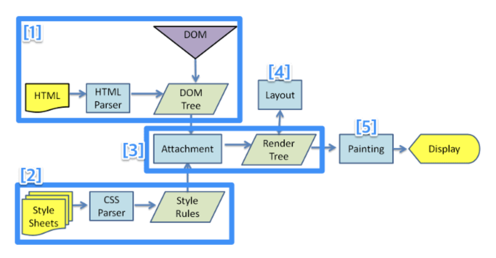
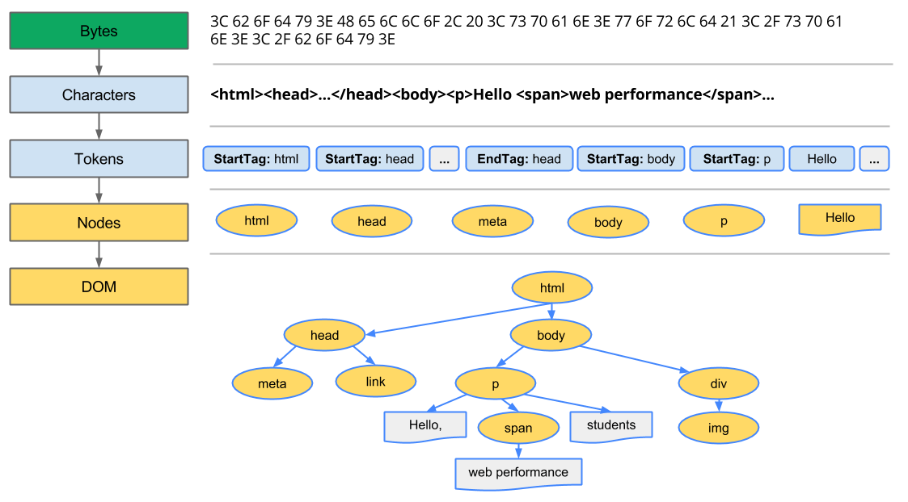
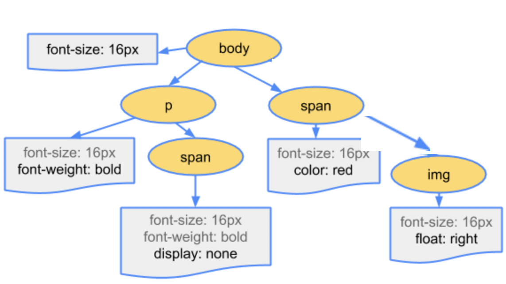
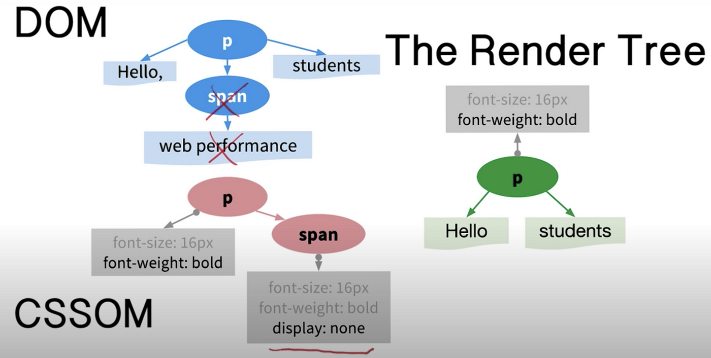
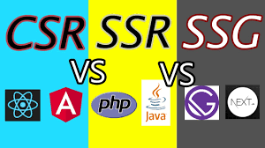

Web에 대해 공부하면서 **렌더링이 무엇이고 어떻게 작동되는가?** 에 대한 궁금증을 가지지 못했다. 취업을 해야된다는 막연한 생각때문에 과정없이 면접에 자주나오는 키워드만 암기했다.

CS에 기초지식이 없으니 누군가에게 대답하는 형식으로 달달 외우기만 했다. 조금만 응용되어도 이론이 복잡하게 꼬여 버렸다. 그래서 **언젠가는 이런 정리 안 된 내 지식을 정리해야지🔥🔥** 라는 계획을 하다 이번에 렌더링이라는 키워드를 연관성에 맞춰서 상세하게 기록해보려고 한다.

작은 소망이라면 렌더링, 브라우저, DOM 등 다양한 키워드에 대해 궁금할 때 나의 글이 생각나고 흐름을 파악하면 좋겠다.


웹 렌더링이라는 주제를 정한 후 **어떠한 순서로 웹 렌더링에 대해서 글을 써야 할까?** 에 대해 많은 고민을 하였다. 이론적인 단계로 쓸 수 있고, 중요한 순서대로도 쓸 수 있다. 하지만 내가 선택한 방법은 내가 공부하면서 느꼈던 키워드의 연관성을 흐름에 맞춰서 기록해보려 한다.

예를들어! 🍎 사과에 대해서 글을 쓰고 싶을때 **사과는 이름이 왜 사과고 => 어떠한 특성이 있고 => 그래서 어떠하다** 라는 흐름으로 사과를 알아보는 것이 아닌, **사과는 뭘까? => 사과는 과일이구나, 뭘 과일이라고 하지? => 과일은 또 어떤 게 있을까?** 이런 식으로 질문에 꼬리에 꼬리를 무는 방식(꼬꼬무)으로 글을 작성할 예정이다!!

서론이 너무 길었다!! 자칫하면 너무 어렵고, 진부 할 수 있는 내용이지만 누군가에게 필요할 것이라 생각해 자세히 설명해보려고 한다. 만약 필요한 내용만 찾고싶으면 `목차`, `command + f` , `ctrl+f` 를 적극적으로 사용해서 필요한 내용을 알차게 찾아가면 좋겠다!!

<br>

## 중요하게 알아야 될 키워드

<br>

### 파싱과 렌더링

**파싱**은 HTML 파일을 해석하여 DOM(Document Object Model) Tree를 구성하는 단계를 말하고, **렌더링**이란 HTML, CSS, JS로 작성된 문서를 파싱하여 브라우저에 사용자가 눈으로 볼 수 있도록 시각적으로 출력하는 것을 말한다.

<br>

### 요청과 응답


브라우저에 URL을 입력하면 URL에 적힌 값을 파싱하고 HTTP 요청 메시지를 만들어 웹 서버로 전송한다. 브라우저는 메시지를 네트워크에 직접 송출할 수 없기때문에 OS에 의뢰해서 메시지를 전달한다. OS에 송신을 의뢰하기 위해서는, IP 주소로 메시지를 받을 상대를 지정해야되기 때문에, DNS(Domain Name Server)를 조회해야 한다.

이후, 브라우저가 요청한 메시지가 웹서버 측 LAN에 도착하면 방화벽이 검사를 하는데, 캐시서버를 통해 웹서버까지 가야하는 지 아닌지 조사한다. 페이지의 데이터 중 다시 이용할 수 있는 것은 캐시 서버에 저장되고 액세스한 페이지의 데이터가 캐시서버에 있으면 웹서버에 의뢰하지 않고 바로 값을 읽을 수 있다.

웹서버에 도착하면 패킷에 담긴 메시지를 복원해서 WAS에 넘기고, WAS은 요청 메시지에 따른 데이터를 응답 메시지에 넣어 클라이언트로 다시 보낸다. 웹 브라우저는 역으로 웹 서버로부터 HTTP를 따라 데이터를 전송받고, 렌더링 엔진을 사용해 이를 텍스트 및 이미지 등으로 변환한다. 브라우저는 최종 화면을 사용자에게 표시하는 역할을 한다.

한마디로 브라우저를 열고 URL을 입력하는 순간부터 **HTTP 요청(Request)이** 시작되고, 브라우저는 사용자가 입력한 URL주소에 해당하는 목적지(웹서버)에 도착해서 데이터를 요청하고, 그 **목적지(웹서버)에서 응답한 데이터를 응답 받아서(Response)** 화면에 보여주게 된다.

## 브라우저 렌더링 과정



우리는 왜 브라우저 렌더링 과정의 원리를 알아야할까??

C언어, JAVA와 같은 프로그래밍 언어는 OS나 가상머신 위에서 실행된다. 물론 자바스크립트도 런타임 환경에서 사용하게 되면 이야기가 다르겠지만 프론트엔드 개발자의 관점에서는 웹 브라우저에서 실행된다. 웹 브라우저를 다루는 프론트엔드 입장에서는 어느 시점에서 어떻게 렌더링이 되는지 파악하고 있어야 효율적인 코드를 작성할 수 있고, 수정할 수 있다.

브라우저가 렌더링을 하게 되면 **DOM(The Document Object Model)** 을 만들어내는데 만들어지는 과정에 대해 알아보자.

> **🙋🏻‍♂️ 잠깐! DOM은 무엇일까?**
>
> 문서의 구조화된 표현을 제공하며 프로그래밍 언어가 DOM 구조에 접근할 수 있는 방법을 제공하여 그들이 문서 구조, 스타일, 내용 등을 변경할 수 있게 돕는다.
>
> nodes와 objects로 문서를 표현하는데 이들은 웹 페이지를 스크립트 또는 프로그래밍 언어들에서 사용될 수 있게 연결시켜주는 역할을 담당한다.

<br>

### HTML 파싱

HTML 파싱은 웹 브라우저가 서버에서 받은 HTML 문서를 문자열로 받아들이고, 이를 파싱하여 이해 가능한 구조로 변환하는 과정을 의미하는데 브라우저는 HTML 문서를 위에서 아래로 읽으며, 태그와 내용을 파악하고 각 요소의 의미와 관계를 이해한다.

> ⚠️ 파싱(Parsing)은 컴퓨터 과학 및 프로그래밍에서 특정 형식으로 구성된 데이터를 분석하고 그 의미를 이해하는 과정을 의미한다. 그 중에서 HTML 파싱에 대해서 설명한 것 뿐이니 [👉 여기서](http://wiki.hash.kr/index.php/%ED%8C%8C%EC%8B%B1)에서 자세한 내용을 찾아보는 것을 권장한다

이 과정에서 오류가 발생할 경우 브라우저는 오류 복구 기능을 사용하여 최대한 문제를 해결하고, 유효한 HTML 문서 구조를 만든다. 결과적으로 **HTML 문서를 기반으로 브라우저가 메모리 상에 DOM 트리를 구축하는 번역하는 과정(DOM 생성 과정)이 필요하다**

<br>

### DOM 생성 과정



1. 서버는 브라우저가 요청한 HTML 파일을 읽어 들여 메모리에 저장한 다음, 메모리에 저장된 **바이트(2진수)로** 응답한다.
2. 브라우저는 응답받은 바이트 형태의 HTML 문서를 **meta태그의 charset 어트리뷰트로 지정해 둔 인코딩 방식(ex. UTF-8)을 기준으로 문자열로** 변환한다.
3. 문자열로 변환된 HTML 문서를 읽어 들여 문법적으로 더 이상 나눌 수 없는 기본적인 언어 요소인 **토큰(token)들로** 분해한다.
4. 각 토큰들을 객체로 변환하여 컴퓨터 과학에 쓰이는 기초적인 단위인 **노드(node)를** 생성한다. **노드는 이후 DOM을 구성하는 기본 요소**가 된다.
5. 이러한 노드들은 body 태그 안에 div를 넣고 그 안에 또 p를 넣듯이 중첩될 수 있는데, 이러한 중첩 관계에 의해 부자관계가 형성된다. 부자관계를 반영하여 모든 노드들을 **트리 자료구조로** 구성한다.

<br>

### CSS파싱과 CSSOM(CSS Object Model) 생성



렌더링 엔진은 처음부터 한 줄씩 순차적으로 파싱하며 DOM을 생성하는데, 중간에 CSS를 로드하는 link나 style 태그를 만나면 DOM 생성을 일시 중단한다.

그 후 CSS 파일을 서버에 요청하고 응답받은 CSS 파일을 HTML과 동일한 파싱과정을 거치며 해석해 CSSOM을 생성한다. 그리고 CSS 파싱이 완료되면 HTML 파싱이 중단된 시점으로 돌아가 다시 HTML을 파싱한다.

> **브라우저 엔진**
>
> > 브라우저에서 웹 콘텐츠의 표시 및 상호 작용을 처리하는 소프트웨어 구성요소이다. 여기에는 네트워킹 계층, JS 엔진 및 렌더링 엔진과 같은 여러 구성 요소가 포함된다.
>
> > 웹 서버에서 리소스를 가져오고, HTML, CSS, JS 및 기타 웹 기술을 파싱하고, 사용자 장치에서 콘텐츠를 렌더링하는 역할을 한다.
>
> **렌더링 엔진**
>
> > 웹 콘텐츠의 렌더링을 처리하는 브라우저 엔진의 특정 구성 요소이다. HTML 및 CSS 코드 구문 분석, DOM 트리 및 CSSOM 생성, 페이지에 요소 배치 및 스타일 지정, 최종적으로 사용자 장치에 페이지 렌더링을 담당한다.
>
> **결과: 렌더링 엔진은 브라우저 엔진에 포함되는 개념인 것 같다!**

<br>

### 렌더 트리

<br>



**렌더링 트리 구축**

- DOM 트리의 루트에서부터 시작하여 페이지를 렌더링하는데 필요한 노드만 남기는데 이때 스크립트 태그나 메타 태그 같은 요소는 렌더링에 반영되지 않고, css의 display: none; 속성도 렌더링 트리에 포함되지 않는 (⚠️ visibility: hidden;은 보이지는 않지만 공간을 차지하기 때문에 렌더링 트리에 포함)
- 화면에 표시되는 모든 노드의 컨텐츠 및 스타일 정보들을 포함하는 구조로 이루어진 렌더링 트리가 최종적으로 구축된다.

**렌더링 트리 배치**

- 사용자의 뷰포트 기준으로 렌더링 트리가 그려질 위치와 크기들을 계산하는 단계이다.
- 페이지에서 각 객체의 정확한 크기와 위치를 파악하기 위해 렌더링 엔진은 다시 렌더링 트리의 루트에서부터 계산에 들어간다.
- 각 노드들의 정확한 위치와 크기가 계산되어 레이아웃이 완료되면 렌더링 엔진은 Paint Setup 및 Paint 이벤트를 발생시킨다.

**렌더링 트리 그리기**

- 이 과정에서 스타일이 복잡할 수록 페인팅에 걸리는 시간이 늘어난다. 이렇게 렌더링 과정을 거치게 되며 만약 DOM이나 CSSOM이 수정되면 화면에 다시 렌더링할 필요가 있는 픽셀을 파악하려면, 전부 처음부터 반복해야한다.

<br>

> ✋ **Render Tree와 DOM Tree의 차이점**
>
> - Render Tree는 DOM과 CSSOM을 합한 후에 최종적으로 브라우저에 표기할 노드들만 선별되어 트리가 생성이 된다.
> - Render Tree는 브라우저에 보이지만, DOM은 브라우저에 보이지 않는다
> - 뷰포트에 무엇을 렌더링할지 결정하기 위해 사용되는 것이 DOM이고 Render Tree는 뷰포트에 무엇을 렌더링할지 결정된 최종적인 트리다.

<br>

### 자바스크립트 엔진 처리 방식

DOM API는 DOM의 각 노드와 상호작용하기 위한 인터페이스, 또는 HTML을 JS에서 제어하기 위한 명령들의 집합이며 대표적으로 자바스크립트에서 자주 사용하는 `document.querySelector()` 등을 예로 들 수 있다. 이러한 DOM API를 사용하면 이미 생성된 DOM을 동적으로 조작할 수 있다.

CSS를 파싱할때 DOM 생성을 멈추고 CSSOM을 생성한 것처럼 `script 태그`도 동일하다. 하지만 CSSOM은 렌더링 엔진이 만들었고, script는 렌더링 엔진이 자바스크립트 엔진에게 제어를 넘겨서 HTML 파싱이 중단된 시점부터 다시 DOM 생성을 시작한다.

<br>

**자바스크립트 엔진 처리 순서**

1. 토큰화(Tokenization): 코드를 토큰 단위(변수, 키워드, 연산자 등의 의미 있는 단위)로 나누는 과정
2. 파싱(Parsing): 토큰을 구문 트리 또는 AST(코드의 구조를 이해하고 트리로 표현하는 과정)로 변환
3. 컴파일(Compilation): 일부 엔진은 AST를 중간 코드로 컴파일하는데 이 단계에서 최적화가 수행되기도 함
4. 실행(Execution)
   - 파싱된 코드를 실행하는 단계로, 엔진은 파싱된 AST를 기반으로 실제로 코드를 실행하며, 이를 위해 다양한 작업을 수행함
   - 변수와 함수를 메모리에 할당하고, 연산을 수행하며, 조건문과 반복문을 실행하는 등이 포함되고, 실행 단계에서는 코드의 결과를 생성하고 반환함

<br>

### 자바스크립트 리플로우, 리페인트

자바스크립트 코드에 DOM이나 CSSOM을 변경하는 DOM API가 사용된 경우 DOM이나 CSSOM이 변경된다. 변경된 DOM과 CSSOM은 다시 렌더 트리로 결합되며 리렌더링이 되는데 이것을 **레이아웃을 다시 계산해주는 리플로우** 와 **재결합된 렌더 트리를 기반으로 다시 페인트 해주는 리페인트**가 있다.

<br>


<br>

**리플로우(Reflow)**

레이아웃의 변경으로 인해 해당 요소와 그 자식 요소의 위치와 크기를 다시 계산하는 과정을 말하며 페이지의 레이아웃을 재조정하므로 비용이 많이 드는 작업이고 성능에 영향을 미칠 수 있으니 주의해야 한다. 리플로우가 발생하는 상황은 아래와 같으니 주의해야한다!

- 요소의 크기, 위치, 혹은 내용이 변경되는 경우
- 윈도우의 크기를 조절하거나 스크롤을 하는 경우
- 요소의 추가, 제거, 숨김, 보임과 같은 레이아웃 변경이 발생하는 경우
- CSS 속성 변경이 발생하여 레이아웃에 영향을 주는 경우

<br>

**리페인트(Repaint)**

요소의 스타일이 변경되어 새로운 픽셀로 그려지는 과정을 말한다. 하지만 요소의 크기나 위치는 변경되지 않는다. 리페인트는 리플로우보다 비용이 적게 드는 작업이지만, 렌더링 성능에는 영향을 미친다. 리페인트가 발생하는 상황은 아래와 같다!

- 요소의 색상, 투명도, 그림자 등의 스타일 속성이 변경되는 경우.
- 요소의 클래스가 변경되어 스타일이 변경되는 경우.
- 브라우저 창이 활성화되거나 숨겨진 요소가 다시 표시되는 경우.

<br>

## 마무리

사실 여기서 **웹 렌더링 방식(CSR, SSR 등)** 에 대한 것과 **React Virtual DOM**에 대해서도 기록하고 공부하려고 했다. 하지만 공부하다 보니 브라우저 자체의 렌더링 방식도 알아야 할 것들이 많다고 생각해서 주제를 분리해서 기록, 공부할 예정이다.



<br>


브라우저에 관해서 공부를 해보면서 Javascript 언어로 브라우저 개발을 할 때 렌더링을 다루는 것에 대해서 잘 알고 있어야 된다고 생각하기는 했지만, 리 렌더링에까지 생각하지는 못하고 급급하게 렌더링이라는 1차 목표만 다뤘다고 생각한다. React에서 hook을 다루거나 복잡한 코드를 다룰수록 작동, 호출 방식에 신경을 써야 되는데 좋은 개발자(재사용성이 높은 코드를 작성하는)가 되기 위해서 어떤 것에 관심을 두어야 할까를 생각해볼 좋은 기회였다고 생각한다.

윗글은 24년 4월 9일에 마무리를 지었지만, 몇 번 읽으면서 브라우저 렌더링에 관해 내용이 필요하면 더 기록해봐야겠다. 분리해서 작성할 필요를 느끼면 링크를 남겨놓겠다!


<hr>

```toc

```
