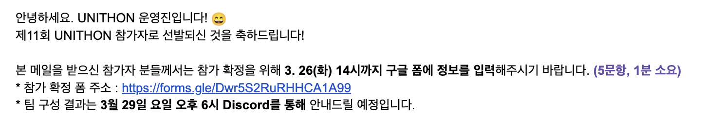
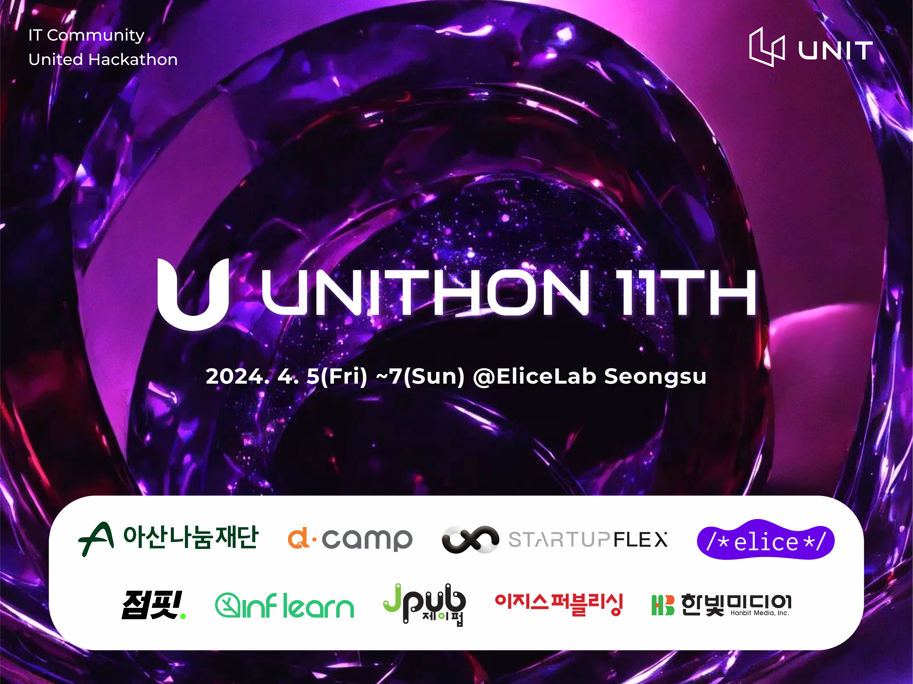
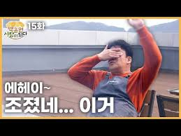
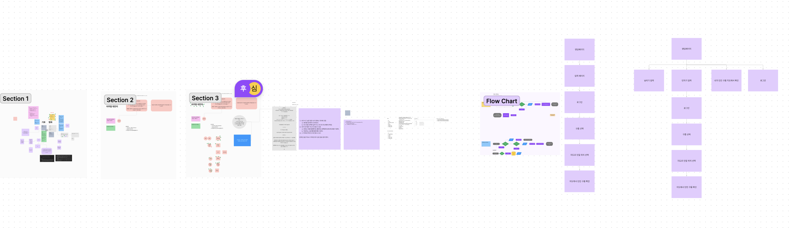
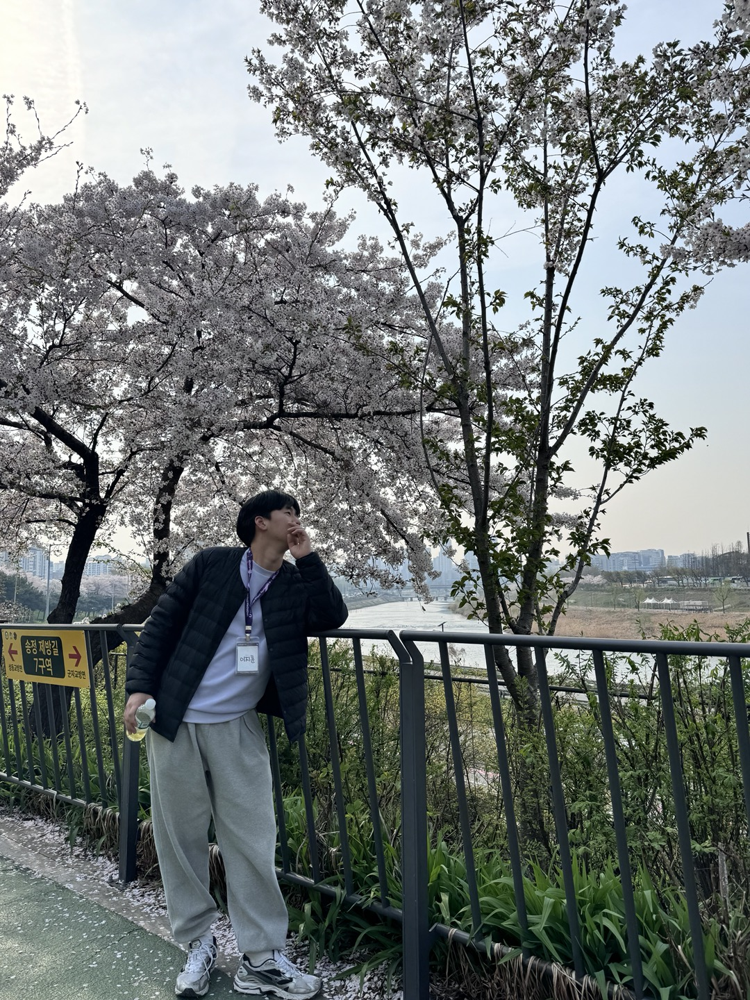
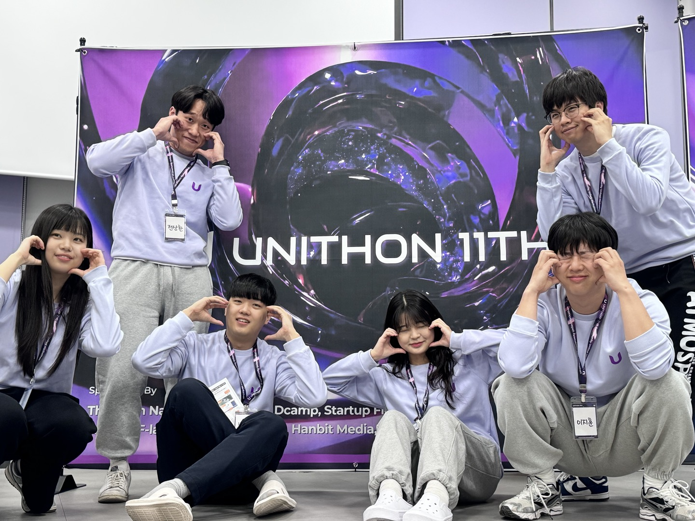
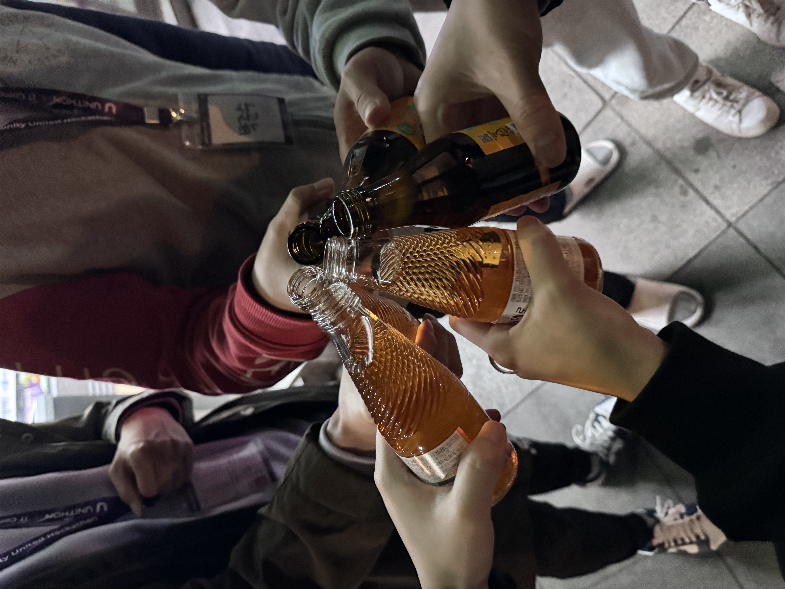
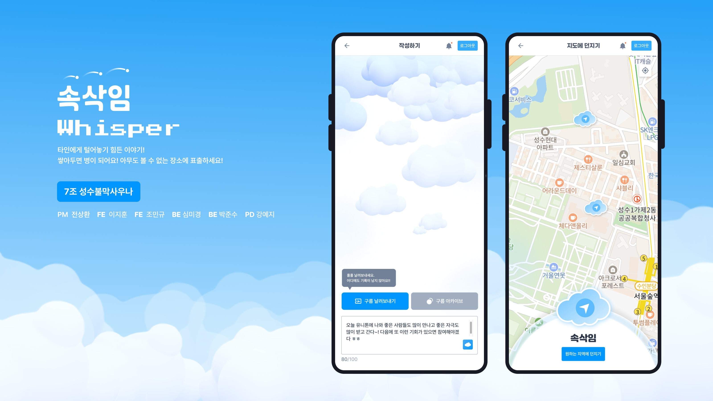
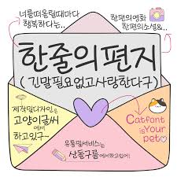
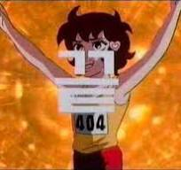

## ✋ Welcome Unithon

<br>


<br>

평소와 똑같이 회사, 집을 무한하게 반복하던 삶에서 UNITHON이라는 해커톤에 대한 정보를 듣게 되었다!!
운영진을 해볼까.. 아니면 참여자가 되어볼까.. 고민을 하던 중 아직 경험해보지 않았으니 이번에는 해커톤 참여자를 해보자!! 라는 비장한 다짐과 함께 신청서를 작성했다!

경쟁률이 엄청 높다고 들어서 될까? 라는 걱정이 있었지만.. 근무 중에 산뜻한(!?) 이메일을 받았다!!

<br>



<br>

아니!!!!!! 이런 말은 부끄럽지만... 요즘 이런저런 생각을 하는 나에게!!!!!! 엄청 오랜만에 합격 이메일이..ㅋㅋㅋㅋㅋ **너무너무너무너무너무 x 1000** 기분이 좋았다!!!

<br>

<h4>Love UNITHON, Thank UNITHON , Together UNITHON</h4>

<br>


<br>

## 해커톤 준비 과정

나는 UNITHON의 7조가 되었다! 처음 디스코드에 초대되었을 때 서로에 대한 정보가 없어서 긴장되었다..
하지만 우리 팀은 해커톤에 대한 열정이 넘쳤다. 미리 기술스택과 주제에 대한 이야기도 해보고 다양한 이야기를 디코에서 나누었다.

> 민규님께서는 vite+tailwind+zustand의 세팅도 해주셨다!!! (너무너무 감사합니다 ㅋㅋ) 🙏🙏

<br>

### 첫 만남

이번 해커톤은 성수동 엘리스랩에서 19시에 시작되었다. 총 6명씩 x 10팀이 참가하였다. 주제가 정해지지 않은 채 사람들과 아이스브레이킹을 진행했다!

사실 너무너무 긴장해서 뭐 말이라도 할까 싶었지만, 이 사람들 텐션이 너무 좋다.. 뭘 말해도 잘 반응해주고 좋은 팀이라는 게 느껴지는.. ㅋㅋ

<br>

### 해커톤 소개와 주제 발표

<br>



이번 UNITHON은 다양한 후원사와 함께한다. (능력자 UNITHON 운영진들 칭찬합니다!!) 대경님의 UNITHON 소개가 너무너무 재미있고 긴장되는 마음을 해소시켜주어서 감사했다

그리고 중간 쉬는 시간에 팀원들과 수다 떨면서 어떤 주제가 안 나오면 좋겠어요?? 이야기를 했을 때 기후와 평화가 대부분이었다..

뭐.. 그 다음은 예상가겠지만 **주제는 기후와 평화**가 되었다 ㅋㅋㅋ

<br>



<br>

그래도 마음을 가다듬고 아이데이션을 시작했다. 본격적인 해커톤 시작!

<br>

## 해커톤 시작!

### Day-1 아이데이션

거의 22시 30분부터 아이데이션을 진행했다. 2박 3일 해커톤이여서 첫날은 무리없이 귀가하자는 의견이 많아 12시면 끝나겠지? 라고 생각했지만 열정적인 팀원들과 새벽 3시까지 회의하고 이야기를 진행했다.



팀명은 성수 불막 사우나로 결정했다. ~~(중간에 피곤할 때 불막 사우나를 갔기 때문 ㅋㅋ)~~

디자인 초안을 몇개 확인했는데 우리 갓 능력자 디자이너 예지님 덕분에 너무너무 편한 마음으로 찜질방으로 달려갔다! (짧은 시간동안 몇마디로 구름을 그려내고 로고를 만들어내는 당신 존경..)

이렇게 Day-1을 마무리 짓고(사실 Day-1,2,3가 의미 있나 싶긴하지만) 4시간 정도 취침 후에 다시 모였다!

> 뭐 중간마다 에피소드가 있는데 사우나에서도 수다떨다가 아이데이션도 하고, 매점앞에서 자다가 오픈시간이여서 쫓겨나서 일찍 시작한 것도 있지만 ~~이미지 포장..~~

<br>

### Day-2 디자인, 개발

전날 아이데이션을 기반으로 기획에 대한 최종 회의를 오전까지 진행했다. 그 이후에 점심 식사를 하고나서 산책을 다녀오고 바로 개발을 시작하였다.

<br>



<br>

> 좋은 사진을 찍어주신 미경님 Thank you 😁

FE, BE가 프로젝트 세팅에 필요한 것들을 정리하면서 기획, 디자인이 이루어졌고 먼저 소셜로그인과 공통으로 쓰는 UI를 만들었다. 사실 해커톤에 처음 참여해서 정보가 없었다. 사람들과 잘 아이데이션하면서 개발을 진행하면 되겠다 싶어서 중간에 산책도 다니고 사진도 찍으러 다녔다.. 수다도 많이 떨구... 다른 조 분들에게는 너무 정신 없어서 시끄러웠을 것 같아서 죄송한 마음이 든다..ㅠㅠ

어찌저찌해서 개발을 16~17시까지 진행하고 디자인이 정리가 되어서 본격적인 개발이 시작되었다. (물론 저녁먹고 ㅋㅋ)

저녁먹고나서 급한 마음에 개발을 계속했다~!! UNITHON에서 불타는 경쟁이 아닌 사람들과 잘 어울려서 해커톤을 진행하면 좋겠다고 안내를 받았는데 중간중간 재미있는 미션, 게임을 진행해서 상품도 받고 사진도 많이 찍었다.

<br>



<br>

### Day-3 초 집중

<br>



> 해커톤이니 맥주 탈락! 비타민!

이제는 BE와 API도 연결해야 되고 그전까지 UI 작업은 마무리 지어야되어서 정신없이 불꽃 코딩을 했다. 그러고 새벽에 또 중랑천으로 산책을 나갔다 ㅋㅋ (우리팀 애정해..) 산책 다녀와서는 거의 아침 9시 발표할때까지 미친듯이 작업을 했다.(중간에 체력적 이슈가 있지만... 잘 버텼다 30분뺴고 ㅋㅋ)

그렇게 해서 우리의 **속삭임(Whisper)** 가 완성되었다!!!



너무너무 감사하게도 디자이너 예지님이랑 PM 상환님께서 발표를 위한 자료들을 다 만들어주셨다.. 그래서 조금 여유가 생겼고.. 바로 발표가 진행되었다.

**발표자료가 궁금하면 [여기를](https://unit-center.notion.site/4b29b6b0050b409fbb004aa13cf3458c?pvs=4) 확인해보세요!**

<br>

### Day-3 발표, 시연, 수상

사람들의 발표를 보는데 다들 열심히 하신게 보이고 저런 아이디어를 내고 기획, 구현한 것에 대해서 너무너무 존경스러웠다. 우리팀 상환님께서 발표를 너무 재미있고 잘 진행해주셧다 (감사합니다!)

평가하시는 분들이 와서 엄청 떨면서 시연발표를 했다! 반응도 좋았고 끝나자마자 긴장이 풀려서 주저앉았버렸다. 우리팀 열심히 해서 수상에 대해 욕심을 내보았지만!! 아쉽게도 수상은 못했다. 그래도 시연 때 돌아다니면서 우와 여기팀 잘했다!! 생각했던 팀들이 수상해서 너무 기분이 좋았다 특히 9팀이 인상 깊었다!! (혹시.. 9팀분들 제 블로그 보시면 연락한번 주세요ㅠㅠ 친해지고싶어요..ㅋㅋ)

<br>

## 짧은 편지



### To.. 7조

이렇게 내 첫 번째 해커톤이 마무리되었다. 중간에 재미있는 게임을 진행해주시고 너무너무 맛있는 음식들을 준비해주신 **UNITHON 운영진분들께 너무 감사하다.** 뽑아준 것도 너무너무!

백앤드에서 든든하게 작업해주고 분위기 좋도록 텐션 이끌어주시고 새벽에 자는 거 깨워서 API 수정요청했을 때 웃으면서 해주신 **미경님과 준수님** 너무 감사합니다. 제가 장난도 많이 치고 정신 없었을 텐데 감사합니다.

우리의 나약한 아이디어를 효과적으로 디자인해주신 **예지님** 너무너무 존경하고 멋집니다!!! 집중하는 모습 존경스러웠습니다. 당신은 좋은 디자이너가 될 것 같아요.

우리 아이디어에서 요점을 잘 잡아주시고 좋은 방향으로 이끌어주고, 자료를 만들고 발표도 재미있게 해주신 우리 **상환님** 너무 감사합디다

저와 같이 FE하느라 고생 많으신 **민규님** 구름 둥둥 띄우는 모습 열정 있고 너무 보기 좋았습니다. 다음 주에 만나기로 했으니!! 그때 또 커피챗 진행해보아요~!!!!


<br>

### To.. me

이번 해커톤으로 엄청나게 힐링을 많이하고 많은 생각을 하게 되었다. 요즘 이것저것 해야될 것이 많아서 힘들다는 생각을 많이했는데 어떤 것에 집중해서 작업을 했더니 첫 개발을 시작한 추억이 생각이 조금씨 회상되었다.

그때 당시에는 뭘해도 불타고 열심히 했는데 스스로가 기만하여 요즘 나를 힘들게 하지 않았나? 라는 반성을 하기도 하고.. 좋은 사람들을 1년동안 너무 많이 만나서 내가 어떤 것을 할 수 있는 원동력이 되고 있다. 뭐 주절주절.. 말하는 거지만 이런 과정들 덕분에 앞으로의 삶이 너무 기대되고 많은 것을 하고싶다는 생각이 든다!

> 이런 좋은 감정 해커톤 마지막에 발표하고싶었는데 심장이 작아서 못했다. 다음에는 핑계대지말고 하자ㅠ

참고로 요즘 rust랑 go 도 관심이 많아서 하나씩 두들겨 볼 예정!!!

좋은 추억과 많은 생각을 하게 된 해커톤 이야기

<br>



<br>
<br>
<br>

<h2>그리고 운영진이나 해커톤 참여하신 분들 연락주시면 감사하겠습니다! 친해지고싶어요!</h2>

```toc

```
