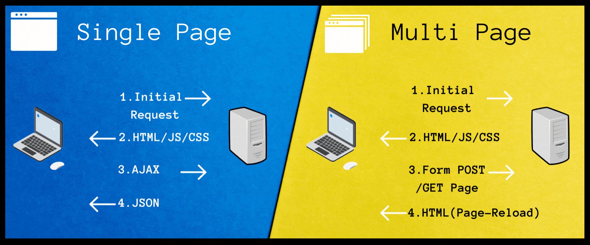
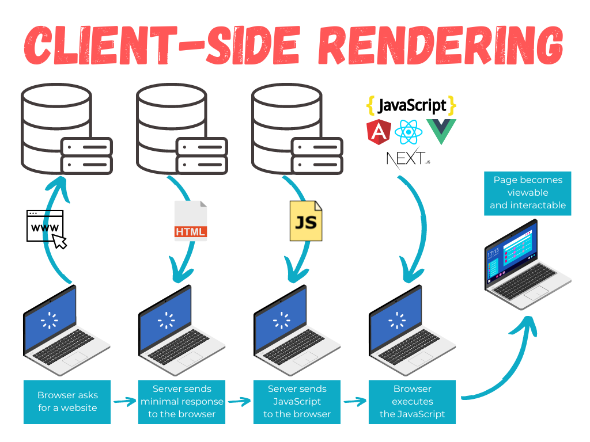
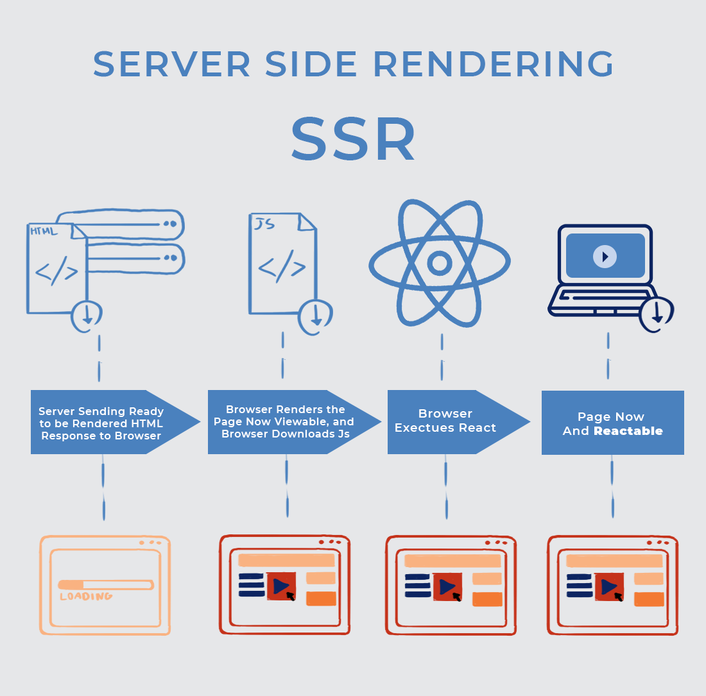
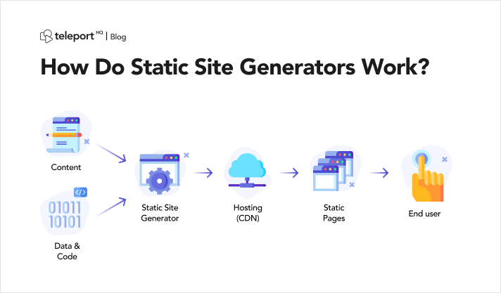
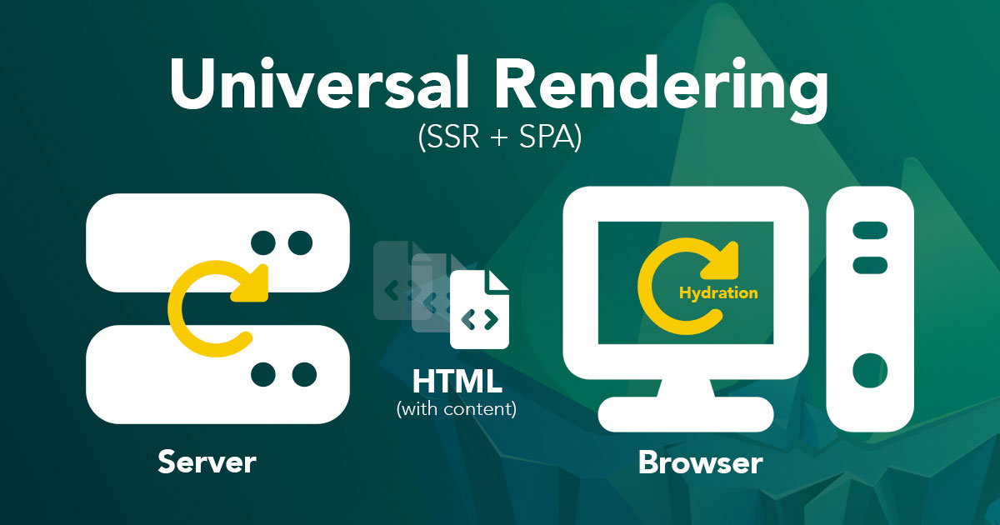
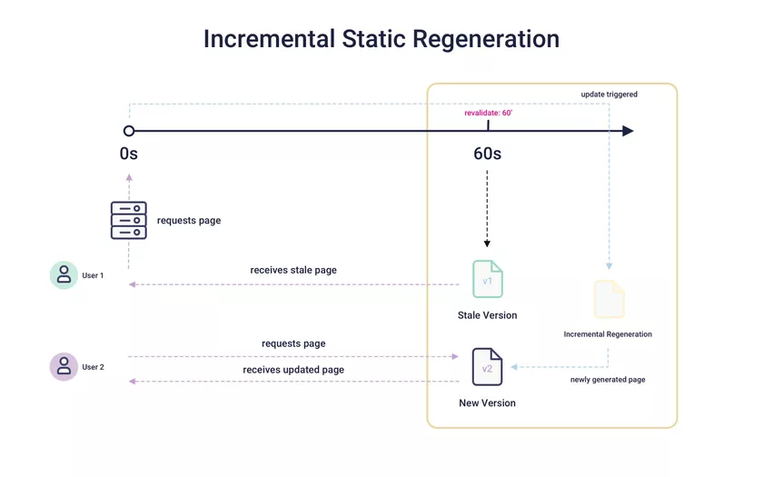

<br>

> 🚨 해당 게시글은 [브라우저 렌더링의 모든 것](https://hooninedev.com/240329/)의 후편이니 읽고 오시면 이해가 더 잘됩니다!!

<br>


<br>

먼저, 웹 렌더링이란 웹 페이지를 사용자가 볼 수 있는 형태로 변환하는 프로세스를 의미한다. 렌더링 방식에 따라 로딩 속도, 검색 엔진 최적화(SEO), 사용자 경험 등이 달라지기 때문에 우리는 방식을 선택할 때 많이 고민할 수 밖에 없다.

고민을 하다보면 CSR,SSR,SPA,MPA,SSG 등등.. 다양한 단축어에 대해 당황하게 된다. 모든 것들에 대해서 살펴보고 어떤 차이점이 있는지 알아보자.

해당 글은 **웹 애플리케이션의 특성과 차이점(SPA,MPA)** 에 대해 설명을 한 후에 **웹 렌더링 방식(CSR,SSR,SSG,ISR,Universal Rendering)** 에 대해 설명해보겠다!

<br>

<br>

## SPA vs MPA (웹 애플리케이션 특성)

<br>



<br>

### Single Page Application(SPA)

SPA는 하나의 브라우저 내에서 동작하는 애플리케이션이며 사용하는 동한 페이지 로딩을 필요로 하지 않는다. Gmail, Google Maps, Facebook, GitHub 등이 SPA에 해당한다.

모든 SPA들은 브라우저에 자연스러운 환경을 모방하려고 하며, 훌륭한 UX를 제공하면서 페이지 리로드가 없으며, 별도의 기다리는 시간도 없다. 우리가 방문하고 사용하는 모든 컨텐츠는 하나의 웹페이지 이며, Javascript를 사용해서 로드 되기 때문에 크게 의존적이다.

SPA는 마크업과 데이터를 각각 요청후, 브라우저에서 바로 페이지를 그린다. 우리는 AngularJS, Ember.js, Meteor.js, Knockout.js와 같은 진보한 Javascript를 이용하여 이 작업을 진행할 수 있다.

단일 페이지 사이트들은 사용자에게 심플하면서도 쉽고 실용성있는 컨텐츠를 제공해주는 편안한 웹 공간에 사용자가 머물도록 돕는다는 장점을 가지고 있다.

<br>

### Multi Page Application(MPA)

멀티페이지 애플리케이션들은 브라우저에서 변경사항이 있을 때서버로 서브밋 데이터를 전달하여 새로운페이지 렌더링을 요청하고 그 데이터를 표시한다. MPA는 SPA보다는 규모가 더 크다.

많은 컨텐츠로 인해, 많은 UI 레벨을 갖게 된다. AJAX 덕분에 우리는 크고 복잡한 애플리케이션들이 서버와 브라우저사이에서 많은 데이터를 전송해야 하는 문제 없이 필요한 것만 데이터를 요청 할 수 있다.

<br>

## Client Side Rendering (CSR)



<br>

CSR은 클라이언트(브라우저)에서 웹 페이지를 렌더링 하는 것이다. 모든 로직, 데이터, 템플릿, 라우팅 등을 서버가 아닌 클라이언트에서 처리하게 된다.

CSR은 브라우저가 페이지 초기 HTML을 받은 후에 Javascript 파일을 다운로드하고 해석해야 되는데, 번들 크기가 크면 초기 로딩 시간이 길어지고 사용자 인터렉션이 감소해 이탈율이 높아 질 수 있기 때문에 번들 크기를 고려해야 한다.

<br>

### CSR 동작 방식

<br>

**1. 브라우저가 index.html 다운로드**

사용자가 웹 페이지를 방문하면, 브라우저는 해당 웹 서버에 HTTP 요청을 보내고, 서버는 클라이언트에게 index.html 파일을 포함한 초기 응답을 보낸다. index.html 파일은 `<script>`, `<meta>`, `<link>` 와 같은 태그들을 포함하고 있으며, 일반적으로 기본 레이아웃 및 초기 구조를 정의한다.

**2. 자바스크립트 번들 파일 다운로드**

브라우저는 index.html을 다운로드한 후, 이 파일에 포함된 자바스크립트 번들 파일을 다운로드하는데, 해당 자바스크립트 파일에는 웹 애플리케이션의 논리 및 동작 방식에 대한 코드들이 포함되어 있다.

**3. API 요청 및 동적 컨텐츠 가져오기**

자바스크립트가 다운로드되면, 브라우저는 해당 파일을 해석하고 실행하게 되는데 AJAX나 Fetch API를 사용하여 서버로부터 동적 데이터를 가져오는 API 요청을 수행한다. 이러한 API 요청을 통해 서버로부터 데이터를 받아오고, 이 데이터를 파싱하여 웹 페이지에 동적으로 추가될 수 있는 형식으로 가공한다.

**4. 최종 컨텐츠 렌더링**

API 요청을 통해 받은 데이터를 가지고, 자바스크립트는 웹 페이지의 최종 컨텐츠를 동적으로 생성한다. 이 컨텐츠는 보통 사용자에게 보여질 데이터이며, 브라우저는 이를 HTML DOM(Document Object Model)에 추가하여 렌더링한다.

**5. 페이지 이동 시 자바스크립트 재사용**

사용자가 페이지를 이동할 때, 새로운 HTML 파일을 서버에 요청하는 대신, 이미 다운로드된 자바스크립트를 재사용하여 새로운 데이터를 가져오고 렌더링한다. 페이지 이동 시에는 전체 페이지를 다시 로드하는 것이 아니라, 필요한 부분만을 업데이트하여 사용자에게 빠른 반응성을 제공한다.

<br>

### CSR 장점

- CSR은 이미 모든 `script`, `meta`, `link` 등이 사전에 로드되었기 때문에 로드 시간이 줄어들고, 서버를 호출할 때마다 전체 UI를 다시 로드할 필요가 없다.

- 스크립트가 이미 캐싱된 경우 인터넷 없이도 해당 CSR 웹 애플리케이션을 실행할 수 있어서 지연 로딩 모듈이나 별도 API가 필요하지 않다.

<br>

### CSR 단점

- CSR을 사용하면 브라우저는 브라우저에서 사용 가능한 컨텐츠로 HTML을 컴파일하기 전에 기본 HTML, CSS 및 모든 필수 스크립트를 로드하기 때문에 초기 로드 시간이 SSR보다 느리다.

- 브라우저가 페이지를 표시하기 전에 HTML 및 JavaScript 파일을 다운로드하고 프레임 워크를 실행하는 동안 사용자는 빈페이지를 보게 되므로 사용자 경험이 좋지 않다.

- 한 페이지에서 다른 페이지로 변할 경우 이를 인지 시켜주기 위해 각 페이지에 대한 메타 데이터를 설정하고 클라이언트에서 렌더링하기 위해 추가 노력이 필요하다.

- 검색 엔진 크롤러가 해당 페이지에 처음 방문했을때는 빈 페이지이기 때문에 SEO에 친화적이지 않다.

  > 물론 자바스크립트를 실행시킬 수 있는 구글 크롤러와 같은 검색엔진 크롤러가 등장하고 있긴하지만, 아직 많은 검색 엔진 크롤러들이 지원되지 않는다.

<br>

## Server Side Rendering (SSR)

<br>



클라이언트 측이나 유니버셜 앱(Universal App)을 서버의 HTML로 렌더링하는 방식으로, 웹 애플리케이션의 **초기 렌더링을 서버에서 처리하고, 클라이언트에 전달하는 방식** 을 의미한다. 이를 통해 클라이언트가 서버로부터 응답을 받기 전에 데이터 패칭 및 템플릿 작성이 처리되므로 클라이언트에서 추가적인 네트워크 왕복이 발생하지 않는다.

<br>

### SSR 동작 방식

<br>

**1. 사용자 요청 처리**

사용자가 웹 페이지를 방문하면, 해당 요청은 서버로 전송된다.

**2. 서버 측 렌더링**

서버는 필요한 데이터를 데이터베이스 또는 다른 소스로부터 가져오는 걸 시작으로 해당 요청에 대한 처리를 시작한다.
서버는 페이지에 포함된 서버 측 스크립트를 실행하여 데이터를 가져와 페이지의 동적인 부분을 채워 초기 상태를 생성하고, 이 초기 상태와 함께 HTML 템플릿을 사용하여 전체 페이지의 HTML을 컴파일한다.

**3. HTML 응답 전송**

서버는 생성된 HTML을 클라이언트에게 응답으로 보내고, 이 HTML은 초기 상태와 함께 클라이언트에게 전송됩니다.

**4. 브라우저에서 HTML 및 자바스크립트 처리**

브라우저는 서버로부터 받은 HTML을 받은 후 화면에 표시를 하게되는데, 이 단계에서 사용자는 초기 페이지를 볼 수 있다.
페이지를 대화형으로 만드는 데 필요한 자바스크립트 코드를 다운로드하고 실행한다. 이후에는 클라이언트 측 자바스크립트가 활성화되어 사용자의 상호작용에 따라 페이지를 업데이트하고 추가적인 데이터를 요청하고 렌더링한다.

**5. 페이지 이동 시 작업 반복**

사용자가 페이지를 이동할 때, 클라이언트는 서버로 새로운 요청을 보내고 SSR 프로세스가 다시 시작된다. 새로운 HTML이 서버로부터 다운로드되고 브라우저에 의해 처리되며, 이 과정에서 추가적인 상호작용이 가능한 페이지를 사용자에게 제공한다.

<br>

### SSR 장점

- 렌더링이 준비된 HTML 파일을 브라우저에서 로드하기 때문에 CSR에 비해 초기 페이지 로드시간이 더 빠르다.(FP 및 FCP가 더 빠르다)

  > FP(First Paint): 첫번째 픽셀이 스크린에 페인팅 되었을 때(시간)
  >
  > FCP(First Contentful Paint): DOM에 속해있는 컨텐츠 조각이 스크린에 페인팅 되는 순간(시간)
  >
  > FPM(First Meaningful Paint): 브라우저가 유저가 관심있어 할 만한 컨텐츠를 페인트하여 나타냈을 때까지의 시간

- 서버에서 페이지 로직 및 렌더링을 실행하면 많은 자바스크립트를 클라이언트에 보내지 않아도 되므로 TTI를 빠르게 수행할 수 있다.

  > TTI(Time to Interactive)는 페이지가 안정적으로 사용자 상호 작용이 가능한 상태가 된 첫 번째 콘텐츠 페인트(FCP) 이후 가장 빠른 시간을 측정

- 이미 다 만들어진 페이지를 검색엔진 크롤러가 요청에 대한 응답으로 받기 때문에 SEO에 친화적이다.

- 컴퓨팅 성능이 훨씬 더 뛰어난 서버를 이용해 소프트웨어 성능 영향을 줄이게 되고, 클라이언트의 부담감이 줄게 된다.

<br>

### SSR 단점

- 페이지 이동시마다 서버에서 페이지를 생성하는데 시간이 걸리기 때문에 TTFB(Time to First Byte)가 느리다.

- 초기 페이지 로드시 많은 데이터가 필요하다면 사용자 경험을 해칠 위험이 있다.

- 서버는 항상 각 요청이 올때마다 HTML파일을 생성하기 때문에 CDN 수준에서의 컨텐츠 캐시가 되지 않는다.

- 클라이언트에서 자바스크립트를 이용해 렌더링하는 CSR에 비해 서버 사이드에서 HTML파일과 안에 내용을 생성해야 하기 때문에 서버 호스팅이 필요하다.

- SSR 프레임워크를 사용한다면 추가적인 러닝 커브에 대한 비용이 발생하고 개발 노력이 필요하다.

<br>

## Static Site Generator(SSG)



Next.js와 같은 프레임워크에서도 권장되는 렌더링 방식 중 하나로 SSR과는 다르게 HTML 파일의 생성 시점이 빌드 타임(build time)에 이루어진다. 그리고 사이트 생성 후 백엔드가 필요하지 않으므로 콘텐츠 전송 네트워크(CDN)을 사용한다.

대체로 SSG는 제품 페이지, 뉴스 기사, 소프트웨어 문서, 블로그 등 거의 변경되지 않는 정보성 콘텐츠에 사용된다.

<br>

### SSG 동작 방식

<br>

**1. 빌드 타임 생성**

SSG에서 웹 페이지의 HTML은 빌드 타임(build time)에 생성된다. 빌드 타임에는 웹 애플리케이션의 모든 페이지가 사전에 렌더링되고, 필요한 데이터가 사전에 수집되어 페이지의 내용이 정적인 HTML로 컴파된.

**2. 정적 파일 생성**

빌드 타임에 생성된 HTML 파일들은 서버에서 호스팅되는 정적 파일로 저장되는데, 이 파일들은 클라이언트에 의한 요청이 있을 때마다 서버에서 바로 제공되고 각 HTML 파일은 해당 페이지에 대한 모든 콘텐츠와 구조를 포함하고 있으며, 독립적으로 사용될 수 있다.

**3. 엣지 캐싱**

SSG에서는 엣지 캐싱(edge caching)이 일반적으로 사용되는데, **엣지 캐싱은 정적 파일을 CDN(Content Delivery Network)의 엣지 서버에 저장하여 전 세계의 사용자에게 빠르게 제공하는 기술** 이다.
CDN은 사용자의 요청이 해당하는 정적 파일을 요구할 때, 가장 가까운 엣지 서버에서 캐시된 파일을 반환하여 응답 시간을 최소화한다.

**4. HTML 응답 전송**

클라이언트가 웹 페이지를 요청하면, 엣지 캐싱된 HTML 파일이 클라이언트에게 반환되고 받은 HTML 파일을 브라우저에서 렌더링하여 사용자에게 페이지를 표시한다.

**5. 자바스크립트 처리**

페이지가 이미 빌드 타임에 정적으로 생성되었기 때문에, 서버에 추가적인 요청을 보내지 않고도 초기 페이지를 표시할 수 있다. 그렇기 때문에 클라이언트 측 JavaScript의 사용이 제한된다. 하지만 필요에 따라 클라이언트 측 JavaScript를 사용하여 추가적인 동적 상호작용이나 기능을 구현할 수도 있다.

<br>

### SSG 장점

- 빌드 타임에 HTML 파일이 생성되기 때문에 빠른 FP, FCP, TTI를 제공한다. 또한 매 요청마다 생성하는 것이 아니므로, SSR과 달리 일관성있게 빠른 TFB를 달성할 수 있다.

- 이미 생성된 HTML 파일을 받기 때문에 SEO 친화적이다.

- build 명령은 실제로 사이트를 방문하는 사람의 워크플로를 벗어나므로 시간이 좀 걸리더라도 문제되지 않는다.

<br>

### SSG 단점

- 모든 URL에 대해 개별 HTML 파일을 생성해야 한다. 따라서 URL을 미리 예측할 수 없거나 URL을 예측할 수 없으면 적용이 어렵다.

<br>

## Universal Rendering

<br>



<br>

Universal Rendering 또는 Isomorphic Rendering이라고도 불리는 개념으로 서버 측 렌더링(Server-Side Rendering, SSR)과 클라이언트 측 렌더링(Client-Side Rendering, CSR)의 장점을 결합한 접근 방식이다. 한 마디로 **브라우저와 서버 양쪽에서 동일한 코드를 실행하여 웹 페이지를 구성하는 방식** 을 의미한다

<br>

### Univeral Rendering 장점

- 초기 로딩 속도가 빠르고 SEO에 유리한 SSR의 장점을 유지하고, 클라이언트 측 자바스크립트를 사용하여 동적 상호작용성을 제공함으로써 CSR의 장점을 활용 할 수 있다.
- 사용자에게 빠르고 부드러운 페이지 로딩 및 상호작용을 제공하여 사용자 경험을 향상시킬 수 있다.

### Univeral Rendering 단점

- 별도의 서버가 필요하며, 구현 또는 구현을 위한 프레임워크 학습에 들어가는 비용이 크다.

- 페이지가 빨리 로드되며 인터렉션이 가능한 것처럼 보이지만, 실제로 클라이언트에서 자바스크립트가 실행되고 이벤트 핸들러가 적용될 때까지 입력에 응답할 수 없어, 사용자 경험이 안좋아질 수 있다.

<br>

## Incremental Static Regeneration (ISR)

<br>



ISR(증분 정적 재생성)은 런타임 중에 정적 페이지를 만들거나 업데이트 수 있도록 해주는 SSG과 SSR의 하이브리드 솔루션

<br>

### ISR 동작 방식

1. 사용자가 웹 페이지를 방문하면(request), 요청에 의해 페이지가 생성되지만 데이터가 오기를 기달려야하는 SSR과 달리 즉시 대체 페이지(fallback page)가 제공된다. 이 단계에서 대부분 placeholder 및 스캘래톤을 표시한다.

2. 데이터가 확인되면 최종 페이지가 캐시되고, 사용자는 SSG와 마 찬가지로 캐시된 버전의 페이지를 받게 된다.

3. 재검증시에도 사용자는 먼저 캐시된 버전을 받고 업데이트된 버전을 받는다. (캐싱 전략: Stale-while-revalidate)

   > stale-while-revalidate는 개발자가 캐싱된 콘텐츠를 즉시 로드하는 즉시성과 갱신된 최신 콘텐츠가 향후에 사용되도록 보장하는 최신성 간의 균형을 유지하는데 도움을 주는 HTTP Cache-Control 확장 디렉티브

<br>

### ISR 장점

- SSR과 달리 페이지가 즉시 제공되며(fallback page), 빠른 경험으로 사용자 경험도 좋아진다.

<br>

### ISR 단점

- 페이지 디자인에 따라 FP를 지연시킬 수도 있다.

<br>

## 그래서 뭘 써야될까??

사실 어떤 것을 쓰는지 정답은 없다. 사용하는 프로젝트의 특성에 대해서 먼저 분석하고 그 결과로 렌더링방식을 결정하면 될 것 같다.

웹/앱 애플리케이션을 만들 때 사용자 경험(UE), 검색 엔지 최적화(SEO), 서버 부하, 동적 데이터 요구, 개발 및 유지보수 용이성 등에 대해서 생각해보면 좋다.

사내에서는 SM,SI 개발을 동시에 하다보니 SEO 특성에 중점을 두는 것 보다는 자주 데이터가 변경되는 ISR 렌더링 방식같이 동적 컨텐츠와 데이터 변경을 다루는 방식을 선호한다. 선택하는 과정이 쉽지 않지만~! 큰 고민은 좋은 공부법이니 여러분들도 많이 고민해보면 좋겠다~

<hr>

## 출처 및 도움되는 링크들

- [콥 노트](https://ajdkfl6445.gitbook.io/study/web/csr-vs-ssr-vs-ssg)
- [Dev. Ella](https://dev-ellachoi.tistory.com/28)
- [web.dev](https://web.dev/articles/rendering-on-the-web?hl=ko)

```toc

```
