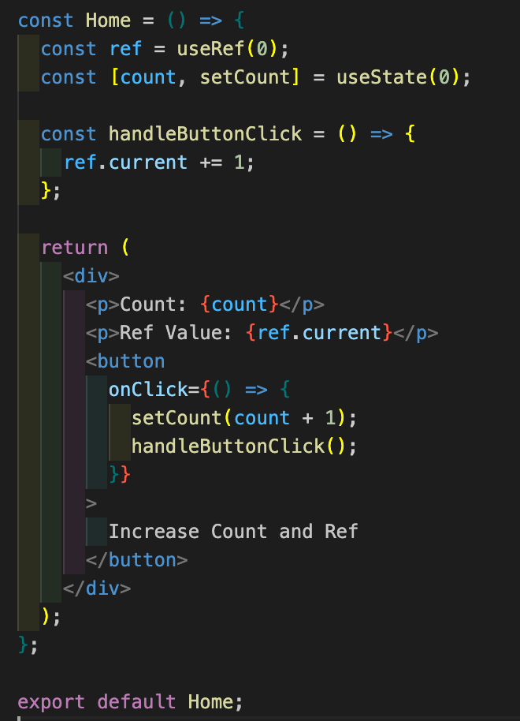

<br>

갑자기 작업하다가 궁금해져서 적는 첫번째 오이소박한 궁금증!!


<br>

## useEffect의 dependency에 useRef를 넣으면?

useEffect 의 []에 의존성(dependency)를 넣을 수 있다! ~~이건 다 알고 있겠죠!?~~

그러면 리렌더링이 될 때 어느 시점에 의존성이 작동 될 까!?

긴말 말고 예시코드를 보자!



<br>

위 코드는 useRef의 current, useState의 state를 handleButtonClick 함수를 이용해서 1씩 올려주는 코드다.

useEffect의 dependency에 useRef의 ref와 ref.current 의 값을 넣어보고 동작을 비교해보자~!!

<br>

### [ref]

<br>

```typescript
useEffect(() => {
  conosle.log('Ref의 값:', ref);
}, [ref]);
```

<br>

<video width="700" height="500" controls>
  <source src="3.mov" type="video/mp4">
</video>

<br>

useRef의 ref 객체를 dependency에 직접 넣어주게 되면 useEffect가 변경사항을 감지하지 못하고 리렌더링 되지 않는다.. 하지만 값은 변경된다!!!

<br>

### [ref.current]

<br>

```typescript
useEffect(() => {
  conosle.log('Ref의 값:', ref);
}, [ref.current]);
```

<br>

<video width="700" height="500" controls >
  <source src="4.mov" type="video/mp4">
</video>

<br>

그리고 useRef의 ref.current 값 을 dependency에 직접 넣어주게 되면 useEffect가 변경사항을 감지하고 리렌더링을 하게된다.

<br>

## 왜 이럴까??


useEffect의 의존성 배열에 ref를 직접 넣으면 리렌더링이 발생하지 않는 이유는 useEffect의 의존성 배열은 값의 변경 여부를 기준으로 한다.

> ⚠️⚠️ useEffect dependency
>
> 값들의 변경 여부를 판단할 때 얕은 비교(shallow comparison)가 이루어지기 때문에 배열 내부의 값들이 단순한 원시값(숫자, 문자열 등)이거나 참조 타입의 경우에는 그 참조가 동일한지를 확인한다.
>
> 만약 배열 내부의 객체나 배열과 같은 참조 타입의 값이 변경되었다고 해도, 배열 내의 객체나 배열의 참조 자체가 변경되지 않으면 useEffect는 다시 실행되지 않는다.

ref 변수 자체는 컴포넌트 내부에서 변경되는 것이 아니라, 그 안에 있는 current 속성이 변경될 때만 의존성이 작동해야 한다. 그러나 ref 변수의 참조 자체는 항상 동일하므로 의존성 배열에 ref를 직접 넣는다고 해서 useEffect가 리렌더링을 유도하지 않는다.

반면에 ref.current를 의존성 배열에 넣으면 useEffect는 ref.current 값이 변경될 때마다 다시 실행된다. ref.current 값은 직접 변경되는 값이므로 이를 의존성으로 사용하면 useEffect는 해당 값의 변경을 감지하여 다시 실행되고, 리렌더링이 발생한다.

이를 통해 useEffect의 의존성 배열에는 값의 변경을 감지할 수 있는 항목을 포함해야 하며, ref 변수의 경우에는 주로 ref.current와 같은 값을 사용하여 의존성을 설정하는 것이 적절하다.

<br>

<strong>한줄요약 : ref 변수의 참조 자체가 변경되는 것이 아니라 current 속성이 변경될 때만 의존성이 작동 </strong>

```toc

```
