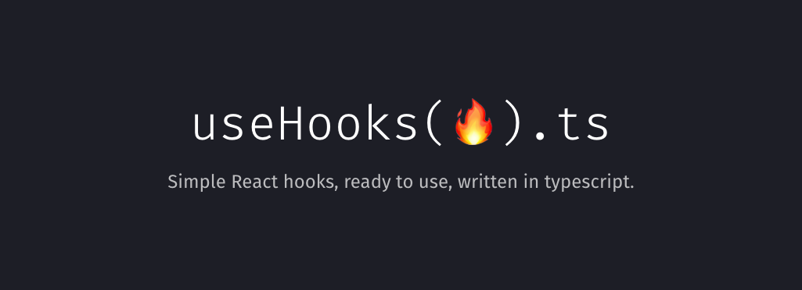

나는 SIPE라는 IT 동아리에서 1차 미션으로 **YouDontKnowJS** 라는 책을 읽고, **React의 hook의 작동원리에 대해서** 스터디하고 있다. 5주 정도 시간이 흘러 그동안 공부한 내용들을 정리해보려고 한다.


앞서 말한 데로 책은 카일 심슨의 YouDontKnowJs Yet(2024.01.12)으로 시작하였다. ~~=> 넌 아직 JS를 몰라, ㅋㅋ 아직도!!! 라는 뜻인가?!?~~
2판인 Yet에서는 자바스크립트에 대한 설명과 코드 패턴들 그리고 의문점들이 추가되었다. 1판만 가지고 계신 분들에게도 좋은 내용이 많으니 구매해서 읽어보시는 것을 추천한다!

<br>

## 책을 읽고 새롭게 알게 된 지식들

- JavaScript는 ECMAScript의 스펙을 지원하는 개발언어이며, 하위호환을 존중하는 언어이다.
- 렉시컬 스코프 스펙을 지원하기 위해 구문 분석과 같은 컴파일이 필요하고 **실제 동작은 인터프린터 방식을 취한다.**
- **Function에 대한 일급 객체를 지원한다.**
- 클로저, 프로토타입을 활용하여 function을 추상화 및 캡슐화하였고 상속 개념처럼 활용할 수 있도록 발전하다가 추후에는 class 문법을 지원하게 되었다.
- 클로저를 변수의 순간 상태를 기록한 것을 스냅숍이라 착각하지만, 언제든지 접근할 수 있도록 관계를 맺어주는 **라이브 링크**의 개념이 더 적합하다. 그렇기 때문에 **값을 읽는 것뿐만 아니라 수정(재할당)도 가능**하다.
- 클로저는 2가지 관점에서 정의 가능하다
  - **관찰 가능성 관점**
    - 반드시 함수와 관련이 있어야된다.
    - 외부 스코프의 변수를 적어도 하나 이상 참조해야된다.
    - 참조하려는 변수가 있는 스코프 체인의 다른 분기에서 함수를 호출해야한다.
  - **구현 관점**
    - 프로그램의 다른 부분에서 해당 함수 인스턴스에 대한 참조가 존재하는 한 함수 인스턴스와 그 전체 스코프 환경 체인을 살아있게 유지하는 마법
- **필자는 var 사용을 권장함.** 굳이 불변성이라는 이름에 맞춰서 let, const에 집중해야할까? => 해당 내용은 꼭 읽어보시기를 추천합니다 ~~(이런거 신입 면접 때 말하면 간지나겠다)~~
- **동기 클로저** : 함수 내부에서 비동기적으로 처리되는 작업이 있을 때, 그 작업이 완료된 후에 특정 동작을 수행해야 할 경우 사용한다. 주로 콜백 함수(callback function)나 이벤트 핸들러(event handler)에서 사용한다.
- **AMD(비동기 모듈 정의) 와 UMD 패턴** => **한번 찾아보시는 것 추천!👍👍**
  - UMD 패턴은 모듈이 AMD, CommonJS, 그리고 전역 객체(Global object) 등 다양한 환경에서 사용될 수 있도록 하기 위해 모듈이 있는지 여부를 체크하고, 해당 환경에 맞게 모듈을 정의하는 방식
  - AMD는 자바스크립트 모듈을 비동기적으로 로드하고 정의하는 모듈화 방식으로 브라우저 환경에서 모듈화를 구현하는 데 사용

<br>


<br>

작년 초에 클로저를 사용하는 것을 지양해야 된다는 글을 보았다. 글에서 클로저 지양을 주장한 이유는 클로저를 남발해서 사용하다 보면, 변화에 대한 인지가 어려울 수 있고, 변수의 변화가 GC(가비지 컬랙터)를 예기치 않게 막아 메모리 사용을 급증시키는 요인이 되기 때문이었다. 1년여 시간이 지난 지금 IT 분야에서 메모리 사용에 대한 중요성이 주목받으면서 해당 내용이 어떤 의미로 작성된 것인지 간략하게 알게되었다.

그래도 개인적인 생각에는 클로저의 특성을 잘 사용하면 효율적이고 성능이 뛰어난 프로그램을 구축하는 데 큰 영향을 준다고 생각한다. 단, 필요하지 않은 함수 참조와 그에 따른 클로저를 제때 잘 삭제하는 것이 중요하다고 생각한다!

<br>

## React hooks 파GO파GO

<br>


<br>

클로저의 개념을 이용한 것들이 아주아주 많다. 비동기 처리, React의 다양한 훅들, 컴포넌트의 구성 등등....

많이 사용하는 것 중에 어떤 것이 있고, 어떻게 사용하고 또 어떻게 개선할 수 있을까 등에 관해서 공부해 보았다.

<br>

### useState

우선 useState는 예~~전에 블로그에 작성해두어서, 해당 부분 복습할겸 다시 찾아보았다. 해당하는 내용은 **[여기를](https://hooninedev.com/230820/)** 참조해보시면 됩니다

비동기 처리와 오래된 클로저 함수를 사용할 때 캡처에 관해서 문제가 생긴다. 그래서 캡처하는 시점을 파악해서 지연을 주거나, 새롭게 값을 할당할 수 있도록 해야 한다. 자세한 건 아래의 예시 코드를 확인해보자

```javascript
function DelayedCount() {
  const [count, setCount] = useState(0);

  function handleClickAsync() {
    setTimeout(function delay() {
      setCount(count + 1);
    }, 1000);
  }

  return (
    <div>
      {count}
      <button onClick={handleClickAsync}>Increase async</button>
    </div>
  );
}
```

버튼을 클릭할 때마다 setTimeout이 1초의 delay()의 실행을 예약한다. 위 경우에서 버튼을 연달아 2번 클릭하게 되면 두 번째 클릭의 delay()가 오래된 count의 값을 0으로 캡처하기 때문에 count가 1만 올라가게된다

위 오류를 해결해주기 위해서는 delay() 내부를 아래와 같이 바꾸면 된다.

```javascript
setTimeout(function delay() {
  setCount((count) => count + 1);
}, 1000);
```

**이전 상태를 기반으로 새 상태를 반환하는 콜백이 상태 업데이트 함수에 제공되면 React는 최신 상태 값이 해당 콜백의 인수로 제공되도록 변경이 필요해 위 처럼 변경해야된다.** 그렇게 하면 빠르게 2번 클릭해도 값이 정상적으로 count가 2가 된다.

간단하지만 예시지만 복잡한 코드를 구현할 때 비동기 처리와 여러 상태를 동시에 다루다 보면 캡처의 시점을 제대로 파악하지 못하는 경우가 종종 있다. 그래서 이전값에서 새로운 값을 업데이트해 줄 경우에 **Arrow Function을 사용하는 것을 권장한다!**

<br>

### useEffect

useEffect는 hook을 사용하면서 useCallback과 함께 제일 많은 사이드 이펙트가 발생한다. 그러므로 많이 중요하다고 생각해서 하나의 블로그 주제로 다룰 예정이기에 여기에서는 새롭게 알게 된 부분과 유의해서 사용될 부분에 대해서 기록하도록 하겠다!

우선 아래 useEffect 코드를 실행해보고 작동 순서를 파악해보자

```javascript
import React, { useEffect, useState } from 'react';

function Home() {
  const [state, setState] = useState(0);
  console.log(state);

  useEffect(() => {
    setState((state) => state + 1);
  }, []);

  useEffect(() => {
    console.log(state);
    setTimeout(() => {
      console.log(state);
    }, 100);
  }, []);

  return null;
}

export default Home;

// 0
// 0
// 1
// 0
```

일단 첫 번째 렌더링에서 console.log(state)에 의해서 **console.log(0)이 출력된다.** 그 후에 setState의 callback 함수가 호출되고 여전히 **console.log(state)는 0으로 출력된다.** 그 이후 setTimeout으로 0.1초의 기다림 후에 **setState가 1이 된다.** 2번째 렌더링이 발생하고 **console.log(state)는 1이 출력**되고 setTimeOut 함수의 클로저 때문에 **마지막으로 0이 출력된다.**

그럼 조금 더 응용해보자. 우리는 useEffect를 사용하지만 **useInsertionEffect, useLayoutEffect도 사용한다.** 작동의 우선순위를 생각해보며 아래 코드를 실행해보자

```javascript
import { useEffect, useInsertionEffect, useLayoutEffect, useState } from 'react';

const Home = () => {
  console.log(1);
  const [state, setState] = useState(0);
  useEffect(() => {
    setState((state) => state + 1);
  }, []);

  useEffect(() => {
    console.log(2);
    return () => {
      console.log(3);
    };
  }, [state]);

  useEffect(() => {
    console.log(4);
    return () => {
      console.log(5);
    };
  }, [state]);

  useLayoutEffect(() => {
    console.log(6);
    return () => {
      console.log(7);
    };
  }, [state]);

  useInsertionEffect(() => {
    console.log(8);
    return () => {
      console.log(9);
    };
  }, [state]);
  console.log(10);
  return null;
};

export default Home;

// **첫 번째 렌더링 출력값**
// 1
// 10
// 8
// 6
// 2
// 4
// 첫 번째 렌더링 출력값
// 1
// 10
// 9
// 8
// 7
// 6
// 3
// 5
// 2
// 4
```

일단 알아야 될 것은 렌더링 우선순위는 높은 순서에서 낮은 순서대로 Main thread => useInsertionEffect => useLayoutEffect => useEffect 이다.

그리고 리렌더링의 우선순위는 높은 순서에서 낮은 순서대로 Main thread => useInsertionEffect 정리 후 즉시 실행 => useLayoutEffect 정리 후 즉시 실행 => useEffect 모두 정리 => 순서대로 하나씩 useEffect 실행

<br>

### 번외로.. useEffectOnce

여러분들은 useEffectOnce를 사용하시나요? 저는 한번의 useEffectOnce를 custom Hook으로 사용합니다. 사내에서 useEffect를 많이 사용하다보니, 꼭 사이드 이펙트를 방지해야되는 코드를 명시적으로 보기 위해서 사용하는데..!!

```javascript
import { useEffect } from 'react';

function useEffectOnce(effect) {
  useEffect(effect, []);
}
```

> 이 부분에 대해서 피드백 해주시면 감사하겠습니다🙇🙇‍♂️

<br>

## 아 그리고.. 번외로!

나 생각해보니까 5주동안 동아리에서 이것저것 많이 했어요.. 사이프 공식 행사도 진행하고, 진짜 아티클도 많이 읽고 책도 읽고!!! 제가 위 주제로 사이프 1차 미션을 진행하면서 읽은 아티클 링크 걸어두겠습니다! 그중에 좋다고 생각하는 것들 따로 표시해놓을 거니깐 꼭 읽어보세여~!!

5주동안 어떤 것을 열심히 했는지 대략적으로 확인해보겠습니다~!

### SIPE 운영진

처음으로 IT 동아리 운영진을 했습니다! 여러 가지 행사에 참여해서, 대화를 이끌어가 보기도 해보고, 행사의 사진 찍는 역할도 해보고, MC도 해보고, 사람들이랑 맛있는 것도 먹고, 스터디도 진행하고, 같이 운동도 하는 보람찬 시간을 보냈네요!!

|                 |                 |                   |
| --------------- | --------------- | ----------------- |
|  |  |  |

<br>

### closure

사실 내가 클로저를 공부하면서 느낀 부분 중 하나는 생각보다 다양한 곳에서 쓰고 있다라는 것을 알게 되었다. 그리고 작년 10월쯤 파랑님의 스터디에서 **커링** 이라는 개념에 대해서 들은 적 있는데 해당 개념이 클로저의 원리를 잘 사용한 문법이라고 생각해서 재미있는 샘플 코드를 작성해두니 꼭 해보시면 좋겠다!

```javascript
let dev = 'bfe';

function a() {
  let dev = 'BFE';
  return function () {
    console.log(dev);
  };
}

dev = 'bigfrontend';

a()(); // "BFE"
```

위 코드의 출력값은 뭐가 될까? 정답은 **"BFE"가** 출력된다.

왜냐하면 클로저는 함수 실행이 완료된 후에도 함수 내부의 반환 함수가 함수 변수 dev = BFE에 대한 참조를 유지하도록 함수 a가 정의될 때 생성되기 때문이다. 위 코드에서 let을 사용하여 선언된 dev라는 외부 변수도 있는데, 이 변수는 나중에 bigfrontend에 재할당된다.

그러나 a()() 커링함수를 실행할 때 외부 dev 값 bigfrontend에 관계없이 클로저 값 "BFE"를 로깅하고 있기 때문에 "BEF"가 출력된다.

<br>

### closure을 이용한 데이터 은닉화

```javascript
var Account = (function () {
  var balance = 0;

  function checkIsPositive(amount) {
    if (typeof amount !== 'number' || amount <= 0) {
      throw new Error('Invalid amount');
    }
  }

  return {
    deposit: function (amount) {
      checkIsPositive(amount);
      balance += amount;
      console.log('Deposit:', amount);
    },
    withdraw: function (amount) {
      checkIsPositive(amount);
      if (balance >= amount) {
        balance -= amount;
        console.log('Withdraw:', amount);
      } else {
        console.log('Insufficient funds');
      }
    },
    getBalance: function () {
      return balance;
    },
  };
})();

console.log('Current Balance:', Account.getBalance()); // 0
Account.deposit(100);
console.log('Current Balance:', Account.getBalance()); // 100
Account.withdraw(50);
console.log('Current Balance:', Account.getBalance()); // 50
```

이 코드에서 Account 모듈은 클로저를 사용하여 balance 변수를 숨기고, deposit, withdraw, getBalance 메서드를 통해 이 변수에만 접근할 수 있도록 할 수 있다.

이렇게 함으로써 외부에서 balance 변수를 직접 수정하는 것을 방지하고, 데이터를 안전하게 은닉할 수 있다.

**모듈은** 관련 있는 기능을 묶어서 캡슐화하고, 외부에는 필요한 인터페이스만 노출하여 사용자가 쉽게 사용할 수 있도록 하는 것을 의미하는데, 모듈 패턴은 프로그램을 더 모듈화하고 유지보수하기 쉽게 만들어주는 디자인 패턴 중 하나로 코드의 재사용성을 높이고, 의도치 않은 상태 변화나 충돌을 방지할 수 있다.

<br>

### useHook-ts



저희 팀 미션에서 **[useHook-ts에 PR도 올려보고,](https://github.com/juliencrn/usehooks-ts)** 이슈에 태클을 걸어보기로 했어요!! 그래서.. 엄청 대단한 거는 아니지만, 회사에서 배열을 관리하는 코드를 자주 사용하는데 그것을 훅으로 간단하게 만들어서 PR 올려두고 다른 분들의 코드를 보면서 이런 것도 훅이 될 수 있구나.. 하고 찾아보았습니다! 그리고 이슈에 댓글도 달아보았는데 사람들이 생각보다 답장을 잘 해주셔서 놀랬다는?!

제가 만든 훅은 **useArray** 입니다. 해당 코드는 **[요기를👇👇](https://github.com/juliencrn/usehooks-ts/pull/597)** 보면 확인 할 수 있습니다!

useArray 훅을 만들어보면서 테스트도 작성해보고, 다른 custom TS Hook들을 살펴볼 수 있었습니다. 평상시에 쉽게 사용하던 부분인데 타입, 사이드 이팩트에 대해서 생각해볼 수 있는 좋은 기회였습니다~!

그리고 다른 분들의 PR과 Issues에 댓글 남겨보면서 대화도 해보았습니다. ~~ㅋㅋ 사소한 행복..~~


> 사랑스럽게 댓글 달아주시는.. 좋은 분들

<br>

### 기본적이지만 짚고 넘어가자!!

작업을 하다 보면 기본적인 것을 잊을 때가 있다. 2가지를 생각하고 코드를 구현했으면 좋겠다. 첫 번째는 **최상위에서만 Hook을 호출해야 한다.** 나처럼.. 잊는 실수 안 했으면 좋겠다.

두 번째는 **오직 React 함수 내에서 Hook을 호출해야 한다.** 우리가 구현한 코드에서는 필수적이지 않지만, 항상 코드의 어떤 부분이 상태 관련 로직에 의존하는지 명확하게 구분하는 습관이 중요하다고 생각한다.
(긍정적인 부수효과로, 반복문과 조건문 내부에서 일반 JavaScript 함수처럼 이름 붙여진 상태 관련 함수를 호출하는 실수를 하지 않게 되기 때문이다.)

<br>

## 회고..

스스로에 대한 피드백..을 진행해볼 때! 솔직히 열심히 했다!!!!! 책도 읽고, PR도 남겨보고, 아티클도 많이 읽고, 사내 코드에서도 다양한 관점으로 접근했다.

뭐 잘했다는 이야기만 하고 싶은 것은 아니다. 명확하지 못한 주제와 계획으로 팀 활동을 병행하면서 소통이 너무 적었다. 아쉽아쉽..ㅠㅠ 미션 외에서 팀원들과 외부 활동을 할 때 너무너무 좋았는데!!!

이러한 경험을 잘 피드백해서 2차 미션도 잘 해내고 싶다!! 1차미션 함께해준 팀원들 감사했습니다~!!!

|                 |                 |
| --------------- | --------------- |
|  |  |

<br>

## 출처 및 도움되는 링크들

- [JSer.dev](https://jser.dev/series/react-source-code-walkthrough)
- [React Github의 ReactHooks.js](https://github.com/facebook/react/blob/main/packages/react/src/ReactHooks.js#L141)
- [React Hook의 실제 동작 분석](https://hewonjeong.github.io/deep-dive-how-do-react-hooks-really-work-ko/) => **꼭 읽어보시길!**
- [MDN Closure](https://developer.mozilla.org/en-US/docs/Web/JavaScript/Closures)
- [Memory Management wit Closure](https://medium.com/@srinumadhav36/memory-management-with-closures-in-node-js-6bf09b3adfde)
- [Closure 관련 퀴즈](https://www.codeguage.com/courses/js/functions-closures-quiz)
- [Goodbye, useEffect](https://www.youtube.com/watch?v=bGzanfKVFeU&ab_channel=BeJS)
  - [위 영상 발표자 : David Khourshid](https://github.com/davidkpiano)
- [Bye-bye useState & useEffect](https://medium.com/@emmanuelodii80/bye-bye-usestate-useeffect-revolutionizing-react-development-d91f95891adb) => **꼭 읽어보시길!**
- [useState & useEffect 사용할 때 실수하는 것들](https://www.youtube.com/watch?v=-yIsQPp31L0&pp=ygUKdXNlRWZmZWN0IA%3D%3D)

<br>

```toc

```
