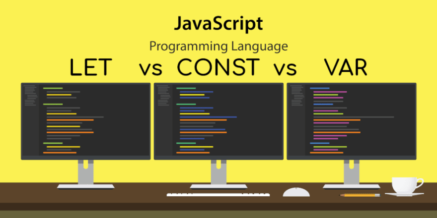
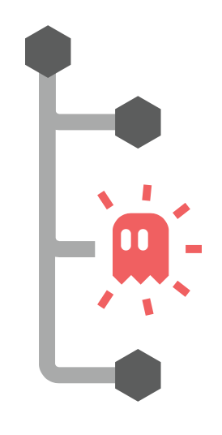
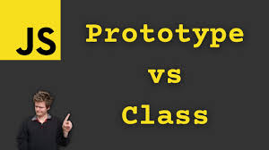
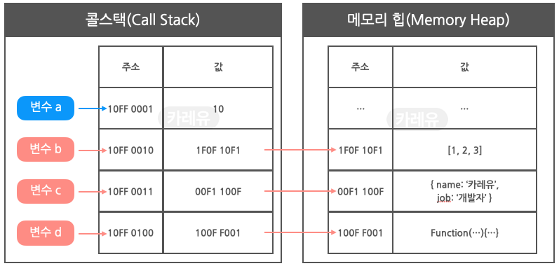

으아아아ㅏ 멘토링 두번째 회고 및 복습 시작!!!

<br>

## 복습.. 또 복습


복습은 복숭아다.. ~~(복숭아가 너무너무 먹고싶다.)~~ 이번 주도 어김없이 아는 것을 설명하지 못하고, 계속 반복된 이야기만 했다. 아직 잘 몰라서 그런 것 같다. 미숙하지만 **더더더더! 공부하자 We Can Do It**

<br>

### const, let, var의 호이스팅에서 차이점

우선 **호이스팅이란 실행 컨텍스트 생성 시 렉시컬 스코프 내의 선언이 끌어올려 지는 것을 의미**한다.

변수 생성 과정은 선언 단계(Declaration phase) => 초기화 단계(Initialization phase) => 할당 단계(Assignment phase) 이렇게 총 세 단계를 거쳐 생성되고, 변수를 선언 및 초기화 하기전에 사용하게 되는 영역을 **TDZ(Temporal Dead Zone)라고 한다.**



**var :** 선언한 변수는 호이스팅 시 undefined로 초기화되어, 변수 선언 이전에 해당 변수를 참조할 수 있다. 변수 선언과 동시에 undefined로 초기화된다.
초기화 이후에 값을 할당할 수 있고, 동일한 변수 이름으로 재선언이 가능하고, 변수에 새로운 값을 할당할 수 있다.

**let :** 선언한 변수는 호이스팅 시 초기화되지 않으며, 선언 전에 참조하면 참조 오류(ReferenceError)가 발생한다. 그리고 메모리 공간은 확보되지만 초기화는 선언 단계에서 이루어지지 않는다.
선언 이후에 값을 할당할 수 있고, 선언 시 값을 할당하지 않아도 오류가 발생하지 않는다. 또한 동일한 변수 이름으로 재선언할 수 없지만, 변수에 새로운 값을 할당할 수 있다.

**const :** 선언한 변수도 let과 마찬가지로 호이스팅 시 초기화되지 않으며, 선언 전에 참조하면 참조 오류가 발생한다. 또한 선언과 동시에 반드시 초기화(값 할당)가 이루어져야 한다.
선언 시 할당된 값을 변경할 수 없고, 동일한 변수 이름으로 재선언할 수 없으며, 값을 재할당할 수 없다.

<br>

### 그래서 TDZ란?

위에서 말한 대로 변수를 선언, 초기화하기 전 사이의 사각지대를 TDZ라고한다.

TDZ의 영향을 받는 것들은 const 변수, let 변수, class 구문 등이 있고, 영향을 받지 않는 구문은 var 변수, function, import 구문이 있다.

<br>

### node_modules의 호이스팅으로 발생하는 문제

질문을 받자마자 든 생각은 엥..? 이었다. 도대체 node_modules랑 호이스팅이랑 어떠한 문제가 있는 것일까? 내가 알기로 호이스팅은 변수와 함수에 일어나는 것이 아닌가.. 깊게 공부한 내용을 기록해보겠다.



우선 자바스크립트 내에서 호이스팅은 인터프리터가 코드를 실행하기 전에 함수, 변수, 클래스 또는 임포트(import)의 선언문을 해당 범위의 맨 위로 이동시키는 과정을 의미하는 것을 알아야 한다.

node_modules의 호이스팅으로 발생하는 가장 큰 문제는 **비효율적인 의존성 검색과 유령 의존성 발생이라고 생각한다.**

NPM은 패키지를 찾기 위해서 계속 상위 디렉토리의 node_modules 폴더를 탐색하게 되고, 바로 찾지 못하면 호출이 반복이 되어 탐색이 비효율적이게 된다. 또한 상위 디렉토리 환경에 영향을 받아 잘못된 의존성을 불러올 수 있다.

제일 큰 문제점은 **유령 의존성(Phantom Dependency)이다.** 호이스팅에 따라 직접 의존하고 있지 않은 라이브러리를 require(), import() 할 수 있는 현상을 의미하는데, 명시하지않은 라이브러리를 조용히 사라지게 해서, 의존성 관리를 혼란스럽게 하게된다.

구글링해보니 이러한 이유때문에 큰 프로젝트나, 모노레퍼에서는 의존성 문제를 효율적으로 해결하기 위해 pnpm 또는 Yarn Berry 사용을 권장하고 있다.

<br>

### Lexical Scope에 대해 이해해보자

렉시컬 스코프(정적 스코프)를 간단히 표현하면 함수를 어디서 호출하는지가 아니라 어디서 선언하였는지에 따라 상위 스코프를 결정하는 것이다.

```javascript
var item = '첫 번째';

function first() {
  var item = '십만 번째';
  second();
}

function second() {
  console.log(item);
}

first();
second();
```

위 코드를 실행하면 "첫 번째"가 두 번 출력된다. 왜냐하면 자바스크립트에서 **실행 단계에 코드들의 스코프를 결정하기 때문이다.**

그러므로, second() 함수가 first() 함수 안에서 호출된 것과 상관없이 second() 함수는 global 범위에 선언되어 있으므로, global 범위에 있는 변수 item의 값인 "첫 번째"가 두 번 출력된 것이다.

**자바스크립트 엔진은 코드가 로드될 때 실행 컨텍스트를 생성하고 그 안에 선언된 변수, 함수를 실행 컨텍스트 최상단으로 호이스팅하는데, 이러한 범위를 렉시컬 스코프라 한다.**

> 이와 반대로 함수 호출에 따라 상위 스코프가 정해지는 **Dynamic Scope**도 있다.

<br>

### Class와 프로토타입의 개념 차이



자바스크립트에서 클래스와 프로토타입은 객체 지향 프로그래밍을 구현하는 핵심적인 방법이다. 자바스크립트의 다양한 기능과 패턴을 보다 효과적으로 활용하기 위해서는 반드시 알아야 할 개념이라고 생각한다. 위 내용을 아래 키워드를 가지고 비교해보면서 공부해보자!

<br>

<h4>🤔 Q1) 자바스크립트는 프로토타입언어인데 프로토타입이 뭘까?</h4>

정확히는 **자바스크립트는 기존의 객체를 복사하여 새로운 객체를 생성하는 프로토타입 기반 객체지향 프로그래밍 언어**이다. Java, C++과 같은 클래스 기반 객체지향 프로그래밍이랑은 다르다.

Javascript에서 기본 데이터 타입을 제외한 모든 것이 객체다. 객체가 만들어지기 위해서는 자신을 만드는 데 사용된 원형인 프로토타입 객체를 이용하여 객체를 만든다. 이 때 객체 안에 **`__proto__`** 속성이 자신을 만들어낸 원형을 의미하는 프로토타입 객체를 참조하는 숨겨진 링크가 존재하는데 이것을 프로토타입이라고 정의한다.

<br>

<h4>🤔 Q2) Class와 프로토타입의 차이가 뭘까?</h4>

- 프로토타입 기반 상속은 Object.create()나 new 연산자를 사용하여 프로토타입 객체를 상속하거나 프로토타입 체인을 활용하지만, 클래스는 extends 키워드를 사용하여 다른 클래스를 상속한다.

- 생성자 함수와 프로토타입 매서드는 함수 호이스팅의 영향을 받을 수 있지만, 클래스와 클래스 메서드는 블록 스코프를 따르며 호이스팅이 발생하지 않는다.

- 클래스는 new 키워드를 사용하여 인스턴스를 생성한다. 프로토타입도 new 키워드를 사용하지만, 생성자 함수와 프로토타입 체인을 설정하는 과정이 추가로 필요하다.

<br>

<h4>🤔 Q3) 실행 컨텍스트 같은 문법은 자바스크립트에서 왜 필요했을까?</h4>

우선 실행 컨텍스트에 대해 알아보자. 실행 컨텍스트는 아래와 같이 3가지 종류가 있고 자동으로 생성되는 전역공간과 eval을 제외하면 함수를 실행하는 시점에 실행 컨텍스트가 실행 된다.

- **Global Execution Context (전역 실행 컨텍스트)의** 종류는 브라우저의 경우, window 객체 / Node.js경우, global 객체다.
- **Functional Execution Context (함수 실행 컨텍스트)는** 함수가 실행될 때마다 만들어지는 실행 컨텍스트로 각 함수는 고유의 실행 컨텍스트를 가지며, 함수가 실행되거나 호출될때 생성된다.

- **Eval Function Execution Context는** eval 함수로 실행되는 코드다.

자바스크립트 엔진은 웹 성능의 최적화와 복잡성을 효율적으로 관리하기 위해 실행 컨텍스트를 사용한다. 코드가 잘 실행되려면 스코프, 식별자, 코드 실행 순서등의 관리가 필요한데 이런 것들을 실행 컨텍스트가 관리해준다.

<br>

### What is Heap Memory?

힙 메모리는 프로그램에서 동적으로 할당된 메모리를 관리하는데 사용되는 영역이다. 프로그램이 실행될 때, 운영체제는 프로그램에 메모리 공간을 할당하며, 스택 과 힙으로 구성되어 있다. **스택은 지역 변수와 함수 호출 시 생성되는 변수들을 저장하는 영역이고, 힙은 동적으로 할당되는 메모리를 저장하는 영역이다.**

힙 메모리는 프로그램에서 필요한 만큼의 메모리를 동적으로 할당하여 사용한다. 힙 메모리는 스택과 달리, 메모리 블록을 계속 할당하거나 해제할 수 있어서 메모리 누수가 발생하기 쉽다.



참조형 데이터와 힙 메모리는 어떠한 연관성이 있을까? 위 그림을 살펴보자.

우선 10이라는 **값 자체는 원시 타입이므로 콜 스택에 저장**되고, 변수 a에는 10이 저장된 콜 스택 메모리의 주소값이 저장된다. 변수 식별자 a 자체는 콜스택 상의 실행 컨텍스트(Execution Context)의 렉시컬 환경(Lexical Environment)에 저장된다.

**참조 타입 데이터인 b(배열), c(객체), d(함수)는 참조 타입이므로 메모리 힙에 저장**된다. 참조타입 데이터가 저장된 메모리 힙의 주소값은 콜스택에 각각 저장되고, 메모리힙의 주소 값이 저장된 콜 스택의 주소값은 각각 변수 b, c, d에 저장된다. 마찬가지로, 변수 식별자 b, c, d 이름 자체는 콜스택 상의 '실행 컨텍스트(Execution Context)의 렉시컬 환경(Lexical Environment)에 저장된다.

<br>

<br>

### 객체와 배열의 연관성

자바스크립트에서 객체는 아래와 같은 특징들을 가지고 있다.

- 변수지만, 많은 값이 포함될 수 있고, 변수처럼 단일 값을 포함 할 수 있다.
- 중괄호 표기를 이용하여 만들 수 있다.
- 각각의 key/value에 대한 정보를 나열할 수 있어야 하고, key는 문자열 또는 기호여야 하며, value는 모든 유형이 될 수 있다.
- 한 쌍의 key/value 뒤에 쉼표를 이용하여 그 뒤에 오는 key/value와 구분해주어야 한다.
- 객체에서 명명된 값을 Properties라고 한다.
- 변수는 예약어의 이름을 가질 수 없지만 객체는 어떠한 이름이어도 상관없다.
- 객체 변수를 복사하면 참조가 복사되고 객체가 복제되지 않는다.

배열은 객체와 구조는 같지만, 키는 항상 숫자이며, 값은 요소다. 그러면 배열은 객체가 될 수 있을까?

질문의 대답은 **YES다.** 배열은 Array 클래스의 인스턴스로서, 배열의 프로토타입 체인에 Object가 있으며, Object의 모든 메서드와 속성을 상속받기 때문이다.

<br>

### 객체를 어떻게 분류하고 ECMA Script에서는 객체를 어떻게 구성하고 있을까?

1. **JavaScript 내장 객체 (Built-in Object)는** JavaScript 엔진이 구동되는 시점에서 바로 제공되며 JavaScript코드 어디에서든 사용이 가능하다. 아래의 내장 객체들 외에도 많은 내장 객체들이 있다.

   - Global
   - Object
   - String
   - Number
   - Boolean
   - Date
   - Array

2. **브라우저 내장 객체 (Native Object)도** JavaScript가 구동되는 시점에서 바로 사용이 가능한 객체들이며 내장 객체이다. 하지만 브라우저마다 브라우저 내장 객체를 사용함에 있어 구성을 달리하는 경우가 있기 때문에 JavaScript 내장 객체와 구분되고 있다.. 하지만 브라우저 내장 객체는 브라우저, 즉 JavaScript 엔진을 구동하는 것들에서 build되는 객체들이다. 이 객체들은 자바스크립트 내장객체가 구성된 후에 구성이 된다.

   - 브라우저 객체 모델 (BOM)
   - 문서 객체 모델 (DOM)

3. **사용자 정의 객체 (Host Object)는** 말 그대로 사용자가 생성한 객체들로 생성자 함수 또는 객체 리터럴을 통해 사용자가 객체를 정의하고 확장시킨 객체들이기 때문에 내장 객체들이 구성된 이후에 구성되어 진다.

<br>

## 5월 둘째 주 회고


회고를 하기 전에 이런저런 많은 생각을 하였다. 나 스스로에 대해서 잘 알고 있다. 마음 잡히면 잘하지만, 잡히는 과정이 오래 걸린다는 것을.. 또한 하고 싶은 게 너~~무 많아서 걱정에 앞서 모든 일을 저지르고 생각한다. 이러한 나의 문제점을 잘 해결해서 더 좋은 방향으로 갈 수 있도록 여유 있는 일정을 잡아야겠다.

### 이번 주 좋은 것과 나쁜 것

- 날씨가 좋은 것 빼고는 별 차이가 없는 1주일이었습니다.
- 5/6에 쉬는날이여서 멘토링을 빨리 진행해 7일까지 멘토링에 대한 복습을 진행할 수 있었습니다.

### 이번주 진행했던 학습/개발 내용은??

- 동아리에서 5~6주 활동의 결과 발표를 진행했습니다. (https://hooninedev.com/240509/)
- 멘토링 끝난 2일동안 멘토링 과정 복습을 진행했습니다.
- 멘토링 과제들을 진행했습니다.
- 우당탕탕 책방 스터디에서 CSS 라이브러리에 대한 이야기를 1시간동안 진행하기 위해 제가 자주 사용위해서
  제가 자주 사용하는 라이브러리 styled.component, tailwindcss 에 대해 공부했고, 사람들의 인사이트를 공유했습니다
- 깊은 복사와 얕은 복사의 개념과 자료형,참조형 데이터에 대한 내용이 헷갈려서 코드를 작성하며 복습을 했습니다.

### 가장 고민했던 부분은 무엇이었나요?

- 사내에서 공통적으로 사용할 수 있도록 zod를 작성하는 것에 대해 고민 했습니다.
- 테스트 코드를 작성해보려 하는데, api 와 UI 테스트 코드를 작성하고 있습니다. 특히 목데이터를 어떻게 다루는지와 외부라이브러리는 어떻게 테스트 할 것인지 고민중입니다.

### 아쉬운 부분을 개선하는 데 필요한 것은 무엇인가요?

- 심리적으로 여유가 부족한 것 같습니다.
- 제가 생각한 일정에서 어긋난다고 생각하면 스트레스가 됩니다.
- 이번주부터 러닝을 진행하려 합니다.

### 다음 주는 어떻게 보낼 예정인가요?

- 멘토링에 대한 복습을 할 예정입니다
- Promise에 대해 복습하려합니다.
- 이력서 수정하려합니다.

<br>

## 출처 및 도움되는 링크들

- [힙 메모리](https://charming-kyu.tistory.com/19)
- [자바스크립트는 왜 프토토타입을 선택했을까? - 미디움(임성묵님)](https://medium.com/@limsungmook/%EC%9E%90%EB%B0%94%EC%8A%A4%ED%81%AC%EB%A6%BD%ED%8A%B8%EB%8A%94-%EC%99%9C-%ED%94%84%EB%A1%9C%ED%86%A0%ED%83%80%EC%9E%85%EC%9D%84-%EC%84%A0%ED%83%9D%ED%96%88%EC%9D%84%EA%B9%8C-997f985adb42)
- [자바스크립트 클래스와 프로토타입의 이해 - Flab](https://f-lab.kr/insight/understanding-javascript-class-and-prototype)
- [evan님의 프로토타입 정리](https://evan-moon.github.io/2019/10/23/js-prototype/)
- [Steady-Dev의 실행 컨텍스트](https://www.datoybi.com/execution-context/)
- [thumb-hyeok님이 프로토타입 장점](https://velog.io/@thumb_hyeok/%ED%94%84%EB%A1%9C%ED%86%A0%ED%83%80%EC%9E%85%EC%9D%98-%EC%9E%A5%EC%A0%90%EC%9D%80-%EB%AC%B4%EC%97%87%EC%9D%BC%EA%B9%8C)

```toc

```
