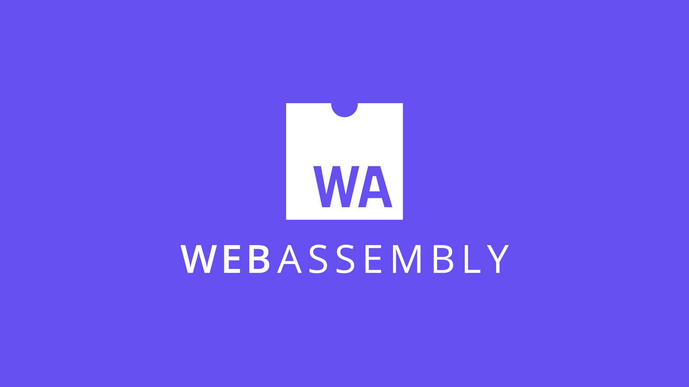
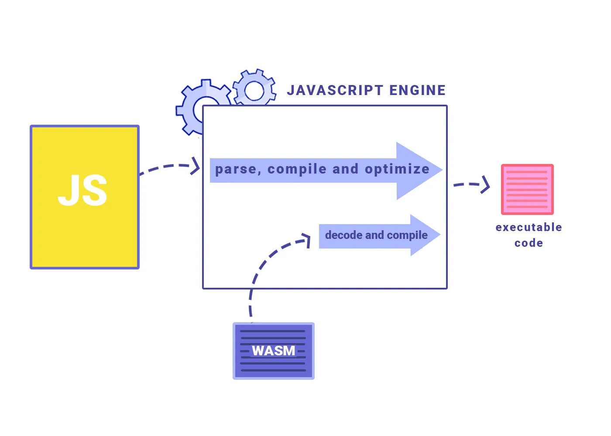
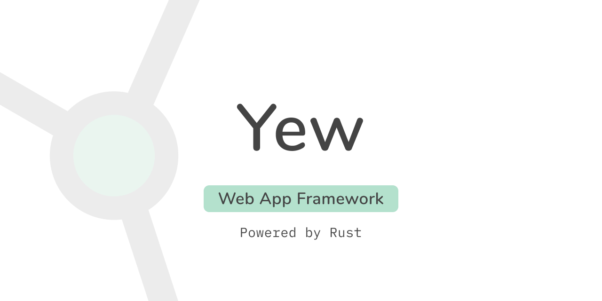
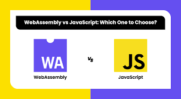

> 📢 본 글은 **[Will WebAssembly Replace JavaScript?](https://five.co/blog/will-webassembly-replace-javascript/)** 기반으로 작성되었습니다.

<br>

## WebAssembly?



<br>

> “Because apps compiled to WebAssembly can run as fast as native apps, it has the potential to change the way software is written on the web.”
>
> WebAssembly로 컴파일된 앱은 네이티브 앱만큼 빠르게 실행될 수 있기 때문에 웹에서 소프트웨어가 작성되는 방식을 바꿀 수 있는 잠재력을 가지고 있습니다.
>
> Evan Wallace – CTO and Co-Founder, Figma

 <br>

WebAssembly 또는 줄여서 WASM은 최근 몇 년간 많은 관심을 받고 있는 새로운 기술으로, 스택 기반 가상 머신(VM)을 위한 로우레벨 바이너리 명령어 형식이다. 월드와이드웹 컨소시엄(W3C)의 창설로 등장해서, 2015년에 처음 발표되었고 2년 후인 2017년에 첫 데모가 시연되었다.

WebAssembly를 이용해 C, C++, Rust와 같은 고급 언어를 미리 컴파일(AOT)하기 위한 휴대용 타깃으로 설계되어 클라이언트 측 및 서버 측 애플리케이션을 웹에 배포할 수 있다.

WebAssembly, 즉 WASM은 웹 개발 업계에서 새롭게 떠오르는 신예로 큰 주목을 받고 있다. C, C++, Rust와 같은 언어에 대한 컴파일 대상을 제공하는 WASM 모듈을 통해 웹 플랫폼은 그 기능에 혁신적인 변화를 경험하고있다. **WebAssembly의 텍스트 형식은 언어 간 커뮤니케이션을 더욱 쉽게 만들어주며,** 주요 브라우저는 이미 이 기술을 지원하고있다.

<br>



> <h3>WebAssembly는 새로운 프로그래밍 언어일까?</h3>
>
> NO!!! 🙅🏻 **네이티브 코드를 웹에서 실행하게 해주는 도구**로 보는 것이 더 적합하다.
>
> WebAssembly는 개발자가 직접 작성하는 대신 웹 브라우저 내에서 이러한 언어를 **컴파일하고 실행할 수 있게 해줘, 자바스크립트의 성능 한계 해결에 도움을 준다.** WebAssembly는 C++와 같이 전통적으로 대규모 미션 크리티컬 엔터프라이즈 시스템을 구축하는 데 사용되는 언어를 활용함으로써 **브라우저 환경 내에서 접근성을 용이하게한다.**
>
> WebAssembly 커뮤니티 그룹은 WASM을 개방형 표준과 웹 개발의 필수적인 부분으로 만들기 위해 열심히 노력하고 있고, 그 결과 WebAssembly는 개발자가 네이티브 앱에 필적하는 원활하고 고성능의 웹 애플리케이션을 만들 수 있는 강력한 도구가 되고 있다.

 <br>

WebAssembly는 이제 모든 웹 브라우저(거의 모든 브라우저)와 함께 제공되는 멋진 새 가상 머신이다. 성능에 중요한 비즈니스 로직 **코드를 엄청나게 빠른 속도로 실행할 수 있는** 멋진 가상 머신이다. 물론 신뢰할 수 있는 클라이언트 측 렌더링 프레임워크를 사용하여 JavaScript 프론트엔드에 많은 로직을 넣을 수도 있고, Node.js 백엔드에 로직을 넣고 API를 사용하여 프론트엔드에서 통신할 수도 있다.

<br>

### WebAssembly를 어디에서 사용하고 있을까?

앞서 사용된 Figma CTO의 인용구 내용처럼 Figma가 WebAssembly 코드로 컴파일할 수 있는 언어 중 하나인 C++로 작성되었다고 설명하고있다. 이 접근 방식을 채택함으로써 **Figma는 로드 시간을 3배까지 단축하여 네이티브에 가까운 성능을 달성**할 수 있었다.

2019년까지만 해도 Google Auth는 Chrome 전용 솔루션인 네이티브 클라이언트(NaCl)를 사용하고 있었기 때문에 다른 브라우저에서는 액세스할 수 없었다. 하지만 Google Auth 엔지니어링 팀은 WebAssembly를 채택해, 모든 브라우저에서 광범위하게 지원되는 WebAssembly를 활용함으로써 사용자가 **어떤 브라우저를 선택하든 Google Auth에 액세스**할 수 있게 되었다.

Figma와 Google Auth는 모두 WebAssembly가 복잡한 엔지니어링 및 비즈니스 과제에 적합한 솔루션으로 어떻게 작용하는지 대표하는 예시다. 성능 저하나 전면적인 재작성 없이 대규모 애플리케이션을 웹으로 마이그레이션할 수 있다. 이러한 성공 사례는 다양한 사용 사례를 처리하는 데 있어 WebAssembly의 혁신적 잠재력을 보여주고있다.

<br>

### JavaScript로 로직을 작성할 수 있을까?

Yes!! WebAssembly가 등장하기 전에도 그렇게 해왔지만 **성능에 중요한** 비즈니스 로직이라고 말씀드렸던 것을 기억하나요?

WebAssembly는 버튼에 애니메이션을 적용하거나 양식을 제출하기 위한 또 다른 스크립팅 환경이 아니라 네이티브에 가까운 속도로 무거운 워크로드를 실행하기 위한 대안으로 거론되고 있다. 앱 개발자들이 **웹 브라우저는 네이티브 애플리케이션만큼 빠르게 프로그레시브 웹 앱(PWA)을 실행할 수 없다고** 말하던 시절을 이제 옛날 말이 되었다.

성능이 중요한 애플리케이션의 비즈니스 로직을 작성할 때 동적으로 타입이 지정된 해석된 프로그래밍 언어(JavaScript)를 사용하면 적절한 성능을 달성하거나 브라우저에서 실행하기조차 어렵다는 것이 문제다.

WebAssembly를 사용하면 네이티브에 가까운 속도로 **복잡한 계산을 수행할 수 있다.** JavaScript는 동적으로 입력되고 해석되는 언어이기 때문에 복잡한 연산을 수행할 때 속도가 느려질 수 있다. 정적으로 타입이 지정되고 컴파일되는 언어인 WebAssembly는 복잡한 연산을 JavaScript보다 훨씬 빠르게 실행할 수 있기 때문에, 비디오 렌더링, 3D 그래픽 및 기타 계산 집
약적인 작업과 같은 작업에 WebAssembly가 적합할 수 있다.

<br>

### WebAssembly의 보안성

WebAssembly를 사용하면 보안과 샌드박스를 강화할 수 있다. JavaScript는 고급 언어이며 브라우저의 JavaScript 엔진에 의해 실행되므로 공격에 취약할 수 있지만, WebAssembly는 브라우저의 WebAssembly 엔진에 의해 실행되므로 더 안전하며 샌드박스를 통해 악성 코드가 실행되지 않도록 차단할 수 있기때문에, WebAssembly는 높은 수준의 보안이 필요한 온라인 뱅킹, 결제 처리, 온라인 게임, 보안 문서 서명과 같은 웹 기반 작업에 적합한 옵션이 된다.

<br>

### WebAssembly와 다양한 언어의 상호 작용

필자가 생각하는 WebAssembly의 가장 큰 장점은 **다른 프로그래밍 언어와 상호 작용할 수 있다는** 점이다. WebAssembly 모듈은 C, C++, Rust 등 WebAssembly 바이트코드로 컴파일할 수 있는 모든 언어로 작성할 수 있다. 따라서 개발자는 특정 작업에 선호하는 언어를 사용한 다음 WebAssembly를 사용하여 웹 애플리케이션에 원활하게 통합할 수 있다. 특정 언어에 이미 익숙하고 이를 웹 개발에 사용하려는 개발자에게 특히 유용할 수 있다.

<br>

<br>

<br>


<br>

## WebAssembly가 JavaScript을 대체할까?

<br>

Rust, Go, C++와 같은 프로그래밍 언어로 작성된 웹 프레임워크가 점점 더 많이 개발됨에 따라 개발자가 JavaScript 이외의 언어로 프론트엔드를 작성하는 것이 점점 더 쉬워지고 있기 때문에 WebAssembly 등장이 부담스러운 상황이 될 수 있다.

<br>

|                 |                   |
| --------------- | ----------------- |
|  |  |

<br>

WebAssembly를 활용하는 프레임워크의 한 예로 웹 앱 제작을 위한 최신 **Rust 프레임워크인 Yew가 있다.** Yew를 사용하면 개발자가 안전하고 성능이 우수한 코드를 작성하여 WASM으로 컴파일하고 브라우저에서 바로 실행할 수 있다. 즉, Rust 개발자는 이제 JavaScript를 배우지 않고도 웹 앱을 구축할 수 있다.

<br>

또 다른 예로는 개발자가 Go로 프런트엔드 코드를 작성한 다음 JavaScript로 컴파일할 수 있는 트랜스파일러인 **GopherJS가 있다.** 즉, Go 개발자도 JavaScript를 배우지 않고도 웹 앱을 구축할 수 있다.

마찬가지로 **C++ 개발자는 이제 C++ WebAssembly 프레임워크(CWasm)를** 사용하여 웹 앱을 빌드할 수 있다. CWasm은 WebAssembly 가상 머신에 C++ 인터페이스를 제공하는 C++ 라이브러리로, C++ 개발자가 브라우저에서 실행되는 웹 앱을 쉽게 작성할 수 있도록 해준다.

이러한 프레임워크와 솔루션의 등장은 WebAssembly가 프론트엔드 웹 개발에서 JavaScript를 대체할 수 있는 대안이 되고 있음을 의미한다. 이는 앞으로 JavaScript 개발자의 기술 수요가 줄어들 수 있다는 것을 의미하기 때문에 JavaScript 개발자에게는 두려운 전망이다.

그러나 JavaScript는 여전히 웹에서 가장 널리 사용되는 프로그래밍 언어이며, WebAssembly로 완전히 대체되지는 않을 것이라는 점에 유의해야 한다. 대신 **WebAssembly는 JavaScript의 기능을 보완하고 향상시키는 데 사용될 가능성이 높다.**

<br>

### Rust + WebAssembly 코드 만들기

아래의 작업은 **[해당 Repo에서 Clone 받으셔도 됩니다.](https://github.com/jiji-hoon96/wasm_example)**

<br>

1. 먼저 Rust를 설치해주자.

   ```bash
   curl https://sh.rustup.rs -sSf | sh
   ```

<br>

2. Wasm-pack을 설치해주자. (wasm-pack은 Rust를 WASM으로 컴파일하는 데 사용할 Rust 라이브러리)

   ```bash
    > Rust 가 있으면 Cargo도 설치된다.

   cargo install wasm-pack
   ```

<br>

3. Rust를 이용해서 새 프로젝트를 만든다.

   ```bash
   cargo new --lib wasm_example
   ```

<br>

4. Cargo에서 생성한 `Cargo.toml` 파일에 wasm-bindgen 라이브러리를 추가해주기 위해 아래 명령줄을 추가해준다.(wasm-bindgen 라이브러리를 설치해야 Rust와 JavaScript가 상호 작용할 수 있다.)

   ```toml
   wasm-bindgen = "0.2"
   ```

<br>

5. 그 이후에 아래와 같이 `Cargo.toml` 코드가 작성되어 있는지 확인하고 수정해준다.

   ```toml
   [package]

   name = "wasm_example"
   version = "0.1.0"
   edition = "2021"

   [lib]

   crate-type = ["cdylib", "rlib"]

   [dependencies]

   wasm-bindgen = "0.2"
   ```

<br>

6. src 디렉토리에서 `lib.rs` 파일을 열고 Rust 코드를 작성해준다.(이미 작성되어 있다면 패스!)

   ```rust
   use wasm_bindgen::prelude::wasm_bindgen;

   #[wasm_bindgen]

   pub fn add(left: usize, right: usize) -> usize {
       left + right
   }
   ```

<br>

7. `wasm-pack` 도구를 이용해서 빌드를 진행해준다. 이 과정이 진행되면 pkg 디렉토리가 생기고, 내부에는 JavaScript파일과 WebAssembly 파일이있다.

   ```bash
   wasm-pack build
   ```

<br>

8. WASM 코드와 상호 작용할 JavaScript 파일을 작성해주기 위해서 `glue.js` 파일을 만들어주고 아래 코드를 넣는다.

   ```javascript
   const importObject = {};

   const path_to_wasm = './pkg/wasm_example_bg.wasm';

   fetch(path_to_wasm)
     .then((response) => response.arrayBuffer())

     .then((bytes) => WebAssembly.instantiate(bytes, importObject))

     .then((results) => {
       const wasm = results.instance.exports;

       console.log(wasm.add(20, 4));
     });
   ```

<br>

9. Browser에서 확인해보기 위해 `index.html` 파일을 만들어주고 아래 코드를 입력한다.

   ```html
   <!DOCTYPE html>

   <html>
     <head>
       <title>WASM example</title>

       <script src="./glue.js"></script>
     </head>

     <body></body>
   </html>
   ```

<br>

10. CORS 오류를 방지하기 위해 `http-server` 라는 간단한 도구를 설치하고 사용한다.

    ```bash
    npm install http-server -g
    ```

<br>

고생하셨습니다!! 설정은 완료되었습니다~!!


<br>

### 결과는 어떻게 될까?

JavaScript만 존재하기 때문에, `console.log()`를 확인해야 한다.

모든 것이 정상적으로 작동했다면 콘솔에 숫자가 표시되어야 하는데, 이 숫자는 `glue.js`에서 함수에 전달한 두 숫자의 합계인 `console.log(wasm.add(20, 4));`가 된다. 이 숫자를 변경하여 다른 합계를 얻을 수 있다.

숫자를 변경해도 콘솔에 여전히 같은 숫자가 출력된다면 브라우저가 JavaScript를 캐싱하고 있기 때문이다. 콘솔이 열려 있는 상태에서 Shift 키를 누른 채 새로고침 버튼을 누르면 페이지를 강제 새로고침할 수 있다.

<br>

## 그래서 결론은?

WebAssembly는 JavaScript의 기능을 보완하고 향상시킬 수 있는 잠재력을 지닌 강력한 신기술이라고 생각한다.



JavaScript가 WebAssembly로 완전히 대체되지는 않겠지만, 네이티브에 가까운 속도로 복잡한 연산을 수행하고 다른 프로그래밍 언어와 상호 작용하며 향상된 보안 및 샌드박싱을 제공하는 데 사용할 수 있을 것 같다. 웹 개발이 계속 발전함에 따라 웹 애플리케이션 개발에서 WebAssembly의 역할이 점점 더 중요해질 것이다.

기술을 확장하고 앞서 나가고자 하는 개발자는 WebAssembly를 배우고 그 기능을 실험해 보는 것을 고려해봐야 할 것 같다.

<br>

## 출처 및 도움되는 링크들

- [Will WebAssembly Replace JavaScript?](https://five.co/blog/will-webassembly-replace-javascript/)
- [WebAssembly & Low-Code](https://five.co/blog/webassembly-low-code/)
- [WebAssembly](https://webassembly.org/)

```toc

```
