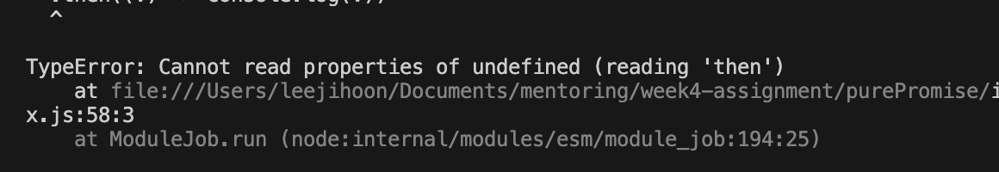
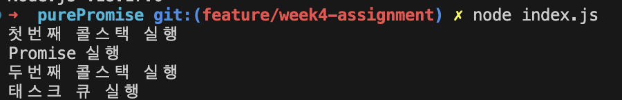
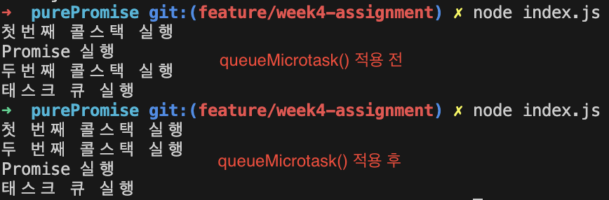

## Promise를 직접 만들어보자.

앞서 나는 Promise()에 대한 글을 2번 정도 게시했다.

- [자바스크립트 Promise를 퀴즈로 쉽게 익히기](https://hooninedev.com/240514/)
- [JavaScript 동기와 비동기 완벽 가이드](https://hooninedev.com/230816/)

위 글을 쓰고 나서 몇 달이 지난 현재, Promise의 내부는 어떻게 동작하고, 어떻게 구성이 되어있는지 궁금했다. 아티클을 읽던 와중에 **[푸만능님의 JavaScript Promise 객체 직접 구현해보기](https://velog.io/@turtle601/JS-%EC%9E%90%EB%B0%94%EC%8A%A4%ED%81%AC%EB%A6%BD%ED%8A%B8-Promise-%EA%B0%9D%EC%B2%B4-%EC%A7%81%EC%A0%91-%EA%B5%AC%ED%98%84%ED%95%B4%EB%B3%B4%EA%B8%B0#1-simplest-promise)를** 알게 되어서, 위 내용을 실습해보며 내가 새롭게 알게 된 내용들에 대해 공부해보려한다.

<br>

### Promise를 어떻게 만들어볼까?

Promise를 만들기 전에, Promise에 대해 이해해보기 위해, 기능 구현 목록을 작성해보자

우선 Promise는 실행 상태를 나타내기 때문에, **Pending(실행 전), fulfilled(실행 후 성공 => resolve), rejected(실행 후 실패 => rejected)이** 필요하다.

그리고 Promise는 JS 이벤트 루프에서 **Microtask Queue에서 비동기적으로 동작**한다. 또한 then, catch, finally이라는 후속처리 **메서드 체이닝**이 필요하다.

<br>

> 🤔 **메서드 체이닝(Method Chaining)이란?**
>
> 연속적인 코드 줄에서 개체의 Method를 반복적으로 호출하는 것을 의미한다. Method가 객체를 반환하면 그 반환 값(객체)
>
> 아래 함수를 Method Chaining을 이용하면 `store.enter(2).leave(1).enter(2)` 로 구현할 수 있다.
>
> ```javascript
> const store = {
>   name: 'see you',
>   opacity: 30,
>   peopleCount: 0,
>   enter(n) {
>     this.peopleCount += n;
>   },
>   leave(n) {
>     this.peopleCount -= n;
>   },
> };
> ```

<br>

물론 Promise를 위한 정적 메서드인 race(), all()등 다양한 함수등이 있지만 그런 것들은 추후에 공부해보자.

<br>

## 만들어보자.


본격적으로 Promise를 만들어보자. Promise를 구현해보면서 "이게 왜 이렇게 동작하지?", "이 개념은 뭐지?" 등 필요한 내용에 대해 차근차근 기록을 남기며 Promise를 만들어보겠다!

모든 것은 Github의 새로운 Repository와 함께한다. 레포를 통해 확인해봐도 좋다. 이름은 **[Mentoring 4주차 - PurePromise](https://github.com/jiji-hoon96/mentoring)**

<br>

### 간단하게 Promise를 만들어보자

```javascript
class MyPromise {
  #value = null;

  constructor(executor) {
    executor((value) => {
      this.#value = value;
    });
  }

  then(callback) {
    callback(this.#value);

    return this;
  }
}

function testMyPromise() {
  return new MyPromise((resolve) => {
    resolve('my resolve');
  });
}

testMyPromise().then((value) => console.log(value));
// my resolve
```

위 코드에서 신경써서 봐야 할 것은 3가지다.

- #value = null 을 통해 **#value라는 프라이빗 변수를 null로 초기값을 설정**했다.
- 생성자 함수는 **executor라는 함수를 매개변수**로 받는다.
- **then 메서드는 콜백 함수를 매개변수**로 받는다.

하지만 아직 부족한 점이 많다. 현재 만들어진 MyPromise 함수는 비동기 처리가 안되어있다. 또한 에러처리를 위한 catch문이 없고, 상태를 다루는 코드도 작성되어 있지 않다.

다음 섹션에서 에러처리에 대한 코드를 추가해보자.

<br>

### then, catch, resolve, reject 함수를 추가해보자

```javascript
class MyPromise {
  #value = null;

  constructor(executor) {
    this.#value = null;

    try {
      executor(this.#resolve.bind(this), this.#reject.bind(this));
    } catch (error) {
      this.#reject(error);
    }
  }

  #resolve(value) {
    this.#value = value;
  }

  #reject(error) {
    this.#value = error;
  }

  then(callback) {
    callback(this.#value);

    return this;
  }

  catch(callback) {
    callback(this.#value);

    return this;
  }
}

function testMyPromise() {
  return new MyPromise((resolve) => {
    resolve('my resolve');
  });
}

testMyPromise().then((value) => console.log(value)); // my resolve
```

resolve, reject, then, catch를 구현해서 메서드 체이닝이 일어날 수 있도록 했다.

위 코드에서 궁금한 점은 executor 내부에 bind 메서드를 사용했다는 점이다. 현재 bind 메서드를 사용했기 때문에 this는 항상 MyPromise 인스턴스를 가리킨다. 사용하지 않으면 resolve, reject 메서드를 호출할 때 this가 바뀔 수 있고, 특히 콜백함수에서 차이가 크게 날 수 있기 때문에 **bind 메서드로 강제로 특정 객체를 지정**하도록 해야 한다.

```javascript
function testMyPromise(input) {
  return new MyPromise((resolve, reject) => {
    if (input === 1) {
      resolve('정상적입니다');
    }
    reject('입력값이 1이 아닙니다');
  });
}

testMyPromise(1)
  .then((value) => console.log(value))
  .catch((error) => console.log(error));

// 입력값이 1이 아닙니다
// 입력값이 1이 아닙니다
```

위 코드를 추가해서 실행해보면 then구문과 catch구문 모두 실행된다. 그리고 비동기, 상태 관리 메서드 생성, Error Handling이 부족하다. 다음 세션에서 상태를 추가해 코드를 더 보완해보자.

<br>

### Promise 상태를 추가해 동작 구현해보자.

```javascript
const PROMISES_STATE = Object.freeze({
  pending: 'PENDING',
  fulfilled: 'fulfilled',
  rejected: 'rejected',
});

class MyPromise {
  #value = null;
  #state = PROMISES_STATE.PENDING;

  constructor(executor) {
    try {
      executor(this.#resolve.bind(this), this.#reject.bind(this));
    } catch (error) {
      this.#reject(error);
    }
  }

  #resolve(value) {
    this.#state = PROMISES_STATE.fulfilled;
    this.#value = value;
  }

  #reject(error) {
    this.#state = PROMISES_STATE.rejected;
    this.#value = error;
  }

  then(callback) {
    if (this.#state === PROMISES_STATE.fulfilled) {
      callback(this.#value);
    }

    return this;
  }

  catch(callback) {
    if (this.#state === PROMISES_STATE.rejected) {
      callback(this.#value);
    }

    return this;
  }
}

function myPromiseFn2(input) {
  return new MyPromise((resolve, reject) => {
    if (input === 1) {
      resolve('성공');
    } else {
      reject('실패');
    }
  });
}

myPromiseFn2(1)
  .then((v) => {
    console.log(v);
    return '체이닝 확인';
  })
  .then((v) => console.log(v))
  .catch((v) => console.log(v));
```

위 코드에서 **Object.freeze를 이용해 객체를 동결**했다. 이로서 객체 속성 추가,삭제,변경이 불가능해져서, 객체가 항상 일정한 상태 값을 갖도록 보장한다.

코드를 실행해보면 resolve를 통해 then으로 이동하게 되어 '성공'이 출력되고, '체이닝 확인'이 출력될 것 같지만, '성공'이 두번 출력이 된다. 이것은 then 함수에 리턴값이 변경되지 않았기때문이다.

```javascript
  then(callback) {
    if (this.#state === PROMISES_STATE.fulfilled) {
      return new MyPromise((resolve) => resolve(callback(this.#value)));
    }
  }

```

then, catch 메소드를 위처럼 변경해 My Promise 객체 인스턴스를 then 메서드의 리턴값으로 설정해 프로미스 체이닝이 가능하도록 구현했다.

<br>

### 비동기 구현(then 함수만)

```javascript
function myPromiseFn2(input) {
  return new MyPromise((resolve, reject) => {
    setTimeout(() => {
      resolve(`이것은 ${input}초뒤에 실행됩니다.`);
    }, 3000);
  });
}
```

myPromise 내부에 setTimeout을 이용해서 코드를 실행해보면 아래와 같이 오류가 발생한다. myPromiseFn2()를 실행시키면 3초 뒤에 resolve함수가 실행됨으로 then에 대한 리턴값이 undefined가 되기 때문이다.



그래서 비동기를 구현하려면 어떻게 해야될까?

우리는 Promise를 사용할 때 pending 상태를 두어 대기(비동기)를 하고, fulfilled 상태로 변경이 되면 동기가 된다. 위 내용을 코드에 적용해보자

```javascript
class MyPromise {
  #state = PROMISES_STATE.pending;

  #value = null;

  #lastCallBacks = [];

  constructor(executor) {
    try {
      executor(this.#resolve.bind(this), this.#reject.bind(this));
    } catch (error) {
      this.#reject(error);
    }
  }

  #resolve(value) {
    this.#state = PROMISES_STATE.fulfilled;
    this.#value = value;
    this.#lastCallBacks.forEach((lastcall) => lastcall());
  }

  #reject(error) {
    this.#state = PROMISES_STATE.rejected;
    this.#value = error;
    this.#lastCallBacks.forEach((lastcall) => lastcall());
  }

  #asyncResolve(callback) {
    if (this.#state === PROMISES_STATE.pending) {
      return new MyPromise((resolve) => this.#lastCallBacks.push(() => resolve(callback(this.#value))));
    }

    return null;
  }

  #syncResolve(callback) {
    if (this.#state === PROMISES_STATE.fulfilled) {
      return new MyPromise((resolve) => resolve(callback(this.#value)));
    }

    return null;
  }

  then(callback) {
    return this.#asyncResolve(callback) || this.#syncResolve(callback);
  }

  catch(callback) {
    if (this.state === PROMISES_STATE.rejected) {
      callback(this.#value);
    }

    return this;
  }
}
```

asyncResolve 메서드는 상태가 pending일 때 호출되어, 새로운 MyPromise 인스턴스를 반환하고, 콜백을 lastCallBacks 배열에 저장한다. 또한 syncResolve 메서드는 상태가 fulfilled일 때 호출되어, 새로운 MyPromise 인스턴스를 반환하고, 즉시 콜백을 실행한다.

이후에 then 메서드를 통해 asyncResolve를 호출하여 비동기 처리를 시도하고, 실패하면 syncResolve를 호출하여 동기 처리를 시도한다. (위 코드는 클로저와 스코프의 개념을 적용해서 공부해보면 좋다.)

위 코드를 실행해보면 3초 뒤에 실행이 되고, 체이닝 메서드로 이어지는 것을 확인할 수 있다.

<br>

### MicroTask Queue를 적용해보자

MicroTask Queue를 만들기 위해서는 MacroTask Queue와 차이점, 그리고 콜스택 실행 순서에 대해 알고 있어야한다.

**[해당 내용](https://hooninedev.com/230816/#%EC%9E%90%EB%B0%94%EC%8A%A4%ED%81%AC%EB%A6%BD%ED%8A%B8-%EC%97%94%EC%A7%84v8)을** 숙지하고 아래 코드를 작성해보길 바란다.

```javascript
function myPromiseFn2() {
  return new MyPromise((resolve, reject) => {
    resolve('Promise 실행');
  });
}

const test = () => {
  console.log('첫번째 콜스택 실행');
  setTimeout(() => console.log('태스크 큐 실행'), 0);

  myPromiseFn2().then((result) => console.log(result));

  console.log('두번째 콜스택 실행');
};

test();
```

예상되는 정답은 첫 번째 콜스택 실행 => 두 번째 실행 => Promise 실행 => Task Queue 실행 이지만 실제 결과는 예상과 다르게 아래처럼 실행된다



위 문제를 해결하기 위해서 **[MDN-MicroTask Queue](https://developer.mozilla.org/en-US/docs/Web/API/queueMicrotask)을** 이용해 코드를 수정해보면 예상하는 것 처럼 코드가 잘 동작 된다.



<br>

### catch 함수를 구현해보자

```javascript
class MyPromise {
  #state = PROMISES_STATE.pending;

  #value = null;

  #catchCallbacks = [];

  #thenCallbacks = [];

  constructor(executor) {
    try {
      executor(this.#resolve.bind(this), this.#reject.bind(this));
    } catch (error) {
      this.#reject(error);
    }
  }

  #runCallbacks() {
    if (this.#state === PROMISES_STATE.fulfilled) {
      this.#thenCallbacks.forEach((callback) => callback(this.#value));
      this.#thenCallbacks = [];
    }

    if (this.#state === PROMISES_STATE.rejected) {
      this.#catchCallbacks.forEach((callback) => callback(this.#value));
      this.#catchCallbacks = [];
    }
  }

  #update(state, value) {
    queueMicrotask(() => {
      this.#state = state;
      this.#value = value;
      this.#runCallbacks();
    });
  }

  #resolve(value) {
    this.#update(PROMISES_STATE.fulfilled, value);
  }

  #reject(error) {
    this.#update(PROMISES_STATE.rejected, error);
  }

  then(thenCallback, catchCallback) {
    return new MyPromise((resolve, reject) => {
      this.#thenCallbacks.push((value) => {
        if (!thenCallback) {
          resolve(value);
          return;
        }

        try {
          resolve(thenCallback(value));
        } catch (error) {
          reject(error);
        }
      });

      this.#catchCallbacks.push((value) => {
        if (!catchCallback) {
          reject(value);
          return;
        }

        try {
          resolve(catchCallback(value));
        } catch (error) {
          reject(error);
        }
      });
    });
  }

  catch(catchCallback) {
    return this.then(undefined, catchCallback);
  }
}
```

then 메서드는 thenCallback과 catchCallback을 받아 새로운 MyPromise를 반환한다.

thenCallbacks 배열에 thenCallback을 래핑한 콜백을 추가하는데, 이 콜백은 thenCallback이 없으면 resolve를 호출하고, 예외가 발생하면 reject를 호출한다.

catchCallbacks 배열에 catchCallback을 래핑한 콜백을 추가하는데, 이 콜백은 catchCallback이 없으면 reject를 호출하고, 예외가 발생하면 reject를 호출한다.

catch 메서드는 동작 이후에 메서드 체이닝이 가능하도록 구현했다.

```javascript
function myPromiseFn2(input) {
  return new MyPromise((resolve, reject) => {
    if (input === 1) {
      resolve('성공');
    } else {
      reject('실패');
    }
  });
}

myPromiseFn2(2)
  .then((v) => {
    console.log(v);
    return v;
  })
  .catch((v) => {
    console.log(v);
    return '오류 발생!!!';
  })
  .then((v) => console.log(v));
```

위 예시코드를 실행해보면 **실패 => 오류 발생!!!** 이 출력된다.

<br>

### finally 만들어보기

Settled는 Promise가 이행되거나 거부된 상태를 포괄적으로 표현하는 단어로, Promise가 더 이상 pending 상태가 아닌 상태를 말한다.

finally 메서드를 구현하기 위해 fulfilled, rejected 상태일 때 동작하도록 아래 코드를 추가해보자.

```javascript
finally(callback) {
    return this.then(
      (value) => {
        callback();
        return value;
      },
      (value) => {
        callback();
        throw value;
      }
    );
  }
```

<br>

### 추가적인 예외처리 기능 구현

then(callback)의 callback 함수 내부에서 새로운 Promise를 만들어 return 하는 코드를 아래처럼 만들어 실행해보자. 예상하는 결과 값은 **첫번째 Promise => 두 번째 Promise**이다

```javascript
new MyPromise((resolve, reject) => {
  setTimeout(() => {
    resolve('첫 번째 Promise');
  }, 1000);
})
  .then((res) => {
    console.log(res);
    return new MyPromise((resolve, reject) => {
      setTimeout(() => {
        resolve('두 번째 Promise');
      }, 1000);
    });
  })
  .then((res) => {
    console.log(res);
  });
```

하지만 결과 값은 두 번째 Promise가 아닌 MyPromise 객체가 출력되었다.

이것을 예상하는 것처럼 출력시키기 위해서는 **#update 내부에 지연 실행**을 추가해줘야한다.

```javascript
 #update(state, value) {
    queueMicrotask(() => {
      if (this.#state !== PROMISES_STATE.pending) return;
      if (value instanceof MyPromise) {
        value.then(this.#resolve.bind(this), this.#reject.bind(this));
        return;
      }
      this.#state = state;
      this.#value = value;
      this.#runCallbacks();
    });
  }
```

<br>

### 타입스크립트로 변환해보자.

타입스크립트로 변환하며 state를 별도의 utils로 분리하였다.

```typescript
import PROMISES_STATE from './utils/state';

type Executor<T> = (resolve: (value: T | MyPromise<T>) => void, reject: (reason?: unknown) => void) => void;

class MyPromise<T = unknown> {
  #state: string = PROMISES_STATE.pending;
  #value: T | null = null;

  #catchCallbacks: ((reason?: unknown) => void)[] = [];
  #thenCallbacks: ((value: T) => void)[] = [];

  constructor(executor: Executor<T>) {
    try {
      executor(this.#resolve.bind(this), this.#reject.bind(this));
    } catch (error) {
      this.#reject(error);
    }
  }

  #runCallbacks(): void {
    if (this.#state === PROMISES_STATE.fulfilled) {
      this.#thenCallbacks.forEach((callback) => callback(this.#value as T));
      this.#thenCallbacks = [];
    }

    if (this.#state === PROMISES_STATE.rejected) {
      this.#catchCallbacks.forEach((callback) => callback(this.#value));
      this.#catchCallbacks = [];
    }
  }

  #update(state: string, value: T | MyPromise<T> | unknown): void {
    queueMicrotask(() => {
      if (this.#state !== PROMISES_STATE.pending) return;
      if (value instanceof MyPromise) {
        value.then(this.#resolve.bind(this), this.#reject.bind(this));
        return;
      }
      this.#state = state;
      this.#value = value as T;
      this.#runCallbacks();
    });
  }

  #resolve(value: T | MyPromise<T>): void {
    this.#update(PROMISES_STATE.fulfilled, value);
  }

  #reject(error: unknown): void {
    this.#update(PROMISES_STATE.rejected, error);
  }

  then<TResult = T>(
    thenCallback?: (value: T) => TResult | MyPromise<TResult>,
    catchCallback?: (reason?: unknown) => TResult | MyPromise<TResult>,
  ): MyPromise<TResult> {
    return new MyPromise<TResult>((resolve, reject) => {
      this.#thenCallbacks.push((value: T) => {
        if (!thenCallback) {
          resolve(value as unknown as TResult);
          return;
        }

        try {
          resolve(thenCallback(value));
        } catch (error) {
          reject(error);
        }
      });

      this.#catchCallbacks.push((value) => {
        if (!catchCallback) {
          reject(value);
          return;
        }

        try {
          resolve(catchCallback(value));
        } catch (error) {
          reject(error);
        }
      });
    });
  }

  catch<TResult = T>(catchCallback?: (reason?: unknown) => TResult | MyPromise<TResult>): MyPromise<TResult> {
    return this.then(undefined, catchCallback);
  }

  finally(callback: () => void): MyPromise<T> {
    return this.then(
      (value) => {
        callback();
        return value;
      },
      (value) => {
        callback();
        throw value;
      },
    );
  }
}
```

error가 발생해 catch를 할 때 타입을 어떻게 잡을지 난감해 unknown과 제네릭을 이용해 폭넓게 설정해두었다. 추후 해당하는 작업은 리팩토링을 진행해볼 예정이다.

<br>

### jest를 이용해서 단위테스트를 해보자.

```javascript
describe('MyPromise', () => {
  test('resolve 정상적으로 작동되는지 테스트', (done) => {
    new MyPromise((resolve) => {
      setTimeout(() => resolve('resolved value'), 100);
    }).then((value) => {
      expect(value).toBe('resolved value');
      done();
    });
  });

  test('rejects 정상적으로 작동되는지 테스트', (done) => {
    new MyPromise((resolve, reject) => {
      setTimeout(() => reject('rejected value'), 100);
    }).catch((value) => {
      expect(value).toBe('rejected value');
      done();
    });
  });

  test('Method Chain을 이용해 then 구문이 정확히 동작하는지 테스트', (done) => {
    new MyPromise((resolve) => {
      setTimeout(() => resolve('first value'), 100);
    })
      .then((value) => {
        expect(value).toBe('first value');
        return 'second value';
      })
      .then((value) => {
        expect(value).toBe('second value');
        done();
      });
  });

  test('Method Chain을 이용해 catch 구문이 정확히 동작하는지 테스트', (done) => {
    new MyPromise((resolve, reject) => {
      setTimeout(() => reject('first error'), 100);
    })
      .catch((value) => {
        expect(value).toBe('first error');
        throw 'second error';
      })
      .catch((value) => {
        expect(value).toBe('second error');
        done();
      });
  });

  test('finally가 then 뒤에 정상적으로 작동되는지 테스트', (done) => {
    let finallyCalled = false;
    new MyPromise((resolve) => {
      setTimeout(() => resolve('resolved value'), 100);
    })
      .then((value) => {
        expect(value).toBe('resolved value');
      })
      .finally(() => {
        finallyCalled = true;
      });

    setTimeout(() => {
      expect(finallyCalled).toBe(true);
      done();
    }, 200);
  });

  test('finally가 catch 뒤에 정상적으로 작동되는지 테스트', (done) => {
    let finallyCalled = false;
    new MyPromise((resolve, reject) => {
      setTimeout(() => reject('rejected value'), 100);
    })
      .catch((value) => {
        expect(value).toBe('rejected value');
      })
      .finally(() => {
        finallyCalled = true;
      });

    setTimeout(() => {
      expect(finallyCalled).toBe(true);
      done();
    }, 200);
  });
});
```

<br>

## 으아 험난했다..


아주 험난한 길이었다.. 사실 모든 것이 완벽하게 이해가 된 것은 아니다. **클로저, 스코프, 재귀적 알고리즘** 등 내가 부족한 부분의 지식들을 응용해서 적용해야 하기 때문이다.

이번 Promise를 구현해보며 혼자서는 힘들었지만, 좋은 교보재 덕분에 만들어볼 수 있었다. 위 내용을 열심히 복습하고 필요한 공부자료를 추가해보도록 해야겠다!!

다시 한번 좋은 자료를 만들어주신, **[황준승님](https://velog.io/@turtle601/posts)께 감사하다는 말을 전달한다.**

<br>

## 출처 및 도움되는 링크들

- [Method Chaining](https://developerntraveler.tistory.com/116)
- [비동기, Promise, async, await 확실하게 이해하기](https://springfall.cc/article/2022-11/easy-promise-async-await)
- [Async/await 내부](https://velog.io/@gcback/Asyncawait-%EB%82%B4%EB%B6%80)
- [Generator](https://ko.javascript.info/generators)
- [Promise 생성자](https://developer.mozilla.org/ko/docs/Web/JavaScript/Reference/Global_Objects/Promise/Promise)
- [자바스크립트 Promise 객체 직접 구현해보기](https://velog.io/@turtle601/JS-%EC%9E%90%EB%B0%94%EC%8A%A4%ED%81%AC%EB%A6%BD%ED%8A%B8-Promise-%EA%B0%9D%EC%B2%B4-%EC%A7%81%EC%A0%91-%EA%B5%AC%ED%98%84%ED%95%B4%EB%B3%B4%EA%B8%B0#1-simplest-promise)

```toc

```
