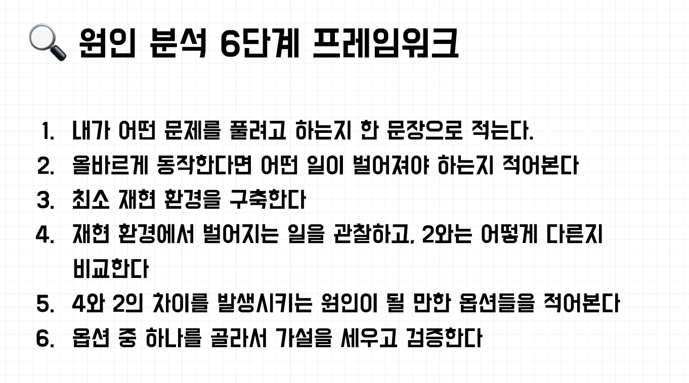

<br>

## Next Step의 효율적인 디버깅 모임


Next Step에서 주관하는 효율적인 디버깅을 위한 스터디에 다녀왔다. 코딩을 하면 디버깅은 밥먹듯이 하는 일이라 궁금증을 가지고 행사에 신청했다!

선릉역 테크 살롱에서 행사가 진행되었다.

행사에서는 사람들과 정보를 공유해서 버전1을 만들고, 직접 코드 디버깅을해서 버전2로 수정하고, 최종으로 UI 디버깅을 통해 버전3의 나만의 디버깅 환경을 만들자라는 방향성으로 진행되었다.

<br>

### 내 경험을 공유해보며 버전 1을 만들어보자.

평소 디버깅을 하면서 목적없이 작업을 진행한 경험이 대부분이었다. 어떤것을 어떻게 해결하고자 하는 생각은 없이...

행사가 시작되고, 다른 사람들과 디버깅 경험을 공유해보았다. 아래는 내가 디버깅하는 과정이다.

```
UI 관련한 문제가 발생한다 ⇒ 사내에서 사용하는 UI 프레임워크의 공식문서에 가거나 구글링을 진행한다.

간단한 함수 로직을 작성할 때 기능 구현 오류가 발생하면 수작업으로 console과 debug tool을 이용해 작업을 진행하고 완료가
되면 gpt를 이용해 개선할 사항을 확인 후 반영한다.

타입지정 및 테스트 ⇒ git copilot 을 이용해서 확인해본다.

결론 : sentry 짱짱
```

<br>

### 본격적인 세션 시작



진행해주시는 분께서 위와 같은 원인을 분석하는 것에 대해 방향을 제시해주었다.

단순하다고 생각하지만, 사소한 디버깅이여도 목적과 해결하는 방법에 대해 생각하는 것이 인상적이었다. (뭐 대부분의 경험에서 버그 발생 => 바로 수정이 대부분인 나였으니..)

<br>

### 샘플 코드 디버깅에 위 내용을 적용해 버전 2를 만들어보자.

```javascript
function flattenArray(arr) {
  let result = [];

  for (let i = 0; i < arr.length; i++) {
    if (Array.isArray(arr[i])) {
      result = result.concat(flattenArray(arr[i]));
    } else {
      result.push(arr);
    }
  }
  return result;
}

console.log(flattenArray([1, [2, 3], [4, [5, 6]]]));

// 실제 결과
// [
//  [1, [2, 3], [4, [5, 6]]],
//  [2, 3],
//  [2, 3],
//  [4, [5, 6]],
//  [5, 6],
//  [5, 6],
// ];
```

**1. 내가 어떤 문제를 풀려고 하는지 한 문장으로 적는다.**

- 배열 내부의 배열을 모두 평탄화 하는 작업을 하고싶다

<br>

**2. 올바르게 동작한다면 어떤 일이 벌어져야 하는지 적어본다**

- 올바르게 동작하면 [1,2,3,4,5,6]이 된다.
- 현재는 배열의 조건들이 하나씩 출력이 된다.

```javascript
() => error 발생
[] => []
[1] => [1]
[4,3] => [4,3]
[[1]] => [1]
[1, [2, 3], [4, [5, 6]]] => [1,2,3,4,5,6]
```

<br>

**3. 최소 재현 환경을 구축한다**

- index를 넣어주는 것을 수정해야될 듯?
- 아니면 현재 코드에서는 concat을 사용했는데 또 다른 javascript method가 없는지 확인해보자

<br>

**4. 재현 환경에서 벌어지는 일을 관찰하고, 2와는 어떻게 다른지 비교한다**

- 현재 코드에서는 concat을 사용하고있는데, concat은 두 개 이상의 배열을 병합할 때 사용되는데 요구사항이랑 다르다.

<br>

**5. 4번와 2번의 차이를 발생시키는 원인이 될 만한 옵션들을 적어본다**

- concat 또는 index의 for문이 예상하는 것과 다르게 동작함

<br>

**6. 옵션 중 하나를 골라서 가설을 세우고 검증한다.**

- flat이라는 javascript method를 사용해보자

```javascript
function flattenArray(arr) {
  let result = [];
  result.push(arr.flat(2));

  return result;
}
```

<br>

문제가 해결되었다. 하지만 기존의 함수에서 디버깅을 할 수 없을까?

위 과정을 다시 반복해서 기존의 코드에 접근하고 재귀 return문을 아래 처럼 수정해주었다.

```javascript
function flattenArray(arr) {
  let result = [];
  result.push(arr.flat(2));

  return result;
}
```

해결이 완료되었다.

<br>

### 위 과정을 통해 배운것

나는 디버깅을 할 때 접근만 하였다. 목표없이.

그렇기에 왜 문제가 발생했는지? 그리고 현재상황이랑 발생하는 오류에 대한 인지를 확실하게 하고, 내가 생각하는 결과뿐 아니라, 다른 예외에도 대응할 수 있도록 생각해보고 오류에 접근하는 자세가 중요하다는 것을 느꼈다. **추가적으로 다양한 가설을 세우는 것도!**

<br>

### UI 디버깅으로 버전 3을 만들어보자.


위 UI를 디버깅 해보자

<br>

**1. 내가 어떤 문제를 풀려고 하는지 한 문장으로 적는다.**

- UI가 정상적으로 동작하도록 구현한다.

<br>

**2. 올바르게 동작한다면 어떤 일이 벌어져야 하는지 적어본다**

- header, footer은 상단, 하단에 각각 고정한다.

- header,footer는 고정높이고, 중간 부분이 전체를 차지하고 있다.

- 중간에서 사이드바와 메인은 좌우로 배치되어 있다.

- 사이드바는 고정폭이고, 메인이 나머지 전체를 차지하고 있다.

- 카드들이 2x2 그리드로 배치되어 있다.

<br>

**3. 최소 재현 환경을 구축한다**

- 개발환경으로 가져온다.

<br>

**4. 재현 환경에서 벌어지는 일을 관찰하고, 2와는 어떻게 다른지 비교한다**

- 헤더가 중간부분에 좌우로 배치되어 있다.
- 메인 컨텐트에 카드가 일렬로 나와있다.
- 폭이 충분히 작으면 한줄로 나오는 게 스펙이었을 수 있음
- 좌우와 상하 스크롤이 다 생기고 있다.

<br>

**5. 4번과 2번의 차이를 발생시키는 원인이 될 만한 옵션들을 적어본다**

- display: flex 와 flex-direction: column 중에 문제가 발생 된 것 같다.

- html,css 구조에때문?

- card에서는 나열하는 방법이 잘못된 듯?

<br>

**6. 옵션 중 하나를 골라서 가설을 세우고 검증한다.**

- style 옵션들을 변경해보자

<br>

## 마지막으로

위 1,2,3 단계를 거쳐서 **장소와 환경 변경의 중요성**과 **원인 ⇒ 원하는 목표와 필요한 것을 명확히 ⇒ 폭넓은 예외처리** 의 디버깅 과정이 우리 경험에 필요하다는 것을 느끼는 활동이었다.

내 경험에서는 Sentry를 사용하면서 디버깅에 대한 접근을 잘못했다는 것을 느껴, 앞으로 진행에 위 경험을 녹여, 다양한 환경에서 접근을 할 수 있도록 신경써봐야겠다!

---

```toc

```
