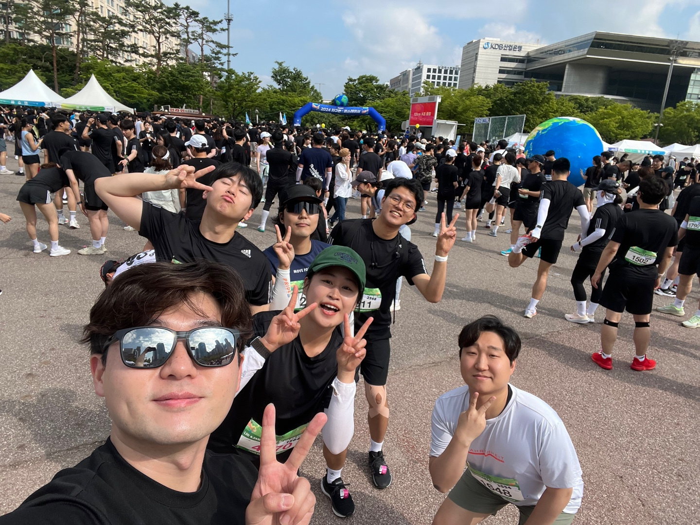

<br>

## 한 주 소감 및 복습 내용

|  |  |
| ----------------- | ----------------- |

<br>

나 마라톤했다? 10K, 나 회사가 엄청 바빳다, 그리고 Event Loop도 만들었고, History API를 열심히 만들고있다!

추가로 공부할 내용들은 아래와 같다.

- 상태관리 라이브러리를 내부적으로 구현한다고 가정했을 때 상태는 어떻게 트리거하고 UI 반영하게 할 수 있을지
  - observer와 flux 구조, re-render 시킨다면 어떻게 접근할지
- react-router-dom을 구현한다고 가정했을 때 인터페이스를 어떻게 설계할지
- Router guard, <Link /> <Router /> 는 각각 어떻게 구현할 수 있을지
- ~~composite Layers~~
- ~~React Virtual Dom과 탐색 알고리즘~~
- ~~브라우저의 Javascript 엔진이 스크립트를 어떻게 파싱하고 실행하는지~~

추가로 이번주에 react-router가 어떻게 동작하는지 만들어보고, 분석해보자. 아 그리고 프레임워크와 라이브러리 차이와 CSR과 SSR의 차이를 복습해보자!

<br>


<br>

### Composite Layers

Reflow, Repaint가 일어나면 아래 과정이 진행된다.

1. Recalculate Style : 요소에 적용할 스타일이 계산된다.
2. Layout : 요소의 레이아웃을 생성되고, 요소들은 벡터 박스로만 표현된다.
3. Paint : 생성된 모든 벡터 박스들을 픽셀로 변환하고, 레이어에 올린다.
4. Composite Layers : 생성한 레이어 계층을 합성하고 화면에 나타내고, 모든 요소가 고유한 위치를 갖는 완전한 웹 페이지로 보여진다.

Composite Layers 생성이란? CPU가 애니메이션을 처리하기 위해 GPU와 통신하는 단계로 각각의 layer를 GPU 메모리에 bitmap 형태의 texture로 저장하고 composition layer 작업시 GPU의 메모리에서 관련 작업을 진행하는 것을 의미한다.

Composite Layers를 사용하면 성능이 향상되고, 부드러운 애니메이션으로 시각적 효과를 받고, 리페인트 최소화되어 성능을 최적화할 수 있다.

대표적인 예시로는 3D 변환(transform, translate3d 등), css 애니메이션 및 트랜지션, opacity 속성 변환 등이 있다.

<br>

### Diffing Algorithm

Diffing Algorithm(비교 알고리즘)이란? React에서 두 개의 트리를 비교할 때 두 엘리먼트의 루트부터 비교한 후, 루트 타입에 따라 트리를 구축하는 방식의 알고리즘이다.

React에서 Diffing Algorithm을 다루는 것은 아래 3가지 상황이 있다.

1. 엘리먼트 타입이 다르게 되면, 이전 트리를 버리고 새로운 트리를 구축한다. 그렇게 되면 하위 state도 사라진다.
2. DOM의 엘리먼트 타입이 같고 속성이 다르면, 엘리먼트 속성을 확인해 동일 내역만 유지하고 변경된 속성만 갱신한다.
3. 자식 요소가 바뀌면, 자식들을 재귀적으로 처리한다. 해당하는 문제는 key prop을 통해 해결할 수 있다.

<br>

> key props는 우리가 다양한 상황에 사용한다. map을 이용해서 리스트를 보여줄 때 많이 사용하는데, key 속성을 통해 해당 key가 존재하는지 확인한 후 추가된 요소만을 반영하기 위해 사용된다.
>
> 배열의 인덱스를 key로 사용할 수 있겠지만, 배열이 다르게 정렬되더라고 인덱스는 변하지 않을 수 있어, 예상과 다른 동작 할 수 있다. 또한 key를 사용하지 않을 때와 같이 모든 형제 요소들과 함께 재랜더링이 발생할 수 있다.
>
> 그렇기에 고유한 값이 될 수 있도록 별도의 id값을 주는 것이 좋다.

<br>

그러면 Diffing Algorith을 왜 사용하게 되었을까?

기존의 DOM 트리를 새로운 트리로 변환하기 위하여 최소한의 연산을 하는 알고리즘을 사용한다. 이때 알아낸 조작 방식은 알고리즘 **O(n^3)** 의 복잡도를 가지고 있다. 만약,이 알고리즘을 React에 적용한다면, 1000개의 엘리먼트가 있다는 가정하에 실제 화면에 표시하기 위해 1000^3인 10억번의 비교 연산을 해야한다. 이는 너무 비싼 연산이기에 React는 두 가지 가정을 가지고 시간 복잡도 **O(n)의 새로운 Heuristic Algorithm을 구현했다.**

<br>

### 브라우저의 Javascript 엔진이 스크립트를 어떻게 파싱하고 실행할까?

우선 자바스크립트 엔진으로는 Google의 V8 엔진(Chrome과 Node.js에서 사용), Mozilla의 SpiderMonkey(Firefox에서 사용), Apple의 JavaScriptCore(Safari에서 사용) 등이 있다.

자바스크립트 엔진은 예시코드를 이용해 파싱과 실행에 대해 알아보자.

```javascript
function add(a, b) {
  return a + b;
}

console.log(add(2, 3));

/*

소스 코드 다운로드: 브라우저가 위 코드를 다운로드
렉싱과 파싱: function, add, (, a, ,, b, ), {, return, a, +, b, }, console, ., log, (, add, (, 2, ,, 3, ), ) 토큰으로 분할된 후 AST로 변환
AST 최적화: add 함수의 호출을 최적화
바이트코드 생성: 최적화된 AST가 바이트코드로 컴파일
실행: add 함수가 호출되고, 결과가 console.log로 출력
JIT 컴파일: add 함수가 반복적으로 호출되면 기계어로 컴파일되어 성능이 최적화

*/
```

1. 브라우저가 웹 페이지를 로드할 때, HTML 파일에 포함된 `<script>` 태그나 외부 JavaScript 파일을 발견하면 해당 JavaScript 코드를 다운로드

2. **파싱**은 소스 코드를 읽어들여 이해 가능한 데이터 구조로 변환하는 과정으로 2개의 단계로 나누어진다.
   - **렉싱 (Lexical Analysis)** : 소스 코드가 토큰(Tokens)이라는 작은 단위로 분할되는데, 각 토큰은 키워드, 변수 이름, 연산자, 숫자, 문자열 등 코드의 가장 작은 의미 단위다.

   - **파싱 (Syntax Analysis)** : 토큰들을 추상 구문 트리(AST: Abstract Syntax Tree)로 변환하는데, AST는 코드의 문법 구조를 트리 형태로 표현한 것이다. 각 노드는 코드의 요소(예: 함수, 변수, 연산자 등)를 나타낸다.

3. 생성된 **AST는 최적화단계를 거친다.** 이 과정에서는 코드의 성능을 향상시키기 위한 다양한 최적화가 적용된다. 예를 들어, 불필요한 코드를 제거하거나 반복되는 패턴을 단순화하는 작업이 수행된다.

4. 최적화된 AST는 바이트코드(JavaScript 엔진이 직접 실행할 수 있는 중간 형태의 코드)로 컴파일된다. 바이트코드는 실제 기계어가 아니지만, 더 낮은 수준의 코드로 변환된 것이다.

5. JavaScript 엔진은 생성된 바이트코드를 실행하는데, 최신 JavaScript 엔진은 바이트코드를 실행하는 과정에서도 다양한 최적화 기법을 사용한다.

6. **JIT 컴파일 (Just-In-Time Compilation)은** 바이트코드를 실행하면서 성능이 중요한 부분을 탐지하여 해당 부분을 네이티브 기계어로 컴파일한다. 이를 통해 반복적으로 실행되는 코드는 더욱 빠르게 실행된다.

<br>

## 5월 마지막 주 & 6월 첫째 주 회고

<br>

### 이번 주 좋은 것과 나쁜 것

- 화요일 멘토링 이후에 사내 코드에 큰 결함 있어서, 시간을 많이 할애하지 못했습니다.

<br>

### 이번 주 진행했던 학습/개발 내용은??

- 이벤트 루프 만들었습니다
- 사내에서 기존의 코드 리팩토링과 기능 수정 위주로 작업했습니다
- SPA 과제 진행했습니다

<br>

### 가장 고민했던 부분은 무엇이었나요?

- html 내부에서 router을 어떻게 만들어야 할까 고민했습니다.
- 카카오 아티클을 참조해서 router을 만들어 봤는데, 경로 설정하는 부분에서 해결하지 못했습니다.

<br>

### 아쉬운 부분을 개선하는 데 필요한 것은 무엇인가요?

- 약속 취소하고, 시간 많이 할애하겠습니다ㅠ...

<br>

### 다음 주는 어떻게 보낼 예정인가요?

- 이력서 수정
- History API 공부
- 그 이후부터는 사내 업무인 devops 공부, jest를 이용한 테스트코드 작성에 관해 공부 할 것입니다.
- 완성하지 못한 SPA 마무리도 계획 중입니다.

<br>

## 출처 및 도움되는 링크들

```toc

```
