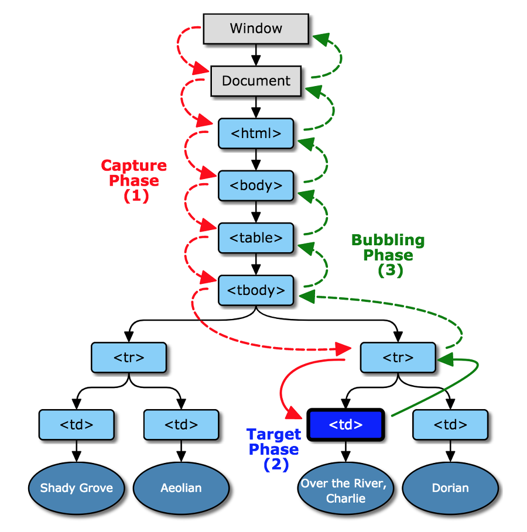
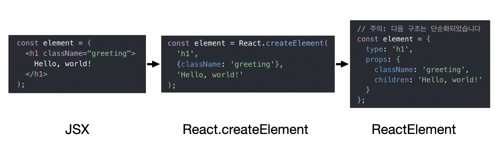

<br>

## 한 주 소감 및 복습 내용

힘들게 1차 과제를 마무리했다. 재사용성과 가독성에 대한 고민을 더 해보라는 피드백으로 코드를 열심히 만져보았다.

격렬하게 다루었던 커밋 기록은 [여기를 확인해보시면 됩니다.](https://github.com/jiji-hoon96/mentoring/pull/2)

평소라면 생각해보지 않은, 상태관리 변경 시점과 브라우저 동작방식 등에 대해서 자바스크립트로 코드를 작성하며 구현해보았다. 구현하기 너무 어려워서 구글링을 해본 결과 좋은 자료들도 발견하게 되어 공유 드리니 확인해보시면 좋겠다!

- [황준일님의 상태관리 시스템 만들기](https://junilhwang.github.io/TIL/Javascript/Design/Vanilla-JS-Store/#_1-%E1%84%8C%E1%85%AE%E1%86%BC%E1%84%8B%E1%85%A1%E1%86%BC-%E1%84%8C%E1%85%B5%E1%86%B8%E1%84%8C%E1%85%AE%E1%86%BC%E1%84%89%E1%85%B5%E1%86%A8-%E1%84%89%E1%85%A1%E1%86%BC%E1%84%90%E1%85%A2%E1%84%80%E1%85%AA%E1%86%AB%E1%84%85%E1%85%B5)
- [DaleSeo의 History API](https://www.daleseo.com/js-history-api/)

<br>

멘토링을 진행하면서 대답하지 못했거나, 더 공부가 필요한 것들에 관해 공부를 시작해보자! ~~도대체 자바스크립트 킹짱맨은 언제 될 수 있는 건데..ㅠㅠ~~


<br>

### 버블링과 캡처링



HTML 문서의 각 엘리먼트들은 **계층적 구조**로 이루어져있다. 이러한 구조 때문에 HTML 요소에 이벤트가 발생할 경우 **연쇄적 이벤트 흐름**이 일어날 수 있다.

이렇게 HTML 요소에 이벤트가 발생할 경우, 이벤트가 연쇄적으로 일어나는 현상을 **이벤트 전파**라 부르며, 전파 방향에 따라 **버블링**과 **캡처링**으로 구분한다.

- 버블링(Bubbling) : 자식 요소에서 발생한 이벤트가 바깥 부모 요소로 전파 (기본값)
- 캡쳐링(Capturing) : 자식 요소에서 발생한 이벤트가 부모 요소부터 시작하여 안쪽 자식 요소까지 도달

추가적으로 이벤트 전파 흐름은 캡처링, 버블링 단계가 동시에 발생한다. 추가로 실제 타깃 요소에게 전달되어 실행되는 **타깃 단계**까지 함께 이벤트가 발생한다.

이벤트 전파와 관련된 이벤트 흐름제어에 대한 내용은 알아볼 것이 많다.

하지만 나는 찾아보면서 이해했기때문에.. 자료가 필요하신 분들은 **[Inpa Dev의 한눈에 이해하는 이벤트 흐름 제어 (버블링 & 캡처링)](https://inpa.tistory.com/entry/JS-%F0%9F%93%9A-%EB%B2%84%EB%B8%94%EB%A7%81-%EC%BA%A1%EC%B3%90%EB%A7%81)** 을 확인해보면 좋을 듯 하다.

<br>

### JSX가 어떤 방식으로 동작할까?



기본적으로 JSX는 브라우저에서 직접 실행되지 않기 때문에, JavaScript로 변환된다. 이 작업은 **Babel과 같은 트랜스파일러**가 수행하는데, Babel은 JSX구문을 `React.createElement` 호출로 변환한다.

그 이후 변환된 React 엘리먼트를 사용해 Virtual Dom을 구성하고, 구성된 Virtual Dom은 UI를 업데이트하는데 사용이 된다.

Virtual Dom은 실제 DOM과의 차이를 계산하고, 필요한 부분을 업데이트하게 된다. 이 과정에서 저번에 공부한 [Diffing Algorism](https://hooninedev.com/240604/#diffing-algorithm)이 사용된다.

자세한 내용은 React 공식 홈페이지에 잘 기록되어 있으니 [참고자료](https://ko.legacy.reactjs.org/docs/introducing-jsx.html)를 확인하시길 바란다.

<br>

## 6주차 회고

스터디 과제들이 많이 딥해지기전에 좋은 코드란? 재사용성이 좋은 코드란? 직관적인 코드란? 이라는 생각을 중점으로 작업을 진행했다. **결과적으로 좋은 피드백을 받아서 기분이 좋다!**


그 중 가장 고민을 한 것은 아래 코드를 하나로 합쳐야 하느냐.. 분리해서 명확하게 하느냐였는데! 이에 대해 좋은 리뷰를 받아 공유한다!

```javascript
export const incrementTaskCount = (taskType) => {
  if (taskCounts.hasOwnProperty(taskType)) {
    taskCounts[taskType]++;
  }
};

export const decrementTaskCount = (taskType) => {
  if (taskCounts.hasOwnProperty(taskType)) {
    taskCounts[taskType]--;
  }
};
```

첫 번째 해결 방법

```javascript
import * as actionType from "./taskManger";

actionType.incrementTaskCount(taskType);
actionType.decrementTaskCount(taskType);
```

두 번째 해결 방법

```javascript
const taskManger = () => {
 const incrementTaskCount = (taskType) => {
  if (taskCounts.hasOwnProperty(taskType)) {
    taskCounts[taskType]++;
  }
};

const decrementTaskCount = (taskType) => {
  if (taskCounts.hasOwnProperty(taskType)) {
    taskCounts[taskType]--;
  }
};
 return {
   incrementTaskCount,
   decrementTaskCount
  }
}


const controlTask = taskManger(); => new TaskManger();

controlTask.incrementTaskCount();

```

어떤 방법을 사용해도 문제가 없지만, 연산에 대한 과정이 다양해질 수 있고, 복잡해질 수 있다고 생각하기에 코드의 특성을 잘 파악해서 구조화 하는 것이 중요하다는 생각이 들었다!

<br>

### 이번 주 좋은 것과 나쁜 것

- 약속이 많이 없어서 공부할 여유가 생겼습니다.

<br>

### 이번 주 진행했던 학습/개발 내용은??

- 이벤트 루프 코드 개선하려 리팩토링했습니다.
- 도커 실습으로 공부하고있습니다.
- navigator 만들면서, 메서드체이닝, location 등을 고민하며 작업했습니다.

<br>

### 가장 고민했던 부분은 무엇이었나요?

- 이력서를 수정해야하는데, 시간을 계속 못내고있어서.. 진행할 예정입니다.

<br>

### 아쉬운 부분을 개선하는 데 필요한 것은 무엇인가요?

- 테스트코드 작성이 너무 어렵습니다. 공식문서 보면서 메서드 사용하는건 어렵지 않은데, 큰 프로젝트의 기본설정이 어렵습니다

<br>

### 다음 주는 어떻게 보낼 예정인가요?

- 토스플랫폼 공채 지원할 것입니다.
- 레몬베이스 7월초에 과제테스트 진행하기로했습니다.
- 인프런 커피챗 예정입니다.

<br>

## 출처 및 도움되는 링크들

```toc

```
