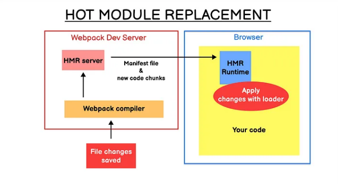

## HMR(Hot Module Replacement)이란?

**Hot Module Replacement(HMR)는** 개발 환경에서 코드 변경 시 브라우저 전체를 새로고침하지 않고도 변경된 모듈만 업데이트하는 기능을 의미한다. 이는 특히 React와 같은 현대 프론트엔드 프레임워크에서 매우 유용하게 사용되고있다. HMR은 Webpack과 같은 모듈 번들러에서 지원하며, 개발 과정에서 생산성을 크게 향상시킨다. 수정사항을 웹에서 바로 확인할 수 있어, 불필요한 시간 소비를 방지할 수 있다.

<br>

### 그럼 HMR은 어떻게 동작할까?

HMR이 편하게 해주는 것은 알겠다! 거의 2년여동안 HMR을 자연스럽게 사용하고 있는데, 궁금한적 없어 이참에 알아보자!


우선 개발자가 코드를 수정하고 저장하면, **Webpack Dev Server는** 변경 사항을 감지한다. **Webpack Dev Server는** 변경된 모듈만을 포함하는 업데이트를 생성하고 WebSocket을 토해 브라우저에 업데이트 정보를 전송한다. 브라우저는 해당 모듈을 교체하고 애플리케이션 상태를 유지한 채로 변경된 내용을 반영한다.

<br>


<br>

놀랍게도 끝이다. 엄청 간단하다!! 결국 Webpack과 같은 모듈 번들러를 사용하는 것이다. 공식 문서를 조금 더 살펴보니 **devServer.hot**의 값을 가지고 HMR을 핸들링 할 수 있다.

<br>


<br>

> Webpack-dev-server v4부터 HMR이 기본적으로 활성화되어 있습니다.
>
> HMR 활성화에 필요한 webpack.HotModuleReplacementPlugin을 자동으로 적용합니다.
>
> 따라서 설정에서 hot이 true로 설정되거나 CLI 옵션 --hot을 통해 이 플러그인을 webpack.config.js에 추가할 필요가 없습니다. 자세한 내용은 HMR 개념 페이지를 참고하세요.

<br>

### 그럼 사용하면 뭐가 좋은데?

HMR의 장점은 애플리케이션의 상태(state)를 유지하는 것이다. 개발자가 애플리케이션을 새로고침하지 않고도 변경 사항을 즉시 확인할 수 있다. 예를 들어, 사용자가 입력한 폼 데이터나 페이지 내의 특정 위치가 그대로 유지가 된다.

피드백이 상당히 빠르다. 그래서 개발자는 수정한 내용이 어떻게 동작하는지 빠르게 확인할 수 있다. 이는 특히 UI를 다루는 작업에서 유용하다.

생산성 향상되어, 불필요한 대기 시간을 준다. 예를 들어, 검색 로직을 수정하는 경우, 전체 페이지를 새로고침하고 다시 검색어를 입력할 필요 없이, 변경된 필터 조건이 즉시 반영된다.

일반적인 경우, 검색 로직을 변경하고 그 결과를 검증하기 위해 다음 단계를 거쳐야한다.

**코드 수정 => 저장 => 브라우저 새로고침 => 검색어 입력 => 검색 버튼 클릭 => API 호출 => 데이터 표시**

하지만 HMR을 사용하면 4개의 단계가 사라진다.

**코드 수정 => 저장 => 데이터 표시**

<br>


<br>

## 추가적으로 궁금한 것

흠.. 생각해보면 CRA에서는 Webpack을 사용하기 때문에 HMR을 사용하는데, VITE에서는 HMR을 어떻게 쓰고 차이가 있을까?? 한번 알아보자!!

<br>


<br>

### VITE에서의 HMR

Vite는 WebSocket 연결을 통해 브라우저와 지속적으로 통신하는데, 이 연결은 개발 서버가 변경 사항을 브라우저에 실시간으로 전달하는 데 사용된다.

그 이후 Vite는 **fs.watch (파일 시스템 감시)** 기능을 사용하여 프로젝트 파일의 변경을 실시간으로 탐지한다. 파일이 변경되면 Vite는 해당 파일의 종속성을 분석하여 어느 모듈이 영향을 받는지 파악한다.

변경된 파일에 대한 분석이 완료되면, Vite는 변경된 부분만을 포함하는 HMR 업데이트를 생성한다. 이 업데이트는 변경된 모듈의 새로운 버전을 포함한다.

WebSocket을 통해 브라우저에 HMR 업데이트 메시지를 전송한다. 이 메시지에는 변경된 모듈과 이를 어떻게 교체할지에 대한 정보가 포함되어있다.

브라우저는 Vite 개발 서버로부터 HMR 메시지를 수신하고, 해당 모듈을 교체한다. React와 같은 프레임워크는 HMR을 통해 상태를 유지하면서도 변경된 컴포넌트를 다시 렌더링할 수 있게 도와준다.

Webpack과 가장 다른 점은 네이티브 ES 모듈을 활용한 것이다.

<br>

## 참고자료

- [Vite 프로젝트에서 리엑트 컴포넌트는 어떻게 HMR될까?](!https://velog.io/@woohm402/vite-react-hmr)
- [Webpack-HMR](https://webpack.kr/guides/hot-module-replacement/#enabling-hmr)
- [Vite-HMR](https://ko.vitejs.dev/guide/api-hmr.html#hmr-api)

```toc

```
