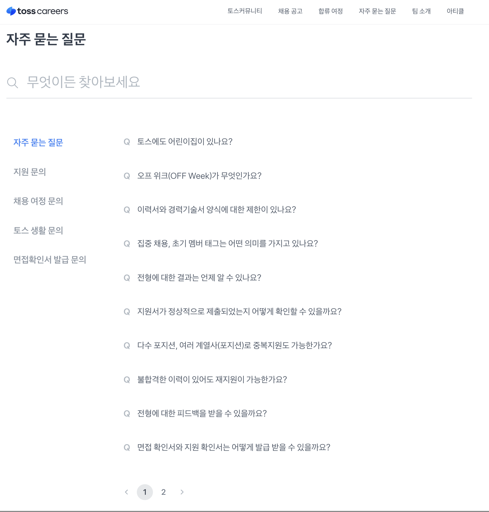
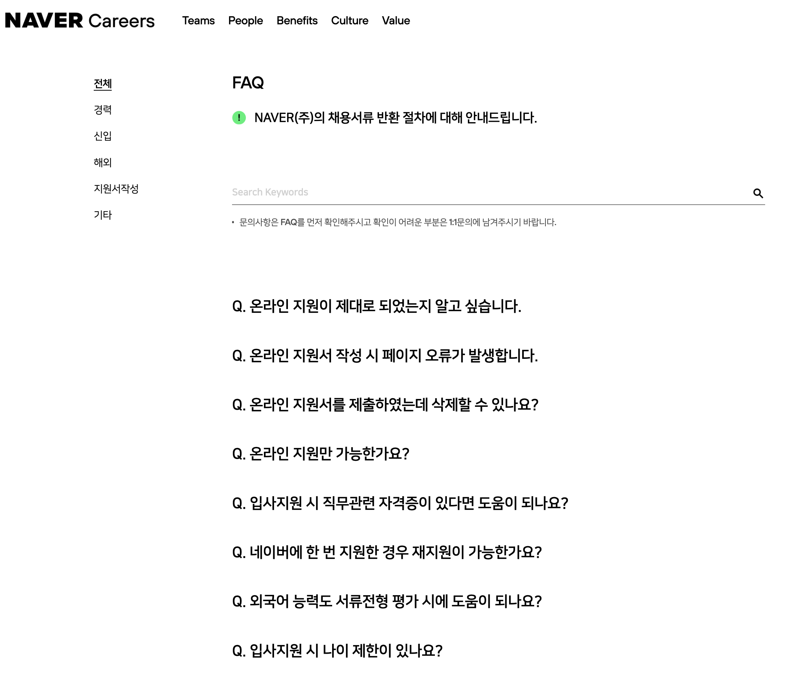

개발을 진행하다 보면 어떤 문제가 생겼을 때 어떤 기술 스택을 선택해서 구현하고자 하는 목표를 해결하기 위해 고민을 한다. 근래 개발을 하면서 익숙한 것들에 편안해져 고민 없이 선택하고 있다는 것을 느꼈다.

그래서 이번에는 프론트엔드 개발자 관점에서 서비스의 한 부분을 구현할 때 어떤 고민을 해서 기술 스택을 결정하고, 어떤 궁금증을 백앤드, 디자이너, 기획자, 데브옵스 등에게 전달해야 하는지 추론해보도록 하겠다.

주어진 문제 상황은 아래와 같다.

<br>

```markdown
나는 Frontend 개발자야. 사내 개발 구성원에 백앤드, 데브옵스와 인프라, 디자이너, 기획자가 있어.

고객센터를 통해 접수된 사용자 문의사항 중에 자주 접수되는 문의사항들을 FAQ 페이지를 생성해 모아두려고 해.

1. 프론트엔드 개발자 관점에서는 어떤 이유로 기술 스택을 선택해야 할까?
2. 문제 해결을 위해서 어떤 것을 고려해야 할까?
3. 팀원들과 어떤 내용을 고민해봐야 할까?
```

<br>

## 어떤 기술 스택을 선택해야 할까?

기술을 선택하기전에 FAQ 페이지에서 갖춰야 될 특성을 분석해보자. ~~특정 기능에 대해 분석하고 요구사항에 대한 명세를 만들어주는 것은 개발자의 근본적 역할은 아니라고 생각한다.~~

아래는 토스와 네이버의 채용페이지 FAQ 페이지 사진이다.

|  |  |
| --------------- | --------------- |

<br>

다른 회사의 FAQ 페이지를 더 찾아보면, 다른점이 분명 존재할 수 있겠지만 2개의 회사 공고에 공통적으로 보이는 요소는 페이지네이션, 검색, 상세페이지에서 FAQ를 살펴보기등이 있다.

그럼 프론트엔드 개발자 관점에서 FAQ 기능을 구현할 때 고려해야 할 요소는 어떤 게 있을까?

- SEO 최적화
- 키워드 기반 강력한 검색 엔진
- 실시간 FAQ 정보 변경으로 인한 업데이트
- 효율적인 캐싱 전략으로 서버 부하를 줄이고 페이지 로딩 속도 향상

위 기능 구현을 위해서 기술 스택을 선정하기 위한 과정을 하나씩 생각해보자!

<br>

### SEO 최적화

SEO 최적화 전략을 위해 프론트엔드 개발자는 어떤 것을 신경써야할까?

우선 **SSR을 활용**하면 검색엔진들이 이미 서버쪽에서 만들어진 HTML을 크롤링 가능하기에 검색에 유리할 수 있다. 또한 동적 콘텐츠에 대해 항상 최신 정보를 제공하면서도 초기 로딩 속도를 개선할 수 있고, 정적 페이지를 사전에 생성해 매우 빠른 로딩 속도를 제공한다.

이러한 이유때문에 Next.js를 코어 프레임워크로 선택하는 것을 고려해볼 수 있다. 추가적으로 **Next.js는 React 기반의 프레임워크로, SSR과 SSG를 모두 지원하고, ISR(Incremental Static Regeneration)을 사용하면 정적 페이지의 이점을 유지하면서도 주기적으로 콘텐츠를 업데이트**할 수 있다.

더 나아가 SEO를 강화 하기 위해서, Next SEO나 react-helmet을 사용하여 메타 태그, Open Graph 태그 등을 쉽게 관리할 수 있다. 이러한 도구들은 검색 엔진과 소셜 플랫폼에서 페이지가 더 잘 표현되도록 도와줄 수 있다.

결과적으로 Next.js를 활용하면 검색 엔진 크롤러가 쉽게 콘텐츠를 인덱싱할 수 있고, 사용자에게는 빠르고 반응성 좋은 경험을 제공할 수 있다. 또한, Core Web Vitals와 같은 Google의 주요 순위 요소들을 개선하여 전반적인 SEO 성과를 높일 수 있다.

<br>

### 로딩 속도

앞서 SEO 최적화를 위해 Next.js를 코어 프레임워크로 선택해야겠다고 생각했다. 그러면 로딩 속도 측면에서도 알아보자.

**SSG를 사용**하여 FAQ 페이지, 카테고리 목록 등 자주 변경되지 않는 콘텐츠를 개발하면 빌드 시점에 미리 렌더링이 된다. 그렇게 되면 정적 페이지가 빠르게 로드되고, CDN을 통해 효율적으로 배포 될 수 있다.

**SSR을 이용해** 개별 FAQ 페이지나 검색 결과와 같은 동적 콘텐츠를 개발하게되면 요청 시점에 서버에서 렌더링이 된다. 이러면 항상 최신 데이터를 제공하면서도, 클라이언트 측 렌더링보다 초기 로딩 속도가 빠르게 되어 사용자에게 효율적 UI/UX 환경을 제공할 수 있다.

이러한 하이브리드 렌더링 전략을 사용하여 성능과 콘텐츠 최신성 균형을 유지할 수 있기 때문에 SSG와 SSR 방식을 효율적으로 사용하는 Next.js를 사용하는 것을 고려해볼 수 있다.

<br>

### 성능 최적화

우리는 최적화 전략을 이용해서 **Core Web Vitals의 LCP, FID, CLS를 개선**할 수 있다. 최적화를 필요로 하는 요소가 많지만, FAQ 페이지 특성에서 많이 보이는 요소를 먼저 생각해보자.

네이버와 토스의 FAQ 페이지를 살펴보면 Image 컴포넌트를 사용하고 있다. 그리고 페이지네이션을 이용해 목록을 보여주고, 질문을 클릭하면 상세페이지로 이동하게 된다.

<br>

#### Image 컴포넌트 최적화를 위해서는 어떤 것들을 고려해볼 수 있을까?

아무래도 자동 이미지 최적화를 고려해볼 수 있다. **WebP와 같은 이미지 포맷 변환 방식**을 생각해볼 수 있고, 디바이스 크기에 맞는 **이미지 크기를 미리 준비**하는 것도 방법이다.

**레이지 로딩**을 통해 뷰포트 밖의 이미지 로딩을 지연시켜 초기 페이지 로드 시간을 줄일 수 있고, 이미지가 로드되기 전에 블러 처리된 **작은 이미지를 보여줌**으로써 사용자 경험을 개선할 수 있다.

이미지 최적화를 통해 LCP(Largest Contentful Paint)를 개선하고, 페이지 로드 속도 향상을 기대할 수 있다.

<br>

#### 페이지네이션 최적화

그 다음 **페이지네이션 최적화**를 생각해보자. 페이지네이션을 구현하기 위해서는 다음 페이지에 어떤 데이터가 나올 지 미리 알 수 있거나, 이미 사용자에게 보여진 페이지는 데이터 재호출 없이 바로 보여줄 수 있어야한다.

또한 각 페이지의 데이터를 서버에서 렌더링하여 초기 로드 시간을 줄이고, **프리패치를 선택적으로 구현**할 수 있다.

<br>

#### 페이지 전환

마지막으로 상세 페이지 이동을 위해 어떻게 구현할지 생각해보자.

상세 페이지로 이동을 할 때 **데이터를 미리 fetch**할 수 있다. 그렇게 되면 페이지 전환 시 속도를 향상 시킬 수 있다. 하지만 hover를 이용해 프리패치를 하게되면, 오히려 성능 저하가 발생할 수 있다는 점을 인지하고 기능 구현을 계획해야한다.

**Dynamic import를** 사용하여 필요한 코드만 로드하여 초기 번들 크기를 줄이는 것도 방법이다. 사용자에게 부드러운 이동을 보여줄 수 있도록 고민해보자

성능 최적화를 위해 더 많은 것을 고려할 수 있다. **SWR**을 이용해 데이터 패칭을 최적화 할 수 있고, **React.memo()를** 통해 불필요한 리렌더링을 방지하고, Error Boundary를 잘 구현하여 페이지에서 불필요한 충돌을 방지할 수 있다.

<br>

### 어떤 것을 더 고려해보면 좋을까?

메인 기술 스택을 선정하고 여러 가지 라이브러리를 선택할 때도 고려해야 할 요소가 많다.

클라이언트(Redux, Zustand, Jotai, Recoil 등등..)와 서버 상태관리(React-Query 등등)를 할 수 있다. 이를 통해 서버 상태를 효율적으로 관리하고 캐싱한다. 이는 Time to First Byte (TTFB)를 개선하여 페이지 로딩 속도를 향상하게 시킬 수 있다.

그 다음 스타일적 요소를 위해 CSS Modules나 Styled Components 등과 같은 스타일 라이브러리를 사용할 수 있다. 이는 클린한 DOM 구조를 유지하는 데 도움이 되며, 결과적으로 페이지 성능 개선에 기여할 수 있다.

더 나아가 분석 및 모니터링을 위해 Google Analytics와 Next.js Analytics를 사용하여 사용자 행동과 페이지 성능을 모니터링 할 수 있다. 이렇게 모은 데이터를 바탕으로 지속적인 SEO 최적화를 수행할 수 있다.

```toc

```
