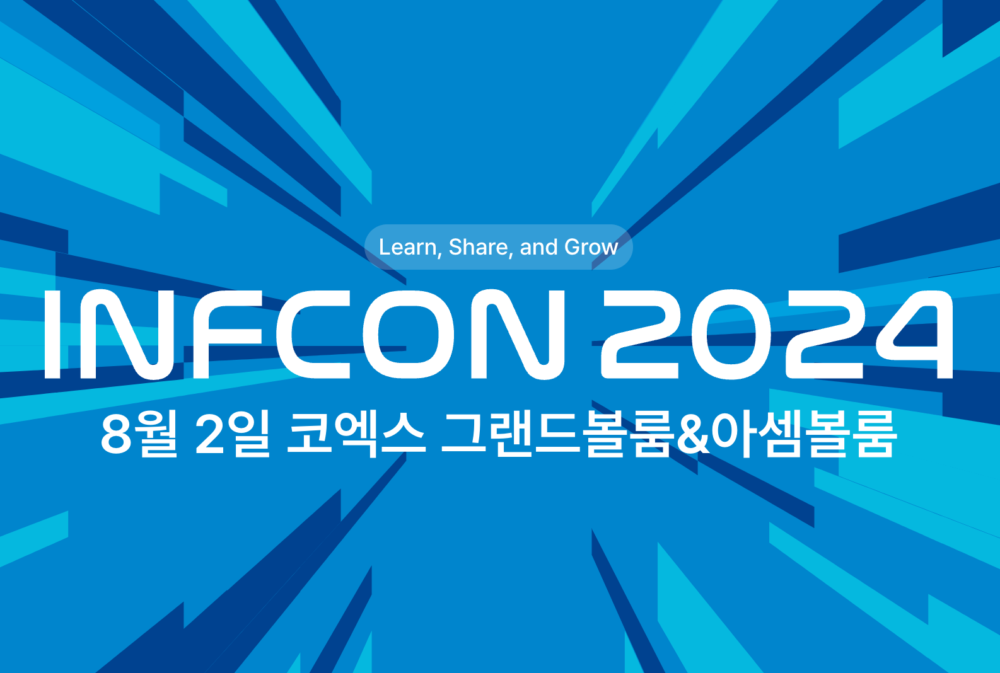

<br>

8월 2일 삼성역 코엑스에서 인프랩이 주관하는 **인프콘**이 열렸다. ~~당연히 나는 광탈했다..~~

하지만 인프랩에서 SIPE 부스 홍보의 기회와 네트워킹, 스피커들의 세션에 참여할 수 있는 기회까지 제공해 주셨다. **Thank you 인프랩.. 🥰**

<br>

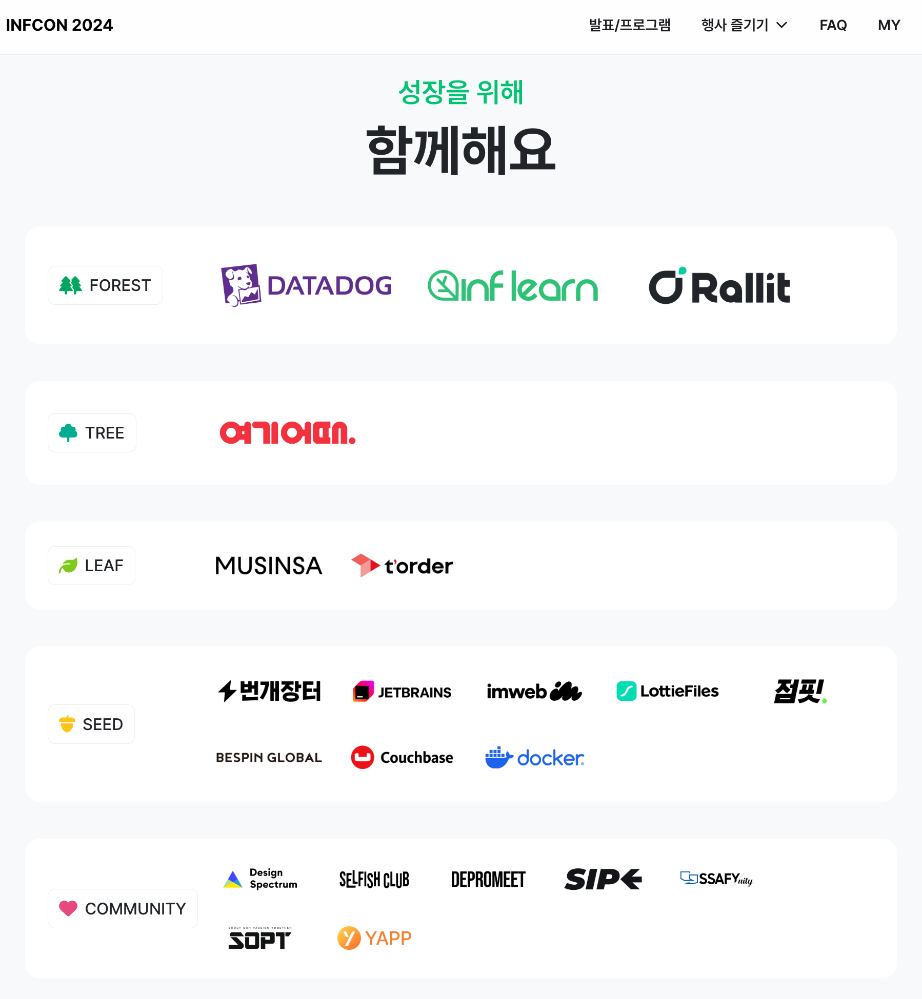

<br>

그럼 인프콘은 어떤 행사이고, SIPE는 어떤 동아리이고, 인프콘을 위해서 SIPE는 어떤 것을 준비했는지와 더 나아가 인프콘에서 듣게 된 세션들을 소개해보겠다!!

<br>

## SIPE의 우당탕 인프콘 참여기

동아리 활동이 막바지로 가고 있는데, 인프랩에서 연락이 왔다! 다름 아니라 SIPE를 인프콘 커뮤니티 부스에서 홍보할 수 있도록 자리를 만들어준다는 것이었다!!!!!


> 아니 그저 빛.. 우리 같은 아기 동아리에게 이런 행운이..

<br>

급히 동아리 운영진들과 참여에 관해 회의를 진행했다. 2기 활동 마무리를 위해 바쁜 일정이었지만, 다음 기수인 3기 홍보를 위해도 좋다고 판단하여 참여하기로 했다. 그렇게 참여가 결정이 되고, 행사에 관한 내용을 전달받기 위해 인프랩에서 주관해준 커뮤니티 오프라인 행사에 참여했다.

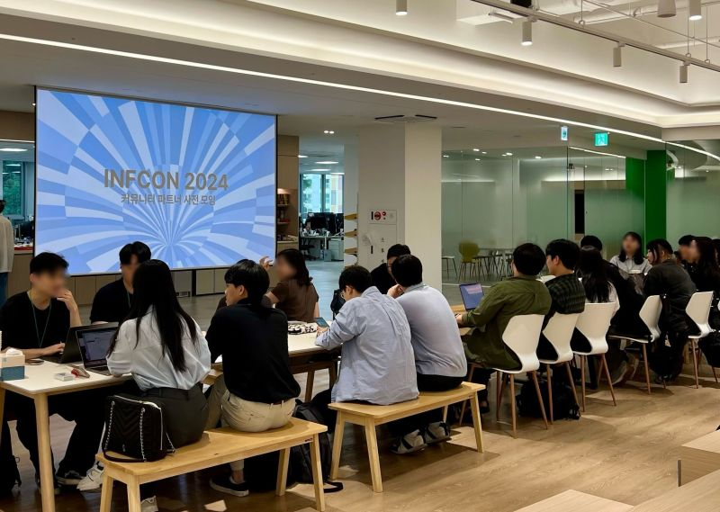

> 사진 출처 : [홍연의님 링크드인](https://www.linkedin.com/posts/yeoneui-hong_suauiktgo2024-suauikrvc-ittecrnoqwityy-activity-7203743971724988416-bFWM?utm_source=share&utm_medium=member_desktop)

<br>

커뮤니티 부스에는 **[DEPROMEET](https://www.depromeet.com/), [SSAFYnity](https://linktr.ee/ssafynity), [SOPT](https://www.sopt.org/), [YAPP](https://www.yapp.co.kr/)** 이 함께 참여하게 되었다. ~~너무 좋은 동아리들과 함께해서 영광!!~~

우리는 인프랩이 준비해준 맛있는 치킨,피자를 먹으며 다른 동아리 운영진들과 네트워킹을 하며, 인프콘에서 맡게 될 우리의 역할에 대해 전달받았다.

<br>

### 인프콘에 참여한 SIPE

동아리 부스에 방문해주신 분들을 위해 굿즈와 작은 선물과 이벤트를 준비하는 동안 8월 2일이 되었다.

인프콘은 삼성역 코엑스에서 진행되었고, SIPE의 부스는 2층 라운지 4번째 공간을 제공받았다. 공간도 넓고, 접근성이 좋아서 많은 사람이 몰리지 않고 오실 수 있다는 생각을 했다. (아주 좋은 위치를 뽑은 SIPE 부회장님 굿 보이!)

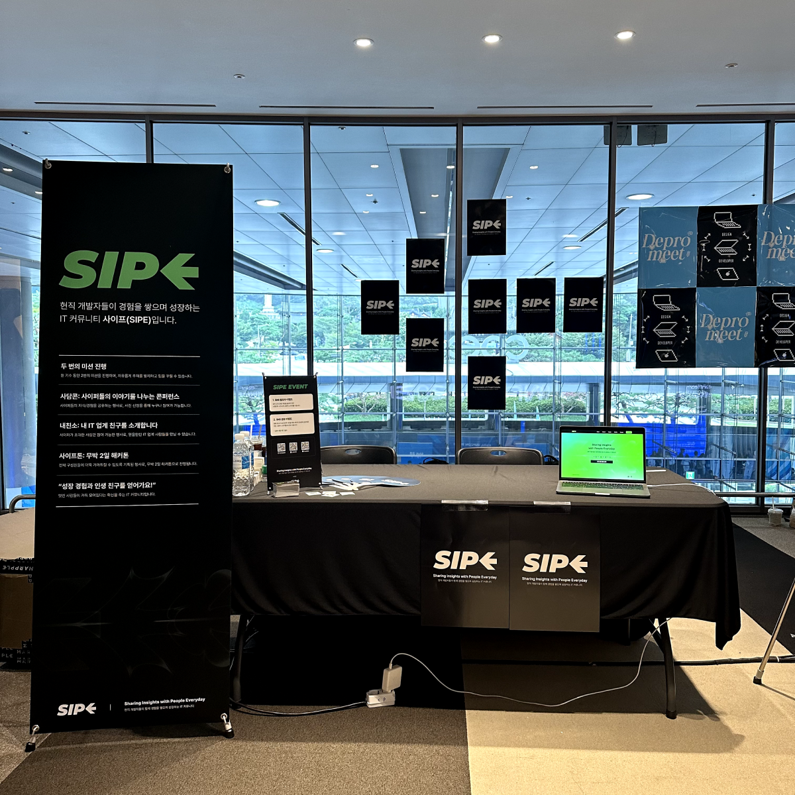

| 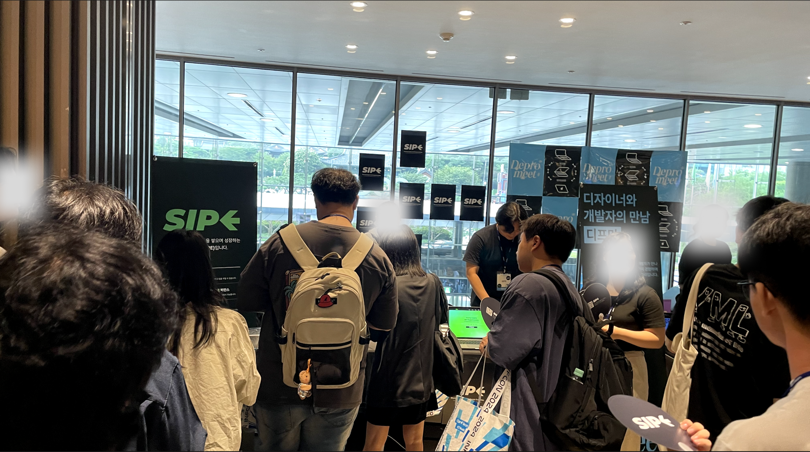 | 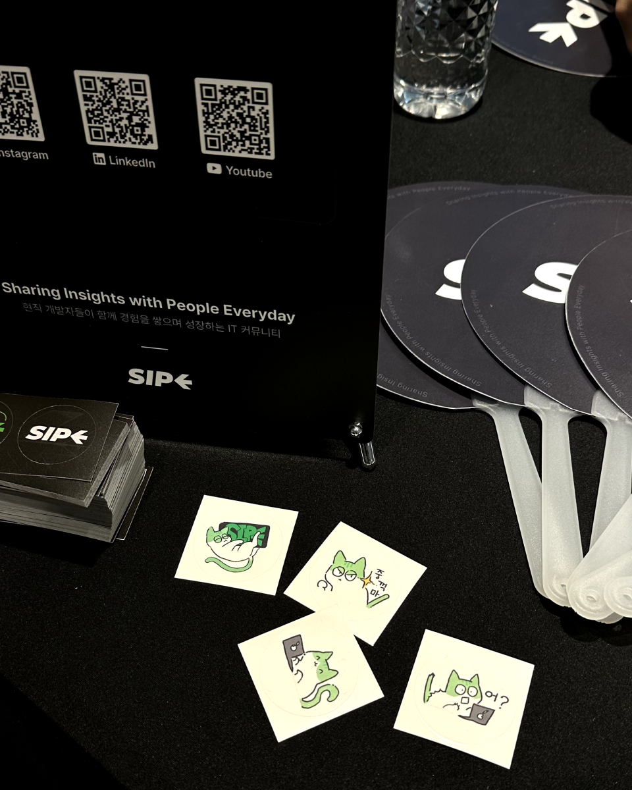 |
| --------------- | --------------- |

<br>

우리는 귀여운 스티커들과 팔로우 이벤트를 통한 커피 이벤트를 준비했다. 많은 분이 참여해주시고 좋아해주셨다!! ~~동아리 인스타 팔로워가 2배이상 늘게었다.. 화력🔥🔥🔥~~

<br>

| 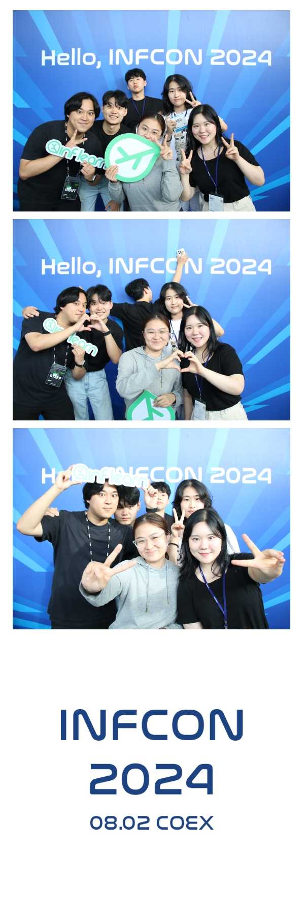 | 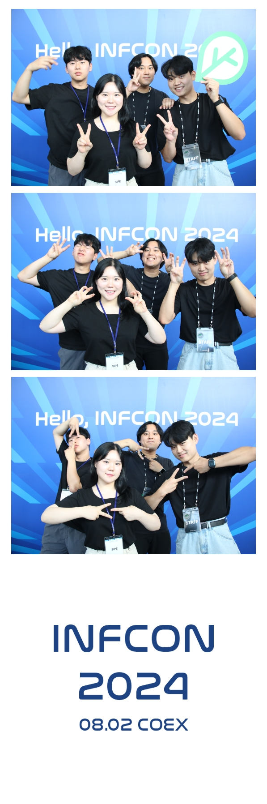 |
| --------------- | --------------- |

<br>

운영진 몇 분이 개인 사정 때문에 오시지 못해 일손이 부족했는데, 미진님이랑 동생분이 인프콘에 참여해서 시간 날 때마다 부스를 열심히 도와주셔서 쉽게 마무리할 수 있었다. 고마워요..! 😊🙏

<br>

### SIPE 3기에 대한 Q/A

동아리 부스에 오셔서 많은 분께서 질문을 해주셨는데, 많은 분이 또 궁금해하실 것 같아서 간단히 적어보겠다!

<br>

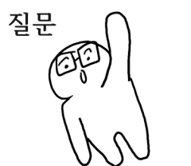

<br>

#### Q1. SIPE는 어떤 동아리인가요?

다수의 IT 커뮤니티들은 주어진 기간 동안 프로젝트를 완성하고 배포하는 목표가 있다. 단기간에 팀원들과 서비스를 만들어가는 경험은 굉장히 매력적이지만, 각자가 생각하는 프로젝트의 규모, 방향성, 목표가 다를 경우 모두가 만족스러운 결과물을 얻기에는 다소 어려움이 발생하곤 한다.

시간이 지날수록 사이드 프로젝트의 한계를 느낌에 따라 서비스를 고도화하기 보다는 함께 하는 사람들과의 네트워킹에 더 집중하는 현상을 발견했고, 많은 사람이 프로젝트를 완성해야 한다는 부담감을 느끼는 모습을 볼 수 있었다.

그래서 **사이드 프로젝트에 집중하는 것이 아닌 네트워킹을 중심으로 함께 성장할 수 있는 자유로운 분위기를 만들어보자는 생각 속에서, SIPE가 생겨났다.**

SIPE는 구성원들이 본인만의 성장 방식을 찾고 나아갈 수 있도록 도와주는 역할을 한다. 이를 통해 열정적으로 인사이트를 공유하고, 모두의 성장을 위해 긍정적인 영향력을 공유할 수 있는 집단을 만들게 된다.

<br>

#### Q2. 동아리 진행 방식이 어떻게 되나요?

4달 동안 2번의 미션을 진행하며 직무과 관련된 내용을 학습하고 공유하고 있다.

그리고 **사이프챗, 내친소(내 친구를 소개합니다)를** 통해 같은 업계 종사자들을 만나 대화를 하며 인사이트를 넓히고있다. 또한 **사담콘(컨퍼런스), 사이프톤(사이프 해커톤)을** 통해 본인이 습득한 지식 또는 경험을 나눌 수 있다.

기수와 관계없이 모두가 참여할 수 있는 비공식 활동(러닝/클라이밍/풋살과 같은 운동, 주차별 회고, 매주 아티클 읽기 등) 또한 활발하게 진행되고 있다.

<br>

#### Q3. 동아리에 가입하기 위해선 어떻게 해야 하고, 어떤 사람을 원하나요?

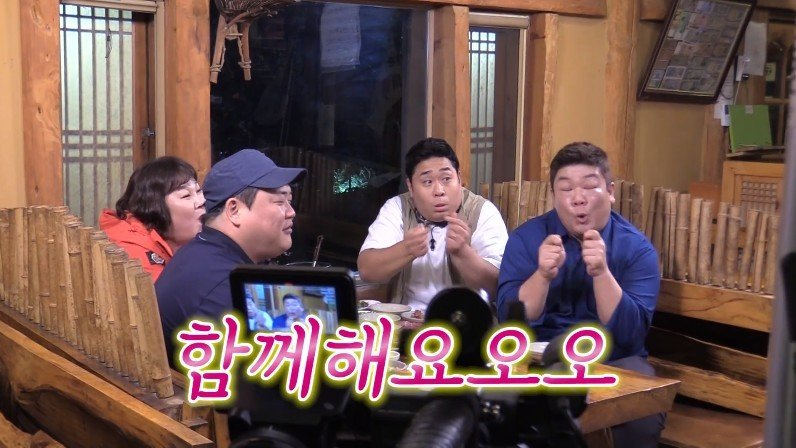

<br>

SIPE는 **구성원들의 성장에 긍정적인 영향을 끼칠 수 있는 사람을 선호한다.**

각자 원하는 방식의 성장을 임팩트 있게 이루기 위해서는 성장 과정을 교류하는 사람이 무척 중요하다고 생각한다. 그러므로 어떤 면이든 배울 점이 있는 사람을 우선하여 선발하고 있다.

우리는 다양하거나 깊이 있는 경험을 쌓은 사람(동아리/커뮤니티/스터디/교육 참여 또는 운영, 사이드 프로젝트, 기술 관련 발표, 커리어 패스 등) 또는 성실하고 책임감 있는 사람 (깃허브, 블로그, 사이드 프로젝트/대외활동 기간 및 횟수)이 우리와 함께하길 원한다!!

<br>

#### Q4. SIPE 활동중 가장 인상적인 활동?

**사담콘, 내친소**와 같이 다양한 사람들과 함께하는 활동들이 인상적이었
다는 말을 많이 들었다. 아마 발표를 해보고 싶지만 기술적이고, 깊은 주제에 어려움을 느끼셔서, 자신의 경험을 시작으로 발표할 수 있는 용기를 얻게 된 것과 친구들을 데리고 와 동아리를 소개하고, 다른 친구들을 소개받는 활동이기 때문이라 생각한다.

그리고 **각 행사의 TF를** 해보며 동아리 운영을 직접 해볼 수 있다는 점도 인상적이라고 이야기를 많이 들었다!!

<br>

#### Q5. 3기는 언제, 어떻게 진행될 예정이에요?

3기에는 사이프라는 동아리가 줬던 가치 중에서도 **"기술적 영감, 네트워킹"** 에 좀 더 초점을 맞추고 활동을 할 예정이라 한다. 또한 기존 동아리에서도 겪을만한 **"자신의 활동 그룹(조) 외의 사람들과 네트워킹을 하기가 어려움"** 이라는 문제를 해결하기 위한 프로그램 구성할 예정이니, 동일한 고민을 하고 있으면 지원해보자!


<br>

활동은 **10월 초 ~ 중에** 시작 예상하고, 일정은 2주 1회 오프라인 모임에, 8회차로, 기존 사이프 행사들을 멋지게 가다듬어 진행할 예정이니 많은 관심 부탁한다~!!

<br>

## 인프콘 세션 활동

| 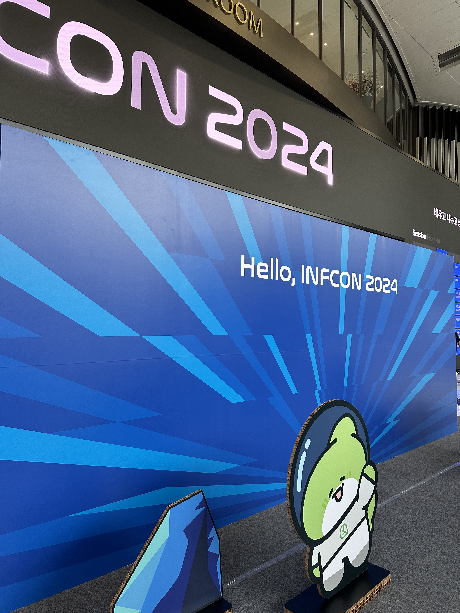 | 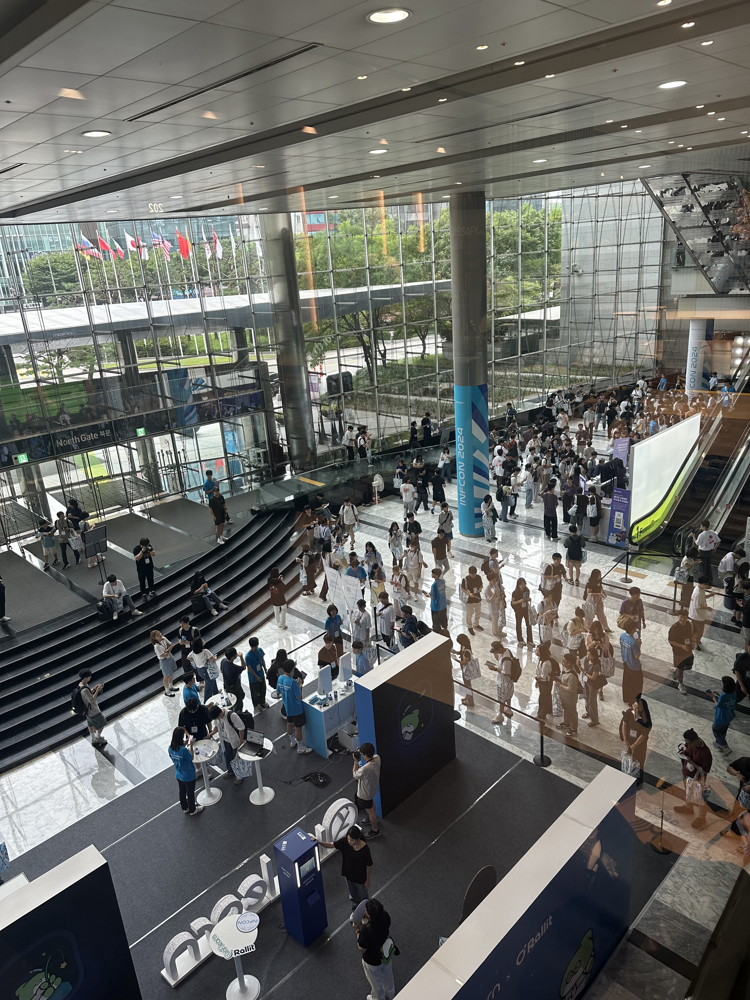 |
| ----------------- | ----------------- |

<br>

우리에게 스피커의 발표에 참석할 기회가 주어졌다. 그래서 나는 3가지 세션과 네트워킹 모임에 참여했다.

모든 세션이 경험, 기술에 관해 밸런스가 잘 맞춰져 있었고, 좋은 스피커 분들이 많이 계셔 인상적인 발표를 들을 수 있었다. 모든 세션을 듣고 싶었지만.. Vite 플러그인.. 아쉽다.... 동영상이 올라오면 좋겠다!)

<br>

| 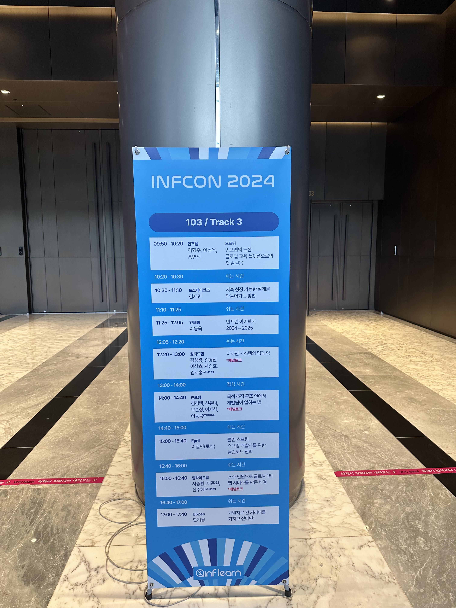 | 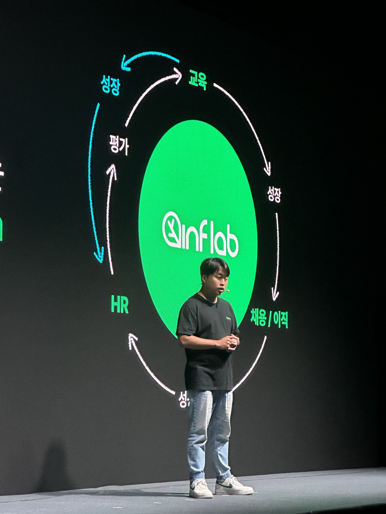 |
| ----------------- | ----------------- |

<br>

### 7년 동안 하나 만들었습니다: 프론트엔드 개발의 결정적 순간들 - 이찬희님(AB180)

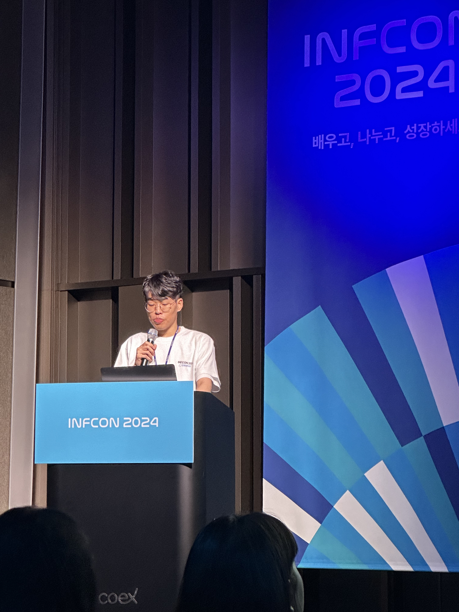

찬희님 발표에서는 단순한 작업으로 시작한 플랫폼이 큰 고객이 들어오면서 발생한 문제들에 소개해주셨다. 그리고 문제 해결을 위한 선택들을 통해 얻은 교훈들을 이야기해주셨다.

서비스가 커지면서 API가 느려지고, 서버가 다운되는 현상이 발견되었다. 이런 상황일 때 백앤드 입장에서는 페이지네이션을 고려하면 되었지만 프론트는 어떻게 처리할지 난감하셨다. 결국 메타데이터가 일부만 존재하게 되니 불완전한 UI가 되어버렸다.

데이터 양과 변화량이 UI에 큰 영향을 끼치기때문에 데이터의 참조를 쉽게 해야 된다. 자주 쓰는 값을 기준으로 묶어서 정규화(Normalization)로 만들거나, 양도 많고, 참조도 빈번하면 Map을 사용하자. (빠른 성능과 가독성이 높아진다)

기술에는 편향이 있기에 신뢰할 수 없다. 어떤 기술 도입과정에서 벤치마크와 측정자료가 잘못된 것은 아니다. 하지만 마음이 급하면 편향이 된다.. 유리한 것만 POC하는 것은 안 좋다. 이럴 때 문제를 원초적으로 해결하는 방법은 문제를 뒤집어서 원천적 이유를 찾으면 다양한 해결법이 존재한다.(리팩토링의 결론은 레거시들을 가지고 유산을 만들기)

찬희님 발표에서 인상적인 부분은 마지막에 전달해주신 나 자신에게 하는 질문인 **나만의 결정적 순간은 꿈꿔보고 생각해보자!** 이었다. 올해의 2/3가 지나간 만큼 생각해보면 좋을 것 같다!

<br>

### Next.js 블로그 모범 사례 탐구: Vercel 리더십 블로그 아키텍처 파헤치기 - 하조은님(당근)

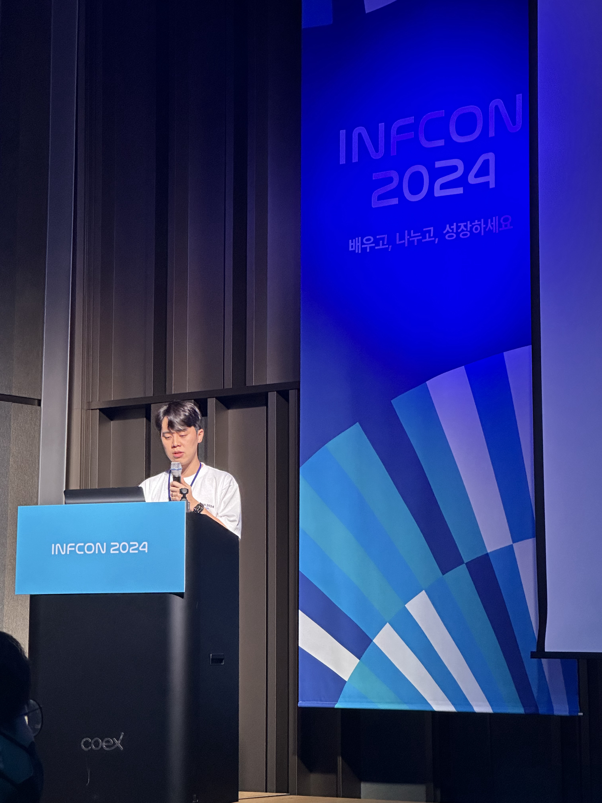

| 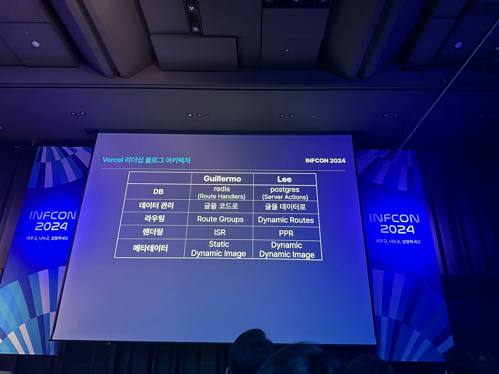 | 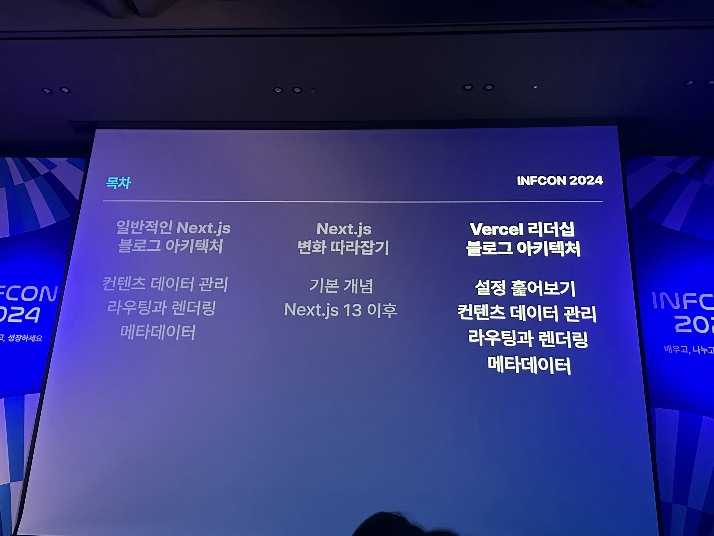 |
| ----------------- | ----------------- |

두 번째 조은님의 발표는 Next.js를 만든 Vercel의 Guillermo Rauch와 Lee Robinson의 블로그를 비교하며 Next.js의 다양한 기능을 탐구하는 세션이었다.

View Count 구현 방식(Guillermo: Redis, Lee: PostgreSQL), MDX를 통한 콘텐츠 데이터 관리, 그리고 ISR과 PPR 렌더링 방식에 대한 것과 Open Graph 이미지와 JSON-LD를 활용한 SEO 기법도 다루었다.

블로그를 처음 만들 때 Vercel의 블로그에 대해 찾아본 적 있었는데, 이런 접근을 가지고 깊이 탐구하는 자세를 배워야겠다는 다짐을 하였다

<br>

### 처음으로 기술 리더가 된 개발자를 위한 안내서 - 박서진님(토스)

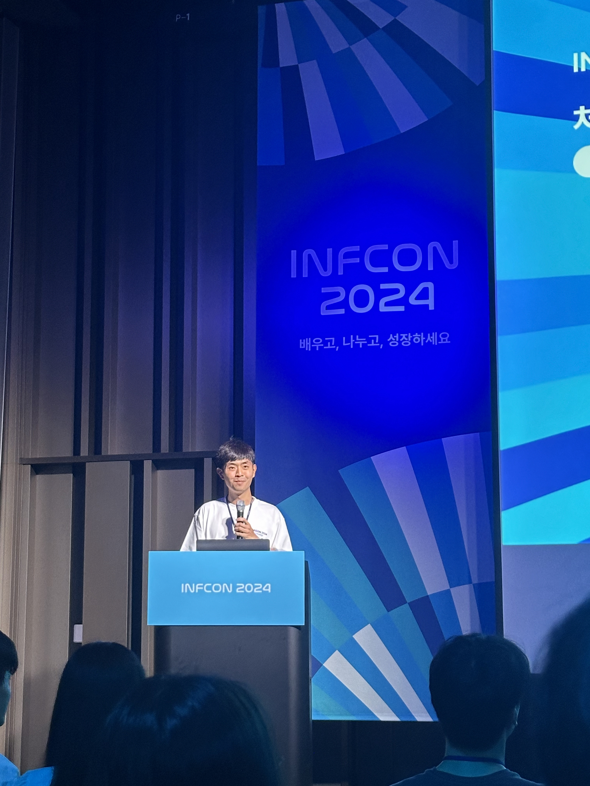

토스팀에서 리더의 역할을 하면서 리더들이 겪는 문제들을 살펴보고, "신뢰의 7가지 요소"라고 하는 키워드 중심으로, 어떻게 단계적으로 조직에서 역할에 익숙할 수 있을지 알아보는 시간을 가졌다.

내가 생각한 리더의 역량에는 강한 기술력과 의견제시를 통한 팀원 포용력을 생각했다. 하지만 생각보다 고려해야 할 요소가 많다는 것을 알게 되었다.

팀을 위해 본인이 갖춰야 될 자세와 관점에 대해, 팀원과 리더의 밸런스 등 다양한 요소들을 고려해야 한다는 것을 새롭게 알게 되었다. 지금은 주니어지만 언젠가 리더가 될 수 있기에 항상 준비하고, 배우고 의견을 제시하는 자세를 갖춰야겠다!

<br>

### 인프콘의 네트워킹 파티와 라이트닝 토크

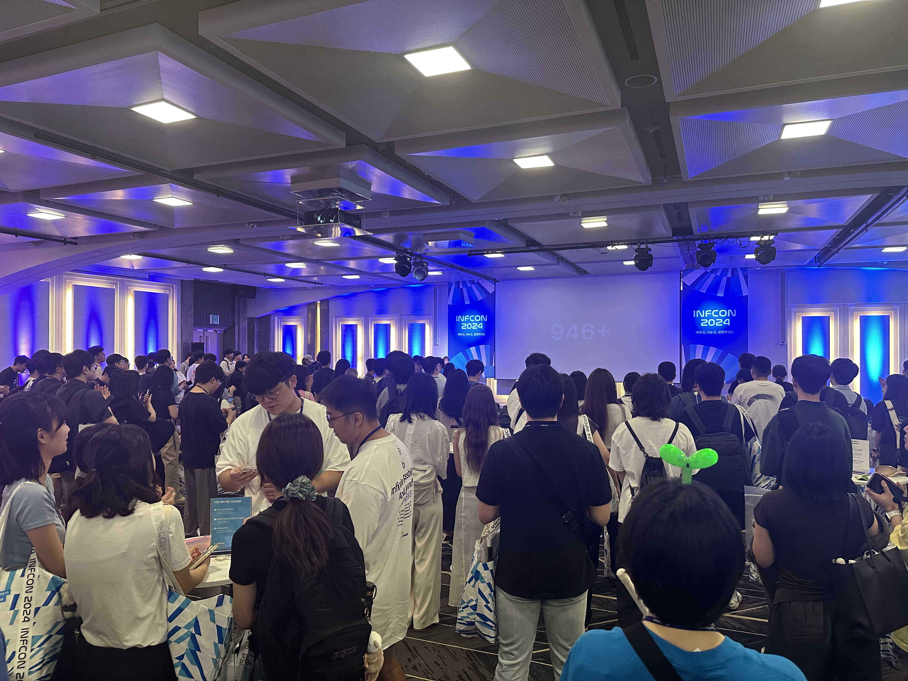

인프콘의 세션 중간에 라이트닝 토크가 2층 행사장에서 열렸다. 라이트닝 토크에 미리 발제를 해주신 분들을 찾아 회사에 관한 이야기, 요즘 취미와 관심사, 개발에 대한 네트워킹을 했다.

다른 컨퍼런스에서는 세션(강의)이 많기에 네트워킹을 할 시간이 부족하거나 없었다. 하지만 인프콘에서는 시간과 공간을 마련해주어, 다양한 사람들과 다양한 주제를 가지고 의견을 공유할 수 있다는 점이 인상적이었다.

네트워킹 파티에서는 직군마다 가지고 있는 고민에 대해 비슷한 관심사끼리 모여 이야기를 나눌 수 있었다. 짧은 시간이 아닌 긴 시간 동안 다양한 이야기를 할 수 있다는 점이 좋았다.

<br>

## 커뮤니티 부스

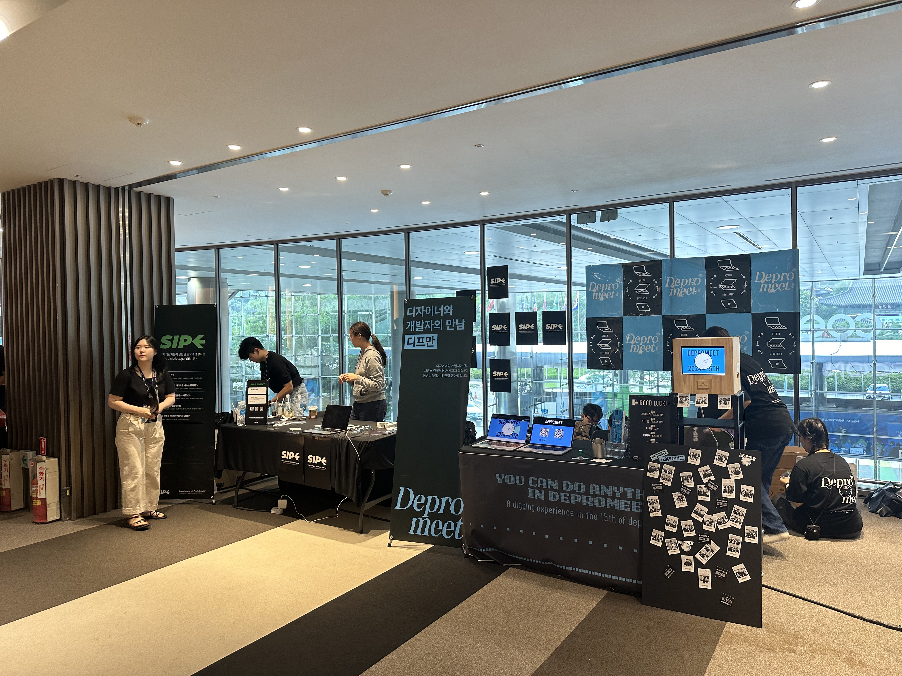

요즘 IT 직군의 많은 사람이 동아리와 컨퍼런스에 참여하기를 원한다. 하지만 높은 경쟁률로 참여하는 것은 둘째로, 동아리에 대해 직접적인 질문을 하거나, 구성원과 대화해볼 수 없다는 것이 아쉬웠다.

인프랩에서 IT 직군의 커뮤니티 활성화를 통해 위와 같은 간극을 줄이기 위해 커뮤니티 부스를 두었다고 생각한다.

이를 통해 예비지원자분에게 질문을 받고 홍보를 할 수 있는 시간을 가질 수 있었다!! 내 블로그에 방문하시는 예비지원자분을 위해 SIPE를 비롯한 인프콘 커뮤니티 부스에 참여했던 동아리들을 소개해보려 한다!

> SIPE는 위에 상세하게 적어두었기에 참조하면 좋을 것 같다!

<br>

### Depromeet

|  |  |
| ----------------- | ----------------- |

**디프만은 디자이너와 개발자가 만나 서비스 런칭부터 개선까지 경험하며 동반 성장하는 IT 연합 동아리다.** 8년 이상 운영 기간 동안 1,000명 이상의 누적 활동 인원과, 60개 이상의 론칭 서비스를 자랑한다.

좋은 아이디어를 기반으로 한 서비스가 매번 출시되고, 구성원들(기획, 디자이너, 개발자)과 좋은 교류 활동으로 활동을 이어나가고 있다.

다른 동아리와 대외 활동을 하면서 디프만 수료하신 분들을 많이 만났는데, 하나같이 실력도 좋고 성격도 좋으셔서 나도 관심을 많이 가지고 있다!!

<br>

### SOPT

| 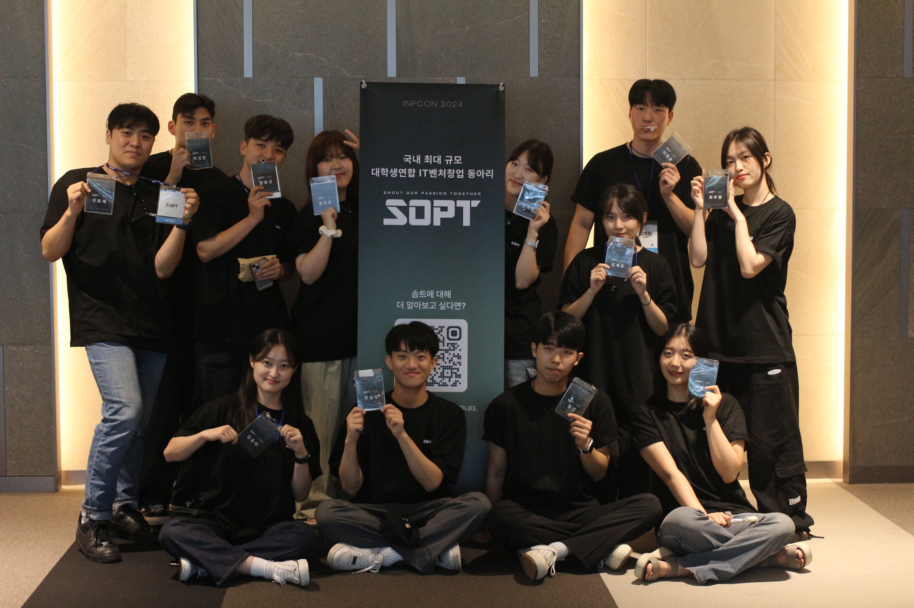 |  |
| ------------------- | ------------------- |

**SOPT(솝트)는 국내 최대 규모의 대학생연합 IT벤처창업 동아리로**, IT창업 및 기획/디자인/개발에 관심있는 대학생들이 함께 모여 활동하고 있다.

2008년부터 지난 17년 간 3,300명이 넘는 회원이 300개가 넘는 서비스를 만들정도로 탄탄한 동아리다.

세미나, 스터디, 멘토링, 컨퍼런스, 해커톤, 네트워킹 등 모든 행사를 직접 기획해 진행하며 대학생들의 열정을 함께 외치며 도전하는 커뮤니티니 이런 니즈가 있으신 분들 지원해보면 좋을 것 같다!

간혹 SOPT 분들과 같이 운동하고, 대외활동에서 만나고 있는데 정말 열정 가득하시다!! 대학생이면 꼭 해보는 것을 추천한다!! ~~나도 하고싶다.. 진짜 하고싶다.. 몇년만 어렸어도 흑흑.. 😢~~

<br>

### SSAFYnity

|  | 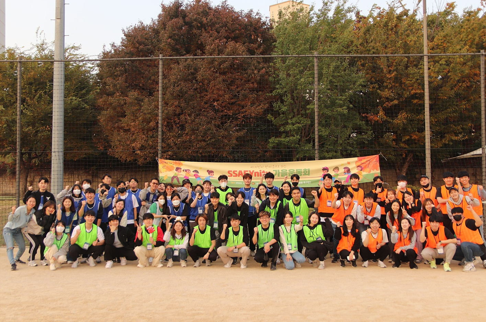 |
| ----------------- | ----------------- |

**SSAFYnity는 삼성청년SW아카데미(SSAFY) 동문회다.**

SSAFYnity는 분기별로 싸피인의밤, SSAFYnale 기술컨퍼런스, 가을 체육대회, SSAFYnity 세미나 등 다양한 행사를 진행하고 있다. 그뿐만 아니라 다양한 동아리 활동, MT 등 커뮤니티 활동도 진행하고 있다.

저번 유닛에서 주관하는 해커톤에 SSAFY를 진행하고 있는 동생과 해커톤을 즐겁게 한 기억이 있다.

<br>

### YAPP

| 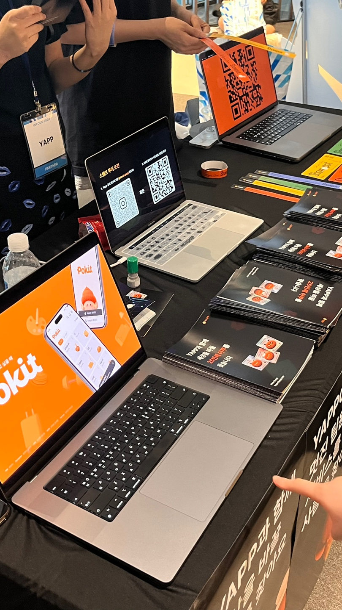 | 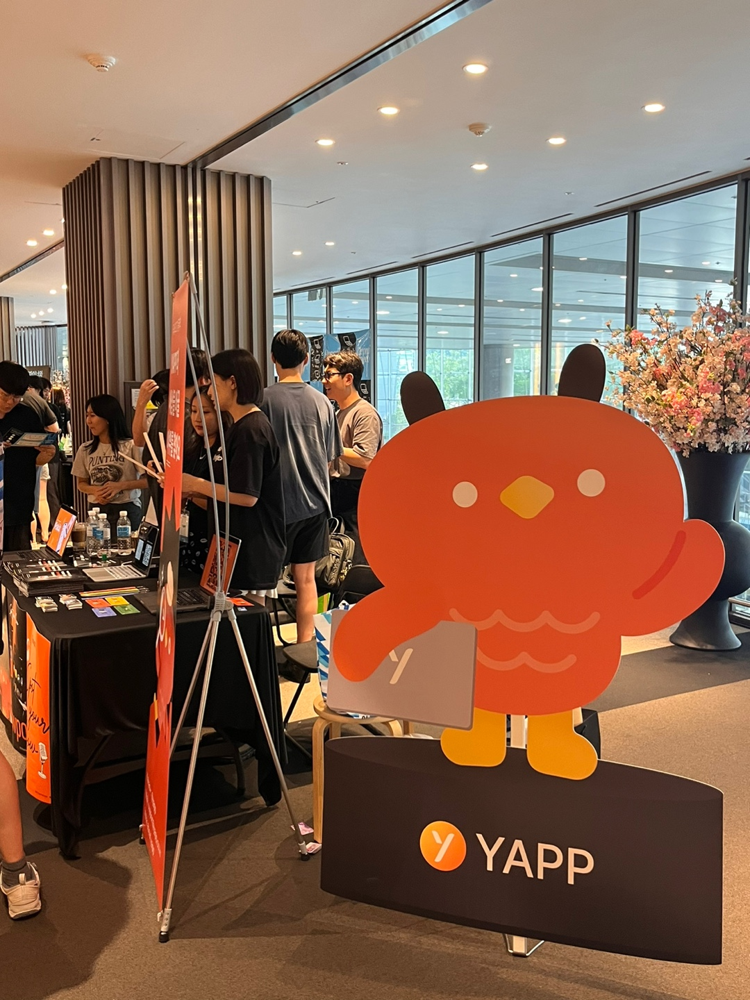 | 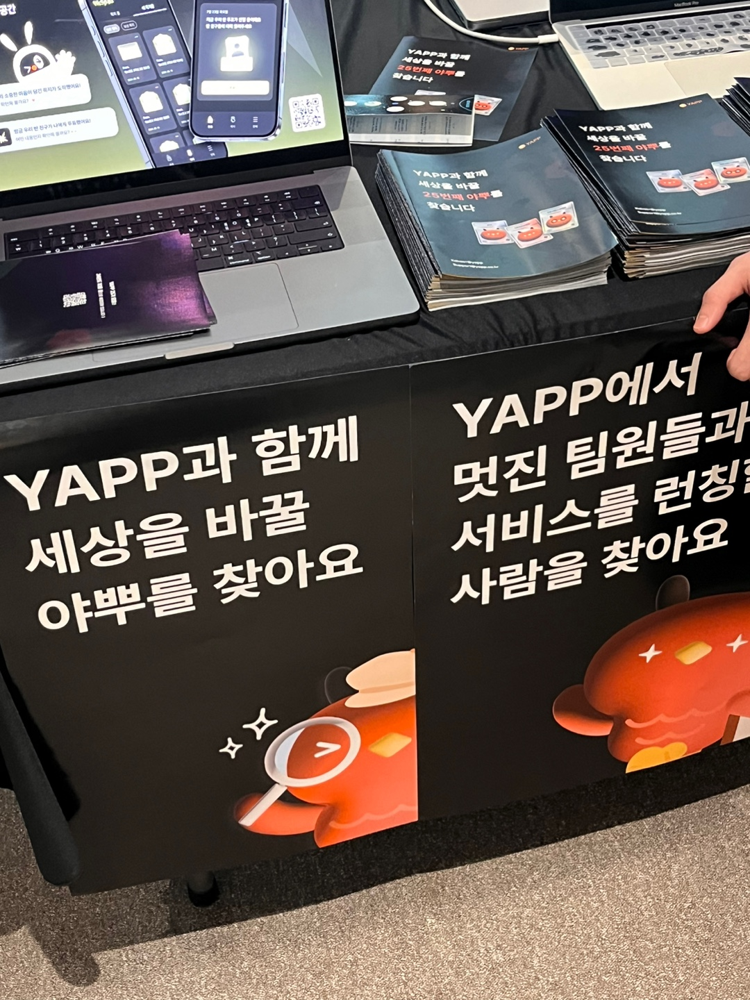 |
| ------------------- | ------------------- | ------------------- |

YAPP은 14년간의 역사를 자랑하는 400명 이상의 IT 인재 커뮤니티로, **"작은 아이디어로 세상에 변화를 이끈다"는** 목표 아래 도전의 기회와 성장의 환경을 제공하며, 프로덕트 기획부터 창업 지원까지 다양한 활동을 통해 차세대 IT 리더와 혁신가를 양성하는 커뮤니티다.

매번 멋진 서비스를 만들어내는 YAPP도 관심이 많다!! 유니톤에서 인연을 맺은 준수님께서 YAPP에서 음악 관련 서비스를 만들고 있던데 정말 멋지다!! YAPP에서 만든 여비도 사용해보았는데 정말 잘만들었으니 꼭꼭 사용해보길!!

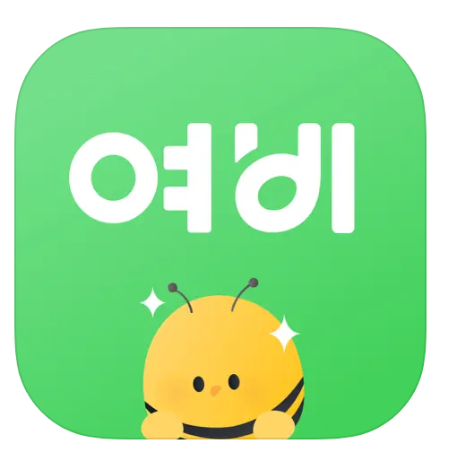

~~계획한 일 잘 정리하고 지원해볼 예정이다! ~~

<br>

## 마무리

| 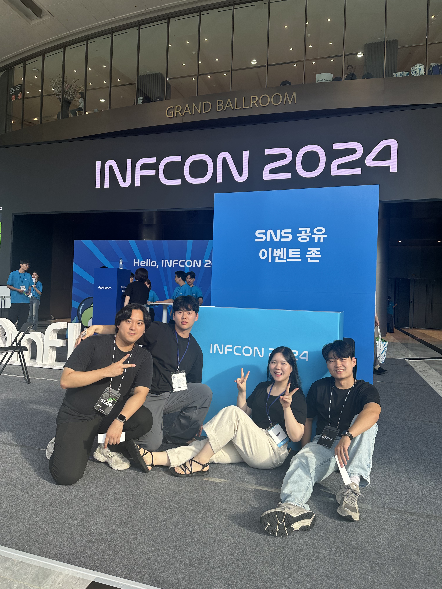 | 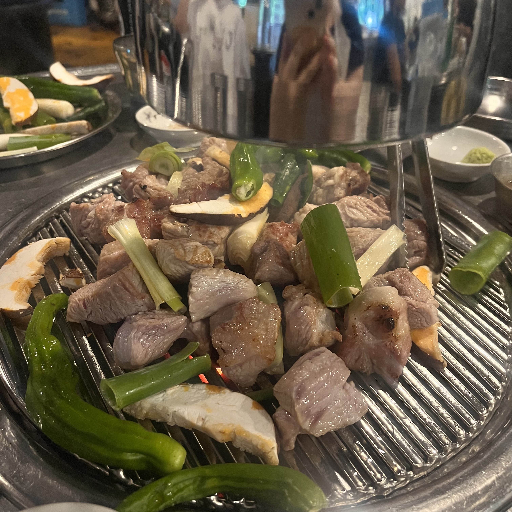 |
| ----------------- | ----------------- |

이렇게 인프콘이 마무리되었다! 아주 힘든 시간이었다! 감사한 분들 덕분에, 좋은 경험을 할 수 있었다.

먼저 인프콘에 참가할 기회를 주신 인프랩 다시 한번 감사드립니다. SIPE 2기의 인프콘 참여를 위해 후원해주신 분께도 너무 감사드립니다.

이렇게 SIPE 2기도 마무리되었다. 행사에 참여하지 못했지만, 진행을 위해 고생 많이 한 **성민님, 민준님 정말 감사합니다!!!** 그리고 당일에 힘 많이 쓴 **진욱님, 신원님, 지원님 고생 많으셨고 감사합니다!!** 놀러 와서 일하게 된 **미진님, 미진님 동생분도 정말 감사드립니다!!!!**

행사를 위해 많은 조언과 지원을 해주신 **유닛 감사합니다!**

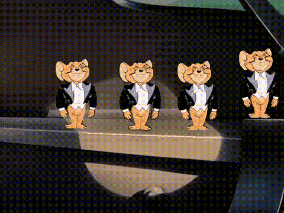

<br>

좋은 분들 덕분에 많은 경험을 하고, 좋은 세션과 네트워킹 때문에 많은 것을 배운 하루였다. 동아리에서 작은 행사만 해보아서, 어느 정도로 인프랩 직원분들과 봉사하시는 분들께서 힘들셨을 지 감이 오지 않지만, 다시 한번 고생 많으셨고 감사하단 말씀 드리고 싶다.

인프랩의 오픈 세션에서 **이형주님, 이동욱님, 홍연의님**의 발표에서 말씀하신 것처럼 매년 성장을 위해 노력하시는 것이 정말 잘 보이는 행사였다. 인프랩의 앞으로가 정말 기대된다.

<br>


<br>

지금까지 인프콘에서 800개의 부채를 나눠준 부채왕이었다! Thank you~!!

```toc

```
