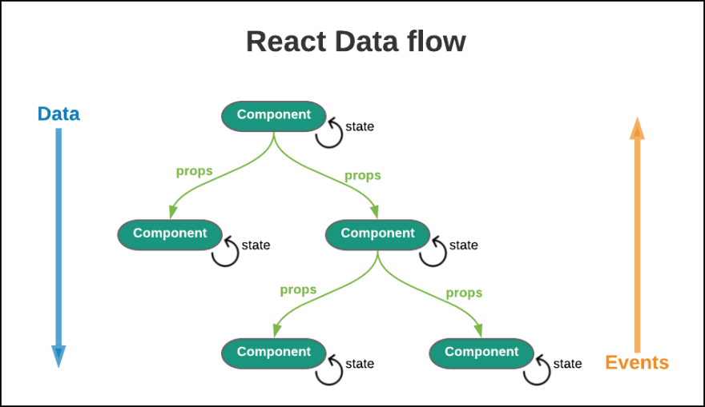
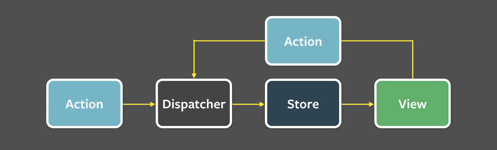

이번 포스팅에서는 Zustand가 어떻게 Provider 없이 상태관리를 해내는지에 대한 이야기를 해보려고 한다.

필자는 Zustand를 사용하면서 늘 당연하게 Provider 없이 상태를 관리해왔다. 그러다 문득 이런 생각이 들었다. React 생태계의 대부분의 라이브러리는 Provider로 앱을 감싸는 것이 거의 의식처럼 굳어져 있다. TanStack React Query는 `QueryClientProvider`로 감싸야 `useQuery`를 쓸 수 있고, toss의 overlay-kit도 `OverlayProvider` 없이는 `overlay.open()`을 호출할 수 없다. React의 Context API 역시 반드시 Provider로 컴포넌트 트리를 감싸야 한다. 그런데 Zustand는 대체 어떤 마법을 부리기에 그런 과정이 필요 없는 걸까?

궁금해서 Zustand의 소스 코드를 직접 뜯어보았고, 생각보다 흥미로운 구조가 숨어있었다. 그 과정에서 알게 된 내용을 정리해보려 한다.

<hr>

## React에서 상태는 어떻게 흘러가는가

일반적인 React 애플리케이션에서 상태는 아래 그림처럼 동작한다.



컴포넌트 내부 상태는 React가 제공하는 상태 관리 훅(`useState`, `useReducer`)을 사용하여 관리한다. 그리고 하위 컴포넌트로의 상태 전달은 props를 통해 이루어진다. 여기까지는 단순한 이야기이다.

문제는 멀리 떨어진 컴포넌트 간에 상태를 공유해야 할 때 발생한다. 이때 React가 제공하는 공식적인 해법이 바로 Context API인데, 이 녀석은 반드시 Provider 컴포넌트로 하위 트리를 감싸야 한다.

<hr>

### 왜 Context API는 Provider가 필요할까?

이 질문에 답하려면 React의 내부 동작을 조금 들여다봐야 한다.

React는 컴포넌트 트리를 Fiber라는 내부 자료구조로 관리한다. 각 Fiber 노드는 부모-자식 관계로 연결되어 있고, Context의 값이 변경되면 React는 이 Fiber 트리를 위에서 아래로 순회하면서 해당 Context를 구독하는 컴포넌트를 찾아 리렌더링을 트리거한다.

핵심은 이것이다. **Context의 값 전파는 Fiber 트리의 구조에 의존한다.** Provider가 트리의 어느 지점에 위치하느냐에 따라 값이 전달되는 범위가 결정되고, `useContext`를 호출한 컴포넌트는 자신의 상위 Fiber 트리를 거슬러 올라가며 가장 가까운 Provider를 찾는다. Provider가 없으면? `createContext`에 전달한 기본값이 사용될 뿐이다.

즉, Context API는 React의 렌더링 시스템과 긴밀하게 결합되어 있다. 상태의 저장, 전파, 구독 모두가 React의 컴포넌트 트리 내부에서 일어나는 것이다.

그렇다면 Zustand는 이 구조를 어떻게 우회하는 걸까?

<hr>

## Zustand는 React 바깥에 산다



Zustand는 Flux 패턴을 기반으로 동작한다. 클로저 내부의 `state`가 Store 역할을, 사용자 정의 함수들이 Action 역할을, `set` 함수가 Dispatcher 역할을, React 컴포넌트가 View 역할을 수행한다. 여기서 결정적인 차이가 있다. 

**Zustand의 스토어는 React 컴포넌트 트리 외부, JavaScript 모듈의 스코프 내에 존재한다.**

컴포넌트 트리 외부라는 것의 의미는 React 내부의 상태관리와 달리, Zustand에서 자주 언급되는 "컴포넌트 트리 외부"라는 표현은 상태가 React의 Fiber 트리와 무관하게 독립적으로 존재한다는 뜻이다. 어떤 컴포넌트든 `import`만 하면 스토어에 접근할 수 있고, Provider로 앱을 감쌀 필요가 없다. (마치 전역 변수처럼 어디서든 접근 가능하되, 클로저로 잘 보호되어 있는 셈이다.)

어떻게 이렇게 가능할까? 아래 코드를 살펴보자.

```typescript
import { create } from 'zustand';

const useStore = create((set) => ({
  count: 0,
  increment: () => set((state) => ({ count: state.count + 1 })),
}));
```

이 코드에서 `create`가 호출되는 시점은 모듈이 로드될 때이다. 즉, React가 렌더링을 시작하기도 전에 스토어는 이미 메모리에 존재하게 된다. 이것이 **모듈 레벨 싱글톤(Module-level Singleton) 패턴**이다.

<hr>

### 모듈 레벨 싱글톤이란?

JavaScript의 ES 모듈 시스템은 **모듈을 최초 한 번만 평가(evaluate)하고, 그 결과를 캐싱**한다. 이후 어디서든 같은 모듈을 `import`하면 새로 실행하는 것이 아니라 캐싱된 동일한 객체를 반환한다. 즉, `import { useStore } from './store'`를 컴포넌트 A에서 하든 컴포넌트 B에서 하든, 둘 다 **정확히 같은 스토어 인스턴스**를 참조하게 된다.

별도의 싱글톤 클래스를 구현하거나, 전역 변수(`window.store`)에 매달 필요가 없다. 모듈 시스템 자체가 "한 번만 생성되고 어디서든 같은 인스턴스에 접근한다"는 싱글톤의 조건을 자연스럽게 충족해주는 것이다. Zustand는 이 언어 레벨의 보장을 그대로 활용하여, 별도의 Provider 없이도 모든 컴포넌트가 하나의 스토어를 공유할 수 있게 설계한 것이다.

여기까지 읽으면 자연스럽게 떠오르는 질문이 하나 있다. 그래서 Zustand의 내부는 구체적으로 어떻게 생겼을까?

<hr>

## Zustand 내부 구조

[Zustand의 GitHub 저장소](https://github.com/pmndrs/zustand/tree/main/src)를 들여다보면, 핵심 로직은 놀라울 정도로 간결하다. 크게 두 개의 파일이 핵심인데, `vanilla.ts`가 스토어의 본체를, `react.ts`가 React와의 연결 고리를 담당한다.

<hr>

### vanilla.ts

[vanilla.ts](https://github.com/pmndrs/zustand/blob/main/src/vanilla.ts)는 Zustand의 심장부이다. 스토어가 어떻게 생성되고, 상태가 어떻게 관리되는지 이 파일 하나에 모두 담겨있다. 더 쉽게 말해, 클로저에 갇힌 상태와 그 상태를 조작하는 함수들이 이 파일에 정의되어 있다.

```typescript
const createStoreImpl: CreateStoreImpl = (createState) => {
  type TState = ReturnType<typeof createState>
  type Listener = (state: TState, prevState: TState) => void
  let state: TState
  const listeners: Set<Listener> = new Set()

  const setState: StoreApi<TState>['setState'] = (partial, replace) => {
    const nextState =
      typeof partial === 'function'
        ? (partial as (state: TState) => TState)(state)
        : partial
    if (!Object.is(nextState, state)) {
      const previousState = state
      state =
        (replace ?? (typeof nextState !== 'object' || nextState === null))
          ? (nextState as TState)
          : Object.assign({}, state, nextState)
      listeners.forEach((listener) => listener(state, previousState))
    }
  }

  const getState: StoreApi<TState>['getState'] = () => state

  const getInitialState: StoreApi<TState>['getInitialState'] = () =>
    initialState

  const subscribe: StoreApi<TState>['subscribe'] = (listener) => {
    listeners.add(listener)
    return () => listeners.delete(listener)
  }

  const api = { setState, getState, getInitialState, subscribe }
  const initialState = (state = createState(setState, getState, api))
  return api as any
}
```

이 코드를 한 줄 한 줄 뜯어보면 Zustand의 핵심 메커니즘이 드러난다.

- **클로저를 통한 상태 캡슐화**

  - `let state: TState`라는 변수가 `createStoreImpl` 함수의 지역 변수로 선언되어 있다. 이 변수는 함수 실행이 끝난 후에도 `setState`, `getState` 등의 내부 함수가 참조하고 있기 때문에 가비지 컬렉션되지 않는다. 이것이 클로저의 본질이다.

  - 외부에서는 `state` 변수에 직접 접근할 방법이 없다. 오로지 `getState()`로 읽고, `setState()`로 쓸 수 있을 뿐이다. (객체지향에서 말하는 private 필드를 클로저로 구현한 셈이다.)

- **`Object.is`를 활용한 변경 감지**

  - `setState`는 새로운 상태를 계산한 뒤, `Object.is(nextState, state)`로 기존 상태와 비교한다. 참조가 동일하면 아무 일도 일어나지 않는다. 이것이 불필요한 리렌더링을 방지하는 첫 번째 방어선이다.

  - 그런데 이 `Object.is` 비교는 **엄격한 참조 동등성(strict reference equality)** 검사이기 때문에, 사용하는 쪽에서 주의해야 할 지점이 있다. 원시값(숫자, 문자열 등)을 하나만 꺼내 쓸 때는 문제가 없다.

    ```typescript
    const count = useStore((state) => state.count);
    ```

    하지만 selector가 **새로운 객체를 반환**하면 이야기가 달라진다.

    ```typescript
    const { count, name } = useStore((state) => ({
      count: state.count,
      name: state.name,
    }));
    ```

    `{ count, name }` 객체는 값이 동일하더라도 호출할 때마다 새로운 참조가 만들어진다. `Object.is`는 내부 프로퍼티를 비교하지 않고 참조만 비교하므로, Zustand 입장에서는 "상태가 바뀌었다"고 판단하여 매번 리렌더링을 트리거하게 된다.

    이 문제를 해결하기 위해 Zustand는 **`useShallow`** 훅을 제공한다.

    ```typescript
    import { useShallow } from 'zustand/react/shallow';

    const { count, name } = useStore(
      useShallow((state) => ({ count: state.count, name: state.name }))
    );
    ```

    `useShallow`는 반환된 객체의 **최상위 프로퍼티들을 하나씩 비교**하여, 실제로 값이 변한 경우에만 리렌더링을 발생시킨다. Redux의 `useSelector`가 기본적으로 참조 비교를 사용하되 `shallowEqual`을 두 번째 인자로 넘길 수 있는 것과 비슷한 맥락이다. (다만 `useShallow`는 이름 그대로 "얕은" 비교이므로, 중첩된 객체의 내부까지는 추적하지 않는다는 점을 기억해두자.)

- **Pub/Sub 패턴의 리스너 시스템**

  - `const listeners: Set<Listener> = new Set()`라는 한 줄이 Zustand의 구독 시스템 전체이다. 상태가 변경되면 `listeners.forEach`로 모든 구독자에게 알림을 보낸다. 
  - `subscribe`를 호출하면 리스너가 `Set`에 추가되고, 반환된 함수를 호출하면 `Set`에서 제거된다.
  - 이 패턴이 중요한 이유는, **React의 Fiber 트리와 완전히 독립적인 알림 시스템**이기 때문이다. Provider가 트리를 순회하며 구독자를 찾는 방식이 아니라, 스토어가 직접 구독자 목록을 관리하는 방식인 것이다.

- **초기 상태 생성**

  - 초기 상태를 핸들링하는 마지막 줄 코드를 살펴보자.

    ```typescript
    const initialState = (state = createState(setState, getState, api))
    ```
    
    한 줄에 많은 것이 압축되어 있다. JavaScript에서 할당 연산자(`=`)는 **할당된 값 자체를 반환**하는 표현식(expression)이다. 즉, 괄호 안의 `state = createState(...)` 가 먼저 실행되어 `state`에 초기 상태가 할당되고, 그 반환값이 다시 `const initialState`에 할당된다. 결과적으로 `state`와 `initialState`가 **동일한 객체를 참조**하게 되는 것이다.

    그런데 왜 같은 값을 굳이 두 변수에 나눠 담는 걸까? 핵심은 두 변수의 역할이 다르다는 점이다.

    - **`state`** 는 `let`으로 선언된 변수이다. `setState`가 호출될 때마다 새로운 값으로 교체된다. 즉 **현재 시점의 살아있는 상태**를 나타낸다.
    - **`initialState`** 는 `const`로 선언된 변수이다. 스토어가 생성된 시점의 상태가 영구히 보존된다. 이후 어떤 `setState`가 호출되더라도 이 값은 변하지 않는다. **스토어의 최초 스냅샷**인 셈이다.

    이 `initialState`는 `getInitialState()` 메서드를 통해 외부에 노출되고, `react.ts`에서 `useSyncExternalStore`의 **세 번째 인자(서버 스냅샷)** 로 전달된다.

    ```typescript
    const slice = React.useSyncExternalStore(
      api.subscribe,
      () => selector(api.getState()),       
      () => selector(api.getInitialState()), 
    )
    ```

    서버 사이드 렌더링(SSR) 환경에서는 브라우저 API가 없고, 사용자 인터랙션도 없으므로 `setState`가 호출될 일이 없다. 따라서 서버에서는 항상 `initialState`(= 최초 상태)가 스냅샷으로 사용된다. 클라이언트에서 hydration이 시작될 때, React는 서버에서 렌더링한 HTML과 클라이언트의 초기 렌더링 결과를 비교하는데, 양쪽 모두 동일한 `initialState`를 기준으로 렌더링했기 때문에 **hydration 불일치를 방지**할 수 있는 것이다.

<hr>

### react.ts

[react.ts](https://github.com/pmndrs/zustand/blob/main/src/react.ts)는 위에서 만든 순수 JavaScript 스토어를 React의 렌더링 시스템에 연결하는 역할을 한다.

```typescript
export function useStore<TState, StateSlice>(
  api: ReadonlyStoreApi<TState>,
  selector: (state: TState) => StateSlice = identity as any,
) {
  const slice = React.useSyncExternalStore(
    api.subscribe,
    React.useCallback(() => selector(api.getState()), [api, selector]),
    React.useCallback(() => selector(api.getInitialState()), [api, selector]),
  )
  React.useDebugValue(slice)
  return slice
}
```

여기서 핵심은 `useSyncExternalStore`이다. 이 훅은 React 18에서 도입된 것으로, **React 외부에 존재하는 상태 저장소를 React의 렌더링 사이클에 안전하게 통합**하기 위해 설계되었다.

`useSyncExternalStore`가 받는 세 가지 인자를 살펴보면 구조가 명확해진다. (앞서 vanilla.ts 에서 다룬 내용과 거의 비슷하다)

- **`api.subscribe`**: 스토어의 변경을 구독하는 함수이다. React는 이 함수를 통해 "상태가 바뀌면 알려달라"고 요청한다.
- **`() => selector(api.getState())`**: 현재 상태의 스냅샷을 반환한다. React는 렌더링할 때마다 이 함수를 호출하여 최신 상태를 가져온다.
- **`() => selector(api.getInitialState())`**: 서버 사이드 렌더링 시 사용할 초기 스냅샷이다. hydration 과정에서 서버와 클라이언트의 상태 불일치를 방지한다.

특히 `useSyncExternalStore`는 React의 동시성 모드(Concurrent Mode)에서 발생할 수 있는 **tearing 문제**를 해결한다. Tearing이란 같은 렌더 패스 안에서 서로 다른 컴포넌트가 **동일한 데이터 소스의 서로 다른 스냅샷**을 보여주는 현상이다.

구체적인 시나리오를 보면 이해가 쉽다. 컴포넌트 A가 `store.value`(= 10)를 읽고 렌더링을 시작한다. 이때 React가 동시성 모드에서 렌더링을 **일시 중단(yield)** 하고 브라우저에게 제어권을 넘긴다. 그 틈에 WebSocket 메시지가 도착하여 `store.value`가 11로 변경된다. React가 렌더링을 재개하면서 컴포넌트 B가 `store.value`(= 11)를 읽는다. 결과적으로 같은 프레임에 A는 10을, B는 11을 보여주는 **찢어진(teared) UI**가 만들어지는 것이다. React 18 이전에는 렌더링이 항상 동기적이었기 때문에 이 문제가 발생하지 않았다.

`useSyncExternalStore`는 렌더링 시작 시점의 스냅샷(`getSnapshot`)을 기록해 두고, 렌더링 도중 외부 스토어가 변경되어 스냅샷이 달라지면 이를 감지하여 **렌더링을 처음부터 다시 시작**한다. 이를 통해 모든 컴포넌트가 동일한 스냅샷을 기반으로 렌더링되는 것을 보장하는 것이다.

그리고 `createImpl` 함수가 이 모든 것을 하나로 묶는다.

```typescript
const createImpl = <T>(createState: StateCreator<T, [], []>) => {
  const api = createStore(createState)
  const useBoundStore: any = (selector?: any) => useStore(api, selector)
  Object.assign(useBoundStore, api)
  return useBoundStore
}
```

`createStore`로 vanilla 스토어를 생성하고, `useBoundStore`라는 커스텀 훅으로 감싼 뒤, `Object.assign`으로 스토어 API의 메서드들(`setState`, `getState`, `subscribe` 등)을 훅 함수 자체에 붙여버린다. 그 결과 반환되는 `useBoundStore`는 **React 훅이면서 동시에 스토어 API**라는 이중적인 성격을 가지게 된다. (함수인데 메서드도 있는, 꽤나 JavaScript스러운 패턴이다.)

<hr>

## 다른 상태관리 라이브러리는 어떨까?

여기까지 이해했다면 자연스럽게 다른 라이브러리들과 비교해보고 싶어질 것이다.

Jotai, Recoil, MobX, Xstate, Redux 등 다양한 상태관리 라이브러리가 존재하겠지만, 필자가 직접 사용해본 라이브러리 위주로 비교해보려고 한다.

> 참고로, Jotai와 자주 비교되던 **Recoil**(Meta)은 2025년 1월 저장소가 아카이브되면서 사실상 개발이 중단되었다. React 19 지원도 이루어지지 않은 상태이다. 원자적 상태 모델을 원한다면 현시점에서는 Jotai가 유일한 현실적 선택지라고 할 수 있다.

<hr>

### Redux

Redux도 내부적으로는 모듈 레벨의 스토어를 사용한다. 그런데 왜 Provider가 필요할까?

Redux의 `<Provider store={store}>`는 React Context를 통해 스토어 인스턴스를 컴포넌트 트리에 **주입(inject)** 한다. `useSelector`나 `useDispatch`는 내부적으로 `useContext`를 호출하여 Provider가 제공하는 스토어에 접근하는 구조이다. 여기서 중요한 점은, Redux가 Context를 **상태 전파 채널이 아니라 의존성 주입(Dependency Injection) 수단**으로 사용한다는 것이다. Context를 통해 전달되는 것은 상태 값 자체가 아니라 상태를 관리하는 **스토어 객체의 참조**이다. 실제 상태 구독과 업데이트는 스토어 내부의 Pub/Sub으로 처리된다.

이 설계가 가져다주는 이점은 명확하다. 테스트 시 다른 스토어 인스턴스를 Provider로 감싸면 완벽한 격리가 되고, 하나의 앱에서 `context` prop을 통해 여러 독립적인 스토어 트리를 구성할 수도 있다. Mark Erikson(Redux 메인테이너)이 강조하듯, "Context는 전송 메커니즘(transport mechanism)이지 상태 관리 도구가 아니다."

<hr>

### Jotai

Jotai는 Redux나 Zustand와 근본적으로 다른 **원자적(atomic) 상태 모델**을 채택한다. 하나의 큰 스토어 객체에 상태를 모아두는 것이 아니라, **각각의 상태 조각을 독립적인 atom으로 분리**하는 접근이다. (Jotai 공식 문서에서도 "Zustand가 Redux와 유사하다면, Jotai는 Recoil과 유사하다"고 설명한다.)

이 구조의 핵심 차이는 **렌더링 최적화 방식**에 있다. Zustand는 하나의 스토어에서 selector를 통해 필요한 부분만 추출하는 **하향식(top-down)** 접근이다. 개발자가 `useStore((state) => state.count)`처럼 selector를 직접 작성해야 하고, 참조 동일성(referential equality)을 유지하기 위해 때로는 메모이제이션이 필요하다. 반면 Jotai는 atom 간의 **의존성 그래프(dependency graph)** 를 자동으로 구축하여, 특정 atom이 변경되면 그 atom에 의존하는 컴포넌트만 정확히 리렌더링하는 **상향식(bottom-up)** 전파를 수행한다. 스프레드시트나 캔버스 에디터처럼 수십 개의 상태가 서로 얽혀 있는 경우에 이 자동 의존성 추적이 큰 힘을 발휘한다.

Provider 측면에서 Jotai는 흥미로운 중간 지점에 위치한다. 기본적으로 전역 스토어를 사용하여 Provider 없이 동작하지만, 필요하다면 `<Provider>`로 감싸서 격리된 스토어 스코프를 만들 수 있다. Jotai 공식 문서의 표현을 빌리면, Jotai는 **"context first, module second"** 이고, Zustand는 **"module first, context second"** 인 것이다.

<hr>

### Zustand의 선택

Zustand는 가장 급진적인 선택을 했다. 기본적으로 모듈 레벨 싱글톤이며, Provider가 아예 없다. 이 선택이 가져다주는 것은 **극도로 단순한 API**이다. `create`로 스토어를 만들고, 컴포넌트에서 훅을 호출하면 끝이다.

다만 "Provider가 아예 없다"는 말은 정확히는 **기본 설계**에 대한 이야기이다. v4부터는 `createStore`(vanilla 스토어)와 React의 `createContext`를 조합하여 **스코프드 스토어(Scoped Store)** 패턴을 구현할 수 있다.

[TkDodo(React Query 메인테이너)의 블로그](https://tkdodo.eu/blog/zustand-and-react-context)에서 이 패턴을 깊이 있게 다루고 있는데, 그가 제시하는 핵심 논지는 이렇다. 전역 싱글톤 스토어에는 세 가지 한계가 있다.

- **Props로 초기화할 수 없다** : 모듈 로드 시점에 스토어가 생성되므로, 서버에서 내려온 데이터나 부모 컴포넌트의 props를 초기값으로 넣을 방법이 없다.
- **테스트 격리가 어렵다** : 테스트마다 스토어를 수동으로 리셋해야 한다.
- **재사용이 불가능하다** : 같은 구조의 스토어가 필요한 컴포넌트를 페이지에 두 개 렌더링하면, 둘이 상태를 공유해버린다.

이 세 가지를 모두 해결하는 것이 스코프드 스토어 패턴이다. 핵심 아이디어는 **Context로 상태 값을 전달하는 것이 아니라, 스토어 인스턴스의 참조를 전달**하는 것이다. (Redux의 Provider가 하는 일과 정확히 같은 구조이다.)

구체적인 구현을 보면 이렇다.

```typescript
import { createStore, useStore } from 'zustand';
import { createContext, useContext, useState } from 'react';

// 1. 스토어 팩토리 함수 — props를 받아 스토어를 생성
const createSelectionStore = (initialItems: string[]) =>
  createStore<SelectionState>((set) => ({
    items: initialItems,
    selected: new Set<string>(),
    toggle: (id) =>
      set((state) => {
        const next = new Set(state.selected);
        next.has(id) ? next.delete(id) : next.add(id);
        return { selected: next };
      }),
  }));

// 2. Context 생성
type SelectionStore = ReturnType<typeof createSelectionStore>;
const SelectionContext = createContext<SelectionStore | null>(null);

// 3. Provider — useState로 스토어를 한 번만 생성
const SelectionProvider = ({
  children,
  initialItems,
}: {
  children: React.ReactNode;
  initialItems: string[];
}) => {
  const [store] = useState(() => createSelectionStore(initialItems));
  return (
    <SelectionContext.Provider value={store}>
      {children}
    </SelectionContext.Provider>
  );
};

// 4. 커스텀 훅 — Context에서 스토어를 꺼내 useStore로 구독
const useSelectionStore = <T,>(selector: (state: SelectionState) => T) => {
  const store = useContext(SelectionContext);
  if (!store) throw new Error('SelectionProvider가 필요합니다');
  return useStore(store, selector);
};
```

이제 같은 페이지에 독립적인 멀티셀렉트 컴포넌트를 원하는 만큼 렌더링할 수 있다.

```tsx
// 각 SelectionProvider가 자신만의 스토어 인스턴스를 가진다
<SelectionProvider initialItems={['A', 'B', 'C']}>
  <MultiSelect />
</SelectionProvider>

<SelectionProvider initialItems={['X', 'Y', 'Z']}>
  <MultiSelect />  {/* 위 컴포넌트와 상태가 완전히 독립 */}
</SelectionProvider>
```

여기서 주목할 점은, Context를 통해 전달되는 것이 **상태 값이 아니라 스토어 객체**라는 것이다. 상태 값이 변경되어도 Context의 `value`(= 스토어 참조)는 바뀌지 않으므로, **Context의 값 변경으로 인한 불필요한 리렌더링이 발생하지 않는다.** 실제 리렌더링은 `useStore` 내부의 `useSyncExternalStore`가 selector 기반으로 처리한다. Context의 전송 역할과 Zustand의 구독 역할이 깔끔하게 분리되는 것이다.

TkDodo는 디자인 시스템의 멀티셀렉트 컴포넌트에서 이 패턴을 실제로 적용한 사례를 소개했다. 기존에 `useState` + Context로 내부 상태를 관리하던 구조가 50개 이상의 항목에서 성능 저하를 보였고, Zustand의 selector 기반 구독으로 전환하여 해결했다고 한다.

이 패턴은 v3에서 `zustand/context`로 제공되던 `createContext` 헬퍼가 v4에서 제거된 이후, **React의 네이티브 `createContext` + Zustand의 `createStore`/`useStore`를 직접 조합하는 방식**으로 정착했다. v5에서도 이 API는 그대로 유지되고 있으며, [Zustand 공식 문서](https://github.com/pmndrs/zustand/blob/main/docs/previous-versions/zustand-v3-create-context.md)에서도 v4+ 마이그레이션 가이드로 이 패턴을 안내하고 있다.

<hr>

## ProviderLess의 그림자

물론 Provider가 없다는 것이 장점만 있는 것은 아니다. 필자가 생각하는 주의해야 할 지점들을 정리해보겠다.

<hr>

### SSR에서의 상태 공유 문제

모듈 레벨 싱글톤은 서버 환경에서 위험할 수 있다. Node.js 서버는 여러 요청을 하나의 프로세스에서 처리하는데, 모듈은 프로세스 내에서 한 번만 로드된다. 이는 서로 다른 사용자의 요청이 **같은 스토어 인스턴스를 공유**할 수 있다는 뜻이다.

Zustand가 `getInitialState`를 제공하고 `useSyncExternalStore`의 세 번째 인자로 서버 스냅샷을 넘기는 이유가 여기에 있다. 하지만 이것만으로는 요청 간 상태 격리가 완벽하지 않을 수 있어, SSR 환경에서는 앞서 언급한 스코프드 스토어 패턴(`createStore` + React Context)을 활용하여 요청마다 새로운 스토어를 생성하는 것이 권장된다.

<hr>

### 테스트 격리의 어려움

Provider 기반 라이브러리는 테스트마다 다른 Provider로 감싸면 스토어가 자연스럽게 격리된다. 반면 Zustand의 모듈 레벨 싱글톤은 테스트 간에 상태가 누수될 수 있다. 각 테스트의 `beforeEach`에서 스토어를 명시적으로 리셋해야 하는 것이다. (필자도 이 문제로 한 번 고생한 적이 있다.)

```typescript
// 테스트 파일에서의 스토어 리셋 예시
beforeEach(() => {
  useStore.setState(useStore.getInitialState());
});
```

여기서도 스코프드 스토어 패턴이 해결책이 된다. Provider로 감싸는 방식이라면 각 테스트에서 새로운 스토어를 생성하여 주입하면 되므로, 리셋 로직 없이 완벽한 격리가 가능하다.

<hr>

### 다중 인스턴스의 부재

하나의 애플리케이션에서 같은 구조의 독립적인 스토어 두 개가 필요한 경우, Provider 패턴이라면 각각 다른 Provider로 감싸면 된다. 하지만 모듈 레벨 싱글톤에서는 스토어 생성 함수를 별도로 호출하여 서로 다른 스토어 인스턴스를 만들어야 한다. 예를 들어, 같은 페이지에 독립적인 탭 패널 두 개가 있고 각각의 선택 상태를 별도로 관리해야 한다면, 전역 싱글톤으로는 자연스럽게 표현하기 어렵다.

이런 경우에도 `createStore` + Context 패턴이 정답이다. 각 탭 패널 컴포넌트가 자신만의 Provider를 렌더링하면, 동일한 스토어 구조를 가진 완전히 독립적인 인스턴스가 만들어진다. Zustand 공식 문서에서도 "재사용 가능한 컴포넌트에 스토어가 필요한 경우"에 이 패턴을 권장하고 있다.

## 결론

지금까지 살펴본 내용을 정리하면, Zustand의 ProviderLess 설계는 다음 네 가지 메커니즘의 조합으로 가능해진다.

- **모듈 레벨 싱글톤**: 스토어가 React 컴포넌트 트리 외부, JavaScript 모듈의 스코프 내에 생성된다.
- **클로저를 통한 상태 캡슐화**: `vanilla.ts`의 `createStoreImpl`에서 `state` 변수와 `listeners` Set이 클로저에 갇혀 외부 접근이 차단된다.
- **자체 Pub/Sub 시스템**: Fiber 트리 순회 대신 `Set<Listener>`를 직접 관리하여 상태 변경을 구독자에게 알린다.
- **`useSyncExternalStore`를 통한 React 통합**: 외부 스토어의 상태 변경을 React의 렌더링 사이클에 안전하게 동기화한다.

결국 Zustand가 던지는 질문은 이것이다. "상태가 꼭 React 안에 살아야 하는가?" Zustand의 답은 명확하다. 상태는 React 밖에 두고, 필요할 때 다리만 놓으면 된다는 것이다. 그 다리가 바로 `useSyncExternalStore`이다.

물론 이 접근 방식이 모든 상황에서 최선인 것은 아니다. SSR, 테스트 격리, 다중 인스턴스 같은 상황에서는 Provider 기반의 설계가 더 적합할 수 있다. 정답은 없지만, 각 라이브러리가 어떤 설계적 트레이드오프를 선택했는지 이해하고 있다면 상황에 맞는 도구를 고를 수 있을 것이다.

이 글을 읽는 분들도 한 번쯤 사용하고 있는 라이브러리의 소스 코드를 직접 열어보기를 권한다. 공식 문서에는 없는 깊이를 발견할 수 있을 것이다.

<hr>


### 아 그리고 새로운 소식

위 내용을 찾아보다 알게 된 사실인데, **Zustand v5.0.0이 2024년 10월에 정식 릴리스**되었다.

흥미로운 점은 v5에 새로운 기능이 거의 없다는 것이다. v4.x에서 이미 새로운 기능들을 추가하면서 기존 API를 deprecated 처리해왔고, v5는 그 **정리(cleanup) 릴리스**의 성격이 강하다. 주요 변경사항은 아래와 같다. (자세한 내용은 **[릴리즈 페이지](https://github.com/pmndrs/zustand/releases)** 와 **[마이그레이션 가이드](https://zustand.docs.pmnd.rs/reference/migrations/migrating-to-v5)** 를 참고하기 바란다.)

- **React 18, TypeScript 4.5 이상**으로 최소 요구사항이 상향되었다.
- **`getServerState`가 삭제**되었다. (`useSyncExternalStore`의 세 번째 인자로 대체)
- **ES5 지원이 중단**되었다.
- `create` 함수에서 **커스텀 equality 함수 지정이 제거**되었다.
- 반복 가능한 객체를 지원하도록 **`shallow` 함수가 개선**되었다.

v4에서 v5로 마이그레이션할 때는 먼저 v4 최신 버전으로 업데이트하는 것이 권장된다. v4 최신 버전에서 deprecation 경고가 표시되므로, 이를 먼저 해결한 뒤 v5로 올리면 무리 없이 전환할 수 있다.

<hr>

### 참고자료

:::ref
- [repo] [pmndrs/zustand 소스코드](https://github.com/pmndrs/zustand/tree/main/src)
- [docs] [React useSyncExternalStore](https://react.dev/reference/react/useSyncExternalStore)
- [article] [TkDodo, Zustand and React Context](https://tkdodo.eu/blog/zustand-and-react-context)
- [docs] [Jotai Comparison](https://jotai.org/docs/basics/comparison)
- [article] [InterBolt, Concurrent React, External Stores, and Tearing](https://interbolt.org/blog/react-ui-tearing/)
:::
