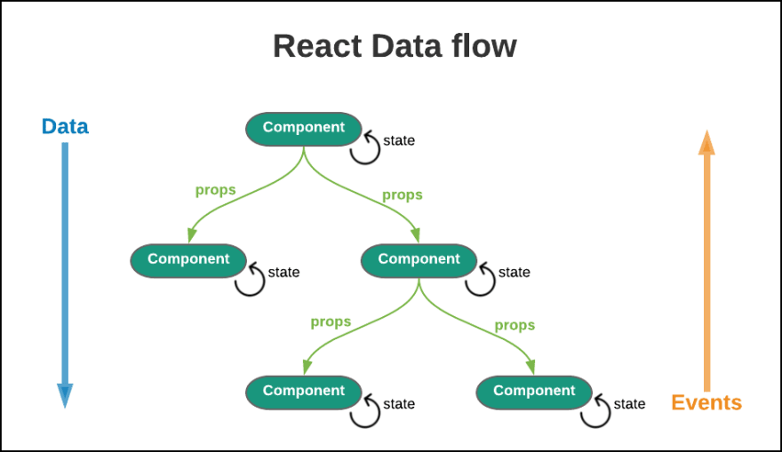

나는 Zustand가 Provider이 필요하지 않는 상태관리 라이브러리라는 것을 알고 있었다.

하지만 갑자기 생각이 들었다. **왜?? 어떻게 동작하기에 상태관리 라이브러리가 필요하지 않을까?**

<br/>


<br/>

궁금해서 찾아보다가, 좋은 내용이 많이 보여 공유해보려 한다.

<br/>

<br/>

### React 상태관리

일반적인 React 애플리케이션에서 상태는 아래 그림처럼 동작한다.



컴포넌트 내부 상태는 useState 훅을 사용하여 관리한다. 그리고 컴포넌트 트리를 통한 상태 전달은 props를 통해 하위 컴포넌트로 전달한다.

컴포넌트 외부에 상태를 전달하기 위해서 Context API를 사용하고, Provider 컴포넌트를 사용하여 하위 트리에 상태 제공하게 된다. 이러한 방식들은 모두 **"React 컴포넌트 트리 내부에서 상태를 관리"** 한다고 표현한다.

<br/>

### Zustand로 상태관리하면?


Zustand는 flux 패턴으로 동작한다.

클로저 내부의 state가 Store 역할, 사용자 정의 함수들이 Action 역할, set 함수가 Dispatcher 역할, React 컴포넌트가 View 역할을 한다.

우선 React 컴포넌트 외부에서 스토어를 생성한다. 만들어진 스토어는 JavaScript 모듈의 스코프 내에 존재한다. 그리고 **상태는 클로저를 통해 캡슐화된다.**

<br>

```typescript
import create from 'zustand';

const useStore = create((set) => ({
  count: 0,
  increment: () => set((state) => ({ count: state.count + 1 })),
}));
```

새로 생성된 Zustand의 Store은 React 컴포넌트를 정의하기 전, **모듈의 최상위 레벨에서 실행된다.**

그리고 스토어는 JavaScript 모듈의 스코프 내에 존재하며, React 렌더링 사이클과 독립적으로 동작한다.

<br>

> <h3>🙋🏻‍♂️ 컴포넌트 트리 외부</h3>
>
> - React 내부의 상태관리와 다르게 Zustand에서 자주 언급되는 **"컴포넌트 트리 외부"** 라는 표현은 상태 관리의 새로운 패러다임을 나타낸다.
>
> - Zustand를 이용해 컴포넌트 트리 외부에서 **독립적**으로 **필요할 때마다** 컴포넌트에 상태를 공급하고, 조합하고, 재사용할 수 있다. 또한 **어디서든지 접근 가능한** 전역 상태로 Provider로 앱을 감싸는 번거로움 없이 사용할 수 있다.

<br>

아직 이해가 안돼도 괜찮다! 뒤에 내용이 많이 있기에.


<br>

<br/>

<br/>

## Zustand 공식문서를 살펴보자

**[공식문서 코드](https://github.com/pmndrs/zustand/blob/main/src/react.ts)의** react.ts를 살펴보면 zustand에서 어떻게 스토어를 생성하고, 상태 접근(State Access) 및 구독(Subscription)을 할 수 있는지 선언이 되어있다.

살펴보면서 알게 된 내용인데, vanilla.ts 에서 클로저를 다룬 부분도 있다. 이것도 아래에서 같이 확인해보자!

<br/>

### 스토어 생성

```typescript
const createImpl = <T>(createState: StateCreator<T, [], []>) => {
  const api = createStore(createState);
  const useBoundStore: any = (selector?: any) => useStore(api, selector);
  Object.assign(useBoundStore, api);
  return useBoundStore;
};
```

`createStore`를 통해 생성된 api 객체는 상태와 관련 메서드를 포함하고, `useBoundStore` 함수는 `useStore` 훅을 통해 이 api에 접근한다.

`Object.assign(useBoundStore, api)`로 api의 모든 속성과 메서드를 `useBoundStore`에 할당한다.

이 구조로 인해 스토어가 React 컴포넌트 트리 외부에 존재하게 되어 컴포넌트는 `useBoundStore`를 통해 직접 상태에 접근할 수 있게되어, Provider 없이도 어느 컴포넌트에서나 스토어를 사용할 수 있다.

<br>

### 상태 접근(State Access) 및 구독(Subscription)

```typescript
export function useStore<TState, StateSlice>(
  api: ReadonlyStoreApi<TState>,
  selector: (state: TState) => StateSlice = identity as any,
) {
  const slice = useSyncExternalStore(
    api.subscribe,
    () => selector(api.getState()),
    () => selector(api.getInitialState()),
  );
  useDebugValue(slice);
  return slice;
}
```

useStore 훅은 `useSyncExternalStore`를 사용하여 외부 스토어(Zustand 스토어)와 동기화한다. 그리고 `api.subscribe`를 통해 상태 변경을 구독한다.

변경된 상태를 selector를 사용하여 필요한 상태 부분만 선택적으로 가져오는데, 서버 사이드 렌더링을 위해 `api.getInitialState()`를 사용한다.

이 방식으로 컴포넌트는 Provider 없이도 직접 스토어의 상태를 구독하고 업데이트를 받을 수 있다.

<br>

### 클로저를 통한 상태 관리

**[공식문서의 vanilla.ts](https://github.com/pmndrs/zustand/blob/main/src/vanilla.ts)의** useStore의 선언부에 대해 살펴보며 클로저를 어떻게 활용했는지 알아보자.

위에서 적은 것처럼 스토어는 모듈 스코프 내에서 생성되어, 해당 모듈을 `import`하는 모든 곳에서 접근 가능하다. 그리고 상태와 상태 변경 함수들은 클로저를 통해 캡슐화가 된다.

```typescript
const useStore = create((set) => {
  // 이 함수 내부가 클로저를 형성합니다
  let state = { count: 0 }; // 초기 상태

  return {
    getState: () => state,
    setState: (partial, replace) => {
      const nextState = typeof partial === 'function' ? partial(state) : partial;
      state = replace ? nextState : { ...state, ...nextState };
      listeners.forEach((listener) => listener(state));
    },
    subscribe: (listener) => {
      listeners.push(listener);
      return () => {
        listeners = listeners.filter((l) => l !== listener);
      };
    },
    // 사용자 정의 액션들
    increment: () => set((state) => ({ count: state.count + 1 })),
  };
});
```

위 코드를 살펴보면 `state` 변수는 클로저 내부에 캡슐화되어 있어 외부에서 직접 접근할 수 없다.

오로지 `getState`, `setState`, `subscribe` 등의 메서드들만이 이 상태에 접근하고 수정할 수 있다.

여기서 클로저의 역할은 아래 3가지가 된다.

- 상태가 클로저 내부에 있어 외부에서 직접 수정할 수 없다.
- React 컴포넌트의 리렌더링과 관계없이 상태가 유지된다.
- 필요한 상태와 메서드만 노출되어 메모리를 효율적으로 사용한다.

<br>

### React Hooks와의 통합

```typescript
import ReactExports from 'react';
const { useDebugValue, useSyncExternalStore } = ReactExports;
```

Zustand는 React의 `useSyncExternalStore` 훅을 사용하여 React의 상태 관리 시스템과 원활하게 통합된다.

이를 통해 React의 렌더링 사이클과 동기화되고, 불필요한 리렌더링을 방지하며, 동시성 모드(Concurrent Mode)와 호환된다.

<br>

## 결론


<br>

요즘 사이드 프로젝트를 진행하다보니, 왜? 라는 생각을 가지고 기술에 접근하지 못하고 코드만 작성했다.

그러다 갑자기 궁금해져서 zustand 공식문서를 살펴보았는데, 아주 재미있는 경험이었다. 위 내용을 간단히 요약해보면

Zustand의 Provider-less 설계는 아래 4가지 과정이 있기에 가능했다고 생각한다!

- React 컴포넌트 트리 외부에 스토어 생성
- 클로저를 사용하여 상태를 캡슐화
- React의 useSyncExternalStore를 활용하여 상태 변경을 효율적으로 구독
- 선택자(selector) 함수를 통해 필요한 상태만 컴포넌트에 제공

<br>

### 아 그리고 새로운 소식!!


<br>

아 그리고 위 내용을 찾아보다 알게 된 사실은 **zustand가 5버전을** 준비하고 있는 것 같다.

아직 RC이지만 현재까지 주요 변경사항은 아래와 같다. (자세한 것은 **[여기를 확인해주세요!](https://github.com/pmndrs/zustand/releases)**)

- **리엑트 18, TS 4.5 이상**으로 최소 요구사항이 변경되었다.
- **getServerState 가 삭제**되었다.
- **ES5는 지원 중단** 예정이다.
- 반복 가능한 객체로 **shallow 함수 개선**되고 있다. README와 shallow.ts파일이 계속해서 수정되고 이슈가 생기고 있다!

<br>

### 참고자료

- [zustand github](https://github.com/pmndrs/zustand/tree/main/src)

```toc

```
