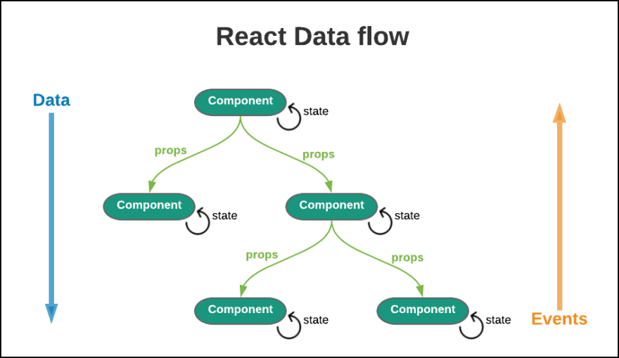
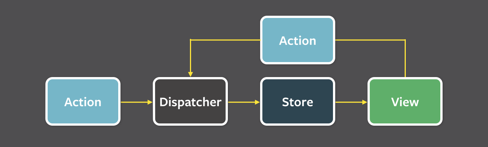

Neste post, quero falar sobre como o Zustand consegue gerenciar estado sem um Provider.

Enquanto usava Zustand, eu sempre tratei como natural gerenciar estado sem um Provider. Até que, de repente, me veio uma dúvida. Na maioria das bibliotecas do ecossistema React, envolver o app com um Provider virou quase um ritual. O TanStack React Query exige um `QueryClientProvider` para usar `useQuery`, e o overlay-kit da toss também exige um `OverlayProvider` para chamar `overlay.open()`. A Context API do React também exige que a árvore de componentes seja envolvida por um Provider. Então que tipo de mágica o Zustand faz para não precisar de nada disso?

Por curiosidade, fui examinar diretamente o código-fonte do Zustand e encontrei uma estrutura mais interessante do que esperava. Quero organizar aqui o que aprendi nesse processo.

<hr>

## Como o estado flui no React

Em uma aplicação React comum, o estado funciona como mostra a imagem abaixo.



O estado interno de um componente é gerenciado com os hooks de gerenciamento de estado fornecidos pelo React (`useState`, `useReducer`). Já o estado é passado aos componentes filhos por props. Até aqui, a história é simples.

O problema surge quando precisamos compartilhar estado entre componentes distantes. A solução oficial oferecida pelo React nesse caso é a Context API, mas ela exige que a subárvore seja envolvida por um componente Provider.

<hr>

### Por que a Context API precisa de um Provider?

Para responder a essa pergunta, precisamos olhar um pouco para o funcionamento interno do React.

O React gerencia a árvore de componentes por meio de uma estrutura de dados interna chamada Fiber. Cada nó Fiber se conecta aos demais por relações de pai e filho e, quando o valor de um Context muda, o React percorre essa árvore Fiber de cima para baixo, encontra os componentes inscritos naquele Context e dispara uma nova renderização.

O ponto central é este: **a propagação do valor de Context depende da estrutura da árvore Fiber.** A posição do Provider na árvore determina o alcance da entrega do valor, e o componente que chama `useContext` sobe pela própria árvore Fiber até encontrar o Provider mais próximo. E se não houver Provider? Apenas o valor padrão passado a `createContext` será usado.

Ou seja, a Context API é fortemente acoplada ao sistema de renderização do React. O armazenamento, a propagação e a inscrição do estado acontecem dentro da árvore de componentes do React.

Então como o Zustand contorna essa estrutura?

<hr>

## O Zustand vive fora do React



O Zustand funciona com base no padrão Flux. O `state` dentro do closure exerce o papel de Store; as funções definidas pelo usuário, o de Actions; a função `set`, o de Dispatcher; e os componentes React, o de Views. É aqui que aparece a diferença decisiva. 

**O Store do Zustand existe fora da árvore de componentes do React, dentro do escopo de um módulo JavaScript.**

Estar fora da árvore de componentes significa que, ao contrário do estado interno do React, o estado do Zustand existe de forma independente da árvore Fiber do React. Qualquer componente pode acessar o Store apenas com um `import`, sem precisar envolver o app com um Provider. (Ele fica acessível de qualquer lugar como uma variável global, mas permanece bem protegido por um closure.)

Como isso é possível? Vamos observar o código abaixo.

```typescript
import { create } from 'zustand';

const useStore = create((set) => ({
  count: 0,
  increment: () => set((state) => ({ count: state.count + 1 })),
}));
```

Nesse código, `create` é chamado no momento em que o módulo é carregado. Ou seja, o Store já existe na memória antes mesmo de o React começar a renderizar. Esse é o padrão **module-level singleton**.

<hr>

### O que é um module-level singleton?

O sistema de módulos ES do JavaScript **avalia (evaluate) um módulo apenas na primeira vez e armazena o resultado em cache**. Depois disso, qualquer `import` do mesmo módulo não o executa novamente: ele retorna exatamente o mesmo objeto armazenado. Portanto, não importa se o componente A ou o componente B faz `import { useStore } from './store'`: ambos apontam para **exatamente a mesma instância do Store**.

Não é preciso implementar uma classe singleton separada nem anexar nada a uma variável global (`window.store`). O próprio sistema de módulos satisfaz naturalmente as condições de um singleton: “ser criado uma única vez e permitir acesso à mesma instância de qualquer lugar”. O Zustand aproveita diretamente essa garantia da linguagem e permite que todos os componentes compartilhem um único Store sem um Provider separado.

Depois de chegar até aqui, uma pergunta surge naturalmente: como é, em detalhes, o interior do Zustand?

<hr>

## Estrutura interna do Zustand

Ao examinar o [repositório do Zustand no GitHub](https://github.com/pmndrs/zustand/tree/main/src), vemos que a lógica central é surpreendentemente concisa. Dois arquivos são fundamentais: `vanilla.ts` contém o Store propriamente dito, enquanto `react.ts` cuida da ligação com o React.

<hr>

### vanilla.ts

[vanilla.ts](https://github.com/pmndrs/zustand/blob/main/src/vanilla.ts) é o coração do Zustand. Tudo sobre como o Store é criado e como o estado é gerenciado está contido nesse único arquivo. Em termos mais simples, ele define o estado preso em um closure e as funções que manipulam esse estado.

```typescript
const createStoreImpl: CreateStoreImpl = (createState) => {
  type TState = ReturnType<typeof createState>
  type Listener = (state: TState, prevState: TState) => void
  let state: TState
  const listeners: Set<Listener> = new Set()

  const setState: StoreApi<TState>['setState'] = (partial, replace) => {
    const nextState =
      typeof partial === 'function'
        ? (partial as (state: TState) => TState)(state)
        : partial
    if (!Object.is(nextState, state)) {
      const previousState = state
      state =
        (replace ?? (typeof nextState !== 'object' || nextState === null))
          ? (nextState as TState)
          : Object.assign({}, state, nextState)
      listeners.forEach((listener) => listener(state, previousState))
    }
  }

  const getState: StoreApi<TState>['getState'] = () => state

  const getInitialState: StoreApi<TState>['getInitialState'] = () =>
    initialState

  const subscribe: StoreApi<TState>['subscribe'] = (listener) => {
    listeners.add(listener)
    return () => listeners.delete(listener)
  }

  const api = { setState, getState, getInitialState, subscribe }
  const initialState = (state = createState(setState, getState, api))
  return api as any
}
```

Ao analisar esse código linha por linha, o mecanismo central do Zustand se revela.

- **Encapsulamento do estado por closure**

  - A variável `let state: TState` é declarada como variável local da função `createStoreImpl`. Mesmo depois que a execução da função termina, funções internas como `setState` e `getState` continuam referenciando essa variável, por isso ela não é removida pelo garbage collector. Essa é a essência de um closure.

  - Não há como acessar diretamente a variável `state` de fora. Ela só pode ser lida com `getState()` e escrita com `setState()`. (É como implementar em um closure o campo private da programação orientada a objetos.)

- **Detecção de mudanças com `Object.is`**

  - Depois de calcular o novo estado, `setState` o compara ao estado anterior com `Object.is(nextState, state)`. Se a referência for a mesma, nada acontece. Essa é a primeira linha de defesa contra renderizações desnecessárias.

  - Porém, essa comparação com `Object.is` verifica a **igualdade estrita de referência (strict reference equality)**, o que exige atenção de quem usa a biblioteca. Não há problema quando extraímos um único valor primitivo, como um número ou uma string.

    ```typescript
    const count = useStore((state) => state.count);
    ```

    Mas a história muda quando o selector **retorna um novo objeto**.

    ```typescript
    const { count, name } = useStore((state) => ({
      count: state.count,
      name: state.name,
    }));
    ```

    O objeto `{ count, name }` recebe uma nova referência a cada chamada, mesmo quando os valores são iguais. Como `Object.is` não compara as propriedades internas e verifica apenas a referência, o Zustand conclui que “o estado mudou” e dispara uma nova renderização toda vez.

    Para resolver esse problema, o Zustand oferece o hook **`useShallow`**.

    ```typescript
    import { useShallow } from 'zustand/react/shallow';

    const { count, name } = useStore(
      useShallow((state) => ({ count: state.count, name: state.name }))
    );
    ```

    `useShallow` compara uma a uma as **propriedades de nível superior do objeto retornado** e só provoca uma nova renderização quando os valores realmente mudam. É semelhante ao modo como `useSelector` do Redux usa comparação por referência por padrão, mas permite passar `shallowEqual` como segundo argumento. (No entanto, como o próprio nome diz, `useShallow` faz uma comparação “rasa” e não acompanha o interior de objetos aninhados.)

- **Sistema de listeners com o padrão Pub/Sub**

  - A linha `const listeners: Set<Listener> = new Set()` constitui todo o sistema de inscrição do Zustand. Quando o estado muda, `listeners.forEach` notifica todos os inscritos. 
  - Ao chamar `subscribe`, o listener é adicionado ao `Set`; ao chamar a função retornada, ele é removido do `Set`.
  - Esse padrão é importante porque forma um **sistema de notificações totalmente independente da árvore Fiber do React**. Em vez de um Provider percorrer a árvore à procura de inscritos, o próprio Store gerencia diretamente a lista de inscritos.

- **Criação do estado inicial**

  - Vamos observar a última linha, que trata o estado inicial.

    ```typescript
    const initialState = (state = createState(setState, getState, api))
    ```
    
    Muita coisa está concentrada nessa linha. Em JavaScript, o operador de atribuição (`=`) é uma expressão (expression) que **retorna o próprio valor atribuído**. Assim, `state = createState(...)` dentro dos parênteses é executado primeiro e atribui o estado inicial a `state`; então o valor retornado é atribuído novamente a `const initialState`. Como resultado, `state` e `initialState` **referenciam o mesmo objeto**.

    Mas por que guardar deliberadamente o mesmo valor em duas variáveis? O ponto central é que elas desempenham papéis diferentes.

    - **`state`** é uma variável declarada com `let`. Ela é substituída por um novo valor sempre que `setState` é chamado. Portanto, representa **o estado vivo no momento atual**.
    - **`initialState`** é uma variável declarada com `const`. Ela preserva permanentemente o estado existente quando o Store foi criado. Nenhuma chamada posterior a `setState` altera esse valor. É **o primeiro snapshot do Store**.

    Esse `initialState` é exposto externamente pelo método `getInitialState()` e passado em `react.ts` como o **terceiro argumento de `useSyncExternalStore` (snapshot do servidor)**.

    ```typescript
    const slice = React.useSyncExternalStore(
      api.subscribe,
      () => selector(api.getState()),       
      () => selector(api.getInitialState()), 
    )
    ```

    Em um ambiente de server-side rendering (SSR), não existem APIs do navegador nem interação do usuário, então `setState` nunca é chamado. Por isso, o servidor sempre usa `initialState` (= o estado inicial) como snapshot. Quando a hydration começa no cliente, o React compara o HTML renderizado no servidor com o resultado da primeira renderização do cliente. Como os dois foram renderizados com base no mesmo `initialState`, é possível **evitar uma divergência de hydration**.

<hr>

### react.ts

[react.ts](https://github.com/pmndrs/zustand/blob/main/src/react.ts) tem o papel de conectar o Store JavaScript puro criado acima ao sistema de renderização do React.

```typescript
export function useStore<TState, StateSlice>(
  api: ReadonlyStoreApi<TState>,
  selector: (state: TState) => StateSlice = identity as any,
) {
  const slice = React.useSyncExternalStore(
    api.subscribe,
    React.useCallback(() => selector(api.getState()), [api, selector]),
    React.useCallback(() => selector(api.getInitialState()), [api, selector]),
  )
  React.useDebugValue(slice)
  return slice
}
```

O ponto central aqui é `useSyncExternalStore`. Esse hook foi introduzido no React 18 e projetado para **integrar com segurança ao ciclo de renderização do React um armazenamento de estado que existe fora do React**.

A estrutura fica clara ao observarmos os três argumentos recebidos por `useSyncExternalStore`. (É quase igual ao que vimos antes em vanilla.ts.)

- **`api.subscribe`**: função que se inscreve nas mudanças do Store. Por meio dela, o React pede: “avise quando o estado mudar”.
- **`() => selector(api.getState())`**: retorna o snapshot do estado atual. O React chama essa função a cada renderização para obter o estado mais recente.
- **`() => selector(api.getInitialState())`**: snapshot inicial usado no server-side rendering. Ele evita divergências de estado entre servidor e cliente durante a hydration.

Em especial, `useSyncExternalStore` resolve o **problema de tearing** que pode ocorrer no modo concorrente do React (Concurrent Mode). Tearing é o fenômeno em que, dentro do mesmo passe de renderização, componentes diferentes mostram **snapshots diferentes da mesma fonte de dados**.

Um cenário concreto facilita o entendimento. O componente A lê `store.value` (= 10) e começa a renderizar. Nesse momento, o React **pausa temporariamente (yield)** a renderização em modo concorrente e devolve o controle ao navegador. Durante essa pausa, chega uma mensagem de WebSocket que altera `store.value` para 11. Quando o React retoma a renderização, o componente B lê `store.value` (= 11). Como resultado, no mesmo frame, A mostra 10 e B mostra 11, criando uma **UI rasgada (teared)**. Antes do React 18, a renderização era sempre síncrona, por isso esse problema não ocorria.

`useSyncExternalStore` registra o snapshot existente no início da renderização (`getSnapshot`). Se o Store externo mudar durante a renderização e o snapshot ficar diferente, ele detecta a mudança e **reinicia a renderização desde o início**. Assim, garante que todos os componentes sejam renderizados com base no mesmo snapshot.

E a função `createImpl` reúne tudo isso.

```typescript
const createImpl = <T>(createState: StateCreator<T, [], []>) => {
  const api = createStore(createState)
  const useBoundStore: any = (selector?: any) => useStore(api, selector)
  Object.assign(useBoundStore, api)
  return useBoundStore
}
```

Ela cria um Store vanilla com `createStore`, o envolve em um hook personalizado chamado `useBoundStore` e, com `Object.assign`, anexa os métodos da API do Store (`setState`, `getState`, `subscribe` etc.) à própria função hook. Como resultado, o `useBoundStore` retornado tem uma natureza dupla: **é um hook do React e, ao mesmo tempo, a API do Store**. (Uma função que também tem métodos: um padrão bastante característico do JavaScript.)

<hr>

## E as outras bibliotecas de gerenciamento de estado?

Depois de entender tudo isso, é natural querer comparar com outras bibliotecas.

Existem várias bibliotecas de gerenciamento de estado, como Jotai, Recoil, MobX, Xstate e Redux, mas vou me concentrar naquelas que já usei pessoalmente.

> Como referência, o **Recoil** (Meta), frequentemente comparado ao Jotai, teve seu repositório arquivado em janeiro de 2025 e, na prática, seu desenvolvimento foi interrompido. Também não houve suporte ao React 19. Para quem quer um modelo de estado atômico, hoje o Jotai pode ser considerado a única opção realista.

<hr>

### Redux

O Redux também usa internamente um Store no nível do módulo. Então por que ele precisa de um Provider?

O `<Provider store={store}>` do Redux **injeta (inject)** a instância do Store na árvore de componentes por meio do React Context. `useSelector` e `useDispatch` chamam `useContext` internamente para acessar o Store fornecido pelo Provider. O importante aqui é que o Redux usa Context **não como canal de propagação de estado, mas como mecanismo de injeção de dependência (Dependency Injection)**. O que é transmitido pelo Context não é o próprio valor do estado, mas **uma referência ao objeto Store** que gerencia esse estado. A inscrição e as atualizações reais do estado são tratadas pelo Pub/Sub interno do Store.

Os benefícios desse design são claros. Em testes, envolver uma instância diferente do Store com um Provider oferece isolamento perfeito; além disso, é possível construir várias árvores de Store independentes em um único app por meio da prop `context`. Como enfatiza Mark Erikson, mantenedor do Redux, “Context é um mecanismo de transporte (transport mechanism), não uma ferramenta de gerenciamento de estado”.

<hr>

### Jotai

O Jotai adota um **modelo de estado atômico (atomic)** fundamentalmente diferente do Redux ou do Zustand. Em vez de reunir todo o estado em um grande objeto Store, a abordagem consiste em **separar cada fragmento de estado em um atom independente**. (A própria documentação oficial do Jotai explica que “se Zustand é parecido com Redux, Jotai é parecido com Recoil”.)

A diferença central dessa estrutura está na **forma de otimizar a renderização**. O Zustand segue uma abordagem **de cima para baixo (top-down)**, extraindo por meio de um selector apenas a parte necessária de um único Store. O desenvolvedor precisa escrever diretamente um selector como `useStore((state) => state.count)` e, às vezes, usar memoização para manter a igualdade referencial (referential equality). Já o Jotai constrói automaticamente um **grafo de dependências (dependency graph)** entre atoms. Quando um atom muda, ele faz uma propagação **de baixo para cima (bottom-up)** e renderiza novamente apenas os componentes que dependem daquele atom. Esse rastreamento automático de dependências é muito poderoso quando dezenas de estados estão interligados, como em uma planilha ou um editor de canvas.

Do ponto de vista do Provider, o Jotai ocupa um meio-termo interessante. Por padrão, usa um Store global e funciona sem Provider, mas, se necessário, pode ser envolvido por `<Provider>` para criar um escopo de Store isolado. Usando a expressão da documentação oficial do Jotai, o Jotai é **“context first, module second”**, enquanto o Zustand é **“module first, context second”**.

<hr>

### A escolha do Zustand

O Zustand fez a escolha mais radical. Por padrão, ele é um singleton no nível do módulo e não tem Provider algum. O resultado dessa escolha é uma **API extremamente simples**. Basta criar o Store com `create` e chamar o hook no componente.

Porém, dizer que “não tem Provider algum” descreve, para ser exato, o **design padrão**. Desde a v4, é possível implementar o padrão **Scoped Store** combinando `createStore` (um Store vanilla) com o `createContext` do React.

O [blog de TkDodo, mantenedor do React Query](https://tkdodo.eu/blog/zustand-and-react-context), aborda esse padrão em profundidade. O argumento central apresentado por ele é que um Store singleton global possui três limitações.

- **Não pode ser inicializado com props**: como o Store é criado quando o módulo é carregado, não há como usar dados recebidos do servidor ou props do componente pai como valores iniciais.
- **O isolamento de testes é difícil**: é preciso redefinir manualmente o Store a cada teste.
- **Não pode ser reutilizado**: se dois componentes que precisam de um Store com a mesma estrutura forem renderizados na mesma página, eles acabarão compartilhando o estado.

O padrão Scoped Store resolve as três limitações. A ideia central é **transmitir pelo Context a referência da instância do Store, e não o valor do estado**. (É exatamente a mesma estrutura usada pelo Provider do Redux.)

A implementação concreta é esta.

```typescript
import { createStore, useStore } from 'zustand';
import { createContext, useContext, useState } from 'react';

// 1. 스토어 팩토리 함수 — props를 받아 스토어를 생성
const createSelectionStore = (initialItems: string[]) =>
  createStore<SelectionState>((set) => ({
    items: initialItems,
    selected: new Set<string>(),
    toggle: (id) =>
      set((state) => {
        const next = new Set(state.selected);
        next.has(id) ? next.delete(id) : next.add(id);
        return { selected: next };
      }),
  }));

// 2. Context 생성
type SelectionStore = ReturnType<typeof createSelectionStore>;
const SelectionContext = createContext<SelectionStore | null>(null);

// 3. Provider — useState로 스토어를 한 번만 생성
const SelectionProvider = ({
  children,
  initialItems,
}: {
  children: React.ReactNode;
  initialItems: string[];
}) => {
  const [store] = useState(() => createSelectionStore(initialItems));
  return (
    <SelectionContext.Provider value={store}>
      {children}
    </SelectionContext.Provider>
  );
};

// 4. 커스텀 훅 — Context에서 스토어를 꺼내 useStore로 구독
const useSelectionStore = <T,>(selector: (state: SelectionState) => T) => {
  const store = useContext(SelectionContext);
  if (!store) throw new Error('SelectionProvider가 필요합니다');
  return useStore(store, selector);
};
```

Agora podemos renderizar na mesma página quantos componentes multiselect independentes quisermos.

```tsx
// 각 SelectionProvider가 자신만의 스토어 인스턴스를 가진다
<SelectionProvider initialItems={['A', 'B', 'C']}>
  <MultiSelect />
</SelectionProvider>

<SelectionProvider initialItems={['X', 'Y', 'Z']}>
  <MultiSelect />  {/* 위 컴포넌트와 상태가 완전히 독립 */}
</SelectionProvider>
```

O ponto a observar aqui é que o que passa pelo Context **não é o valor do estado, mas o objeto Store**. Mesmo que o valor do estado mude, o `value` do Context (= a referência ao Store) não muda; portanto, **não ocorrem renderizações desnecessárias causadas por mudanças no valor do Context.** A renderização real é tratada dentro de `useStore`, onde `useSyncExternalStore` aplica o selector. O papel de transporte do Context e o papel de inscrição do Zustand ficam claramente separados.

TkDodo apresentou um caso real em que aplicou esse padrão a um componente multiselect de um design system. A estrutura anterior, que gerenciava o estado interno com `useState` + Context, sofria perda de desempenho com mais de 50 itens, e o problema foi resolvido ao migrar para a inscrição baseada em selectors do Zustand.

Depois que o helper oferecido na v3 por `zustand/context`, chamado `createContext`, foi removido na v4, esse padrão se consolidou como a **combinação direta do `createContext` nativo do React com `createStore`/`useStore` do Zustand**. A API permanece igual na v5, e a [documentação oficial do Zustand](https://github.com/pmndrs/zustand/blob/main/docs/previous-versions/zustand-v3-create-context.md) também apresenta esse padrão no guia de migração para v4+.

<hr>

## A sombra do ProviderLess

É claro que não ter um Provider não traz apenas vantagens. Vou organizar os pontos que, na minha opinião, exigem atenção.

<hr>

### O problema de compartilhamento de estado em SSR

Um singleton no nível do módulo pode ser perigoso em um ambiente de servidor. Um servidor Node.js processa várias requisições em um único processo, enquanto cada módulo é carregado apenas uma vez dentro desse processo. Isso significa que requisições de usuários diferentes podem **compartilhar a mesma instância do Store**.

É por isso que o Zustand oferece `getInitialState` e passa um snapshot do servidor como terceiro argumento de `useSyncExternalStore`. No entanto, isso sozinho pode não isolar completamente o estado entre requisições. Em ambientes SSR, recomenda-se usar o padrão Scoped Store mencionado antes (`createStore` + React Context) para criar um novo Store a cada requisição.

<hr>

### A dificuldade de isolar testes

Em bibliotecas baseadas em Provider, envolver cada teste com um Provider diferente isola o Store naturalmente. Em contrapartida, o singleton no nível do módulo do Zustand pode vazar estado entre testes. Por isso, é necessário redefinir explicitamente o Store no `beforeEach` de cada teste. (Eu também já sofri com esse problema.)

```typescript
// 테스트 파일에서의 스토어 리셋 예시
beforeEach(() => {
  useStore.setState(useStore.getInitialState());
});
```

Aqui também o padrão Scoped Store é a solução. Quando usamos um Provider, cada teste pode criar e injetar um Store novo, permitindo isolamento perfeito sem lógica de redefinição.

<hr>

### A ausência de múltiplas instâncias

Se uma aplicação precisa de dois Stores independentes com a mesma estrutura, no padrão Provider basta envolver cada um com um Provider diferente. Porém, com um singleton no nível do módulo, é preciso chamar separadamente a função de criação do Store para produzir instâncias distintas. Por exemplo, se a mesma página tiver dois painéis de abas independentes e cada um precisar gerenciar seu estado de seleção separadamente, será difícil representar isso de forma natural com um singleton global.

Também nesse caso, o padrão `createStore` + Context é a resposta. Se cada componente de painel de abas renderizar seu próprio Provider, serão criadas instâncias totalmente independentes com a mesma estrutura de Store. A documentação oficial do Zustand também recomenda esse padrão “quando um componente reutilizável precisa de um Store”.

## Conclusão

Resumindo tudo o que vimos, o design ProviderLess do Zustand é possível pela combinação dos quatro mecanismos a seguir.

- **Singleton no nível do módulo**: o Store é criado fora da árvore de componentes do React, dentro do escopo de um módulo JavaScript.
- **Encapsulamento do estado por closure**: em `vanilla.ts`, dentro de `createStoreImpl`, a variável `state` e o Set `listeners` ficam presos em um closure e inacessíveis externamente.
- **Sistema Pub/Sub próprio**: em vez de percorrer a árvore Fiber, ele gerencia diretamente `Set<Listener>` para notificar os inscritos sobre mudanças de estado.
- **Integração com o React por `useSyncExternalStore`**: sincroniza com segurança as mudanças de estado do Store externo com o ciclo de renderização do React.

No fim, a pergunta que o Zustand faz é esta: “O estado precisa mesmo viver dentro do React?”. A resposta do Zustand é clara. O estado pode ficar fora do React; basta construir uma ponte quando necessário. Essa ponte é `useSyncExternalStore`.

É claro que essa abordagem não é a melhor em todas as situações. Em cenários como SSR, isolamento de testes e múltiplas instâncias, um design baseado em Provider pode ser mais adequado. Não existe uma única resposta certa, mas, se entendermos quais trade-offs de design cada biblioteca escolheu, poderemos selecionar a ferramenta apropriada para cada situação.

Recomendo também que os leitores abram ao menos uma vez o código-fonte de alguma biblioteca que usam. Talvez encontrem uma profundidade que não aparece na documentação oficial.

<hr>


### Ah, e uma novidade

Enquanto pesquisava o conteúdo acima, descobri que o **Zustand v5.0.0 foi lançado oficialmente em outubro de 2024**.

O interessante é que a v5 quase não traz funcionalidades novas. Durante a v4.x, novas funcionalidades já haviam sido adicionadas enquanto APIs existentes eram marcadas como deprecated; por isso, a v5 tem principalmente o caráter de uma **versão de limpeza (cleanup)**. Estas são as principais mudanças. (Para mais detalhes, consulte a **[página de releases](https://github.com/pmndrs/zustand/releases)** e o **[guia de migração](https://zustand.docs.pmnd.rs/reference/migrations/migrating-to-v5)**.)

- Os requisitos mínimos subiram para **React 18 e TypeScript 4.5 ou superior**.
- **`getServerState` foi removido**. (Substituído pelo terceiro argumento de `useSyncExternalStore`.)
- O **suporte ao ES5 foi encerrado**.
- A possibilidade de definir uma **função equality personalizada** na função `create` foi removida.
- A função **`shallow` foi aprimorada para oferecer suporte a objetos iteráveis**.

Ao migrar da v4 para a v5, recomenda-se primeiro atualizar para a versão mais recente da v4. Como essa versão exibe avisos de deprecation, resolvê-los antes de subir para a v5 permite fazer a transição sem dificuldades.

<hr>

### Referências

:::ref
- [docs] [React useSyncExternalStore](https://react.dev/reference/react/useSyncExternalStore)
- [docs] [Jotai Comparison](https://jotai.org/docs/basics/comparison)
- [article] [InterBolt, Concurrent React, External Stores, and Tearing](https://interbolt.org/blog/react-ui-tearing/)
:::
