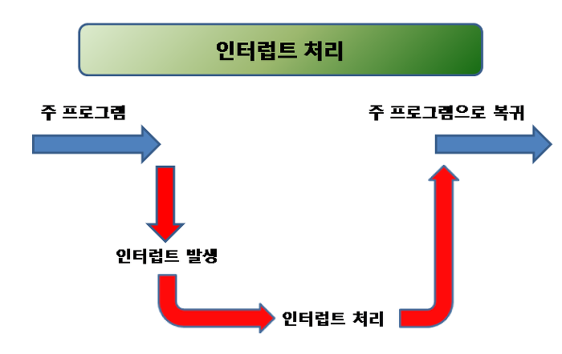

zustand의 공식문서를 살펴보다, **"Zustand는 React의 useSyncExternalStore 훅을 사용하여 React의 상태 관리 시스템과 원활하게 통합되어 Concurrent Mode와 호환된다"** 는 내용을 보았다.

**Concurrent Mode라는** 낯선 단어를 찾아보게 되었고, 생각보다 면접 질문으로도 쏠쏠하게 등장하기에 정리해보려한다!

React 18에서 도입된 Concurrent Mode는 React 애플리케이션의 성능과 사용자 경험을 향상 시키기 위해 생긴 기능이다. 앞으로 Concurrent Mode가 무엇인지, 어떻게 작동하는지, 그리고 개발자들이 이를 어떻게 활용할 수 있는지 자세히보자.

<br>

## Concurrent Mode란


Concurrent Mode는 React가 렌더링 작업을 중단, 재개, 그리고 even 폐기할 수 있게 해주는 새로운 기능이다. React가 브라우저의 메인 스레드를 차단하지 않고 백그라운드에서 컴포넌트 트리의 여러 버전을 준비할 수 있게 해준다.

주요 특징으로는 **렌더링 작업의 우선순위 지정, 렌더링 중단 및 재개를 가능하게 하고, 불필요한 렌더링을 방지**한다.

<br>

### 작동 원리와 장점

Concurrent Mode는 React의 내부 작동 방식을 근본적으로 변경해서 기존의 동기식 렌더링 대신 비동기적으로 렌더링을 수행할 수 있다.

- React는 여러 업데이트의 우선순위를 지정하고 중요한 업데이트를 먼저 처리한다.
- **더블 버퍼링:** 화면에 표시되는 내용을 변경하기 전에 메모리에서 트리 전체를 준비
- 높은 우선순위의 업데이트가 들어오면, 진행 중인 낮은 우선순위의 렌더링을 중단할 수 있다. **(인터럽트가 가능하다)**



<br>

Concurrent Mode를 사용하게 되면 **중요한 업데이트를 우선적으로 처리해** 응답성을 높일 수 있다.

그리고 **불필요한 렌더링을 방지**하고, Suspense와 결합하여 더 **자연스러운 로깅 상태**를 제공할 수 있다

<br>

## 그럼 사용해보자

사용해보기 전에 몇가지 주의 사항을 확인해보자!

- Concurrent Mode는 기존의 일부 패턴과 호환되지 않을 수 있다.
- 비동기 렌더링으로 인해 디버깅이 더 복잡해질 수 있다.
- side effect 관리에 신경써야한다.
- 사용하려면 React 18 이상의 버전이 필요하다.

주의사항을 확인했으면 아래처럼 Concurrent Mode를 활성화해보자

```javascript
import React from 'react';
import ReactDOM from 'react-dom/client';
import App from './App';

const root = ReactDOM.createRoot(document.getElementById('root'));
root.render(<App />);
```

이제 `ReactDOM.render()` 대신 `ReactDOM.createRoot()`를 사용하여 애플리케이션을 렌더링한다.

<br>

### useTransition

`useTransition` 훅은 우선순위가 낮은 상태 업데이트를 표시할 수 있게 해준다. 그리고 무거운 계산을 수행하면서도 UI의 응답성을 유지할 수 있다.

```javascript
import { useTransition } from 'react';

function App() {
  const [isPending, startTransition] = useTransition();
  const [count, setCount] = useState(0);

  function handleClick() {
    startTransition(() => {
      setCount((c) => c + 1);
    });
  }

  return (
    <div>
      {isPending && <Spinner />}
      <button onClick={handleClick}>{count}</button>
    </div>
  );
}
```

<br>

### useDeferredValue

`useDeferredValue`는 덜 중요한 UI 부분의 업데이트를 지연시킬 수 있게 해준다. 그리고 대규모 리스트의 업데이트를 최적화할 수 있다.

```javascript
import { useDeferredValue } from 'react';

function SearchResults({ query }) {
  const deferredQuery = useDeferredValue(query);

  // 이 컴포넌트의 리렌더링은 다른 중요한 업데이트 후로 지연될 수 있다.
  return <SlowList query={deferredQuery} />;
}
```

<br>

### Suspense를 사용

Suspense를 사용하면 컴포넌트의 렌더링을 특정 조건이 충족될 때까지 **"중단"** 할 수 있다. 또한 더 자연스러운 로딩 상태를 제공한다.

```javascript
import { Suspense } from 'react';

function App() {
  return (
    <div>
      <Suspense fallback={<Spinner />}>
        <SlowComponent />
      </Suspense>
    </div>
  );
}
```

<br>

## React 19에서는?

24년 8월 24일 기준 React 19에 대한 이야기 많이 들려오고있다. Concurrent Mode의 개념이 22년 3월 React 문서에서 보이기 시작했는데, 2년 반 시간이 지난 지금 관점이 어떻게 변했을까?

아직까지 React 팀은 Concurrent Mode의 개념을 지향하고 있지만, 그 구현 방식과 "Concurrent Mode"라는 용어 대신 "Concurrent Rendering"이라는 용어를 사용하며 변화를 주고 있다.

몇개의 자료들을 살펴보며 어떤 이유때문에 용어의 변화가 생겼는지 알아보자.

<br>

### React Github Discussions

[React 18 워킹 그룹 GitHub 토론](https://github.com/reactwg/react-18/discussions/64)의 Discussions을 살펴보자.

**Rename 'Concurrent Mode' to 'Concurrent Rendering'을** 확인해보면 **Dan Abramov**가 아래처럼 서술하고 있다.

<br>

> 우리는 'Concurrent Mode'라는 용어를 더 이상 사용하지 않고 대신 'Concurrent Rendering'이라는 용어를 사용할 것입니다. 이는 동시성이 모드가 아니라 렌더링 동작의 변화임을 강조하기 위함입니다.
>
> We're moving away from the term "Concurrent Mode" and will be using "Concurrent Rendering" instead. This is to emphasize that concurrency is not a "mode" but a behind-the-scenes change in the rendering behavior.

<br>

### React 18 Docs

[React 18 공식 문서](https://react.dev/blog/2022/03/29/react-v18#what-is-concurrent-react)에서 React 팀은 아래처럼 내용을 다루고 있다.

<br>

> 동시성은 React의 내부 구현 세부사항입니다. 최종 사용자로서, React가 동시적이라는 사실을 알 필요는 없습니다. React를 사용하는 방식에 근본적인 변화는 없으며, 단지 React가 제공하는 새로운 기능을 사용하면 됩니다.
>
> Concurrency is a new behind-the-scenes mechanism in React. As an end user, you don't need to think about it most of the time. React automatically opts into concurrent features depending on which ones you're using.

<br>

위 글을 아래 2가지 이유로 요약할 수 있다.

- **점진적 채택 가능성:** "Mode"라는 단어는 전체 애플리케이션에 대한 on/off 스위치와 같은 느낌을 주지만, "Rendering"은 더 유연하고 점진적인 도입을 암시한다.
- **혼란 감소:** 많은 개발자들이 Concurrent Mode를 하나의 기능으로 오해했다. 실제로는 여러 기능의 집합이며, 이를 "Concurrent Rendering"으로 표현하는 것이 더 정확하다.

<br>

## 결론

Concurrent Mode는 React 애플리케이션의 성능과 사용자 경험을 크게 향상시킬 수 있는 강력한 도구인 것 같다.

이를 효과적으로 활용하기 위해서는 새로운 개념과 API에 대한 이해도가 필요해보여서, 공부를 더 해봐야겠다!


React 팀은 계속해서 Concurrent Mode, Concurrent Rendering을 강조하고 있기때문에, 앞으로 더 많은 기능과 최적화가 이루어질 것으로 예상된다!

<br>

### 참고자료

- [React v18.0](https://react.dev/blog/2022/03/29/react-v18)
- [동시성 모드에 대해서](https://w55ng.com/entry/React-18%EC%9D%98-%EC%83%88%EB%A1%9C%EC%9A%B4-%EA%B8%B0%EB%8A%A5-%EB%8F%99%EC%8B%9C%EC%84%B1-%EB%AA%A8%EB%93%9CConcurrent-Mode)
- [What is React Concurrent Mode?](https://medium.com/swlh/what-is-react-concurrent-mode-46989b5f15da)

```toc

```
