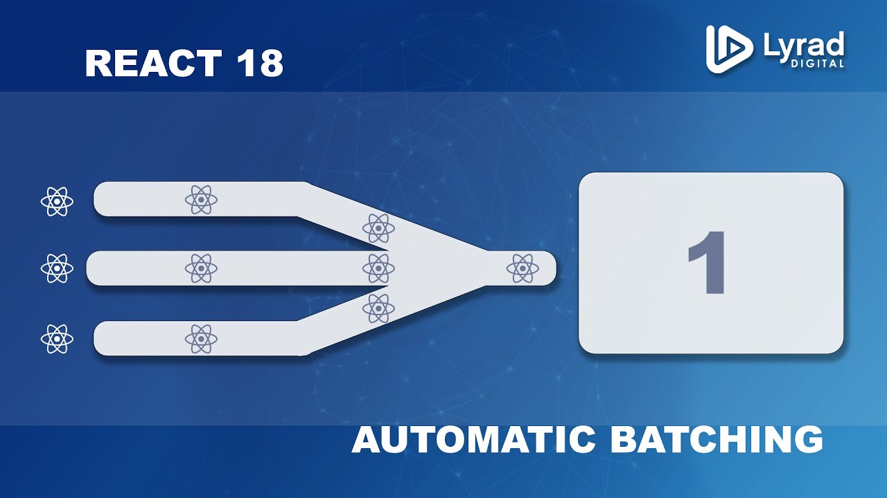
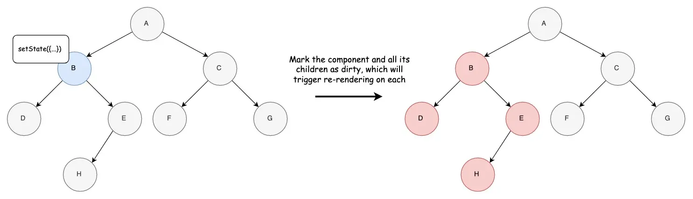
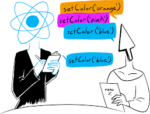
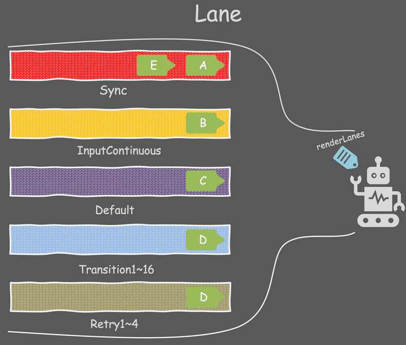
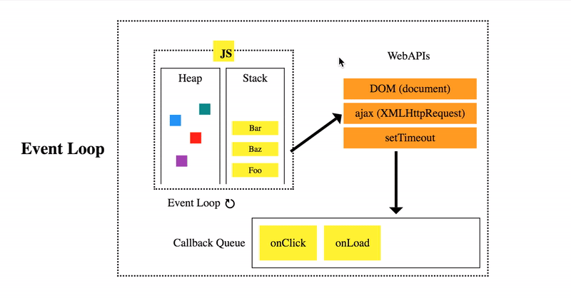
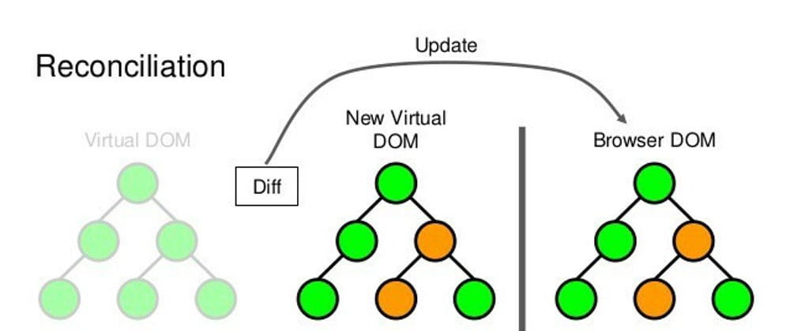
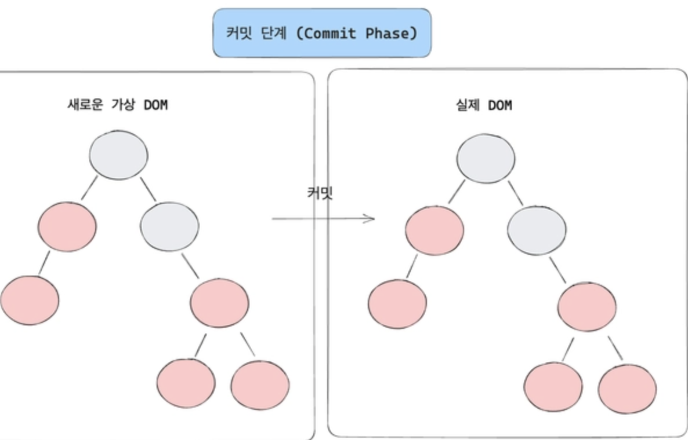
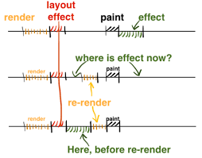

React 상태가 변화하는 과정은 크게 5단계로 나눌 수 있다.

- **초기 트리거 단계**: useState를 통한 상태 생성과 업데이트 객체가 만들어지는 단계
- **스케줄링 단계**: 여러 상태 업데이트를 우선순위에 따라 배치 처리하는 단계
- **재조정(Reconciliation) 단계**: Virtual DOM을 비교하여 실제로 변경이 필요한 부분을 파악하는 단계
- **커밋(Commit) 단계**: 변경사항을 실제 DOM에 적용하고 부수효과를 실행하는 단계
- **완료 단계**: 클린업을 수행하고 다음 업데이트를 준비하는 단계

이 각 단계들은 React가 상태 변화를 효율적이고 일관되게 처리하여 성능 최적화와 안정적인 렌더링을 보장하기 위해 설계되었다.

<br/>


 **배치 처리 (Batching)**



- 배치 처리는 여러 상태 업데이트를 하나의 리렌더링으로 그룹화하는 프로세스다.

- 배치 처리를 통해 불필요한 렌더링을 최소화하고, 메모리 할당을 줄이는 등의 장점을 누릴 수 있다.

- React 18에서는 모든 업데이트가 자동으로 배치 처리된다.

<br/>

 **트랜잭션 처리**

- 트랜잭션은 여러 업데이트를 하나의 원자적 단위로 처리하여 일관성을 보장하는 것을 의미한다.

- 최대 장점은 원자성, 일관성, 격리성이 있다.

```typescript
function TransactionExample() {
  const [user, setUser] = useState(null);
  const [posts, setPosts] = useState([]);

  const updateUserData = async () => {
    try {
      startTransaction(); // 트랜잭션 시작

      setUser(newUser);
      setPosts(newPosts);

      commitTransaction(); // 트랜잭션 커밋
    } catch (error) {
      rollbackTransaction(); // 오류 발생하면 롤백
    }
  };
}
```

이제 각 단계별로 자세한 내용을 살펴보며 React의 상태 관리 메커니즘에 대해 알아보자

<br/>

## 초기 트리거 단계



초기 트리거 단계는 React에서 상태 변화가 시작되는 첫 단계다.

초기 상태를 생성하고, 업데이트를 위한 객체를 생성하고, 업데이트를 큐로 관리해 배치 처리한다. 이러한 단계를 예시코드를 통해 자세하게 알아보자.

<br/>

### 초기 상태 생성

우선 useState, useReducer, useContext, 외부 상태 관리 라이브러리를 이용해 초기 상태가 생성되고, set 같은 상태 업데이트 함수가 호출될 때 트리거된다.

트리거(Trigger)는 상태(state)가 변경될 때 컴포넌트(component)가 다시 렌더링(re-rendering)되도록 하는 것을 의미한다.

<br/>

### 업데이트 객체 생성

상태 변경이 발생하면 React는 Update 객체를 생성한다.

이 객체는 새로운 상태값, 우선순위, 다음 업데이트에 대한 참조 등의 정보를 포함한다.

```typescript
interface Update<State> {
  lane: Lane;
  tag: UpdateTag;
  payload: any;
  next: Update<State> | null;
  eventTime: number;
}
```

**lane는** React의 우선순위 시스템을 구현하는 필드다. 동기/비동기 업데이트 구분, 사용자 상호작용, 데이터 페칭 등 업데이트 유형에 따른 우선순위 할당등의 역할을 한다.

**tag는** UpdateState, ReplaceState, ForceUpdate, CaptureUpdate 4가지 종류가 있다.

**payload는** 상태 계산에 필요한 정보를 가지고 있다.

**next는** 업데이트 큐에서 연결 리스트 구현(업데이트 순차 처리)에 사용한다.

**eventTime은** 우선순위 계산, 타임아웃 처리, 성능 측정, 디버깅에 활용한다.

실제 생성은 아래처럼 된다.

```typescript
const update = {
  lane: SyncLane,
  tag: UpdateState,
  payload: newState,
  next: null,
  eventTime: getCurrentTime(),
};
```

<br/>

### 업데이트 큐에 추가



생성된 업데이트 객체는 업데이트 큐에 추가된다.

여러 업데이트가 발생하면 큐에서 연결 리스트 형태로 관리되는데, 구조는 아래와같다

```typescript
interface UpdateQueue<State> {
  baseState: State; 
  firstBaseUpdate: Update<State> | null; 
  lastBaseUpdate: Update<State> | null; 
  shared: {
    pending: Update<State> | null; 
  };
  effects: Array<Effect> | null; 
}
```

**baseState** 로 기본 상태를 저장하고, **firstBaseUpdate/lastBaseUpdate** 를 활용해 업데이트 연결 리스트의 첫 번째와 마지막 업데이트를 저장한다.

아직 처리 대기중인 업데이트는 **pending** 에 저장하고 사이드 이팩트는 **effect** 에 할당된다.

업데이트 큐에 추가되면 큐 처리는 초기화를 우선하고 업데이트를 연결한다.

아래 코드를 살펴보면, 업데이트 연결을 할 때 첫 업데이트/기존 업데이트 상황에 따라 연결 리스트의 구조가 다르다.

```typescript
function enqueueUpdate(fiber, queue, update) {
  const pending = queue.shared.pending;
  if (pending === null) {
    update.next = update;
  } else {
    update.next = pending.next;
    pending.next = update;
  }
  queue.shared.pending = update;
}
```

enqueueUpdate 함수는 컴포넌트의 fiber 노드, 업데이트를 지정하는 큐, 새로 추가할 업데이트 객체를 매개변수로 받는다.

그리고 원형 연결 리스트 형태로 구현되어있는 큐의 마지막 업데이트를 확인하여, 큐가 비어있으면 자기 자신을 가리키도록, 큐가 이미 업데이트에 있으면 기존 리스트에 연결하게된다.

최종적으로 새 업데이트를 마지막 업데이트로 설정하게된다.


<br/>

## 스케줄링 단계

스케줄링 단계에서는 React가 상태 업데이트를 효율적으로 처리하기 위한 단계로 사용자 경험을 해치지 않는 것을 중점으로 처리한다.

<br/>

###  우선순위 지정 (Lanes 시스템)



업데이트 객체를 생성할 때 Lane을 이용해 우선순위를 표현한다.

여기서 Lane은 비트 마스크를 사용하여 우선순위를 표현하는 방식으로, 각 비트는 특정 우선순위 레벨을 나타낸다.

<br/>

**SyncLane(동기업데이트)** => 우선 순위 제일 높음

- 즉시 처리가 필요한 동기 업데이트 (긴급한 상태 업데이트, 직접적인 DOM 조작)
- 다른 작업을 중단하고 즉시 실행한다.

<br/>

**InputContinuousLane(사용자 입력과 관련)**

- 사용자 입력과 관련된 업데이트 (키보드 입력, 마우스 이벤트)
- 반응성을 위해 높은 우선순위 부여

<br/>

**DefaultLane(일반적인 상태 업데이트)**

- 일반적인 상태 업데이트 (API 응답에 따른 상태 변경)
- 보통 수준의 우선순위로 처리

<br/>

**TransitionLane(UI 전환 효과, 지연효과)**

- UI 전환과 관련된 업데이트 (페이지 전환, 애니메이션)
- useTransition, startTransition 과 같은 지연 가능한 업데이트 처리

<br/>

**IdleLane(백그라운드 작업)** => 우선 순위 제일 낮음

- 백그라운드 작업 (데이터 프리페칭, 로깅)
- 브라우저 유휴 시간에 처리


<br/>


### 업데이트 배치 처리 (Batch Processing)

React는 여러 상태 업데이트를 효율적으로 처리하기 위해 **배치 처리**를 사용한다. 여러 상태 업데이트를 단일 배치로 그룹화하여 처리함으로써 **성능을 최적화하고 불필요한 리렌더링을 방지한다.**

**배치 처리 메커니즘은** 업데이트를 그룹화하고, 각 업데이트에 우선순위를 할당한 후, 이를 업데이트 큐에 순차적으로 추가한다. 

이 과정에서 **React는 동기/비동기 컨텍스트를 구분**하고, 트랜잭션 단위로 상태를 관리하여 일관성을 유지한다.

React의 스케줄러는 우선순위를 기반으로 업데이트 큐를 관리한다. 각 업데이트는 우선순위와 만료 시간을 가지며, 스케줄러는 이를 기반으로 실행 시점을 결정한다.




이러한 스케줄링은 **브라우저의 이벤트 루프와 긴밀하게 통합**되어 있어, 프레임 레이트(디스플레이가 화면의 이미지를 얼마나 자주 업데이트하는지를 나타내는 측정 단위)를 최적화하고 리소스 사용을 효율적으로 관리할 수 있다.

**React 18부터는 자동 배치(Automatic Batching)가** 기본적으로 적용되어, 더욱 효율적인 상태 업데이트가 가능해졌다. 

이를 통해 개발자는 별도의 설정 없이도 최적화된 상태 관리의 이점을 누릴 수 있게 되었다. 이러한 배치 처리 시스템은 React 애플리케이션의 성능과 사용자 경험을 크게 향상시키는 핵심 기능이다.


<br/>

### 불필요한 리렌더링 방지

메모리제이션 활용(useMemo, useCallback)과 선택적 렌더링(필요한 props만 전달해 불필요한 객체 생성 방지)을 기반으로 불필요한 리렌더링을 방지한다.

<br/>

## 재조정(Reconciliation) 단계



React의 재조정은 상태 변화를 실제 UI 변화로 변환하는 핵심 과정이다. 

이 과정은 효율적인 UI 업데이트를 위해 변경된 부분만을 식별하고 수정하는 것에 중점을 두고있다.

<br/>

### 새로운 상태 계산

React는 상태 업데이트를 처리할 때 두 가지 핵심 작업을 수행한다.

- 현재 상태와 컴포넌트의 마지막 렌더링 결과를 확인해 이전 상태를 평가한다.
- 들어온 업데이트들을 순차적으로 처리하여 최종 상태를 계산한다.

<br/>

### Virtual DOM 비교

React는 효율적인 UI 업데이트를 위해 Virtual DOM을 활용한다.

현재 Virtual DOM은 실제 DOM에 반영된 현재 UI 상태이고, 새로운 Virtual DOM은 새로운 상태를 기반으로 생성된 UI 트리다. 

**[Diff 알고리즘](https://devocean.sk.com/blog/techBoardDetail.do?ID=165611)은** 두 Virtual DOM을 비교하여 차이점을 찾는다. 특히 key prop은 리스트 요소의 식별과 효율적인 재사용을 위해 중요하다.

<br/>

### 필요한 업데이트 결정

React는 텍스트/속성/구조 변경 업데이트를 처리한다.

**텍스트 업데이트**

```javascript
  <div>Hello {name}</div>  // 텍스트 내용만 변경
```

**속성 업데이트**

```javascript
  <button className={isActive ? 'active' : ''}>  // 클래스만 변경
```

**구조적 변경**

```javascript
{condition ? <ComponentA /> : <ComponentB />}  // 컴포넌트 전체 교체
```


<br/>

### Fiber 트리 구성

Fiber 트리에 대한 내용은 다룰 것이 너무 많다. 그래서 별도로 다루려한다.

내용이 궁금하면 **[여기를 참조해보면 좋다](https://github.com/acdlite/react-fiber-architecture)**

<br/>


## 커밋(Commit) 단계



커밋 단계는 React의 변경사항을 실제 DOM에 안전하게 적용하고, 부수 효과를 관리하며, 메모리를 효율적으로 관리하는 중요한 단계다.

동기적 실행, 부수 효과 관리, 성능 최적화를 중점으로 다루어 성능과 안정성에 직접적인 영향을 미친다.

<br/>

### 실제 DOM 업데이트

삭제될 노드를 처리 => 새로운 노드를 마운트 => 기존 노드 업데이트 순서대로 DOM 업데이트를 진행한다.

그리고 DOM 조작 최적화를 위해 아래 3가지의 작업을 진행한다.

- 변경사항을 하나의 배치로 처리
- 레이아웃 트리거 최소화
- 브라우저 리페인트 최적화

<br/>

### 부수 효과(Effects) 실행



부수효과에는 useLayoutEffect(레이아웃 효과) 와 useEffect(패시브 효과)가 있다.

**useLayoutEffect (레이아웃 효과)**

- DOM 변경 직후, 브라우저가 화면을 그리기 전에 동기적으로 실행

- React가 DOM을 업데이트한 직후, 브라우저 페인팅 전에 발생

- 실행 순서: DOM 업데이트 → useLayoutEffect → 브라우저 페인팅

**useEffect (패시브 효과)**

- 브라우저가 화면을 그린 후 비동기적으로 실행

- React가 DOM을 업데이트하고 브라우저가 화면을 그린 후 발생

- 실행 순서: DOM 업데이트 → 브라우저 페인팅 → useEffect

<br/>

### 참조 정리

참조 정리를 위해 ref 업데이트를 처리하고, 메모리 관리를 진행한다.

메모리 관리에는 가비지 컬렉션 준비(불필요한 참조 제거, 순환 참조 방지, 메모리 누수 방지)와 리소스 정리(이벤트 리스너 제거, 타이머 정리 ,외부 구독 취소)가 포함되어있다.

<br/>

## 완료 단계

React 애플리케이션의 안정성과 성능을 보장하는 중요한 단계다.

적절한 클린업, 메모리 관리, 그리고 다음 업데이트 준비를 통해 리소스 누수 방지, 안정적인 성능 유지, 일관된 사용자 경험 제공 등의 요소들을 보장한다.

<br/>

### 클린업 함수 실행

클린업의 목적은 이전 렌더링의 부수 효과 정리, 리소스 누수 방지, 상태 일관성 유지 등이 있다.

클린업 실행 순서는 아래 3가지 단계를 거친다.

1. 이펙트 클린업

```typescript
useEffect(() => {
  // 구독 설정
  const subscription = dataSource.subscribe();

  // 클린업 함수
  return () => {
    // 다음 이펙트 실행 전 또는 언마운트 시 호출
    subscription.unsubscribe();
  };
}, [dataSource]);
```

2. 등록된 이벤트 리스너 제거, 타이머/인터벌 정리, 웹소켓 연결 종료 등을 통해 이벤트를 정리한다.

3. 이후에는 외부 연결인 데이터 구독 해제, 외부 API 연결 종료, 캐시 정리등을 진행한다.


<br/>

### 메모리 정리

참조 정리, 캐시 관리, 가비지 컬렉션 준비를 통해 메모리를 정리한다.

자세하게 설명해보면 cleanupFiber 함수를 사용해 Fiber 노드를 정리해준다 (하위 fiber 옵션을 null로 초기화해주는 개념?)

참조 정리에는 DOM 참조 해제(함수형 ref, 객체 ref)와 컴포넌트 인스턴스 정리를 의미한다.

<br/>

### 다음 업데이트 준비

상태를 초기화하고 최적화 준비를 끝낸다.

다음 업데이트를 준비하기 위해, 업데이트 큐 초기화를 진행한다. 그 다음 우선순위 시스템을 새로 준비하게 되는데 그 내용들은 아래 5개를 의미한다.

- 위에서 설명했던 레인(Lane) 할당하고 작업 우선순위 설정

- 작업 스케줄링 준비 (작업 큐 초기화, 스케줄링 상태 리셋)

- 성능 최적화 준비 (메모리 모니터링, 성능 메트릭 초기화)

- 실행 컨텍스트 준비 (렌더 컨텍스트 초기화)

- 동시성 모드 준비 (시간 분할 설정, 인터럽트 처리 준비)

<br/>

## 참고자료

- [React-reconciler](https://github.com/facebook/react/tree/main/packages/react-reconciler)
- [React-scheduler](https://github.com/facebook/react/tree/main/packages/scheduler)
- [React-DOM](https://github.com/facebook/react/tree/main/packages/react-dom)
- [React Fiber architecture](https://github.com/acdlite/react-fiber-architecture)
- [React 내부구현 해보기](https://pomb.us/build-your-own-react/)
- [Scheduling in React](https://philippspiess.com/scheduling-in-react/)
- [리액트 배칭의 모든 것](https://yozm.wishket.com/magazine/detail/2493/)

```toc

```
