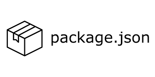

<br>

오늘은 프론트엔드 개발자로서 매일 마주하지만 깊이있게 들여다보지 않았던 package.json에 대해 이야기해볼 예정이다.

프로젝트를 다룰때마다 항상 핸들링하지만 그 이상으로 깊게 공부하지 않았기에 이번기회에 알아보려한다.

package.json은 단순한 의존성 관리를 위한 파일을 넘어서 프로젝트의 전반적인 메타데이터와 설정을 관리하는 핵심 파일이다.

지금부터 package.json에 대해 깊이있게 알아보자

<br>

# package.json의 생성 과정

package.json은 `npm init`을 사용해서 생성하는 방법과 수동으로 프로젝트 루트 디렉토리에 직접 JSON 형식으로 생성하는 방법이 있다.

JSON 문법에 에러 발생 가능성이 있기에 직접 생성보다는 패키지 라이브러리 init 명령어를 통해 생성하는 것을 추천한다.

init을 이용해 package.json이 생성되는 과정을 살펴보자. (본론에서는 기본으로 많이 사용되는 npm을 예시로 설명하겠다.)

> 운영체제, 컴퓨터 시스템 등등 많은 조건에 따라 package.json이 생성되는 과정이 다르고 복잡하다. 이 글을 읽는 사람들이 이해할 수 있는 선에서 설명해보겠다!

<br>

## 프로세스 초기화 단계

프로세스 초기화 단계는 npm init 명령어 실행 --> 프로세스 생성 --> 환경 변수 로드 --> npm 설정 파일 읽기 --> 기본값 초기화 로 이루어진다.

npm init 명령어를 실행하게 되면 Node.js 런타임이 새로운 프로세스를 생성하게된다. 그렇게하면 process ID(PID)를 할당하게 되고 메모리 공간을 할당한다.

이 때 힙은 동적 메모리를 할당하고, 스택은 함수 호출 및 지역 변수를 할당하게 된다. data segment는 전역변수를 할당한다.

위 작업이 종료되면 환경 설정을 로드한다. (npm을 예시로 했으니) npm 관련 환경 변수(process.env.npm*config*\*), 사용자 홈 디렉토리(process.env.HOME), 시스템 경로(process.env.PATH) 등이 포함된다.

프로세스 초기화 단계의 마지막 과정에는 설정된 파일을 탐색하는 과정을 거친다.

설정 파일 탐색은 .npmrc 파일 탐색을 의미하는데, 프로젝트/사용자/전역/내장 4개의 공간에 위치한 .npmrc 파일을 탐색한다.

<br>

## Interactive CLI(대화식 인터페이스)

Interactive CLI는 package.json의 데이터를 수집하기전에 빈 템플릿을 준비하는 단계다.

이 단계에서 필수 필드와 기본값이 있는 필드로 나누어 빈 객체를 아래 예시코드처럼 초기화를 진행한다.

```javascript
class PackageJsonTemplate {
  constructor() {
    this.template = {
      name: null, // 필수
      version: null, // 필수
      description: null, // 선택
      main: null, // 선택 (기본값: index.js)
      scripts: {}, // 선택
      keywords: [], // 선택
      author: null, // 선택
      license: null, // 선택 (기본값: ISC)
    };

    // 필수 필드
    this.requiredFields = ['name', 'version'];

    // 기본값
    this.defaults = {
      version: '1.0.0',
      main: 'index.js',
      license: 'ISC',
      scripts: {
        test: 'echo "Error: no test specified" && exit 1',
      },
    };
  }
}
```

그 다음 프롬프트를 이용해 사용자 입력을 수집한다. 수신 받은 데이터를 검증하게 되고, 이 과정이 완료되면 다음 단계인 파일 시스템 조작단계로 넘어간다.

여기서 조심해야할 부분은 입력받은 데이터를 그대로 저장하는 것이 아닌 임시 데이터로 저장하게된다.

<br>

## 파일 시스템 조작

수집된 package.json 데이터를 실제 파일로 저장하는 과정이다.

파일 시스템을 초기화하게 되고, 접근 가능한 권한인지 확인한다. 2단계에서 임시로 저장해둔 데이터를 가지고 파일에 적용하고 임시 파일을 실제 파일로 이동하는 작업을 진행한다.

이 작업은 npm에서 write-file-atomic 패키지의 `PackageJsonWriter` 클래스의 `writePackageJson` 함수를 활용해 간단하고 안전하는 기능을 구현하고있다.

```javascript
const writeFileAtomic = require('write-file-atomic');

class PackageJsonWriter {
  async writePackageJson(filename, data) {
    try {
      const contents = JSON.stringify(data, null, 2) + '\n';
      await writeFileAtomic(filename, contents);
    } catch (error) {
      throw new Error(`Failed to write package.json: ${error.message}`);
    }
  }
}
```

파일 시스템 조작 단게에서 파일 변경이 감지 되면 `handleFileChange` 함수를 이용해 변경을 감지해 이벤트를 처리한다.

오류가 발생하게 되면 백업파일의 유무를 파악해 복구하거나 초기 상태로 초기화를 진행한다.

그리고 마지막으로 Lock 파일을 생성해 동시 작업을 유연하게 만드는 작업을 진행한다.

<br>

## JSON 생성 및 검증

JSON 파일을 생성해 기본값과 사용자 입력 값을 병합한다. 그리고 npm 패키지 이름 규칙에 맞도록 정규화 작업을 진행한다.

그 다음 필수 필드를 비롯한 각 필드의 유효성 검사를 진행한다. 이 과정에는 이름 규칙 검증, 버전 형식 검증, 의존성 형식 검증, Schema 검증 등이 있다.

이후 최종 검증된 데이터를 반환한다.

<br>

## 오류 처리 및 복구

package.json 을 생성하는 과정에서 다양한 오류과 마주할 수 있다.

npm cli github에서는 다양한 오류 클래스들이 존재하지만 지금까지 제시한 단계에 밀접한 연관을 가진 오류들만 확인해보면 아래와 같다.

```javascript
class PackageJsonError extends Error {
  constructor(message, code) {
    super(message);
    this.name = 'PackageJsonError';
    this.code = code;
  }
}

class ValidationError extends PackageJsonError {
  constructor(message) {
    super(message, 'VALIDATION_ERROR');
  }
}

class FileSystemError extends PackageJsonError {
  constructor(message) {
    super(message, 'FS_ERROR');
  }
}

class LockError extends PackageJsonError {
  constructor(message) {
    super(message, 'LOCK_ERROR');
  }
}
```

이 오류들을 오류 처리 매니저를 통해, 오류들이 복구 시도, 백업 생성, 오류 처리, clean up(정리) 등 다양하게 처리된다.

이 과정에서 로깅 및 모니터링 작업이 일어나 package.json 생성에 따른 전반적 오류와 정보를 확인해볼 수 있다.

<br>

## 메모리 관리 & 프로세스 종료

package.json은 메모리를 효율적으로 관리하기 위해 dependencies, devDependencies, peerDependencies, bundledDependencies 필드를 생성한다.

이후 모든 프로세스가 종료된다.

이 과정에서도 안전한 종료를 위해 프로세스 종료 신호를 분석한다.

- SIGTERM: 정상 종료 요청
- SIGINT: Ctrl+C로 인한 종료
- SIGKILL: 강제 종료 (처리 불가)
- uncaughtException: 처리되지 않은 예외

위 4가지 신호에의 결과값인 0(정상 종료)/1(에러로 인한 종료)에 따라 프로세스가 마무리된다.

메모리 관리와 프로세스 종료는 시스템 환경에서 중요한 개념이지만, package.json을 생성하는 단계에서는 자동으로 처리해주기에 이번 세션에서는 가볍게 이야기하고 넘어가보겠다

<br>

# package.json의 본질

나는 package.json를 프로젝트 의존성을 관리하고, 프로젝트의 정보를 문서화는 특성 때문에 **Node.js 프로젝트의 명세서**라고 생각한다.

프로젝트를 진행할 때 제일 먼저 살펴보는 package.json의 본질에는 어떤 것들이 있는지 살펴보자

<br>

## 프로젝트 메타데이터 관리 (Project Metadata Management)

프로젝트 메타데이터는 프로젝트를 설명하고 식별하는 데 필요한 모든 정보를 포함한다.

자주 보았겠지만, 메타데이터 필드에는 아래와 같은 정보들이 있다

```json
{
  "name": "존잘지훈짱짱맨",
  "version": "1.0.0",
  "description": "지훈블로그 킹왕짱",
  "author": "Jihoon Lee <jihoon7705@gmail.com>",
  "license": "MIT",
  "keywords": ["web", "frontend", "react"],
  "repository": {
    "type": "git",
    "url": "https://github.com/jiji-hoon96"
  },
  "blogs": {
    "url": "https://hooninedev.com/"
  },
  "homepage": "https://hooninedev.com/"
}
```

<br>

### 그럼 메타데이터가 왜 중요할까?

- npm 레지스트리에서 고유한 식별자 역할을 통해 버전 관리 및 업데이트 추적을 가능하게한다.

- npm 검색에서 프로젝트 발견 가능성 향상시킨다.

- `keywords`를 통한 관련 프로젝트 그룹화할 수 있다. (원하는 것을 찾기 수월)

- 오픈소스 라이선스 명시를 통해 사용 제한 사항 명확화할 수 있다.

<br>

## 의존성 관리 (Dependency Management)

의존성 관리에는 의존성 유형, 의존성 버전 관리, 의존성 관리 전략이 있다.

<br>

### 의존성 유형

의존성 유형에는 dependencies, devDependencies, peerDependencies 등이 있다.

> 자세한 내용은 [Dependencies vs DevDependencies vs PeerDependencies](https://hooninedev.com/231002/)을 확인해보면 좋다.

<br>

### 의존성 버전 관리

#### Semantic Versioning

소프트웨어 버전 번호를 체계적으로 관리하기 위한 규칙으로 아래와 같은 구조를 가진다.

```
MAJOR.MINOR.PATCH[-PRE_RELEASE][+BUILD]

```

- 메이저 버전 : 이전 버전과 호환되지 않는 API 변경
- 마이너 버전 : 이전 버전과 호환되는 기능 추가
- 패치 버전 : 이전 버전과 호환되는 버그 수정, 작은 변경
- 프리릴리즈 식별자 : 정식 버전 전 테스트
- 빌드 메타데이터 : 빌드 관련 메타 데이터

<br>

### 의존성 관리 전략

- 직접 의존성을 최소화 할 수 있다(필요한 패키지만 설치하거나, 중복 기능 패키지를 제거하는 등)

- 의존성 감사를 진행할 수 있다. (audit, outdated 등을 활용해서)

- Lock 파일 활용해서 정확한 의존성 보장할 수 있고, 팀 간 일관된 환경을 유지할 수 있다.

<br>

## 프로젝트 실행 관리

개발 워크플로우와 빌드 프로세스를 자동화한다. 상세한 역할은 아래와 같다.

- 스크립트를 통한 프로젝트 실행, 빌드, 테스트 등의 작업 자동화 설정
- 프로젝트 진입점 설정할 수 있다

  ```json
  {
    "main": "dist/index.js", // CommonJS 진입점
    "module": "dist/index.esm.js", // ES Module 진입점
    "browser": "dist/index.umd.js", // 브라우저 진입점
    "types": "dist/index.d.ts" // TypeScript 타입 정의
  }
  ```

npm scripts는 다양한 스크립트 패턴들을 사용해 개발 워크플로우를 구축한다.

아래 제공하는 3가지의 방법을 잘 활용해서 다양한 환경에 대응하는 스크립트를 구축하면 효율성이 높아진다.

<br>

### Pre/Post 훅

특정 스크립트 실행 전(Pre)/후(Post)에 자동으로 실행되는 스크립트를 정의를 의미한다.

```javascript
{
  "scripts": {
    "prebuild": "rm -rf dist/",
    "build": "webpack",
    "postbuild": "cp -r public/* dist/",

    "pretest": "npm run lint",
    "test": "jest",
    "posttest": "npm run coverage"
  }
}
```

이렇게 정의하고 `npm run build` 를 실행하면 prebuild => build => postbuild 순서대로 진행된다.

이런 순서는 이전 단계가 성공적으로 완료되어야 다음 단계가 실행된다.

<br>

### 병렬 실행

`npm run all`, & 연산자, concurrently 패키지를 사용해 복잡한 병렬 실행을 처리한다.

```javascript
    "dev": "npm-run-all --parallel watch:*", // npm run all
    "dev": "webpack --watch & sass --watch src:dist & nodemon server.js" // &연산자 사용
    "start": "concurrently -k ~~~" // concurrently 사용
```

<br>

### 조건부 스크립트

크로스 플랫폼 환경변수 설정을 처리하기 위한 패턴으로 `cross-env`를 사용한다.

그리고 환경에 따른 조건부 실행을 지원하기 위해 `if-env`를 사용한다.

<br>

## 공부 소감

상당히 어렵다. 쉽게 공부하려하면 너무 쉽고 다룰 부분이 없고, 깊게 공부하니 컴퓨터 지식에 밀접해진다.

일단 동작원리와 package.json의 본질에 대해서 살펴보았다.

이번 공부를 기반으로 점차 깊이 공부해봐야겠다고 생각했다. 특히 package.json 버전관리 문법에 대해 잘 다뤄보지 못했다.

이 부분은 Semantic Versioning이라는 세션을 따로 만들어 다뤄보려한다.

모노레포의 경우 package.json이 더 중요해진다 생각하기때문이다.

<br>

## 참고자료

- [hey(node)의 What Is package.json?](https://heynode.com/tutorial/what-packagejson/)
- [npm Docs - package.json](https://docs.npmjs.com/cli/v10/configuring-npm/package-json)
- [NODESOURCE-The Basic of Package.json](https://nodesource.com/blog/the-basics-of-package-json/)
- [알고 쓰자 package.json - hoya's dev blog](https://hoya-kim.github.io/2021/09/14/package-json/)

```toc

```
