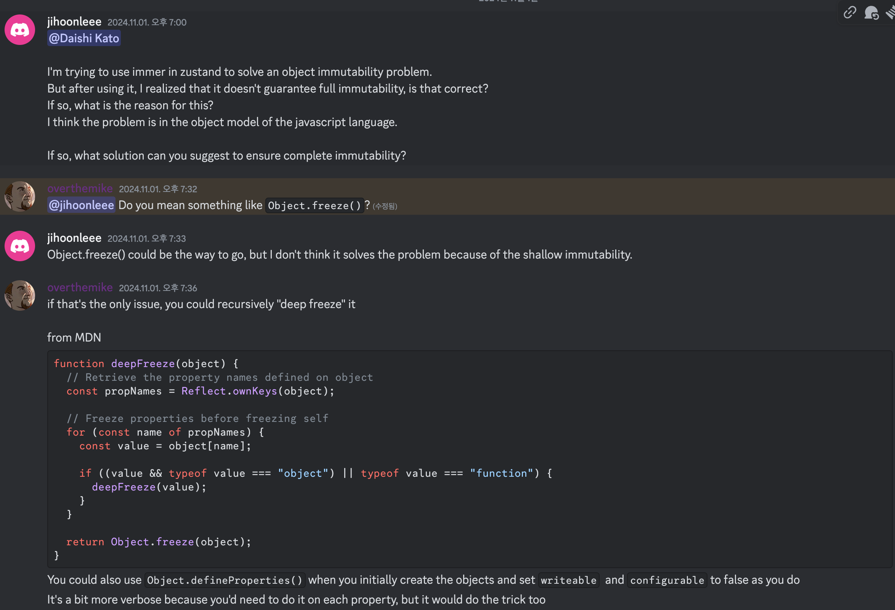

zustand의 immer 그리고 valtio에 대해 알아보기전에 불변성에 대해 간단히 알아보자.

<br/>

# 불변성

불변성은 한번 생성된 데이터의 상태가 변경되지 않는다는 개념이다. 

직접 수정을 금지하고, 변경이 필요할 때 새로운 객체를 생성해 원본 데이터의 무결성을 유지해야한다.

상태 변경이 직접적인 수정이 아닌 새로운 참조를 통해 이루어지므로, 상태 변화를 추적하고 예측하기 쉬워진다.

React의 렌더링 최적화는 참조 비교에 기반한다. 불변성을 통해 객체 참조 변경을 빠르게 확인하기에, 불필요한 렌더링을 방지할 수 있다.

각 상태 변화에서 새로운 객체를 생성해 이전 상태를 보존할 수 있다. 이를 통해 상태 변화를 추적할 수 있다.

<br/>


## 참조 비교

참조 비교는 메모리 관점에서 두 값이 동일한 메모리 주소를 가리키고 있는지를 확인하는 것을 의미한다.

원시값은 값 자체를 비교하고, 참조값은 메모리 주소를 비교한다.

얕은 비교는 객체의 최상위 레벨에서만 참조를 비교하고, 깊은 비교는 객체의 모든 중첩 레벨에서 값을 비교한다.

## 메모리와 참조의 관계

모든 객체는 고유한 메모리 주소를 가진다. 두 참조를 비교할 때는 실제 값이 아닌 메모리 주소를 비교한다.

참조는 변수가 실제 데이터가 저장된 메모리 주소를 가리키는 포인터를 의미한다.


<br>

# zustand immer 미들웨어


<br/>

깊은 객체 구조에서 수동으로 불변성을 관리하는 것은 복잡하고 에러가 발생하기 쉽다

특히 스프레드 연산자, Object.assign() 같은 방식은 깊은 중첩 구조에서 코드가 매우 복잡해질 수 있다.

immer은 draft 객체를 이용해 객체를 직접 수정하는 것처럼 간단하게 처리할 수 있다.

<br>

## draft 객체

불변성을 유지하면서도 마치 직접 객체를 수정하는 것처럼 코드를 작성할 수 있게 해주는 패턴을 의미한다.

기존 상태를 복사하여 임시 객체(draft)를 만들고, 이를 수정한 후 최종적으로 새로운 불변 객체를 생성한다.

```javascript
const baseState = {
  name: "John",
  age: 30,
};

// produce는 아래에서 설명

const nextState = produce(baseState, (draft) => {
  draft.age += 1; // 마치 직접 수정하는 것처럼 보임
});
```

Proxy를 사용하여 모든 변경 사항을 추적한다.

> 🙋🏻‍♂️ Proxy 란?
>
> ```javascript
> const target = {
>   name: "John",
>   age: 30,
> };
>
> const handler = {
>   get: function (target, prop) {
>     return target[prop];
>   },
>   set: function (target, prop, value) {
>     target[prop] = value;
>     return true;
>   },
> };
>
> const proxy = new Proxy(target, handler);
> ```
>
> - 프록시는 객체에 대한 기본 동작(함수호출, 속성에 대한 접근, 속성 열거)를 가로채고 재정의 하는 것을 의미한다.
>
> - 원본 객체를 감싸는 가상의 객체를 생성한다.
>
> - 모든 작업을 중간에서 감시하고 제어한다. 미들웨어와 같은 개념이다.

<br>

실제로는 원본 객체를 수정하지 않고, 변경사항을 기록한다. 최종적으로 모든 변경사항을 적용한 새로운 불변 객체 생성한다.

이것을 zustand에서 immer을 사용하는 코드로 변경하면 아래처럼 구조를 변경할 수 있다.

```javascript
import create from "zustand";
import { immer } from "zustand/middleware/immer";

const useStore = create(
  immer((set) => ({
    users: [],
    addUser: (user) =>
      set((state) => {
        state.users.push(user);
      }),
  }))
);
```

<br/>

## immerImpl

상태를 보존하고 전파하는 코드는 여러 코드의 연관성을 통해 이루어진다.

주제가 불변성인만큼 모든 코드를 깊이 분석하는 것보다 핵심 구현부인 immerImpl에 대해서 공부해보자.

> [zustand immerImpl 내부코드](https://github.com/pmndrs/zustand/blob/main/src/middleware/immer.ts)

```typescript
const immerImpl: ImmerImpl = (initializer) => (set, get, store) => {
  type T = ReturnType<typeof initializer>;

  store.setState = (updater, replace, ...a) => {
    const nextState = (
      typeof updater === "function" ? produce(updater as any) : updater
    ) as ((s: T) => T) | T | Partial<T>;

    return set(nextState, replace as any, ...a);
  };

  return initializer(store.setState, get, store);
};
```

우선 immerImpl 함수는 store creator를 받아서 새로운 store creator을 반환하는 고차 함수다.

> store creator
>
> - Zustand에서 상태(state)와 액션(actions)을 포함하는 스토어를 생성하는 함수
> - set(상태 업데이트 함수), get(현재 상태를 가져오는 함수), store(스토어 객체 자체에 대한 참조)로 구성됨

store의 setState를 재정의한다.

그 다음 updater을 처리하는데, updater이 함수인 경우와 아닌 경우를 구분해서 함수면 Immer의 produce로 감싸서 불변성을 보장하고, 아니면 객체 그대로 사용한다.

마지막으로 원본 set 함수를 호출하고, 수정된 setState로 initializer을 반환한다.

<br/>

### produce 함수

```typescript
function produce<Base, Return>(
  base: Base,
  recipe: (draft: Draft<Base>) => Return,
  patchListener?: PatchListener
): Base extends undefined ? Return : Return extends undefined ? Base : Return;
```

produce 함수는 현재 상태의 Base, 상태를 수정하는 함수 recipe(진짜 github에서 타입명 recipe로 되어있음), patchListener로 구성되어있다.

프록시 객체인(draft)를 생성하고, recipe 함수를 실행 및 수정사항을 추적한다.

변경사항을 분석해서 새로운 상태를 생성해 변경사항이 있을때 변경을 적용해서, 없으면 원본을 반환한다.

<br/>

### 타입 안전성 보장

```typescript
as((s: T) => T) | T | Partial<T>;
```

위 코드가 이해가 안되어서 찾아보니, 함수, 전체 상태 객체, 부분 상태 객체 모두 지원하기 위해서 반환값의 타입을 명시적으로 지정한것이라 한다.

<br/>


## 그래서 완전한 불변성을 보장할까?

zustand immer는 완벽한 불변성을 보장하지는 못한다.

특정한 상황을 꼽지는 못하겠지만, 외부 참조에 대한 문제 발생, 다른 참조에 mutation 할 수 있고, 깊은 중첩에서 부분 업데이트를 할 때 안전성이 떨어지는 등 다양한 문제를 야기한다.

그리고 아래와같은 javascript 언어적 특성도 불변성 완전 보장에 문제를 야기한다.

- JavaScript의 객체는 기본적으로 참조로 전달된다. 얕은 복사만으로는 깊은 중첩 객체의 불변성을 보장할 수 없고, const도 참조의 재할당만 막을 뿐, 내부 속성 변경은 막지 못한다.

- Object.freeze()가 shallow freeze만 제공한다.

- 배열 메서드들이 원본을 직접 수정하는 경우가 많음 (이거는 나쁜 버릇이긴한데 많은 개발자가 배열 메서드의 참조개념을 잘 활용하지못하고 있다 생각함)

- Object.seal()이나 Object.preventExtensions()도 완벽한 불변성을 제공하지 않는다.

- 프로토타입을 통한 우회적 접근 가능하고, 프로토타입 체인 수정을 통한 동작 변경 가능하다. 상속된 속성은 더 예상치 못한 영향을 초래하기도 한다.

이런 상황에서 어떻게 대응해야할까? 그래서 zustand discord에 문의했다



특별한 문제없으면 Object freeze()를 사용하라고 제안받았다.

성능상에 큰 문제가 없는지 재질문을 했더니, 성능에 많은 영향을 주지않는다는 답변을 받았다.

이런 저런 수다를 나누었다. 

2일뒤 zustand maintainer(Daishi Kato)가 왔다. immer로는 완전한 불변성 보장이 힘들기에 valtio를 만들었다한다.


그래서 알아보러 간다. Valtio


<br>

# valtio

zustand immer을 알아보다가 여기까지 왔다. 조금만 더 힘내보자! 

나는 valtio에 대해 모른다. 하지만 공부하다보니 valtio는 좋은 라이브러리라고 생각한다. (나중에 큰 챕터에서 다뤄보고, 여기서는 간단하게 알아보자!)

valtio와 zustand immer에서 가장 큰 차이점은 proxy의 사용 방식이다.

<br/>


## immer

상태 업데이트 시에만 일시적으로 프록시를 생성한다.

[immerjs의 produce 함수](https://github.com/immerjs/immer/blob/main/src/core/immerClass.ts)가 실행되는 동안에만 프록시가 존재하고, 업데이트가 완료되면 모든 변경사항을 기록했다가 한번에 새로운 불변 객체를 생성한다.

```javascript
produce(state, (draft) => {
  draft.count += 1; // 불변성을 신경쓰지 않고 직접 수정
});
```

<br/>

## valtio

상태 객체를 처음 생성할 때부터 프록시로 래핑하고, 이 프록시는 지속적으로 유지된다.

proxy-compare를 사용하여 상태 변경을 실시간으로 감지하고 추적한다. 곧 설명하겠지만 subscribe 함수를 통해 변경사항을 실시간으로 전파한다.

쉽게 표현하면 모든 상태 변경이 프록시를 통해 이뤄지므로 실수로 인한 직접 수정을 방지해 연속적인 상태 추적이 가능하다.

```javascript
state.count += 1; // 프록시가 자동으로 변경을 감지하고 처리
```

<br/>

## 어떤 코드 동작으로 immer와 다르게 동작할까?

```typescript
const createHandlerDefault = <T extends object>(
  isInitializing: () => boolean,
  addPropListener: (prop: string | symbol, propValue: unknown) => void,
  removePropListener: (prop: string | symbol) => void,
  notifyUpdate: (op: Op) => void
): ProxyHandler<T> => ({
  deleteProperty(target: T, prop: string | symbol) {
    const prevValue = Reflect.get(target, prop);
    removePropListener(prop);
    const deleted = Reflect.deleteProperty(target, prop);
    if (deleted) {
      notifyUpdate(["delete", [prop], prevValue]);
    }
    return deleted;
  },
  set(target: T, prop: string | symbol, value: any, receiver: object) {
    const hasPrevValue = !isInitializing() && Reflect.has(target, prop);
    const prevValue = Reflect.get(target, prop, receiver);

    // objectIs를 통해 캐시된 이전값과 현재 값을 계속 확인한다. 그리고 동일하면 업데이트를 방지한다.
    if (
      hasPrevValue &&
      (objectIs(prevValue, value) ||
        (proxyCache.has(value) && objectIs(prevValue, proxyCache.get(value))))
    ) {
      return true;
    }

    removePropListener(prop);
    if (isObject(value)) {
      value = getUntracked(value) || value;
    }

    // 중첩된 객체도 자동으로 프록시화 => 이것이 가장 큰 차이같다. immer는 객체 생성할 때, produce 내에서만 불변성을 관리하지만 valtio는 지속적으로 관찰 비교한다.
    const nextValue =
      !proxyStateMap.has(value) && canProxy(value) ? proxy(value) : value;

    addPropListener(prop, nextValue);
    Reflect.set(target, prop, nextValue, receiver);
    notifyUpdate(["set", [prop], value, prevValue]);
    return true;
  },
});
```

다 안봐도 괜찮다. 주석 작성해둔 부분만 봐도 충분하다. 

나는 valtio를 좋은 라이브러리라고 생각한다. 하지만 valtio를 아직 사용하기에는 타입추론이나 호환성 이슈등 고려해야할 부분이 아직까지 존재하기에 다양한 테스트를 통해 도입을 고려해봐야한다 생각한다.

<br/>

## 마지막으로 valtio 장점을 어필해보면

메모리 사용량이 낮다. 왜냐면 프록시를 계속 유지하면서 실제 변경된 부분만 업데이트하기때문이다.

targetCache와 snapCache를 사용하여 불필요한 재생성을 방지하고, 변경된 부분만 효율적으로 업데이트하기에 성능 저하의 우려가 적다.

useSnapshot 훅을 제공하여 리액트와 긴밀하게 통합되며, 컴포넌트 레벨에서 최적화된 리렌더링을 지원한다.

실시간 변경을 주로 다루는 부분에서는 valtio 활용이 좋다고 보인다.

```toc

```
