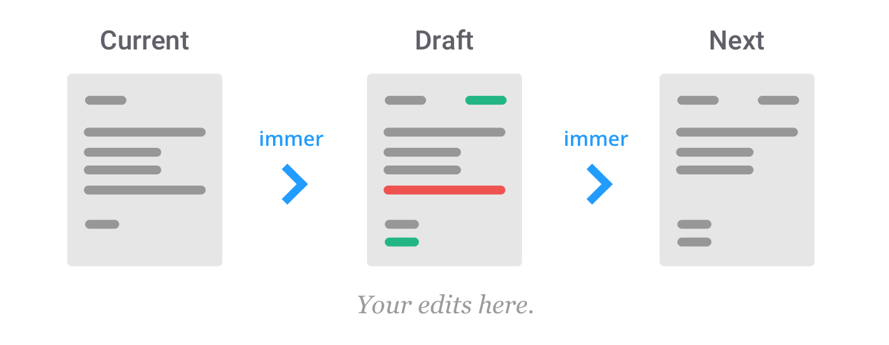
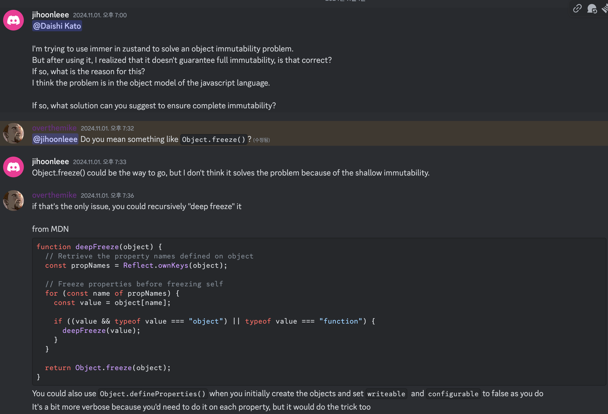

이번 포스팅에서는 Zustand의 immer 미들웨어가 내부적으로 어떻게 동작하는지, 그리고 불변성이라는 개념이 왜 프론트엔드 상태 관리에서 그토록 중요한지에 대한 이야기를 해보려고 한다.

필자는 팀에서 Zustand를 주력 상태 관리 라이브러리로 사용하고 있다. 어느 날 깊게 중첩된 객체 상태를 업데이트해야 하는 상황이 생겼는데, 스프레드 연산자를 세 겹, 네 겹 중첩하다 보니 코드가 마치 피라미드처럼 쌓여가는 것이었다. (이집트 문명 체험을 하고 싶었던 건 아닌데 말이다.)

그래서 immer 미들웨어를 도입했고, 자연스럽게 "이 녀석은 대체 내부에서 어떻게 불변성을 보장하는 걸까?"라는 궁금증이 생겼다. 더 나아가 Zustand의 메인테이너인 Daishi Kato에게 직접 질문을 던지기까지 했는데, 그 과정에서 valtio라는 라이브러리까지 알게 되었다.

이 글에서는 불변성의 기본 개념부터 시작해서, immer의 Proxy 기반 변경 추적 메커니즘, Zustand immer 미들웨어의 소스 코드 분석, 그리고 valtio의 접근 방식까지 깊이 있게 다뤄볼 것이다.

<br/>

# 불변성이란 무엇이고, 왜 필요한가

불변성(Immutability)은 한번 생성된 데이터의 상태가 이후에 변경되지 않는다는 개념이다. 직접 수정을 금지하고, 변경이 필요할 때마다 새로운 객체를 생성하여 원본 데이터의 무결성을 유지하는 것이다.

"그냥 값을 바꾸면 되는데, 왜 굳이 새로운 객체를 만들어야 하는가?"라고 생각할 수 있다. 이 질문에 답하려면 React의 렌더링 메커니즘을 이해해야 한다.

React는 상태가 변경되었는지를 **참조 비교(Reference Equality)**로 판단한다. 즉, 이전 상태와 현재 상태가 같은 메모리 주소를 가리키고 있는지를 확인하는 것이다. 객체 내부의 값이 바뀌었더라도 참조가 동일하면 React는 "아무것도 안 변했네"라고 판단하고 리렌더링을 하지 않는다.

반대로, 불변성을 지켜서 새로운 객체를 생성하면 참조가 달라지므로 React가 변경을 정확하게 감지할 수 있다. 이것이 불변성이 React 생태계에서 필수적인 이유인 것이다.

<br/>

## 참조 비교는 어떻게 동작하는가

참조 비교는 메모리 관점에서 두 값이 동일한 메모리 주소를 가리키고 있는지를 확인하는 것을 의미한다. JavaScript에서 원시값(Primitive)은 값 자체를 비교하고, 참조값(Reference)은 메모리 주소를 비교한다.

```javascript
// 원시값: 값 자체를 비교
const a = 42;
const b = 42;
console.log(a === b); // true - 같은 값

// 참조값: 메모리 주소를 비교
const obj1 = { name: "John" };
const obj2 = { name: "John" };
console.log(obj1 === obj2); // false - 내용은 같지만 다른 메모리 주소

const obj3 = obj1;
console.log(obj1 === obj3); // true - 같은 메모리 주소를 가리킴
```

여기서 한 가지 더 알아야 할 것이 있다. 얕은 비교(Shallow Comparison)와 깊은 비교(Deep Comparison)의 차이다.

얕은 비교는 객체의 최상위 레벨에서만 참조를 비교한다. React의 `React.memo`나 `useMemo`, `useCallback` 등이 기본적으로 사용하는 방식이다. 깊은 비교는 객체의 모든 중첩 레벨에서 값을 재귀적으로 비교하는데, 성능 비용이 크기 때문에 일반적으로 권장되지 않는다.

이 때문에 React에서는 상태를 업데이트할 때 최상위 참조를 변경해주는 것이 중요하다. 불변 업데이트가 필요한 이유가 바로 여기에 있는 것이다.

<br/>

## 불변성을 지키지 않으면 생기는 일

비유를 하나 들어보겠다. 불변성을 지키지 않는 상태 관리는 마치 공유 구글 문서에서 실행 취소(Undo)가 작동하지 않는 상황과 같다. 여러 사람이 동시에 같은 문서를 수정하는데, 누가 무엇을 바꿨는지 추적이 안 되고, 이전 상태로 돌아갈 수도 없는 것이다.

```javascript
// 불변성을 지키지 않는 예시 - 직접 수정
const state = { user: { name: "John", address: { city: "Seoul" } } };
state.user.address.city = "Busan"; // 원본을 직접 수정

// React는 state 참조가 바뀌지 않았으므로 변경을 감지하지 못한다
```

```javascript
// 불변성을 지키는 예시 - 새 객체 생성
const newState = {
  ...state,
  user: {
    ...state.user,
    address: {
      ...state.user.address,
      city: "Busan"
    }
  }
};
// 새로운 참조가 생성되어 React가 변경을 감지할 수 있다
```

보이는가? 불변성을 지키는 코드가 얼마나 장황한지. 중첩이 깊어질수록 이 스프레드 연산자의 향연은 더욱 심해진다. (필자는 이것을 "스프레드 지옥"이라 부르고 있다.)

그렇다면 이 문제를 우아하게 해결할 방법은 없을까?

<br/>

# Zustand에서 immer 미들웨어를 사용하는 이유



<br/>

깊은 객체 구조에서 수동으로 불변성을 관리하는 것은 복잡하고 에러가 발생하기 쉽다. 특히 스프레드 연산자나 `Object.assign()` 같은 방식은 깊은 중첩 구조에서 코드가 매우 복잡해질 수 있다.

immer는 이 문제를 draft 객체라는 개념으로 해결한다. 마치 직접 객체를 수정하는 것처럼 코드를 작성하지만, 실제로는 불변 업데이트가 이루어지는 것이다.

```javascript
import create from "zustand";
import { immer } from "zustand/middleware/immer";

const useStore = create(
  immer((set) => ({
    users: [],
    addUser: (user) =>
      set((state) => {
        // 마치 직접 push하는 것처럼 보이지만,
        // 내부적으로는 새로운 배열이 생성된다
        state.users.push(user);
      }),
    updateUserCity: (userId, city) =>
      set((state) => {
        // 깊은 중첩 구조도 직관적으로 수정 가능
        const user = state.users.find(u => u.id === userId);
        if (user) user.address.city = city;
      }),
  }))
);
```

스프레드 지옥에서 벗어나 마치 뮤터블(mutable)하게 코드를 작성할 수 있다. 하지만 결과는 이뮤터블(immutable)한 새로운 상태가 생성되는 것이다. 이것이 immer의 마법인 것이다.

그렇다면 이 마법은 어떻게 구현되어 있을까? 그 비밀은 JavaScript의 Proxy에 있다.

<br/>

## Proxy: immer 마법의 핵심

본격적으로 immer의 내부를 들여다보기 전에, 그 핵심 메커니즘인 Proxy에 대해 먼저 짚고 넘어가자.

Proxy는 객체에 대한 기본 동작(속성 접근, 할당, 함수 호출 등)을 가로채고 재정의할 수 있는 JavaScript의 내장 기능이다. 원본 객체를 감싸는 일종의 "감시자" 역할을 한다고 생각하면 된다. (보안 카메라 같은 존재다. 객체에 누가 접근하고, 무엇을 바꾸는지 모두 기록한다.)

```javascript
const target = { name: "John", age: 30 };

const handler = {
  // 속성을 읽을 때 가로챈다 (get trap)
  get(target, prop) {
    console.log(`"${String(prop)}" 속성을 읽었다`);
    return Reflect.get(target, prop);
  },
  // 속성을 쓸 때 가로챈다 (set trap)
  set(target, prop, value) {
    console.log(`"${String(prop)}" 속성을 ${value}로 변경했다`);
    return Reflect.set(target, prop, value);
  },
};

const proxy = new Proxy(target, handler);

proxy.name;        // 콘솔: "name" 속성을 읽었다
proxy.age = 31;    // 콘솔: "age" 속성을 31로 변경했다
```

Proxy의 handler에는 `get`, `set`, `deleteProperty`, `has` 등 다양한 **트랩(trap)**을 정의할 수 있다. immer는 바로 이 트랩들을 활용해서 draft 객체에 대한 모든 변경 사항을 추적하는 것이다.

<br/>

## draft 객체의 정체

draft 객체는 불변성을 유지하면서도 마치 직접 객체를 수정하는 것처럼 코드를 작성할 수 있게 해주는 Proxy 기반의 임시 객체이다.

immer의 `produce` 함수가 실행되면 다음과 같은 과정이 일어난다.

1. **Proxy 생성**: 원본 상태(base state)를 감싸는 Proxy 객체, 즉 draft를 생성한다
2. **recipe 실행**: 사용자가 전달한 함수(recipe)에 draft를 넘기고, 사용자는 이 draft를 자유롭게 "수정"한다
3. **변경 추적**: Proxy의 `set` 트랩이 모든 변경 사항을 내부적으로 기록한다
4. **새 상태 생성**: recipe 실행이 끝나면, 기록된 변경 사항을 바탕으로 새로운 불변 객체를 생성한다

```javascript
import { produce } from "immer";

const baseState = {
  name: "John",
  age: 30,
  address: { city: "Seoul", zip: "12345" }
};

const nextState = produce(baseState, (draft) => {
  draft.age += 1;                  // set 트랩이 age 변경을 기록
  draft.address.city = "Busan";    // 중첩 객체의 변경도 추적
});

// baseState는 전혀 변경되지 않았다
console.log(baseState.age);           // 30
console.log(baseState.address.city);  // "Seoul"

// nextState는 변경이 적용된 새로운 객체이다
console.log(nextState.age);           // 31
console.log(nextState.address.city);  // "Busan"

// 구조적 공유: 변경되지 않은 부분은 같은 참조를 유지한다
console.log(baseState.address === nextState.address); // false (city가 변경됨)
console.log(baseState === nextState);                  // false
```

여기서 주목할 점은 **구조적 공유(Structural Sharing)**이다. immer는 변경된 부분만 새로운 객체를 생성하고, 변경되지 않은 부분은 원본의 참조를 그대로 유지한다. 이 덕분에 메모리 효율성과 불변성을 동시에 확보할 수 있는 것이다.

<br/>

# immer 내부 동작 원리: 소스 코드 깊이 파헤치기

이제 본격적으로 소스 코드를 들여다볼 차례이다. 먼저 immer의 핵심인 `produce` 함수부터 살펴보자.

## produce 함수

> [immer/src/core/immerClass.ts](https://github.com/immerjs/immer/blob/main/src/core/immerClass.ts)

immer의 `Immer` 클래스 내부에 정의된 `produce` 메서드는 세 가지 주요 단계를 거친다.

```typescript
produce(base, recipe, patchListener) {
  // 1. 커링 지원: base가 함수이면 커링된 producer를 반환
  if (typeof base === "function" && typeof recipe !== "function") {
    const defaultBase = recipe;
    recipe = base;
    // 커링된 함수를 반환
    return (base = defaultBase, ...args) =>
      this.produce(base, (draft) => recipe.call(this, draft, ...args));
  }

  // 2. 스코프 진입: 변경 추적을 위한 스코프를 생성
  const scope = enterScope(this);

  // 3. Proxy 생성: base 객체를 감싸는 draft proxy를 생성
  const proxy = createProxy(scope, base, undefined);

  // 4. recipe 실행: 사용자 코드에서 draft를 "수정"
  const result = recipe(proxy);

  // 5. 마무리: 변경사항을 적용한 새로운 불변 객체 반환
  return processResult(result, scope);
}
```

여기서 `recipe`라는 이름이 재미있다. (필자도 처음에는 "왜 레시피지?"라고 생각했는데, 요리 레시피처럼 "상태를 이렇게 저렇게 변형하라"는 지시서라는 의미인 것 같다.) 실제로 immer의 GitHub 소스에서 이 매개변수 이름이 `recipe`로 되어 있다.

커링(Currying) 지원은 Zustand의 immer 미들웨어에서 핵심적인 역할을 한다. `produce`에 함수 하나만 전달하면, 나중에 base state를 받아서 실행하는 새로운 함수를 반환하는 것이다. 이 점을 기억해두자. 곧 immerImpl을 분석할 때 다시 등장한다.

<br/>

## Proxy는 어떻게 변경을 추적하는가

> [immer/src/core/proxy.ts](https://github.com/immerjs/immer/blob/main/src/core/proxy.ts)

immer의 `createProxyProxy` 함수는 draft를 생성할 때 내부적으로 상태 추적 객체를 함께 만든다. 이 객체에는 다음과 같은 핵심 필드가 있다.

| 필드 | 역할 |
|------|------|
| `modified_` | 변경이 발생했는지 여부를 나타내는 boolean 플래그 |
| `assigned_` | 어떤 속성이 변경(set)되었거나 삭제(delete)되었는지를 추적하는 Map |
| `copy_` | 변경이 발생했을 때 생성되는 얕은 복사본 |

Proxy의 각 트랩은 다음과 같이 동작한다.

**get 트랩**: 속성을 읽을 때 호출된다. 핵심은 **지연 생성(Lazy Drafting)**이다. 중첩된 객체에 접근할 때 그 시점에서 비로소 해당 객체의 draft proxy를 생성한다. 모든 중첩 객체를 미리 프록시로 감싸는 것이 아니라, 실제로 접근하는 순간에만 프록시를 만드는 것이다. 이 전략 덕분에 깊은 중첩 구조에서도 성능이 유지된다.

**set 트랩**: 속성에 값을 할당할 때 호출된다. 새로운 값이 현재 값과 다른지 비교하고, 다르면 `prepareCopy()`를 호출하여 얕은 복사본을 생성한 뒤 `markChanged()`로 변경 플래그를 설정한다. `assigned_` Map에도 해당 속성을 `true`로 기록한다.

**deleteProperty 트랩**: 속성을 삭제할 때 호출된다. `assigned_` Map에 해당 속성을 `false`로 기록하고, 마찬가지로 변경 상태를 전파한다.

```
[사용자 코드]
draft.user.name = "Jane"
     │
     ▼
[get 트랩] draft.user에 접근 → user 객체의 draft proxy를 지연 생성
     │
     ▼
[set 트랩] name = "Jane" 할당
     ├── prepareCopy(): 얕은 복사본 생성
     ├── markChanged(): modified_ = true (부모까지 재귀적으로 전파)
     └── assigned_.set("name", true): 변경 기록
```

`markChanged()` 함수는 특히 중요하다. 변경이 발생한 노드에서 부모 방향으로 재귀적으로 올라가며 `modified_` 플래그를 전파한다. 이를 통해 최상위 produce 함수가 어느 부분에서 변경이 발생했는지를 알 수 있는 것이다.

<br/>

## Finalization: 새 상태를 어떻게 만드는가

recipe 실행이 완료되면 `processResult`를 거쳐 finalization 단계가 시작된다. 이 과정에서 immer는 변경 추적 데이터를 바탕으로 최종 불변 상태를 생성한다.

1. `modified_`가 `false`인 노드는 원본 참조를 그대로 반환한다 (구조적 공유)
2. `modified_`가 `true`인 노드는 `copy_`를 기반으로 새 객체를 생성한다
3. 자식 노드들도 재귀적으로 같은 과정을 거친다
4. `Proxy.revocable()`로 생성된 프록시를 revoke하여 더 이상 draft에 접근할 수 없게 한다

여기서 `Proxy.revocable()`의 사용이 눈에 띈다. 일반 Proxy와 달리, revocable proxy는 나중에 무효화(revoke)할 수 있다. recipe 실행이 끝난 후 draft에 접근하려 하면 에러가 발생하도록 하여, 사용자가 실수로 draft를 recipe 바깥에서 수정하는 것을 방지하는 것이다. (안전벨트 같은 존재라고 할 수 있다.)

<br/>

# Zustand immerImpl: 미들웨어의 정체

자, 이제 immer의 내부 동작을 이해했으니, Zustand의 immer 미들웨어가 어떻게 이것을 활용하는지 살펴보자.

> [zustand/src/middleware/immer.ts](https://github.com/pmndrs/zustand/blob/main/src/middleware/immer.ts)

```typescript
const immerImpl: ImmerImpl = (initializer) => (set, get, store) => {
  type T = ReturnType<typeof initializer>;

  store.setState = (updater, replace, ...a) => {
    const nextState = (
      typeof updater === "function" ? produce(updater as any) : updater
    ) as ((s: T) => T) | T | Partial<T>;

    return set(nextState, replace as any, ...a);
  };

  return initializer(store.setState, get, store);
};
```

코드가 짧다고 놀랄 수 있다. 필자도 처음 봤을 때 "이게 전부인가?"라고 생각했다. (Zustand의 미니멀리즘이 여기서도 빛을 발한다.)

하지만 이 짧은 코드 안에 핵심적인 패턴이 녹아있다. 하나씩 뜯어보자.

<br/>

## 고차 함수 패턴

`immerImpl`은 세 겹의 화살표 함수로 구성된 **고차 함수(Higher-Order Function)**이다.

```
immerImpl(initializer)          // 1단계: store creator 함수를 받는다
  → (set, get, store) => { }   // 2단계: Zustand의 store API를 받는다
    → initializer(...)          // 3단계: 수정된 setState로 initializer를 실행한다
```

Zustand에서 미들웨어는 store creator를 감싸서 새로운 store creator를 반환하는 패턴을 따른다. `set`(상태 업데이트 함수), `get`(현재 상태를 가져오는 함수), `store`(스토어 객체 자체에 대한 참조)가 Zustand 내부에서 주입되는 것이다.

<br/>

## setState 가로채기

핵심은 `store.setState`를 재정의하는 부분이다.

```typescript
store.setState = (updater, replace, ...a) => {
  const nextState = (
    typeof updater === "function" ? produce(updater as any) : updater
  ) as ((s: T) => T) | T | Partial<T>;

  return set(nextState, replace as any, ...a);
};
```

원래 Zustand의 `setState`는 새로운 상태 객체나 업데이터 함수를 받는다. immer 미들웨어는 이것을 가로채서 다음과 같이 처리한다.

**updater가 함수인 경우**: `produce(updater)`를 호출한다. 앞서 언급한 produce의 커링 기능이 여기서 빛을 발한다. `produce`에 함수 하나만 전달하면, 해당 함수를 recipe로 사용하는 새로운 producer 함수를 반환한다. 이 반환된 함수가 나중에 `set`을 통해 현재 상태를 받아 실행되는 것이다.

```javascript
// produce(updater)의 커링
// updater = (state) => { state.count += 1; }

// produce가 반환하는 것:
// (currentState) => produce(currentState, (draft) => { draft.count += 1; })
```

**updater가 객체인 경우**: Zustand의 기본 `set`처럼 부분 상태(Partial State)를 직접 전달한다. 이 경우 immer를 거치지 않는다.

마지막으로 `initializer(store.setState, get, store)`를 호출하여, 사용자가 정의한 store creator에 수정된 `setState`를 전달한다. 이로써 store 내부에서 `set`을 호출할 때마다 자동으로 immer의 `produce`가 적용되는 것이다.

<br/>

## 타입 안전성

```typescript
as ((s: T) => T) | T | Partial<T>
```

이 타입 단언(Type Assertion)이 처음에는 이해하기 어려울 수 있다. 이것은 `nextState`가 될 수 있는 세 가지 형태를 명시하는 것이다.

- `(s: T) => T`: 현재 상태를 받아 새 상태를 반환하는 함수 (produce로 감싸진 커링된 함수)
- `T`: 전체 상태 객체 그 자체
- `Partial<T>`: 상태의 일부분만 담은 객체

Zustand의 `set` 함수가 이 세 가지 형태를 모두 지원하기 때문에, immer 미들웨어도 이를 맞춰주는 것이다.

<br/>


# 그래서 immer는 완전한 불변성을 보장할까?

여기까지 읽으면 자연스럽게 떠오르는 질문이 하나 있다. "immer를 쓰면 불변성 걱정은 끝인가?"

결론부터 말하면, **아니다**. Zustand의 immer 미들웨어는 `produce` 함수가 실행되는 동안에만 불변성을 보장한다. 그 바깥에서는 여전히 JavaScript의 본질적인 한계가 존재한다.

<br/>

## JavaScript 언어적 한계

JavaScript라는 언어 자체가 불변성을 완벽하게 보장하도록 설계되지 않았다. 몇 가지 근본적인 문제를 살펴보자.

**1. 객체는 기본적으로 참조 전달이다**

얕은 복사만으로는 깊은 중첩 객체의 불변성을 보장할 수 없다. `const`도 참조의 재할당만 막을 뿐, 내부 속성 변경은 막지 못한다.

```javascript
const obj = { inner: { value: 1 } };
obj.inner.value = 2; // const인데도 변경 가능!
```

**2. Object.freeze()는 얕은 동결만 제공한다**

```javascript
const frozen = Object.freeze({ inner: { value: 1 } });
frozen.inner.value = 2; // strict mode가 아니면 에러도 안 난다!
```

**3. 배열 메서드의 함정**

`push`, `pop`, `splice`, `sort`, `reverse` 등 많은 배열 메서드가 원본을 직접 수정한다. (사실 이건 나쁜 습관이기도 한데, 생각보다 많은 개발자가 어떤 배열 메서드가 원본을 변경하는지 정확히 인지하지 못하고 있다.)

**4. 프로토타입 체인을 통한 우회**

프로토타입을 통한 우회적 접근이 가능하고, 상속된 속성은 예상치 못한 부수 효과를 초래할 수 있다.

<br/>

## produce 바깥에서의 위험

immer의 produce 내부에서는 Proxy가 모든 변경을 추적하고 안전하게 관리한다. 하지만 produce 바깥에서는 아무런 보호 장치가 없다.

```javascript
const useStore = create(
  immer((set) => ({
    data: { nested: { value: 1 } },
    // produce 안에서는 안전
    safeUpdate: () => set((state) => { state.data.nested.value = 2; }),
    // 하지만 이런 실수는 막을 수 없다
    getDataRef: () => get().data,
  }))
);

// 외부에서 참조를 가져와 직접 수정하면?
const dataRef = useStore.getState().data;
dataRef.nested.value = 999; // immer가 관여하지 않는 직접 수정!
```

이런 상황에서 어떻게 대응해야 할까? 필자는 Zustand Discord에 직접 이 질문을 던져보았다.



Discord 커뮤니티에서는 특별한 문제가 없다면 `Object.freeze()`를 사용하라는 제안을 받았다. 성능상에 큰 문제가 없는지 재질문을 했더니, 성능에 많은 영향을 주지 않는다는 답변도 받았다.

그런데 이야기는 여기서 끝나지 않았다. 이틀 뒤, Zustand의 메인테이너인 **Daishi Kato**가 직접 답변을 달았다. immer로는 완전한 불변성 보장이 힘들기에 **valtio**를 만들었다는 것이다.


Zustand를 만든 사람이 "불변성을 제대로 보장하려면 내가 만든 다른 라이브러리를 보라"고 한 것이다. (이건 마치 셰프가 "이 레스토랑 음식도 좋지만, 진짜 제대로 된 건 옆집에 있어요"라고 말하는 것과 같다.)

그래서 필자도 valtio를 알아보러 갔다.


<br/>

# valtio: 프록시 기반 상태 관리의 다른 접근

Zustand의 immer를 파헤치다가 여기까지 왔다. 조금만 더 힘내보자.

valtio와 Zustand + immer 조합의 가장 큰 차이점은 **Proxy의 수명(lifetime)**에 있다. 이것이 두 라이브러리의 철학을 근본적으로 갈라놓는 지점이다.

<br/>

## immer의 Proxy: 일시적인 존재

immer에서 Proxy는 `produce` 함수가 실행되는 동안에만 존재하는 임시 객체이다. recipe 함수가 끝나면 Proxy는 `revoke`되어 사라진다. 변경사항을 기록했다가 한번에 새로운 불변 객체를 생성하는, 말하자면 **"일회용 감시 카메라"** 같은 존재인 것이다.

```javascript
produce(state, (draft) => {
  // 이 블록 안에서만 Proxy가 존재
  draft.count += 1;
});
// 여기서는 Proxy가 이미 사라졌다
```

<br/>

## valtio의 Proxy: 영구적인 존재

반면 valtio에서 Proxy는 상태 객체가 생성되는 순간부터 영구적으로 유지된다. 상태 자체가 곧 Proxy인 것이다. 모든 읽기와 쓰기가 항상 Proxy를 통해 이루어지므로, 상태 변경을 실시간으로 감지하고 추적할 수 있다.

```javascript
import { proxy } from "valtio";

const state = proxy({ count: 0 }); // 이 순간부터 영구적인 Proxy

state.count += 1; // Proxy가 자동으로 변경을 감지하고 구독자에게 통지
```

비유하자면 immer의 Proxy는 "필요할 때만 켜는 블랙박스"이고, valtio의 Proxy는 "항상 켜져 있는 CCTV"인 것이다. 후자가 실시간 감시에는 더 유리하지만, 그만큼 항상 동작하고 있다는 의미이기도 하다.

<br/>

## valtio의 내부 동작: proxy 함수

> [valtio/src/vanilla.ts](https://github.com/pmndrs/valtio/blob/main/src/vanilla.ts)

valtio의 `proxy` 함수는 다음과 같이 동작한다.

```typescript
export function proxy<T extends object>(baseObject: T = {} as T): T {
  const listeners = new Set<Listener>();
  const proxyObject = newProxy(baseObject, handler);
  // proxyStateMap에 상태 메타데이터를 저장
  proxyStateMap.set(proxyObject, [baseObject, ensureVersion, addListener]);
  return proxyObject;
}
```

각 프록시는 `proxyStateMap`이라는 WeakMap에 자신의 상태 메타데이터(원본 객체, 버전 추적 함수, 리스너 등록 함수)를 저장한다. 이를 통해 프록시 객체로부터 언제든지 내부 상태에 접근할 수 있는 것이다.

<br/>

## 핸들러 트랩: 변경을 어떻게 감지하는가

valtio의 Proxy 핸들러에서 가장 중요한 것은 `set` 트랩이다.

```typescript
set(target: T, prop: string | symbol, value: any, receiver: object) {
  const hasPrevValue = !isInitializing() && Reflect.has(target, prop);
  const prevValue = Reflect.get(target, prop, receiver);

  // 이전 값과 새 값이 같으면 불필요한 업데이트를 방지한다
  if (
    hasPrevValue &&
    (objectIs(prevValue, value) ||
      (proxyCache.has(value) && objectIs(prevValue, proxyCache.get(value))))
  ) {
    return true;
  }

  removePropListener(prop);

  if (isObject(value)) {
    value = getUntracked(value) || value;
  }

  // 핵심: 중첩된 객체도 자동으로 프록시로 감싼다
  const nextValue =
    !proxyStateMap.has(value) && canProxy(value) ? proxy(value) : value;

  addPropListener(prop, nextValue);
  Reflect.set(target, prop, nextValue, receiver);
  notifyUpdate(["set", [prop], value, prevValue]);
  return true;
}
```

이 코드에서 핵심적인 부분을 짚어보겠다.

**1. Object.is() 기반 비교로 불필요한 업데이트 방지**

`objectIs(prevValue, value)`로 이전 값과 새 값을 비교한다. 값이 실제로 변경되지 않았다면 아무런 업데이트도 발생하지 않는다. 이것은 성능 최적화의 첫 번째 방어선이다.

**2. 자동 프록시 래핑 (Auto-Proxying)**

```typescript
const nextValue =
  !proxyStateMap.has(value) && canProxy(value) ? proxy(value) : value;
```

이것이 immer와의 가장 큰 차이점이다. 새로 할당되는 값이 객체이고 아직 프록시가 아니라면, 자동으로 `proxy()`로 감싼다. 즉, 중첩된 모든 객체가 항상 프록시 상태를 유지하는 것이다. immer처럼 `produce` 블록 안에서만 추적하는 것이 아니라, 상태 트리 전체가 항상 감시 상태에 있는 것이다.

**3. 구독자 알림 (notifyUpdate)**

변경이 발생하면 `notifyUpdate`를 호출하여 `["set", [prop], value, prevValue]` 형태의 연산(Operation) 정보를 구독자에게 전달한다. `deleteProperty` 트랩에서도 마찬가지로 `["delete", [prop], prevValue]` 형태로 알림을 보낸다.

<br/>

## proxy-compare: 렌더링 최적화의 비밀

그렇다면 valtio는 어떻게 컴포넌트가 사용하는 속성만 추적해서 최적화된 리렌더링을 수행할까? 그 비밀은 **proxy-compare**라는 별도의 라이브러리에 있다.

> [dai-shi/proxy-compare](https://github.com/dai-shi/proxy-compare)

proxy-compare는 "어떤 속성에 접근했는지"를 추적하는 라이브러리이다. valtio의 `useSnapshot` 훅이 내부적으로 이것을 사용한다.

동작 원리는 다음과 같다.

1. `useSnapshot`이 상태의 스냅샷을 반환할 때, proxy-compare의 `createProxy`로 한 번 더 감싼다
2. 컴포넌트의 렌더링 과정에서 접근한 속성들이 `affected` WeakMap에 기록된다
3. 상태가 변경되면, `isChanged` 함수가 `affected`에 기록된 속성만 비교한다
4. 접근하지 않은 속성이 변경되었다면 해당 컴포넌트는 리렌더링하지 않는다

```javascript
import { proxy, useSnapshot } from "valtio";

const state = proxy({ name: "John", age: 30, email: "john@example.com" });

function NameComponent() {
  const snap = useSnapshot(state);
  // snap.name만 접근 → name이 변경될 때만 리렌더링
  return <div>{snap.name}</div>;
}

// state.age = 31; → NameComponent는 리렌더링되지 않는다
// state.name = "Jane"; → NameComponent가 리렌더링된다
```

이것은 매우 세밀한 수준의 렌더링 최적화이다. Zustand에서는 selector를 작성하여 필요한 상태만 구독하는 방식으로 비슷한 효과를 얻을 수 있지만, valtio는 이것을 자동으로 해주는 것이다.

<br/>

## 스냅샷과 버전 관리

valtio의 `snapshot` 함수는 현재 프록시 상태의 읽기 전용 복사본을 생성한다.

```typescript
export function snapshot<T extends object>(proxyObject: T): Snapshot<T> {
  const [target, ensureVersion] = proxyState as ProxyState;
  return createSnapshot(target, ensureVersion()) as Snapshot<T>;
}
```

여기서 **버전 번호(version)**가 핵심이다. 상태가 변경될 때마다 버전이 증가하고, 스냅샷은 버전별로 캐싱된다. 같은 버전에 대해 `snapshot`을 여러 번 호출해도 동일한 캐시된 객체를 반환하므로 불필요한 객체 생성이 발생하지 않는다.

또한 구독자 알림은 기본적으로 `Promise.resolve()`를 통해 비동기적으로 배치(batch) 처리된다. 여러 속성을 연속으로 변경해도 하나의 알림으로 묶이는 것이다. 이는 React의 배치 업데이트 메커니즘과도 잘 어우러진다.

<br/>

## valtio의 장점 정리

valtio가 가진 구조적 장점을 정리하면 다음과 같다.

**메모리 효율성**: 프록시를 지속적으로 유지하면서 실제 변경된 부분만 업데이트한다. `targetCache`와 `snapCache`를 활용하여 불필요한 객체 재생성을 방지한다.

**자동화된 렌더링 최적화**: proxy-compare를 통해 컴포넌트가 접근한 속성만 추적하므로, selector를 수동으로 작성하지 않아도 최적화된 리렌더링이 이루어진다.

**직관적인 API**: 상태를 직접 수정하는 것처럼 코드를 작성하면 된다. `produce`로 감싸거나 `set` 함수를 호출할 필요가 없다.

**실시간 변경 추적**: 상태 변경이 항상 프록시를 통해 이루어지므로, 외부에서 실수로 직접 수정하는 문제를 원천적으로 차단한다.

<br/>

## 그렇다면 valtio를 당장 도입해야 할까?

필자는 valtio가 기술적으로 우수한 라이브러리라고 생각한다. 하지만 몇 가지 고려해야 할 점이 있다.

첫째, TypeScript 타입 추론에서 Proxy 기반 라이브러리 특유의 제약이 존재할 수 있다. Proxy로 감싸진 객체의 타입이 원본과 미묘하게 달라지는 경우가 있기 때문이다.

둘째, 생태계와 커뮤니티 규모에서 Zustand에 비해 아직 작은 편이다. 문제가 발생했을 때 참고할 수 있는 자료가 상대적으로 적을 수 있다.

셋째, 기존 Zustand 기반 코드베이스에서의 마이그레이션 비용도 무시할 수 없다.

물론 실시간 변경을 주로 다루거나, 깊은 중첩 구조의 상태를 빈번하게 업데이트하는 상황이라면 valtio가 더 적합할 수 있다. 중요한 것은 프로젝트의 요구사항에 맞는 도구를 선택하는 것이다.

<br/>

# 마무리

이번 글에서는 불변성의 기본 개념부터 시작하여, immer가 Proxy를 통해 어떻게 변경을 추적하고 새로운 불변 객체를 생성하는지, Zustand의 immer 미들웨어가 `setState`를 가로채서 `produce`의 커링 기능을 어떻게 활용하는지, 그리고 valtio가 영구적인 Proxy와 proxy-compare를 통해 어떻게 더 근본적인 수준에서 불변성과 렌더링 최적화를 달성하는지를 살펴보았다.

정리하면 이렇다.

| | immer (Zustand 미들웨어) | valtio |
|---|---|---|
| Proxy 수명 | produce 실행 중에만 일시적 | 상태 생성 시부터 영구적 |
| 불변성 보장 범위 | produce 블록 내부만 | 상태 트리 전체 |
| 변경 감지 | set 트랩 + modified_ 플래그 | set 트랩 + 실시간 구독자 알림 |
| 렌더링 최적화 | selector 수동 작성 | proxy-compare 자동 추적 |
| 중첩 객체 처리 | 지연 생성 (접근 시 draft 생성) | 자동 프록시 래핑 |

불변성은 React 개발에서 피할 수 없는 주제이다. 어떤 도구를 사용하든 그 도구가 불변성을 어떤 범위에서, 어떤 메커니즘으로 보장하는지를 이해하는 것이 중요하다. 도구의 한계를 알아야 그 한계를 보완할 수 있기 때문이다.

이 글을 읽는 독자분들도 각자의 프로젝트 상황에 맞는 최적의 선택을 찾아보기를 바란다. 정답은 없다. 다만 더 나은 선택이 있을 뿐이다.

```toc

```
