En esta publicación quiero hablar de una herramienta llamada Biome.

El equipo en el que trabajo tenía bastantes dificultades para mantener un estilo de código coherente en un entorno donde se usaban distintos IDE, como WebStorm y VSCode. También resultaba tedioso gestionar archivos de configuración separados para cada IDE, y era frecuente que en las revisiones de código surgieran observaciones sobre diferencias de formato sin relación con la lógica.

En esta situación, las reglas de formato de ESLint quedaron Deprecated y tuvimos que buscar una alternativa nueva. La combinación **Prettier + ESLint** exigía configuración adicional para evitar conflictos entre ambas herramientas, mientras que **@stylistic/eslint-plugin-ts** todavía se encontraba en una etapa temprana dentro de la comunidad y no contaba con suficiente validación de estabilidad. Fue entonces cuando Biome despertó nuestro interés.

Entonces, ¿qué es exactamente Biome y de verdad puede reemplazar a ESLint y Prettier?

<hr>

## ¿Qué es Biome?

Biome es una toolchain todo en uno (All-in-One) para proyectos web. Ofrece de forma integrada el formateo y linting de código JavaScript, TypeScript, JSX, CSS, JSON, GraphQL y más desde una única herramienta. Su filosofía central consiste en resolver con un solo binario las funciones que antes desempeñaban ESLint y Prettier por separado.

El antecesor de Biome fue [Rome](https://github.com/rome/tools). **Rome Tools Inc.** arrancó con grandes ambiciones tras recaudar 4,5 millones de dólares de inversión de riesgo en 2021, pero a mediados de 2023 despidió a toda su plantilla y archivó el repositorio. Después, los principales contributors hicieron un fork del proyecto y lo relanzaron como Biome en agosto de 2023. Tras dejar atrás la imagen de Rome de «prometer demasiado y cumplir poco», ha ido ganando confianza con releases prácticas y constantes.

Su característica más destacada es que está escrito en Rust. Más adelante veremos en detalle qué diferencia supone esto para el rendimiento.

<hr>

## ¿Por qué usar Biome?

Los motivos para elegir Biome pueden resumirse en tres puntos principales.

**Una sola herramienta se encarga tanto del formateo como del linting.** Con la combinación ESLint + Prettier hacía falta configuración adicional, como `eslint-config-prettier`, para impedir conflictos entre las reglas de ambas herramientas. Biome elimina esa complejidad desde la raíz.

**Su rendimiento es abrumador.** Según los benchmarks oficiales, es unas 25 veces más rápido que Prettier y unas 15 veces más rápido que ESLint. Más adelante compararemos directamente qué representan estas cifras en la práctica.

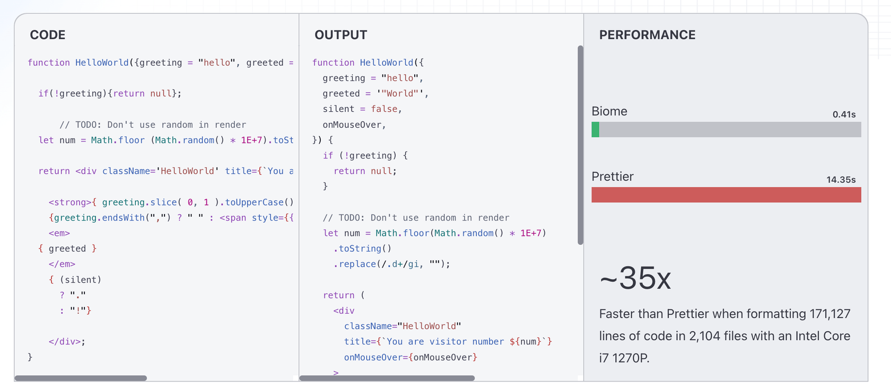

**Es compatible con las herramientas existentes.** Ofrece aproximadamente un 97 % de compatibilidad de formato con Prettier e incluye de serie las principales reglas de ESLint. También incorpora reglas de plugins habituales como `eslint-plugin-react-hooks` y `eslint-plugin-jsx-a11y`, por lo que la carga de la migración es relativamente pequeña.

<hr>

## ¿Cómo se utiliza?

Configurar Biome es bastante sencillo. La [documentación oficial](https://biomejs.dev/guides/getting-started/) lo explica con claridad, así que conviene consultarla.

Primero, instala Biome.

```bash
npm install --save-dev --save-exact @biomejs/biome
```

A continuación, genera el archivo de configuración.

```bash
npx @biomejs/biome init
```

Esto crea un archivo `biome.json`. En él puedes definir las reglas de formateo y linting del equipo.

También hay que instalar una extensión para el IDE. Si utilizas VSCode, instala [VSCode Biome](https://marketplace.visualstudio.com/items?itemName=biomejs.biome); si utilizas WebStorm, instala el plugin [WebStorm Biome](https://plugins.jetbrains.com/plugin/22761-biome).

Por último, añade la siguiente configuración al `settings.json` de VSCode para aplicar automáticamente el formateo y el linting cada vez que guardes.

```json
{
  "editor.defaultFormatter": "biomejs.biome",
  "editor.codeActionsOnSave": {
    "quickfix.biome": "explicit",
    "source.organizeImports.biome": "explicit"
  }
}
```

<hr>

## Hagamos una comparación directa

Decir simplemente que es rápido no permite apreciar la diferencia, así que comparé directamente Biome con ESLint + Prettier en el mismo proyecto. Biome aparece a la izquierda y ESLint + Prettier a la derecha.

### Tiempo de ejecución local de un proyecto Vite

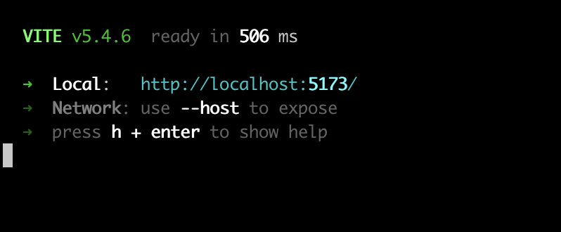  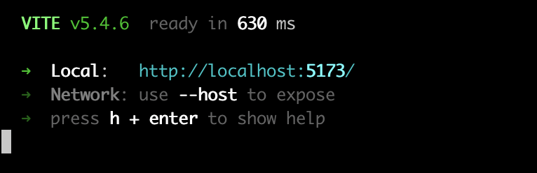


Biome tardó **506ms**, frente a los **630ms** de ESLint + Prettier, lo que supone un tiempo de ejecución aproximadamente un 20 % más rápido.

<hr>

### Tiempo de build de un proyecto Vite

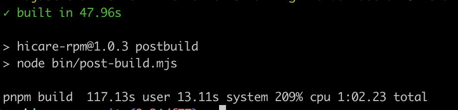 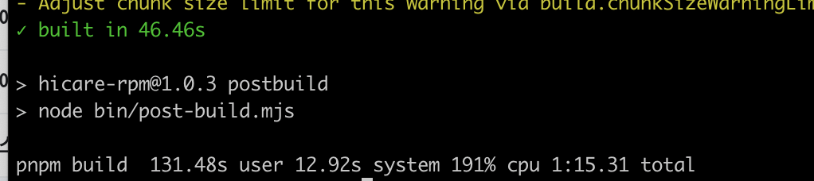


Biome tardó **117.13s**, frente a los **131.48s** de ESLint + Prettier, lo que supone un tiempo de build aproximadamente un 10 % más rápido.

<hr>

### Tarea de linting

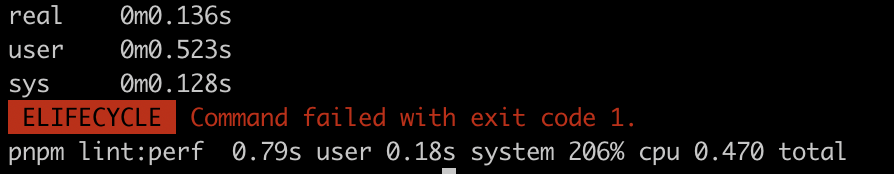 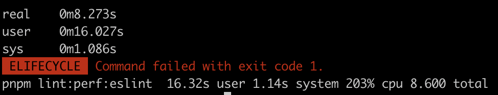

La mayor diferencia apareció en la tarea de linting. Biome tardó **0.79s** (CPU 0.470s), mientras que ESLint tardó **16.32s** (CPU 8.600s), por lo que **Biome ofreció un rendimiento unas 20 veces mayor**. El uso de CPU también fue mucho más eficiente.

La diferencia ya se percibe claramente en el entorno de desarrollo, pero se vuelve aún más drástica cuando una pipeline de CI/CD comprueba cientos de archivos. Como Biome puede ejecutar directamente su binario sin instalarlo mediante npm, también permite ahorrar tiempo en el cold start de CI.

<hr>


Mmm... (A estas alturas, es más difícil encontrar un motivo para no usarlo.)

<hr>

## ¿Por qué es tan rápido?

«Es rápido porque está hecho con Rust» es una afirmación correcta, pero no basta para explicarlo. Veamos los factores técnicos concretos que generan la ventaja de rendimiento de Biome.

<hr>

### Rendimiento de bajo nivel de Rust

| 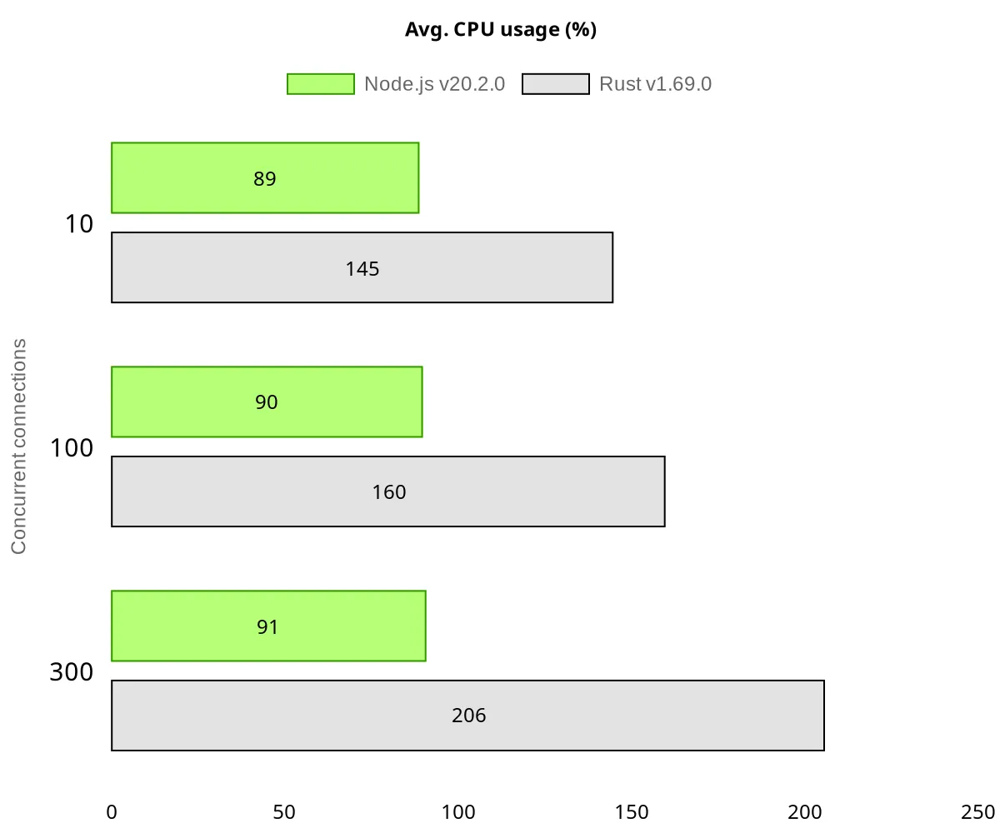 |  |
| --- | --- |

Biome está escrito en Rust, un lenguaje de programación de sistemas. Rust busca abstracciones de coste cero (Zero-cost Abstraction), de modo que incluso las abstracciones de alto nivel ofrecen el mismo rendimiento que el código de bajo nivel optimizado manualmente. Además, como administra la memoria mediante un sistema de ownership sin garbage collector (GC), no sufre el overhead de runtime provocado por el GC.

En cambio, ESLint y Prettier están escritos en JavaScript y se ejecutan sobre el runtime de Node.js. Aunque la compilación JIT (Just-In-Time) del motor V8 optimiza JavaScript, no puede evitar por completo las limitaciones fundamentales de un lenguaje interpretado ni el coste de la recolección de basura.

<hr>

### Arquitectura de parsing único

Biome analiza el código una sola vez con un único parser para generar un AST (Abstract Syntax Tree, árbol de sintaxis abstracta). Después reutiliza ese AST tanto para el formateo como para el linting.

¿Qué ocurre cuando se usa la combinación ESLint + Prettier? ESLint analiza el código, crea un AST y realiza el linting; después, Prettier vuelve a analizar el mismo código, crea otro AST y realiza el formateo. Es decir, el mismo archivo se analiza dos veces. La arquitectura de parsing único de Biome elimina esta duplicación desde el origen.

<hr>

### Procesamiento paralelo nativo

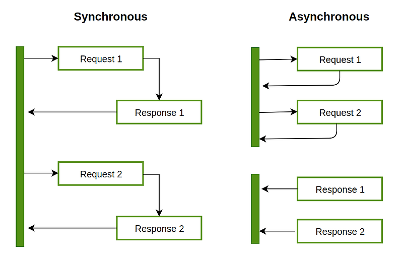

Biome aprovecha el modelo de concurrencia de Rust para procesar archivos en paralelo mediante varios threads. Divide el trabajo en unidades pequeñas y distribuye eficientemente la carga entre los threads con un scheduler de work-stealing. Como el sistema de ownership de Rust impide los data races en tiempo de compilación, también se minimiza el coste de sincronización durante el runtime.

Node.js utiliza por defecto un modelo single-thread basado en un event loop. Es posible procesar en paralelo mediante Worker Threads, pero esto introduce overhead adicional por la creación de threads y el message passing. Biome utiliza directamente threads nativos a nivel del sistema operativo, por lo que puede aprovechar al máximo los núcleos de CPU sin ese overhead.

<hr>

### Procesamiento de AST eficiente en memoria

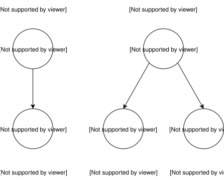

Biome utiliza un CST (Concrete Syntax Tree, árbol de sintaxis concreta). Según la documentación oficial de arquitectura de Biome, este CST implementa el patrón Green/Red Tree sobre un fork interno de la biblioteca rowan y conserva toda la información del código original, incluidos comentarios y espacios en blanco. La asignación de memoria al estilo arena de rowan coloca los nodos en regiones contiguas de memoria, mejora la localidad de caché (Cache Locality) de la CPU y minimiza asignaciones innecesarias de objetos.

En el procesamiento de AST basado en objetos de JavaScript, cada nodo existe como un objeto independiente en el heap, por lo que la memoria queda dispersa y aumenta la presión sobre el GC. El enfoque de Biome permite recorrer el árbol más rápido utilizando menos memoria.

<hr>

## Entonces, ¿conviene adoptar Biome?

El rendimiento y la comodidad de Biome son claramente atractivos. Sin embargo, no creo que adoptarlo sin condiciones sea la respuesta correcta para todos los proyectos. Veamos algunas consideraciones prácticas.

<hr>

### Cuándo encaja Biome

- Cuando mantienes una **base de código de gran tamaño** y el rendimiento del build y del linting es importante
- Cuando quieres reducir el tiempo de comprobación del código en una pipeline de CI/CD
- Cuando estás cansado de la complejidad de configurar ESLint + Prettier
- Cuando empiezas un proyecto nuevo y quieres una configuración de herramientas sencilla

Mi equipo también mantenía un proyecto de gran tamaño en el que el linting consumía mucho tiempo de la pipeline de CI, y los desarrolladores sufrían la lentitud del proceso, por lo que decidimos adoptar Biome.

<hr>

### Aspectos que requieren atención

**La mayor limitación es el ecosistema de plugins.** ESLint cuenta con miles de plugins de la comunidad, mientras que Biome se centra en reglas integradas. Incluye muchas reglas de plugins importantes como `eslint-plugin-react`, `eslint-plugin-react-hooks`, `eslint-plugin-jsx-a11y`, `eslint-plugin-unicorn` y `typescript-eslint`, pero no se han portado todas las reglas de cada plugin. Se ha anunciado para Biome v2 un sistema de plugins basado en GritQL, aunque todavía se encuentra en fase experimental. Los proyectos que necesiten reglas específicas de un framework, como `@next/eslint-plugin-next` o `eslint-plugin-angular`, deben plantear la migración con cautela.

**También hay que comprobar el alcance del soporte de lenguajes.** JavaScript, TypeScript, JSX, CSS, JSON y GraphQL tienen soporte estable, pero en los archivos SFC (Single File Component) de Vue y Svelte solo se admite parcialmente el bloque `<script>`. HTML, YAML y Markdown todavía no son compatibles.

**No hay que olvidar que ESLint también evoluciona.** Flat Config (`eslint.config.js`), introducido en ESLint v9 en abril de 2024, simplificó considerablemente la complejidad del antiguo enfoque basado en `.eslintrc`. Además, con el lanzamiento de `@eslint/json` en octubre de 2024 y `@eslint/css` en febrero de 2025, ESLint está ampliando el linting a lenguajes distintos de JavaScript. El proyecto ESLint Stylistic (`@stylistic/eslint-plugin`) ofrece una opción para gestionar el formateo solo con ESLint y sin Prettier. La ventaja «todo en uno» de Biome se está diluyendo en cierta medida a medida que evoluciona el ecosistema de ESLint.

También conviene recordar la historia de la transición de Rome a Biome. Los inconvenientes que sufrieron los usuarios existentes cuando Rome fue archivado demuestran la importancia de la sostenibilidad de un proyecto al elegir una herramienta. Por suerte, Biome se financia mediante OpenCollective y GitHub Sponsors y mantiene un ritmo constante de releases.

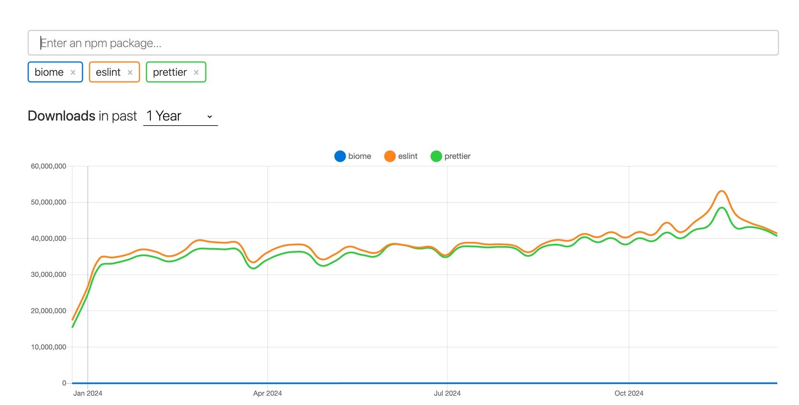

Según npm trends, las descargas semanales de Biome, alrededor de 6,9 millones, todavía están muy lejos de los aproximadamente 120 millones de ESLint y los 82 millones de Prettier. Sin embargo, la velocidad de crecimiento de Biome resulta destacable. En poco más de un año, sus descargas semanales se han multiplicado por más de tres o cuatro, y su adopción ha aumentado de forma especialmente visible en proyectos nuevos.

<hr>

## Conclusión

Mi respuesta a la pregunta de si Biome puede reemplazar por completo a ESLint y Prettier es **«todavía no, pero es una alternativa muy sólida»**.

Su rendimiento es abrumador, la configuración es concisa y el ritmo de desarrollo es rápido. Sin embargo, la inmadurez del ecosistema de plugins y las limitaciones de soporte para algunos lenguajes pueden ser obstáculos según el proyecto. Lo recomendable es revisar detenidamente el stack tecnológico del proyecto y las necesidades del equipo antes de decidir si adoptarlo.

Algo está claro: el ecosistema de herramientas frontend avanza hacia soluciones «más rápidas, más sencillas y más integradas». Es innegable que Biome está a la cabeza de esa tendencia. Sin duda, es una herramienta cuyo crecimiento futuro merece atención.

## Referencias

:::ref
:::
