IDE와 포매팅 도구의 다양성으로 인한 문제점들이 사내에서 발생하고 있었다. 

서로 다른 IDE(WebStorm, VSCode 등)를 사용하는 환경에서 일관된 코드 스타일을 유지하기가 어려웠고, IDE별로 설정 파일을 따로 관리해야 하는 번거로움이 있었다. 또한 포매팅 차이로 인해 불필요한 코드 리뷰 지적이 발생하곤 했다.

이러한 상황에서 ESLint의 포매팅 규칙들이 Deprecated되면서, 새로운 대안이 필요하게 되어, 여러 대안들을 검토해보았다.

- **Prettier + ESLint** 조합은 기존 ESLint 규칙들의 마이그레이션 문제와 도구 간 충돌 방지를 위한 추가 설정이 필요함
- **@stylistic/eslint-plugin-ts는** 아직 커뮤니티 초기 단계라 안정성 검증이 부족하고 별도 플러그인 관리에 대한 부담이 있음

이런 상황에서 Biome이라는 도구에 관심을 가지게 되었다. 

Biome은 웹 프로젝트를 위한 고성능 툴체인으로, JavaScript, TypeScript, JSX 등의 코드 포매팅과 린팅을 통합적으로 제공하는 도구다. ESLint와 Prettier의 기능을 통합적으로 제공하면서도, Rust 기반으로 개발되어 뛰어난 성능과 안정성을 보장한다.

기존에 많이 사용되던 Prettier와 97% 호환성을 자랑하며, ESLint 기능도 포함하고 있어 하나의 도구로 코드 품질 관리가 가능하다.

특히 속도와 용량 면에서 큰 장점을 보여주고 있어, 팀에서 Biome 도입을 결정하게 되었다.

그럼 이제 Biome이 정확히 무엇이고, 어떻게 사용하는지 자세히 알아보자.


<br/>


## 왜 Biome을 사용해야 할까?

하나의 도구로 포매팅과 린팅을 모두 처리할 수 있어, 복잡한 설정이 필요 없다.

그리고  Rust로 작성되어 기존 도구들보다 훨씬 빠른 속도를 보여준다. 공식 벤치마크에 따르면 Prettier보다 25배, ESLint보다 15배 빠르다고 한다.

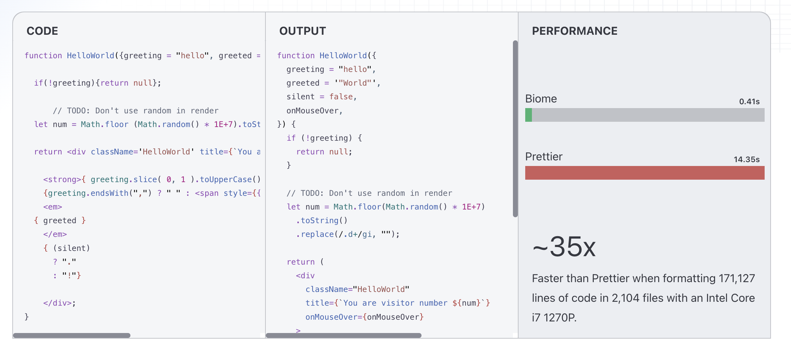

 코드 처리, 오류 표시, 캐싱 등에서 일관된 사용자 경험을 제공한다.

<br/>

## 어떻게 사용할까?

biome 설정은 아주 간단하다. **[공식 문서](https://biomejs.dev/guides/getting-started/)** 를 읽어보면 친절하게 나와있으니 참고해보자

먼저 `npm install --save-dev --save-exact @biomejs/biome` 명령어로 Biome을 설치한다.

이후 biome.json 파일을 만들기 위해 `npx @biomejs/biome init` 명령어를 실행한다.

참고로 사용하는 IDE 에서 Biome 를 사용하기 위한 익스텐션을 설치해야 한다. 

VSCode를 사용한다면 [VSCode Biome](https://marketplace.visualstudio.com/items?itemName=biomejs.biome)를 설치하고, webStorm 을 사용한다면 [webStorm Biome](https://plugins.jetbrains.com/plugin/22761-biome)을 설치하자.

이제 Biome을 사용할 준비가 되었다.

팀원들마다 사용하는 eslint, prettier 설정을 biome.json 파일에 추가하고 settings.json 설정에 아래 코드를 추가해보자.

```json
{
  "editor.defaultFormatter": "biomejs.biome",
  "editor.codeActionsOnSave": {
    "quickfix.biome": "explicit",
    "source.organizeImports.biome": "explicit"
  }
}

```

<br/>

## 사용해보며 직접 비교해보자

Biome을 사용하면서 코드 포매팅과 린팅을 통합적으로 관리할 수 있어서 편리했다. 또한 Rust로 개발되어 속도가 빠르고 안정성이 높아서 사용자 경험이 좋았다.

왼쪽이 biome, 오른쪽이 ESLint+Prettier를 사용한 코드다. 비교해보면서 분석해보자.

<br/>

### Vite 프로젝트 로컬 실행 시간

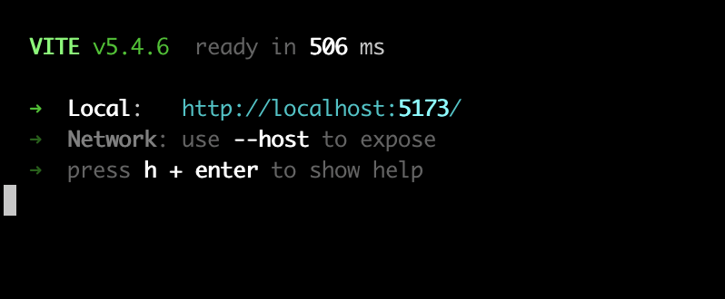 | 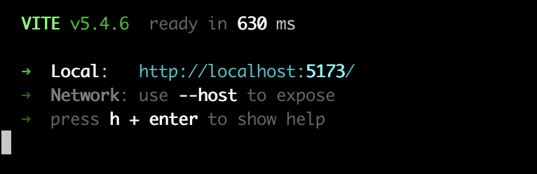
---|---|


Biome: 506ms / ESLint+Prettier: 630ms 으로 약 20% 더 빠른 실행 시간을 보여주었다.

<br/>

### Vite 프로젝트 빌드 시간

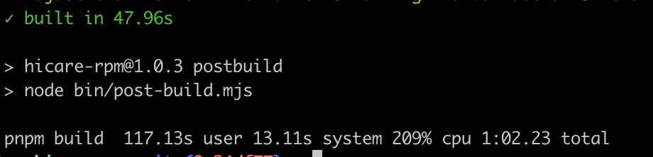 | 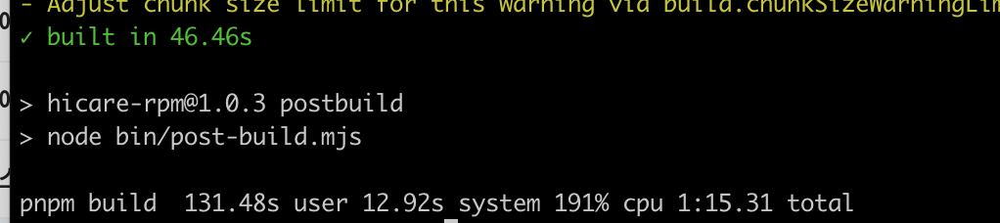
---|---|

biome: 117.13s, cpu 1:02.23 / ESLint+Prettier: 131.48s, cpu 1:15.31 으로 Biome 이 약 10% 더 빠른 빌드 시간을 보여주었다.

<br/>

### Lint 작업

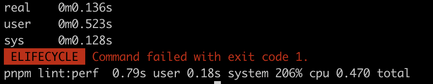 | 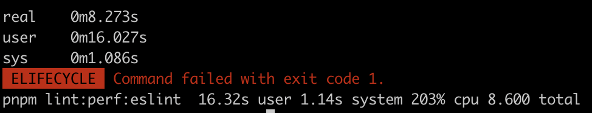
---|---|

가장 큰 차이는 Lint 작업에서 나타났다.

왼쪽 사진 Biome: 0.79s (total CPU time: 0.470), ESLint: 16.32s (total CPU time: 8.600) 으로 Lint 작업에서 Biome 이 약 20배 더 빠른 성능을 보여주었다. CPU 사용량도 훨씬 효율적이었다.

<br>

<br>


흐..음..

<br>

## 왜 성능이 더 좋을까?

나를 비롯한 대부분의 사람들이 Biome를 사용하는 이유는 성능 때문이다. 하지만 나는 Rust 기반으로 개발되어서 성능이 좋다고 알고있지만 자세하게 왜 성능이 더 좋은지 알아보지 않았다.

Biome의 성능이 더 좋은 이유에 대해 알아보자.

<br/>

### 강력한 Rust의 성능

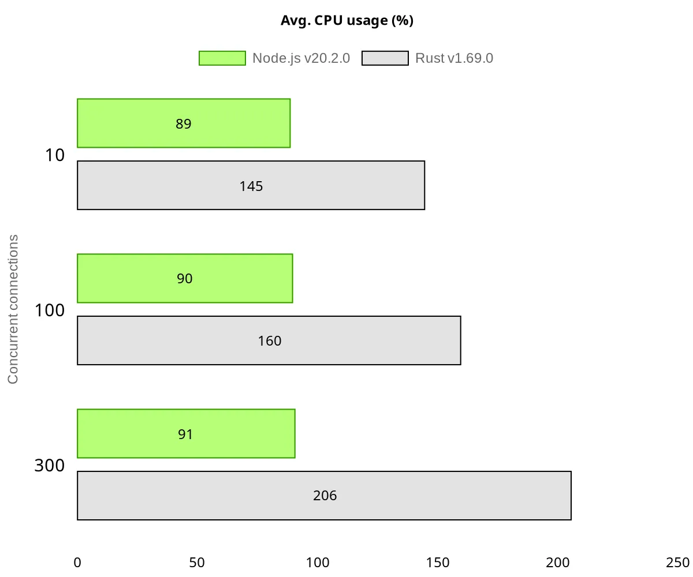 | 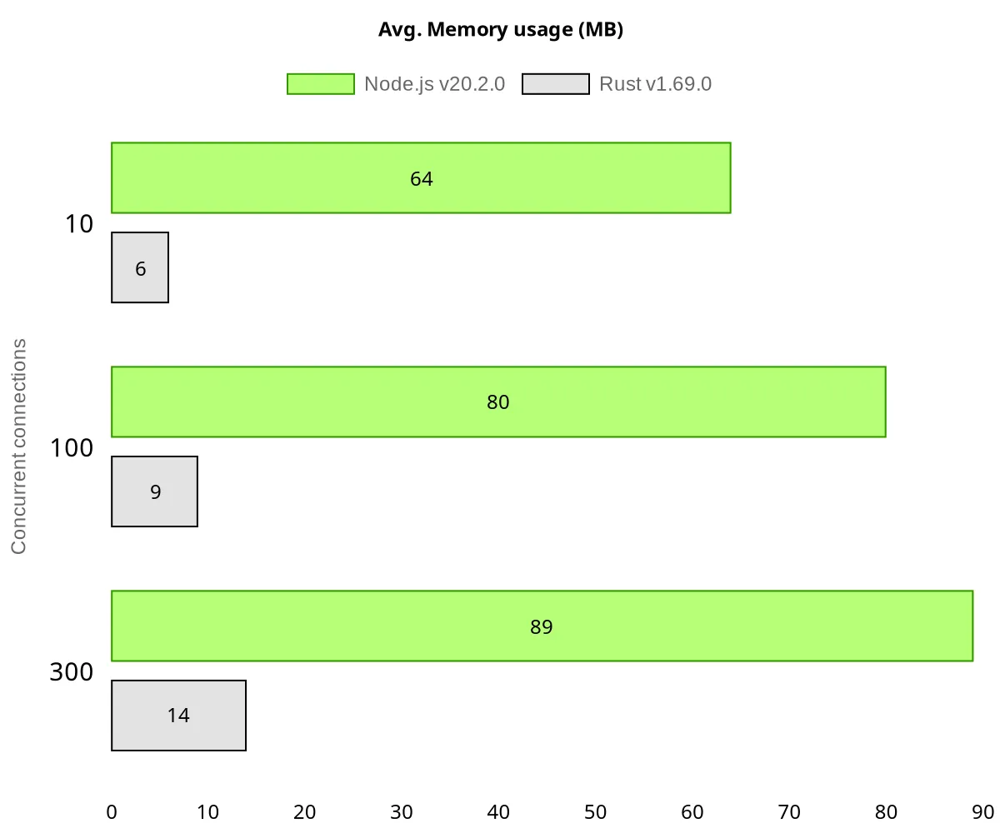
---|---|

Biome은 시스템 프로그래밍 언어인 Rust로 작성되었다. Rust는 제로 비용 추상화와 가비지 컬렉터 없이도 메모리를 안전하게 관리할 수 있는 특징을 가지고 있다.
   
반면에 ESLint와 Prettier는 JavaScript/TypeScript로 작성되어 Node.js 런타임에 의존하여, V8 엔진의 JIT 컴파일 과정과 가비지 컬렉션으로 인한 오버헤드가 발생한다.

<br/>


### 효율적인 단일 파싱 시스템

Biome은 하나의 파서로 포매팅과 린팅을 모두 처리한다. 코드를 한 번 파싱하여 생성된 AST(Abstract Syntax Tree)를 포매팅과 린팅 모두에 활용하고있다.
   
반면 ESLint와 Prettier를 함께 사용할 경우, 각각 별도의 파싱 과정을 거쳐 파일을 두 번 읽고 두 번의 파싱 과정을 거치게 된다. 그래서 Biome의 단일 파싱 시스템은 중복 작업을 제거하고 메모리 사용량을 줄여 전체적인 성능 향상을 가져온다.

<br/>


### 최적화된 병렬 처리

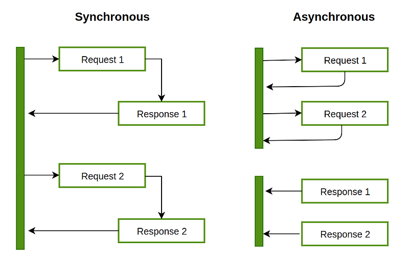

Rust의 동시성 모델을 활용하여 Biome은 병렬 처리를 구현했다. 작업을 더 작은 단위로 분할하여 여러 스레드에서 동시에 처리할 수 있으며, 락-프리 알고리즘을 사용하여 스레드 간 경쟁 상태를 최소화했다.

Node.js의 이벤트 루프 기반 비동기 처리는 기본적으로 단일 스레드에서 실행되며, Worker threads를 사용하더라도 추가적인 오버헤드가 발생할 수 있다. 따라서 Biome의 병렬 처리는 ESLint와 Prettier보다 더욱 효율적인 성능을 준다.

<br/>

### 메모리 효율적인 AST 처리

<br/>

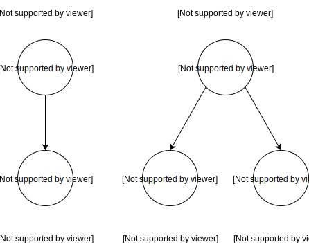

<br/>

Biome의 AST 처리 방식은 메모리 레이아웃을 최적화하고 불필요한 객체 할당을 최소화한다. 또한 효율적인 트리 순회 알고리즘을 사용하여 코드 분석 속도를 높인다. 그로 인해 JavaScript의 객체 기반 AST 처리 방식에 비해 더 적은 메모리를 사용하면서도 빠른 처리가 가능하다.

<br/>

## 그럼 Biome을 사용해야 할까?

Biome의 뛰어난 성능과 간편한 설정에도 불구하고, 모든 프로젝트에 무조건적으로 도입하는 것은 바람직하지 않다고 생각한다. 

우리 회사 처럼 대규모 프로젝트를 운영하고 있고 빌드/린트 성능이 중요한 경우, Biome은 매력적인 선택이 되었다. 특히 CI/CD 파이프라인에서 코드 검사에 많은 시간이 소요되거나, 개발자들이 느린 린팅 속도로 인해 불편을 겪고 있어, 더 도입을 서둘렀다.

하지만 Biome이 아직 지원하지 않는 플러그인이나 규칙이 있을 수 있으니, 프로젝트의 특성과 요구사항을 고려하여 도입 여부를 결정해야 한다.

이전에 **[rome](https://github.com/rome/tools) 도구**를 개발한팀이 Biome를 개발했다. 이 과정에서 rome 이 아카이빙이 되어, 기존 사용자에게 불편함을 줬다는 이야기를 들었는데, 이런 부분도 고려해야 한다고 생각한다.

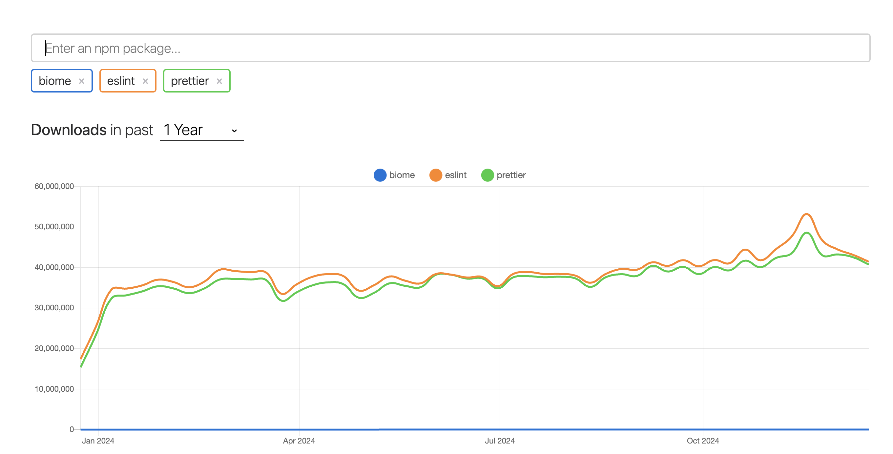

위 npm trends 를 보면 아직.. 갈길이 멀지만, 앞으로 더 많은 사용자들이 Biome을 사용하게 될 것으로 예상한다.

그래도 많은 관심 부탁!!


```toc

```
