이번 포스팅에서는 Biome이라는 도구에 대한 이야기를 해보려고 한다.

필자가 속한 팀에서는 서로 다른 IDE(WebStorm, VSCode 등)를 사용하는 환경에서 일관된 코드 스타일을 유지하는 데 꽤 어려움을 겪고 있었다. IDE별로 설정 파일을 따로 관리해야 하는 번거로움도 있었고, 포매팅 차이로 인해 코드 리뷰에서 로직과 무관한 지적이 오가는 일도 잦았다.

이런 상황에서 ESLint의 포매팅 관련 규칙들이 Deprecated되면서 새로운 대안을 찾아야 했다. **Prettier + ESLint** 조합은 도구 간 충돌을 방지하기 위한 추가 설정이 필요했고, **@stylistic/eslint-plugin-ts**는 아직 커뮤니티 초기 단계라 안정성 검증이 부족했다. 그러던 중 Biome이라는 도구에 관심을 가지게 되었다.

그렇다면 Biome은 정확히 어떤 도구이고, 정말로 ESLint와 Prettier를 대체할 수 있는 걸까?

<hr>

## Biome이 뭔데?

Biome은 웹 프로젝트를 위한 올인원(All-in-One) 툴체인이다. JavaScript, TypeScript, JSX, CSS, JSON, GraphQL 등의 코드 포매팅과 린팅을 하나의 도구에서 통합적으로 제공한다. ESLint와 Prettier가 각각 담당하던 역할을 단일 바이너리로 해결하겠다는 것이 핵심 철학이다.

Biome의 전신은 [Rome](https://github.com/rome/tools)이다. **Rome Tools Inc.** 에서 2021년 $4.5M 벤처 투자를 유치하며 야심차게 출발했지만, 2023년 중반 전 직원이 해고되고 레포지토리가 아카이브되었다. 이후 핵심 컨트리뷰터들이 프로젝트를 포크하여 2023년 8월 Biome으로 새 출발을 했다. Rome 시절의 "과대 약속, 저달성" 이미지에서 벗어나, 실용적이고 꾸준한 릴리스로 신뢰를 쌓아가고 있다.

가장 큰 특징은 Rust로 작성되었다는 점이다. 이것이 성능에서 어떤 차이를 만들어내는지는 뒤에서 자세히 다루겠다.

<hr>

## 왜 Biome을 사용해야 할까?

Biome을 선택하는 이유는 크게 세 가지로 정리할 수 있다.

**하나의 도구로 포매팅과 린팅을 모두 처리할 수 있다.** ESLint + Prettier 조합에서는 두 도구 간의 규칙 충돌을 방지하기 위해 `eslint-config-prettier` 같은 추가 설정이 필요했다. Biome은 이 복잡성을 근본적으로 제거한다.

**압도적인 성능이다.** 공식 벤치마크에 따르면 Prettier보다 약 25배, ESLint보다 약 15배 빠르다. 이 수치가 실제로 어느 정도인지는 뒤에서 직접 비교해 보겠다.

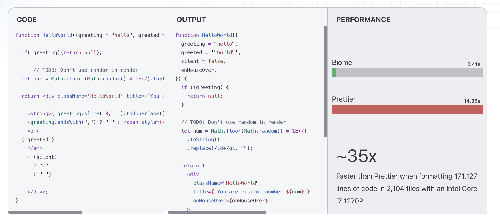

**기존 도구와의 호환성이다.** Prettier와 97% 수준의 포매팅 호환성을 제공하며, ESLint의 주요 규칙들을 빌트인으로 포함하고 있다. `eslint-plugin-react-hooks`, `eslint-plugin-jsx-a11y` 등 자주 사용되는 플러그인의 규칙들도 내장되어 있어, 마이그레이션 부담이 상대적으로 적다.

<hr>

## 어떻게 사용할까?

Biome 설정은 상당히 간단하다. [공식 문서](https://biomejs.dev/guides/getting-started/)에 친절하게 나와 있으니 참고해 보자.

먼저 Biome을 설치한다.

```bash
npm install --save-dev --save-exact @biomejs/biome
```

이후 설정 파일을 생성한다.

```bash
npx @biomejs/biome init
```

그러면 `biome.json` 파일이 생성된다. 여기에 팀의 포매팅과 린팅 규칙을 정의하면 된다.

IDE 확장 프로그램도 설치해야 한다. VSCode를 사용한다면 [VSCode Biome](https://marketplace.visualstudio.com/items?itemName=biomejs.biome), WebStorm을 사용한다면 [WebStorm Biome](https://plugins.jetbrains.com/plugin/22761-biome) 플러그인을 설치하자.

마지막으로 VSCode의 `settings.json`에 아래 설정을 추가하면 저장 시 자동으로 포매팅과 린팅이 적용된다.

```json
{
  "editor.defaultFormatter": "biomejs.biome",
  "editor.codeActionsOnSave": {
    "quickfix.biome": "explicit",
    "source.organizeImports.biome": "explicit"
  }
}
```

<hr>

## 직접 비교해 보자

말로만 빠르다고 하면 와닿지 않으니, 동일한 프로젝트에서 Biome과 ESLint + Prettier를 직접 비교해 보았다. 왼쪽이 Biome, 오른쪽이 ESLint + Prettier이다.

### Vite 프로젝트 로컬 실행 시간

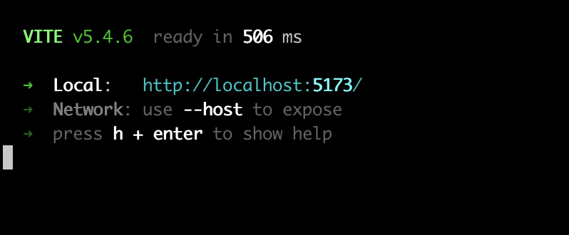  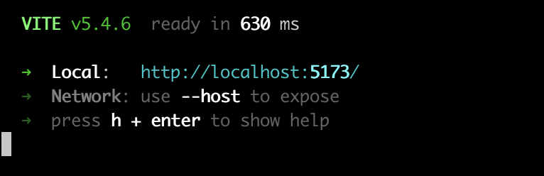


Biome: **506ms** / ESLint + Prettier: **630ms**로 약 20% 더 빠른 실행 시간을 보여주었다.

<hr>

### Vite 프로젝트 빌드 시간

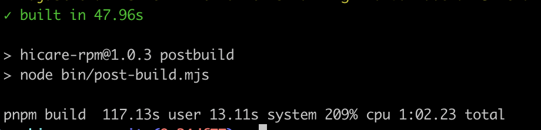 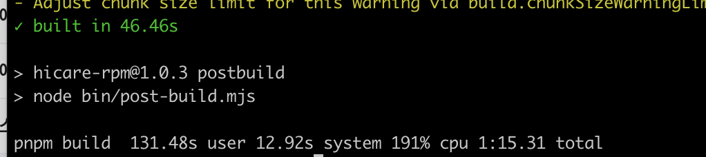


Biome는 **117.13s** / ESLint + Prettier: **131.48s** 로 약 10% 더 빠른 빌드 시간을 보여주었다.

<hr>

### Lint 작업

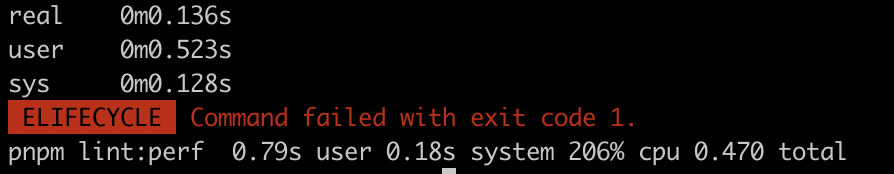 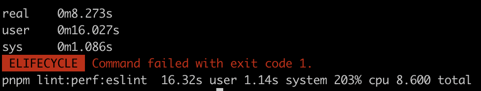

가장 큰 차이는 Lint 작업에서 나타났다. Biome: **0.79s** (CPU 0.470s), ESLint: **16.32s** (CPU 8.600s)로, **Biome이 약 20배 더 빠른 성능**을 보여주었다. CPU 사용량도 훨씬 효율적이었다.

개발 환경에서의 체감 차이도 크지만, CI/CD 파이프라인에서 수백 개의 파일을 검사할 때 이 차이는 더 극적으로 벌어진다. Biome은 npm 설치 없이 바이너리를 직접 실행할 수 있어, CI 콜드 스타트 시간까지 절약할 수 있다.

<hr>


흐..음.. (이쯤 되면 안 쓸 이유를 찾는 게 더 어렵다.)

<hr>

## 왜 이렇게 빠른 걸까?

"Rust로 만들었으니까 빠르다"는 맞는 말이지만, 그것만으로는 설명이 부족하다. Biome의 성능 우위를 만들어내는 구체적인 기술적 요인을 살펴보자.

<hr>

### Rust의 저수준 성능

| 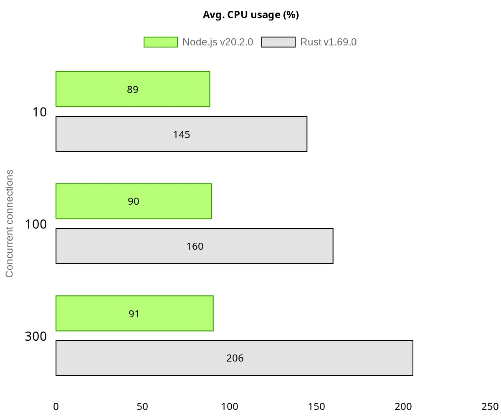 | 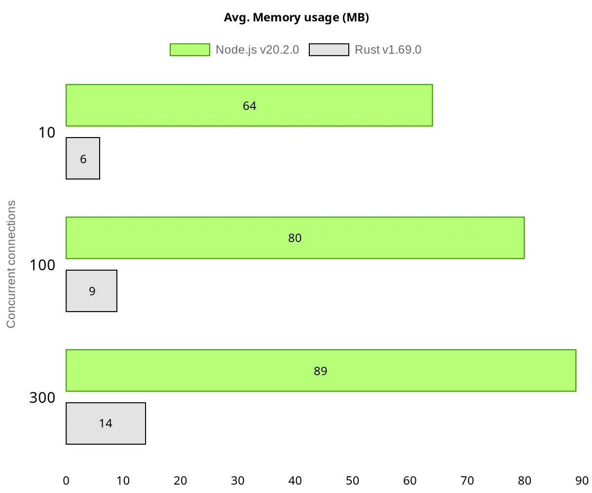 |
| --- | --- |

Biome은 시스템 프로그래밍 언어인 Rust로 작성되었다. Rust는 제로 비용 추상화(Zero-cost Abstraction)를 지향하는 언어로, 고수준의 추상화를 사용하더라도 수동으로 최적화한 저수준 코드와 동일한 성능을 낸다. 또한 가비지 컬렉터(GC) 없이 소유권(Ownership) 시스템을 통해 메모리를 관리하기 때문에, GC로 인한 런타임 오버헤드가 발생하지 않는다.

반면 ESLint와 Prettier는 JavaScript로 작성되어 Node.js 런타임 위에서 실행된다. V8 엔진의 JIT(Just-In-Time) 컴파일이 JavaScript를 최적화해 주지만, 인터프리터 언어의 근본적인 한계와 가비지 컬렉션 비용을 완전히 피할 수는 없다.

<hr>

### 단일 파싱 아키텍처

Biome은 하나의 파서(Parser)로 코드를 한 번만 파싱하여 AST(Abstract Syntax Tree, 추상 구문 트리)를 생성한다. 이 AST를 포매팅과 린팅 모두에 재사용한다.

ESLint + Prettier 조합을 사용하면 어떻게 될까? ESLint가 코드를 파싱하여 AST를 만들고 린팅을 수행한 뒤, Prettier가 같은 코드를 다시 파싱하여 별도의 AST를 만들고 포매팅을 수행한다. 동일한 파일에 대해 파싱이 두 번 발생하는 것이다. Biome의 단일 파싱 아키텍처는 이 중복을 원천적으로 제거한다.

<hr>

### 네이티브 병렬 처리

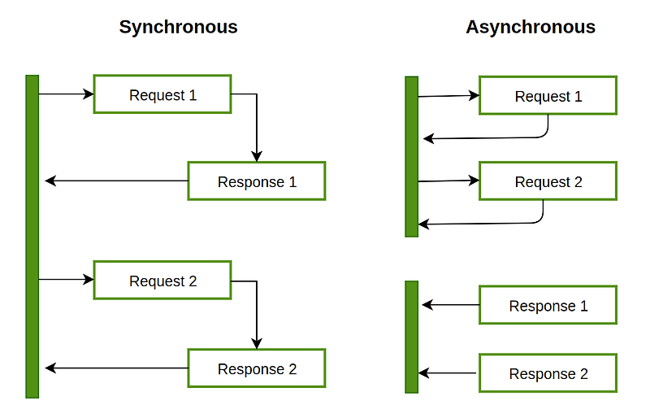

Rust의 동시성 모델을 활용하여 Biome은 파일 처리를 여러 스레드에서 병렬로 수행한다. 작업을 작은 단위로 분할하고, 작업 훔치기(Work-stealing) 스케줄러를 통해 스레드 간 부하를 효율적으로 분산한다. Rust의 소유권 시스템이 컴파일 타임에 데이터 경쟁(Data Race)을 원천 차단하기 때문에, 런타임에서의 동기화 비용도 최소화된다.

Node.js는 기본적으로 이벤트 루프 기반의 싱글 스레드 모델이다. Worker Threads를 사용하면 병렬 처리가 가능하지만, 스레드 생성과 메시지 패싱에 따른 추가 오버헤드가 발생한다. Biome은 OS 수준의 네이티브 스레드를 직접 활용하기 때문에 이런 오버헤드 없이 CPU 코어를 최대한 활용할 수 있다.

<hr>

### 메모리 효율적인 AST 처리

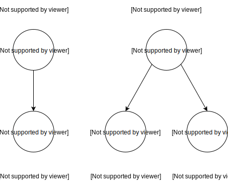

Biome은 CST(Concrete Syntax Tree, 구체 구문 트리)를 사용한다. Biome의 공식 아키텍처 문서에 따르면, 이 CST는 rowan 라이브러리의 내부 포크를 기반으로 구현된 Green/Red Tree 패턴으로, 주석과 공백 등 원본 코드의 모든 정보를 보존한다. rowan의 아레나(Arena) 스타일 메모리 할당은 노드를 연속된 메모리 영역에 배치하여 CPU 캐시 지역성(Cache Locality)을 높이고, 불필요한 객체 할당을 최소화한다.

JavaScript의 객체 기반 AST 처리 방식은 각 노드가 독립적인 힙 객체로 존재하기 때문에, 메모리가 분산되고 GC 압력이 높아진다. Biome의 접근 방식은 더 적은 메모리를 사용하면서도 더 빠른 트리 순회가 가능한 것이다.

<hr>

## 그래서, Biome을 도입해야 할까?

Biome의 성능과 편의성은 분명 매력적이다. 하지만 모든 프로젝트에 무조건 도입하는 것이 정답은 아니라고 생각한다. 몇 가지 현실적인 고려사항을 짚어보자.

<hr>

### Biome이 적합한 경우

- **대규모 코드베이스**를 운영하고 있어 빌드/린트 성능이 중요한 경우
- CI/CD 파이프라인에서 코드 검사 시간을 줄이고 싶은 경우
- ESLint + Prettier 설정의 복잡성에 지친 경우
- 새 프로젝트를 시작하면서 간결한 도구 설정을 원하는 경우

필자의 팀도 대규모 프로젝트를 운영하면서 CI 파이프라인에서 린팅에 많은 시간이 소요되고 있었고, 개발자들이 느린 린팅 속도에 불편을 느끼고 있어 Biome 도입을 결정했다.

<hr>

### 주의해야 할 점

**플러그인 생태계의 한계가 가장 크다.** ESLint에는 수천 개의 커뮤니티 플러그인이 존재하지만, Biome은 빌트인 규칙 중심으로 운영된다. `eslint-plugin-react`, `eslint-plugin-react-hooks`, `eslint-plugin-jsx-a11y`, `eslint-plugin-unicorn`, `typescript-eslint` 등 주요 플러그인의 규칙 상당수가 내장되어 있지만, 각 플러그인의 모든 규칙이 포팅된 것은 아니다. Biome v2에서 GritQL 기반의 플러그인 시스템 도입이 예고되어 있으나, 아직 실험적 단계이다. `@next/eslint-plugin-next`, `eslint-plugin-angular` 같은 프레임워크 특화 규칙이 필수적인 프로젝트라면 마이그레이션에 신중할 필요가 있다.

**언어 지원 범위도 확인이 필요하다.** JavaScript, TypeScript, JSX, CSS, JSON, GraphQL은 안정적으로 지원하지만, Vue나 Svelte의 SFC(Single File Component) 파일은 `<script>` 블록만 부분적으로 지원한다. HTML, YAML, Markdown은 아직 지원하지 않는다.

**ESLint도 진화하고 있다는 점을 잊으면 안 된다.** ESLint v9(2024년 4월)에서 도입된 Flat Config(`eslint.config.js`)는 기존 `.eslintrc` 방식의 복잡성을 대폭 간소화했다. 거기에 `@eslint/json`(2024년 10월)과 `@eslint/css`(2025년 2월)를 출시하며 JavaScript 외 언어까지 린팅 영역을 확장하고 있다. ESLint Stylistic(`@stylistic/eslint-plugin`) 프로젝트는 Prettier 없이도 ESLint만으로 포매팅을 처리할 수 있는 옵션을 제공한다. Biome의 "올인원" 장점이 ESLint 생태계의 진화로 다소 희석되고 있는 구도인 것이다.

또한 Rome에서 Biome으로 전환된 역사도 기억해 둘 필요가 있다. Rome이 아카이빙되면서 기존 사용자들이 겪은 불편함은 도구 선택에서 프로젝트의 지속 가능성이 얼마나 중요한지를 보여주는 사례이다. 다행히 Biome은 OpenCollective와 GitHub Sponsors를 통한 펀딩으로 운영되며, 꾸준한 릴리스 주기를 유지하고 있다.

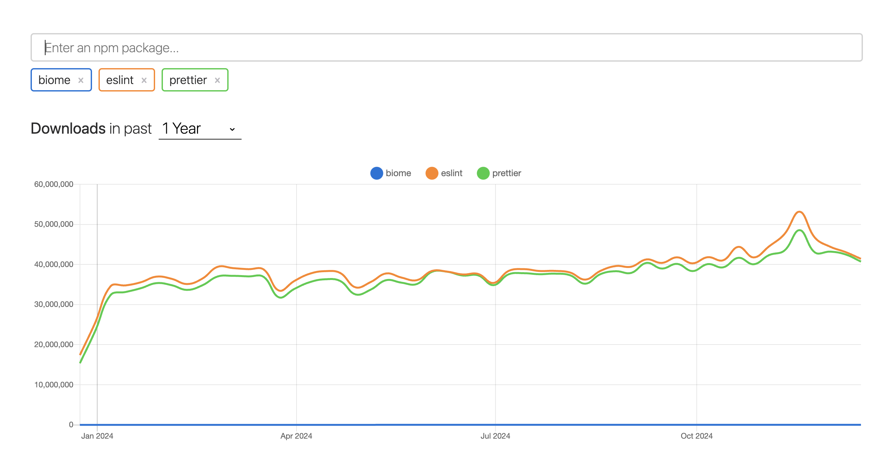

npm trends를 보면 ESLint(주간 약 1억 2,000만)와 Prettier(주간 약 8,200만) 대비 Biome(주간 약 690만)의 다운로드 수는 아직 격차가 크다. 하지만 Biome의 성장 속도는 주목할 만하다. 불과 1년여 만에 주간 다운로드가 3~4배 이상 증가했으며, 특히 신규 프로젝트에서의 채택률이 눈에 띄게 올라가고 있다.

<hr>

## 마치며

Biome이 ESLint와 Prettier를 완전히 대체할 수 있느냐는 질문에 대한 필자의 답은 **"아직은 아니지만, 충분히 유력한 대안"** 이다.

성능은 압도적이고, 설정은 간결하며, 개발 속도도 빠르다. 다만 플러그인 생태계의 미성숙함과 일부 언어 지원의 한계는 프로젝트에 따라 걸림돌이 될 수 있다. 프로젝트의 기술 스택과 팀의 요구사항을 면밀히 검토한 뒤 도입 여부를 판단하는 것이 바람직하다.

한 가지 확실한 것은, 프론트엔드 도구 생태계가 "더 빠르고, 더 간결하며, 더 통합된" 방향으로 나아가고 있다는 점이다. Biome이 그 흐름의 선두에 서 있는 것은 부정할 수 없다. 앞으로의 성장이 기대되는 도구임은 분명하다.

## 참고 자료

:::ref
:::
