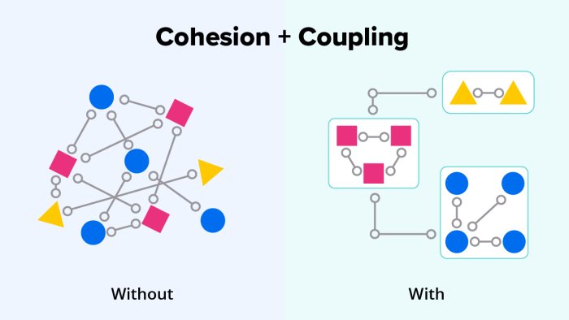

여러 프로젝트를 진행하다 보면 코드 재사용과 일관성 유지에 대한 고민들을 경험해보았을 것입니다. 저도 회사에서 Node.js 기반의 Nest와 React 프로젝트를 여러 팀이 동시에 개발하면서 비슷한 문제에 부딪혔습니다.

각 프로젝트마다 개발자들은 필요한 유틸리티 함수를 만들고 다양한 방식으로 가져와 사용했습니다. 이로 인해 다음과 같은 문제들이 발생했습니다

- 중복 코드 증가: 날짜 포맷팅, 데이터 검증 등 동일한 기능의 함수가 프로젝트마다 중복 작성되었습니다.
- 네이밍 컨벤션 불일치: 같은 기능을 하는 함수가 formatDate(), dateFormat(), convertDateFormat() 등 다양한 이름으로 존재했습니다.
- 버그 수정의 어려움: 한 함수에서 버그를 발견해도 다른 프로젝트의 유사 함수들을 모두 찾아 수정해야 했습니다.
- 불필요한 시간 소모: 각 프로젝트에서 유틸리티 함수를 찾고 사용하는 데 많은 시간이 소요되었습니다.

<br/>

디자인 시스템 측면에서도 각 프로젝트는 자체 components 폴더에서 UI 컴포넌트를 관리했고, 이는 더 큰 혼란을 가져왔습니다.

불일치하는 구현: 동일한 버튼이나 폼 요소가 프로젝트마다 다르게 구현되었습니다.
사용법 혼란: 같은 이름의 컴포넌트라도 프로젝트별로 props 구조가 달라 개발자들이 혼란을 겪었습니다.

이러한 문제를 해결하기 위해 우리는 모노레포 구조로 사내 유틸리티 라이브러리와 디자인 시스템을 통합 관리하는 방법에 대해 고민해보게 되었습니다.

이번 글에서는 모노레포 구조 내부의 유틸함수와 디자인 시스템이 어떻게 활용되는지 보다고 모노레포 구조을  어떻게 어떻게 설계했는지에 집중해서 이야기를 해보려고 합니다.

# 모노레포 구조를 어떻게 설계했고 구성했을까?

모노 레포 구조를 설계할 때 패키지를 어떻게 분리하는게 좋을까 고민했습니다. 

도메인별 관심사가 명확하게 분리((separation of concerns)가 되어있어야, 작은 차이를 다룰 수 있는 패키지 구조가 될 것이라 생각했습니다




## 모노레포 구조 설계

common-library 는  순수 JavaScript/TypeScript 환경에서 실행되는 유틸리티를 담당하고 있고, ui-components 는 React 환경에서 UI 컴포넌트를 담당하고 있습니다.

common-library는 모듈의 단일 책임을 명확하게 유지하는 것을 목표로 하고 있습니다. 

```markdow
    packages/
      ├── common-library/  # 유틸리티 함수 모음
      │   ├── lib/
      │   │   ├── array/         # 배열 조작 함수
      │   │   ├── object/        # 객체 조작 함수
      │   │   ├── string/        # 문자열 함수
      │   │   ├── function/      # 함수형 유틸리티
      │   │   ├── guard/         # 타입 가드 함수
      │   │   └── utility/       # 기타 유틸리티
      │   │
      │   └── bench/             # 성능 벤치마크 테스트
      │
      └── hicare-ui-components/  # MUI 기반 컴포넌트 라이브러리
          ├── components/
          │   ├── forms/         # 폼 관련 컴포넌트
          │   ├── data-display/  # 데이터 표시 컴포넌트
          │   ├── navigation/    # 네비게이션 컴포넌트
          │   └── feedback/      # 알림 및 피드백 컴포넌트
          │
          └── storybook/         # 컴포넌트 문서화와 시각화
```

## 순환참조 문제를 어떻게 해결했을까?

순환참조(Circular Dependency)는 모듈 간에 서로 의존하는 구조를 말한다. 

예를 들어, 모듈 A가 모듈 B를 참조하고, 모듈 B가 다시 모듈 A를 참조하는 경우인데, 이런 순환적 의존성은 불완전한 참조를 통해 예상치 못한 동작을 초래할 수 있습니다.

이런 문제를 해결하기 위해, 각 모듈은 독립적으로 설계되었으며, 필요한 경우에만 의존성을 추가했습니다.

예를 들어, `common-library`의 `lib/constant` 디렉토리에는 상수와 관련된 모듈들이 있습니다. 이들은 index.ts 파일을 두어 모든 export를 중앙에서 관리하여, 서로 의존하지 않도록 설계되어 있습니다.

그리고 `lib/types.ts` 파일에 타입과 인터페이스를 중앙화하여, 모듈 간 참조 시 구현이 아닌 인터페이스에 의존하도록 했습니다. 


## Lerna를 통한 버전 관리 

Lerna는 JavaScript/TypeScript 프로젝트의 모노레포(monorepo) 관리를 위한 도구입니다. 

모노레포는 여러 패키지가 하나의 저장소에서 관리되는 개발 방식으로, 코드 공유와 버전 관리를 효율적으로 할 수 있게 해줍니다.

Lerna는 다음과 같은 기능을 제공합니다

- 여러 패키지의 버전 관리 자동화
- 패키지 간 의존성 관리
- 하나의 저장소에서 여러 패키지의 배포 관리

프로젝트에서 lerna 를 사용하여 아래와 같은 json 파일을 만들었습니다

```json
{
    "$schema": "node_modules/lerna/schemas/lerna-schema.json",
    "version": "independent",
    "packages": ["packages/*"],
    "npmClient": "pnpm"
}
```

"version": "independent"는 각 패키지가 독립적인 버전을 가질 수 있게 해주며, 이는 패키지별로 변경 사항이 다를 때 유연한 배포를 가능하게 합니다.

```json
"scripts": {
    "test": "lerna run test --stream",
    "build": "lerna run build",
    "gen": "node ./bin/create.js",
    "publish:utils": "cd packages/common-library && pnpm build && echo '빌드완료 lerna publish patch || minor || major 를 입력하세요.'",
    "publish:design": "cd packages/design-system && pnpm build && echo '빌드완료 lerna publish patch || minor || major 를 입력하세요.'",
}
```

lerna의 버전 관리 방식인 semver(Semantic Versioning)을 살펴보면 patch,minor, major 버전으로 나뉘어 있습니다.

각 패키지는 독립적인 package.json 을 가지고 있어 자체적으로 버전을 관리하고 있습니다. 

## PNPM Workspace 활용

```yaml
packages:
    - "packages/*"
    - "!packages/hicare-common-library/bench/*"
    - "!packages/hicare-napi/bench/*"
```
pnpm-workspace.yaml 을 활용하여 모노레포 내 패키지 간 로컬 의존성을 관리

이 설정은 packages/ 디렉토리의 모든 패키지를 워크스페이스에 포함하되, 벤치마크 디렉토리는 제외하여 불필요한 의존성 설치를 방지합니다.

# 빌드 최적화와 번들 사이즈 관리

## 유틸 함수 성능 벤치마킹은 어떻게??
## ESM/CJS 듀얼 패키지 지원 구현
## 타입 정의 파일 최적화 기법


# CI/CD 파이프라인 구성

## 변경 감지 기반 선택적 빌드/테스트 전략

## Verdaccio를 활용한 프라이빗 패키지 배포 시스템

verdaccio/ 디렉토리는 프라이빗 npm 레지스트리를 구성하기 위한 설정을 담고 있습니다


```yaml
# verdaccio/config.yaml
packages:
    '@hicare/*':
        access: $authenticated
        publish: $authenticated
```

@hicare 네임스페이스의 패키지를 인증된 사용자만 접근하고 배포할 수 있게 제한


# 적용 결과 와 개선점

## 도입 후 코드 품질 및 개발 생산성 변화
## 향후 개선 계획

```toc

```
