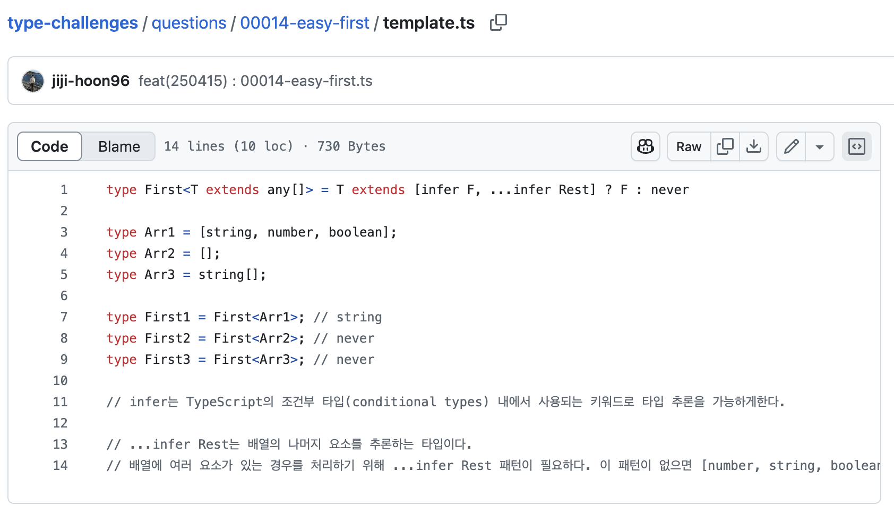
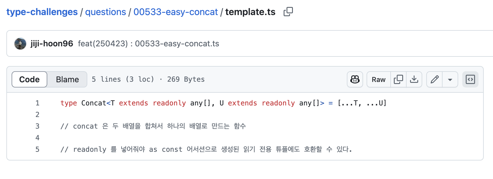

요즘 Type Challenge 를 통해 TypeScript를 공부하고있는데 빈번하게, infer 패턴과 tuple 패턴이 자주 나왔다.

|  |  |
|:---:|:---:|

단순하게, infer, tuple 이 어떻게 사용되는지 뿐 아니라, 어떤 목적으로 만들어지고 사용되고 동작하는지 알아보도록 하자.

---

# 특정 타입을 찾는 infer

위 스크린샷을 살펴보면 infer 의 역할을 예상해보자.

"infer"라는 단어 자체가 "추론하다"라는 의미를 가지고 있어서, 무언가를 자동으로 알아내거나 추측하는 기능이라고 생각할 수 있다. 그리고  "U라는 것을 추론하여 선언한다"는 의미로 해석해 let, var, const 같은 변수 선언 키워드의 일종으로 오해할 수 있다.

엄청 다르다고 할 수 없지만, infer는 TypeScript의 고급 타입 시스템에서 조건부 타입 내에서 타입을 추론하고 캡처하는 데 사용된다.

---

## 기본 개념

infer 키워드는 조건부 타입(conditional types) 내에서만 사용할 수 있으며, 타입 추론 과정에서 특정 위치의 타입을 변수로 캡처하는 역할을 한다. 이를 통해 복잡한 타입에서 특정 부분을 추출하여 재사용할 수 있다.

```ts
type 결과타입<T> = T extends 패턴<infer U> ? U : 대체타입;
```

위와 같이 사용되는데, 여기서 infer U는 패턴 매칭 과정에서 U라는 타입 변수에 실제 타입을 캡처하겠다는 의미로 사용된다.

TypeScript 컴파일러 내부에서 infer 키워드는 다음과 같은 프로세스를 살펴보자.

1. **타입 패턴 매칭**: 컴파일러는 먼저 extends 키워드의 왼쪽 타입과 오른쪽 패턴을 비교한다.
2. **타입 추론 및 캡처**: 패턴에 매칭되는 경우, infer 키워드가 있는 위치의 실제 타입을 특정하여 선언된 타입 변수(예: U)에 할당한다.
3. **결과 결정**: 패턴 매칭 결과에 따라 삼항 연산자의 결과값(참이면 캡처된 타입, 거짓이면 대체 타입)을 최종 타입으로 결정한다.


--- 

## 컴파일 타임에서의 역할

컴파일 타임에 기존 타입 시스템만으로는 어려운 타입 추론을 가능하게 한다. 그리고 타입 분해(함수, 튜플, 객체 등에서 특정 부분으로 추출)와 타입 변환 및 매핑을 가능하게 한다.

컴파일러는 infer 구문을 만나면 타입 체커를 통해 패턴 매칭 알고리즘을 실행하고, 타입 변수에 적절한 값을 바인딩하여 최종 타입을 결정한다. 이 과정은 런타임에는 완전히 제거되며, 오직 타입 검사 과정에서만 의미를 가진다.

---

## 활용해보기


### 함수 반환 타입 추출

```ts
type ReturnType<T> = T extends (...args: any[]) => infer R ? R : any;

// 사용 예
function fetchData(): Promise<string> { 
  return Promise.resolve("data");
}

type FetchResult = ReturnType<typeof fetchData>; // Promise<string>
```

---

### 함수 매개변수 타입 추출

```ts
type FirstParameter<T> = T extends (first: infer U, ...args: any[]) => any ? U : never;

// 사용 예
function handleEvent(id: number, event: Event): void {
  // 구현부
}

type IdType = FirstParameter<typeof handleEvent>; // number
```

---

### 조건부 타입 내 여러 infer을 사용

```ts
type Unpacked<T> = 
  T extends (infer U)[] ? U :
  T extends (...args: any[]) => infer U ? U :
  T extends Promise<infer U> ? U :
  T;

// 사용 예
type T1 = Unpacked<string[]>;           // string
type T2 = Unpacked<() => number>;       // number
type T3 = Unpacked<Promise<boolean>>;   // boolean
type T4 = Unpacked<string>;             // string
```

```toc

```