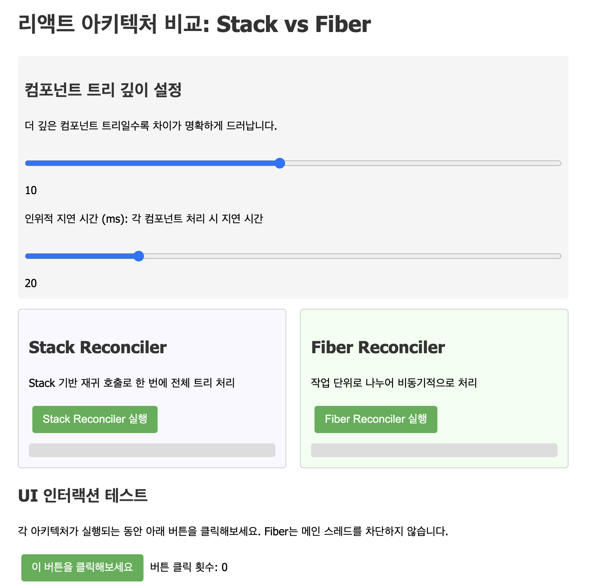
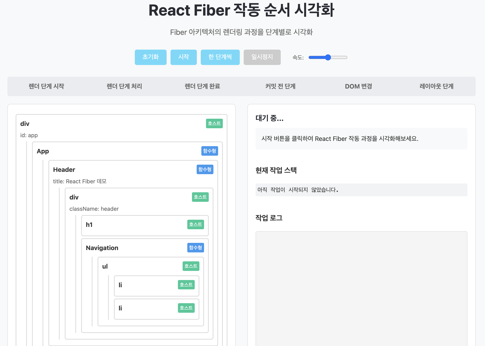

React를 최근에 접한 개발자라면 대부분 Fiber라는 용어를 한 번쯤은 들어봤을 것이다. 실제로 면접에서도 단골로 등장하는 개념이기에, 단순히 '작업 단위를 나누어 처리한다'는 식의 표면적인 설명은 많이들 알고 있다. 하지만 Fiber가 왜 등장하게 되었고, 이전에는 어떤 방식으로 React가 동작했는지, 어떻게 설계되어 있는지는 잘 모르는 경우가 많다.

이 글에서는 단순 개념 설명을 넘어, React Fiber의 내부 동작과 구조는 어떻게 구현되어 있는지를 시각 자료와 함께 깊이 있게 살펴보려 한다. 

---

## 왜 Fiber가 등장헀을까?

React 15까지는 재귀 기반의 `Stack Reconciler`를 사용했는데, 이는 다음과 같은 한계를 가졌다.

- 렌더링 중 중단 불가 (모든 트리를 한 번에 렌더)
- 애니메이션, 제스처, 레이아웃 같은 실시간 작업 대응 어려움
- UI가 복잡해질수록 성능 병목 증가
- 에러 발생 시 전체 앱 중단

이에 React 팀은 작업을 쪼개고 우선순위를 조절할 수 있는 새로운 실행 모델을 고민했고, 그렇게 탄생한 것이 React Fiber다.

[](https://animated-lollipop-2b6cbb.netlify.app/)

만약 차이점을 비교해보고싶으면 위 이미지 클릭해서 직접 확인해볼 수 있다!

처음 react-fiber-architecture 은 Andrew Clark이 제안한 개념으로, 를 참고할 수 있다.

~~이 글을 작성하고 얼마 안되어, React 팀에 합류한것으로 보인다. 그 이후 React 는 엄청난 발전을..~~

---

# Fiber

Fiber는 React의 렌더링 자체를 구성하는 런타임 아키텍처다. 다음과 같은 특징을 가진다

- **작업 단위(Unit of Work)**로 분리
- **우선순위 기반 스케줄링** 가능
- **렌더링 도중 작업 일시 중단/재개** 지원

Fiber는 **current(현재 화면을 구성 중인 트리)**와 **workInProgress(다음 렌더링을 준비 중인 트리)** 두 트리 구조를 유지한다. 이 두 트리는 alternate 속성으로 서로 연결되어, 작업 완료 시 교체된다.

```ts
currentFiber.alternate === workInProgressFiber;
```

Fiber는 JS 객체이며, 각 React Element가 Fiber로 변환된다. 

그러면 Fiber 노드 내부에서는 어떠한 구조를 가지고 있을까? 단순하게 생각해보면 노드라는 속성을 생각했을때, 노드의 타입과 key, 자식 노드들을 가지고 있는 구조를 가지고 있을 것 같다.

그러면 실제 Fiber 구조를 살펴보자.

## Fiber 구조

React Fiber 노드 구조에 관한 공식 문서를 찾아봤지만, React 팀은 Fiber의 내부 구현에 대한 공식 문서를 제공하지 않고 있다. 대신, Andrew Clark(React 팀)이 작성한 ([비공식 문서](https://github.com/acdlite/react-fiber-architecture))가 주요 참고 자료로 널리 사용된다. 

제공해준 자료 내에서 Fiber의 구조를 살펴보자

---

### type, key

Fiber 노드의 type과 key는 React 엘리먼트와 동일한 목적을 가진다.

type은 컴포넌트의 종류를 나타낸다. 함수형/클래스형 컴포넌트의 경우에는 함수나 클래스 자체를, DOM 요소의 경우에는 'div', 'span' 등의 문자열을 나타낸다.

key는 재조정 과정에서 Fiber를 재사용할 수 있는지 판단하는 데 사용된다.

--- 

### 트리 구조 (child, sibling, return)

```js
function 부모() {
  return [<자식1 />, <자식2 />];
}
```

- child: 컴포넌트의 render 메서드가 반환한 첫 번째 자식 요소
- sibling: 같은 부모를 가진 다음 형제 요소를 의미한다. 위 예제에서 자식1의 sibling은 자식2다.
- return: 현재 Fiber 처리 후 돌아갈 부모 Fiber를 의미한다. 위 예제에서 자식1과 자식2의 return은 부모다.

이 세 필드는 함께 단일 연결 리스트 형태의 트리 구조를 형성한다.

---

### pendingProps, memoizedProps

pendingProps은 Fiber 실행 시작 시점의 새로운 props, memoizedProps은 이전에 처리 완료된 props 를 의미한다.

만약 pendingProps와 memoizedProps가 같다면, 이전 출력을 재사용할 수 있어 불필요한 작업을 방지할 수 있다.

---

### 작업 우선순위 (pendingWorkPriority)

숫자 값으로 Fiber가 나타내는 작업의 우선순위를 표시한다. 0(NoWork)을 제외하고, 숫자가 클수록 우선순위는 낮아진다.

스케줄러가 다음에 처리할 작업 단위를 찾는 데 사용한다.

React Fiber의 pendingWorkPriority(현재는 lanes 시스템으로 발전)는 React에게 중요한 발전을 가져다 주었다.

이전에는 `setState` 를 호출하게 되고, 즉시 전체 트리가 재렌더링 되어 blocking 되었다.

하지만 React Fiber를 도입한 이후, `setState` 를 호출하게 되면, 해당 Fiber의 우선순위를 설정하고, 스케줄러가 다음에 처리할 작업 단위를 찾는 데 사용한다.

이렇게 되어 애니메이션, 제스처, 레이아웃 같은 실시간 작업이 가능해졌다.

그리고 점차 정교한 `lane` 시스템이 발전하여 더욱 효율적인 작업 처리가 가능해졌다.

---

### Alternate

React Fiber의 alternate 시스템은 더블 버퍼링(Double Buffering) 개념을 구현했다. 마치 비디오 게임에서 화면 깜빡임을 방지하기 위해 사용하는 기법과 비슷하다.

```js
function 위험한방식() {
  currentTree.updateDirectly(); // ❌ 위험!
}
```

만약 현재 트리를 직접 수정한다면, 화면이 깜빡임이나 불완전한 화면이 보일 수 있다.

React Fiber는 이를 방지하기 위해 현재 트리는 그대로 두고, 새로운 작업용 트리에서 변경 작업을 수행한다. 그리고 모든 작업이 완료되면 한 번에 교체한다.

Alternate Fiber는 `currentFiber.alternate === workInProgressFiber` 를 서로 참조하고 서로를 가리키는 구조를 가지고 있다.

기존 Alternate Fiber 객체를 재사용해 메모리 효율성 확보해 객체를 재사용한다. 만약 변경이 있으면 필요한 필드(변경된 필드)만 업데이트 후 새로 렌더링하고, 그렇지 않으면 이전 렌더링 결과를 재사용한다(bailout).

---

### output

output은 실제 DOM에 적용될 수 있는 구체적인 DOM 노드 정보를 의미한다.

```jsx
// 첫번째 예시
function 아바타() {
  return ; 
}
```

위 코드는 React 엘리먼트를 반환하지만, 실제 DOM은 생성되지 않는다.


```jsx
// 두번째 예시
  
<div className="프로필" /> 
```

하지만 두번째 예시는 실제 각각 DOM Image 요소와 DOM Div 요소를 생성한다.

더 자세하게 살펴보자.

```jsx
function 프로필() {
  return (
    <div className="프로필">
      <아바타 />
      <정보 />
    </div>
  );
}

function 아바타() {
  return ;
}

function 유저정보() {
  return (
    <div>
      <h2>홍길동</h2>
      <p>개발자</p>
    </div>
  );
}
```

프로필 컴포넌트는 아바타와 유저정보를 렌더링한다.

그리고 아래와 같이 Fiber 트리와 output 을 생성한다.

```
프로필 (출력: 없음, 컴포넌트 함수)
  │
  └─► div.프로필 (출력: <div class="프로필">...</div>)
       │
       ├─► 아바타 (출력: 없음, 컴포넌트 함수)
       │    │
       │    └─► img (출력: )
       │
       └─► 유저정보 (출력: 없음, 컴포넌트 함수)
            │
            └─► div (출력: <div>...</div>)
                 │
                 ├─► h2 (출력: <h2>홍길동</h2>)
                 │
                 └─► p (출력: <p>개발자</p>)
```

이제는 output 수집이 어떻게 되고 정보가 어떻게 전달되는지 살펴보자. 

처음 단계에서는 리프(호스트) 노드에서 output 이 생성된다.

여기서 호스트 컴포넌트에서만 출력이 생성되는데, 호스트 컴포넌트(div,span,img)만 브라우저가 이해할 수 있기 때문이고, 사용자 컴포넌트(프로필,아바타,유저정보)는 추상화된 개념이기때문에 브라우저가 몰라 다른 요소와 조합되거나 다른 요소로 변환된다.

```js
// 호스트 컴포넌트들이 실제 DOM 정보 생성
img_fiber.output = createDOMElement('img', {
  src: 'profile.jpg', 
  alt: '프로필'
});

h2_fiber.output = createDOMElement('h2', {}, '홍길동');
p_fiber.output = createDOMElement('p', {}, '개발자');
```

이제 부모로 부터 output 을 수집한다.

```js
// div 노드가 자식들의 출력을 수집
유저정보_div_fiber.output = createDOMElement('div', {}, [
  h2_fiber.output,  // <h2>홍길동</h2>
  p_fiber.output    // <p>개발자</p>
]);

// 최상위 div가 모든 자식 출력을 수집  
프로필_div_fiber.output = createDOMElement('div', {className: '프로필'}, [
  img_fiber.output,      // 
  유저정보_div_fiber.output   // <div><h2>홍길동</h2><p>개발자</p></div>
]);
```

마지막으로 컴포넌트는 자식의 출력을 그대로 전달한다.

```js
// 사용자 정의 컴포넌트는 자식의 출력을 위로 전달
아바타_fiber.output = img_fiber.output;
유저정보_fiber.output = 유저정보_div_fiber.output;
프로필_fiber.output = 프로필_div_fiber.output;
```

---

## Fiber의 작동 흐름 (Render vs Commit)

Fiber는 내부적으로 Render Phase와 Commit Phase를 거친다.

이 구조는 React가 UI 업데이트를 더욱 유연하고 효율적으로 제어할 수 있게 해준다. 각 단계는 서로 다른 목적과 성격을 가지며, 내부적으로는 여러 함수와 스케줄링 로직을 통해 정교하게 작동한다.

[](https://storied-centaur-55230f.netlify.app/)

Fiber의 작동흐름을 직접 확인하고싶으면 위 이미지를 클릭해서 직접 확인해볼 수 있다.

--- 

### Render Phase (비동기 가능)

- beginWork(fiber): 현재 노드에 필요한 계산 수행 (자식 Fiber 생성, props 비교 등)
  - 각 Fiber의 타입(function/class/host 등)에 따라 다른 로직 실행
    - 자식 Fiber 노드들을 생성하고 연결
    - props가 동일하면 memoization을 활용해 스킵 가능


- completeWork(fiber): 자식이 없는 경우 부모 방향으로 올라가면서 작업 마무리. DOM 작업 준비.
  - 자식이 없는 경우, DOM 생성을 준비하거나 effect 목록 생성
  - 부모 방향으로 올라가며 누락된 정보를 보완
  - 커밋 단계에서 실행할 작업을 effect list로 누적

이 단계에선 DOM 조작 없이 변경 사항 계산만 수행된다.

---

### Commit Phase (항상 동기)

- 변경 사항을 실제 DOM에 반영 (commitMutation)
- 라이프사이클 호출 (componentDidMount, useEffect)
- Effect 노드들을 연결해 선형 리스트(nextEffect) 로 처리

```toc
```