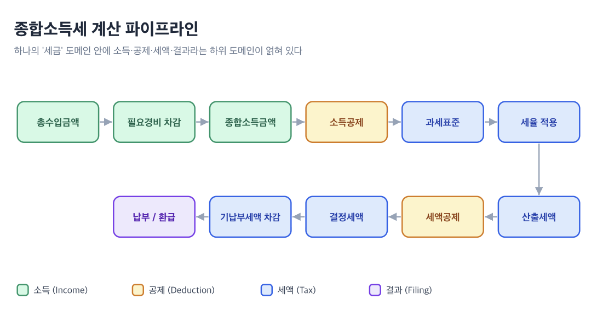

이번 포스팅에서는 **도메인(Domain)** 에 대한 이야기를 해보려고 한다.

필자는 개발을 하면서 **"도메인(Domain)"** 이라는 단어를 꽤 자주 접해왔다. 그런데 막상 "도메인이 정확히 뭔데?"라고 물어보면 명쾌하게 대답하기가 쉽지 않다. (솔직히 개발을 처음 시작했을때 도메인은 www 을 의미하는 줄 알았다.)

도메인에 대한 정보를 찾아보면 자연스럽게 **도메인 모델**, **도메인 오브젝트**, **도메인 오브젝트 모델** 같은 개념들로 이어진다. 그런데 이것들이 서로 어떻게 다른지, 그리고 이 개념들이 백엔드가 아닌 **프론트엔드**에서는 어떤 의미를 갖는지 정리된 글이 많지 않다는 점이 늘 아쉬웠다. 이 글에서는 각 개념의 정의부터 시작해, 프론트엔드에서 도메인 로직을 어떻게 분리하고 추상화하는 것이 적합한지까지 예시와 함께 정리해보려 한다.

요즘 세금 관련한 도메인에 관심이 많다. 곧 5월 종합소득세 신고가 다가오는 만큼, 이번 글의 예시는 세금에 대해 다뤄보려고 한다.

---


## 도메인(Domain)

가장 기초적인 질문부터 시작해보자. **도메인**이란 무엇인가?

Eric Evans는 그의 저서 **Domain-Driven Design: Tackling Complexity in the Heart of Software(2003)** 에서 도메인을 다음과 같이 정의한다.

> "A sphere of knowledge, influence, or activity."
> (지식, 영향력, 또는 활동의 영역)

쉽게 말해, **프로그래밍으로 해결하고자 하는 문제 영역** 그 자체가 도메인이다. 세금 신고 서비스를 만든다면 "세금 신고"가 도메인이고, 보험 청구 플랫폼을 만든다면 "보험 청구"가 도메인인 것이다. 도메인은 코드가 아니다. 소프트웨어 이전에 존재하는 현실 세계의 문제 영역이다.

프론트엔드 개발자에게 이것은 어떤 의미일까? 우리가 만드는 UI는 결국 이 도메인을 사용자에게 보여주고 조작할 수 있게 해주는 **창(window)** 이다. 세금 도메인을 메인으로 다루는 토스인컴, 삼쩜삼 같은 세금 환급 서비스를 개발한다면, 소득 유형, 경비율, 소득공제, 세액공제, 환급액이라는 도메인 개념을 UI로 표현하는 것이다. 따라서 프론트엔드 개발자도 자신이 다루는 도메인을 깊이 이해해야 한다. UI 컴포넌트를 잘 그리는 것 못지않게, **"이 서비스가 해결하는 문제가 무엇인지"** 를 아는 것이 중요하다는 뜻이다.

그런데 "세금"이라는 도메인 하나만 해도, 들여다보면 내부에 수많은 하위 도메인이 존재한다. 내가 겉으로만 알고있는 종합소득세 계산 파이프라인만 봐도 이렇다.



이 파이프라인의 각 단계가 독자적인 규칙과 데이터를 가진 하위 도메인이다. "세금"이라는 하나의 큰 도메인 안에 소득(Income), 공제(Deduction), 세액(Tax), 결과(Filing)라는 세부 도메인들이 얽혀 있는 것이다. 이것을 코드로 어떻게 나눠야 하는지가 바로 도메인 모델링의 핵심 질문이다.


## 도메인 모델(Domain Model)

그렇다면 도메인 모델은 무엇일까? 도메인이랑 "도메인 모델"은 어떻게 다른 것일까?

Martin Fowler와 Eric Evans는 도메인 모델을 이렇게 정의한다.

> An object model of the domain that incorporates both behavior and data.
> (행위와 데이터를 모두 포함하는 도메인의 객체 모델) - Martin Fowler

> A system of abstractions that describes selected aspects of a domain and can be used to solve problems related to that domain.
> (도메인의 선택된 측면을 기술하는 추상화 체계로, 해당 도메인과 관련된 문제를 해결하는 데 사용될 수 있다.) - Eric Evans

핵심은 **"선택적 추상화"** 라는 점이다. 도메인 모델은 현실 세계의 모든 것을 담지 않는다. 영화감독이 현실의 모든 장면을 담지 않고 이야기에 필요한 장면만 선택하듯, 도메인 모델도 **해결하려는 문제에 필요한 측면만 골라서 구조화**한 것이다.

여기서 중요한 점이 하나 있다. 도메인 모델은 반드시 코드일 필요가 없다. 화이트보드에 그린 다이어그램일 수도 있고, 팀원들 머릿속에 공유된 멘탈 모델(Mental Model)일 수도 있다. 결국 도메인 모델이라는 용어 자체는 소프트웨어와는 별개의 개념일 수 있다.

여기서 프론트엔드 개발자가 특히 혼동하기 쉬운 부분이 있다. API 응답 구조를 보고 "이게 도메인 모델이군"이라고 생각하는 것이다. 하지만 이는 **데이터 모델(Data Model)** 이지, 도메인 모델이 아니다.

데이터 모델과 도메인 모델을 구분해보면 아래와 같다.

| 구분      | 도메인 모델                                | 데이터 모델                                |
| --------- | ------------------------------------------ | ------------------------------------------ |
| 목적      | 비즈니스 개념과 규칙을 표현                | 저장/전송 구조를 정의                      |
| 언어      | 비즈니스 용어 (과세표준, 세액공제, 환급액) | 기술 용어 (string, number, array)          |
| 포함 요소 | 데이터 + 행위(규칙)                        | 데이터 구조만                              |
| 예시      | "과세표준 1,400만원 이하 구간은 세율 6%"   | `{ taxableBase: number, taxRate: number }` |

데이터 모델은 "어떤 형태로 데이터가 오가는가"를 정의하고, **도메인 모델은 "이 데이터가 비즈니스적으로 무엇을 의미하고 어떤 규칙을 따르는가"를 정의한다.** 이 둘을 구분하지 못하면, 컴포넌트가 API 응답 구조에 직접 의존하게 되어 백엔드 스키마가 바뀔 때마다 프론트엔드 전체가 흔들리는 상황이 벌어진다.


## 도메인 오브젝트(Domain Object)

도메인 모델이 개념의 체계라면, **도메인 오브젝트**는 그 개념이 코드로 구현된 실체이다.

Code with Jason 을 운영하고있는 [Jason Swett 의 글](https://www.codewithjason.com/difference-domains-domain-models-object-models-domain-objects/)에서 도메인 오브젝트를 이렇게 정의한다.

> Any object in my object model that also exist as a concept in my domain model I would call a domain object.
> (객체 모델에 존재하는 객체 중, 도메인 모델에서도 하나의 개념으로 자리잡고 있는 것을 도메인 오브젝트라고 부른다.)

즉, 도메인 모델에서 "종합소득"이라는 개념이 있고, 코드에서 `Income`이라는 타입이 있다면, 이 `Income`이 바로 도메인 오브젝트인 것이다. 하지만 모든 코드 객체가 도메인 오브젝트인 것은 아니다. `HttpClient`, `LocalStorageAdapter`, `useDebounce` 같은 것들은 기술적 도구이지 도메인 개념이 아니다.


### Entity와 Value Object

Evans는 도메인 오브젝트를 **Entity**, **Value Object**, **Service** 세 범주로 분류한다. (Martin Fowler는 이 분류를 "Evans Classification"이라고 부른다.) Service는 "특정 오브젝트에 자연스럽게 귀속되지 않는 도메인 연산"을 표현하는 별도 개념인데, 이 글이 다루려는 핵심은 데이터를 어떻게 식별하느냐의 문제이므로 Entity와 Value Object 두 가지를 중심으로 살펴본다.

**Entity(엔티티)** 는 시간과 다양한 표현을 관통하는 고유한 정체성을 가진 객체다. 세금 신고서(TaxFiling), 납세자(Taxpayer), 소득 내역(IncomeRecord)처럼 고유한 ID로 식별되며, 속성이 바뀌더라도 같은 ID면 같은 엔티티이다. 신고서의 공제 항목이 수정되어도, 신고서 ID가 바뀌지 않는 한 그것은 여전히 같은 신고서이다.

**Value Object(값 객체)** 는 속성의 조합으로만 의미를 가지는 객체로, 모든 속성 값이 같으면 동일한 것으로 간주한다. 금액(Money), 세율(TaxRate), 과세 구간(TaxBracket)처럼 값 자체가 의미인 객체이다. "세율 6%"는 어디에서 쓰이든 "세율 6%"일 뿐이다.

프론트엔드에서 이 구분이 왜 중요할까? 아래 코드 예시를 통해 알아보자.

```typescript
interface TaxFiling {
  id: string;
  taxpayerName: string;
  taxYear: number;
  status: FilingStatus;
}

const isSameFiling = (a: TaxFiling, b: TaxFiling) => a.id === b.id;

interface Money {
  amount: number;
  currency: "KRW" | "USD";
}

const isSameMoney = (a: Money, b: Money) =>
  a.amount === b.amount && a.currency === b.currency;
```

TaxFiling 은 id를 정체성의 기준으로 삼기에 Entity이다. (id 필드를 가지는 것 자체가 Entity의 정의가 아니라, "그 id로 같은지 다른지를 판단한다"는 점이 핵심이다.) Money 는 id 없이 amount와 currency의 조합으로만 식별되고, 모든 속성이 같으면 같은 값으로 간주된다.

Entity는 ID 기반 비교, Value Object는 속성 기반 비교. 이 구분을 명확히 하면 상태 관리에서 "이 데이터가 같은 건지 다른 건지"를 판단하는 로직이 자연스럽게 정리된다. 리스트에서 아이템을 갱신할 때 Entity라면 ID로 찾아서 교체하고, Value Object라면 불변 교체(immutable replace)를 하는 식이다.


## 도메인 오브젝트 모델(Domain Object Model)

"도메인 모델"과 "도메인 오브젝트"는 알겠는데, **도메인 오브젝트 모델**은 무엇일까?

찾아보니 의외로 합의된 정의가 없다. 상당수의 문헌에서는 "도메인 모델", "도메인 오브젝트 모델", "개념 모델(conceptual model)", "분석 오브젝트 모델(analysis object model)"을 **사실상 동의어**로 본다. 객체지향 분석 단계에서 그려지는 개념적 모델을 부르는 여러 이름이라는 입장이다.

반면 조금 더 분리된 계층으로 보는 시각도 있다. **도메인 모델이 실제 코드로 변환되는 지점이 바로 객체 모델**이라는 설명이 대표적이다.

이 두 번째 관점에서 **오브젝트 모델**은 시스템 안의 **모든 코드 객체의 구조**다. 여기에는 `HttpClient`나 `useDebounce` 같은 기술적 도구도 포함된다. 그 안에서 **도메인 개념을 표현하는 객체들의 부분집합, 그리고 그들 사이의 관계**가 바로 **도메인 오브젝트 모델**이다. "Object Model"을 시스템의 정적 구조(클래스, 속성, 연산, 관계)로 정의해온 객체지향 모델링의 전통과도 맞닿아 있다.

필자는 이쪽 관점이 프론트엔드 개발자에게 더 실용적이라고 본다. 우리가 실제 작성하는 코드에는 도메인 객체와 기술 객체가 늘 섞여 있기 때문이다.

결국 **도메인 → 도메인 모델 → 도메인 오브젝트 모델 → 도메인 오브젝트** 는 추상에서 구체로 내려가는 계층이다. 도메인이 가장 넓고, 도메인 오브젝트가 가장 구체적이다. 그래서 프론트엔드 코드를 작성할 때 우리가 실질적으로 고민하는 영역은 결국 **도메인 오브젝트 모델(도메인 개념을 표현하는 타입과 그 사이의 관계)을 어떻게 구조화할 것인가** 다.


## 프론트엔드에서 도메인 로직은 어디에 있어야 하는가?

개념 정의는 여기까지로 하고, 이제 실전 이야기를 해보자. 프론트엔드에서 도메인 로직은 **어디에** 있어야 하는 걸까?

소프트웨어 설계에 깊은 관심을 가지고 있는 [Khalil Stemmler](https://khalilstemmler.com/about/)는 처음에 "비즈니스 로직은 프론트엔드에 속하지 않는다"고 주장했다가, 이후 입장을 "백엔드에서 아키텍처적으로 하고 있는 거의 모든 것을, 프론트엔드에서도 할 수 있고 해야 한다." 라고 수정하며 말했다.

필자도 이 입장에 동의한다. 물론 프론트엔드가 비즈니스 로직의 **단일 진실 공급원(Single Source of Truth)** 이 되어서는 안 된다. 그것은 백엔드의 역할이다. 하지만 프론트엔드에도 **프론트엔드만의 도메인 로직**이 분명히 존재한다.

"사용자가 입력한 정보에 따라 실시간으로 예상 환급액을 보여줘야 하는" 경우를 생각해보자. 이런 계산 로직이 백엔드에만 존재하게 되면, 사용자가 소득 금액을 한 글자 고칠 때마다 API를 호출해야 한다. 네트워크 왕복 시간만큼 UI가 멈추고, 입력이 빠른 사용자라면 불필요한 요청이 폭발적으로 늘어난다. debounce를 건다 해도 수백 밀리초의 지연은 "실시간 미리보기"라는 경험을 깨뜨리기에 충분하다. **결국 즉각적인 피드백이 필요한 계산은 프론트엔드가 직접 수행할 수밖에 없고, 프론트엔드에서만 수행할 수 있는 로직이 존재하게된다.**


### 도메인 로직이 컴포넌트에 섞인 경우

종합소득세 미리보기 화면을 예로 들어보자. 사용자가 소득 정보를 입력하면 예상 세액을 실시간으로 보여주는 기능이다. 아래는 흔히 볼 수 있는, 도메인 로직과 UI 로직이 뒤섞인 코드이다

```tsx
function TaxPreviewPage() {
  const [총수입, set총수입] = useState(0);
  const [경비율, set경비율] = useState(0.641); 
  const [인적공제대상인원, set인적공제대상인원] = useState(1); 

  const 종합소득금액 = 총수입 - 총수입 * 경비율;

  const 소득공제합계 = 인적공제대상인원 * 1_500_000;
  const 과세표준 = Math.max(0, 종합소득금액 - 소득공제합계);

  let calculatedTax = 0;
  if (과세표준 <= 14_000_000) {
    calculatedTax = 과세표준 * 0.06;
  } else if (과세표준 <= 50_000_000) {
    calculatedTax = 과세표준 * 0.15 - 1_260_000;
  } else if (과세표준 <= 88_000_000) {
    calculatedTax = 과세표준 * 0.24 - 5_760_000;
  } else if (과세표준 <= 150_000_000) {
    calculatedTax = 과세표준 * 0.35 - 15_440_000;
  } else {
    calculatedTax = 과세표준 * 0.38 - 19_940_000;
  }

  const 기납부세액 = 총수입 * 0.033;
  const refundOrPayment = 기납부세액 - calculatedTax;

  return <div>...</div>;
}
```

이 코드의 문제가 보이는가? "인적공제 1인당 150만원", "8단계 누진세율", "3.3% 원천징수"라는 **세법에 의해 정해진 비즈니스 규칙**이 React 컴포넌트 안에 직접 박혀 있다. 세법이 매년 개정되는데, 이런 규칙이 컴포넌트에 흩어져 있으면 개정 시 수정해야 할 곳을 찾아 헤매게 된다. 개발자뿐 아니라 QA팀이 다루는 E2E 시나리오가 존재한다면 테스트 비용도 만만하지 않을 것이다.

결국 이게 뷰 로직인지 비즈니스 로직인지 구분하기 어려워지고, 수많은 조건문과 커스텀 훅으로 엉키게 된다.


### 도메인 로직을 분리해보자.

Alex Bespoyasov의 Clean Architecture 접근법에서 핵심 원칙을 빌려오자. 도메인 로직을 **프레임워크에 의존하지 않는 순수 함수**로 분리하는 것이다.

> The domain is the core that distinguishes one application from another. You can think of the domain as something that won't change if we move from React to Angular.
> (도메인은 하나의 애플리케이션을 다른 것과 구별하는 핵심이다. React에서 Angular로 옮기더라도 변하지 않는 것이라고 생각하면 된다.)

위의 세금 계산 예시를 리팩토링해보자.

먼저 도메인 타입과 규칙을 정의하여 관련한 정보를 응집한다.

```typescript
export interface Income {
  grossAmount: number;
  expenseRate: number;
}

export interface Deductions {
  personalCount: number;
  pensionPaid: number;
  additionalDeductions: number;
}

const PERSONAL_DEDUCTION_PER_PERSON = 1_500_000;
const WITHHOLDING_RATE = 0.033;
const TAX_BRACKETS = [
  { limit: 14_000_000, rate: 0.06, progressiveDeduction: 0 },
  /** ...구간들... **/
] as const;
```

그리고 도메인 로직을 순수 함수로 분리한다

앞서 소득 계산, 공제, 과세표준, 세액, 환급액 계산등의 로직을 `computeFullTax` 함수로 분리한다. 각 단계는 다시 작은 순수 함수로 쪼갠다. 결과 타입은 `ReturnType<typeof computeFullTax>`로 추론시키면 별도 인터페이스 선언이 필요 없다.

이후 컴포넌트는 도메인 로직을 "사용"만 한다

```tsx
import { computeFullTax } from "../domain/tax";

function TaxPreviewPage() {
  const [income, setIncome] = useState<Income>({
    grossAmount: 0,
    expenseRate: 0.641,
  });
  const [deductions, setDeductions] = useState<Deductions>({
    personalCount: 1,
    pensionPaid: 0,
    additionalDeductions: 0,
  });

  const result = computeFullTax(income, deductions);

  return (
    <div>
      <IncomeForm value={income} onChange={setIncome} />
      <DeductionForm value={deductions} onChange={setDeductions} />
      <TaxResultSummary result={result} />
    </div>
  );
}
```

무엇이 달라졌는가?

- **8단계 누진세율 테이블**(`TAX_BRACKETS`)이 한 곳에 모여 있어 세법 개정 시 `domain/tax.ts`만 수정하면 된다
- **계산 파이프라인**이 `computeFullTax` 한 함수로 응집되어, 전체 흐름이 한눈에 보인다. (예시의 단순함을 위해 하나로 묶었지만, 실제 프로젝트에서는 소득 계산·공제 계산·세액 산출 등 목적별로 더 세분화하는 것이 적합하다.)
- **컴포넌트는 "어떻게 보여줄까"에만 집중**한다. 세율이 바뀌어도 컴포넌트를 수정할 필요가 없다
- React에서 다른 프레임워크로 마이그레이션한다 해도, `domain/tax.ts`는 **바뀌지 않는다**

도메인 로직이 분리되면 테스트는 놀랍도록 단순해진다. 세금 도메인에서는 **계산의 정확성이 곧 사용자의 돈**이기 때문에 이 점이 특히 중요하다.

세금 관련한 계산 로직을 담은 순수 함수에는 React Testing Library도, `render`도, `screen.getByText`도 필요 없다. 입력을 넣고 출력을 확인하면 끝이다. "1,400만원 이하는 6% 세율", "과세표준 0원이면 세액도 0원", "프리랜서 3,000만원 소득의 환급액" 같은 케이스가 한 줄짜리 `it`으로 표현된다. 도메인 단위 테스트가 컴포넌트 분리 기준을 자연스럽게 잡아주고, 테스트 코드가 문서 역할까지 한다.


## 빈약한 도메인 모델(Anemic Domain Model)

앞 절에서는 **계산 로직**을 분리했다. 그런데 도메인 로직에는 계산 외에도 **상태 전이 규칙**과 **권한 판단**이 있다. "이 신고서를 지금 수정할 수 있나?", "제출은 가능한가?", "청구방식을 전환할 수 있는가?" 같은 질문이 그것이다. 이런 규칙을 분리하다 보면 빠지기 쉬운 함정이 하나 있는데, Martin Fowler가 이름 붙인 **빈약한 도메인 모델(Anemic Domain Model)** 이다.

빈약한 도메인 모델은 **타입은 도메인 언어로 잘 정의해뒀는데, 그 위에서 작동하는 규칙은 도메인 바깥으로 흩어져버린** 상태를 말한다. 세금 신고(Filing) 도메인을 예로 들어보자. 타입은 깔끔하다.

```typescript
// types/filing.ts
export interface TaxFiling {
  id: string;
  status: "draft" | "submitted" | "reviewing" | "completed" | "amended";
  taxYear: number;
  filingType: "regular" | "late" | "amendment";
  determinedTax: number;
}
```

그런데 이 타입에 대한 판단·전이 규칙은 다른 곳에 박혀 있다.

```typescript
// utils/filingHelpers.ts
export function canAmendFiling(filing: TaxFiling) {
  return filing.status === "completed" && filing.filingType !== "amendment";
}

// components/FilingDetail.tsx
function FilingDetail({ filing }: { filing: TaxFiling }) {
  // 같은 도메인 규칙을 컴포넌트 안에 다시 작성한다
  const canEdit = filing.status === "draft" || filing.status === "reviewing";
  // ...
}

// hooks/useSubmitFiling.ts
export function handleSubmitFiling(filing: TaxFiling) {
  if (filing.status !== "draft") return;
  // ...
}
```

같은 도메인 규칙이 utils, 컴포넌트, 훅 세 곳에 각자 다른 모습으로 존재한다. 이 상태에서 "청구 가능 조건이 변경됩니다"라는 요구사항이 들어오면 수정해야 할 곳을 찾아 다녀야 하고, 빠뜨린 한 곳은 사이트 어딘가에서 잘못된 판단을 내린다. Fowler는 이런 코드를 두고 **"객체지향의 외피만 두른 절차적 코드와 다를 바 없다"** 고 비판했다.

해법은 앞 절에서 계산 로직에 적용한 것과 동일하다. **규칙을 타입 옆에 둔다.**

```typescript
export interface TaxFiling {
  id: string;
  status: FilingStatus;
  taxYear: number;
  filingType: FilingType;
  determinedTax: number;
}

export type FilingStatus =
  | "draft"
  | "submitted"
  | "reviewing"
  | "completed"
  | "amended";

export type FilingType = "regular" | "late" | "amendment";

// 도메인 규칙은 도메인 옆에 둔다
export function canEdit(filing: TaxFiling): boolean {
  return filing.status === "draft";
}

export function canSubmit(filing: TaxFiling): boolean {
  return filing.status === "draft" && filing.determinedTax >= 0;
}

export function canAmend(filing: TaxFiling): boolean {
  return filing.status === "completed" && filing.filingType !== "amendment";
}
```

이제 신고 관련 규칙은 `domain/filing.ts` 한 곳에서 관리된다. 어떤 컴포넌트에서든 `canAmend(filing)`을 호출하면 되고, 규칙이 바뀌면 이 파일 하나만 수정하면 된다. 핵심은 **타입과 그 위의 규칙은 한 묶음으로 인지하는 것이다.** 타입만 도메인 폴더에 두고 규칙은 utils로 빼는 부분 분리는, 외양은 깔끔해 보여도 여전히 빈약한 상태다.


## API 응답과 도메인 모델 사이의 변환 계층

실무에서 한 가지 더 고려해야 할 것이 있다. 백엔드 API 응답 구조와 프론트엔드의 도메인 모델이 항상 일치하지는 않는다는 점이다. 국가 기관과 연동되는 세금 서비스라면 더욱 그렇다. 국세청 홈택스 연동 데이터는 약어와 코드값으로 가득 차 있어, 프론트엔드 도메인 모델과 같은 형태로 내려올 가능성이 낮다.

이때 필요한 것이 **변환 계층(Mapper)** 이다. API 응답 타입을 그대로 컴포넌트까지 흘려보내는 대신, 도메인 타입으로 한 번 정제하고 나서 사용한다. 순수 함수 하나로 충분하다.

```typescript
import type { Income } from "../domain/tax";

interface HometaxIncomeResponse {
  총수입금액: number;
  경비율: number;
  소득유형코드: string;
  // ... 나머지 약어 필드들
}

export function toIncome(response: HometaxIncomeResponse): Income {
  return {
    총수입_금액: response.총수입금액,
    경비_비율: response.경비율,
  };
}
```

이렇게 하면 API 응답의 `총수입금액`, `경비율` 같은 약어와 코드값 기반 분류를 프론트엔드 도메인에 맞게 **한 곳에서** 변환한다. 소득유형코드처럼 enum으로 풀어야 하는 값은 mapper 안에 작은 lookup table을 두면 된다. 홈택스 API의 필드명이 바뀌어도 mapper 하나만 수정하면 된다.


## 유틸 함수와 도메인 로직

도메인 로직을 분리하다 보면 반드시 부딪히는 질문이 있다. **"이거 유틸 함수 아닌가?"**

예를 들어 아래 두 함수를 보자.

```typescript
function formatCurrency(amount: number): string {
  return `${amount.toLocaleString()}원`;
}

function calculateTax(taxableBase: number): number {
  const bracket = TAX_BRACKETS.find((bracket) => taxableBase <= bracket.limit);
  return Math.floor(taxableBase * bracket.rate - bracket.progressiveDeduction);
}
```

`formatCurrency`는 숫자를 문자열로 바꾸는 순수한 **표현(Presentation) 로직**이다. "원"이라는 단위를 붙이고 천 단위 콤마를 찍는 것은 비즈니스 규칙이 아니라, 사용자에게 어떻게 보여줄지에 관한 것이다. 반면 `calculateTax`는 "8단계 누진세율 적용"이라는 **세법에 근거한 비즈니스 규칙**을 담고 있다. 이것은 UI가 없어도 동일하게 적용되어야 하는 도메인의 규칙이다.

필자가 실무에서 사용하는 판단 기준은 이것이다.

> **이 로직이 사라지면 비즈니스가 깨지는가, 화면만 깨지는가?**

비즈니스가 깨진다면 도메인 로직이고, 화면만 깨진다면 표현 로직이다. 이 질문 하나로 대부분의 경계는 구분할 수 있다.

| 판단 기준               | 도메인 로직                  | 유틸/표현 로직           |
| ----------------------- | ---------------------------- | ------------------------ |
| 없으면 뭐가 깨지나?     | 세금 계산 오류               | 화면(UI)이 이상해짐      |
| 프레임워크가 바뀌면?    | 그대로 유지                  | 바뀔 수 있음             |
| 기획서에 명시되어 있나? | "과세표준 × 세율 - 누진공제" | "금액은 콤마 구분"       |
| 백엔드에도 같은 로직이? | 있거나 있어야 함             | 없음 (프론트만의 관심사) |

하지만 현실은 이렇게 깔끔하지 않다. 가장 까다로운 것은 **도메인 로직처럼 생겼는데 실은 표현 로직인 경우**이다.

아래 코드를 살펴보자. FilingStatus라는 도메인 개념을 인자로 받아 처리하기 때문에 도메인 로직으로 분류해두었다. 그런데 정말 이것이 도메인 로직일까?

```typescript
// domain/filing.ts
function getStatusBadgeColor(status: FilingStatus): string {
  const colors: Record<FilingStatus, string> = {
    draft: "gray",
    submitted: "blue",
    reviewing: "yellow",
    completed: "green",
    amended: "purple",
  };
  return colors[status];
}

function getStatusDisplayText(status: FilingStatus): string {
  const labels: Record<FilingStatus, string> = {
    draft: "작성 중",
    submitted: "제출 완료",
    reviewing: "검토 중",
    completed: "신고 완료",
    amended: "경정청구",
  };
  return labels[status];
}
```

`getStatusBadgeColor`와 `getStatusDisplayText`는 `FilingStatus`라는 도메인 개념을 사용하지만, 하는 일은 **화면 표현**이다. 배지 색상이 바뀌어도 비즈니스는 전혀 깨지지 않는다. 이런 함수를 `domain/filing.ts`에 넣으면 도메인 모듈이 점점 비대해지고, 진짜 도메인 로직과 표현 로직이 뒤섞이게 된다.


### 도메인 모델과 ViewModel의 분리

이 문제를 해결하는 실용적인 방법이 있다. **같은 도메인 폴더 안에 ViewModel을 별도 파일로 분리**하는 것이다. `.ui.ts`보다 `.viewModel.ts`라는 네이밍을 쓰면, MVVM 패턴의 ViewModel 개념과 자연스럽게 연결된다. "도메인 데이터를 화면에 맞게 변환하는 계층"이라는 역할이 이름에서 바로 드러나기 때문이다.

```
domains/
└── filing/
    ├── filing.ts              # 순수 도메인 모델 + 도메인 로직
    ├── filing.viewModel.ts    # ViewModel (표현 변환 계층)
    ├── filing.test.ts         # 도메인 로직 테스트
    └── filingMapper.ts        # API ↔ 도메인 변환
```

앞서 본 `getStatusBadgeColor`, `getStatusDisplayText`를 그대로 `filing.viewModel.ts`로 옮긴다. 추가로 `getFilingTypeLabel(type: FilingType): string` 처럼 신고 유형을 한국어 라벨로 풀어주는 변환들도 여기에 모인다. `filing.ts`는 비즈니스 규칙만, `filing.viewModel.ts`는 화면 표현만 책임진다.

핵심은 **의존 방향**이다. `filing.viewModel.ts`는 `filing.ts`를 import하지만, `filing.ts`는 `filing.viewModel.ts`를 절대 import하지 않는다. 도메인은 표현을 모르고, 표현이 도메인을 알고 있는 구조이다. 이것이 Robert C. Martin이 말한 의존성 규칙(Dependency Rule)의 축소판이라고 볼 수 있다.

필자는 함께 변경되는 파일을 같은 디렉토리에 배치해야 한다고 생각해 같은 폴더에 두었다. `FilingStatus` 타입에 새로운 값(예: `'rejected'`)이 추가되면 `filing.ts`와 `filing.viewModel.ts` 모두 수정해야 한다. 같은 폴더에 있으니 수정 범위가 한눈에 보인다.


## 경계와 응집

도메인 로직을 분리하는 것만큼 중요한 것이 **경계를 어디에 그을 것인가**이다. 필자가 실무에서 자주 마주치는 경계 판단 문제를 몇 가지 정리해보겠다.

프론트엔드에서 다루는 데이터는 대략 네 가지 출처에서 온다.

- **서버 데이터**: API 응답으로 받은 것
- **파생 데이터**: 서버 데이터로부터 계산된 것
- **UI 상태**: 화면 제어를 위한 것, 유저의 인터렉션
- **사용자 입력**: 폼에서 입력 중인 것

이 네 가지를 하나의 타입에 섞으면 도메인 모델이 오염된다.

```typescript
// 안티패턴: 모든 것이 섞인 타입
interface TaxFiling {
  // 서버 데이터 (도메인)
  id: string;
  status: FilingStatus;
  determinedTax: number;

  // 파생 데이터 (도메인)
  refundAmount: number;
  canAmend: boolean;

  // UI 상태 (표현)
  isExpanded: boolean;
  activeStep: number;

  // 임시 상태
  editingDeductions: Deduction[];
}
```

이 타입은 도메인 개념과 UI 상태와 임시 데이터가 한 바구니에 담겨 있다. `activeStep`이 바뀔 때마다 신고 도메인이 갱신되는 셈이다. (폼 단계가 바뀌는 것은 비즈니스 이벤트가 아니다)

개선 방향은 경계에 따라 타입을 분리하는 것이다. **도메인 모델**은 `id`, `status`, `determinedTax` 같은 비즈니스 개념만, **UI 상태**(`FilingFormViewState`)는 `isExpanded`, `activeStep` 같은 화면 제어만, **폼 상태**(`DeductionEditForm`)는 입력 중인 임시 데이터만 담는다.

이렇게 하면 각 타입이 **하나의 변경 이유**만 가진다. 도메인 타입은 세법이 바뀔 때만, UI 상태는 화면 설계가 바뀔 때만, 폼 상태는 입력 UX가 바뀔 때만 수정된다.


### 함께 변하는 것을 함께 두자

Eric Evans의 DDD에서 **Aggregate(집합체)** 라는 개념이 있다. "관련된 객체들의 클러스터를 하나의 단위로 다루는 것"이다. 프론트엔드에서 이 개념을 그대로 적용할 필요는 없지만, **함께 변하는 데이터와 규칙은 함께 둔다.** 는 핵심 원칙은 빌려올 만하다.

세금 서비스를 예로 들면, `Income`(소득)과 `ExpenseRate`(경비율)는 항상 함께 변한다. 소득 유형이 바뀌면 적용 경비율도 바뀌고, 종합소득금액 계산도 영향을 받는다. 따라서 이것들은 하나의 파일 `domain/tax.ts`에 응집시킨다.

반면, `TaxFiling`(신고서)은 세액 계산과 별개로 변할 수 있다. 신고서의 상태 전이 규칙이 바뀌어도 세율 계산 로직은 영향을 받지 않는다. 따라서 `domain/filing.ts`로 분리하는 것이 맞다.

```
이렇게 묻자: "A가 변할 때 B도 반드시 변해야 하는가?"
  → Yes: 같은 모듈에 둔다 (Income + ExpenseRate + TaxBracket)
  → No: 분리한다 (Tax 계산 ↔ Filing 상태관리)
```


## Class vs 함수형

여기까지 읽으면 한 가지 근본적인 질문이 떠오를 수 있다. 지금까지의 예시는 모두 `interface` + 순수 함수 조합이었는데, Class로 도메인을 표현하면 응집이 더 자연스럽지 않을까?

맞는 말이다. Class 기반으로 도메인을 표현하면 데이터와 행위가 하나의 객체에 묶이기 때문에, 응집이 코드 구조에서 바로 드러난다.

```typescript
class TaxFilingModel {
  constructor(
    public readonly id: string,
    public readonly status: FilingStatus,
    public readonly taxYear: number,
    public readonly filingType: FilingType,
    public readonly determinedTax: number,
  ) {}

  canEdit(): boolean {
    return this.status === "draft";
  }

  canAmend(): boolean {
    return this.status === "completed" && this.filingType !== "amendment";
  }

  canSubmit(): boolean {
    return this.status === "draft" && this.determinedTax >= 0;
  }
}

const filing = new TaxFilingModel(
  "F-001",
  "completed",
  2025,
  "regular",
  547200,
);

filing.canAmend();
```

Class 기반으로 작성하면 행위가 데이터 귀속된다. 그리고 사용처에서 주어가 명확하다. `filing.canAmend()`는 마치 자연어를 읽는 것처럼 직관적이다. 주어(filing)와 동사(canAmend)가 명확하게 결합되어 있다. 마치 `jihoon.eat('감자탕')`이라고 쓰면 "지훈이가 감자탕을 먹는다"가 바로 읽히는 것과 같다.

반면 함수형 스타일에서는 이렇게 된다.

```typescript
canAmend(filing);
eat("jihoon", "감자탕");
```

함수형은 데이터가 밖에 존재한다. 위 두가지 코드는 `filing`이라는 데이터를 인자로 받아서 어떤 동작을 수행한다. `eat` 함수는 `jihoon`과 `감자탕`이라는 데이터를 인자로 받아서 수행한다.

결과적으로 주어와 동사의 결합이 느슨해진다. `canAmend`라는 함수가 `TaxFiling`과 관련된다는 것은 파일을 열어보거나 타입 시그니처를 확인해야 알 수 있다. 같은 파일에 `canAmend(filing)`, `canEdit(filing)`, `calculateTax(taxableBase)` 같은 함수들이 섞여 있으면, 어떤 함수가 어떤 도메인에 속하는지 한눈에 파악하기 어려워질 수 있다.


### 그렇다면 Class를 써야 하는가?

솔직히 말하면, 답은 **"상황에 따라 다르다"** 이다. 하지만 필자의 경험상 React + TypeScript 환경에서는 Class가 만능이 아닌 현실적 이유들이 있다.

**1. React 상태 관리와의 마찰**

React의 상태 관리는 기본적으로 **Plain Object**를 전제로 설계되어 있다. `useState`나 `useReducer`는 기술적으로 어떤 값이든 담을 수 있지만, 함께 쓰이는 도구 생태계(Redux/Zustand의 영속화 미들웨어, Redux DevTools, React Server Component의 클라이언트 전달)는 모두 직렬화 가능한(serializable) 객체를 전제로 한다. 이 경로 어딘가에서 Class 인스턴스는 `JSON.stringify` → `JSON.parse` 사이클을 거치며 메서드가 소실되고, 프로토타입을 잃은 plain object로 퇴화한다.

아래 코드를 살펴보자.

```typescript
const [filing, setFiling] = useState(
  new TaxFilingModel("F-001", "draft", 2025, "regular", 0),
);
```

상태를 업데이트하고 나면 `filing`은 여전히 `TaxFilingModel`의 인스턴스인가? Redux Devtools에서 직렬화될 때, 그리고 React Server Component를 거쳐 클라이언트로 전달될 때는 어떨까? 결국 어느 시점에서 메서드를 잃은 plain object로 퇴화하고, 무심코 호출한 `filing.canAmend()`가 런타임 에러로 터지는 상황을 마주하게 된다.

**2. 불변성 보장의 어려움**

React는 상태 변경을 **참조 비교(referential equality)** 를 기반으로 감지한다. Class 인스턴스의 메서드가 `this.items.push(...)` 같은 내부 변경을 하면 참조가 그대로라 React가 리렌더링을 트리거하지 않는다. 그래서 결국 `addDeduction(item)`이 `return new DeductionList([...this.items, item])` 처럼 매번 새 인스턴스를 반환하도록 짜야 하는데, 이러면 Class의 이점인 "캡슐화된 상태 변경"이 무색해진다. 함수형 갱신과 별로 다르지 않은 코드가 된다.


### 함수형에서 응집을 확보하는 전략

그렇다면 함수형 스타일에서 `eat('jihoon', '감자탕')` 같은 느슨한 응집 문제를 어떻게 개선할 수 있을까? 필자가 효과적이라고 느낀 방법 세 가지를 소개한다.

**1. 모듈 네임스페이스로 응집하기**

가장 직관적인 방법이다. 파일(모듈) 자체를 도메인 단위로 만들고, import 시 네임스페이스를 활용한다. 앞서 정의한 `domain/filing.ts`를 그대로 가져다 쓰면 된다.

```typescript
import * as FilingModel from "../domain/filing";

FilingModel.canEdit(filing);
FilingModel.canAmend(filing);
FilingModel.canSubmit(filing);
```

`FilingModel.canAmend(filing)`은 `filing.canAmend()`만큼은 아니지만, 최소한 이 함수가 Filing 도메인에 속한다는 것이 코드에서 바로 드러난다. 함수가 여러 도메인에 걸쳐 섞일 위험도 없어진다.

**2. 첫 번째 인자를 도메인 주체로 통일하기**

함수형에서 응집을 표현하는 또 다른 컨벤션이 있다. **첫 번째 인자를 항상 "행위의 주체"로 둔다.** `canAmend(filing)`, `calculateTotalIncome(income)`처럼 시그니처를 통일하면 `canAmend(filing)`은 "filing에 대해 canAmend를 물어본다"로 읽힌다. Unix의 파이프라인 사고방식(`data |> transform`)과도 일맥상통한다. 사실 Go 언어의 메서드 리시버가 정확히 이 패턴이고, Rust의 `impl` 블록에서 `self`를 첫 인자로 받는 것도 같은 발상이다.

**3. 도메인 객체 생성 함수(Factory)로 행위를 묶기**

Class의 응집력이 그리울 때 사용할 수 있는 패턴이다. 팩토리 함수가 도메인 객체와 그 행위를 한 번에 반환한다.

```typescript
export function createFilingModel(data: TaxFiling) {
  return {
    ...data,
    canEdit: () => data.status === "draft",
    canSubmit: () => data.status === "draft" && data.determinedTax >= 0,
    canAmend: () =>
      data.status === "completed" && data.filingType !== "amendment",
  } as const;
}

const filing = createFilingModel(rawFiling);
filing.canAmend();
filing.canEdit();
```

이 패턴은 Class의 표현력(`filing.canAmend()`)과 함수형의 실용성(Plain Object, 직렬화 가능)을 동시에 얻는다. 물론 매번 함수 객체를 새로 만드는 비용이 있지만, 프론트엔드에서 다루는 데이터 규모에서는 성능 문제가 되는 경우가 거의 없다.


## 어디까지 분리할 것인가?

Clean Architecture를 읽다 보면 3~4개 레이어를 나누고 Port/Adapter를 정의하는 이상적인 구조가 나온다. 하지만 현실에서 모든 프로젝트에 이 구조를 적용하는 것은 과잉 설계(over-engineering)가 될 수 있다.

필자가 생각하는 실용적 기준은 다음과 같다.

- **도메인 타입을 API 응답 타입과 분리**한다. `interface`든 `type`이든, 프론트엔드가 사용하는 도메인 개념을 별도 파일로 정의한다.
- **비즈니스 규칙이 포함된 로직은 컴포넌트 밖으로 뺀다.** `domain/` 폴더가 아니어도 좋다. 중요한 것은 React에 의존하지 않는 순수 함수로 만드는 것이다.
- **API 응답 → 도메인 모델 변환을 한 곳에서 한다.** Mapper 함수든, Zod 스키마든, 그 한 곳만 수정하면 변경이 전파되지 않는 구조를 만든다.

만약 프로젝트가 복잡해지면 아래와 같은 상황을 더 고려해볼 수 있다.

- **Bounded Context 단위로 폴더를 나눈다.** [토스 프론트엔드 챕터](https://frontend-fundamentals.com/)에서도 "함께 변경되는 파일을 같은 디렉토리에 배치하라"는 원칙을 강조한다. 도메인 단위로 폴더를 나누면 import 경로가 도메인 경계를 자연스럽게 드러낸다.
- **Use Case 계층을 도입한다.** 도메인 로직의 조합이 복잡해지면, "소득 정보 조회 → 경비율 적용 → 공제 항목 계산 → 세액 산출 → 환급액 확정"이라는 시나리오를 하나의 함수로 묶는 Application 계층이 필요해진다.

```
src/
├── domains/
│   ├── tax/
│   │   ├── tax.ts                  # 세액 계산 도메인 (세율, 공제, 계산 파이프라인)
│   │   ├── tax.viewModel.ts        # 세액 표현 (금액 포맷, 구간 라벨)
│   │   ├── tax.test.ts             # 세액 계산 테스트
│   │   └── incomeMapper.ts         # 홈택스 API ↔ 도메인 변환
│   ├── filing/
│   │   ├── filing.ts               # 신고 상태 도메인 (상태 전이, 권한)
│   │   ├── filing.viewModel.ts     # 신고 표현 (상태 배지, 라벨)
│   │   ├── filing.test.ts
│   │   └── filingMapper.ts
│   └── deduction/
│       ├── deduction.ts            # 공제 항목 도메인 (자격 조건, 한도)
│       └── deduction.viewModel.ts
├── hooks/                           # React 의존 로직
├── components/                      # UI 컴포넌트
└── api/                             # API 호출
```

세금이라는 하나의 도메인 안에서도 **세액 계산(tax)**, **신고 관리(filing)**, **공제 항목(deduction)** 이 각각 독립된 하위 도메인으로 분리된다. 세율이 바뀌어도 신고 상태 전이 로직은 영향을 받지 않고, 공제 항목이 추가되어도 신고서 제출 플로우는 그대로이다. 이것이 Bounded Context의 실전적 적용이다.


## 마무리

정리하면, **도메인**은 우리가 해결하려는 문제 영역이고, **도메인 모델**은 그 문제를 선택적으로 추상화한 개념 체계이며, **도메인 오브젝트 모델**은 그 개념 체계를 코드로 구현한 것이고, **도메인 오브젝트**는 그 구현 안의 개별 객체이다.

그리고 이 개념들을 프론트엔드에서 실천한다는 것은, 단순히 폴더를 나누는 것이 아니라 **여러 겹의 경계를 의식적으로 판단하는 것**이다. "이건 비즈니스 규칙인가, 표현 로직인가?" "이 데이터는 도메인 상태인가, UI 상태인가?" "이 함수의 응집은 충분한가?" 이런 질문을 습관적으로 던지는 것만으로도 코드의 구조는 자연스럽게 좋아진다.

물론 모든 프로젝트에 Clean Architecture의 레이어를 다 갖출 필요는 없다. 단순한 CRUD 앱에 4개 레이어를 나누고 모든 도메인에 Factory 패턴을 적용하는 것은 배보다 배꼽이 더 큰 격이다. Class의 우아한 응집과 함수형의 실용적 유연함 사이에서 정답은 프로젝트의 복잡도와 팀의 컨텍스트가 결정한다.

정답은 없다. 하지만 적어도 **"도메인이 무엇인지 모르고 코드를 짜는 것"** 과 **"도메인을 인식하고, 경계를 판단하고, 의식적으로 분리하는 것"** 사이에는 분명한 차이가 있다. 이 글을 읽는 독자 분들도 자신의 프로젝트에서 "여기서 도메인은 뭘까, 그리고 이 코드는 어디에 있어야 할까?"라는 질문을 한 번쯤 던져보시길 바란다.


### 참고 자료

- [Eric Evans - Domain-Driven Design: Tackling Complexity in the Heart of Software](https://www.amazon.com/Domain-Driven-Design-Tackling-Complexity-Software/dp/0321125215)
- [Robert C. Martin - Clean Architecture](https://blog.cleancoder.com/uncle-bob/2012/08/13/the-clean-architecture.html)
- [Code with Jason - Domains, Domain Models, Object Models, Domain Objects](https://www.codewithjason.com/difference-domains-domain-models-object-models-domain-objects/)
- [Khalil Stemmler - Does DDD Belong on the Frontend?](https://khalilstemmler.com/articles/typescript-domain-driven-design/ddd-frontend/)
- [Alex Bespoyasov - Clean Architecture on Frontend](https://bespoyasov.me/blog/clean-architecture-on-frontend/)
- [토스인컴 빠른 속도에서 품질을 지키기 위한 E2E 자동화 여정](https://toss.tech/article/income-qa-e2e-automation)
