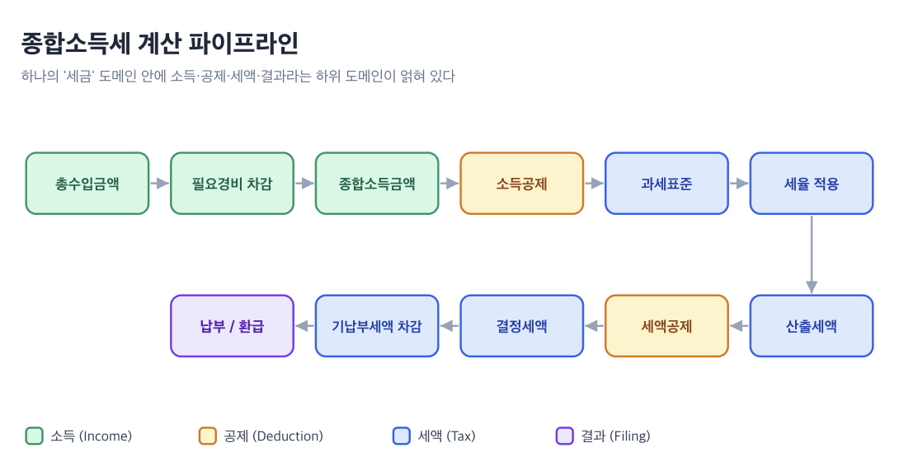

这篇文章想聊一聊**领域（Domain）**。

在开发过程中，我经常会遇到**“领域（Domain）”**这个词。但真要回答“领域到底是什么？”，却很难给出一个清晰明了的答案。（说实话，刚开始学开发时，我还以为领域就是指 www。）

查找领域相关资料时，自然会延伸到**领域模型**、**领域对象**、**领域对象模型**等概念。但一直让我觉得遗憾的是，很少有文章能讲清它们彼此有何不同，以及这些概念在并非后端的**前端**中意味着什么。本文会从各个概念的定义出发，结合示例梳理如何在前端恰当地分离和抽象领域逻辑。

我最近对税务相关领域很感兴趣。眼看 5 月的综合所得税申报期即将到来，本文就用税务来举例。

---


## 领域（Domain）

先从最基础的问题开始。什么是**领域**？

Eric Evans 在其著作 **Domain-Driven Design: Tackling Complexity in the Heart of Software（2003）** 中对领域作出了如下定义。

::::quote
:::translation
知识、影响力或活动的范围。
:::

:::original
"A sphere of knowledge, influence, or activity."
:::
::::

简单来说，领域就是**希望通过编程解决的问题范围**本身。如果要开发报税服务，“报税”就是领域；如果要开发保险理赔平台，“保险理赔”就是领域。领域不是代码，而是在软件出现之前就已存在的现实世界问题范围。

这对前端开发者意味着什么？我们构建的用户界面，归根结底是一个让用户看见并操作领域的**窗口（window）**。如果开发 Toss Income、3o3 这类以税务领域为核心的退税服务，就要通过用户界面呈现收入类型、费用率、所得扣除、税额抵免、退税额等领域概念。因此，前端开发者也必须深入理解自己处理的领域。换句话说，了解**“这项服务要解决什么问题”**，与出色地实现用户界面组件同样重要。

然而，即便只有“税务”这一个领域，深入其中也会发现大量子领域。仅以我略知皮毛的综合所得税计算流水线为例，就已经是这样。



这条流水线的每一个阶段，都是拥有独立规则和数据的子领域。“税务”这一大领域内部，交织着收入（Income）、扣除（Deduction）、税额（Tax）、申报结果（Filing）等细分领域。如何在代码中划分它们，正是领域建模的核心问题。


## 领域模型（Domain Model）

那么，什么是领域模型？领域和“领域模型”有什么区别？

Martin Fowler 与 Eric Evans 对领域模型作出了如下定义。

::::quote
:::translation
同时包含行为和数据的领域对象模型。—— Martin Fowler
:::

:::original
An object model of the domain that incorporates both behavior and data.
:::
::::

::::quote
:::translation
一种描述领域中选定方面的抽象体系，可用于解决与该领域相关的问题。—— Eric Evans
:::

:::original
A system of abstractions that describes selected aspects of a domain and can be used to solve problems related to that domain.
:::
::::

关键在于**“选择性抽象”**。领域模型不会囊括现实世界的一切。就像电影导演不会拍下现实中的所有场景，而只选择叙事所需的场景一样，领域模型也是**选取解决问题所需的方面并加以结构化**的结果。

这里有一点很重要：领域模型不一定非得是代码。它可以是白板上的图，也可以是团队成员头脑中共享的心智模型（Mental Model）。归根结底，“领域模型”这个术语本身可以是一个独立于软件的概念。

这里还有一个前端开发者特别容易混淆的地方：看到 API 响应结构，就认为“这就是领域模型”。但它其实是**数据模型（Data Model）**，而不是领域模型。

数据模型与领域模型的区别如下。

| 区分项    | 领域模型                                   | 数据模型                                  |
| --------- | ------------------------------------------ | ----------------------------------------- |
| 目的      | 表达业务概念与规则                         | 定义存储/传输结构                         |
| 语言      | 业务术语（计税依据、税额抵免、退税额）     | 技术术语（string、number、array）          |
| 包含要素  | 数据 + 行为（规则）                        | 仅数据结构                                |
| 示例      | “计税依据不超过 1,400 万韩元的区间税率为 6%” | `{ taxableBase: number, taxRate: number }` |

数据模型定义“数据以什么形式流转”，而**领域模型定义“这些数据在业务上意味着什么，又遵循哪些规则”。**如果无法区分两者，组件就会直接依赖 API 响应结构，每当后端 schema 发生变化，整个前端都会受到牵连。


## 领域对象（Domain Object）

如果说领域模型是一套概念体系，那么**领域对象**就是这些概念在代码中的具体实现。

经营 Code with Jason 的 [Jason Swett 在文章中](https://www.codewithjason.com/difference-domains-domain-models-object-models-domain-objects/)这样定义领域对象。

::::quote
:::translation
在我的对象模型中，凡是在领域模型里也作为一个概念存在的对象，我都会称之为领域对象。
:::

:::original
Any object in my object model that also exist as a concept in my domain model I would call a domain object.
:::
::::

也就是说，如果领域模型中存在“综合所得”这一概念，代码中又有名为 `Income` 的类型，那么这个 `Income` 就是领域对象。但并非所有代码对象都是领域对象。`HttpClient`、`LocalStorageAdapter`、`useDebounce` 等只是技术工具，并不是领域概念。


### 实体与值对象

Evans 将领域对象分为**实体（Entity）**、**值对象（Value Object）**、**服务（Service）**三类。（Martin Fowler 将这种分类称为“Evans Classification”。）服务是一个独立概念，用来表达“无法自然归属于某个特定对象的领域操作”。不过，本文关注的核心是如何识别数据，因此将重点讨论实体和值对象。

**实体（Entity）**是具有唯一身份、能够贯穿时间与多种表现形式的对象。报税申报单（TaxFiling）、纳税人（Taxpayer）、收入记录（IncomeRecord）等都通过唯一标识符识别；即使属性发生变化，只要标识符相同，就仍是同一个实体。即使修改了申报单的扣除项目，只要申报单标识符没有变化，它就仍是同一份申报单。

**值对象（Value Object）**是仅由属性组合赋予意义的对象，所有属性值都相同时，就视为同一个对象。金额（Money）、税率（TaxRate）、税级（TaxBracket）等都属于其数值本身即有意义的对象。“6% 的税率”无论用在哪里，都只是“6% 的税率”。

为什么这种区分在前端很重要？来看下面的代码示例。

```typescript
interface TaxFiling {
  id: string;
  taxpayerName: string;
  taxYear: number;
  status: FilingStatus;
}

const isSameFiling = (a: TaxFiling, b: TaxFiling) => a.id === b.id;

interface Money {
  amount: number;
  currency: "KRW" | "USD";
}

const isSameMoney = (a: Money, b: Money) =>
  a.amount === b.amount && a.currency === b.currency;
```

TaxFiling 以 id 作为身份判断标准，因此是实体。（拥有 id 字段本身并不是实体的定义，关键在于“用这个 id 判断对象是否相同”。）Money 没有 id，仅通过 amount 与 currency 的组合来识别；所有属性相同时，就视为同一个值。

实体基于标识符比较，值对象基于属性比较。明确这种区分后，状态管理中判断“这份数据是否相同”的逻辑就会自然地得到梳理。比如更新列表项时，如果是实体，就通过标识符找到并替换；如果是值对象，则执行不可变替换（immutable replace）。


## 领域对象模型（Domain Object Model）

已经知道了“领域模型”和“领域对象”，那么**领域对象模型**又是什么？

查阅资料后发现，这个概念出人意料地没有公认定义。许多文献把“领域模型”“领域对象模型”“概念模型（conceptual model）”“分析对象模型（analysis object model）”视为**实质上的同义词**，认为它们只是对面向对象分析阶段所绘制概念模型的不同称呼。

但也有观点认为，它们属于划分得更细的不同层次。其中有一种典型解释：**领域模型转化为实际代码的地方，正是对象模型**。

按照第二种观点，**对象模型**是系统中**所有代码对象的结构**，也包含 `HttpClient`、`useDebounce` 等技术工具。其中，**用于表达领域概念的对象子集及其相互关系**，就是**领域对象模型**。这也与面向对象建模的传统一脉相承——在这一传统中，“对象模型”被定义为系统的静态结构，包括类、属性、操作与关系。

我认为，这种观点对前端开发者更实用，因为我们实际编写的代码总是混合着领域对象和技术对象。

归根结底，**领域 → 领域模型 → 领域对象模型 → 领域对象**是一组从抽象走向具体的层次关系。领域最宽泛，领域对象最具体。因此，编写前端代码时，我们真正要思考的终究是：**如何组织领域对象模型，也就是表达领域概念的类型及其相互关系**。


## 前端的领域逻辑应该放在哪里？

概念定义就讲到这里，现在来聊聊实践。前端的领域逻辑究竟应该放在**哪里**？

热衷于软件设计的 [Khalil Stemmler](https://khalilstemmler.com/about/) 起初主张“业务逻辑不属于前端”，后来又调整了立场，表示“后端在架构层面所做的几乎一切，前端也能做，而且应该做。”

我也认同这一观点。当然，前端不应成为业务逻辑的**唯一事实来源（Single Source of Truth）**，那是后端的职责。但前端确实存在**前端独有的领域逻辑**。

设想这样一种情况：“需要根据用户输入的信息，实时展示预计退税额。”如果这类计算逻辑只存在于后端，用户每修改一个收入金额的字符，就要调用一次 API。用户界面会在网络往返期间停顿；如果用户输入很快，还会产生爆炸式增长的无用请求。即使加入防抖，数百毫秒的延迟也足以破坏“实时预览”的体验。**最终，需要即时反馈的计算只能由前端自行完成，于是也就出现了只能在前端执行的逻辑。**


### 领域逻辑混入组件的情况

以综合所得税预览页面为例。用户输入收入信息后，页面会实时展示预计税额。下面是一段常见的代码，其中领域逻辑和用户界面逻辑混在了一起。

```tsx
function TaxPreviewPage() {
  const [총수입, set총수입] = useState(0);
  const [경비율, set경비율] = useState(0.641); 
  const [인적공제대상인원, set인적공제대상인원] = useState(1); 

  const 종합소득금액 = 총수입 - 총수입 * 경비율;

  const 소득공제합계 = 인적공제대상인원 * 1_500_000;
  const 과세표준 = Math.max(0, 종합소득금액 - 소득공제합계);

  let calculatedTax = 0;
  if (과세표준 <= 14_000_000) {
    calculatedTax = 과세표준 * 0.06;
  } else if (과세표준 <= 50_000_000) {
    calculatedTax = 과세표준 * 0.15 - 1_260_000;
  } else if (과세표준 <= 88_000_000) {
    calculatedTax = 과세표준 * 0.24 - 5_760_000;
  } else if (과세표준 <= 150_000_000) {
    calculatedTax = 과세표준 * 0.35 - 15_440_000;
  } else {
    calculatedTax = 과세표준 * 0.38 - 19_940_000;
  }

  const 기납부세액 = 총수입 * 0.033;
  const refundOrPayment = 기납부세액 - calculatedTax;

  return <div>...</div>;
}
```

看出这段代码的问题了吗？“每人 150 万韩元的人身扣除”“8 级累进税率”“3.3% 预扣税”等**由税法规定的业务规则**被直接写死在 React 组件中。税法每年都会修订，如果这些规则散落在各个组件里，修订时就必须四处寻找需要修改的位置。如果质量保证团队还有端到端测试场景需要维护，测试成本也不会低。

最终，视图逻辑与业务逻辑变得难以区分，代码也会被大量条件语句和自定义钩子缠成一团。


### 分离领域逻辑

借用 Alex Bespoyasov 的 Clean Architecture 方法中的一项核心原则：把领域逻辑分离为**不依赖框架的纯函数**。

::::quote
:::translation
领域是区分一个应用与另一个应用的核心。可以把领域理解为，即使从 React 迁移到 Angular，也不会发生变化的部分。
:::

:::original
The domain is the core that distinguishes one application from another. You can think of the domain as something that won't change if we move from React to Angular.
:::
::::

来重构上面的税额计算示例。

首先定义领域类型和规则，将相关信息聚合起来。

```typescript
export interface Income {
  grossAmount: number;
  expenseRate: number;
}

export interface Deductions {
  personalCount: number;
  pensionPaid: number;
  additionalDeductions: number;
}

const PERSONAL_DEDUCTION_PER_PERSON = 1_500_000;
const WITHHOLDING_RATE = 0.033;
const TAX_BRACKETS = [
  { limit: 14_000_000, rate: 0.06, progressiveDeduction: 0 },
  /** ...구간들... **/
] as const;
```

然后，将领域逻辑分离为纯函数。

把前面计算收入、扣除、计税依据、税额、退税额等逻辑分离到 `computeFullTax` 函数中，再把每个阶段拆成更小的纯函数。结果类型可以通过 `ReturnType<typeof computeFullTax>` 推断，无需单独声明接口。

之后，组件只需“使用”领域逻辑。

```tsx
import { computeFullTax } from "../domain/tax";

function TaxPreviewPage() {
  const [income, setIncome] = useState<Income>({
    grossAmount: 0,
    expenseRate: 0.641,
  });
  const [deductions, setDeductions] = useState<Deductions>({
    personalCount: 1,
    pensionPaid: 0,
    additionalDeductions: 0,
  });

  const result = computeFullTax(income, deductions);

  return (
    <div>
      <IncomeForm value={income} onChange={setIncome} />
      <DeductionForm value={deductions} onChange={setDeductions} />
      <TaxResultSummary result={result} />
    </div>
  );
}
```

发生了哪些变化？

- **8 级累进税率表**（`TAX_BRACKETS`）集中在一处，税法修订时只需修改 `domain/tax.ts`
- **计算流水线**聚合在 `computeFullTax` 这一个函数中，整体流程一目了然。（为了让示例保持简单，这里将它合并成了一个函数；在实际项目中，更适合按收入计算、扣除计算、税额计算等目的进一步细分。）
- **组件只专注于“如何展示”**。即使税率变化，也无需修改组件
- 即使从 React 迁移到其他框架，`domain/tax.ts` 也**无需变化**

分离领域逻辑后，测试会变得出奇简单。在税务领域，**计算是否准确直接关系到用户的钱**，所以这一点尤其重要。

包含税务计算逻辑的纯函数不需要 React Testing Library，也不需要 `render` 或 `screen.getByText`。传入输入、检查输出即可。“1,400 万韩元及以下适用 6% 税率”“计税依据为 0 韩元时税额也为 0 韩元”“自由职业者收入 3,000 万韩元时的退税额”等用例，都可以用一行 `it` 来表达。领域单元测试会自然地帮助确定组件的拆分边界，测试代码本身也能充当文档。


## 贫血领域模型（Anemic Domain Model）

上一节分离了**计算逻辑**。但领域逻辑除了计算，还包括**状态转换规则**和**权限判断**。例如：“现在可以修改这份申报单吗？”“可以提交吗？”“可以切换申请方式吗？”在分离这些规则时，很容易落入一个陷阱，也就是 Martin Fowler 命名的**贫血领域模型（Anemic Domain Model）**。

贫血领域模型是指：**类型虽然用领域语言定义得很好，但作用于类型之上的规则却散落到了领域之外**。以报税申报（Filing）领域为例，类型本身很整洁。

```typescript
// types/filing.ts
export interface TaxFiling {
  id: string;
  status: "draft" | "submitted" | "reviewing" | "completed" | "amended";
  taxYear: number;
  filingType: "regular" | "late" | "amendment";
  determinedTax: number;
}
```

但针对这个类型的判断和转换规则，却写死在其他地方。

```typescript
// utils/filingHelpers.ts
export function canAmendFiling(filing: TaxFiling) {
  return filing.status === "completed" && filing.filingType !== "amendment";
}

// components/FilingDetail.tsx
function FilingDetail({ filing }: { filing: TaxFiling }) {
  // 같은 도메인 규칙을 컴포넌트 안에 다시 작성한다
  const canEdit = filing.status === "draft" || filing.status === "reviewing";
  // ...
}

// hooks/useSubmitFiling.ts
export function handleSubmitFiling(filing: TaxFiling) {
  if (filing.status !== "draft") return;
  // ...
}
```

同一条领域规则分别以不同形式存在于工具函数、组件和钩子这三个地方。此时，如果收到“申请条件将发生变化”的需求，就必须四处寻找要修改的位置；任何一个被遗漏的地方，都会在网站的某处作出错误判断。Fowler 批评这类代码，称其**“与只披了一层面向对象外衣的过程式代码别无二致”**。

解决办法与上一节处理计算逻辑的方法相同：**把规则放在类型旁边。**

```typescript
export interface TaxFiling {
  id: string;
  status: FilingStatus;
  taxYear: number;
  filingType: FilingType;
  determinedTax: number;
}

export type FilingStatus =
  | "draft"
  | "submitted"
  | "reviewing"
  | "completed"
  | "amended";

export type FilingType = "regular" | "late" | "amendment";

// 도메인 규칙은 도메인 옆에 둔다
export function canEdit(filing: TaxFiling): boolean {
  return filing.status === "draft";
}

export function canSubmit(filing: TaxFiling): boolean {
  return filing.status === "draft" && filing.determinedTax >= 0;
}

export function canAmend(filing: TaxFiling): boolean {
  return filing.status === "completed" && filing.filingType !== "amendment";
}
```

现在，申报相关规则都在 `domain/filing.ts` 中统一管理。任何组件只需调用 `canAmend(filing)`；规则发生变化时，也只需修改这一个文件。关键在于，**应该把类型及其上的规则视为一个整体。**如果只把类型放进领域文件夹，却把规则抽到工具函数中，这种局部分离即使外表整洁，仍然处于贫血状态。


## API 响应与领域模型之间的转换层

在实际工作中，还要考虑另一件事：后端 API 的响应结构不一定总与前端领域模型一致。如果是与国家机关对接的税务服务，就更是如此。韩国国税厅 Hometax 的对接数据充斥着缩写和代码值，几乎不可能以与前端领域模型相同的形式返回。

此时就需要**转换层（Mapper）**。不要让 API 响应类型原封不动地一路流入组件，而应先将其整理成领域类型，再交给组件使用。一个纯函数就足够了。

```typescript
import type { Income } from "../domain/tax";

interface HometaxIncomeResponse {
  총수입금액: number;
  경비율: number;
  소득유형코드: string;
  // ... 나머지 약어 필드들
}

export function toIncome(response: HometaxIncomeResponse): Income {
  return {
    총수입_금액: response.총수입금액,
    경비_비율: response.경비율,
  };
}
```

这样一来，就能在**一个地方**把 API 响应中的 `총수입금액`、`경비율` 等缩写，以及基于代码值的分类，转换为适合前端领域的形式。像收入类型代码这样需要展开为枚举的值，可以在转换器中放一张小型查找表。即使 Hometax API 的字段名发生变化，也只需修改一个转换器。


## 工具函数与领域逻辑

分离领域逻辑时，必然会遇到一个问题：**“这不就是工具函数吗？”**

来看下面两个函数。

```typescript
function formatCurrency(amount: number): string {
  return `${amount.toLocaleString()}원`;
}

function calculateTax(taxableBase: number): number {
  const bracket = TAX_BRACKETS.find((bracket) => taxableBase <= bracket.limit);
  return Math.floor(taxableBase * bracket.rate - bracket.progressiveDeduction);
}
```

`formatCurrency` 是把数字转换成字符串的纯**表现层逻辑（Presentation）**。加上“韩元”单位和千位分隔符并不是业务规则，而是如何把内容展示给用户的问题。相反，`calculateTax` 包含“应用 8 级累进税率”这一**基于税法的业务规则**。即使没有用户界面，这条领域规则也必须同样适用。

我在实际工作中使用的判断标准是：

> **如果这段逻辑消失，受损的是业务，还是只有页面？**

如果业务受损，它就是领域逻辑；如果只有页面受损，它就是表现层逻辑。仅凭这个问题，就能划清大多数边界。

| 判断标准                | 领域逻辑                         | 工具/表现层逻辑              |
| ----------------------- | -------------------------------- | ---------------------------- |
| 缺少它会导致什么问题？  | 税额计算错误                     | 页面（用户界面）显示异常     |
| 框架变化时呢？          | 保持不变                         | 可能变化                     |
| 需求文档中有明确规定吗？| “计税依据 × 税率 - 累进扣除额”   | “金额使用千位分隔符”         |
| 后端也有同样的逻辑吗？  | 已经有，或应该有                 | 没有（仅属于前端的关注点）   |

但现实并没有这么清晰。最棘手的是，**有些逻辑看起来像领域逻辑，其实却是表现层逻辑**。

来看下面的代码。因为它以 FilingStatus 这一领域概念作为参数，所以被归类为领域逻辑。但它真的是领域逻辑吗？

```typescript
// domain/filing.ts
function getStatusBadgeColor(status: FilingStatus): string {
  const colors: Record<FilingStatus, string> = {
    draft: "gray",
    submitted: "blue",
    reviewing: "yellow",
    completed: "green",
    amended: "purple",
  };
  return colors[status];
}

function getStatusDisplayText(status: FilingStatus): string {
  const labels: Record<FilingStatus, string> = {
    draft: "작성 중",
    submitted: "제출 완료",
    reviewing: "검토 중",
    completed: "신고 완료",
    amended: "경정청구",
  };
  return labels[status];
}
```

`getStatusBadgeColor` 和 `getStatusDisplayText` 虽然使用了 `FilingStatus` 这一领域概念，但它们做的事情是**页面呈现**。徽章颜色变化并不会对业务造成任何影响。把这类函数放进 `domain/filing.ts`，会让领域模块越来越臃肿，真正的领域逻辑和表现层逻辑也会混在一起。


### 分离领域模型与 ViewModel

有一种实用的方法可以解决这个问题：**在同一个领域文件夹中，把 ViewModel 分离到单独的文件里**。与 `.ui.ts` 相比，采用 `.viewModel.ts` 这一命名能自然地与 MVVM 模式中的 ViewModel 概念衔接，因为“把领域数据转换成适合页面呈现的形式”这一职责能够直接从名称中体现出来。

```
domains/
└── filing/
    ├── filing.ts              # 순수 도메인 모델 + 도메인 로직
    ├── filing.viewModel.ts    # ViewModel (표현 변환 계층)
    ├── filing.test.ts         # 도메인 로직 테스트
    └── filingMapper.ts        # API ↔ 도메인 변환
```

把前面看到的 `getStatusBadgeColor`、`getStatusDisplayText` 原样移到 `filing.viewModel.ts`。此外，像 `getFilingTypeLabel(type: FilingType): string` 这样把申报类型转换成韩文标签的逻辑，也集中放在这里。`filing.ts` 只负责业务规则，`filing.viewModel.ts` 只负责页面呈现。

关键在于**依赖方向**。`filing.viewModel.ts` 会导入 `filing.ts`，但 `filing.ts` 绝不能导入 `filing.viewModel.ts`。领域不了解表现层，而表现层了解领域。可以把它看作 Robert C. Martin 所说的依赖规则（Dependency Rule）的缩小版。

我认为共同变化的文件应该放在同一目录，因此把它们放在了同一个文件夹。给 `FilingStatus` 类型添加新值（例如 `'rejected'`）时，`filing.ts` 和 `filing.viewModel.ts` 都需要修改。由于位于同一个文件夹，修改范围一目了然。


## 边界与内聚

与分离领域逻辑同样重要的是：**边界应该画在哪里**。下面整理几种我在实际工作中经常遇到的边界判断问题。

前端处理的数据大致来自四种来源。

- **服务端数据**：通过 API 响应获得的数据
- **派生数据**：由服务端数据计算得到的数据
- **用户界面状态**：用于控制页面的状态，以及用户交互
- **用户输入**：正在表单中输入的数据

如果把这四类数据混进同一个类型，领域模型就会受到污染。

```typescript
// 안티패턴: 모든 것이 섞인 타입
interface TaxFiling {
  // 서버 데이터 (도메인)
  id: string;
  status: FilingStatus;
  determinedTax: number;

  // 파생 데이터 (도메인)
  refundAmount: number;
  canAmend: boolean;

  // UI 상태 (표현)
  isExpanded: boolean;
  activeStep: number;

  // 임시 상태
  editingDeductions: Deduction[];
}
```

这个类型把领域概念、用户界面状态和临时数据都塞进了同一个篮子。每次 `activeStep` 变化，就等于更新了一次申报领域。（表单步骤变化并不是业务事件。）

改进方法是按照边界拆分类型。**领域模型**只包含 `id`、`status`、`determinedTax` 等业务概念；**用户界面状态**（`FilingFormViewState`）只包含 `isExpanded`、`activeStep` 等页面控制信息；**表单状态**（`DeductionEditForm`）只保存正在输入的临时数据。

这样一来，每种类型都只有**一个变化原因**。领域类型只在税法变化时修改，用户界面状态只在页面设计变化时修改，表单状态只在输入体验变化时修改。


### 把共同变化的内容放在一起

Eric Evans 的 DDD 中有一个**聚合（Aggregate）**概念，指的是“把一组相关对象作为一个单元来处理”。前端无需照搬这一概念，但其中的核心原则值得借鉴：**把共同变化的数据和规则放在一起。**

以税务服务为例，`Income`（收入）和 `ExpenseRate`（费用率）总是共同变化。收入类型变化时，适用的费用率也会变化，综合所得金额的计算也会受到影响。因此，应把这些内容聚合到同一个文件 `domain/tax.ts` 中。

相反，`TaxFiling`（申报单）可以独立于税额计算而变化。即使申报单的状态转换规则发生变化，税率计算逻辑也不会受到影响。因此，把它分离到 `domain/filing.ts` 才是合适的做法。

```
이렇게 묻자: "A가 변할 때 B도 반드시 변해야 하는가?"
  → Yes: 같은 모듈에 둔다 (Income + ExpenseRate + TaxBracket)
  → No: 분리한다 (Tax 계산 ↔ Filing 상태관리)
```


## 类与函数式风格

读到这里，可能会产生一个根本问题：前面的示例都是 `interface` + 纯函数的组合，如果用类来表达领域，内聚不是会更自然吗？

确实如此。使用类来表达领域，会把数据与行为封装在同一个对象中，因此内聚性能够直接体现在代码结构里。

```typescript
class TaxFilingModel {
  constructor(
    public readonly id: string,
    public readonly status: FilingStatus,
    public readonly taxYear: number,
    public readonly filingType: FilingType,
    public readonly determinedTax: number,
  ) {}

  canEdit(): boolean {
    return this.status === "draft";
  }

  canAmend(): boolean {
    return this.status === "completed" && this.filingType !== "amendment";
  }

  canSubmit(): boolean {
    return this.status === "draft" && this.determinedTax >= 0;
  }
}

const filing = new TaxFilingModel(
  "F-001",
  "completed",
  2025,
  "regular",
  547200,
);

filing.canAmend();
```

使用类时，行为归属于数据，而且调用处的主语非常明确。`filing.canAmend()` 读起来像自然语言一样直观，主语（filing）和动词（canAmend）清楚地结合在一起。就像写下 `jihoon.eat('감자탕')`，马上就能读出“Jihoon 吃脊骨土豆汤”。

而函数式风格是这样的。

```typescript
canAmend(filing);
eat("jihoon", "감자탕");
```

在函数式风格中，数据存在于函数之外。上面第一段代码接收 `filing` 数据作为参数并执行某种行为；`eat` 函数则接收 `jihoon` 和 `감자탕` 两项数据作为参数来执行行为。

这样一来，主语和动词的结合会变得松散。只有打开文件或查看类型签名，才能知道 `canAmend` 函数与 `TaxFiling` 有关。如果同一文件中混杂着 `canAmend(filing)`、`canEdit(filing)`、`calculateTax(taxableBase)` 等函数，就可能很难一眼看出每个函数分别属于哪个领域。


### 那么，应该使用类吗？

坦率地说，答案是**“视情况而定”**。但根据我的经验，在 React + TypeScript 环境中，类并非万能，这背后有一些现实原因。

**1. 与 React 状态管理之间的摩擦**

React 的状态管理与**普通对象（Plain Object）**配合得最自然。`useState` 和 `useReducer` 在技术上可以保存任何值，Redux DevTools 本身也不会移除类实例的原型。但如果 Redux/Zustand 持久化中间件以 JSON 保存并恢复状态，类实例就会在 `JSON.stringify` → `JSON.parse` 循环中丢失方法和原型，退化为普通对象。从 React Server Component 向 Client Component 传递 props 的边界则有另一种限制：它只接受受支持的可序列化（serializable）值，因此任意类实例从一开始就无法通过该边界。

来看下面的代码。

```typescript
const [filing, setFiling] = useState(
  new TaxFilingModel("F-001", "draft", 2025, "regular", 0),
);
```

仅仅更新 React 状态并不会让 `filing` 失去 `TaxFilingModel` 实例的身份。但如果 Redux/Zustand 持久化以 JSON 保存并恢复它，恢复后的值可能变成没有方法的普通对象，此时无意间调用 `filing.canAmend()` 就可能触发运行时错误。从 React Server Component 传递到 Client Component 时，失败会更早发生，因为类实例不是受支持的可序列化 props 值。

**2. 难以保证不可变性**

React 基于**引用相等性（referential equality）**检测状态变化。如果类实例的方法执行 `this.items.push(...)` 之类的内部修改，引用保持不变，React 就不会触发重新渲染。因此，最终只能让 `addDeduction(item)` 像 `return new DeductionList([...this.items, item])` 一样，每次都返回一个新实例。这样一来，类的优势——“封装后的状态变更”——也就失去了意义，代码与函数式更新并没有太大区别。


### 在函数式风格中获得内聚的策略

那么，在函数式风格中，如何改善 `eat('jihoon', '감자탕')` 这种内聚松散的问题？下面介绍三种我认为有效的方法。

**1. 通过模块命名空间实现内聚**

这是最直观的方法。把文件（模块）本身按领域组织，并在导入时使用命名空间。直接使用前面定义的 `domain/filing.ts` 即可。

```typescript
import * as FilingModel from "../domain/filing";

FilingModel.canEdit(filing);
FilingModel.canAmend(filing);
FilingModel.canSubmit(filing);
```

`FilingModel.canAmend(filing)` 虽然不如 `filing.canAmend()` 简洁，但至少能直接从代码中看出这个函数属于申报领域，也不会再出现函数跨多个领域混杂的风险。

**2. 统一把第一个参数作为领域主体**

函数式风格还有另一种表达内聚的约定：**始终把第一个参数设为“行为主体”。**将签名统一为 `canAmend(filing)`、`calculateTotalIncome(income)` 这样的形式后，`canAmend(filing)` 就可以理解为“询问 filing 是否可以修改”。这也与 Unix 的流水线思维（`data |> transform`）一脉相承。事实上，Go 语言的方法接收者正是这种模式，Rust 的 `impl` 块把 `self` 作为第一个参数也是同样的思路。

**3. 用领域对象工厂函数聚合行为**

想念类的内聚性时，可以使用这种模式。工厂函数一次性返回领域对象及其行为。

```typescript
export function createFilingModel(data: TaxFiling) {
  return {
    ...data,
    canEdit: () => data.status === "draft",
    canSubmit: () => data.status === "draft" && data.determinedTax >= 0,
    canAmend: () =>
      data.status === "completed" && data.filingType !== "amendment",
  } as const;
}

const filing = createFilingModel(rawFiling);
filing.canAmend();
filing.canEdit();
```

这种模式能够同时获得类的表现力（`filing.canAmend()`）和通过对象字面量组合行为的实用性。不过，返回的对象包含函数属性，因此它本身并不是可 JSON 序列化的数据。它每次还会创建新的函数对象，但对于前端处理的数据规模来说，几乎不会构成性能问题。


## 应该分离到什么程度？

阅读 Clean Architecture 时，会看到一种理想结构：划分 3～4 个层，并定义端口与适配器。但在现实中，把这套结构应用于所有项目，可能会造成过度设计（over-engineering）。

我认为实用的判断标准如下。

- **将领域类型与 API 响应类型分离。**无论使用 `interface` 还是 `type`，都应在单独的文件中定义前端使用的领域概念。
- **把包含业务规则的逻辑移出组件。**不放在 `domain/` 文件夹也没关系，重要的是把它写成不依赖 React 的纯函数。
- **集中完成 API 响应 → 领域模型的转换。**无论使用转换器函数还是 Zod schema，都要建立一种结构：只需修改这一处，变化就不会继续传播。

如果项目变得更加复杂，还可以进一步考虑以下做法。

- **按限界上下文划分文件夹。**[Toss 前端团队](https://frontend-fundamentals.com/)也强调“把共同变化的文件放在同一目录”这一原则。按领域划分文件夹后，导入路径会自然地显露领域边界。
- **引入用例层。**当领域逻辑的组合变得复杂时，就需要一个应用层，将“查询收入信息 → 应用费用率 → 计算扣除项目 → 计算税额 → 确定退税额”这一场景封装成一个函数。

```
src/
├── domains/
│   ├── tax/
│   │   ├── tax.ts                  # 세액 계산 도메인 (세율, 공제, 계산 파이프라인)
│   │   ├── tax.viewModel.ts        # 세액 표현 (금액 포맷, 구간 라벨)
│   │   ├── tax.test.ts             # 세액 계산 테스트
│   │   └── incomeMapper.ts         # 홈택스 API ↔ 도메인 변환
│   ├── filing/
│   │   ├── filing.ts               # 신고 상태 도메인 (상태 전이, 권한)
│   │   ├── filing.viewModel.ts     # 신고 표현 (상태 배지, 라벨)
│   │   ├── filing.test.ts
│   │   └── filingMapper.ts
│   └── deduction/
│       ├── deduction.ts            # 공제 항목 도메인 (자격 조건, 한도)
│       └── deduction.viewModel.ts
├── hooks/                           # React 의존 로직
├── components/                      # UI 컴포넌트
└── api/                             # API 호출
```

即使同属税务这一领域，**税额计算（tax）**、**申报管理（filing）**、**扣除项目（deduction）**也会被分成彼此独立的子领域。即使税率发生变化，申报状态转换逻辑也不会受到影响；即使新增扣除项目，申报单的提交流程也保持不变。这就是限界上下文在实践中的应用。


## 结语

总而言之，**领域**是我们要解决的问题范围；**领域模型**是对这一问题进行选择性抽象后形成的概念体系；**领域对象模型**是用代码实现这套概念体系的结果；**领域对象**则是实现中的各个具体对象。

而在前端实践这些概念，并不只是划分文件夹，更是要**有意识地判断多层边界**。“这是业务规则，还是表现层逻辑？”“这些数据属于领域状态，还是用户界面状态？”“这个函数的内聚性足够吗？”只要养成反复提出这些问题的习惯，代码结构自然会逐渐改善。

当然，并非所有项目都需要完整搭建 Clean Architecture 的各个层。为简单的增删改查应用划分四个层，并给每个领域都应用工厂模式，未免本末倒置。在类的优雅内聚与函数式风格的实用灵活之间，答案取决于项目复杂度和团队语境。

没有唯一正确答案。但至少，**“不知道领域是什么就开始写代码”**与**“识别领域、判断边界并有意识地分离代码”**之间有着明确差异。希望读者也能在自己的项目中问一次：“这里的领域是什么？这段代码又应该放在哪里？”


### 参考资料

:::ref
- [article] [Eric Evans，《领域驱动设计》（书籍）](https://www.amazon.com/Domain-Driven-Design-Tackling-Complexity-Software/dp/0321125215)
- [article] [Robert C. Martin，Clean Architecture](https://blog.cleancoder.com/uncle-bob/2012/08/13/the-clean-architecture.html)
- [article] [Khalil Stemmler，DDD 属于前端吗？](https://khalilstemmler.com/articles/typescript-domain-driven-design/ddd-frontend/)
- [article] [Alex Bespoyasov，前端 Clean Architecture](https://bespoyasov.me/blog/clean-architecture-on-frontend/)
- [article] [Toss，端到端自动化之旅](https://toss.tech/article/income-qa-e2e-automation)
:::
