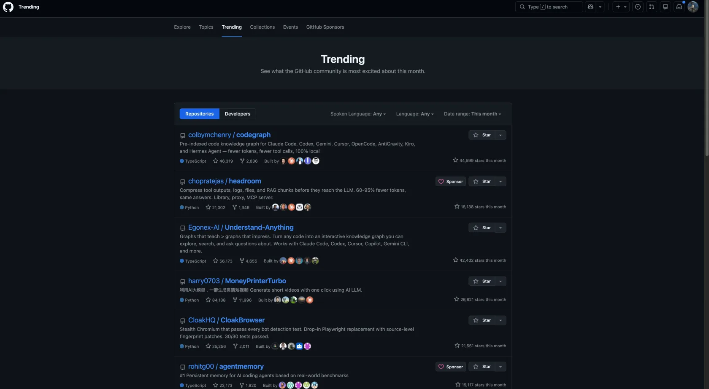

En esta publicación quiero hablar sobre **en qué se diferencian entre sí las herramientas que reducen el coste de que un agente de codificación con IA encuentre el código pertinente**.

Este artículo está pensado para quienes han visto a un agente gastar tokens repitiendo grep y lecturas de archivos en una base de código grande, y dudan qué herramienta añadir, como Repomix, CodeGraph o Serena. Al terminar, sabrás distinguir cómo se diferencian estas herramientas según la profundidad con que entienden el código y dónde reduce cada enfoque el coste de búsqueda. Esa profundidad se divide en cuatro: el empaquetado de contexto, que mete el código entero como texto; los mapas de repositorio con tree-sitter, que saben que un símbolo existe; los grafos de conocimiento, que guardan de antemano las relaciones entre símbolos; y LSP, que sabe qué es ese símbolo.

Desde que vi `codegraph` en GitHub Trending y lo instalé, cada vez que encuentro una herramienta nueva me pregunto por qué principio ahorra tokens.

## Herramientas de inteligencia de código

En un codebase grande, la mayor parte del coste de un agente de IA no se dedica a modificar código, sino a **encontrar dónde está el código relevante**. Si cada tarea empieza con el ciclo grep → Read → filtrar → volver a grep, se desperdician tokens, tiempo y tool calls. Las herramientas de inteligencia de código son distintos intentos de reducir este coste de búsqueda.

Yo divido estos intentos en los cuatro niveles (tiers) siguientes. No es una clasificación establecida en el sector, sino una agrupación propia basada en la profundidad con que cada herramienta entiende el código.

### Empaquetado de contexto

La solución más sencilla parte de la idea de «**meterlo todo en una sola ventana de contexto**». No construye grafos ni crea índices: simplemente serializa el repositorio entero como un bloque de texto y se lo entrega al modelo.

Una herramienta representativa es **Repomix**. Empaqueta todo el repositorio en una estructura optimizada para el parsing XML de Claude. Cuenta con CLI, web, extensión y servidor MCP, por lo que ofrece uno de los ecosistemas más completos.

**GitIngest** es conocida por su experiencia sin fricciones. Basta con cambiar `github.com` por `gitingest.com` en una URL de GitHub para convertir todo el repositorio en una página de texto. (Por ejemplo, `github.com/facebook/react` → `gitingest.com/facebook/react`). Cambiar una sola palabra en la barra de direcciones es todo lo que se necesita; no requiere instalación y está especializada en exploraciones rápidas de una sola vez.

**code2prompt** (creada por Mufeed VH) es una CLI basada en Rust que destaca por la personalización mediante un sistema de templates.

También merece atención una variante interesante: **rtk** (`rtk-ai/rtk`, unas 55k stars). Mientras que las herramientas anteriores «empaquetan todo el repositorio de una vez», rtk **comprime en tiempo real la salida de los propios comandos de la CLI**. Es un único binario escrito en Rust que se registra automáticamente en los shell hooks de 13 herramientas, entre ellas Claude Code, Cursor, Copilot, Gemini CLI y Codex. Así, cuando un agente invoca `git status`, internamente se reescribe como `rtk git status`. (Su gran diferenciador es que el usuario no necesita cambiar su workflow). Aplica heurísticas de smart filtering, grouping, truncation y deduplication a más de 100 comandos, reduciendo entre un 60 y un 90 % los tokens de salida. Una frase de su sitio oficial resume bien la categoría: **«70% of your bill is noise the LLM doesn't need.»** Si las herramientas anteriores reducen la cantidad de «contexto que entra», rtk reduce la cantidad de «contexto que regresa como resultado de una tool call».

La limitación de este nivel es clara: **los repositorios grandes alcanzan el límite de tokens**. Además, el código solo se transmite como «un bloque de texto», sin comprensión estructural ni relaciones entre símbolos.

### Mapa del repositorio con tree-sitter

El siguiente nivel utiliza **tree-sitter** para analizar la estructura del código, pero sin ejecutar un servidor de indexación independiente.

Un **AST (Abstract Syntax Tree, árbol de sintaxis abstracta)** es una estructura de datos que representa el código fuente como un árbol. Es el resultado de la fase de parsing de un compilador: elimina detalles superficiales como espacios, puntos y coma o paréntesis, y conserva como nodos únicamente elementos significativos, como variables, operadores, llamadas a funciones y control flow. Todos los análisis precisos de las herramientas de inteligencia de código se realizan, en última instancia, sobre un AST.

**tree-sitter** es un generador de parsers open source y una librería de parsing incremental. Lo utilizan la navegación de código de GitHub, Neovim, Zed y Helix, entre otros. Su principal diferenciador consiste en que **solo vuelve a analizar la parte editada**. Aunque modifiquemos una línea en el editor, no vuelve a analizar el archivo entero, sino que parchea únicamente el árbol modificado. Por eso ofrece una respuesta rápida y también resulta adecuado para que los agentes de IA examinen código con agilidad.

**Aider**, una herramienta de programación en pareja con IA que se usa en la terminal, es un caso representativo de este enfoque. Utiliza tree-sitter para extraer definiciones de símbolos —funciones, clases y métodos— de los archivos fuente; crea un grafo en el que los archivos son nodos y las dependencias entre archivos son edges; y aplica al grafo un algoritmo de ranking de la familia PageRank (que calcula la importancia de una página según la cantidad y la calidad de los enlaces que apuntan a ella) para extraer únicamente las definiciones y signatures esenciales dentro del presupuesto de tokens. (Con el valor predeterminado `--map-tokens=1024`, crea un mapa del repositorio de 1k tokens).

**AFT** (`cortexkit/aft`) lleva este enfoque a un nivel más preciso. Traducido literalmente de su README oficial: **«Leer un archivo de 500 líneas cuesta unos 375 tokens. Pero, cuando el agente solo necesita una función en la mayoría de los casos, pasar el nombre del símbolo a `aft_zoom` devuelve únicamente esa función y un poco de contexto. El coste es de unos 40 tokens»**. Además, la edición basada en números de línea se rompe cuando se mueve el código situado por encima del objetivo, mientras que el modo de edición por símbolos de AFT es estable porque se dirige a la función por su nombre.

En este mismo nivel hay otra herramienta que merece una mención adicional: **ast-grep** (`ast-grep/ast-grep`, unas 13,9k stars). Es una CLI de búsqueda estructural y rewriting basada en tree-sitter. Su diferencia decisiva frente al grep convencional es que no busca texto, sino patrones CST (Concrete Syntax Tree). Por ejemplo, al buscar el patrón `console.log($A)`, encuentra con precisión todas las llamadas con la misma estructura semántica, con independencia de su forma textual. También existe un servidor `ast-grep-mcp` independiente para que los agentes de IA utilicen búsquedas estructurales en lugar de grep de texto.

### Knowledge Graph

El tercer nivel va un paso más allá: **analiza de antemano todo el codebase, construye un knowledge graph y lo guarda en disco**; después, el agente consulta ese grafo ya almacenado. El caso que más atención ha recibido es una herramienta llamada **CodeGraph**.

Su arquitectura es sorprendentemente sencilla. Analiza el código con **tree-sitter**, guarda los símbolos, edges y archivos extraídos en la búsqueda full-text FTS5 de SQLite y expone ese knowledge graph al agente de IA mediante MCP. Conviene destacar que **toda la extracción se realiza de forma determinista mediante parsing AST, no mediante resúmenes de un LLM**, por lo que no hay margen para alucinaciones.

**FTS5 (SQLite Full-Text Search 5)** es una extensión de búsqueda de texto completo proporcionada como virtual table de SQLite. Forma parte de la amalgamation desde SQLite 3.9.0 (2015-10-14). Se crea una tabla mediante `CREATE VIRTUAL TABLE ... USING fts5(...)` y se consulta con el operador `MATCH`. Su ventaja decisiva es que permite mantener un índice full-text en un único archivo SQLite sin ejecutar un motor de búsqueda independiente como Elasticsearch. Esta es también una de las razones por las que CodeGraph puede anunciar un «funcionamiento 100 % local».

La palabra **determinista (deterministic)** que acabamos de usar significa que el mismo código produce siempre el mismo resultado. Si un LLM resume el código para construir el grafo, el resultado puede variar incluso con el mismo código y existe el riesgo de que se cuelen alucinaciones. En cambio, al analizar directamente el AST, las relaciones entre símbolos se extraen solo según las reglas de la gramática del lenguaje, sin margen para ese tipo de interpretación. Por eso este principio es fundamental en CodeGraph.

Los benchmarks también resultan llamativos. Se comparó la ejecución headless de Claude Opus 4.7 con y sin CodeGraph MCP. Según los promedios del README oficial, activarlo resultó **un 35 % más barato**, utilizó **un 57 % menos de tokens**, fue **un 46 % más rápido** y redujo las **tool calls en un 71 %**. Además, el beneficio aumenta en proporción al tamaño del codebase: en un repositorio grande como Tokio se midieron reducciones del 82 % en coste, del 86 % en tokens y del 92 % en tool calls, junto con una mejora de velocidad del 71 %. (Sin CodeGraph, el agente hace un fan-out amplio de grep/find/Read; con CodeGraph, una sola consulta al índice sustituye todas esas operaciones).

El contexto académico también es profundo. **GraphCoder** (ASE 2024) creó un Code Context Graph que integra control flow y data/control dependence. **CodexGraph** (NAACL 2025) hizo que un agente LLM escribiera y ejecutara directamente consultas en una graph database. **Prometheus** combinó un knowledge graph basado en tree-sitter con memoria integrada y lo aplicó a la resolución de issues multilingües. Se trata claramente de un patrón hacia el que convergen a la vez la investigación y la industria.

Veamos una variante interesante. **La indexación de Cursor** sigue un camino diferente al anterior: no utiliza un grafo AST, sino búsqueda semántica basada en vector embeddings. Divide localmente los archivos en chunks de funciones y clases, los sincroniza con el servidor mediante hashes de un Merkle tree y almacena únicamente los embeddings en una vector DB llamada Turbopuffer. (El aspecto central de su modelo de privacidad es que no guarda el código fuente original en la nube). Al realizar una consulta, convierte la pregunta en un embedding, ejecuta una búsqueda nearest-neighbor y vuelve a leer localmente las rutas de archivo y los rangos de líneas obtenidos para pasárselos al LLM. Busca **«código relacionado semánticamente», no «símbolos exactos»**: tiene menor precisión, pero funciona bien con consultas en lenguaje natural. CodeGraph y la indexación de Cursor resuelven el mismo problema —el coste de búsqueda— partiendo de supuestos diferentes.

### LSP

El último nivel **depende directamente de un language server**. Si tree-sitter sabe «que existe un símbolo», LSP sabe «qué es ese símbolo».

**LSP (Language Server Protocol)** es un protocolo abierto basado en JSON-RPC que estandariza la comunicación entre editores de código o IDE y «herramientas de inteligencia del lenguaje» (autocompletado, ir a la definición, búsqueda de referencias, refactoring, etc.). Microsoft, Red Hat y Codenvy lo estandarizaron conjuntamente en 2016. La idea central es «no volver a implementar un analizador de cada lenguaje en cada editor, sino crear un servidor por lenguaje al que puedan consultar todos los editores». (El servidor de TypeScript, rust-analyzer y pyright para Python son servidores LSP).

Veamos la diferencia con un ejemplo concreto. El LSP de TypeScript sabe que `UserService` implementa la interfaz `IUserService`, qué parámetros generic type recibe, qué overloads existen y cuál es el return type. tree-sitter no puede llegar tan lejos.

Serena es una herramienta que pertenece exactamente a este nivel.

**Serena** (`oraios/serena`) es uno de los servidores MCP que más se mencionan en relación con los agentes de codificación. En mayo de 2026 contaba con unas 24,7k stars y, en cerca de un año, pasó de ser una herramienta minoritaria a convertirse de facto en un MCP de código estándar.

Su idea central puede resumirse en una frase: **mostrar símbolos al agente, no texto**.

Veámoslo con más detalle. Supongamos que necesitamos encontrar todos los usos de la función `calculateTotal`. Una herramienta convencional basada en texto (como grep o Read) funciona así.

Primero busca `calculateTotal` con grep en todo el codebase. Después reúne los números de línea de todas las coincidencias y lee un determinado rango de líneas en cada archivo para construir el contexto. También recoge coincidencias accidentales en nombres de variables, string literals y comentarios.

Serena, que se basa en LSP, realiza una única llamada a `find_referencing_symbols("calculateTotal")` y devuelve únicamente las referencias exactas del símbolo, sin el ruido de coincidencias en nombres de variables o comentarios.

Las herramientas principales de Serena incluyen `find_symbol`, `find_referencing_symbols` y `get_symbols_overview`. Puede elegirse entre dos backends. El predeterminado es un language server que implementa LSP (gratuito y open source); la otra opción es un plugin de pago que utiliza el análisis de código de los IDE de JetBrains (con prueba gratuita).

La verdadera razón de la rápida adopción de Serena es **el ahorro de tokens**. El ciclo de grep de texto + Read de archivos consume muchos tokens, mientras que una sola llamada precisa a LSP consume muy pocos. Cuanto mayor es el codebase, mayor es la diferencia.

Aider no utiliza LSP, sino su propio análisis de archivos, por lo que solo puede reconocer elementos al nivel de funciones y clases. En cambio, la integración LSP de herramientas como **OpenCode** ofrece una comprensión más profunda de los tipos, aunque tiene la limitación de depender de buenos servidores LSP para cada lenguaje.

## GitHub Trending

Para terminar, descubrí por primera vez muchas de las herramientas anteriores a través de **GitHub Trending**. Es un lugar donde se puede ver de un vistazo quién está creando qué herramientas y cuáles están ganando popularidad de repente.

En `github.com/trending` se puede consultar por tres intervalos: today, this week y this month. También permite filtrar por lenguaje y categoría. (Normalmente consulto weekly + TypeScript / Python y, de vez en cuando, amplío la búsqueda a todos los lenguajes).

## Conclusión

En resumen, los cuatro niveles resuelven un mismo problema, el coste de encontrar el código pertinente, de forma distinta según la profundidad con que entienden el código. El empaquetado de contexto solo pasa el código como texto, los mapas de repositorio con tree-sitter saben que un símbolo existe, los grafos de conocimiento guardan esas relaciones de antemano y LSP sabe qué es el símbolo. Cuanto más se baja de nivel, más hay que preparar, como un índice o un language server. Sin embargo, lo que muestra el benchmark de CodeGraph es una comparación del nivel de grafo de conocimiento frente a buscar sin herramienta. En esa comparación, el ahorro crecía con el tamaño de la base de código, pero el benchmark no permite saber si los demás niveles reducen el coste en la misma medida.

Si estas herramientas reducen lo que le cuesta al agente encontrar código, decidir en qué archivo y con qué extensión escribir las reglas del proyecto que el agente debe conocer desde el principio es otra cuestión. Eso se trata en [Archivos de contexto](/260529).

## Referencias

:::ref
- [repo] [rtk-ai/rtk](https://github.com/rtk-ai/rtk)
- [repo] [colbymchenry/codegraph](https://github.com/colbymchenry/codegraph)
- [repo] [oraios/serena](https://github.com/oraios/serena)
- [repo] [cortexkit/aft](https://github.com/cortexkit/aft)
:::
