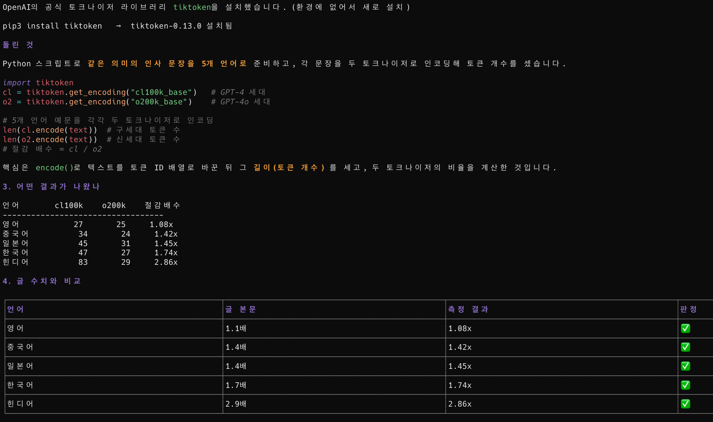
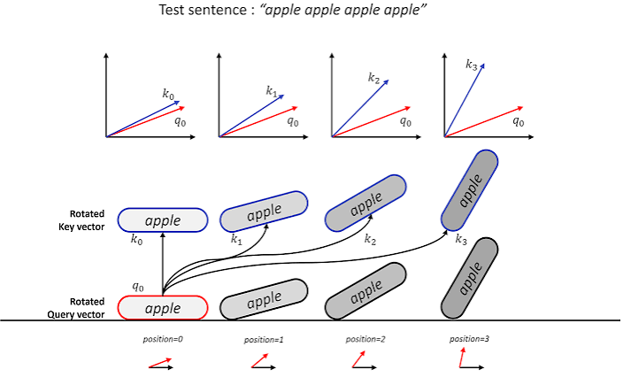
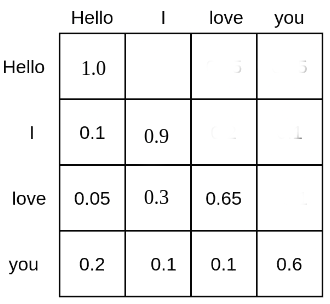

이번 포스팅에서는 AI 토큰이 도대체 무엇이고 어떤 원리로 동작하는지에 대한 이야기를 해보려고 한다.

필자는 그동안 AI 도구를 어떻게 잘 쓸지, 어떤 도구가 유행이고 왜 유행하는지를 주로 다뤄왔다. 그러다 [토큰 절약법](/260611) 글을 정리하면서 한 가지를 새삼 느꼈다. 비용을 줄이는 방법을 이야기하려면 결국 "토큰이 무엇이고 어떻게 청구되는가"를 먼저 알아야 하는데, 정작 그 토대를 제대로 짚고 넘어간 적이 없었다는 점이다. (절약법을 쓰다 보니 토큰 동작 원리만 따로 떼어 한 편으로 다룰 분량이 나왔다.)

그래서 이 글은 절약법으로 들어가기 전의 토대에 해당한다. 토큰이 단어도 글자도 아니라면 정확히 무엇인지(BPE), 토큰이 어떤 모습으로 모델에 들어가는지(임베딩), 입력보다 출력이 왜 비싼지(prefill/decode), prompt caching 이 단가를 깎는 이유가 트랜스포머(신경만 설계도) 안쪽 어디에서 나오는지(KV 캐시), 그리고 컨텍스트가 길어질수록 왜 비싸지는지(어텐션의 제곱 비용)까지를 차례로 정리한다. 절약의 실천법이 궁금하다면 이 글 다음에 토큰 절약법 으로 이어 읽으면 된다.

---

## 토큰은 단어도 글자도 아니다

먼저 가장 기본이 되는 사실부터 짚는다. **토큰은 단어도 아니고 글자도 아니다.** 모델이 학습 데이터에서 자주 등장한 문자 시퀀스를 압축해 만든 어휘의 단위다.

우리가 흔히 "이 문장은 몇 단어야?" 라고 세는 직관과 모델이 텍스트를 쪼개는 방식은 다르다. 모델은 자주 같이 등장하는 글자 조합을 하나의 단위로 묶어 두고, 텍스트가 들어오면 그 어휘 사전에 맞춰 잘게 나눈다. 그래서 같은 한 단어라도 어떤 건 토큰 하나로, 어떤 건 토큰 여러 개로 쪼개진다.

이 어휘 사전을 만드는 알고리즘이 거의 모든 현대 LLM 의 공통 토대인 BPE 다.

### BPE 알고리즘

BPE(Byte Pair Encoding, 바이트 쌍 부호화)는 자주 같이 등장하는 인접 심볼 쌍을 반복적으로 하나의 새 심볼로 병합해서 어휘를 키워가는 알고리즘이다.

흥미로운 건 이게 원래 자연어 처리용으로 태어난 알고리즘이 아니라는 점이다. BPE 는 1994년 Philip Gage 가 데이터 압축 기법으로 처음 제안했다. 데이터에서 가장 자주 등장하는 바이트 쌍을, 데이터에 쓰이지 않은 바이트 하나로 치환하고 그 치환 규칙을 따로 표로 저장하는 압축 방식이었다.

이걸 신경망 번역의 어휘 문제에 끌어온 것이 에든버러 대학의 Sennrich 연구팀이다. 2015년에 공개되고 ACL 2016 에서 발표된 "Neural Machine Translation of Rare Words with Subword Units" 논문에서, 이들은 고정된 어휘 사전으로는 희귀어나 처음 보는 단어를 다룰 수 없다는 한계를 BPE 로 풀었다. 단어를 통째로 외우는 대신 더 작은 부분단어(subword) 조각의 조합으로 표현하면, 사전에 없던 단어도 조각들로 인코딩할 수 있다는 발상이다.

작동 과정 자체는 의외로 단순하다.

1. 처음에는 글자 하나하나가 토큰 하나다.
2. 말뭉치에서 가장 자주 인접해 등장하는 토큰 쌍을 찾는다.
3. 그 쌍을 하나의 새 토큰으로 병합하고, 말뭉치 전체에서 해당 쌍을 새 토큰으로 치환한다.
4. 어휘 크기 한도에 도달할 때까지 2~3 을 반복한다.

그래서 처음엔 글자 하나가 토큰 하나지만, "th", "the", "tion" 처럼 자주 등장하는 조합이 점점 하나의 토큰으로 합쳐진다. 자주 쓰이는 패턴일수록 더 큰 덩어리로 묶이는 셈이다.

GPT 계열은 여기서 한 단계 더 들어간 **byte-level BPE** 를 쓴다. 텍스트를 글자가 아니라 UTF-8 바이트 스트림으로 먼저 변환한 뒤 BPE 를 적용하는 방식이다. 이렇게 하면 기본 어휘가 256개(바이트의 가짓수)로 작게 출발하면서도, UTF-8 로 표현 가능한 모든 텍스트를 처음 보는 문자(unknown token) 없이 인코딩할 수 있다. 이모지든 한자든 특수문자든, 최소한 바이트 단위로는 무조건 표현 가능하다는 보장이 생기는 것이다.

### 같은 텍스트, 다른 토큰 수

이 구조 때문에 같은 텍스트라도 토크나이저(사람이 쓴 텍스트를 모델이 다룰 수 있는 토큰 단위로 쪼개는 도구)에 따라 토큰 수가 크게 달라진다. 어휘 사전이 어떻게 학습됐느냐에 따라 같은 문장이 더 잘게도, 더 큰 덩어리로도 쪼개지기 때문이다.

OpenAI 가 GPT-4o 와 함께 공개한 자료를 보면 이 차이가 잘 드러난다. GPT-4o 계열의 새 토크나이저 o200k_base 는 GPT-4 계열의 cl100k_base 대비 같은 텍스트를 더 적은 토큰으로 표현한다. 영어는 약 1.1배 효율적인 정도지만, 비영어권으로 갈수록 격차가 벌어진다. 공개된 짧은 예문 기준으로 중국어와 일본어는 약 1.4배, 한국어는 약 1.7배, 힌디어는 약 2.9배까지 토큰이 줄어든다. (한국어 사용자 입장에서 토크나이저 세대 차이가 영어보다 더 크게 체감된다는 게 흥미로운 지점이다.)

조금 더 넓게 보면 언어 자체에 따른 격차도 있다. cl100k_base 를 기준으로 여러 언어를 비교한 Yennie Jun 의 분석을 보면, 같은 의미의 문장도 영어가 거의 항상 최소 토큰이고 고유 문자 체계를 쓰는 언어일수록 토큰이 길어진다. 힌디어나 벵골어는 영어의 5배, 버마어는 10배가 넘는 토큰을 쓰기도 한다. 한국어나 중국어도 영어보다는 길게 토큰화되지만, 그 극단적인 언어들만큼은 아니다.

여기서 실무적으로 중요한 함의가 하나 나온다. Anthropic 도 Opus 4.7 부터 새 토크나이저를 도입하면서 공식 가격 문서에 "같은 텍스트가 이전 모델 대비 최대 35% 더 많은 토큰으로 청구될 수 있다" 고 명시했다. **단가가 같아도 토큰 수가 늘면 청구액은 그대로 늘어난다는 것이다.** 모델 비교는 단가만 볼 게 아니라 단가 × 예상 토큰 수의 곱으로 봐야 정직하다. 

그런데 이렇게 쪼개진 토큰이 모델 안으로 들어갈 때, 글자나 단어 그대로 들어가는 건 아니다. 그렇다면 토큰은 어떤 모습으로 모델에 입력되는 걸까?

## 토큰이 모델에 들어가기까지

신경망은 텍스트를 직접 다루지 못한다. 모델이 계산할 수 있는 건 결국 숫자, 정확히는 벡터(여러 숫자를 늘어놓은 배열)뿐이다. 그래서 토큰은 모델에 들어가기 전에 몇 단계를 거쳐 숫자로 바뀐다.

순서대로 정리하면 이렇다.

1. **텍스트 → 토큰**: BPE 토크나이저가 텍스트를 토큰 조각으로 쪼갠다.
2. **토큰 → 토큰 ID**: 각 토큰은 어휘 사전에서 자기 자리를 가리키는 정수 ID 하나로 매핑된다. 예를 들어 `" the"` 가 사전의 1,234번째 토큰이라면 그 토큰은 ID `1234` 가 된다.
3. **토큰 ID → 임베딩 벡터**: 이 ID 로 임베딩 행렬(embedding matrix)의 해당 행을 꺼내 온다. 임베딩 행렬은 `어휘 크기 × 모델 차원(d_model)` 크기의 거대한 표인데, 토큰 ID 하나가 그 표의 한 행, 즉 벡터 하나에 대응된다. 이 벡터가 토큰의 "의미" 를 담은 좌표라고 보면 된다.
4. **위치 정보 더하기**: 셀프 어텐션은 그 자체로는 토큰의 순서를 모른다. "나는 너를 좋아해" 와 "너를 나는 좋아해" 를 똑같이 본다는 뜻이다. 그래서 각 토큰 벡터에 위치 정보를 주입해 순서를 알려준다.

말로만 보면 추상적이니, 이 네 단계를 직접 만져볼 수 있는 위젯을 하나 붙여둔다. 입력 문장을 바꾸거나 토큰을 클릭하면, 그 토큰이 ID 를 거쳐 임베딩 벡터가 되고 위치 정보가 더해져 최종 입력 벡터가 되기까지의 흐름을 따라갈 수 있다. (표시 차원 수를 줄여놨을 뿐 실제 GPT-4 의 벡터는 12,288 차원이라는 점을 떠올리며 보면 좋다.)

여기서 모델 차원(d_model)은 토큰 하나를 표현하는 벡터의 길이다. 원조 트랜스포머 논문에서는 이 값이 512였지만, 요즘 LLM 은 훨씬 크다. (Llama 2 의 7B 모델만 해도 4,096 차원이다.) 모델 차원이 클수록 토큰의 미묘한 의미 차이를 더 풍부하게 표현할 수 있는 대신, 그만큼 계산량과 메모리도 함께 늘어난다.

위치 정보를 주입하는 방식도 세대에 따라 다르다. 원조 트랜스포머는 사인/코사인 함수로 만든 위치 벡터를 임베딩에 그대로 더했지만, 요즘 공개 LLM 들이 사실상 표준으로 쓰는 RoPE(Rotary Position Embedding, 회전 위치 임베딩)는 Query/Key 벡터를 회전시키는 방식으로 어텐션 계산 단계에서 상대 위치를 주입한다. (방식은 달라도 "트랜스포머에 순서 감각을 심어준다" 는 목적은 같다.)

정리하면, **텍스트 → 토큰 → 토큰 ID → 임베딩 벡터(+위치 정보) → 트랜스포머 입력** 이라는 흐름이다. 우리가 청구서에서 보는 "토큰 수" 는 이 파이프라인의 두 번째 칸, 즉 텍스트가 몇 개의 토큰으로 쪼개졌는가의 개수인 셈이다.

여기까지 오면 토큰이 어떻게 만들어지고 어떤 모습으로 모델에 들어가는지가 정리된다. 그렇다면 이 토큰들이 모델 안에서 처리될 때, 입력과 출력의 비용은 왜 그렇게 차이가 나고, 같은 입력을 반복해서 보내는 비용은 어떻게 깎을 수 있는 걸까?

## 입력은 싸고 출력은 비싼 이유

토큰을 다뤄본 사람이라면 한 번쯤 의아했을 지점이 있다. 가격표를 보면 **출력 토큰이 입력 토큰보다 몇 배씩 비싸다.** Anthropic 의 경우 모든 모델에서 출력 단가가 입력 단가의 정확히 5배다. (Opus 는 입력 $5 / 출력 $25, Haiku 는 입력 $1 / 출력 $5 식이다.) 똑같은 토큰 하나인데 왜 들어올 때와 나갈 때의 값이 다른 걸까?

답은 모델이 토큰을 처리하는 방식이 입력과 출력에서 완전히 다르기 때문이다. LLM 추론은 두 단계로 나뉜다.

- **prefill (입력 처리)**: 프롬프트로 들어온 모든 토큰을 **한꺼번에 병렬로** 처리한다. 1,000개 토큰이든 1만개 토큰이든, GPU 가 한 번에 쭉 훑어서 각 토큰의 K/V(Key/Value) 를 계산한다. 연산량은 많지만 병렬로 처리되니 토큰당 효율이 좋다.
- **decode (출력 생성)**: 응답 토큰은 **한 번에 하나씩 순차적으로** 만든다. 토큰 하나를 생성하면 그걸 다시 입력에 붙이고, 또 그다음 토큰을 만든다. 이걸 응답이 끝날 때까지 반복한다.

이 비대칭으로 비용 차이가 발생한다. Databricks 의 추론 성능 분석에 따르면, prefill 은 연산이 병목인 compute-bound 단계이고 decode 는 메모리 대역폭이 병목인 memory-bound 단계다. decode 에서는 토큰 하나를 만들 때마다 모델 가중치 전체를 GPU 메모리에서 다시 읽어 와야 하는데, 정작 그 한 번에 토큰은 딱 하나만 나온다. GPU 의 막대한 연산 능력이 거의 놀고 있는 셈이다. (Databricks 의 표현을 빌리면, 돈을 내고 GPU 를 켜두지만 가용 연산을 못 쓰고 있는 상황이다.)

즉 **입력 토큰은 병렬 prefill 로 한 번에 효율적으로 처리되는 반면, 출력 토큰은 한 토큰씩 비효율적으로 짜내야 한다.** 출력이 비싸게 책정되는 데에는 수요나 마진 같은 상업적 요인도 섞여 있겠지만, 적어도 기술적으로는 decode 단계의 이런 비효율이 그 배경에 깔려 있다. 그래서 "출력을 짧게 받는다" 는 절약 원칙은 단순한 절약 팁이 아니라 가장 비싼 단계를 줄이는 일인 것이다.

그렇다면 이 비효율적인 decode 단계를 조금이라도 덜 비효율적으로 만들 방법은 없을까? 바로 그 지점에서 KV 캐시가 등장한다.

## 캐시가 단가를 깎는 원리

prompt caching 은 정적인 입력을 캐시에 한 번 저장해두고 다음 호출에서는 훨씬 싼 가격으로 다시 읽는 장치다. Anthropic 공식 문서 기준으로 캐시 읽기는 기본 입력 단가의 0.1배, 즉 정확히 10% 수준이다. 캐시 쓰기는 5분 TTL(Time To Live, 캐시 유효 시간) 기준 1.25배, 1시간 TTL 기준 2배가 붙는다. 첫 호출에서 살짝 더 내고, 두 번째 호출부터 90% 를 깎는 구조인 셈이다.

그런데 어떻게 단가의 90% 가 깎이는 걸까? 그리고 왜 "프리픽스가 정확히 같아야 한다" 는 조건이 그렇게 까다로운 걸까? 이 두 질문의 답은 트랜스포머의 안쪽 동작을 한 번 들여다보면 분명해진다.

### KV 캐시

모델은 입력 토큰을 처리할 때 각 토큰에 대응되는 Query/Key/Value(Q/K/V) 벡터를 만든다. 셀프 어텐션은 Query 와 Key 의 내적으로 어텐션 점수를 계산하고, 그 점수로 Value 의 가중합을 만들어 출력을 낸다. 한 토큰이 다른 토큰들을 "얼마나 참고할지" 를 정하는 계산이라고 보면 된다.

앞서 본 decode 단계가 바로 이 지점에서 문제가 된다. 새 토큰을 하나 만들 때마다 그 앞의 모든 토큰에 대한 K/V 가 필요한데, 매번 처음부터 다시 계산하면 같은 K/V 를 끝없이 중복 계산하게 된다.

KV 캐시는 바로 이 중복을 없애려고 도입된 구조다. 한 번 계산한 K/V 를 저장해두고, 새 토큰을 생성할 때 앞 토큰들의 K/V 는 다시 계산하지 않고 캐시에서 읽어 재사용한다. 덕분에 한 시퀀스 안에서 토큰을 하나 더 생성하는 비용이, 매 스텝 전체를 다시 계산하는 O(n²) 에서 캐시를 읽기만 하는 O(n) 으로 떨어진다. (엄밀히는 스텝당 비용 기준의 이야기지만, 핵심은 "이미 계산한 건 다시 계산하지 않는다" 는 단순한 발상이다.) decode 가 memory-bound 인 이유도 여기에 있다. 매 스텝 이 KV 캐시를 메모리에서 다시 읽어 와야 하기 때문이다.

### 호출 사이의 재사용

KV 캐시가 원래 한 번의 응답 생성 안에서 디코딩을 가속하려고 만들어진 구조라면, prompt caching 은 이 메모리 구조를 **하나의 호출 안이 아니라 호출과 호출 사이에서도 재활용하자** 는 발상이다.

정적인 프리픽스(시스템 프롬프트, 도구 정의, 코드 스니펫처럼 매번 거의 같은 앞부분)의 K/V 를 5분 또는 1시간 TTL 동안 GPU 메모리에 들고 있다가, 다음 호출이 같은 프리픽스로 시작하면 그 부분의 K/V 계산을 통째로 건너뛰고 캐시에서 곧장 읽어 쓴다. 그래서 정확히 말하면, 입력 토큰의 단가가 마법처럼 깎이는 게 아니라 **그 토큰을 계산하는 GPU 일 자체가 사라지는 것이다.** 단가의 90% 인하는 그 절약된 연산을 가격에 반영한 결과다.

이 메커니즘을 이해하면 "프리픽스가 정확히 같아야 한다" 는 조건이 왜 그렇게 엄격한지도 자연스럽게 풀린다. 캐시 적중 여부는 프리픽스를 누적적으로 해싱한 값이 일치하는지로 판정되는데, 셀프 어텐션은 인과적(causal)이라 앞 토큰이 하나라도 바뀌면 그 뒤 토큰들의 K/V 가 전부 달라진다. 그래서 프롬프트 맨 앞에 타임스탬프 한 줄만 들어가 있어도, 매 호출마다 그 값이 달라지면서 프리픽스 해시가 어긋나 그 뒤 캐시 전체가 무효화된다.

Anthropic 의 캐시는 `tools` → `system` → `messages` 순서의 계층으로 읽힌다. 그래서 앞쪽의 도구 정의 하나만 바뀌어도 그 뒤 캐시 전체가 무효화된다. 결론은 단순하다. **정적인 것은 앞에, 매번 바뀌는 동적인 것은 뒤에 두어야 캐시가 산다.**

캐시에는 잘 알려지지 않은 제약도 몇 가지 있다. 캐시 가능한 최소 토큰 수가 모델마다, 또 같은 패밀리 안에서도 버전마다 다르다. 그보다 짧은 프롬프트는 캐시 설정을 걸어도 조용히 캐시되지 않는다. (이 최소 토큰 수와 프로바이더별 캐시 정책 차이는 비용 설계와 직결되는 부분이라, 토큰 절약법 글에서 가격표와 함께 자세히 다뤘다.)

## 컨텍스트 윈도우가 토큰 한도를 만드는 이유

마지막으로 토큰을 이야기할 때 빠질 수 없는 개념이 컨텍스트 윈도우(context window)다. 모델이 한 번에 받아들일 수 있는 토큰 수의 한도를 가리키는 말인데, 왜 이런 한도가 존재하는지를 알면 "컨텍스트가 길어질수록 비싸진다" 는 흔한 경고의 정체도 분명해진다.

핵심은 셀프 어텐션의 연산 구조에 있다. 어텐션은 모든 토큰이 다른 모든 토큰을 한 번씩 참고하는 계산이다. 토큰이 n개라면 토큰 쌍의 수는 n × n, 즉 **셀프 어텐션의 연산량과 메모리가 시퀀스 길이 n의 제곱에 비례해 늘어난다.** 토큰이 2배가 되면 어텐션 비용은 4배가 되는 식이다. (모델 전체가 O(n²)인 건 아니고, 어텐션 단계가 그렇다는 점은 짚어둘 필요가 있다.)

이 제곱 증가가 얼마나 가파른지 [HuggingFace 의 추정 수치](https://huggingface.co/docs/transformers/en/llm_tutorial_optimization)가 잘 보여준다. 최적화 없는 표준 어텐션 기준으로, 어텐션 점수 행렬을 저장하는 데만 입력이 1,000 토큰일 때는 약 50MB 면 충분하지만, 16,000 토큰에서는 약 19GB, 10만 토큰에서는 거의 1TB 가 필요하다.

여기에 앞서 본 KV 캐시도 토큰 수에 비례해 메모리를 차지한다. 컨텍스트가 길어질수록 들고 있어야 할 K/V 가 선형으로 쌓이는 것이다. 결국 컨텍스트 윈도우 한도는 "이보다 길어지면 메모리와 연산이 감당이 안 된다" 는 물리적 한계를 모델이 정해둔 선인 셈이다.

그래서 긴 대화를 그대로 끌고 가는 게 단순히 입력 토큰 수만 늘리는 문제가 아니라는 점이 중요하다. 어텐션 비용이 제곱으로 붙고, 토큰이 한도에 가까워질수록 모델이 정보를 다루는 정확도까지 떨어진다. (이 정확도 저하 현상은 절약법 글에서 다룬 context rot 과 직결되는데, 컨텍스트를 가볍게 유지하는 일이 비용과 정답률 양쪽에 이로운 이유가 바로 여기에 있다.)

## 마무리

여기까지 정리하고 보면, 토큰의 동작 원리는 몇 개의 단순한 사실로 압축된다. **토큰은 BPE 가 자주 쓰이는 패턴을 묶어 만든 어휘의 단위**이고, 토큰 ID 를 거쳐 임베딩 벡터로 바뀌어 모델에 들어간다. **입력은 병렬 prefill 로 한 번에 처리되지만 출력은 한 토큰씩 짜내야 해서 더 비싸고**, 그 비효율을 덜어주는 게 K/V 를 재사용하는 KV 캐시다. **캐시가 단가를 깎는 건 마법이 아니라 트랜스포머가 이미 계산해 둔 K/V 를 다시 계산하지 않기 때문이며**, 프리픽스가 정확히 같아야 한다는 까다로운 조건도 이 구조에서 곧장 따라 나온다. 그리고 컨텍스트가 길어질수록 비싸지는 건 어텐션 비용이 토큰 수의 제곱으로 붙기 때문이다.

이 토대를 알고 나면 비용 이야기가 훨씬 또렷하게 보인다. 출력이 왜 비싼지, 캐시를 깨지 않으려면 프롬프트를 어떻게 배치해야 하는지, 컨텍스트를 왜 가볍게 유지해야 하는지, 같은 답이면 왜 더 싼 모델로 옮겨야 하는지 같은 절약 전략들이 전부 이 원리 위에 서 있기 때문이다. 동작 원리가 궁금해서 여기까지 읽은 독자라면, 이어서 토큰 절약법 에서 그 원리들이 실제 비용을 어떻게 깎는지 확인해보시길 권하고 싶다.

:::ref
- [paper] [Philip Gage, A New Algorithm for Data Compression (1994)](https://en.wikipedia.org/wiki/Byte-pair_encoding)
- [paper] [Sennrich, Haddow, Birch, Neural Machine Translation of Rare Words with Subword Units (ACL 2016)](https://arxiv.org/abs/1508.07909)
- [article] [Jay Alammar, The Illustrated Transformer](https://jalammar.github.io/illustrated-transformer/)
- [docs] [HuggingFace, Byte-Pair Encoding tokenization](https://huggingface.co/learn/nlp-course/en/chapter6/5)
- [docs] [HuggingFace, Transformers KV Cache strategies](https://huggingface.co/docs/transformers/en/kv_cache)
- [repo] [OpenAI, tiktoken](https://github.com/openai/tiktoken)
- [article] [OpenAI, Hello GPT-4o (Language tokenization)](https://openai.com/index/hello-gpt-4o/)
- [article] [Yennie Jun, All languages are NOT created (tokenized) equal](https://www.artfish.ai/p/all-languages-are-not-created-tokenized)
- [article] [Databricks, LLM Inference Performance Engineering Best Practices](https://www.databricks.com/blog/llm-inference-performance-engineering-best-practices)
- [article] [Baseten, A guide to LLM inference and performance](https://www.baseten.co/blog/llm-transformer-inference-guide/)
- [docs] [Anthropic, Prompt Caching](https://docs.anthropic.com/en/docs/build-with-claude/prompt-caching)
:::
