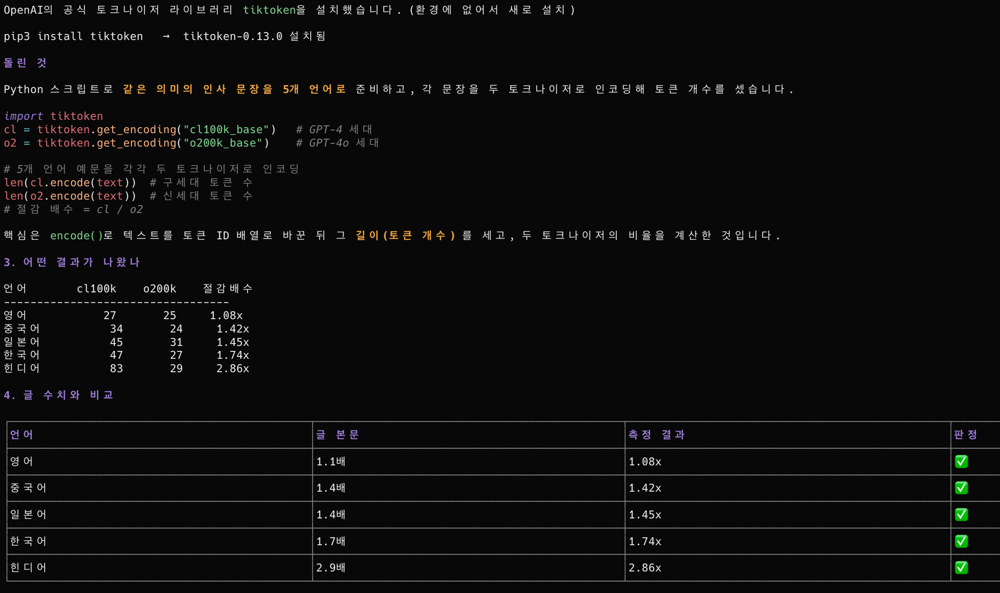
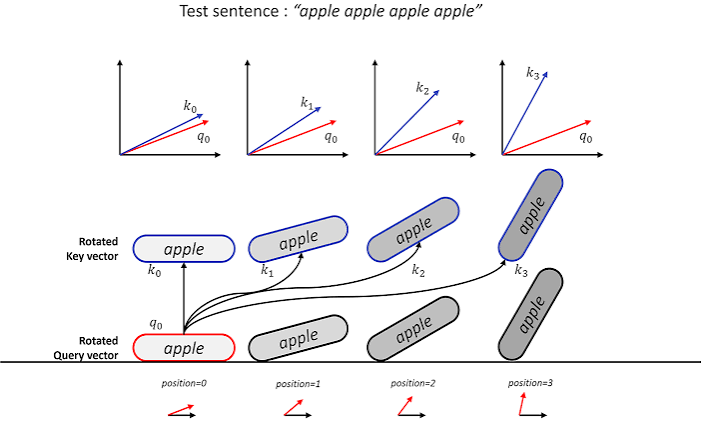
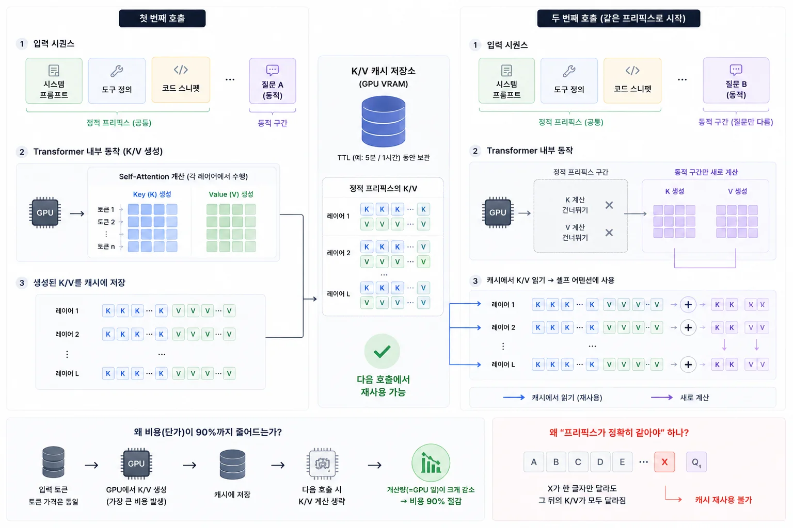
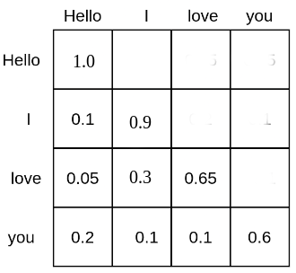

Neste artigo, quero explicar o que são, afinal, os tokens de IA e como eles funcionam.

Até agora, escrevi principalmente sobre como usar bem as ferramentas de IA, quais estão em alta e por quê. Mas, ao preparar o texto sobre [como economizar tokens](/260611), percebi novamente algo importante: para falar em reduzir custos, primeiro é preciso entender “o que é um token e como ele é cobrado”, mas eu nunca havia explicado essa base de forma adequada. (Enquanto escrevia o guia de economia, a parte sobre o funcionamento dos tokens cresceu o bastante para virar um artigo próprio.)

Este texto, portanto, estabelece os fundamentos antes das técnicas de economia. Vamos ver o que exatamente é um token, se não é palavra nem caractere (BPE); em que formato ele entra no modelo (embedding); por que a saída custa mais que a entrada (prefill/decode); de onde, dentro do Transformer — a arquitetura da rede neural — vem a redução de preço do prompt caching (KV cache); e por que um contexto mais longo fica mais caro (o custo quadrático da atenção). Para medidas práticas, depois deste artigo continue em [Como economizar tokens](/260611).

---

## Token não é palavra nem caractere

Comecemos pelo fato mais básico: **token não é palavra nem caractere.** É uma unidade de um vocabulário que o modelo cria ao comprimir sequências de caracteres frequentes nos dados de treinamento.

Nossa intuição ao perguntar “quantas palavras há nesta frase?” é diferente da forma como o modelo divide o texto. Ele agrupa em uma unidade as combinações de caracteres que aparecem juntas com frequência e segmenta o texto recebido de acordo com esse vocabulário. Por isso, uma palavra pode corresponder a um único token ou ser dividida em vários.

O algoritmo que constrói esse vocabulário é o BPE, uma base comum a praticamente todos os LLMs modernos.

### O algoritmo BPE

BPE (Byte Pair Encoding, ou codificação de pares de bytes) expande o vocabulário ao fundir repetidamente o par de símbolos adjacentes mais frequente em um novo símbolo.

O curioso é que ele não nasceu para o processamento de linguagem natural. Philip Gage propôs o BPE pela primeira vez em 1994 como técnica de compressão de dados. O método substituía o par de bytes mais frequente por um byte não utilizado nos dados e armazenava as regras de substituição separadamente em uma tabela.

A equipe de Sennrich, da Universidade de Edimburgo, levou a ideia para o problema de vocabulário na tradução neural. No artigo “Neural Machine Translation of Rare Words with Subword Units”, publicado em 2015 e apresentado na ACL 2016, os pesquisadores usaram BPE para superar a incapacidade de um vocabulário fixo de lidar com palavras raras ou desconhecidas. Em vez de memorizar palavras inteiras, elas são representadas como combinações de fragmentos subword menores; assim, até uma palavra fora do vocabulário pode ser codificada com partes conhecidas.

O processo em si é surpreendentemente simples.

1. No início, cada caractere individual é um token.
2. Encontra-se no corpus o par de tokens adjacentes que aparece com maior frequência.
3. O par é fundido em um novo token, que substitui todas as ocorrências desse par no corpus.
4. Os passos 2 e 3 são repetidos até o vocabulário alcançar o tamanho desejado.

Assim, embora no começo cada caractere seja um token, combinações frequentes como “th”, “the” e “tion” acabam fundidas em tokens únicos. Quanto mais comum o padrão, maior a chance de ele se tornar um bloco maior.

A família GPT vai além e usa **BPE em nível de bytes**. Primeiro, o texto é convertido em um fluxo de bytes UTF-8; depois, aplica-se BPE. Isso permite começar com um vocabulário-base de apenas 256 itens — um para cada byte possível — e ainda codificar qualquer texto representável em UTF-8 sem tokens desconhecidos. Seja um emoji, um ideograma chinês ou um símbolo especial, sempre existe pelo menos uma representação no nível de byte.

### Mesmo texto, quantidades diferentes de tokens

Por causa dessa estrutura, o mesmo texto pode gerar números de tokens muito diferentes dependendo do tokenizer, a ferramenta que divide o texto escrito por pessoas em unidades que o modelo consegue processar. Conforme a forma de treinamento do vocabulário, a mesma frase pode ser quebrada em partes menores ou em blocos maiores.

O material publicado pela OpenAI com o GPT-4o mostra bem essa diferença. O novo tokenizer o200k_base da família GPT-4o representa o mesmo texto com menos tokens que o cl100k_base da família GPT-4. Em inglês, ele é apenas cerca de 1,1 vez mais eficiente, mas a diferença cresce em outros idiomas. Nos exemplos curtos publicados, a contagem caiu aproximadamente 1,4 vez em chinês e japonês, 1,7 vez em coreano e até 2,9 vezes em hindi. (Para quem usa coreano, é interessante como a diferença entre gerações de tokenizer se mostra muito mais perceptível do que em inglês.)

Em uma visão mais ampla, também há diferenças entre os próprios idiomas. Na análise de Yennie Jun com cl100k_base, frases com o mesmo sentido quase sempre usaram menos tokens em inglês, enquanto idiomas com sistemas de escrita próprios tenderam a usar mais. Hindi e bengali podem consumir cinco vezes mais tokens que o inglês; birmanês, mais de dez vezes. Coreano e chinês também são tokenizados em mais partes que o inglês, embora sem chegar a esses extremos.

Daí surge uma consequência prática importante. Ao adotar um novo tokenizer a partir do Opus 4.7, a Anthropic declarou na documentação oficial de preços que “o mesmo texto pode ser cobrado como até 35% mais tokens do que nos modelos anteriores”. **Mesmo que o preço por token permaneça igual, a conta cresce na mesma proporção da quantidade de tokens.** Uma comparação honesta entre modelos precisa considerar não apenas a tarifa, mas a tarifa multiplicada pelo número esperado de tokens.

Mas, quando esses tokens segmentados entram no modelo, eles não entram como caracteres ou palavras literais. Então, em que formato um token serve de entrada para o modelo?

## Como os tokens entram no modelo

Redes neurais não trabalham diretamente com texto. No fim das contas, o modelo só calcula com números — mais precisamente, vetores, que são conjuntos de números. Por isso, antes de entrar no modelo, os tokens passam por várias etapas que os transformam em valores numéricos.

A sequência é esta.

1. **Texto → tokens**: um tokenizer BPE divide o texto em fragmentos de token.
2. **Token → token ID**: cada token é mapeado para um ID inteiro que indica sua posição no vocabulário. Por exemplo, se `" the"` for o 1.234º token, seu ID será `1234`.
3. **Token ID → vetor de embedding**: o ID seleciona a linha correspondente da matriz de embeddings. Essa matriz é uma tabela enorme de tamanho `vocabulary size × model dimension (d_model)`; cada token ID corresponde a uma linha, isto é, a um vetor. Podemos imaginar esse vetor como coordenadas que carregam o “significado” do token.
4. **Adicionar informação posicional**: sozinha, a autoatenção não sabe a ordem dos tokens. Em outras palavras, veria “eu gosto de você” e “você eu gosto de” como a mesma coisa. Portanto, injeta-se informação posicional em cada vetor de token para informar a ordem da sequência.

Como isso soa abstrato apenas em palavras, incluí uma ferramenta interativa para explorar as quatro etapas. Ao mudar a frase ou clicar em um token, é possível acompanhar o caminho do ID ao vetor de embedding e ver a informação posicional ser adicionada até formar o vetor de entrada final. (Só algumas dimensões são exibidas, mas vale lembrar que o vetor real do GPT-4 tem 12.288.)

A dimensão do modelo (d_model) é o comprimento do vetor que representa um token. No artigo original do Transformer, o valor era 512, mas nos LLMs atuais é muito maior. (Até o Llama 2 7B usa 4.096 dimensões.) Uma dimensão maior representa diferenças sutis de significado com mais riqueza, porém também aumenta o volume de cálculo e memória.

A forma de injetar informação posicional também mudou ao longo das gerações. O Transformer original somava aos embeddings vetores de posição construídos com funções seno e cosseno. Já o RoPE (Rotary Position Embedding), hoje padrão de fato em LLMs abertos, injeta a posição relativa durante o cálculo da atenção ao rotacionar os vetores Query e Key. (O mecanismo muda, mas o objetivo é o mesmo: dar ao Transformer noção de ordem.)

Em resumo, o fluxo é **texto → tokens → token IDs → vetores de embedding (+ informação posicional) → entrada do Transformer**. A “contagem de tokens” da fatura corresponde à segunda etapa desse fluxo: quantos tokens resultaram da segmentação do texto.

Agora sabemos como os tokens são criados e em que formato entram no modelo. Mas, quando são processados, por que entrada e saída custam tão diferente, e como reduzir o custo de enviar repetidamente a mesma entrada?

## Por que a entrada é barata e a saída é cara

Quem já trabalhou com tokens provavelmente se perguntou: nas tabelas de preços, **tokens de saída custam várias vezes mais que tokens de entrada.** Na Anthropic, em todos os modelos, a tarifa de saída é exatamente cinco vezes a de entrada. (No Opus, são $5 de entrada e $25 de saída; no Haiku, $1 e $5.) Se é o mesmo token, por que o preço muda conforme entra ou sai?

A resposta é que o modelo processa tokens de maneiras completamente diferentes na entrada e na saída. A inferência de um LLM tem duas etapas.

- **prefill (processamento da entrada)**: processa todos os tokens da instrução **de uma só vez e em paralelo**. Com 1.000 ou 10.000 tokens, a GPU percorre todos em conjunto e calcula os vetores K/V (Key/Value) de cada token. O cálculo total é grande, mas o paralelismo proporciona boa eficiência por token.
- **decode (geração da saída)**: gera os tokens da resposta **sequencialmente, um de cada vez**. Depois de produzir um token, ele é acrescentado à entrada e o próximo é gerado. O ciclo se repete até o fim da resposta.

Essa assimetria cria a diferença de custo. Segundo a análise de desempenho de inferência da Databricks, prefill é uma etapa limitada por computação, enquanto decode é limitada pela largura de banda da memória. Durante decode, para produzir cada token, é preciso reler da memória da GPU todos os pesos do modelo; no entanto, cada passagem gera apenas um token. Grande parte da enorme capacidade de cálculo da GPU fica ociosa. (Nas palavras da Databricks, você paga para manter a GPU ligada sem usar a computação disponível.)

Em outras palavras, **tokens de entrada são processados juntos com eficiência no prefill paralelo, enquanto tokens de saída precisam ser extraídos de forma ineficiente, um a um.** Fatores comerciais como demanda e margem também podem afetar os preços, mas essa ineficiência de decode compõe a explicação técnica. Portanto, “manter a saída curta” não é apenas uma dica genérica de economia: reduz diretamente a etapa mais cara.

Existe alguma forma de tornar decode ao menos um pouco menos ineficiente? É aqui que entra o KV cache.

## Como o armazenamento em cache reduz o preço

Prompt caching armazena uma vez a entrada estática para que as chamadas seguintes a leiam por um preço bem menor. Segundo a documentação oficial da Anthropic, uma leitura custa 0,1 vez a tarifa-base de entrada, ou exatamente 10%. A escrita custa 1,25 vez com TTL (Time To Live, período de validade dos dados armazenados) de cinco minutos e 2 vezes com TTL de uma hora. Paga-se um pouco mais na primeira chamada e economiza-se 90% a partir da segunda.

Mas como o preço pode cair 90%? E por que a exigência de que “o prefixo coincida exatamente” é tão rigorosa? As duas respostas ficam claras quando olhamos dentro do Transformer.

### KV cache

Ao processar tokens de entrada, o modelo cria os vetores Query/Key/Value (Q/K/V) correspondentes. A autoatenção calcula pontuações de atenção pelo produto escalar de Query e Key e usa essas pontuações para produzir uma soma ponderada dos valores. É o cálculo que determina quanto um token deve “consultar” cada um dos outros.

É justamente aí que a etapa de decode mencionada antes se torna problemática. Para gerar cada novo token, o modelo precisa dos K/V de todos os tokens anteriores. Recalculá-los do zero em todas as etapas repetiria o mesmo trabalho indefinidamente.

O KV cache elimina essa duplicação. Ele armazena os K/V já calculados e, ao gerar um novo token, lê e reutiliza os K/V anteriores, em vez de calculá-los novamente. Dentro de uma sequência, o custo de gerar mais um token cai de O(n²), que recalcularia toda a sequência a cada etapa, para O(n), que apenas lê os dados armazenados. (A rigor, esse é o custo por etapa; a ideia central é simples: não recalcular o que já foi calculado.) É também por isso que decode é limitado pela memória: cada etapa precisa reler o KV cache da memória.

### Reutilização entre chamadas

Se o KV cache foi criado para acelerar decode dentro de uma resposta, prompt caching propõe reutilizar essa estrutura de memória **não apenas dentro de uma chamada, mas também entre uma chamada e a próxima**.

Os K/V de um prefixo estático — como uma instrução de sistema, definições de ferramentas ou trechos de código cujo início muda pouco — permanecem na memória da GPU por um TTL de cinco minutos ou uma hora. Se a chamada seguinte começar com o mesmo prefixo, o modelo ignora por completo o cálculo desses K/V e os lê diretamente dos dados armazenados. Mais precisamente, o preço dos tokens de entrada não cai por mágica: **o trabalho de GPU necessário para calculá-los deixa de existir.** A redução de 90% reflete a computação evitada.

Ao entender o mecanismo, também fica clara a exigência de correspondência exata do prefixo. Um acerto de cache é determinado pela comparação do hash cumulativo do prefixo. Como a autoatenção é causal, mudar um único token anterior altera os K/V de todos os tokens seguintes. Basta colocar uma marca temporal no começo da instrução: o valor muda a cada chamada, o hash deixa de coincidir e todos os dados armazenados depois desse ponto são invalidados.

A Anthropic lê os dados armazenados na hierarquia `tools` → `system` → `messages`. Por isso, mudar uma única definição de ferramenta no início invalida tudo o que vem depois. A conclusão é simples: **conteúdo estático deve ficar no começo; conteúdo dinâmico, que muda a cada chamada, no fim.**

O armazenamento em cache também tem restrições menos conhecidas. A quantidade mínima de tokens que pode ser armazenada varia por modelo e até por versão da mesma família. Uma instrução abaixo desse limite não é armazenada, sem qualquer aviso, mesmo com esse recurso habilitado. (Como esses mínimos e as políticas de cada provedor afetam diretamente o planejamento de custos, eu os detalho junto às tabelas de preços no guia de economia de tokens.)

## Por que a janela de contexto impõe um limite de tokens

O último conceito indispensável é a janela de contexto: o número máximo de tokens que um modelo aceita de uma vez. Entender por que esse limite existe também esclarece o conhecido aviso de que “um contexto mais longo custa mais”.

A chave está na estrutura de cálculo da autoatenção. A atenção faz cada token consultar todos os outros uma vez. Com n tokens, existem n × n pares; portanto, **a computação e a memória da autoatenção crescem com o quadrado do comprimento n da sequência.** Ao dobrar o número de tokens, o custo da atenção quadruplica. (Vale esclarecer que não é o modelo inteiro que tem custo O(n²), mas a etapa de atenção.)

As [estimativas da Hugging Face](https://huggingface.co/docs/transformers/en/llm_tutorial_optimization) mostram como esse crescimento quadrático é acentuado. Com atenção padrão, sem otimização, apenas armazenar a matriz de pontuações exige cerca de 50 MB para uma entrada de 1.000 tokens, aproximadamente 19 GB para 16.000 tokens e quase 1 TB para 100.000.

O KV cache também ocupa memória proporcionalmente ao número de tokens. À medida que o contexto cresce, os K/V que precisam ser mantidos se acumulam linearmente. No fim, o limite da janela de contexto é uma fronteira física definida pelo modelo: além dela, memória e computação se tornam inviáveis.

Por isso, carregar uma conversa longa sem alterações não significa apenas somar tokens de entrada. O custo da atenção cresce ao quadrado e, quanto mais a contagem se aproxima do limite, menor também é a precisão com que o modelo lida com a informação. (Essa perda de precisão está diretamente ligada à degradação do contexto, abordada no guia de economia; manter o contexto enxuto beneficia tanto o custo quanto a qualidade das respostas.)

## Conclusão

Em conjunto, o funcionamento dos tokens se resume a alguns fatos simples. **Token é uma unidade de vocabulário criada pelo BPE ao agrupar padrões frequentes**; depois de ser mapeado para um token ID, ele vira um vetor de embedding e entra no modelo. **A entrada é processada de uma só vez com prefill paralelo, enquanto a saída é mais cara porque precisa ser extraída token por token**; o KV cache reduz essa ineficiência ao reutilizar os K/V. **O armazenamento reduz o preço não por mágica, mas porque o Transformer evita recalcular K/V já obtidos**, e a exigência rigorosa de um prefixo idêntico decorre diretamente dessa estrutura. Por fim, um contexto mais longo custa mais porque o custo da atenção cresce com o quadrado do número de tokens.

Com essa base, a economia dos tokens fica muito mais clara. Encurtar a saída, organizar a instrução para preservar os dados armazenados, manter o contexto enxuto e migrar para um modelo mais barato quando ele oferece a mesma resposta são estratégias apoiadas nesses princípios. Se você chegou até aqui para entender o mecanismo, recomendo continuar no guia de economia de tokens e ver como essas ideias reduzem custos reais.

:::ref
- [paper] [Philip Gage, A New Algorithm for Data Compression (1994)](https://en.wikipedia.org/wiki/Byte-pair_encoding)
- [paper] [Sennrich, Haddow, Birch, Neural Machine Translation of Rare Words with Subword Units (ACL 2016)](https://arxiv.org/abs/1508.07909)
- [article] [Jay Alammar, The Illustrated Transformer](https://jalammar.github.io/illustrated-transformer/)
- [docs] [HuggingFace, Byte-Pair Encoding tokenization](https://huggingface.co/learn/nlp-course/en/chapter6/5)
- [docs] [HuggingFace, Transformers KV Cache strategies](https://huggingface.co/docs/transformers/en/kv_cache)
- [repo] [OpenAI, tiktoken](https://github.com/openai/tiktoken)
- [article] [OpenAI, Hello GPT-4o (Language tokenization)](https://openai.com/index/hello-gpt-4o/)
- [article] [Yennie Jun, All languages are NOT created (tokenized) equal](https://www.artfish.ai/p/all-languages-are-not-created-tokenized)
- [article] [Databricks, LLM Inference Performance Engineering Best Practices](https://www.databricks.com/blog/llm-inference-performance-engineering-best-practices)
- [article] [Baseten, A guide to LLM inference and performance](https://www.baseten.co/blog/llm-transformer-inference-guide/)
- [docs] [Anthropic, Prompt Caching](https://docs.anthropic.com/en/docs/build-with-claude/prompt-caching)
:::
