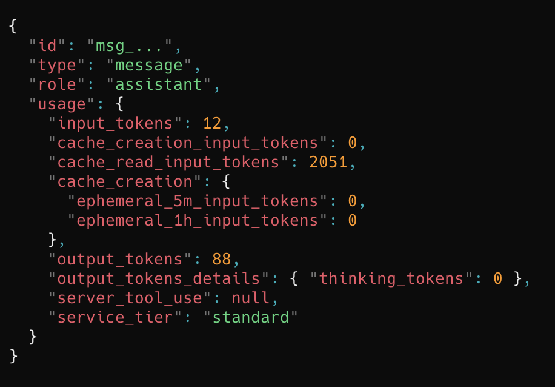
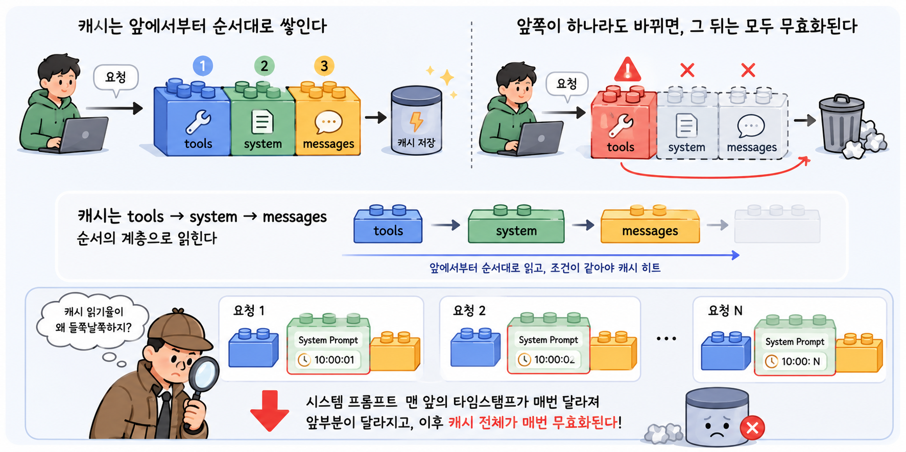
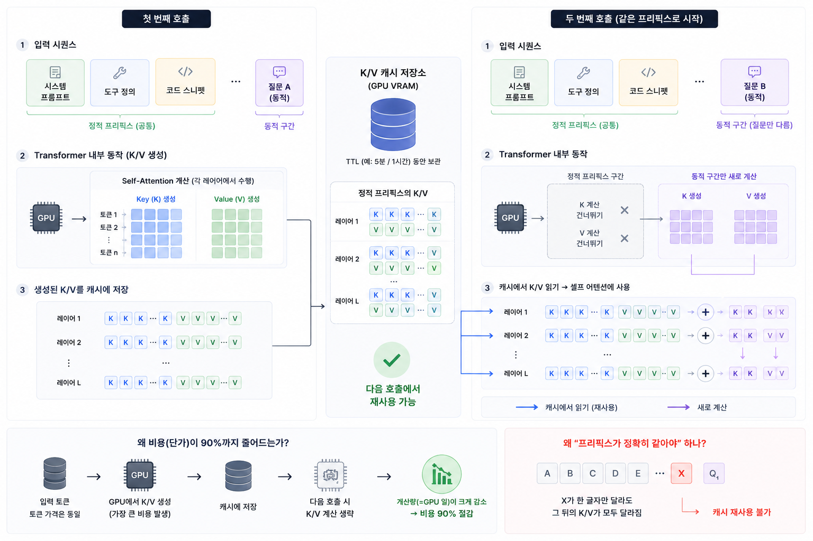
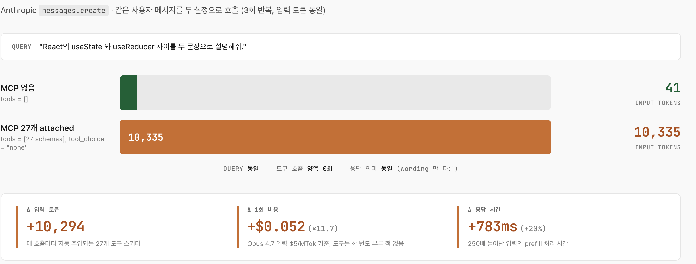
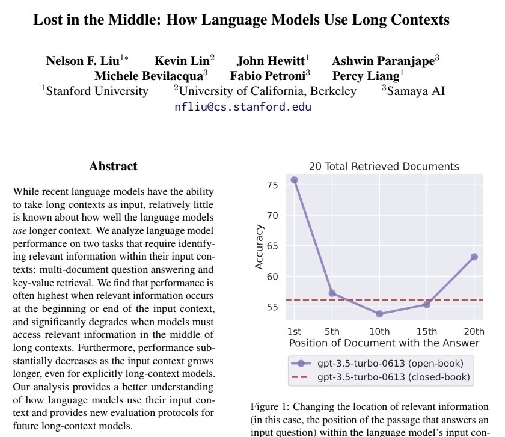
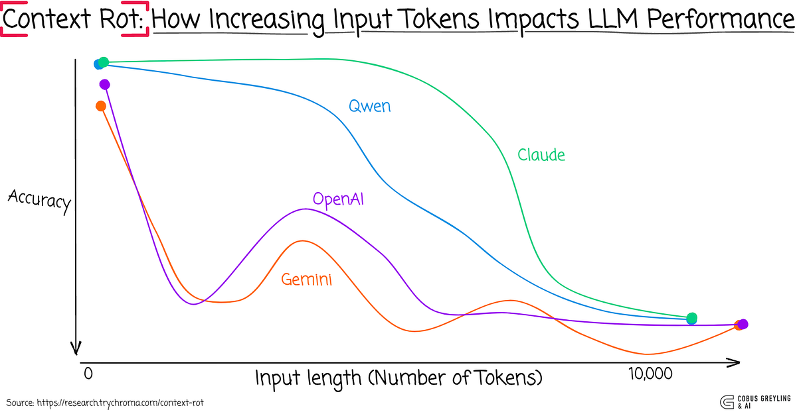
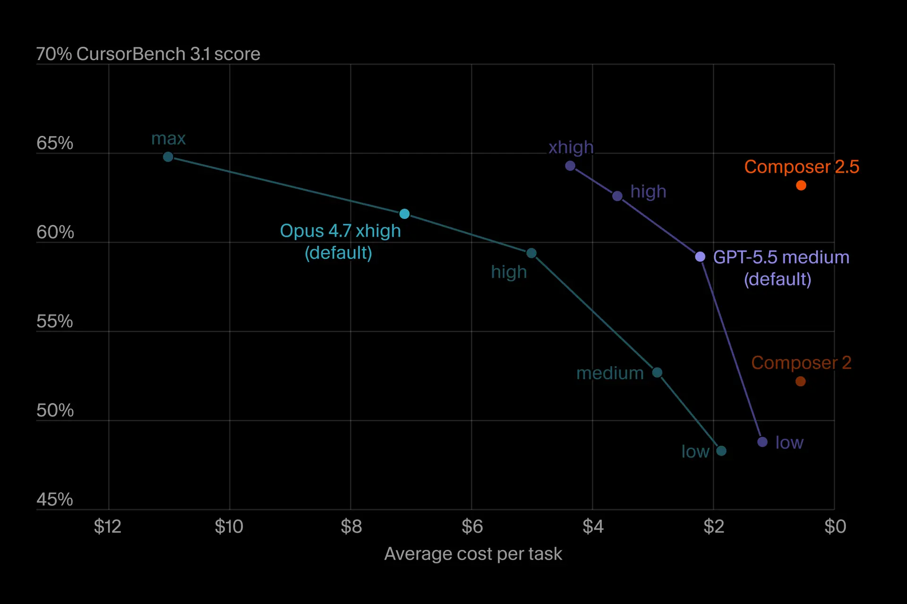

이번 포스팅에서는 AI 토큰을 절약하는 방법에 대한 이야기를 해보려고 한다.

옛날에는 성능과 비용보다는 결과와 과정에 집중했다. AI가 산출한 결과물에 허점이 많다 보니 그것들을 검증해야 했고, 빠르게 결과물을 뽑아야 하다 보니 나를 비롯한 수많은 사람들이 토큰이 부족하면 결제하고 더 높은 구독제를 활용했다. 필자도 그랬다. (사실 처음 몇 달은 토큰 비용이 얼마나 들었는지조차 신경 쓰지 않았다.)

하지만 어느 시점이 지나가니 점점 토큰 사용에 대한 경각심이 생기게 되었다. 개인은 월 결제에 대한 부담감이 컸고, 기업은 인건비와 비용에 대한 고민이 깊어졌다. 필자가 [AI 에이전트 도구 지형도](/260529) 글에서 정리했던 것처럼, 우리가 다뤄온 다른 글들도 AI 가 무엇이고 어떻게 동작하는지보다는 AI 를 어떻게 잘 활용하고 도움을 받을 수 있는지, 어떤 도구가 있고 요즘 어떤 게 유행이고 이런 유행이 왜 발생했는지에 더 집중해왔다. 필자도 그렇게 생각하지만 시간이 지나면 결국 비용에 대한 이야기를 가장 궁금해할 것이라고 생각한다.

비용을 줄이는 방법으로 곧장 들어가기 전에, 토큰 비용이 어떻게 청구되고 어디서 비효율이 만들어지는지를 먼저 살펴본다. 그다음 검증된 절약 패턴을 정리하고, 마지막에는 같은 작업을 다섯 가지 전략으로 호출해 토큰 사용량을 직접 측정해보는 작은 POC 로 마무리한다.

---

## 토큰 비용은 어떻게 발생하는가?

토큰 비용이 어떻게 발생하는지, 어떤 원리로 청구되는지를 아주 가볍고 핵심적으로 살펴보자.

우리가 보낸 모든 텍스트(시스템 프롬프트, 도구 정의, 대화 기록, 사용자 메시지)가 입력 토큰이 되고, 모델이 만들어낸 응답이 출력 토큰이 된다. 모델 입장에서는 매번 호출이 처음 보는 입력이다. 우리가 어제 한 대화든 1분 전 호출이든, 새 호출에서는 같은 내용을 다시 통째로 입력으로 보낸다. (이 단순한 사실이 토큰 비용의 핵심이다. 모델은 기억이 없고, 우리가 매번 다시 들려준다.)

여기에 한 가지 변수가 더 붙는다. 같은 호출을 반복할 때 정적인 부분을 매번 새로 전송하는 비용이 너무 크다 보니, 주요 LLM 제공자들은 prompt caching 이라는 장치를 도입했다. 정적인 입력을 캐시에 한 번 저장해두고 다음 호출에서는 캐시 읽기 분만 훨씬 싼 가격으로 청구한다.

### BPE 알고리즘

비용 이야기를 깊이 들어가기 전에 "토큰" 이 정확히 무엇인지 한 번은 짚을 필요가 있다. **토큰은 단어도 아니고 글자도 아니다.** 모델이 학습 데이터에서 자주 등장한 문자 시퀀스를 압축해 만든 어휘의 단위다. 거의 모든 현대 LLM 은 BPE(Byte Pair Encoding, 바이트 쌍 부호화)라는 알고리즘으로 이 어휘를 만든다. 원래 1994년 데이터 압축 기법으로 제안된 알고리즘인데, 자주 같이 등장하는 인접 심볼 쌍을 반복적으로 하나의 새 심볼로 병합해서 어휘를 키워간다. 처음에는 글자 하나가 토큰 하나지만, "th", "the", "tion" 처럼 자주 등장하는 조합이 점점 하나의 토큰으로 합쳐진다. 어휘 크기 한도에 도달할 때까지 이 병합이 반복된다.

이 구조 때문에 같은 텍스트라도 토크나이저에 따라 토큰 수가 크게 달라진다. OpenAI 자료를 보면 o200k_base 는 cl100k_base 대비 같은 텍스트에 15~20% 더 효율적이고, 중국어 등 비영어권 텍스트에서는 같은 글자가 4~6 토큰에서 1~2 토큰으로 줄어드는 식의 큰 차이가 나타난다. Anthropic 도 Opus 4.7 부터 새 토크나이저를 도입하면서 공식 가격 문서에 "같은 텍스트가 이전 모델 대비 최대 35% 더 많은 토큰으로 청구될 수 있다" 고 명시했다. 단가가 같아도 토큰 수가 늘면 청구액은 그대로 늘어난다. (필자는 그래서 새 모델로 갈아탈 때 단가만 보지 않고 같은 코드 파일을 양쪽 토크나이저로 한번 돌려보는 습관이 생겼다.)

### 입력 토큰, 출력 토큰, 그리고 캐시 토큰

Anthropic SDK 가 응답으로 돌려주는 `usage` 객체에는 네 가지 필드가 있다.



- `input_tokens` 보낸 입력 중 캐시 읽기를 제외한 부분
- `output_tokens` 모델이 생성한 응답
- `cache_creation_input_tokens` 이번 호출에서 처음 캐시에 저장된 토큰
- `cache_read_input_tokens` 기존 캐시에서 다시 읽은 토큰

이 네 필드에 각각 다른 단가가 곱해진다. 단가가 가장 비싼 것은 출력 토큰이고, 가장 싼 것은 캐시 읽기 분이다. Anthropic 공식 문서 기준으로 캐시 읽기는 기본 입력 단가의 0.1배, 즉 정확히 10% 수준이다. 캐시 쓰기는 5분 TTL(Time To Live, 캐시 유효 시간) 기준 1.25배, 1시간 TTL 기준 2배가 붙는다. 첫 호출에서 살짝 더 내고, 두 번째 호출부터 90%를 깎는 구조인 셈이다.

다만 캐시에는 잘 알려지지 않은 제약이 몇 가지 있다. 캐시 가능한 최소 토큰 수가 모델마다, 또 같은 패밀리 안에서도 버전마다 다르다. Anthropic 공식 문서 기준으로 Sonnet 4.6 과 Opus 4.8 은 1,024 토큰, Opus 4.7 은 2,048 토큰, 그 전 세대인 Opus 4.5/4.6 과 Haiku 4.5 는 4,096 토큰이다. 그보다 짧은 프롬프트는 `cache_control` 을 걸어도 조용히 캐시되지 않는다. `cache_control` 브레이크포인트는 한 요청에 최대 4개까지만 둘 수 있고, 캐시는 `tools` → `system` → `messages` 순서의 계층으로 읽힌다. 그래서 앞쪽의 도구 정의 하나만 바뀌어도 그 뒤 캐시 전체가 무효화된다. (필자가 캐시 읽기율이 들쭉날쭉하던 원인을 추적해보니, 매 호출마다 시스템 프롬프트 맨 앞에 타임스탬프를 박아 넣고 있던 게 범인이었다.)



캐시가 어떻게 단가의 90% 를 깎는지는 트랜스포머(셀프 어텐션 기반 신경망 구조)의 안쪽 동작을 한 번 들여다보면 분명해진다. 모델은 입력 토큰을 처리할 때 각 토큰에 대응되는 Key/Value(K/V) 행렬을 만들어 셀프 어텐션 계산의 입력으로 쓴다. KV cache 는 원래 autoregressive 디코딩을 가속하려고 도입된 구조다. 한 토큰을 새로 생성할 때마다 그 앞의 모든 토큰에 대한 K/V 를 다시 계산하지 않고 캐시에서 읽어 재사용함으로써, 한 시퀀스 안에서 디코딩 시간을 O(n²)에서 O(n) 까지 떨어뜨린다. Prompt caching 은 이 메모리 구조를 한 호출 안이 아니라 호출 사이에서도 재활용하자는 발상이다. 정적인 프리픽스의 K/V 를 5분(또는 1시간) TTL 동안 GPU VRAM 에 들고 있다가, 다음 호출이 같은 프리픽스로 시작하면 그 부분의 K/V 계산을 통째로 건너뛰고 캐시에서 곧장 읽어 쓴다. 즉 입력 토큰의 단가가 깎이는 게 아니라 그 토큰을 계산하는 GPU 일이 사라지는 것이고, 그래서 "프리픽스가 정확히 같다" 는 조건이 그렇게 엄격하다. 타임스탬프 한 글자만 들어가도 그 뒤 K/V 가 전부 다른 값이 되니 캐시가 의미가 없어진다.



### AI 비교

2026년 6월 기준 Anthropic, OpenAI, Google 의 공식 가격표를 한 표에 모아보면 흐름이 한눈에 들어온다. (단위는 백만 토큰당 USD. 코딩 워크플로에서 일상적으로 쓰는 모델 위주로 추렸다.)

| 프로바이더 | 모델 | input | cached input | output |
| --- | --- | --- | --- | --- |
| Anthropic | Claude Opus 4.8 | $5.00 | $0.50 | $25.00 |
| Anthropic | Claude Sonnet 4.6 | $3.00 | $0.30 | $15.00 |
| Anthropic | Claude Haiku 4.5 | $1.00 | $0.10 | $5.00 |
| OpenAI | GPT-5.5 | $5.00 | $0.50 | $30.00 |
| OpenAI | GPT-5.5 Pro | $30.00 | $3.00 | $180.00 |
| Google | Gemini 3.1 Pro | $2.00 | $0.20 | $12.00 |
| Google | Gemini 3.5 Flash | $1.50 | $0.15 | $9.00 |

세 프로바이더 모두 출력 단가가 입력의 5~6배다. 즉 출력이 길어지면 같은 답이라도 비용이 가파르게 오른다. 같은 티어 안에서도 모델 간 단가 차이가 3~6배 벌어진다. 단순 계산만 봐도, **출력을 짧게 받고, 같은 답이면 더 싼 모델을 쓰고, 정적인 입력은 캐시에 올린다** 는 세 가지 원칙이 토큰 비용 절감의 큰 줄기다. (계산을 한 번 더 해보면 흥미롭다. 매 호출 1만 토큰짜리 정적 컨텍스트를 100번 재사용한다고 했을 때, GPT-5.5 기본 단가로는 $5, 캐시 읽기 분으로는 $0.50. 즉 한 컨텍스트를 100번 다시 쓸 때 캐시가 효과적으로 깎아주는 비용이 $4.5 인데, 첫 호출의 캐시 쓰기 부가비가 거의 없으니 두 번째 호출부터 바로 흑자다.)

### 캐시 메커니즘의 차이

비용 절감 비율이 비슷해도 안쪽 구조는 프로바이더마다 다르다. 어떤 차이가 왜 생기는지 알아두면 정책 결정이 쉬워진다.

| 항목 | Anthropic | OpenAI | Google Gemini |
| --- | --- | --- | --- |
| 트리거 방식 | 명시적 `cache_control` 브레이크포인트 | 자동 (코드 변경 불요) | 자동(implicit) + 명시적(explicit) 동시 지원 |
| 최소 캐시 토큰 | 1,024 ~ 4,096 (모델별) | 1,024+ (128 단위 증가) | 2,048 ~ 4,096 (모델별) |
| 캐시 쓰기 비용 | 1.25x(5분) / 2x(1h) input 단가 | 무료 | 무료 (대신 시간당 저장료) |
| 캐시 읽기 비용 | 0.1x input 단가 | 약 0.1x input 단가 | 0.1x input 단가 |
| TTL | [5분 또는 1시간 (사용자 선택)](https://github.com/anthropics/claude-code/issues/46829) | 5~10분 inactivity 기본, 최대 1시간 (확장 시 24시간) | 사용자 지정 (시간당 저장료 과금) |
| 추가 비용 | 없음 | 없음 | 저장료 Flash $1/M·시간, Pro $4.50/M·시간 |

세 모델의 설계 철학이 그대로 드러난다. **Anthropic** 은 캐시할 부분을 사용자가 명시적으로 잡아두는 대신, 첫 호출에서 약간의 프리미엄(1.25배)을 받고 그 뒤로는 깊이 깎아준다. 프리픽스 위치를 통제하기 쉬워 캐시 읽기율이 예측 가능하다. **OpenAI** 는 정반대로 모든 걸 자동에 맡긴다. 1,024 토큰 이상이면 자동으로 캐시되고 추가 비용도 없는 대신, 사용자가 캐시 동작에 개입할 여지가 적다. **Google** 은 두 방식을 동시에 제공하면서, 캐시를 사용자가 명시적으로 제어할 때 저장료를 따로 매긴다. 짧고 빈번한 캐시 사용이라면 암묵적 캐싱이 유리하고, 1 시간 이상 보관되는 큰 컨텍스트라면 명시적 캐싱 + 저장료 모델이 적합하다는 식이다.

### 도구 정의와 토크나이저

여기에 의외로 큰 영향을 주는 변수가 두 가지 더 있다. 첫째는 도구 정의의 길이다. Claude Code 처럼 MCP(Model Context Protocol, 외부 도구를 모델에 연결하는 프로토콜) 서버를 여러 개 붙이는 환경에서는, 매 호출마다 도구 이름과 파라미터 스키마 전부가 입력에 함께 실린다. 서버 하나가 더해질 때마다 도구 정의가 수천 토큰씩 불어나기 때문에, 무거운 셋업에서는 첫 메시지를 입력하기도 전에 적지 않은 토큰이 이미 소모되어 있다. Anthropic 공식 가격 문서를 보면 같은 도구를 그대로 쓰더라도 모델만 바꾸면 도구용 시스템 프롬프트의 길이가 또 달라진다. Sonnet 4.6 과 Haiku 4.5 가 `tool_choice: auto` 기준 약 497 토큰인데, Opus 4.7 은 같은 자리에서 675 토큰을 쓰고 Opus 4.8 은 다시 290 토큰으로 내려와 있다. 모델 라우팅 전에 "현재 모델이 도구 정의를 얼마나 길게 풀어내는가" 부터 한번 확인해두면 의외로 큰 자릿수에서 차이가 난다.

둘째는 토크나이저 자체의 효율이다. 위 BPE 절에서 짚었듯이 OpenAI 의 o200k_base 는 cl100k_base 대비 같은 텍스트에 15~20% 더 효율적이고, Anthropic 도 Opus 4.7 부터 새 토크나이저로 갈아타면서 최대 35% 더 많은 토큰을 쓸 수 있다고 명시했다. 단가만 비교해 모델을 고르면 토크나이저 효율 차이에서 비용이 다시 새는 일이 생긴다. 모델 비교는 단가 × 예상 토큰 수의 곱으로 봐야 정직하다.

여기까지 보면 자연스럽게 떠오르는 질문이 하나 있다. "그러면 우리는 도대체 어디서 비효율을 만들어내고 있는 걸까?"

## 토큰을 낭비하는 흔한 패턴

AI 를 잘 쓴다고 생각하면서도 토큰이 비효율적으로 흘러나가는 상황은 의외로 흔하다. 필자 본인을 포함해 주변 개발자들의 패턴을 모아보면 몇 가지로 정리된다.

### 너무 많은 MCP 서버와 도구 정의

앞 절에서 짚었지만 다시 강조하고 싶다. MCP 서버(Linear, GitHub, Notion, Figma, Slack, Sentry)는 한 번 붙여두면 잘 떼지 않는다. 사용하지 않는 도구 스키마가 매 호출마다 입력 토큰으로 부풀어 올라간다. Claude Code 가 기본 활성화한 MCP Tool Search 가 이 문제를 대응하기 위해 세션 시작 시에는 도구 이름과 서버 설명만 올라가고, 전체 스키마는 그 도구를 실제로 호출할 때 그제야 로드된다.

이 차이가 얼마나 큰지 직접 재봤다. 필자가 작업 중인 Claude Code 세션의 MCP 도구 27개(serena 10, claude.ai OAuth 4세트 8, figma 2, agentmemory 7)를 두고, **같은 사용자 메시지를 두 설정으로 호출**했다. 한 쪽은 MCP 가 하나도 안 깔린 상태(`tools = []`), 다른 한 쪽은 27개가 다 attached 됐지만 모델이 호출할 수는 없는 상태(`tool_choice = "none"`). 도구 호출 횟수는 양쪽 모두 0회로 맞췄다.



같은 질문, 같은 모델, 응답 의미도 동일한데, 입력 토큰만 **41 → 10,335 (+10,294)** 늘어났다 (Opus 4.7 기준). 1회 비용으로 환산하면 **$0.0048 → $0.0563, 약 12배** 비싸진다. 입력이 250배 부풀면서 prefill 부담이 함께 늘어 응답 시간도 **+783ms** 가 따라왔다. 액수 자체보다 와닿은 건, **사용자가 그 턴에 MCP 도구를 한 번도 부르지 않았는데도 매 호출마다 내는 비용** 이라는 점이다. 앞 문단의 Tool Search 가 막아주는 게 이 비용이다. (필자는 이 측정 후로 평소 안 쓰는 MCP 서버를 지속적으로 관리중이다.)

### 컨텍스트 누적과 "Lost in the Middle"



긴 대화를 그대로 끌고 가면 호출당 입력 토큰만 늘어나는 게 아니라 모델의 정답률 자체가 떨어진다. Stanford 의 Liu 연구팀이 발표한 "Lost in the Middle" 논문은 핵심 정보가 컨텍스트의 시작이나 끝에 있을 때 가장 잘 찾고, 가운데에 묻혀 있을 때 성능이 눈에 띄게 떨어지는 U자형 곡선을 정량적으로 보였다. 토큰을 더 많이 쓰면서 답은 더 나빠지는 최악의 조합이 만들어지는 셈이다. 트랜스포머의 셀프 어텐션은 토큰 수의 제곱(O(n²))에 비례해 연산이 늘어나는 구조라, 컨텍스트가 길어질수록 한 토큰이 받는 어텐션의 절대량 자체가 묽어진다. 그리고 학습 분포상 시작과 끝에 중요한 정보가 몰려 있던 관성 때문에 가운데가 가장 먼저 약해진다. (필자가 처음 이 논문을 읽었을 때 가장 인상 깊었던 부분은, 이게 컨텍스트 윈도우가 길어진 모델에서도 그대로 관측된다는 점이었다.)

좀 더 안쪽으로 들어가면 positional encoding 의 영향이 보인다. 공개된 오픈 LLM 들의 사실상 표준이 된 RoPE(Rotary Position Embedding, 회전 위치 임베딩) 는 토큰 사이의 거리를 쿼리/키 벡터에 곱하는 회전 각도로 표현한다. 이 구조 자체가 거리가 멀어질수록 신호가 감쇠하는 decay effect 를 만든다. 결과적으로 모델은 가까운 토큰일수록 강하게 어텐션하게 되고, 어텐션 분포가 직전 토큰과 시퀀스 첫머리(학습 시 BOS 부근에 강한 신호가 몰린 관성) 양 끝에 집중되며 가운데가 묻힌다. LLaMA, Mistral, Qwen 같은 공개 모델 대부분이 RoPE 계열을 채택했고 Claude·GPT 같은 클로즈드 모델도 비슷한 계열을 쓰는 것으로 알려져 있어, lost-in-the-middle 은 특정 모델의 버그가 아니라 현대 트랜스포머 구조에 깔린 편향에 가깝다.



최근에는 이 현상을 **context rot** 이라는 이름으로 부른다. Chroma 연구팀이 GPT-4.1, Claude 4, Gemini 2.5, Qwen3 를 포함한 18개 프론티어 모델을 같은 NIAH(needle in a haystack, 건초 더미에서 바늘 찾기) 과제에 던져본 분석은, 입력 토큰이 10k 에서 100k 이상으로 늘어났을 때 정확도가 모델에 따라 20~50% 까지 떨어지는 것을 정량적으로 보였다. 18개 모델 모두 길이가 늘면 성능이 떨어졌고, 가장 천천히 떨어진 것이 Claude 계열이었다. Anthropic 도 이를 트랜스포머의 n² 어텐션에서 비롯된 "어텐션 예산" 이 토큰마다 소진되는 문제로 설명한다. 결국 컨텍스트를 가볍게 유지하는 일은 비용 절감인 동시에 정답률을 지키는 일이기도 하다.

### 무지성 서브에이전트 호출

서브에이전트가 좋다고 모든 작업을 위임하는 것도 함정이다. 서브에이전트는 부모와 별도의 컨텍스트에서 시작하므로 시스템 프롬프트와 도구 정의를 처음부터 다시 싣는 고정 비용이 든다. 짧은 셸 명령이나 단순 git 조회처럼 가벼운 작업을 서브에이전트에 위임하면, 본문 정리 효과보다 시작 비용이 더 커지는 손해 구조가 된다. Anthropic 의 multi-agent research system 공개 보고에 따르면 일반 채팅 대비 단일 에이전트가 약 4배, 멀티 에이전트 시스템이 약 15배의 토큰을 쓴다. 이 4배에서 15배의 추가 비용을 정당화할 만한 정답률 향상이 있을 때만 위임이 의미가 있다는 뜻이다.

같은 함정이 MCP 도구 부착에도 똑같이 적용된다. 도구 하나가 켜질 때마다 그 스키마가 매 턴 시스템 프롬프트에 실리고, 모델이 그 도구를 안 쓰는 턴에도 비용은 동일하게 청구된다. "안 쓸지도 모르니 다 켜두자" 가 직관적으로 안전해 보이지만, 실제 측정해보면 그렇지 않다.

필자가 facebook/react v19 의 reconciler 소스에 대해 같은 질문 배치를 아래 3가지 유형으로 분리해 정답률과 비용을 측정해봤다.

- 도구 없이
- 단일 도구로 (CodeGraph, Serena, ripgrep, bare grep)
- 네 도구를 동시에 부착


세 가지가 그대로 드러난다. (여기서 재현율은 정답을 얼마나 빠뜨리지 않고 찾았는가를 의미한다.)

- **도구 없음** 은 평균 재현율 0.31 에 그쳤다. 도구의 가치 자체는 분명하다는 것을 확인했다.
- **Serena (LSP) 단독** 이 재현율 1.00, 비용 $0.38 로 모든 단독 전략 중 가장 효율적이었다.
- **네 도구를 전부 부착** 했을 때 재현율은 오히려 0.89 로 떨어지고 비용은 $0.47 로 늘었다. 특히 다중 hop 질문에서 전부 부착의 점수가 CodeGraph 단독의 점수 (0.78 / 0.88) 와 소수점 둘째 자리까지 똑같이 나왔다. 모델이 네 도구 중 하나에 쏠려 그 도구의 약점을 그대로 받은 결과다.

서브에이전트와 도구 부착에 공통으로 작동하는 원칙은 하나다. 추가 비용이 정답률 향상으로 정당화될 때만 의미가 있다는 것이다. **작업 도메인에 맞는 도구 하나를 정확히 고르는 게, 안 쓸지도 모르니 다 켜두는 것보다 더 싸고 더 정확하다.**

여기까지 정리하고 나면 우리가 정말 알고 싶었던 질문에 도착한다. "그래서, 검증된 절약법은 무엇인가?"

## 검증된 토큰 절약법

각 절약 패턴은 서로 다른 비용 축을 공격한다. 어떤 건 입력을 줄이고, 어떤 건 같은 입력의 단가를 떨어뜨리며, 어떤 건 같은 작업을 더 싼 모델에 맡긴다. 하나씩 살펴보자.

### Prompt caching

가장 즉각적인 효과를 내는 방법이다. Anthropic 공식 문서에 따르면 5분 캐시 쓰기는 기본 입력 단가의 1.25배, 캐시 읽기는 0.1배다. 즉 첫 호출은 약간 비싸지지만, 두 번째 호출부터는 같은 정적 부분을 1/10 가격으로 다시 쓸 수 있다. Lumer 연구팀이 2026년 1월 발표한 장기 에이전트 작업 캐싱 분석에서는 OpenAI, Anthropic, Google 세 제공자에 걸쳐 평균 41~80% 의 API 비용 절감과 13~31% 의 첫 토큰 지연 단축이 관측되었다. (다만 이 벤치마크는 웹 검색형 리서치 에이전트를 대상으로 한 것이라, 코딩 에이전트에 그대로 옮길 때는 직접 측정해보는 편이 안전하다.)

프로바이더마다 캐시를 트리거하는 방식이 다른 만큼 적용 전략도 갈린다. Anthropic 은 `cache_control` 브레이크포인트를 사용자가 명시적으로 잡아야 하지만, OpenAI 는 1,024 토큰 이상이면 코드 변경 없이 자동으로 캐시한다. Google Gemini 는 암묵/명시를 동시에 제공해 짧고 잦은 캐시는 자동에 맡기고 큰 컨텍스트만 명시적으로 관리할 수 있다. 공통점은 **정적인 부분을 명확히 구분해 두면 그 지점 이전까지가 캐시 대상이 된다는 것**이다. 도구 정의, 코드 스니펫, RAG 컨텍스트처럼 호출마다 거의 같은 부분이 정확히 캐시의 사정권이다. 핵심은 **캐시를 깨지 않는 배치**다. 동적인 내용(이번 차례의 질문, 방금 받은 도구 결과)을 캐시 프리픽스 안쪽에 두면 매번 캐시가 무효화되어 오히려 지연이 늘 수 있으니, 동적인 부분은 프리픽스 끝이나 그 밖으로 빼야 한다.

### Subagent 로 verbose 작업 격리하기


[Claude Code 공식 문서 표현을 그대로 옮기면,](https://www.anthropic.com/engineering/multi-agent-research-system) 서브에이전트는 "자신의 격리된 컨텍스트 윈도우에서 실행되며, 중간 도구 호출과 결과는 서브에이전트 안에 머물고 최종 메시지만 부모로 돌아간다." 즉 verbose 한 작업을 통째로 위임해두면 부모 컨텍스트에는 깔끔한 요약만 들어온다. Anthropic 의 context engineering 글에 따르면 서브에이전트는 수만 토큰을 쓰며 탐색하더라도 부모에게는 보통 1,000~2,000 토큰의 압축된 요약만 돌려준다. 부모 컨텍스트를 가볍게 유지하는 효과는 분명하다.

> verbose 한 작업은 정답 한 줄 얻으려고 그 과정에 수많은 토큰을 토해내는 종류의 작업을 의미하는데, 테스트 실행/문서 검색/로그 분석등의 작업이 여기에 속한다.

다만 한 가지 오해를 짚어둘 필요가 있다. 서브에이전트가 곧 총비용 절감인 것은 아니다. Anthropic 자체 보고에 따르면 에이전트는 일반 채팅 대비 약 4배, 멀티 에이전트 시스템은 약 15배의 토큰을 쓴다. 서브에이전트는 비싼 장기 컨텍스트에서 verbose 한 출력을 빼내 정답률과 부모 비용을 지키는 장치이지, 전체 토큰 지출을 무조건 깎아주는 마법은 아니라는 것이다. 그래서 앞서 짚은 대로 "절약된 본문 정리 비용이 시작 비용보다 클 때만" 위임한다는 원칙이 필요하다. 짧은 작업은 그냥 부모가 직접 처리하는 편이 싸다.

여기에 적용 도메인에 대한 한 가지 더 있다. Anthropic 의 multi-agent research system 보고는 자신들의 내부 평가에서 Opus 4 단일 에이전트 대비 Opus 4(리더) + Sonnet 4(서브에이전트들) 구성이 90.2% 의 성능 향상을 보였다고 밝혔다. 다만 이 향상은 모든 도메인에서 동일하지 않다. 같은 글에서 Anthropic 은 "에이전트들이 같은 컨텍스트를 공유해야 하거나 에이전트 간 의존성이 많은 도메인은 멀티 에이전트에 적합하지 않다" 고 명시했고, 코딩 작업이 정확히 그런 경우라고 못 박았다. 리서치는 독립적인 방향으로 병렬 탐색이 가능하지만, 코드는 한 함수의 변경이 다른 함수에 영향을 주는 의존성 그래프 위에서 움직이기 때문이다. (그래서 본인이 코딩 작업에 멀티 에이전트 구성을 쓰고 있다면, 정말 그 워크플로가 병렬 탐색에 가까운지 한 번 돌아볼 가치가 있다. 단일 에이전트 + 격리된 탐색 서브에이전트 하나 정도가 코딩 도메인에는 더 안전한 기본값일 수 있다.)

### compact 와 progressive disclosure

Claude Code 의 `/compact` 는 현재까지의 대화 전체를 요약본으로 압축해 새 컨텍스트로 재시작하는 명령이다. Anthropic 의 공식 설명에 따르면 압축은 단순한 토막내기가 아니라 의미 단위의 요약이라, 진행 중인 작업 맥락과 최근 변경 사항은 남고 반복적인 도구 출력처럼 다시 참조할 필요가 적은 부분은 버려진다. `/clear` 가 모든 것을 날린다면 `/compact` 는 요약을 남긴다는 점이 다르고, 컨텍스트 윈도우가 95% 가까이 차면 auto-compact 가 자동으로 같은 일을 한다. 길어진 세션을 일정 지점에서 정리해주면 입력 토큰 누적이 끊긴다.

좀 더 안쪽을 들여다보면, `/compact` 는 사용자가 명시적으로 부르는 마지막 단계일 뿐 그 앞에 자동으로 동작하는 4단계의 컨텍스트 압축 파이프라인이 더 있다. [Claude Code 의 내부 동작을 분석한 외부 연구("Dive into Claude Code")](https://github.com/VILA-Lab/Dive-into-Claude-Code) 에 따르면 모든 호출 직전에 `query.ts` 가 다음 다섯 단계를 차례로 점검한다. 


- **Budget Reduction** 은 개별 도구 출력의 크기 한도를 넘은 부분을 잘라낸다. 
- **Snip** 은 시간 축에서 오래된 히스토리를 끊는다. 
- **Microcompact** 는 캐시 인식을 유지한 채 미세 압축을 수행한다. 
- **Context Collapse** 는 매우 긴 히스토리를 read-time 으로 다시 투영해 차원을 줄인다. 
- **Auto-Compact** 는 의미 단위의 압축을 95% 시점에 마지막 수단으로 발동한다. 

위로 갈수록 가볍고 싸며, 아래로 갈수록 무겁지만 효과가 크다. 단일 압축 전략으로 모든 컨텍스트 압력을 해소할 수 없다는 인식이 이 5단 구조의 설계 근거다. 사용자가 `/compact` 를 명시적으로 부르는 건 이 자동 파이프라인의 마지막 칸을 앞당겨 발동하는 행위에 가깝다.

비슷한 사고방식이 Claude Code 의 Skills 구조에도 들어 있다. `/compact` 가 이미 쌓인 컨텍스트를 사후에 줄이는 장치라면 `/skills` 의 3단 로딩은 애초에 안 쌓이게 하는 장치이다. 

Anthropic 문서 기준으로 스킬은 세 단계로 로드된다. 이름과 한 줄 설명(약 100 토큰)만 세션 시작 시 컨텍스트에 들어가고, 본문(`SKILL.md`, 5천 토큰 미만)은 그 스킬이 발동되어야 그제야 로드되며, 번들된 스크립트나 리소스는 bash 로 실행될 때 출력만 돌아올 뿐 코드 자체는 컨텍스트에 들어오지 않는다. 그래서 수십 개의 스킬을 설치해도 시작 컨텍스트는 거의 늘지 않는다.

### 모델 라우팅, 같은 답이면 더 싼 모델로

Opus 4.8 와 Haiku 4.5 의 입력 단가 차이는 5배다. 단순 검색, 탐색, 짧은 요약 같은 작업까지 무조건 가장 큰 모델로 처리하는 것은 비용 면에서 큰 손해다. 작업의 난이도에 따라 Haiku → Sonnet → Opus 순으로 라우팅하고, 정말 추론이 무거운 단계에서만 Opus 를 부르는 패턴이 점점 표준이 되어 가고 있다. LMSYS 의 RouteLLM 연구는 GPT-4 품질의 95% 를 유지하면서 강한 모델 호출을 14% 로 줄이는 라우터를 보였고(벤치마크는 코딩 특화가 아닌 일반 추론 기준이라는 점은 감안해야 한다), 2026년 1월에 공개된 LLMRouterBench 는 33개 모델·21개 데이터셋 위에서 라우팅 알고리즘을 평가하는 표준 벤치마크를 깔며 "앙상블 라우팅이 고정 단일 모델 대비 평균 정확도 7% 우위, 다만 정답을 알고 고른 가상의 Oracle 라우터까지는 아직 19% 정도의 갭이 남아 있다" 는 수치를 정리해 두었다. 라우팅의 효용이 측정 가능한 수치로 자리 잡은 동시에, 어떤 라우팅도 완벽하지는 않다는 한계도 같이 드러난 셈이다.

도구 지형도도 빠르게 정착했다. 상용 게이트웨이로는 OpenRouter, Martian, NotDiamond 가 있고, 오픈소스 셀프호스트 진영에는 LMSYS 의 RouteLLM 과 LiteLLM·Bifrost 같은 비용 가시화 레이어가 자리 잡았다. Anthropic 생태계 안에서는 Agent SDK 의 모델 선택 인자, Claude Code 서브에이전트의 `model` 필드(Explore 는 기본이 Haiku 다), `/model` 슬래시 명령이 모두 이 라우팅을 위한 장치다. 다만 여기서 한 가지 짚어야 할 부분이 있다. API 를 직접 호출하면 입력 난이도를 보고 모델을 자동으로 골라주는 일은 일어나지 않는다. Anthropic·OpenAI·Google API 모두 사용자가 모델 이름을 명시한 그대로 도는 것이 기본이고, 자동 라우팅은 사용자 향 제품(Cursor 의 Auto, ChatGPT 의 auto 모드, OpenRouter 의 `openrouter/auto`)에서만 켜져 있는 옵션이다. 라우팅으로 비용을 줄이고 싶다면, 게이트웨이를 붙이든 분류기를 깔든 어쨌든 직접 구축해야 한다는 뜻이다.

그렇다고 외부 자동 라우터를 무작정 붙이는 것이 답이냐 하면 또 그렇지 않다. OpenRouter 의 Auto Router 처럼 호출마다 모델을 동적으로 바꿔주는 라우터는 앞에서 본 prompt caching 과 정면으로 충돌한다. Anthropic 의 ephemeral cache 는 같은 모델 + 같은 프리픽스가 일치할 때만 적중하기 때문에, 호출마다 모델 키가 바뀌면 캐시 키 자체가 매번 어긋난다. 캐시 읽기로 단가를 9할 깎던 효과를 그대로 잃는다는 뜻이고, 라우팅으로 절반 가까이 아끼다가 캐시 미스로 다시 토해내는 경우도 흔하다. OpenRouter 가 이를 인지하고 `session_id` 기반 스티키니스 옵션을 권장하는 것도 같은 이유다.

그래서 실무가 결국 합의한 형태는 의외로 단순하다. 호출마다 동적으로 분류하지 말고, 작업 타입별로 정적으로 분기하라는 쪽이다. 앞에서 본 서브에이전트의 `model` 필드가 이 패턴이다. Explore 서브에이전트는 늘 Haiku 로 도는 코드 탐색 레인을 가지고, 코드 리뷰 서브에이전트는 늘 Opus 로 도는 리뷰 레인을 가진다. 각 레인 안에서는 같은 모델·같은 시스템 프롬프트·같은 도구 정의가 반복되니 각 모델마다 자기만의 캐시가 따로 누적되며 적중한다. 결국 "라우팅이 표준이 되어 가고 있다" 는 말은, 호출마다 분류기가 돌아가는 동적 라우팅이 아니라 "코디네이터 + 실행자" 형태의 작업 타입별 정적 분기가 표준이 되었다는 의미에 가깝다. 라우팅과 캐싱이 같은 글에 모순 없이 공존할 수 있는 이유도 거기에 있다.

### Cursor Composer 2.5



조금 결이 다른 절약법이지만 빠뜨리면 안 되는 흐름이다. Cursor 가 2026년 5월에 공개한 자체 모델 Composer 2.5 는 Moonshot AI 의 오픈소스 체크포인트 Kimi K2.5 를 기반으로 코딩 작업에 특화 파인튜닝된 모델이다. Cursor 팀은 자체 벤치마크에서 Claude Opus 4.7 과 비등한 코딩 성능을 약 1/10 가격으로 낸다고 밝혔다. 공개된 가격을 보면 기본 단가가 입력 $0.50 / 출력 $2.50 로, Opus 4.8 의 입력 $5.00 / 출력 $25.00 과 비교하면 정확히 자릿수가 하나 다르다.

특화 모델의 벤치마크 수치는 Cursor 가 자체 측정한 것이라 절대값을 그대로 옮기기보다, "코딩 전용으로 학습한 작은 모델이 범용 프론티어 모델과 같은 작업에서 비등하게 쓸 만한 성능을 내면서 비용은 자릿수 단위로 떨어진다" 는 흐름으로 읽는 편이 안전하다. 이 흐름은 2026년 들어 가장 뚜렷한 절약 트렌드 중 하나다.

이 흐름이 흥미로운 진짜 이유는 단가만 깎는 게 아니라 **IDE 와 같이 설계되었을 때 입력 토큰 자체도 줄어든다는 점**이다. Composer 나 Cascade 같은 모델은 IDE 가 보내는 코드베이스 컨텍스트(현재 파일, 인접 파일, 인덱스된 심볼)를 효율적으로 소비하도록 학습돼 있어, 같은 작업을 시켜도 범용 모델이 "관련 파일을 더 보여달라" 며 grep·read 를 더 자주 도는 만큼의 입력 토큰 부풀음이 줄어든다. 단가가 자릿수 단위로 떨어진 위에 토큰 수까지 살짝 깎이는 셈이라 실제 비용 절감폭은 단가 차이 그 이상이 된다.

### 컨텍스트를 컨텍스트 밖으로

2026년 들어 가장 흥미로운 흐름은 "필요한 것만, 필요할 때" 컨텍스트에 올리는 방향이다. Anthropic 은 이를 **just in time(JIT) 컨텍스트**라고 부른다. 모든 자료를 미리 컨텍스트에 박아두는 대신, 파일 경로나 쿼리 같은 가벼운 참조만 들고 있다가 실제로 필요할 때 도구로 끌어오는 방식이다. Claude Code 가 코드베이스 전체를 인덱싱해 통째로 싣지 않고 glob/grep 으로 그때그때 파일을 읽어 들이는 것이 바로 이 패턴이다.

Anthropic 이 Sonnet 4.5 와 함께 공개한 memory tool 과 context editing 도 같은 철학에서 나왔다. 좀 더 깊이 들여다보면 두 도구의 설계는 의외로 단순한 인터페이스다. memory tool 은 Claude 가 사용자 인프라에 마련된 전용 메모리 디렉토리에 대해 파일을 생성·읽기·갱신·삭제하는 네 가지 작업을 수행하는 식이다. 즉 모델은 "텍스트 어딘가에 적어두라" 가 아니라 일반적인 파일 시스템처럼 메모를 다룬다. 저장 위치를 사용자 인프라에 두는 설계가 핵심인데, 이로써 Claude 가 컨텍스트 윈도우 밖에 영구적으로 들고 다닐 수 있는 메모리가 생기는 동시에 그 데이터의 저장과 보관 방식은 사용자가 통제한다. context editing 은 반대 방향에서 같은 일을 한다. 토큰 한도에 다가가면 오래되어 더는 참조되지 않는 도구 호출 결과를 자동으로 비워 대화 흐름은 유지하면서 에이전트가 더 오래 돌 수 있게 한다.

Anthropic 자체 평가에서는 이 둘을 함께 적용했을 때 기준선 대비 39%, context editing 단독으로는 29% 의 성능 향상이 있었고, 100턴짜리 웹 검색 평가에서는 토큰 소비가 84% 줄었다고 보고한다. (벤더 자체 벤치마크라는 점은 감안하되, 방향성만큼은 분명하다. 컨텍스트는 채우는 것보다 비우는 설계가 중요해지고 있다.) 이 흐름은 Claude Code 의 `/compact` 5단 파이프라인과도 결이 같다. 다른 점은 `/compact` 가 컨텍스트 내부에서 줄이는 일이고, memory tool 은 컨텍스트 바깥에 별도 저장소를 두는 일이라는 것. 둘은 충돌하지 않고 보완한다.

여기까지 보면 또 하나의 질문이 떠오른다. "이 차이가 실제로 얼마나 크길래?"

## POC, 직접 측정해보기

말로 설명한 절약 효과는 결국 직접 측정해봐야 손에 잡힌다. 그래서 가상의 코드가 아니라 **실제 오픈소스 소스 파일 하나**를 입력으로 두고, 같은 질문 배치를 다섯 가지 전략으로 던져 Anthropic SDK 의 `usage` 객체를 그대로 비용으로 환산해주는 가벼운 실험 프로젝트를 함께 설계해두었다. 코드는 이 블로그 리포지토리의 `poc/token-cost-lab/` 디렉토리에 있다.

입력은 우리에게 가장 익숙한 라이브러리에서 골랐다. facebook/react 의 재조정(reconciliation) 핵심인 `ReactChildFiber.js` 다. 실행 시 GitHub raw 에서 `v19.0.0` 태그로 고정해 받아오며(재현성을 위해 버전을 고정한다), 약 65KB, 대략 1만 6천 토큰짜리 [fiber](/250520) 내부 코드다. "큰 파일 하나를 통째로 컨텍스트에 넣고 질문하는" 실무 상황의 토큰 규모를 그대로 재현한다. (가짜 픽스처를 만드는 대신 실제 소스를 받아오니, 추림율이나 토큰 카운트 같은 수치를 API 키 없이도 그대로 재현할 수 있다는 점이 마음에 든다.)

던지는 질문도 reconciler 소스를 실제로 읽어야 답할 수 있는 fiber 내부 질문 네 개로 배치를 짰다. key 가 없을 때 경고가 만들어지는 경로(light), 단일 자식이 Fragment 일 때와 배열일 때의 분기(medium), 자식 삭제(deletions) 로직(medium), 리스트 재정렬 시 `placeChild` 의 `lastPlacedIndex` 비교(heavy)가 그것이다. 괄호 안의 난이도는 routing 전략이 모델을 갈아끼울 때 쓰는 라벨이다.

비교하는 다섯 전략은 글 앞부분에서 정리한 세 가지 비용 축에 1:1 로 대응된다.

1. **baseline** 매 질문마다 소스 파일 전체를 그대로 보낸다. 다른 전략의 분모다.
2. **cached** 같은 소스에 `cache_control` 브레이크포인트를 걸고, 동적인 질문은 `messages` 쪽에 둬서 캐시 프리픽스를 깨지 않는다. 배치의 두 번째 질문부터 소스 토큰이 캐시 단가로 청구된다. ("같은 입력이면 더 싸게" 축)
3. **lean** 파일 전체 대신 질문이 가리키는 심볼 주변만 추려 보낸다. Claude Code 가 grep 으로 관련 줄만 끌어오는 just in time 방식과 같은 형태다. ("같은 일이면 더 적게" 축)
4. **routing** 질문 난이도에 따라 light 는 Haiku 4.5, medium 은 Sonnet 4.6, heavy 는 Opus 4.8 로 모델을 갈아끼운다. 입력은 baseline 과 동일하게 소스 전체로 두고 라우팅 효과만 격리해서 본다. ("같은 답이면 더 싼 모델로" 축)
5. **subagent** 1차로 소스 전체를 읽고 질문 관련 부분만 요약하는 탐색 호출을 격리하고, 2차 호출은 그 요약만 컨텍스트로 쓴다. 부모 컨텍스트를 가볍게 유지하는 효과와 2단 호출의 시작 비용을 동시에 본다.

lean 전략의 추림 효과는 실제 소스로 미리 재봤다. 약 1만 6천 토큰 파일에서 질문별로 41~75% 의 입력 토큰이 줄었다. `key` 처럼 흔한 식별자는 매칭 줄이 많아 41% 에 그쳤지만, `lastPlacedIndex` 같은 구체적인 심볼은 75% 까지 추려졌다.

| 질문 id | baseline 입력 (~토큰) | lean 입력 (~토큰) | 감소율 |
| --- | --- | --- | --- |
| key-warning | 16,417 | 9,687 | 41% |
| fragment-reconcile | 16,417 | 4,150 | 75% |
| delete-child | 16,417 | 4,807 | 71% |
| move-index | 16,417 | 4,033 | 75% |

질문이 구체적일수록 lean 의 우위가 커진다는 점이 수치로 그대로 드러난다. (그리고 이 표는 API 키 없이 `src/lean.ts` 의 슬라이서만 돌려도 그대로 재현된다.)

다섯 전략 모두 같은 질문 배치에 답하는 조건을 유지하고, `input_tokens`, `output_tokens`, `cache_creation_input_tokens`, `cache_read_input_tokens` 를 호출마다 모아 누적 비용을 표로 출력한다. 추가로 `cached` 전략의 마지막에는 캐시 검증 단계가 붙는다. 첫 호출에 `cache_creation_input_tokens` 가 0 이 아니고, 그 다음 호출에 `cache_read_input_tokens` 가 0 이 아니어야 캐시가 실제로 적힌 것이다. 둘 중 하나만 0 이면 프리픽스가 깨졌거나 최소 토큰 미달이라는 뜻이고, 로그에 명시적으로 경고가 찍힌다. 누적 비용이 줄어든 것처럼 보여도 실제로는 캐시 한 번 안 탔다는 흔한 함정을 방지하기 위한 장치다.

실행 방법은 단순하다.

```bash
cd poc/token-cost-lab
pnpm install --ignore-workspace
cp .env.example .env  # ANTHROPIC_API_KEY 입력
pnpm tsx src/run.ts
```

특정 전략만 돌리고 싶다면 `pnpm tsx src/run.ts cached` 처럼 인자를 넘기고, 기본 모델은 `MODEL` 환경 변수로 `claude-opus-4-8`, `claude-sonnet-4-6`, `claude-haiku-4-5` 사이를 갈아끼우면 된다. routing 전략은 이 값을 무시하고 난이도에 따라 모델을 직접 고른다. 결과는 콘솔 출력 외에 `results/<RESULT_STAMP>.json` 파일에도 그대로 저장되어 다시 돌릴 필요 없이 분석에 다시 쓸 수 있다.

다른 파일이나 다른 리포로 바꾸고 싶다면 `src/source.ts` 의 `SOURCE_FILE` 만 고치면 된다. 가벼운 실험이지만, "캐시는 정말 첫 질문에 쓰여지고 두 번째부터 깎이는가" "lean 으로 추렸을 때 답의 품질이 유지되는가" "routing 으로 Haiku 까지 끌어내렸을 때 정답률이 무너지지는 않는가" "subagent 의 시작 비용은 얼마나 되는가" 같은 질문에 즉답을 얻을 수 있다.

가 작게 표시되어 모델 분기를 시사. 미니멀 플랫 디자인, 흑백 배경에 한 가지 강조색))

## 마무리

여기까지 정리하고 보면, 토큰 절약은 결국 세 가지 축으로 환원된다. **같은 일이면 더 적게 보내기, 같은 입력이면 더 싸게 보내기, 같은 답이면 더 싼 모델에 맡기기**. Prompt caching, subagent 격리, `/compact`, memory tool 과 context editing, 모델 라우팅, 특화 모델 같은 패턴들은 결국 이 세 축 중 어디를 공격하느냐의 차이일 뿐이다. 그리고 2026년의 흐름을 한마디로 줄이면, 컨텍스트는 채우는 기술에서 비우고 골라내는 기술(context engineering)로 무게중심이 옮겨가고 있다. context rot 이 보여주듯 가벼운 컨텍스트는 비용뿐 아니라 정답률에도 이롭기 때문이다.

정답은 없다. 팀마다 작업 패턴이 다르고, 같은 사람 안에서도 글을 쓸 때와 코드를 짤 때 비용 구조가 다르다. 그래서 필자는 이번 글의 마지막을 POC 로 끝낸다. 직접 측정해보면 어떤 절약법이 본인의 패턴에 잘 맞는지가 의외로 빨리 드러난다. 이 글을 읽는 독자 분들도 각자의 워크플로에서 한두 번이라도 `usage` 객체를 들여다보기를 권한다.

:::ref
- [docs] [Anthropic Prompt Caching](https://platform.claude.com/docs/en/build-with-claude/prompt-caching)
- [docs] [Anthropic Claude API Pricing](https://platform.claude.com/docs/en/about-claude/pricing)
- [docs] [Anthropic Claude Code Subagents](https://code.claude.com/docs/en/sub-agents)
- [docs] [Anthropic Claude Code MCP Tool Search](https://docs.claude.com/en/docs/claude-code/mcp)
- [docs] [Anthropic Agent Skills](https://docs.claude.com/en/docs/agents-and-tools/agent-skills/overview)
- [docs] [OpenAI Prompt Caching](https://developers.openai.com/api/docs/guides/prompt-caching)
- [docs] [OpenAI API Pricing](https://openai.com/api/pricing/)
- [docs] [Google Gemini Context Caching](https://ai.google.dev/gemini-api/docs/caching)
- [docs] [Google Gemini API Pricing](https://ai.google.dev/pricing)
- [article] [Anthropic, Effective context engineering for AI agents](https://www.anthropic.com/engineering/effective-context-engineering-for-ai-agents)
- [article] [Anthropic, Managing context on the Claude Developer Platform](https://www.anthropic.com/news/context-management)
- [article] [Anthropic, How we built our multi-agent research system](https://www.anthropic.com/engineering/built-multi-agent-research-system)
- [article] [Cursor, Introducing Composer 2.5](https://cursor.com/blog/composer-2-5)
- [article] [Chroma Research, Context Rot](https://research.trychroma.com/context-rot)
:::
