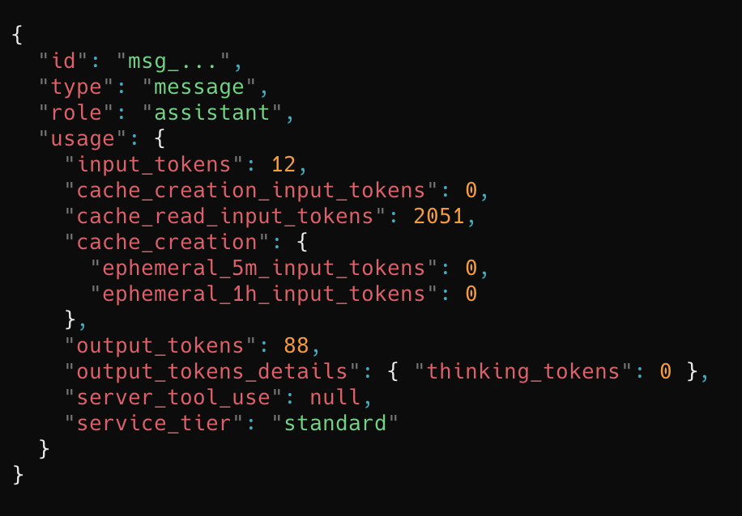
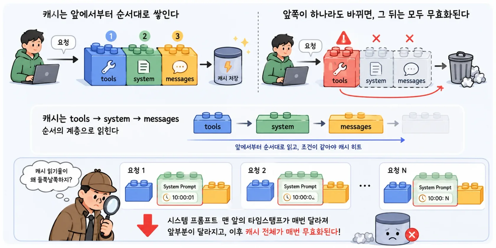
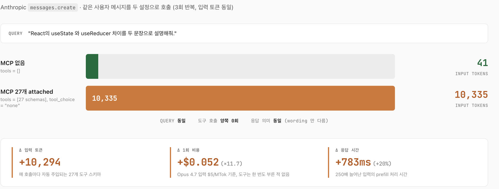
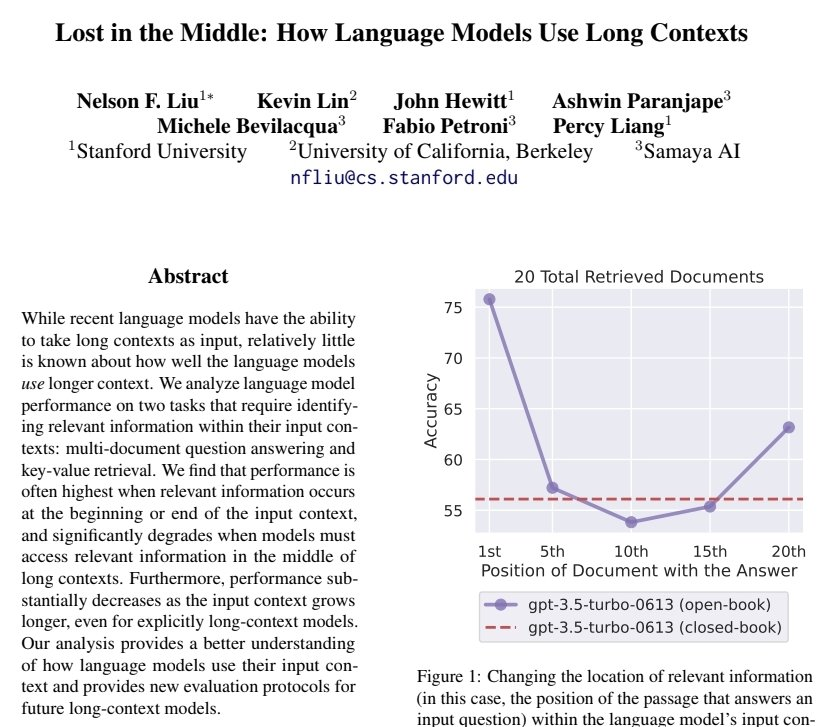
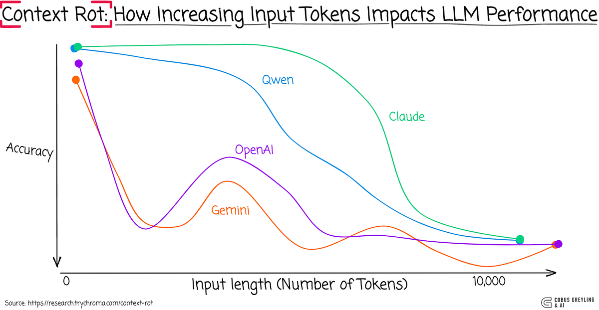
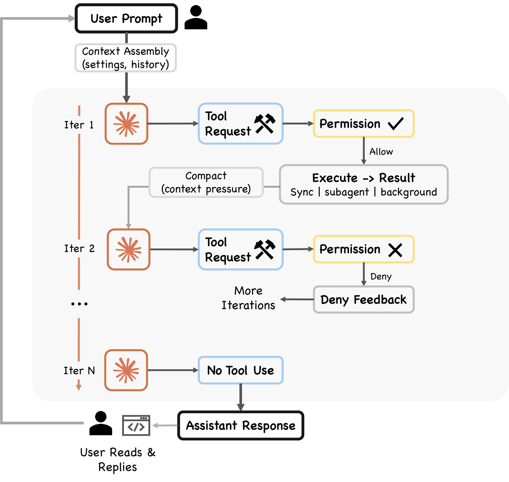
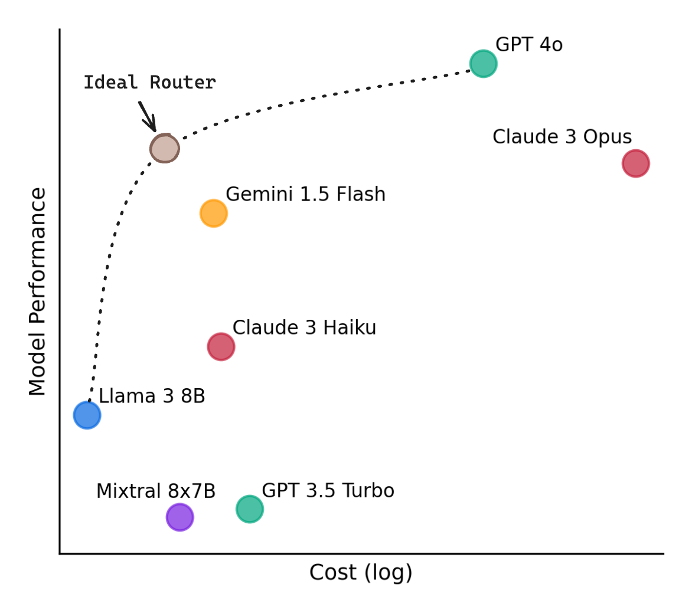
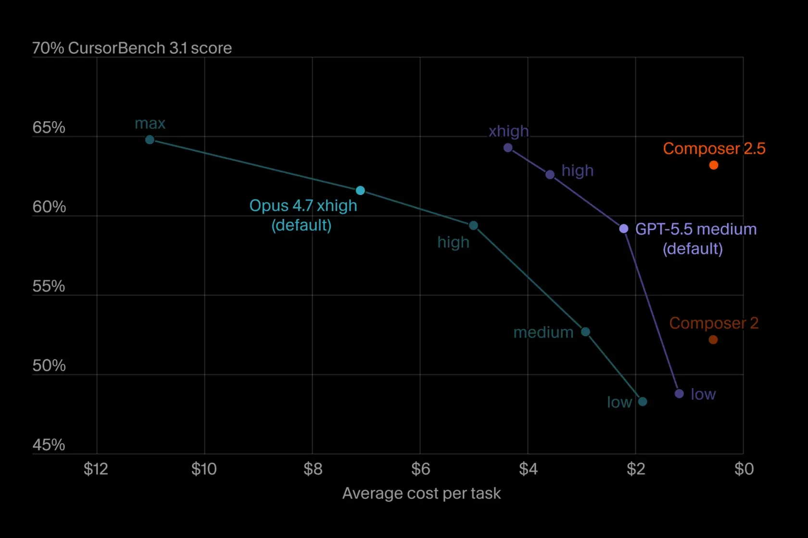
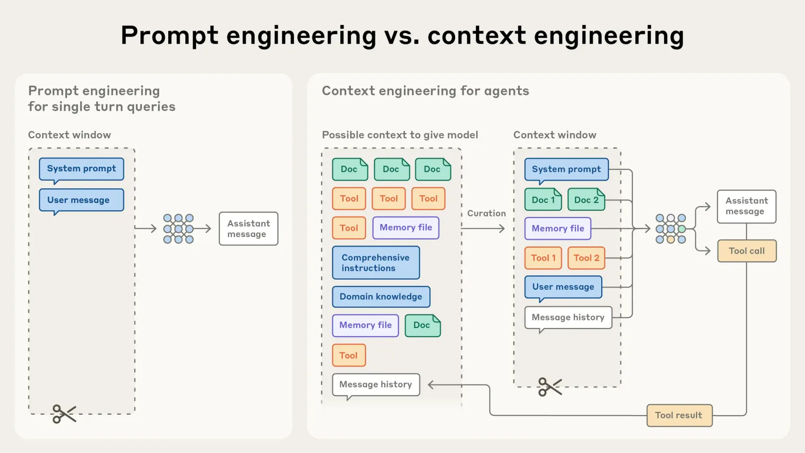

Neste artigo, quero falar sobre como economizar tokens de IA.

No começo, eu me concentrava mais nos resultados e no processo do que em desempenho e custo. Como as respostas da IA tinham muitas falhas, era preciso verificá-las; e, como queríamos resultados rápidos, muita gente, inclusive eu, comprava mais tokens ou migrava para um plano superior quando eles acabavam. Eu também fiz isso. (Nos primeiros meses, nem sequer prestei atenção em quanto gastava com tokens.)

Com o tempo, porém, fiquei cada vez mais atento ao uso de tokens. Para as pessoas, a mensalidade pesava; para as empresas, aumentavam as preocupações com custos de pessoal e operação. Como organizei em [O panorama das ferramentas de agentes de IA](/260529), meus outros textos se concentraram menos no que é a IA ou como ela funciona e mais em como usá-la bem, que ajuda ela oferece, quais ferramentas existem, o que está em alta e por que essas tendências surgiram. Ainda considero isso importante, mas acredito que o custo acabará sendo a maior dúvida.

Expliquei os princípios dos tokens — o que são, como o BPE os cria e o que ocorre dentro do transformador quando prompt caching reduz o preço — em [Como os tokens funcionam](/260610). Com essa base, veremos primeiro como os custos são cobrados e onde surgem ineficiências, depois reuniremos padrões comprovados de economia e, por fim, faremos um pequeno POC que mede o uso de tokens ao executar a mesma tarefa com várias estratégias.

---

## De onde vêm os custos dos tokens?

Vamos examinar de forma breve e objetiva como esses custos surgem e como são cobrados.

Todo texto enviado — prompt de sistema, definições de ferramentas, histórico e mensagens do usuário — vira tokens de entrada; a resposta do modelo vira tokens de saída. Para o modelo, cada chamada é uma entrada inédita. Não importa se a conversa aconteceu ontem ou há um minuto: uma nova chamada envia novamente todo o conteúdo como entrada. (Esse fato simples é o núcleo do custo: o modelo não tem memória e nós contamos tudo outra vez.)

Há mais uma variável. Reenviar do zero a parte estática de chamadas repetidas é caro, então os principais provedores de LLM criaram prompt caching. A entrada estática é armazenada uma vez e, nas chamadas seguintes, os tokens lidos da cache custam muito menos. (Em Como os tokens funcionam, tratei do mecanismo: como o BPE cria tokens e como a cache reutiliza a KV cache do transformador. Aqui, o foco é como isso vira custo.)

### Tokens de entrada, tokens de saída e tokens de cache

Vejamos quatro campos do objeto `usage` devolvido pelo SDK da Anthropic.

- `input_tokens` parte da entrada enviada, excluindo leituras da cache
- `output_tokens` resposta gerada pelo modelo
- `cache_creation_input_tokens` tokens armazenados pela primeira vez nesta chamada
- `cache_read_input_tokens` tokens relidos de uma cache existente

Cada campo recebe uma tarifa diferente. Tokens de saída são os mais caros; os lidos da cache, os mais baratos. Segundo a documentação da Anthropic, a leitura custa 0,1 vez a tarifa base de entrada, exatamente 10%. A escrita custa 1,25 vez com TTL (Time To Live, período de validade da cache) de cinco minutos e 2 vezes com TTL de uma hora. Paga-se um pouco mais na primeira chamada e economiza-se 90% a partir da segunda.

A cache também tem restrições pouco conhecidas. O mínimo varia por modelo e até por versão da mesma família. Sonnet 4.6 e Opus 4.8 exigem 1.024 tokens, Opus 4.7 exige 2.048, e Haiku 4.5 e os antigos Opus 4.5/4.6 exigem 4.096. Um prompt menor não é armazenado mesmo com `cache_control`, sem aviso. Uma solicitação aceita até quatro pontos de interrupção `cache_control`, e a cache é lida na ordem hierárquica `tools` → `system` → `messages`. Assim, mudar uma definição de ferramenta no início invalida toda a cache posterior.

O desconto de 90% vem da reutilização da KV cache do transformador entre chamadas, mecanismo detalhado em Como os tokens funcionam. Para custos, lembre apenas isto: só há cache hit quando o prefixo é idêntico. Portanto, coloque **o conteúdo estático primeiro e o conteúdo dinâmico, que muda a cada chamada, por último**. Até um caractere de timestamp no início invalida toda a cache seguinte.

Surge uma pergunta: “Mas a entrada muda a cada turno; a cache não deveria quebrar quase sempre?” Não. A conversa não é reescrita como um bloco novo: ela usa uma **estrutura append que preserva o conteúdo acumulado na frente e acrescenta apenas a nova fala no fim**. Prompt de sistema, ferramentas, perguntas e respostas anteriores permanecem intactos; só a nova pergunta é anexada. Comparando as entradas desde o início, a primeira diferença estará no final. A entrada completa muda, mas o prefixo sobrevive. (A cache só quebra em todos os turnos num projeto ruim que insere valores dinâmicos na frente. Claude Code e opencode mantêm o início fixo e anexam ao fim; o usuário não precisa configurar nada. Erros de digitação também não afetam a cache, pois ficam no fim, fora do prefixo já armazenado.)

### Comparação entre provedores de IA

Ao reunir as tabelas oficiais de Anthropic, OpenAI e Google de junho de 2026, o padrão fica claro. (Valores em USD por milhão de tokens, com foco em modelos comuns na programação.)

| Provedor | Modelo | entrada | entrada em cache | saída |
| --- | --- | --- | --- | --- |
| Anthropic | Claude Opus 4.8 | $5.00 | $0.50 | $25.00 |
| Anthropic | Claude Sonnet 4.6 | $3.00 | $0.30 | $15.00 |
| Anthropic | Claude Haiku 4.5 | $1.00 | $0.10 | $5.00 |
| OpenAI | GPT-5.5 | $5.00 | $0.50 | $30.00 |
| OpenAI | GPT-5.5 Pro | $30.00 | $3.00 | $180.00 |
| Google | Gemini 3.1 Pro | $2.00 | $0.20 | $12.00 |
| Google | Gemini 3.5 Flash | $1.50 | $0.15 | $9.00 |

Nos três provedores, a saída custa cinco a seis vezes mais que a entrada. Respostas longas elevam rapidamente o custo, mesmo dizendo a mesma coisa. Na mesma faixa, os preços dos modelos variam de três a seis vezes. A conta revela três princípios: **pedir saídas curtas, usar um modelo mais barato quando ele entregar a mesma resposta e armazenar entradas estáticas em cache**. (Se um contexto estático de 10 mil tokens for reutilizado 100 vezes, custa $5 na tarifa base do GPT-5.5 e $0.50 como leitura de cache. A economia é $4.5 e, como quase não há acréscimo de escrita inicial, o retorno começa na segunda chamada.)

### Diferenças entre mecanismos de cache

Mesmo com descontos parecidos, o projeto interno varia por provedor. Entender isso facilita definir políticas.

| Item | Anthropic | OpenAI | Google Gemini |
| --- | --- | --- | --- |
| Acionamento | Pontos `cache_control` explícitos | Automático (sem mudar código) | Automático (implicit) e explícito (explicit) |
| Tamanho mínimo | 1.024–4.096 tokens (por modelo) | 1.024+ (incrementos de 128) | 2.048–4.096 (por modelo) |
| Custo de escrita | 1.25x (5 min) / 2x (1h) da entrada | Grátis | Grátis (mais armazenamento por hora) |
| Custo de leitura | 0.1x da entrada | Cerca de 0.1x da entrada | 0.1x da entrada |
| TTL | [5 minutos ou 1 hora (escolha do usuário)](https://github.com/anthropics/claude-code/issues/46829) | 5–10 minutos de inatividade por padrão, até 1 hora (24 horas na extensão) | Definido pelo usuário (armazenamento por hora) |
| Custo adicional | Nenhum | Nenhum | Armazenamento: Flash $1/M-hora, Pro $4.50/M-hora |

A filosofia aparece claramente. **Anthropic** exige marcação explícita, cobra um pequeno prêmio inicial (1,25 vez) e depois dá grande desconto. O controle do prefixo torna previsível a taxa de leitura. **OpenAI** automatiza tudo: entradas com 1.024 tokens ou mais são armazenadas sem custo, mas há menos controle. **Google** oferece os dois métodos e cobra armazenamento quando a cache é gerida explicitamente. Cache implícita serve para reutilização breve e frequente; explícita com armazenamento, para grandes contextos mantidos por uma hora ou mais.

### Definições de ferramentas e tokenizadores

Duas outras variáveis têm impacto surpreendente.

A primeira são as definições de ferramentas. Com vários servidores MCP, cada chamada inclui nomes e esquemas de parâmetros — mediremos depois quanto isso aumenta o custo —. Mesmo com ferramentas idênticas, trocar apenas o modelo altera o gasto. A documentação da Anthropic mostra que o prompt de ferramentas varia: com `tool_choice: auto`, Sonnet 4.6 e Haiku 4.5 usam cerca de 497 tokens, Opus 4.7 usa 675 e Opus 4.8 cai para 290. Antes do model routing, vale verificar quanto o modelo expande essas definições.

A segunda é a eficiência do tokenizador, que divide texto em unidades processáveis. O mesmo texto pode gerar contagens diferentes. o200k_base da OpenAI usa bem menos tokens que cl100k_base em idiomas não ingleses; a Anthropic afirma que, com o novo tokenizador desde Opus 4.7, o mesmo texto pode ser cobrado como até 35% mais tokens do que nos modelos anteriores. Escolher apenas pela tarifa deixa o custo vazar pela ineficiência. A comparação correta é tarifa × quantidade esperada.

A diferença é marcante em coreano. Com dois tokenizadores da OpenAI, frases técnicas em inglês tiveram a mesma contagem, mas cl100k_base usou 31–43% mais tokens em coreano que o200k_base. Um parágrafo de 167 caracteres virou 169 tokens no antigo: **mais tokens que caracteres**. Em média, cada caractere consumiu mais de um token.

O antigo fragmenta o coreano no nível de bytes; o novo agrupa trechos frequentes como “개발” e “입니다” em um token. Mesmo com tarifa igual, uma carga em coreano pode custar mais de 1,5 vez só pela eficiência do tokenizador.

Surge então a pergunta: “Onde exatamente estamos criando toda essa ineficiência?”

## Padrões comuns de desperdício de tokens

O desperdício é comum mesmo quando acreditamos usar bem a IA. Estes são os padrões que observei no meu trabalho e entre outros desenvolvedores.

### Servidores MCP e ferramentas demais

Vale repetir: depois de conectar Linear, GitHub, Notion, Figma, Slack ou Sentry, raramente removemos algo. Esquemas ociosos inflam a entrada em toda chamada. Para lidar com isso, Claude Code ativa MCP Tool Search: no início entram apenas nomes e descrições; o esquema completo só é carregado quando a ferramenta é chamada.

Medi a diferença com 27 ferramentas MCP de uma sessão — 10 do Serena, oito de quatro integrações OAuth do claude.ai, duas do Figma e sete do agentmemory — e enviei **a mesma mensagem em duas configurações**. Uma não tinha MCP; a outra tinha as 27 conectadas, mas indisponíveis ao modelo. Ambas fizeram zero chamadas de ferramentas.

Com mesma pergunta, modelo e sentido da resposta, a entrada foi de **41 → 10,335 (+10,294)** tokens no Opus 4.7. O custo subiu de **$0.0048 → $0.0563, cerca de 12 vezes**; o aumento de 250 vezes na entrada adicionou **+783ms** de latência de prefill. O mais marcante é ser **um custo pago em todas as chamadas mesmo sem usar MCP naquele turno**. Tool Search evita isso. (Desde a medição, removo continuamente servidores que não uso.)

### Acúmulo de contexto e Lost in the Middle

Levar uma conversa longa adiante aumenta a entrada e reduz a precisão. O estudo “Lost in the Middle”, da equipe de Liu em Stanford, quantificou uma curva em U: informações no começo ou fim são recuperadas melhor; no meio, pior. Gastamos mais para receber resposta inferior. Como o self-attention cresce com o quadrado dos tokens, a atenção por token se dilui com o contexto. O meio enfraquece primeiro porque os dados de treinamento tendem a concentrar informação importante nas extremidades.

Mais a fundo, a forma como o modelo trata a “posição” traz duas tendências que enterram o meio. A intuição é simples.

Primeiro, o modelo **escuta mais os tokens próximos**. RoPE (Rotary Position Embedding), usado pela maioria dos modelos abertos, enfraquece a conexão conforme a distância aumenta, um decay effect. Tokens distantes recebem menos atenção.

Segundo, o modelo **envia atenção demais ao primeiro token**. O softmax obriga a distribuir 100% da atenção; quando não há foco específico, o excedente costuma ir ao primeiro token. Isso é attention sink. (A equipe de Xiao no MIT quantificou o fenômeno no StreamingLLM. Não indica informação importante, mas um ralo para atenção excedente.)

As duas tendências concentram atenção nas pontas — tokens recentes e primeiro token — e enfraquecem o meio. Não é bug de um modelo. LLaMA, Mistral e Qwen usam RoPE; Claude e GPT provavelmente usam mecanismos semelhantes. Lost in the middle é um viés da arquitetura moderna.

Hoje, o fenômeno também é chamado de **context rot**. Uma [análise da Chroma](https://research.trychroma.com/context-rot) submeteu 18 modelos — incluindo GPT-4.1, Claude 4, Gemini 2.5 e Qwen3 — à mesma tarefa NIAH (needle in a haystack). Quando a entrada passou de 10k para mais de 100k tokens, a precisão caiu 20–50%, conforme o modelo. Todos pioraram; Claude caiu mais lentamente. A Anthropic descreve isso como um “orçamento de atenção” derivado do n², consumido entre tokens. Contexto leve reduz custos e preserva precisão.

### Chamar subagent sem critério

Delegar tudo porque subagent é útil também é uma armadilha. Ele começa num contexto separado e paga novamente o prompt de sistema e as ferramentas. Delegar um shell curto ou uma consulta simples de git pode custar mais no arranque do que economiza no contexto principal. Segundo a Anthropic, um agente usa cerca de quatro vezes os tokens de um chat; um sistema multiagente, quinze vezes. A delegação só vale se a precisão justificar isso.

O mesmo vale para MCP. Cada ferramenta ativa adiciona seu esquema ao prompt em todo turno e custa mesmo sem uso. “Ativar tudo por garantia” parece seguro, mas os dados discordam.

Testei precisão e custo com perguntas sobre o reconciler do facebook/react v19 em três cenários:

- Sem ferramentas
- Uma ferramenta (CodeGraph, Serena, ripgrep ou grep puro)
- As quatro ferramentas conectadas juntas

Três resultados se destacaram. (Recall indica quão completas foram as respostas corretas.)

- **Sem ferramentas** obteve recall médio de 0,31, confirmando o valor das ferramentas.
- **Somente Serena (LSP)** atingiu 1,00 por $0.38, a opção individual mais eficiente.
- **As quatro ferramentas** reduziram o recall a 0,89 e elevaram o custo a $0.47. Em perguntas multi-hop, o resultado igualou CodeGraph sozinho (0.78 / 0.88): o modelo preferiu uma ferramenta e herdou suas fraquezas.

O princípio é igual para subagent e ferramentas: o custo extra só importa se elevar a precisão. **Escolher a ferramenta adequada ao domínio é mais barato e preciso que ativar tudo por garantia.**

Então, quais métodos realmente economizam tokens?

## Formas comprovadas de economizar tokens

Cada padrão ataca um eixo: reduzir a entrada, baixar o preço da mesma entrada ou entregar o trabalho a um modelo mais barato. Vejamos cada um.

### Prompt caching

É o efeito mais imediato. Leituras custam 0,1 vez a entrada. Após o prêmio de escrita de 1,25 vez na primeira chamada, a seção estática pode ser reutilizada desde a segunda por um décimo do preço.

O ponto essencial é que **as partes quase idênticas entre chamadas** — ferramentas, trechos de código e contexto RAG — são exatamente as armazenáveis. O benefício continua se não forem misturadas com conteúdo dinâmico, como a pergunta atual ou um novo resultado. Ao chamar a API, agrupar blocos estáticos na frente e dinâmicos atrás entrega quase toda a economia. Claude Code e opencode fazem isso automaticamente.

### Agrupar trabalho assíncrono com Batch API

Se a chamada não precisa terminar imediatamente, Batch API é a forma mais simples de reduzir a tarifa. Anthropic, OpenAI e Google dão 50% de desconto em entrada e saída em troca de entregar em até 24 horas. Na Anthropic, a maioria termina em uma hora, mas o SLA é 24 horas. A chamada não muda e o preço cai pela metade.

Esse desconto se multiplica com outros. A Anthropic afirma que cache e lote se acumulam: tarifa padrão × 0.5 (lote) × 0.1 (leitura) = 0.05, ou 5% na parte estática. Os descontos se multiplicam, não se somam.

Calculei 100 tarefas com 10 mil tokens estáticos, 500 dinâmicos e mil de saída, usando tarifas do Opus 4.8 e quatro estratégias.

Cache reduz 57%, lote 50%, e ambos até 79%. A multiplicação ocorre na entrada estática. (Saída não entra na cache e recebe apenas o desconto de lote; quanto maior sua parcela, menor a redução total. Quanto maior a parte estática, maior o efeito.) Indexação noturna, avaliação antes da publicação, extração de dados e relatórios não exigem alguém diante da tela.

Nem tudo pode esperar. Batch não serve à sessão principal de um agente ou chat interativo, onde a latência tem valor. Dividir entre “preciso agora” e “preciso até o próximo expediente” pode cortar a conta pela metade.

### Isolar trabalho verbose com um subagent

[Nas palavras da documentação do Claude Code,](https://www.anthropic.com/engineering/multi-agent-research-system) um subagent “opera em sua própria janela isolada; chamadas e resultados intermediários permanecem nele e só a mensagem final volta ao pai”. Delegar uma tarefa verbose deixa só um resumo limpo no contexto principal. Segundo o texto da Anthropic sobre [context engineering](https://www.anthropic.com/engineering/effective-context-engineering-for-ai-agents), mesmo gastando dezenas de milhares de tokens, ele costuma devolver apenas 1.000–2.000 tokens ao pai.

> Uma tarefa verbose produz muitos tokens para obter uma resposta de uma linha. Executar testes, pesquisar documentação e analisar logs são exemplos.

Mas subagent não reduz automaticamente o custo total. Agentes usam cerca de quatro vezes mais tokens que chats; sistemas multiagente, quinze vezes. O subagent protege a precisão e o contexto principal ao retirar saídas verbose; não é mágica. Delegue apenas se a economia de limpeza superar o arranque. Tarefas curtas saem mais baratas no pai.

O domínio também importa. No teste interno da Anthropic, um líder Opus 4 com subagent Sonnet 4 melhorou 90,2% sobre um Opus 4 sozinho. Porém, domínios onde agentes compartilham contexto ou têm muitas dependências são inadequados — e programação é exatamente assim. Pesquisa explora rumos independentes; código vive num grafo de dependências. (Em programação, um agente com um subagent isolado de exploração pode ser um padrão mais seguro.)

### compact e progressive disclosure

O comando `/compact` resume toda a conversa e reinicia com contexto novo. A compressão é semântica: preserva trabalho atual e mudanças recentes e remove saídas repetitivas. `/clear` apaga tudo; `/compact` deixa um resumo. Perto de 95% da janela, auto-compact faz o mesmo. Organizar sessões longas interrompe o acúmulo.

Por dentro, `/compact` é a última etapa de uma pipeline automática. Segundo [“Dive into Claude Code”,](https://github.com/VILA-Lab/Dive-into-Claude-Code) `query.ts` verifica cinco etapas antes de cada chamada.

- **Budget Reduction** corta partes de saídas que excedem o limite.
- **Snip** remove o histórico antigo no eixo temporal.
- **Microcompact** comprime finamente preservando a consciência da cache.
- **Context Collapse** reprojeta históricos enormes em read-time para reduzir dimensões.
- **Auto-Compact** aciona compressão semântica aos 95% como último recurso.

As primeiras são leves e baratas; as últimas, pesadas e eficazes. Uma estratégia não resolve toda pressão. Chamar `/compact` antecipa a etapa final.

A mesma ideia aparece em Skills. `/compact` reduz o acumulado; as três fases de `/skills` evitam acumulá-lo.

Segundo a Anthropic, uma skill carrega em três fases. Nome e descrição — cerca de 100 tokens — entram no início. O corpo (`SKILL.md`, menos de 5 mil tokens) só entra quando acionado. Scripts e recursos executados via bash retornam apenas a saída; o código não entra. Dezenas de skills quase não aumentam o contexto inicial.

### Model routing: a mesma resposta com um modelo mais barato

A entrada do Opus 4.8 custa cinco vezes a do Haiku 4.5. Usar o maior modelo para busca, exploração ou resumo simples é desperdício. Encaminhar por dificuldade — Haiku → Sonnet → Opus — e reservar Opus ao raciocínio pesado virou padrão. [RouteLLM, da LMSYS,](https://lmsys.org/blog/2024-07-01-routellm/) preservou 95% da qualidade do GPT-4 reduzindo chamadas fortes a 14%, embora o benchmark fosse de raciocínio geral.

O ecossistema se firmou: OpenRouter, Martian e NotDiamond; no código aberto, RouteLLM, LiteLLM e Bifrost. Na Anthropic, a seleção do Agent SDK, o campo `model` do subagent — Explore usa Haiku — e `/model` apoiam routing. Mas as APIs não escolhem sozinhas pela dificuldade: executam o modelo indicado. Routing automático existe em produtos como Cursor Auto, ChatGPT auto e `openrouter/auto`. Para economizar, é preciso construir uma camada.

Adicionar qualquer router não é a resposta. Auto Router, que troca o modelo por chamada, conflita com prompt caching. A cache efêmera exige mesmo modelo e prefixo; mudar a chave causa miss. Perde-se o desconto de 90% e a economia de routing volta em misses. Por isso OpenRouter recomenda stickiness com `session_id`.

Na prática, não classifique toda chamada; divida estaticamente por tarefa. O campo `model` segue isso: Explore sempre usa a faixa Haiku; revisão, Opus. Cada faixa repete modelo, prompt e ferramentas e acumula sua própria cache. “Routing virou padrão” significa ramificação estática “coordenador + executor”, não classificador por chamada. Assim routing e cache coexistem.

### Cursor Composer 2.5

Outra opção é usar um agente como Cursor. [Composer 2.5, lançado em 18 de maio de 2026,](https://cursor.com/blog/composer-2-5) usa o checkpoint aberto Kimi K2.5 da Moonshot AI e foi ajustado para código. A Cursor afirma desempenho comparável ao Claude Opus 4.7 por cerca de um décimo do preço. A tarifa é $0.50 de entrada e $2.50 de saída, uma ordem abaixo dos $5.00 e $25.00 do Opus 4.8.

Como o benchmark é da própria Cursor, não convém tomar o número absoluto como definitivo. A tendência importa: um modelo menor especializado em código pode se aproximar de um modelo geral de fronteira e reduzir custos em uma ordem de grandeza. É uma tendência clara de 2026.

O mais interessante é que ele também **reduz a própria quantidade de tokens de entrada quando projetado junto ao IDE**. Composer e Cascade consomem eficientemente arquivo atual, vizinhos e símbolos indexados, reduzindo pedidos extras e operações de grep e leitura. A tarifa cai dez vezes e a contagem também diminui, então a economia real pode ser maior.

### Levar o contexto para fora do contexto

Uma tendência de 2026 é carregar “apenas o necessário, quando necessário”. A Anthropic chama isso de **contexto just in time (JIT)**. Em vez de incluir tudo, o agente mantém referências leves e busca o material por ferramentas quando precisa. Claude Code lê sob demanda com glob e grep em vez de carregar toda a base.

memory tool e context editing, lançados com Sonnet 4.5, seguem a mesma filosofia. A “memória” de memory tool não é o histórico da sessão nem um `CLAUDE.md` escrito por alguém e carregado no início. memory tool é **uma ferramenta com que o modelo escreve e lê arquivos diretamente**.

A interface permite criar, ler, atualizar e excluir arquivos num diretório da infraestrutura do usuário. O modelo trata notas como sistema de arquivos. Isso cria memória persistente fora da janela entre sessões, enquanto o usuário controla armazenamento e retenção. A memória de sessão é volátil dentro; esta permanece fora. context editing faz o inverso: perto do limite, remove resultados antigos de ferramentas sem interromper a conversa, permitindo que o agente rode mais.

Na avaliação da Anthropic, as duas ferramentas melhoraram o desempenho em 39%; context editing sozinho, 29%. Numa busca web de 100 turnos, o consumo caiu 84%. (São benchmarks do fornecedor, mas a direção é clara: esvaziar o contexto importa mais.) Isso segue a mesma lógica da pipeline de cinco etapas de `/compact`. A diferença é que `/compact` reduz o interior do contexto, enquanto memory tool cria armazenamento exterior; os dois são complementares.

## Conclusão

No fim, a economia se resume a três eixos: **enviar menos para o mesmo trabalho, pagar menos pela mesma entrada e entregar a mesma resposta a um modelo mais barato**. Prompt caching, Batch API, isolamento com subagent, `/compact`, memory tool, context editing, model routing e modelos especializados apenas atacam eixos diferentes. Em 2026, o foco migra de preencher o contexto para esvaziá-lo e selecioná-lo — context engineering. Como mostra context rot, contexto leve melhora custo e precisão.

Não há resposta única. Cada equipe trabalha de um jeito, e uma mesma pessoa tem custos diferentes ao escrever texto ou código. Mas, num ecossistema rápido, supor que “o padrão de ontem ainda funciona hoje” é arriscado. Acompanhar modelos, ferramentas e preços e validá-los num pequeno POC do próprio fluxo talvez seja a economia mais duradoura. Recomendo revisar a própria contabilidade de tokens. (Para entender a raiz, leia também BPE e KV cache em Como os tokens funcionam.)

Resta uma pergunta: depois de esvaziar e selecionar contexto, o que vem? O foco avança ao sistema de agentes inteiro: como operá-lo (projeto do harness), medir se funcionou (eval) e confiná-lo quando falha (containment). Quando a postura “meça com um POC” deste artigo escala ao sistema, ela vira exatamente eval. Tratarei disso em [Além do contexto](/260622).

:::ref
- [docs] [Anthropic Prompt Caching](https://platform.claude.com/docs/en/build-with-claude/prompt-caching)
- [docs] [Anthropic Batch Processing](https://platform.claude.com/docs/en/build-with-claude/batch-processing)
- [docs] [Anthropic Claude API Pricing](https://platform.claude.com/docs/en/about-claude/pricing)
- [docs] [Anthropic Claude Code Subagents](https://code.claude.com/docs/en/sub-agents)
- [docs] [Anthropic Claude Code MCP Tool Search](https://docs.claude.com/en/docs/claude-code/mcp)
- [docs] [Anthropic Agent Skills](https://docs.claude.com/en/docs/agents-and-tools/agent-skills/overview)
- [docs] [OpenAI Prompt Caching](https://developers.openai.com/api/docs/guides/prompt-caching)
- [docs] [OpenAI API Pricing](https://openai.com/api/pricing/)
- [docs] [Google Gemini Context Caching](https://ai.google.dev/gemini-api/docs/caching)
- [docs] [Google Gemini API Pricing](https://ai.google.dev/pricing)
- [article] [Anthropic, Managing context on the Claude Developer Platform](https://www.anthropic.com/news/context-management)
- [paper] [LLMRouterBench (Findings of ACL 2026)](https://arxiv.org/abs/2601.07206)
- [paper] [VILA-Lab, Dive into Claude Code](https://arxiv.org/abs/2604.14228)
:::
