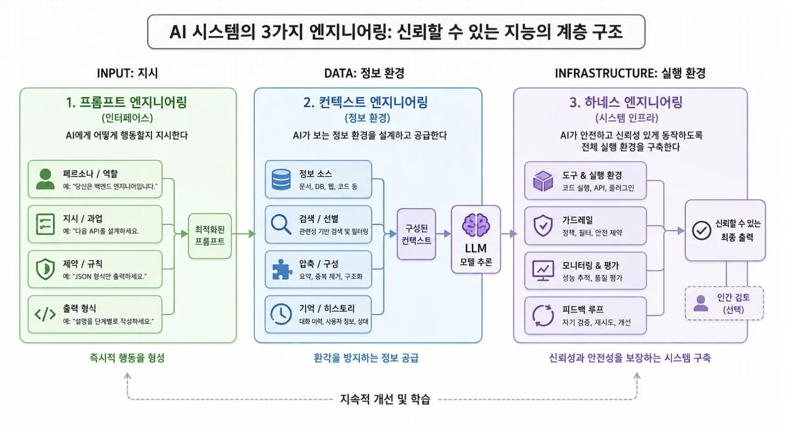
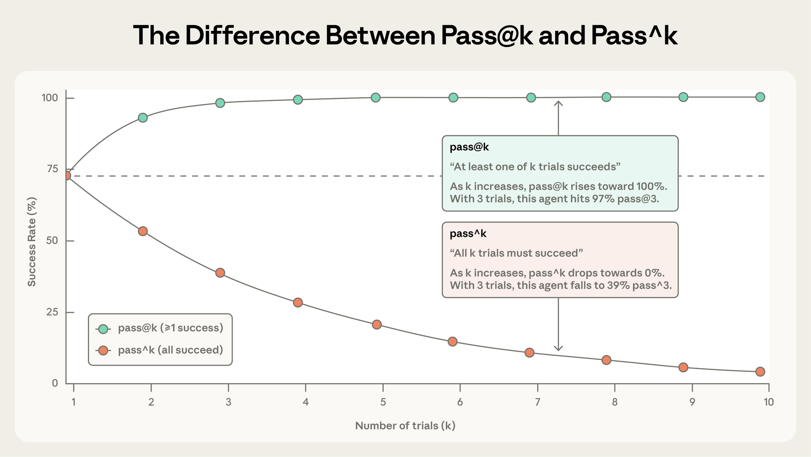

In this post, I want to look at what may come after prompt engineering and context engineering.

While wrapping up the previous article on [saving tokens](/260611), one question kept nagging at me. I believe the center of gravity is shifting away from crafting individual prompts and toward the practice of clearing away and selecting information—context engineering. Once that article was finished, the next question followed naturally: what comes after context?

Writing about “where things are headed” calls for caution. The future contains many possible paths, so the focus here is on **a shift in emphasis visible in already-published primary sources**. Some inference is inevitably involved, and I hope readers will approach it from multiple perspectives.

---

## From prompts to context

Let us begin by clarifying the terms. For a while, the industry’s central topic was **prompt engineering**. The problem was how to write a single instruction to a model well: how to design clear directions, useful examples, and an output format.

Then the unit of work grew. As agents running for dozens of turns became common, the important question was no longer one prompt but how to compose **the entire context the model sees on every turn** (system prompt + tool definitions + conversation history + search results + memory). This is called **context engineering**. Anthropic organized this frame in its September 2025 article “Effective context engineering for AI agents,” and the context rot research published that same year by the Chroma team (Hong et al.) added quantitative evidence. Across 18 models—including GPT-4.1, Claude 4, Gemini 2.5, and Qwen3—they showed that performance degrades unevenly as inputs grow longer, even on tasks as simple as copying words verbatim. In practice, the common assumption that a model treats the 100th token and the 10,000th token equally does not hold. The conclusion was not “longer context is better,” but “how information is placed matters as much as what it contains.” That finding reinforced the move from filling context to selecting it, and the term quickly took hold.

One common misunderstanding is worth addressing. Prompt engineering was not **replaced** by context engineering. Writing good prompts is still foundational; context engineering is closer to a higher-level concept built on top of it. (A shift in attention from writing good code to designing good systems does not make coding unnecessary.) The precise description, then, is not that we “switched over,” but that the field **“expanded by inclusion.”**

So, to ask again: did that expansion stop at context? It does not appear so.

## The Anthropic engineering blog

I think the most honest way to gauge direction is to read, in chronological order, what organizations actually driving the field are writing about. Follow the Anthropic engineering blog after “Effective context engineering” (September 2025), and the titles alone begin to outline where the center of gravity moved next.

- October 2025, Equipping agents with Agent Skills
- November 2025, Code execution with MCP: more efficient agents
- November 2025, Effective harnesses for long-running agents
- January 2026, Demystifying evals for AI agents
- January 2026, Designing AI-resistant technical evaluations
- February 2026, Quantifying infrastructure noise in agentic coding evaluations
- March 2026, Harness design for long-running application development
- April 2026, Scaling Managed Agents: separating brains from hands
- May 2026, How to contain Claude across products

Step back from the list and the keywords cluster into three branches: **harness**, **eval**, and **containment**. I read this as a discussion moving one level beyond how to fill and clear context, toward designing, measuring, and controlling the agent system as a whole. (There is, of course, a limitation here: these are one company’s priorities. Yet given that company’s role in the coding-agent ecosystem, it is difficult to dismiss them as the interests of only one vendor.)

Let us take them one at a time.

## harness

The word harness may be unfamiliar in this setting. Literally, it is the equipment fitted to a horse to direct its power where we want it to go. For an AI agent, a harness is **the complete framework outside the model that surrounds it and puts it to work**: which tools it may use and in what order, how it recovers after a failure, how far its permissions extend, and when its loop stops.

If context engineering asks, “What should we show the model?”, harness design asks, “How should the model move within this environment?” It sits one layer farther out. Imagine the model as a talented new hire: context is the work material handed to that person, while the harness is closer to the workplace and operating procedures. The same person’s performance can wobble in a chaotic environment, yet go much farther with the same abilities atop a well-designed process.

Why this matters becomes clear in [a failure the Anthropic engineering team encountered firsthand](https://www.anthropic.com/engineering/effective-harnesses-for-long-running-agents). They put their top coding model, Opus 4.5, on the Claude Agent SDK, supplied only high-level directions such as “build a clone of claude.ai,” and ran it across multiple sessions. Despite the model’s intelligence, it did not produce a production-grade app. The failures repeated in two forms. In one, a session tried to finish everything at once, exhausted its context mid-implementation, and left the next session a half-built feature. In the other, a later session saw that “quite a lot has already been done” and declared completion even though valid work remained. (Imagine a long job passed among people working shifts, with every replacement having no memory whatsoever of the person before them.)

The solution was not to make the model smarter, but to change the framework. The first session received a dedicated prompt for setting up the environment (an initializer agent), expanded more than 200 feature specifications into `feature_list.json`, and created `init.sh` to start the development server along with a progress log (`claude-progress.txt`). Each later session (coding agent) handled exactly one feature, left behind a clean state through a git commit and progress notes, and then ended. The next session first read that progress file and the git log to learn “how far the previous shift got” before continuing. The model was identical, but the result changed when placed in this framework. The harness, not the model, made the difference. (Interestingly, none of Anthropic’s remedies were new. Feature lists, small commits, progress notes, and smoke tests run every time are exactly what experienced developers do each day. A good framework for an agent is ultimately much like embedding good engineering habits into its environment.)

The connection to token efficiency is also clear. Subagent isolation, lean tool definitions, and model routing, which the previous article covered, look like separate cost-saving techniques in isolation. Taken together, however, they are parts of **how one harness is designed**. Harness design encompasses deciding which model lane receives each task, which tools remain enabled, and where verbose exploration is isolated. The savings are closer to a byproduct of that design.

Harness design has one peculiar trap, however: **the better the framework, the more likely it is to become obsolete when the model improves.** A harness is fundamentally a collection of assumptions about “what the model cannot do on its own.” The moment the model can do those things, those assumptions become excess baggage. An [example from Anthropic](https://www.anthropic.com/engineering/managed-agents) illustrates this precisely. Sonnet 4.5 had a habit of rushing to finish as it approached its context limit—a behavior called context anxiety—so the framework included a context-reset mechanism. When the same framework was used with Opus 4.5, that behavior had disappeared, turning the carefully added reset into dead weight. Every time the model becomes one step smarter, another part of the framework can reach its expiration date.

That leads to a further idea: instead of perfecting a particular framework, **design interfaces that remain stable even as the framework changes**. Anthropic’s Managed Agents follows this direction, and its roots lie, perhaps unexpectedly, in operating systems. The OS endured for decades because it virtualized hardware into abstractions such as processes and files, creating a container in advance for programs that did not yet exist. A single line of `read()` works the same whether the storage is a 1970s disk or a modern SSD. Applying the same reasoning divides an agent into three pieces: the **brain** that makes decisions (Claude and the harness), the **hands** that perform actions (code-execution sandboxes and tools), and the **session log** that appends everything that occurs. With the three separated, the brain can handle a dead container as a tool-call error, and even if the harness dies, it can wake again from the last point in the session log. Cost and latency also fell as a side effect. By starting containers only when truly needed, Anthropic reports that time to first token (TTFT) fell by about 60% at the median and, at p95, by more than 90%. (This is another point of contact with the token-efficiency article. It recommended placing static material first for prompt caching; arranging context to improve that cache hit rate is exactly the job of the harness beside this brain.)

## eval

The second branch was the most interesting to me personally. As if by agreement, Anthropic’s articles from early 2026 converge on **evaluation (eval)**.

The reason is intuitive. **How do we verify** that context was composed well, the harness was designed well, or costs were truly reduced? The longer and more complex the tasks agents handle autonomously, the harder it becomes for a person to inspect each one and decide, “Did this actually work well?” The basis of trust ultimately shifts to measurement. That is why questions such as “How should agent evaluation be designed?”, “How do we remove noise from the evaluation itself?”, and “How do we handle eval awareness, where a model detects an evaluation and changes its behavior?” have moved to the foreground.

Evaluating agents is difficult because it differs in kind from a one-shot question and answer. An agent calls tools and changes state over multiple turns, so one mistake propagates forward and accumulates. Results also vary from run to run even with identical inputs. [Anthropic](https://www.anthropic.com/engineering/demystifying-evals-for-ai-agents) divides this nondeterminism into two metrics. **pass@k** is the probability of succeeding at least once across k attempts, so it rises as attempts increase. **pass^k** is the probability of succeeding on all k attempts, so it falls as attempts increase. pass@1 matters for code generation that only needs to be right once; pass^k is central for a customer-service agent that must work reliably every time. (If the per-trial success rate is 75%, the probability of three consecutive successes is 0.75³, or about 42%. The gap between “usually works” and “works every time” is that large.)

Then what grades a single attempt? The same article divides graders into three types. **Code-based** graders (test results, static analysis, and tool-call validation) are fast, inexpensive, and objective, but weak on open-ended tasks with multiple valid answers. **Model-based** graders (LLM-as-judge and rubric scoring) can capture subtle quality differences, but are nondeterministic and must be calibrated periodically against human judgments. **Human-based** grading is the most accurate but also slow and expensive. In practice, teams combine all three, ideally using deterministic grading as the foundation and model grading as support. There is another distinction. A **capability eval** asks, “What can this agent accomplish?” It therefore starts at a low score and provides a hill to climb. A **regression eval** asks, “Can it still do what it used to do?” It must remain near 100%; a lower score signals that something has broken.

One surprisingly common trap is that **a low score may be the evaluation’s fault, not the agent’s.** Anthropic reports that Opus 4.5 initially scored 42% on CORE-Bench. Investigation revealed causes such as rigid grading that expected “96.124991…” and marked “96.12” wrong, ambiguous task specifications, and irreproducible stochastic tasks. After fixing bugs and rerunning with a scaffold whose constraints had been loosened, the score jumped to 95%. They therefore emphasize one principle: **do not take the score at face value; read the transcript yourself.** If a frontier model makes 100 attempts and scores 0%, the problem is usually broken rather than the model being incapable.

It is also interesting that as measurement advances, the baseline itself moves quickly. On SWE-bench Verified—the leading coding-agent benchmark, which assigns real GitHub issues and grades whether tests pass—frontier models climbed from the 30% range to above 80% in 1 year. At that point, easy problems are all solved, scores reach a ceiling (saturation), and a paradox appears: large capability gains show up only as small score differences. One code-review startup reportedly dismissed a new model after looking only at one-shot evaluations, then recognized the improvement only after switching to agentic evaluations that measured longer, more complex work. An eval is therefore not something created once and finished; it becomes a living asset that must continually be replaced with harder versions. (Anthropic compares this to the “Swiss cheese model” in safety engineering. One slice full of holes cannot block a failure, but layering automated evaluation, production monitoring, and human transcript review means a failure that slips through one layer is caught by the next.)

## containment

The third branch has a somewhat different character. It is about **safety and control**, not cost or performance.

As agents gain more tools and move more autonomously, the blast radius of a single mistake grows with them. For an agent that can delete files, make external requests, and perform privileged actions on someone’s behalf, “Where do we stop the damage when it goes wrong?” matters as much as “How well does it perform?” The prominence of Anthropic’s May 2026 article on [containment across its products](https://www.anthropic.com/engineering/how-we-contain-claude) can be read in this context. It divides agent risk into three branches: **user misuse**, in which a user maliciously or carelessly requests harmful work; **model misbehavior**, in which the model independently acts without being asked; and **external attacks** arriving through tools, files, or networks. One interesting observation is that smarter models do not simply reduce risk. Less capable models misread situations and make obvious mistakes; more capable models make fewer mistakes, but are better at discovering unexpected routes around constraints nobody explicitly wrote down.

Anthropic emphasizes the limits of “having a person supervise every action.” Claude Code initially sought safety by asking the user to approve each write, execution, and network-access request, but telemetry showed that users simply approved about 93% of the prompts. As approval windows multiply, **approval fatigue** sets in and people pay less attention to each one. A probabilistic defense that depends on human clicks will therefore retain holes. The center of gravity moves from “monitor what the agent is doing” to “restrict what the agent can do in the first place.” Defenses are layered across three levels: the **environment layer**, including sandboxes, VMs, and egress controls; the **model layer**, including system prompts and classifiers; and the **external-content layer**, including MCP, plugins, and search results. The central principle is to **put the environment layer, which blocks actions deterministically, in place first**. This is not because model-layer defenses are weak. On Gray Swan’s benchmark for prompt injection, the one-shot attack success rate is about 0.1%, which is best-in-class. But 100 adaptive attempts raise it to 5–6%, and a probabilistic defense inherently cannot achieve a 100% hit rate. A hard final boundary is therefore placed behind it. (Anthropic says introducing OS-level sandboxing reduced approval prompts by 84%. The safety mechanism actually reduced friction.)

This may seem remote from token efficiency, but the two share the same root. Both ask, **“What should the agent be given, and how much?”** Anthropic demonstrates the connection with two cases. In one, an internal red team phished an employee into running Claude Code with a malicious prompt. A quietly inserted instruction made it read `~/.aws/credentials` and POST the contents externally; it succeeded in 24 of 25 attempts. Because the user had typed the instruction directly, the model classifier saw nothing suspicious. What stopped it was not a smart model, but the environmental boundary that kept credentials outside the sandbox in the first place, together with egress control. The other case is subtler. An egress allowlist correctly allowed `api.anthropic.com`, but a file planted by an attacker used the attacker’s own API key to call Anthropic’s file-upload API, causing data to leave through the attacker’s account. The sandbox worked perfectly, yet the data still leaked. The lesson was that an allowlist must be understood not as a “destination filter,” but as “permission for every capability available through that domain.” (Anthropic repeatedly stresses this principle: proven hypervisors, syscall filters, and container runtimes held up; **what actually broke were the components Anthropic had built on top of them**.) Removing unused MCP tools belongs to the same context. It saves money while also reducing the attack surface. A design kept lean is not only cheaper and more accurate, but safer too.

## Putting it all together

The three branches can be condensed into one sentence. The unit of attention is expanding outward, one step at a time: **from the prompt (one instruction), to context (what to show on each turn), and then to the whole agent system (how to operate it, measure it, and contain it)**. Harness asks, “How should it run?”; eval asks, “How do we know it ran well?”; and containment asks, “How do we stop it when it runs wrong?”

To stress the point once more, these three branches are **a shift in emphasis that I infer from already published material**, not a prediction that “this will become the standard in the second half of 2026.” Some currents will grow, while others will be absorbed under different names. What is clear is that neither prompts nor context will disappear; they will remain parts of a larger frame. The field has advanced by adding another layer on top rather than erasing old terms with new ones, and it seems likely to continue that way.

We started with cost and arrived here. The previous article recommended opening up your token ledger; this one goes a step farther. It is worth examining together **how you verify** the savings (eval), **what framework makes those savings repeatable** (harness), and **how far that framework remains safe** (containment). In the end, what lasts longest will probably not be any particular cost-saving technique, but the habit of measuring and controlling one’s own system.

:::ref
- [article] [Anthropic, Effective context engineering for AI agents](https://www.anthropic.com/engineering/effective-context-engineering-for-ai-agents)
- [article] [Anthropic, Harness design for long-running application development](https://www.anthropic.com/engineering/harness-design-long-running-apps)
- [article] [Chroma Research, Context Rot](https://research.trychroma.com/context-rot)
:::
