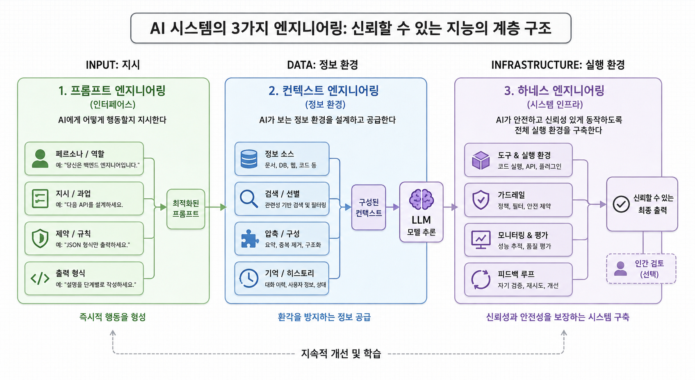
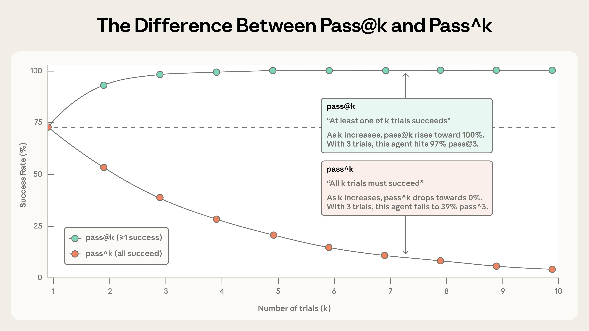

이번 포스팅에서는 프롬프트 엔지니어링과 컨텍스트 엔지니어링, 그 다음에 대한 이야기를 해보려고 한다.

바로 앞 글인 [토큰 절약법](/260611)을 정리하면서 줄곧 머릿속을 떠나지 않던 질문이 하나 있었다. "개별적 프롬프팅에서 비우고 골라내는 기술(context engineering)로 무게중심이 옮겨가고 있다" 고 생각하는데, 글을 닫고 나니 자연스럽게 다음 질문이 따라왔다. 그러면 컨텍스트 다음은 무엇인가?

"앞으로의 방향" 을 말하는 글은 조심스럽다. 미래에 대한 수많은 선택지가 있을텐데 우리는 **이미 공개된 1차 자료에서 읽히는 무게중심의 이동**을 정리하는 데 초점을 둔다. 추측이 다소 섞일지라도 다양한 관점으로 글을 접해보면 좋겠다.

---

## 프롬프트에서 컨텍스트로

용어부터 정리하고 가자. 한동안 업계의 화두는 **프롬프트 엔지니어링**이었다. 모델에게 보내는 한 번의 지시를 어떻게 잘 쓰느냐, 즉 명확한 지시문과 좋은 예시, 출력 형식을 어떻게 설계하느냐의 문제였다.

그러다 일의 단위가 커졌다. 단발성 질문이 아니라 수십 턴을 도는 에이전트가 보편화되면서, 한 번의 프롬프트가 아니라 **모델이 매 턴 보는 컨텍스트 전체**(시스템 프롬프트 + 도구 정의 + 대화 기록 + 검색 결과 + 메모리)를 어떻게 구성하느냐가 더 중요해졌다. 이걸 **컨텍스트 엔지니어링**이라 부른다. Anthropic 이 2025년 9월 "Effective context engineering for AI agents" 글로 이 프레임을 정리했고, Chroma 연구팀(Hong et al.)이 같은 해 발표한 context rot 연구가 정량적 근거를 보탰다. 이들은 GPT-4.1, Claude 4, Gemini 2.5, Qwen3 등 18개 모델을 두고, 단어를 그대로 따라 적는 수준의 단순 과제에서조차 입력이 길어질수록 성능이 비균일하게 무너진다는 사실을 보였다. 모델이 100번째 토큰과 10,000번째 토큰을 똑같이 다룰 거라는 흔한 가정이 실제로는 깨진다는 것이다. "컨텍스트는 길수록 좋다" 가 아니라 "무엇이 들었느냐만큼 어떻게 놓였느냐가 중요하다" 는 이 결론이, 채우기에서 골라내기로의 전환에 힘을 실으면서 용어가 빠르게 자리 잡았다.

여기서 흔한 오해 하나를 짚어야겠다. 프롬프트 엔지니어링이 컨텍스트 엔지니어링으로 **대체된** 것이 아니다. 프롬프트를 잘 쓰는 일은 여전히 기본이고, 컨텍스트 엔지니어링은 그 위에 얹힌 상위 개념에 가깝다. (코드를 잘 짜는 법에서 시스템을 잘 설계하는 법으로 관심이 옮겨갔다고 해서 코딩이 필요 없어지지 않는 것과 같다.) 즉 정확한 서술은 "갈아탔다" 가 아니라 **"포함하면서 넓어졌다"** 이다.

그렇다면 다시, 그 넓어짐은 컨텍스트에서 멈췄을까? 그렇지 않아 보인다.

## Anthropic 엔지니어링 블로그

방향을 점치는 가장 정직한 방법은, 이 분야를 실제로 끌고 가는 곳이 무엇을 쓰고 있는지를 시간순으로 읽는 것이라 생각한다. Anthropic 엔지니어링 블로그의 글 목록을 "Effective context engineering"(2025년 9월) 이후로 따라가 보면, 제목들만으로도 무게중심이 어디로 더 갔는지 윤곽이 잡힌다.

- 2025년 10월, Agent Skills 로 에이전트 무장하기
- 2025년 11월, Code execution with MCP: 더 효율적인 에이전트
- 2025년 11월, Effective harnesses for long-running agents
- 2026년 1월, Demystifying evals for AI agents
- 2026년 1월, AI 에 저항하는(AI-resistant) 기술 평가 설계
- 2026년 2월, 에이전틱 코딩 평가의 인프라 노이즈 정량화
- 2026년 3월, Harness design for long-running application development
- 2026년 4월, Scaling Managed Agents: 두뇌와 손을 분리하기
- 2026년 5월, 제품 전반에서 Claude 를 격리(contain)하는 법

목록을 한 발 물러서서 보면 키워드가 세 갈래로 뭉친다. **harness**, **eval**, 그리고 **containment**다. 컨텍스트를 잘 채우고 비우는 법에서 한 단계 더 올라가, 에이전트라는 시스템 전체를 설계하고, 측정하고, 통제하는 쪽으로 논의가 옮겨가고 있다는 뜻으로 읽힌다. (물론 이건 한 회사의 강조점이라는 한계가 있다. 다만 이 회사가 코딩 에이전트 생태계에서 차지하는 비중을 생각하면, 한 벤더의 관심사로만 치부하기는 어렵다.)

하나씩 풀어보자.

## harness

harness 라는 단어가 조금 낯설 수 있다. 직역하면 마구(馬具), 즉 말에 씌워 힘을 원하는 방향으로 끌어내는 장치다. AI 에이전트에서 harness 는 **모델 바깥에서 모델을 둘러싸 일을 시키는 골격 전체**를 가리킨다. 어떤 도구를 어떤 순서로 쓸 수 있게 할지, 한 번 실패하면 어떻게 복구할지, 권한은 어디까지 줄지, 루프는 언제 멈출지 같은 것들이다.

컨텍스트 엔지니어링이 "모델에게 무엇을 보여줄까" 의 문제였다면, harness 설계는 "모델이 그 안에서 어떻게 움직이게 할까" 의 문제다. 한 칸 더 바깥이다. 모델을 똑똑한 신입에 비유하면, 컨텍스트가 그 신입에게 건네는 업무 자료라면 harness 는 그 신입이 일하는 작업 환경과 절차서에 가깝다. 같은 사람이라도 환경이 어수선하면 성과가 흔들리고, 잘 짜인 절차 위에서는 같은 능력으로 더 멀리 간다.

이게 왜 중요한지는 [Anthropic 엔지니어링 팀이 직접 부딪힌 실패](https://www.anthropic.com/engineering/effective-harnesses-for-long-running-agents)에서 또렷하게 드러난다. 이들은 최상위 코딩 모델인 Opus 4.5 를 Claude Agent SDK 위에 올려 "claude.ai 클론을 만들어줘" 같은 고수준 지시만 던지고 여러 세션을 돌려봤는데, 모델 자체가 똑똑한데도 프로덕션 수준의 앱은 나오지 않았다. 실패는 두 가지 모양으로 반복됐다. 하나는 한 방에 다 끝내려다 구현 도중 컨텍스트가 바닥나, 다음 세션이 반쯤 만들다 만 기능을 물려받는 경우다. 다른 하나는 뒤늦게 투입된 세션이 "이미 꽤 진행됐네" 하고는 멀쩡히 남은 일을 두고 완료를 선언해버리는 경우다. (긴 작업을 사람 여러 명이 교대 근무로 잇는데, 교대자마다 앞 사람의 기억이 전혀 없는 상황을 떠올리면 된다.)

해법은 모델을 더 똑똑하게 만드는 쪽이 아니라 골격을 바꾸는 쪽이었다. 첫 세션에는 환경을 까는 전용 프롬프트(initializer agent)를 주어 200개가 넘는 기능 명세를 `feature_list.json` 으로 펼치게 하고, 개발 서버를 띄우는 `init.sh` 와 진행 로그 파일(`claude-progress.txt`)을 만들게 했다. 이후 세션(coding agent)은 매번 기능을 딱 하나씩만 처리하고, git 커밋과 진행 노트로 깔끔한 상태를 남긴 뒤 끝낸다. 다음 세션은 그 progress 파일과 git 로그를 먼저 읽어 "앞 교대자가 어디까지 했는지" 를 파악하고 이어받는다. 똑같은 모델인데, 이 골격 위에 올리자 결과가 달라졌다. 모델이 아니라 harness 가 성패를 갈랐다는 뜻이다. (흥미롭게도 Anthropic 이 든 처방들은 새로운 게 아니다. 기능 목록, 작은 단위 커밋, 진행 노트, 매번 돌리는 스모크 테스트는 숙련된 개발자가 매일 하는 일 그대로다. 에이전트에게 좋은 골격이란 결국 좋은 엔지니어링 습관을 환경에 박아 넣는 일에 가깝다.)

이 흐름이 토큰 절약 논의와 닿는 지점도 분명하다. 앞 글에서 다룬 서브에이전트 격리, 도구 정의 다이어트, 모델 라우팅은 따로 보면 개별 절약 기법이지만, 묶어서 보면 결국 **하나의 harness 를 어떻게 설계하느냐**의 부분들이다. 어떤 작업을 어떤 모델 레인으로 보내고, 어떤 도구만 켜두고, verbose 한 탐색은 어디로 격리할지를 정하는 일 전체가 harness 설계다. 절약은 그 설계의 부산물에 가깝다.

그런데 harness 설계에는 묘한 함정이 하나 있다. **잘 짠 골격일수록 모델이 좋아지면 낡는다는 점이다.** harness 는 본질적으로 "모델이 혼자서는 못 하는 것" 에 대한 가정의 집합인데, 모델이 그 일을 스스로 하게 되는 순간 그 가정은 군더더기가 된다. Anthropic 이 든 [사례](https://www.anthropic.com/engineering/managed-agents)가 정확히 이렇다. Sonnet 4.5 는 컨텍스트 한도가 다가오면 작업을 서둘러 끝내버리는 버릇(context anxiety)이 있어서, 골격에 컨텍스트 리셋 장치를 넣어 대응했다. 그런데 같은 골격을 Opus 4.5 에 올리자 그 버릇 자체가 사라져 있었고, 애써 넣은 리셋은 죽은 무게가 됐다. 모델이 한 칸 똑똑해질 때마다 골격의 일부가 이렇게 유통기한을 맞는다.

그래서 한 발 더 나아간 발상이 등장한다. 특정 골격을 잘 짜는 대신, **골격이 바뀌어도 흔들리지 않는 인터페이스를 짜는 것**이다. Anthropic 의 Managed Agents 가 이 방향인데, 발상의 뿌리는 의외로 운영체제다. OS 가 수십 년을 버틴 건 하드웨어를 프로세스·파일 같은 추상으로 가상화해, 아직 존재하지도 않는 프로그램까지 담을 그릇을 먼저 만들어뒀기 때문이다. `read()` 한 줄은 1970년대 디스크든 요즘 SSD든 똑같이 동작한다. 같은 사고로 에이전트를 세 조각으로 가른다. 판단하는 **두뇌**(Claude 와 harness), 실제로 손을 쓰는 **손**(코드 실행 샌드박스·도구), 그리고 일어난 모든 일을 append 로 쌓는 **세션 로그**다. 셋을 분리해두면 컨테이너가 죽어도 두뇌는 도구 호출 에러로 받아 넘기고, harness 가 죽어도 세션 로그에서 마지막 지점부터 다시 깨어난다. 부수 효과로 비용·지연도 줄었다. 컨테이너를 정말 필요할 때만 띄우게 되면서 첫 토큰까지의 지연(TTFT)이 중앙값 기준 약 60%, p95 기준 90% 넘게 떨어졌다고 보고한다. (이 지점이 토큰 절약 글과 다시 만난다. 앞 글에서 prompt caching 을 위해 정적인 부분을 앞에 모으라고 했는데, 그 "어떻게 캐시 적중률을 높이게 컨텍스트를 배치할까" 가 바로 이 두뇌 옆 harness 가 맡는 일이다.)

## eval

두 번째 갈래가 개인적으로 가장 흥미로웠다. 2026년 초의 글들이 약속이라도 한 듯 **평가(eval)** 로 모인다.

이유를 생각해보면 자연스럽다. 컨텍스트를 잘 구성했는지, harness 를 잘 짰는지, 비용을 정말 아꼈는지를 **무엇으로 확인할 것인가?** 에이전트가 길고 복잡한 작업을 자율적으로 처리할수록, "그래서 이게 잘 돌아간 건가" 를 사람이 눈으로 일일이 확인하기 어려워진다. 결국 신뢰의 근거는 측정으로 옮겨간다. 그래서 "에이전트 평가를 어떻게 설계하나", "평가 자체의 노이즈를 어떻게 걷어내나", "모델이 평가를 눈치채고 행동을 바꾸는(eval awareness) 문제를 어떻게 다루나" 같은 주제가 전면에 나온 것이다.

에이전트 평가가 까다로운 건 단발성 질의응답과 결이 다르기 때문이다. 에이전트는 여러 턴에 걸쳐 도구를 부르고 상태를 바꾸며 진행하므로, 한 번의 실수가 뒤로 전파되며 누적된다. 게다가 똑같은 입력에도 매 실행 결과가 흔들린다. [Anthropic 은](https://www.anthropic.com/engineering/demystifying-evals-for-ai-agents) 이 비결정성을 두 지표로 나눠 본다. **pass@k** 는 k 번 시도 중 한 번이라도 성공할 확률이라, 시도를 늘릴수록 올라간다. **pass^k** 는 k 번을 모두 성공할 확률이라, 시도를 늘릴수록 떨어진다. 한 번만 맞으면 되는 코드 생성은 pass@1 이 중요하고, 매번 안정적으로 동작해야 하는 고객 응대 에이전트는 pass^k 가 핵심이다. (per-trial 성공률이 75% 라면 세 번 연속 성공할 확률은 0.75³, 약 42% 로 뚝 떨어진다. "대체로 잘된다" 와 "매번 잘된다" 사이의 간극이 이렇게 크다.)

그렇다면 한 번의 시도는 무엇으로 채점하나? 같은 글은 채점기(grader)를 세 종류로 나눈다. **코드 기반**(테스트 통과 여부, 정적 분석, 도구 호출 검증)은 빠르고 싸고 객관적이지만, 정답이 여럿인 열린 작업에는 약하다. **모델 기반**(LLM-as-judge, 루브릭 채점)은 미묘한 품질까지 잡아내지만 비결정적이라 사람 채점과 주기적으로 보정해야 한다. **사람 기반**은 가장 정확하지만 느리고 비싸다. 실무에서는 이 셋을 섞되, 가능하면 결정론적 채점을 기본으로 깔고 모델 채점을 거드는 식으로 조합한다. 또 하나 구분이 있다. **capability eval** 은 "이 에이전트가 무엇을 해낼 수 있나" 를 묻기에 낮은 점수에서 시작해 올라갈 언덕을 주고, **regression eval** 은 "예전에 되던 게 지금도 되나" 를 묻기에 거의 100% 를 유지해야 한다. 점수가 떨어지면 어딘가 망가졌다는 신호다.

여기서 의외로 자주 간과되는 함정이 있다. **점수가 낮은 게 에이전트가 아니라 평가 탓일 수 있다는 것이다.** Anthropic 의 보고에 따르면 Opus 4.5 가 CORE-Bench 에서 처음 42% 를 받았는데, 파보니 "96.124991…" 를 기대하는데 "96.12" 를 틀렸다고 처리하는 식의 경직된 채점, 모호한 문제 명세, 재현 불가능한 확률적 과제가 원인이었다. 버그를 고치고 제약을 푼 스캐폴드로 다시 돌리자 점수는 95% 로 뛰었다. 그래서 이들은 한 가지 원칙을 강조한다. **점수를 액면 그대로 믿지 말고 트랜스크립트(실행 기록)를 직접 읽어라.** 프런티어 모델이 100번 시도해 0% 가 나온다면 대개 모델이 무능한 게 아니라 문제가 깨진 것이다.

측정이 발전하면 기준선 자체가 빠르게 움직인다는 점도 흥미롭다. 대표적인 코딩 에이전트 벤치마크인 SWE-bench Verified(실제 GitHub 이슈를 주고 테스트 통과 여부로 채점) 에서 프런티어 모델들의 점수는 1년 만에 30% 대에서 80% 이상으로 올라섰다. 이쯤 되면 쉬운 문제는 다 풀려 점수가 천장(saturation)에 닿고, 큰 능력 향상이 작은 점수 차로만 보이는 역설이 생긴다. 실제로 어떤 코드 리뷰 스타트업은 처음에 단발성 평가만 보고 신형 모델을 시큰둥하게 여겼다가, 더 길고 복잡한 작업을 재는 에이전트형 평가로 갈아탄 뒤에야 향상을 제대로 봤다고 한다. 그래서 평가는 한 번 만들고 끝나는 게 아니라, 계속 어렵게 갈아 끼워야 하는 살아있는 자산이 된다. (Anthropic 은 이를 안전공학의 "스위스 치즈 모델" 에 빗댄다. 구멍 뚫린 치즈 한 장으로는 막을 수 없지만, 자동 평가와 프로덕션 모니터링, 사람의 트랜스크립트 검토를 겹겹이 쌓으면 한 층을 빠져나간 실패가 다음 층에 걸린다는 것이다.)

## containment

세 번째는 결이 조금 다르다. 비용이나 성능이 아니라 **안전과 통제**의 문제다.

에이전트가 더 많은 도구를 쥐고 더 자율적으로 움직일수록, 한 번의 실수가 미치는 범위(blast radius)도 같이 커진다. 파일을 지우고, 외부에 요청을 보내고, 권한이 있는 작업을 대신 수행하는 에이전트라면, "얼마나 잘하나" 만큼이나 "잘못했을 때 피해를 어디서 막나" 가 중요해진다. 2026년 5월 [Anthropic 이 제품 전반의 격리(containment)를 다룬 글](https://www.anthropic.com/engineering/how-we-contain-claude)을 전면에 내세운 것도 이 맥락으로 읽힌다. 이 글은 에이전트의 위험을 세 갈래로 나눈다. 사용자가 악의로든 부주의로든 해로운 일을 시키는 **사용자 오용**, 아무도 시키지 않은 행동을 모델이 스스로 하는 **모델 오작동**, 도구·파일·네트워크를 통해 바깥에서 들어오는 **외부 공격**이다. 흥미로운 지적은 모델이 똑똑해진다고 위험이 줄지만은 않는다는 것이다. 덜 똑똑한 모델은 상황을 오독해 빤한 실수를 하지만, 더 똑똑한 모델은 실수는 줄어드는 대신 아무도 적어두지 않은 제약을 우회하는 뜻밖의 경로를 더 잘 찾아낸다.

이들이 강조하는 핵심은 "사람이 매번 감독하는 방식"의 한계다. Claude Code 는 초기에 쓰기·실행·네트워크 접근마다 사용자에게 승인을 묻는 식으로 안전을 확보했는데, 텔레메트리를 보니 사용자들은 승인 요청의 약 93% 를 그냥 허락하고 있었다. 승인 창이 많아질수록 하나하나에 주의를 덜 기울이게 되는 **승인 피로(approval fatigue)** 가 생긴 것이다. 결국 감독을 사람의 클릭에 의존하는 확률적 방어에는 새는 구멍이 남는다. 그래서 무게중심이 "에이전트가 무엇을 하는지 감시" 에서 "에이전트가 애초에 무엇을 할 수 있는지를 제한" 으로 옮겨간다. 방어는 세 계층으로 겹쳐 쌓는다. 샌드박스·VM·egress 통제 같은 **환경 계층**, 시스템 프롬프트·분류기 같은 **모델 계층**, MCP·플러그인·검색 결과 같은 **외부 콘텐츠 계층**이다. 핵심 원칙은 **결정론적으로 막아주는 환경 계층을 가장 먼저 깐다**는 것이다. 모델 계층 방어가 약해서가 아니다. 실제로 prompt injection 을 테스트하는 Gray Swan 벤치마크에서 단발 공격 성공률은 약 0.1% 로 최상급이다. 다만 100번 적응형으로 두드리면 5~6% 까지 올라가고, 확률적 방어는 본질적으로 적중률이 100% 가 될 수 없다. 그래서 마지막으로 부딪히는 하드한 경계를 깔아두는 것이다. (OS 수준 샌드박스를 도입했을 때 승인 창이 84% 줄었다고 한다. 안전장치가 오히려 마찰을 줄인 셈이다.)

토큰 절약과는 멀어 보이지만, 실은 같은 뿌리를 공유한다. 둘 다 **"에이전트에게 무엇을, 어디까지 쥐여줄 것인가"** 의 문제다. Anthropic 에서 두가지 사례로 이 연결을 잘 보여준다. 하나는 내부 레드팀이 직원을 피싱해 악성 프롬프트로 Claude Code 를 실행시킨 일인데, 슬쩍 끼워둔 지시가 `~/.aws/credentials` 를 읽어 외부로 POST 하게 만들었고 25번 중 24번 성공했다. 사용자가 직접 타이핑한 지시라 모델 분류기에는 수상할 게 없었다. 막아낸 건 똑똑한 모델이 아니라 자격증명을 애초에 샌드박스 밖에 둔 환경 경계와 egress 통제였다. 다른 하나는 더 미묘하다. egress 허용 목록이 `api.anthropic.com` 을 정상 통과시켰는데, 공격자가 심어둔 파일이 자기 API 키로 Anthropic 의 파일 업로드 API 를 호출하게 시켜 데이터가 공격자 계정으로 빠져나갔다. 샌드박스는 완벽히 동작했는데도 데이터가 샌 것이다. 허용 목록을 "목적지 필터" 가 아니라 "그 도메인으로 할 수 있는 모든 기능을 허용하는 권한" 으로 봐야 했다는 교훈이다. (Anthropic 이 반복해 강조하는 원칙이 이거다. 검증된 하이퍼바이저·시스콜 필터·컨테이너 런타임은 멀쩡히 버텼고, **정작 깨진 건 그 위에 자기들이 직접 만든 부품**이었다.) 안 쓰는 MCP 도구를 떼는 일도 같은 맥락이다. 비용을 아끼는 동시에 공격 표면(attack surface)을 줄이는 일이기도 하다. 가볍게 유지하는 설계가 싸고 정확할 뿐 아니라, 더 안전하기도 하다는 뜻이다.

## 그래서, 정리하면

세 갈래를 한 줄로 줄이면 이렇다. 관심의 단위가 **프롬프트(한 번의 지시)에서 컨텍스트(매 턴 보여줄 것)로, 다시 에이전트 시스템 전체(어떻게 굴리고 어떻게 측정하고 어떻게 가둘 것인가)로** 한 칸씩 바깥으로 넓어지고 있다. harness 는 "어떻게 굴릴까", eval 은 "잘 굴렀는지 어떻게 알까", containment 는 "잘못 굴렀을 때 어떻게 막을까" 에 각각 대응한다.

다시 한번 못 박아두자면, 이 세 갈래는 필자가 **이미 공개된 자료에서 읽어낸 무게중심의 이동**이지, "2026년 하반기엔 이게 표준이 된다" 같은 예언이 아니다. 어떤 흐름은 더 커질 것이고 어떤 흐름은 다른 이름으로 흡수될 것이다. 다만 분명한 건, 프롬프트도 컨텍스트도 사라지지 않고 더 큰 틀의 부분으로 남는다는 점이다. 새 단어가 옛 단어를 지우는 게 아니라 그 위에 한 층을 더 쌓는 식으로 분야가 움직여 왔고, 앞으로도 그럴 가능성이 높다.

비용 이야기로 시작해 여기까지 왔다. 앞 글에서 토큰 가계부를 꺼내보길 권했는데, 이 글의 권유는 한 칸 더 나아간다. 절약한 비용을 **무엇으로 확인하고**(eval), 그 절약이 **어떤 골격 위에서 반복 가능하며**(harness), 그 골격이 **어디까지 안전한지**(containment)를 함께 들여다보면 좋겠다. 결국 가장 오래 가는 건 특정 절약 기법이 아니라, 자기 시스템을 측정하고 통제하는 습관일 것이라 생각한다.

:::ref
- [article] [Anthropic, Effective context engineering for AI agents](https://www.anthropic.com/engineering/effective-context-engineering-for-ai-agents)
- [article] [Anthropic, Harness design for long-running application development](https://www.anthropic.com/engineering/harness-design-long-running-apps)
- [article] [Chroma Research, Context Rot](https://research.trychroma.com/context-rot)
:::
