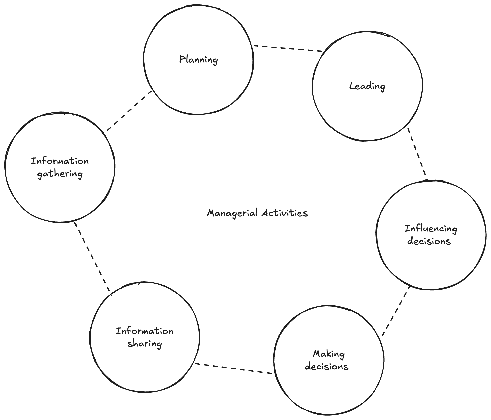
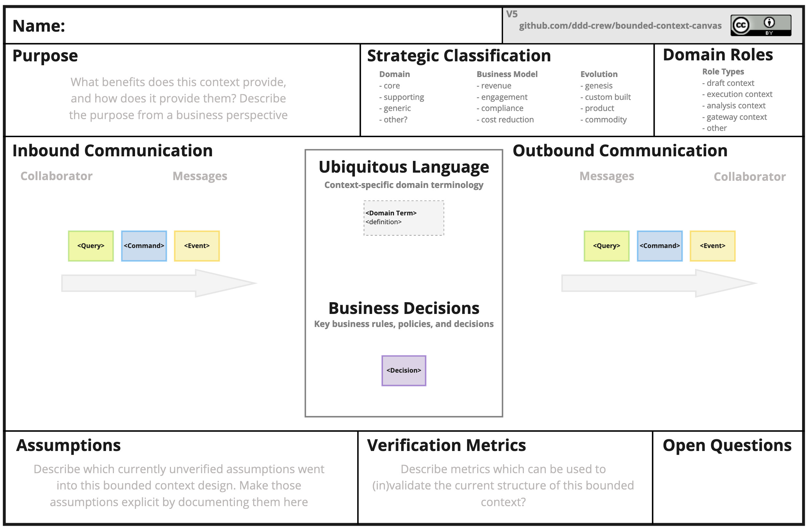

이번 포스팅에서는 타직군과의 소통에 대한 이야기를 해보려고 한다.

개발을 하면서 필자가 코드를 작성하는만큼 시간을 많이 할애하는 것은 무엇을 만들어야 하는지 알아내는 일이다. 기획자와 요구사항을 주고받고, 디자이너와 화면을 맞추고, 도메인을 아는 사람과 용어에 대해 무엇을 뜻하는지 묻는다. 그리고 이 과정이 어긋났을 때의 비용이 코드를 잘못 쓴 비용보다 훨씬 크다는 것을 몇 번 겪었다.

최근에 James Samuel이 쓴 [엔지니어링 리더의 일상 활동](https://softwareleads.substack.com/p/engineering-leaders-day-to-day-activities)이라는 글을 읽었다. 저자는 리더의 업무를 여섯 가지로 나누는데, 가장 먼저 다루는 것이 정보 수집이었다. 모든 결정과 방향과 행동이 지금 무슨 일이 벌어지고 있는지에 대한 정확한 이해에 의존한다는 이유에서다.

필자는 언젠가 리더 역할을 하고 싶다는 생각을 갖고 있는데, 이 대목을 읽고 나서 든 생각은 조금 달랐다. **리더가 가장 먼저 다루는 일이 정보 수집이라면, 실무자에게 그 대응물은 요구사항 파악이다.** 지금 요구사항을 다루는 방식이 나중에 조직의 정보를 다루는 방식이 될 것이다.

이 글에서 리더십에 관한 이야기를 하려는 것은 아니다. 지금 실무자로서 타직군과 소통할 때 무엇을 잘못하고 있었고 무엇을 도구로 쓸 수 있는지에 대한 이야기다. 결론부터 말하면 필자는 이 문제가 태도만의 문제가 아니라고 생각하게 됐다. 그 대신 쓸 수 있는 표현으로 공유 언어(ubiquitous language)라는 내용이 있는데, 무엇인지 알아보자.

## 같은 단어, 다른 뜻

Martin Fowler는 [Bounded Context](https://martinfowler.com/bliki/BoundedContext.html) 글에서 전기 회사 사례를 든다. 필자가 겪은 어긋남의 상당 부분은 이 형태였다.

::::quote
:::translation
여기서 'meter'라는 단어는 조직의 서로 다른 부분에서 미묘하게 다른 뜻이었다. 전력망과 한 장소의 연결인지, 전력망과 한 고객의 연결인지, 아니면 물리적 계량기 자체인지.
:::

:::original
here the word 'meter' meant subtly different things to different parts of the organization: was it the connection between the grid and a location, the grid and a customer, the physical meter itself
:::
::::

같은 "meter"라는 단어가 조직의 부서마다 미묘하게 다른 것을 뜻했다는 것이다. 그리고 Fowler는 이런 혼란이 특정 사례의 우연이 아니라고 덧붙인다. Customer나 Product 같은 다의어에서 같은 혼란이 계속 반복되는 것을 봐왔다는 것이다.

**이건 회의 참가자들이 회의를 잘 못해서 생긴 일이 아니었다.** 조직에 서로 다른 맥락이 있으면 같은 단어가 갈라지는 것이 자연스럽고, 그것을 방치하면 코드까지 갈라진다.

이 이야기의 기술적 배경에 대해서는 [도메인 모델](/260418)에서 한 번 다뤘다. 그때는 코드 안에서 모델을 어떻게 표현할지를 이야기했다. 이 글에서는 그 모델이 만들어지기 전, 사람들 사이의 대화 단계를 다룬다.

## 두가지 의미의 단어

그런데 왜 이런 일이 구조적으로 반복되는 걸까. 두 갈래의 설명이 있다.

하나는 조직 구조 쪽이다. Mel Conway가 1968년 Datamation에 실은 논문 [How Do Committees Invent?](https://melconway.com/Home/Committees_Paper.html)는, 조직이 자신의 커뮤니케이션 구조를 유연하게 바꾸지 못하는 만큼 그 조직은 자기 이미지를 만들어내는 모든 설계물에 찍어낸다고 말한다. 흔히 Conway의 법칙으로 인용되는 한 문장은 사실 저자가 훗날 스스로 정식화한 표현인데, 1968년 본문의 이 서술이 더 직접적이라고 느껴진다.

필자가 이 문장에서 실무적으로 읽어낸 부분은 "찍어낸다"는 표현이다. 용어가 갈라지는 것이 대화에서 끝나지 않고 **산출물에 그대로 남는다**는 얘기이기 때문이다. 앞의 "meter"이 그렇다. "meter"의 범위를 서로 다르게 이해한 채로 각자 만들면, 그 차이는 회의록이 아니라 테이블 이름과 API 응답 필드와 화면의 문구에 남는다. 그리고 그때부터는 고치는 비용이 대화를 한 번 더 하는 비용과 비교가 안 되게 커진다.

여기서 실무자가 할 수 있는 일과 할 수 없는 일이 갈린다. 조직의 커뮤니케이션 구조를 바꾸는 것은 실무자의 손을 벗어난다. 그런데 **용어의 경계를 눈에 보이게 만드는 것**은 지금 자리에서 할 수 있다. 이 문서에서 말하는 단어의 뜻이 어느 범위인지 적어두고, 다른 팀이 쓰는 단어와 다르다면 다르다고 명시하는 일이다. 뒤에서 볼 도구들이 전부 그 일을 쉽게 만들어주는 장치다.

다른 하나는 조금 더 근본적이다. 인지과학 쪽에서 보면 협업은 애초에 공유된 배경 위에서만 성립한다. Herbert Clark과 Susan Brennan이 1991년에 쓴 [Grounding in Communication](https://web.stanford.edu/~clark/1990s/Clark,%20H.H.%20_%20Brennan,%20S.E.%20_Grounding%20in%20communication_%201991.pdf)은 피아노 듀엣을 예로 들며 시작한다. 두 연주자는 방대한 양의 공유 정보, 즉 common ground를 가정하지 않고는 내용을 맞추는 일조차 시작할 수 없다는 것이다. 여기서 common ground는 상호 지식과 상호 신념, 상호 가정을 뜻한다. 그리고 저자들은 모든 집단 행동이 common ground와 그것의 축적 위에 세워진다고 못 박는다.

필자가 이 두 갈래를 나란히 놓고 본 뒤에 얻은 관점은 이렇다. **용어가 어긋나는 것은 사고가 아니라 기본 상태다.** 맞춰져 있는 상태가 오히려 유지 비용을 들여야 하는 예외다. 그러면 그 비용을 누가 어떻게 지불할 것인가가 실무의 질문이 된다.

## 적극적인 감시

Evans는 2003년에 낸 Domain-Driven Design에서 ubiquitous language, 우리말로 옮기면 편재하는 언어 혹은 **공유 언어**라는 패턴을 제시한다. 흔히 "개발자와 도메인 전문가가 같은 용어를 쓰자"는 정도로 요약되지만, 원서를 읽어보면 처방이 훨씬 구체적이다. 모델을 언어의 뼈대로 삼고, 팀 내 모든 커뮤니케이션과 코드에서 그 언어를 끈질기게 쓰기로 팀이 약속하라고 요구한다. 그리고 그다음에 이어지는 문장이 필자에게 가장 중요했다.

::::quote
:::translation
도메인 전문가는 도메인 이해를 전달하기에 어색하거나 부적절한 용어 또는 구조에 이의를 제기하고, 개발자는 설계에 문제를 일으킬 모호함이나 비일관성을 살핀다.
:::

:::original
Domain experts object to terms or structures that are awkward or inadequate to convey domain understanding, while developers watch for ambiguity or inconsistency that will trip up design.
:::
::::

도메인 전문가는 도메인 이해를 전달하기에 어색하거나 부족한 용어와 구조에 이의를 제기하고, **개발자는 설계를 넘어뜨릴 모호함이나 비일관성을 감시한다**는 것이다.

이 문장을 읽고 필자는 자기 역할에 대한 이해를 고쳤다. 그동안 필자는 요구사항 회의에서 스스로를 수신자로 여겼다. 기획이 정해지면 그것을 정확히 받아서 구현하는 것이 필자의 일이라고 생각했다. 그런데 Evans가 규정한 개발자의 몫은 수신이 아니었다. **모호함을 발견해서 되돌려주는 것이다.** 이건 소극적 협조가 아니라 적극적 감시다.

(참고로 Fowler는 자신의 글에서 이 문장을 "Domain experts **should** object ... developers **should** watch" 로 옮겼다. 원서에는 조동사가 없다. 사소한 차이지만 원서 쪽이 더 단정적으로 읽힌다. 그렇게 하는 것이 좋다는 권고가 아니라, 그렇게 하는 것이 이 패턴의 정의라는 어조다.)

그렇다면 모호함은 어떻게 발견할까. Evans는 여기에도 답을 준다. 대화에서 반복해서 쓰면 용어 해석의 차이가 드러난다는 것이다. 필자는 이 문장을 이렇게 읽었다. 모호함은 문서를 정독해서 찾는 게 아니다. 기획서를 아무리 꼼꼼히 읽어도 "meter"이라는 단어가 여러 가지를 뜻한다는 사실은 드러나지 않는다. 그 단어를 실제 사례에 대고 반복해서 써봐야 갈라진다. "다른 분들은 meter 를 어떤 의미로 이해하고 계신가요?" 같은 질문이 나오는 순간이 그 지점이다.

## 최소 협력 노력의 원리

우리는 이 방법을 알고도 실천하지 못한 시기가 있을것이다. 그럼 왜 반복해서 물어보지 않았을까?

다시 Clark과 Brennan의 논문으로 돌아가보자. 저자들은 말한 것을 common ground의 일부로 만들어가는 과정에 grounding이라는 이름을 붙인다. 그리고 사람들이 이 과정에서 어떻게 행동하는지에 대해 원리 하나를 제시한다. 최소 협력 노력의 원리(the principle of least collaborative effort)다. 사람은 필요한 것보다 더 열심히 일하기를 좋아하지 않는다는 관찰에서 나온 원리다.

여기서 중요한 대목이 나온다.

::::quote
:::translation
최소 협력 노력의 원리에 따르면, 사람들은 필요한 만큼의 공동 노력만 들여 서로의 이해를 맞추려 해야 한다. 그러나 어떤 일에 노력이 드는지는 소통 매체에 따라 크게 달라진다.
:::

:::original
By the principle of least collaborative effort, people should try to ground with as little combined effort as needed. But what takes effort changes dramatically with the communication medium.
:::
::::

**노력이 드는 지점이 매체에 따라 극적으로 달라진다는 것이다.** 어떤 매체에서 쓸 수 있는 확인 기법이 다른 매체에서는 아예 불가능하거나, 가능하더라도 비용이 훨씬 크다. 저자들은 특히 말하는 즉시 상대가 받지 못하는 매체에서는 남이 오해를 고쳐주기를 기대하는 비용이 매우 커지므로, 말하는 사람이 그걸 피하려 든다고 지적한다.

여기서 한 가지 짚고 갈 것이 있다. 이 논문은 1991년에 쓰였고, 저자들이 비교한 매체는 대면 대화와 전화, 편지, 자동응답기 같은 것들이다. **슬랙이나 노션을 다루지 않는다.** 매체에 따라 grounding 비용이 달라진다는 틀은 저자들의 것이고, 그것을 지금의 비동기 업무 채널에 적용하는 것은 필자의 해석이다.

그렇게 적용해서 보면 필자가 왜 반복해서 묻지 않았는지가 설명된다. 기획서를 텍스트로 받아서 텍스트로 확인하는 환경에서, 애매한 지점마다 확인 메시지를 보내는 일은 비용이 크다. 답이 언제 올지 모르고, 여러 번 물으면 이해하지 못한 것처럼 보일까 걱정된다. 그러니 사람은 자연스럽게 자기 해석으로 넘어간다.

여기서 힘이 두 개라는 점을 구분해둘 필요가 있다. 하나는 매체가 확인 비용을 올린다는 것이고, 이건 Clark과 Brennan의 얘기다. 다른 하나는 여러 번 물으면 무능해 보일까 걱정하는 것인데, 이건 그들의 원리가 예측하는 바가 아니라 뒤에 나올 심리적 안전감 쪽 이야기다. 정확히 말하면 최소 협력 노력의 원리가 예측하는 것은 **더 싼 확인 방법을 고른다**이지 확인을 그만둔다가 아니다. 확인을 접고 추측으로 넘어가는 것은 원리의 작동이 아니라 grounding의 실패다. 그리고 그 해석이 틀렸다는 사실은 구현이 끝난 뒤에 드러난다.

## 충분한 수준까지의 도달

그러면 애매한 것마다 다 물어봐야 하는 걸까. 그건 현실적이지 않고, 필자는 그렇게 하는 사람도 본 적이 없다. 이 질문에 대해서도 논문이 기준을 제시한다. grounding criterion이다. 상대가 말한 사람의 뜻을 **현재 목적에 충분한 수준까지** 이해했다고 양쪽이 서로 믿는 상태를 가리킨다. 저자들은 그 앞에 완벽한 이해는 애초에 불가능하다는 문장을 덧붙여 둔다.

필자에게 이 기준이 실용적으로 느껴진 이유는 목표를 낮춰주기 때문이다. 요구사항을 완벽하게 이해할 필요는 없다. **지금 하려는 일에 충분한 만큼 서로 믿을 수 있으면 된다.** 그리고 저자들은 목적이 바뀌면 기준도 바뀌어야 한다고 말한다.

이 부분이 실무에서는 확인의 강도를 조절하는 기준이 된다. 아직 방향을 탐색하는 자리에서 "여기서 meter은 어떤 의미로 해석되나요?"를 붙잡고 늘어지면 대화가 진도를 못 나간다. 그 단계에서 필요한 것은 무엇을 왜 하려는지에 대한 합의이지 경계값의 확정이 아니다. 반대로 구현에 들어가기 직전에는 그 질문이 반드시 나와야 한다. 이때는 "meter"이 어느 범위인지 서로 같은 것을 떠올리고 있다고 믿을 수 있어야 하고, 그렇지 않으면 잘못된 전제 위에 코드가 쌓인다.

그래서 필자는 같은 애매함을 만나도 **지금이 어느 단계인지에 따라 다르게 처리한다.** 탐색 단계에서는 목록에 적어두고 넘어가고, 구현 직전에는 그 목록을 열어 하나씩 닫는다. 확인을 미루는 것과 확인을 포기하는 것은 다른 일이다.

이 지점에서 함께 쓰기 좋은 도구가 하나 있다. Matthew Skelton과 Manuel Pais의 Team Topologies는 팀 사이의 상호작용을 세 모드로 구분한다. 정해진 기간 동안 함께 새로운 것을 발견하는 collaboration, 한쪽이 제공하고 한쪽이 소비하는 X-as-a-Service, 한쪽이 다른 쪽을 도와주고 멘토링하는 facilitation이다.

원래는 조직 설계 이야기지만, 필자는 이걸 회의 단위로 축소해서 쓰는 게 실용적이라고 느꼈다. **지금 이 대화가 어떤 모드인지 서로 다르게 알고 있으면 회의가 어긋난다.** 기획자는 이미 정해진 것을 전달하는 자리라고 생각하는데 개발자는 함께 발견하는 자리라고 생각하면, 개발자의 질문은 협업이 아니라 딴지로 들린다. 반대 경우도 있다. 개발자가 확정된 스펙을 받으러 왔는데 기획자는 아직 탐색 중이었다면, 개발자는 스펙이 없다고 답답해한다.

그래서 필자는 요즘 회의 초반에 이걸 먼저 확인한다. "이건 아직 열려 있는 건가요, 아니면 정해진 걸 확인하는 자리인가요?" 이 질문 하나가 그 뒤의 대화 성격을 바꾼다. grounding criterion을 목적에 맞춰 조정하는 일과 같은 얘기다.

## 해상도가 맞지 않으면 대화가 겉돈다

모드를 맞췄다고 해도 남는 문제가 있다. 필자가 자주 겪은 또 다른 어긋남은 서로 다른 **해상도**로 말하고 있는 상황이었다.

기획자가 문장으로 준 요구사항은 대체로 너무 추상적이다. "사용자가 예약 내역을 편하게 확인할 수 있게" 같은 문장에서는 화면이 몇 개인지, 어디서 어디로 넘어가는지가 나오지 않는다. 반대로 디자이너가 준 시안은 너무 구체적이다. 버튼의 색과 여백까지 정해져 있어서, 정작 "이 흐름이 맞는가"를 논의하기 어렵다.

Basecamp의 Ryan Singer가 쓴 Shape Up이 이 문제를 정확히 짚는다. 와이어프레임이나 구체적인 시각 레이아웃부터 시작하면 불필요한 디테일에 갇혀서 필요한 만큼 넓게 탐색할 수 없게 된다는 것이다. 그래서 [Shape Up이 제안하는 것](https://basecamp.com/shapeup/1.3-chapter-04)은 그 사이의 표현이다. breadboarding이라고 부르는데, 전기공학에서 개념을 빌려왔다. 브레드보드는 실제 기기의 부품과 배선은 다 갖췄지만 산업 디자인은 없는 시제품이다. 그래서 그리는 것도 딱 세 가지다. 넘어갈 수 있는 장소(places), 사용자가 조작할 수 있는 것(affordances), 그리고 그 조작이 사용자를 어디로 데려가는지 보여주는 연결선(connection lines)이다.

필자가 이 기법을 좋게 본 이유는, 개발자가 만들 수 있는 산출물이기 때문이다. 기획자에게 더 자세히 써 달라고 요청하거나 디자이너에게 시안을 기다리지 않고, 지금 이해한 흐름을 그 자리에서 그려서 "이렇게 이해했는데 맞나요" 라고 되돌려줄 수 있다. Evans가 말한 감시(모호함을 되돌려주기)를 실행하는 구체적 방법인 셈이다. 그리고 앞 절의 관점에서 보면, 이건 grounding 비용을 낮추는 장치다. 그림 한 장이 텍스트로 주고받는 확인 여러 번을 대신한다.

그런데 이 해상도는 유지하기가 생각보다 어렵다. 흐름을 그리다 보면 자연스럽게 "여기 버튼은 오른쪽 아래에 두는 게 낫지 않나" 같은 이야기로 내려가게 된다. 필자도 몇 번 그랬다. 그렇게 한 번 내려가면 그 자리에서 논의되던 질문, 그러니까 이 흐름이 맞는가는 조용히 사라진다. 아직 흐름이 확정되지 않았는데 버튼 위치를 정하고 있으면, 나중에 흐름이 바뀔 때 그 논의는 통째로 버려진다.

그래서 필자는 이 단계에서 **일부러 못 그린 그림**을 유지하려고 한다. 네모와 화살표와 이름뿐인 그림이면 상대도 디테일을 지적할 생각을 하지 않고 흐름에만 반응한다. 그림의 완성도가 낮은 것이 이 도구에서는 기능인 셈이다. (예쁘게 그리고 싶은 마음을 누르는 게 생각보다 어렵다)

추상화 수준이라는 개념 자체가 협업의 도구가 될 수 있다는 점은 [추상화](/260201)에서 다뤘던 이야기와도 이어진다. 그때는 코드의 추상화 수준을 말했는데, 대화에도 같은 것이 있다.

## 규칙과 예시와 질문을 분리하기

해상도를 맞추는 또 하나의 방법은 논의 자체를 구조화하는 것이다.

Cucumber 프로젝트를 이끈 Matt Wynne이 2015년에 소개한 [Example Mapping](https://cucumber.io/blog/bdd/example-mapping-introduction/)을 살펴보자. 그는 많은 팀이 요구사항 논의를 어려워하는 이유를 구조가 없어서 오래 걸리고 지루해지기 때문이라고 진단한다. 그래서 규칙적으로도, 일관되게도 하지 않게 된다는 것이다. 필자도 정확히 그랬다. 요구사항 회의가 길어지면 다음부터는 짧게 끝내려 하고, 짧게 끝내면 애매한 것들이 그대로 남는다.

Example Mapping은 네 색의 카드로 논의를 나눈다. 노란색은 지금 다루는 스토리, 파란색은 규칙 혹은 수용 기준, 초록색은 그 규칙을 설명하는 구체적 예시, 그리고 빨간색은 답을 모르는 질문이다.

필자는 이 중에서 **빨간색 카드가 핵심이라고 생각한다.** 나머지 셋은 정리 기법이지만, 빨간 카드는 "모르겠다"를 회의의 정식 산출물로 만드는 장치다. 모른다는 사실을 말하는 것이 회의를 지연시키는 행동이 아니라 회의가 생산해야 하는 결과물이 된다.

이게 왜 중요한지는 반대 경우를 떠올려보면 분명해진다. 빨간 카드가 없는 회의에서 애매한 지점을 만나면 선택지는 두 개다. 지금 붙잡고 늘어져서 회의를 늘리거나, 넘어가서 나중에 혼자 해석하는 것이다. 앞 절에서 본 대로 사람은 대체로 후자를 고른다. 그런데 카드가 한 장 있으면 세 번째 선택지가 생긴다. **적어두고 넘어가되 사라지지 않게 하는 것이다.** 회의는 계속 진행되고, 애매함은 없어지지 않은 채로 목록에 남는다.

초록색 카드도 비슷한 역할을 한다. 규칙만 적으면 다들 동의하지만, 그 규칙을 설명하는 구체적 예시를 적으려는 순간 해석이 갈린다. Evans가 말한 "대화에서 반복해서 쓰면 차이가 드러난다"를 회의 양식으로 옮겨놓은 셈이다. 규칙 하나에 예시를 세 개씩 붙여보라고 하면, 그중 하나에서 대체로 "어? 이 경우는 어떻게 되죠?"가 나온다. (필자의 경험상 그 질문이 나오지 않는 회의는 다들 이해한 회의가 아니라 각자 다르게 이해한 회의였다)

비슷한 발상으로 BDD 쪽에서 오래 쓰인 Three Amigos도 있다. 비즈니스와 개발과 테스트라는 세 관점이 각각 다른 질문을 던진다는 것인데, [Agile Alliance 용어집](https://www.agilealliance.org/glossary/three-amigos/)은 그 질문을 각각 무슨 문제를 풀려는 것인지, 그 문제를 풀 해법을 어떻게 만들 것인지, 그리고 이건 어떤가 무슨 일이 일어날 수 있는가로 정리한다. 세 번째 질문이 나오지 않는 회의가 어떻게 되는지는 굳이 설명하지 않아도 될 것 같다.

## 모르는것을 확인해보는 절차를 만들어보자.

그런데 왜 우리는 빨간 카드를 잘 꺼내지 못할까. 여기서 심리적 안전감 이야기를 하지 않을 수 없다.

Amy Edmondson이 1999년에 Administrative Science Quarterly에 실은 [논문](https://web.mit.edu/curhan/www/docs/Articles/15341_Readings/Group_Performance/Edmondson%20Psychological%20safety.pdf)이 팀 심리적 안전감이라는 개념을 정식으로 세운 연구다. (논문 자신은 1965년 Schein과 Bennis의 연구를 뿌리로 밝히고 있다) 팀 심리적 안전감을 팀이 대인관계상의 위험을 감수해도 안전한 곳이라는 공유된 믿음으로 정의한다. 모른다고 말하는 것, 반대 의견을 내는 것, 실수를 인정하는 것이 여기 해당한다. 논문은 제조업 회사의 51개 팀을 조사해서, 심리적 안전감이 학습 행동과 연관되고 그 학습 행동이 심리적 안전감과 팀 성과 사이를 매개한다는 결과를 보였다.

그런데 필자가 이 논문에서 가장 실용적이라고 느낀 문장은 정의가 아니라 그 바로 다음이었다.

::::quote
:::translation
대부분 이 믿음은 암묵적인 경향이 있다. 개인이나 팀 전체가 당연하게 여기며 직접 주의를 기울이지 않는다.
:::

:::original
For the most part, this belief tends to be tacit—taken for granted and not given direct attention either by individuals or by the team as a whole.
:::
::::

이 믿음은 대개 **암묵적**이고, 개인도 팀도 직접 주의를 기울이지 않는다는 것이다.

여기서부터는 필자의 추측이다. 논문이 말한 것은 이 믿음이 암묵적이라는 데까지이고, 그러니 양식을 만들면 된다는 처방은 논문에 없다. 다만 암묵적인 것이 선언으로 바뀌지 않는다는 것은 여러 번 봤다. "우리 팀은 모르는 걸 물어봐도 되는 팀이에요" 라고 말하는 것으로는 잘 바뀌지 않는다. 그래서 필자는 앞 절의 빨간 카드가 중요하다고 생각한다. **모르겠다는 말을 양식 안의 칸으로 만들어버리면, 그것을 채우는 일이 용기가 아니라 절차가 된다.**

물론 반문이 가능하다. 안전하지 않은 팀에서는 빨간 카드 칸도 그냥 비어 있을 것이다. 맞는 지적이고, 이 도구가 안전감을 만들어낸다고 주장할 생각은 없다. 다만 칸이 있으면 최소한 **비어 있다는 사실이 눈에 보인다.** 아무도 모르는 게 없어서 비었는지, 말하기 어려워서 비었는지를 물어볼 자리가 생긴다.

같은 발상이 실제 문서 양식에도 들어가 있다. DDD 커뮤니티가 만든 [Bounded Context Canvas](https://github.com/ddd-crew/bounded-context-canvas)를 보면, 하나의 컨텍스트를 설계하고 기록하는 협업 도구인데 칸 구성이 흥미롭다. 이름과 목적, 전략적 분류, 도메인 역할, 인바운드와 아웃바운드 커뮤니케이션, 그리고 **Ubiquitous Language**, 비즈니스 결정, **Assumptions**, 검증 지표, **Open Questions** 다.

공유 언어를 적는 칸과 가정을 적는 칸과 열린 질문을 적는 칸이 각각 따로 있다. 캔버스의 설명은 목적을 적는 행위 자체가 흐릿한 생각을 명확히 말하도록 강제하고 팀 전체를 같은 페이지에 놓는다고 말한다.

필자는 이 발상이 소통 문제에 대한 가장 현실적인 접근이라고 생각한다. 사람의 태도를 바꾸려 하는 대신, **말하기 어려운 것에 칸을 만들어주는 것이다.** 좋은 구조는 사람이 잘하도록 요구하는 대신 잘하기 쉽게 만들어준다.

## 이게 취향의 문제가 아닌 이유

여기까지 읽으면 이런 반응이 나올 수 있다. 좋은 얘기지만 결국 커뮤니케이션을 열심히 하자는 것 아닌가. 그건 성향 아닌가.

필자도 한동안 그렇게 생각했다. 그런데 이 부분에 데이터가 있다.

DORA는 조직 문화를 다룰 때 사회학자 Ron Westrum의 분류를 가져온다. 권력 지향의 pathological, 규칙 지향의 bureaucratic, 성과 지향의 generative 세 가지다. 그리고 [DORA의 공식 문서](https://dora.dev/capabilities/generative-organizational-culture/)는 자신들의 연구 결과를 이렇게 요약한다.

::::quote
:::translation
신뢰가 높고 정보 흐름을 중시하는 조직 문화는 소프트웨어 배포 성과를 예측한다.
:::

:::original
organizational culture that is high-trust and emphasizes information flow is predictive of software delivery performance
:::
::::

신뢰가 높고 **정보 흐름을 중시하는** 조직 문화가 소프트웨어 배포 성과를 예측한다는 것이다. 소통이 잘 되는 팀이 기분이 좋다는 얘기가 아니라 성과와 함께 움직이는 변수라는 얘기다.

다만 여기서 예측한다는 말을 인과로 읽으면 안 된다. DORA의 데이터는 같은 응답자가 문화와 성과를 함께 답한 설문이고, 조직 수준의 상관이다. 조직에 만족한 사람이 양쪽 다 후하게 답했을 가능성이 남아 있고, 조직 수준의 관계에서 개인이 이렇게 행동하라는 처방이 곧바로 나오지도 않는다. 그러니 이 자료로 말할 수 있는 것은 여기까지다. 정보 흐름은 취향의 영역에만 있는 것이 아니라 성과와 같이 움직이는 자리에 있다.

같은 문서는 Westrum이 말한 좋은 정보의 세 가지 성질도 정리해 두었다. 수신자가 필요로 하는 질문에 답을 주고, 시기가 적절하며, 수신자가 효과적으로 쓸 수 있는 방식으로 제시된다는 것이다. 세 가지 모두 기준이 **수신자**에 있다는 점을 눈여겨볼 만하다. 많이 공유하는 것이 좋은 정보 흐름이 아니다.

Google의 Project Aristotle도 자주 인용되는 자료다. [reWork에 공개된 내용](https://rework.withgoogle.com/intl/en/guides/understand-team-effectiveness)에 따르면 180개 팀을 조사하고 수백 개 변수에 35개 이상의 통계 모델을 돌렸으며, 팀 효과성에 영향을 주는 다섯 가지 요인으로 심리적 안전감, 신뢰성, 구조와 명확성, 의미, 영향력을 제시했다. 그리고 결론은 팀에 누가 있는지보다 그 팀이 어떻게 함께 일했는지가 중요했다는 것이었다.

다만 한 가지 짚어두고 싶다. 공식 페이지는 다섯 요인을 중요도 순으로 나열한다고 밝히고 있고 심리적 안전감을 맨 앞에 둔다. 그런데 이 연구를 인용한 글들에서 자주 보이는 "압도적으로 1위" 같은 크기 표현은 그 페이지에 없다. 순서가 있다는 것과 나머지를 압도한다는 것은 다른 얘기다. 그래서 이 글에서는 크기를 주장하지 않는다. 심리적 안전감의 중요성을 말하려면 앞 절의 Edmondson 원 논문에 기대는 것이 정확하다.

## 다시 리더 이야기로

처음에 인용한 글로 돌아가보자.

James Samuel은 정보 수집을 가장 먼저 다루면서, 실무자 시절의 방법이 통하지 않게 된다고 말한다. 개인 기여자일 때는 자기 일의 전체 그림을 갖고 있지만, 사람에 대한 책임을 지게 되면 예전 방법을 쓸 수 없다는 것이다. 그래서 필요한 역량으로 노이즈를 걸러내고 정보를 종합해 일관된 현실의 그림으로 만드는 능력을 꼽는다. 어떤 관리자도 모든 것을 처리할 수는 없기 때문이다.

필자는 이것이 앞서 본 Westrum의 좋은 정보 세 가지 성질과 같은 얘기라고 느꼈다. 많이 모으는 것이 아니라 쓸 수 있는 형태로 만드는 것이다. 그리고 그건 지금 요구사항을 다루면서 하고 있는 일과 다르지 않다. 기획서의 문장에서 애매한 부분을 골라내고, breadboard로 다시 그려서 확인하고, 모르는 것을 빨간 카드로 남기는 일이 바로 노이즈를 걸러 일관된 그림을 만드는 연습이다.

저자가 의사결정에 대해 남긴 말도 기억에 남는다. 확실성을 기다리는 것도 그 자체로 하나의 결정이고 비용을 수반한다는 것이다. 요구사항이 완전히 명확해질 때까지 기다리는 것도 마찬가지다. 그래서 완벽한 이해가 아니라 현재 목적에 충분한 수준이라는 grounding criterion이 실용적인 기준이 된다.

## 마치며

정리하면 이렇다.

타직군과의 소통 실패는 대개 태도만의 문제가 아니다. 조직에 서로 다른 맥락이 있으면 같은 단어가 갈라지는 것이 기본 상태이고, 맞춰진 상태가 오히려 비용을 들여 유지해야 하는 예외다. 그 비용을 지불하는 방식이 공유 언어이고, 그 안에서 개발자의 몫은 요구사항을 받아쓰는 것이 아니라 모호함을 감시해서 되돌려주는 것이다.

그런데 되돌려주는 일에는 노력이 들고, 사람은 그 노력을 최소화하려 한다. 그래서 필자는 의지에 기대는 대신 세 가지를 쓰기로 했다. 이 대화가 어떤 모드인지 먼저 확인하는 것, 말과 시안 사이의 해상도로 흐름을 그려서 되돌려주는 것, 그리고 모르는 것을 적는 칸을 회의 양식 안에 만들어두는 것이다. 셋 다 태도를 고치라고 요구하지 않고 하기 쉽게 만드는 쪽이다.

필자는 아직 리더가 아니고, 이 글에 적은 것들도 그 자리에서 검증해본 것이 아니다. 팀 규모나 조직 문화가 다르면 통하지 않는 것도 있을 것이다. 다만 하나는 지금 확신할 수 있을 것 같다. 나중에 정보를 다루는 방식은 새로 배우는 것이 아니라, 지금 요구사항을 다루는 습관이 그대로 커진 형태일 것이다. 그래서 필자는 요즘 회의에서 "그건 무슨 뜻인가요" 라고 묻는 일을 예전만큼 부끄러워하지 않으려 한다.

이 글을 읽는 독자 분들도 최근 회의에서 고개를 끄덕였지만 실은 확실하지 않았던 단어가 하나쯤 떠오른다면, 다음에는 그 단어를 한 번 더 써보시기를 권한다. 반복해서 쓰면 드러난다.

:::ref
- [article] [Martin Fowler, Ubiquitous Language](https://martinfowler.com/bliki/UbiquitousLanguage.html)
- [docs] [Eric Evans, Domain-Driven Design Reference](https://www.domainlanguage.com/ddd/reference/)
- [docs] [Team Topologies, Key Concepts](https://teamtopologies.com/key-concepts)
- [docs] [Basecamp, Shape Up: Set Boundaries](https://basecamp.com/shapeup/1.2-chapter-03)
- [article] [Alberto Brandolini, EventStorming](https://www.eventstorming.com/book/)
- [article] [Stefan Hofer, Henning Schwentner, Domain Storytelling](https://domainstorytelling.org/)
- [article] [Gojko Adzic, Specification by Example](https://gojko.net/books/specification-by-example/)
:::
