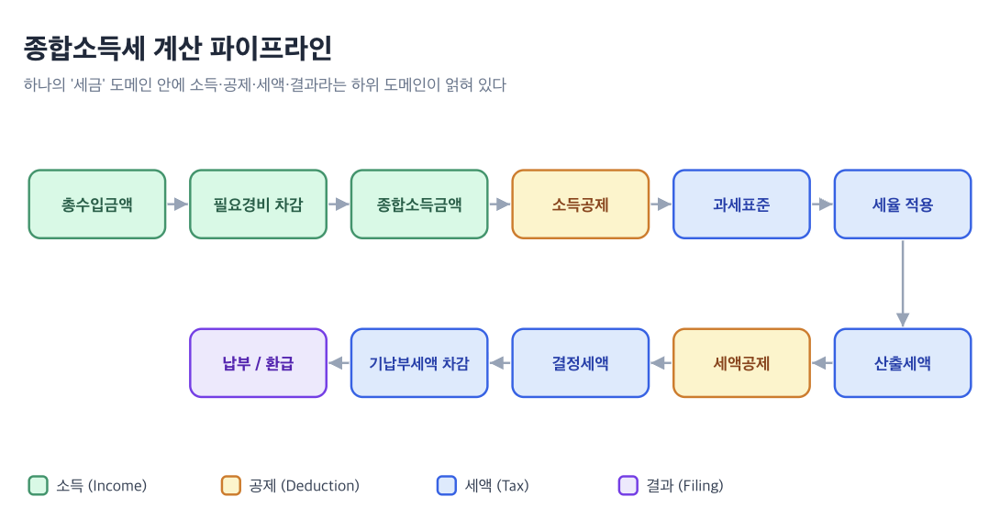

Neste post, quero falar sobre **como domínio, modelo de domínio e objeto de domínio se diferenciam**.

É para desenvolvedores frontend que, lendo sobre DDD, ficaram em dúvida se essas palavras apontam para a mesma coisa. Ao final, você conseguirá colocar os quatro termos em uma única linha que desce do abstrato ao concreto e explicar por que o tipo de uma resposta da API não é um modelo de domínio.

Encontrei essas palavras com bastante frequência como desenvolvedor, mas quando alguém pergunta "o que exatamente é um domínio?", não é fácil responder com clareza. (Sinceramente, quando comecei a programar, achava que domínio era aquele do "www".) Todos os exemplos usam o cálculo do imposto de renda.

---


## Domínio (Domain)

Comecemos pela pergunta mais básica. O que é um **domínio**?

Eric Evans define domínio da seguinte forma em seu livro **Domain-Driven Design: Tackling Complexity in the Heart of Software (2003)**.

::::quote
:::translation
Uma esfera de conhecimento, influência ou atividade.
:::

:::original
"A sphere of knowledge, influence, or activity."
:::
::::

Em termos simples, domínio é a própria **área do problema que se pretende resolver por meio da programação**. Se estamos criando um serviço de declaração de impostos, "declaração de impostos" é o domínio; se estamos criando uma plataforma de sinistros de seguros, "sinistros de seguros" é o domínio. O domínio não é código. É uma área de problemas do mundo real que existe antes do software.

O que isso significa para quem desenvolve frontend? A UI que criamos é, no fim das contas, uma **janela (window)** que permite apresentar esse domínio ao usuário e possibilitar sua manipulação. Se desenvolvemos serviços de restituição de impostos como Toss Income ou 3o3, cujo domínio principal é tributário, estamos representando na UI conceitos do domínio como tipo de renda, coeficiente de despesas, dedução da renda, crédito tributário e valor da restituição. Portanto, quem desenvolve frontend também precisa compreender profundamente o domínio com que trabalha. Isso significa que entender **"qual problema este serviço resolve"** é tão importante quanto construir bons componentes de UI.

Mas até um único domínio como "impostos" contém inúmeros subdomínios quando examinado por dentro. Basta olhar para o pipeline de cálculo do imposto de renda global, que conheço apenas superficialmente.



Cada etapa desse pipeline é um subdomínio com regras e dados próprios. Dentro do grande domínio de "impostos", entrelaçam-se os subdomínios de renda (Income), deduções (Deduction), imposto (Tax) e declaração (Filing). Como dividi-los no código é justamente a questão central da modelagem de domínio.


## Modelo de domínio (Domain Model)

Então, o que é um modelo de domínio? Qual é a diferença entre domínio e "modelo de domínio"?

[Martin Fowler](https://martinfowler.com/eaaCatalog/domainModel.html) define o modelo de domínio como um modelo de objetos do domínio que incorpora tanto comportamento quanto dados. A definição de Eric Evans vai um passo além.

::::quote
:::translation
Um sistema de abstrações que descreve aspectos selecionados de um domínio e pode ser usado para resolver problemas relacionados a esse domínio. — Eric Evans
:::

:::original
A system of abstractions that describes selected aspects of a domain and can be used to solve problems related to that domain.
:::
::::

O ponto central é a **"abstração seletiva"**. Um modelo de domínio não contém tudo o que existe no mundo real. Assim como um diretor de cinema não registra todas as cenas da realidade, mas escolhe apenas as necessárias para contar a história, o modelo de domínio também **seleciona e estrutura apenas os aspectos necessários para resolver o problema**.

Há um ponto importante aqui. Um modelo de domínio não precisa necessariamente ser código. Pode ser um diagrama desenhado em um quadro branco ou um modelo mental (Mental Model) compartilhado entre os integrantes da equipe. Em última análise, o próprio termo modelo de domínio pode designar um conceito independente do software.

Há uma parte que costuma confundir especialmente quem desenvolve frontend: olhar para a estrutura de uma resposta de API e pensar "este é o modelo de domínio". Mas isso é um **modelo de dados (Data Model)**, não um modelo de domínio.

Podemos distinguir modelo de dados e modelo de domínio da seguinte forma.

| Critério          | Modelo de domínio                                      | Modelo de dados                                  |
| ----------------- | ------------------------------------------------------ | ------------------------------------------------ |
| Objetivo          | Expressar conceitos e regras de negócio                | Definir a estrutura de armazenamento/transmissão |
| Linguagem         | Termos de negócio (base tributável, crédito, restituição) | Termos técnicos (string, number, array)        |
| Elementos         | Dados + comportamento (regras)                         | Apenas a estrutura dos dados                     |
| Exemplo           | "A faixa de até 14 milhões de won tem alíquota de 6%" | `{ taxableBase: number, taxRate: number }`        |

O modelo de dados define "em que formato os dados circulam", enquanto **o modelo de domínio define "o que esses dados significam para o negócio e quais regras seguem".** Quando não distinguimos os dois, os componentes passam a depender diretamente da estrutura da resposta da API, e qualquer mudança no schema do backend acaba abalando todo o frontend.


## Objeto de domínio (Domain Object)

Se o modelo de domínio é um sistema de conceitos, o **objeto de domínio** é a concretização desse conceito em código.

Em um [texto de Jason Swett](https://www.codewithjason.com/difference-domains-domain-models-object-models-domain-objects/), responsável pelo Code with Jason, o objeto de domínio é definido assim.

::::quote
:::translation
Eu chamaria de objeto de domínio qualquer objeto do meu modelo de objetos que também exista como conceito no meu modelo de domínio.
:::

:::original
Any object in my object model that also exist as a concept in my domain model I would call a domain object.
:::
::::

Ou seja, se existe o conceito de "renda global" no modelo de domínio e um tipo chamado `Income` no código, esse `Income` é um objeto de domínio. Mas nem todo objeto no código é um objeto de domínio. Elementos como `HttpClient`, `LocalStorageAdapter` e `useDebounce` são ferramentas técnicas, não conceitos do domínio.


### Entity e Value Object

Evans classifica os objetos de domínio em três categorias: **Entity**, **Value Object** e **Service**. (Martin Fowler chama essa divisão de "Evans Classification".) Service é um conceito separado que representa "uma operação de domínio que não pertence naturalmente a um objeto específico". Como o foco deste texto é a forma de identificar os dados, examinaremos principalmente Entity e Value Object.

Uma **Entity** é um objeto com identidade própria que persiste ao longo do tempo e entre diferentes representações. Uma declaração de impostos (TaxFiling), um contribuinte (Taxpayer) e um registro de renda (IncomeRecord) são identificados por um ID próprio; mesmo que seus atributos mudem, continuam sendo a mesma Entity se o ID for o mesmo. Ainda que os itens de dedução de uma declaração sejam alterados, ela continua sendo a mesma declaração enquanto seu ID não mudar.

Um **Value Object** é um objeto cujo significado decorre apenas da combinação de seus atributos; quando todos os atributos têm os mesmos valores, os objetos são considerados iguais. Dinheiro (Money), alíquota (TaxRate) e faixa tributária (TaxBracket) são objetos em que o próprio valor carrega o significado. Uma "alíquota de 6%" é simplesmente uma "alíquota de 6%", onde quer que seja usada.

Por que essa distinção é importante no frontend? Vejamos o exemplo de código abaixo.

```typescript
interface TaxFiling {
  id: string;
  taxpayerName: string;
  taxYear: number;
  status: FilingStatus;
}

const isSameFiling = (a: TaxFiling, b: TaxFiling) => a.id === b.id;

interface Money {
  amount: number;
  currency: "KRW" | "USD";
}

const isSameMoney = (a: Money, b: Money) =>
  a.amount === b.amount && a.currency === b.currency;
```

TaxFiling é uma Entity porque usa o id como critério de identidade. (O simples fato de ter um campo id não define uma Entity; o ponto central é que "esse id determina se é o mesmo objeto ou outro".) Money é identificado apenas pela combinação de amount e currency, sem id, e é considerado o mesmo valor quando todos os seus atributos são iguais.

Entity é comparada por ID; Value Object, por atributos. Quando essa distinção está clara, a lógica de gerenciamento de estado que decide "se estes dados são iguais ou diferentes" se organiza naturalmente. Ao atualizar um item de uma lista, por exemplo, localizamos e substituímos uma Entity pelo ID, enquanto um Value Object é substituído de forma imutável (immutable replace).


## Modelo de objetos de domínio (Domain Object Model)

Já entendemos "modelo de domínio" e "objeto de domínio", mas o que é um **modelo de objetos de domínio**?

Ao pesquisar, descobri que, surpreendentemente, não há uma definição consensual. Grande parte da literatura trata "modelo de domínio", "modelo de objetos de domínio", "modelo conceitual (conceptual model)" e "modelo de objetos de análise (analysis object model)" como **praticamente sinônimos**. Segundo essa visão, são apenas nomes diferentes para o modelo conceitual elaborado durante a análise orientada a objetos.

Há, por outro lado, quem os veja como camadas um pouco mais separadas. Uma explicação representativa é que o **modelo de objetos é justamente o ponto em que o modelo de domínio é transformado em código real**.

Nessa segunda perspectiva, o **modelo de objetos** é a estrutura de **todos os objetos de código** do sistema. Isso inclui ferramentas técnicas como `HttpClient` e `useDebounce`. Dentro dele, o **subconjunto dos objetos que representam conceitos do domínio e as relações entre eles** constitui o **modelo de objetos de domínio**. Essa visão também se alinha à tradição da modelagem orientada a objetos, que define "Object Model" como a estrutura estática de um sistema (classes, atributos, operações e relações).

Considero essa perspectiva mais prática para quem desenvolve frontend. Afinal, no código que escrevemos, objetos de domínio e objetos técnicos estão sempre misturados.

No fim, **domínio → modelo de domínio → modelo de objetos de domínio → objeto de domínio** forma uma hierarquia que vai do abstrato ao concreto. O domínio é o mais amplo, e o objeto de domínio é o mais concreto. Por isso, ao escrever código frontend, a questão prática com que realmente lidamos é **como estruturar o modelo de objetos de domínio — os tipos que representam conceitos do domínio e as relações entre eles**.


## Conclusão

Em resumo, **domínio** é a área do problema que queremos resolver; **modelo de domínio** é o sistema conceitual que abstrai seletivamente esse problema; **modelo de objetos de domínio** é a implementação desse sistema conceitual em código; e **objeto de domínio** é cada objeto individual dentro dessa implementação.

Como essa distinção aparece no código, ou seja, onde a lógica de domínio, como o cálculo de impostos, deve ficar fora dos componentes e até onde separá-la, é o tema de [Modelo de domínio](/260418).

Espero que, da próxima vez que você olhar para o tipo de uma resposta da API, pergunte a si mesmo pelo menos uma vez: "isto é um modelo de dados ou um modelo de domínio?"


### Referências

:::ref
- [article] [Eric Evans, Domain-Driven Design (Book)](https://www.amazon.com/Domain-Driven-Design-Tackling-Complexity-Software/dp/0321125215)
:::
